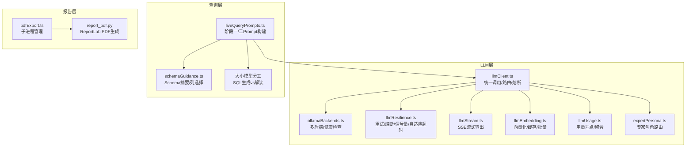
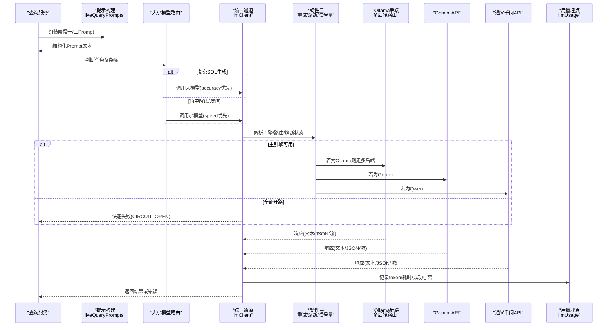
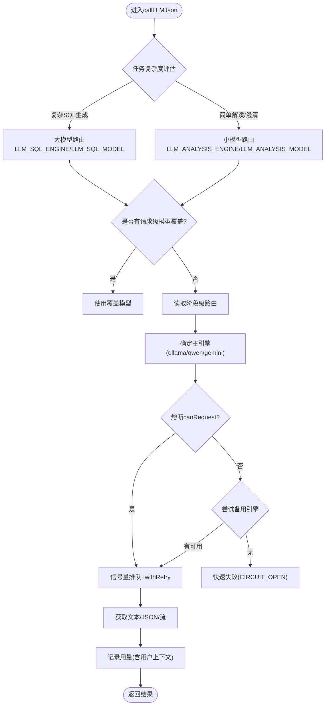
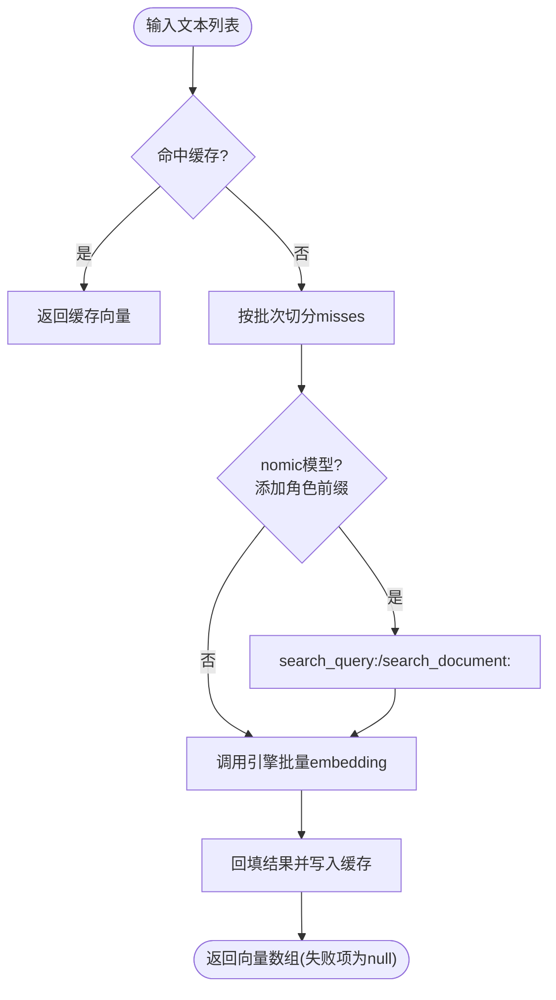
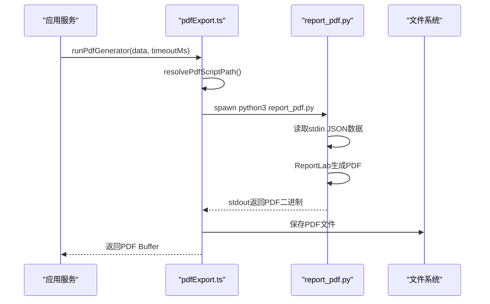
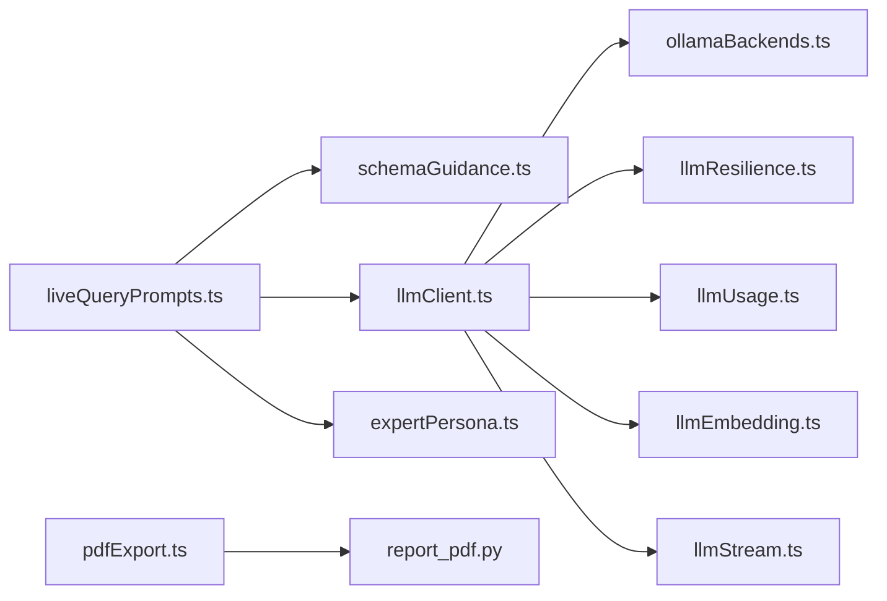

# AI与LLM集成

<cite>
**本文引用的文件**
- [llmClient.ts](file://server/llm/llmClient.ts)
- [ollamaBackends.ts](file://server/llm/ollamaBackends.ts)
- [expertPersona.ts](file://server/llm/expertPersona.ts)
- [llmResilience.ts](file://server/llm/llmResilience.ts)
- [llmEmbedding.ts](file://server/llm/llmEmbedding.ts)
- [llmStream.ts](file://server/llm/llmStream.ts)
- [llmUsage.ts](file://server/llm/llmUsage.ts)
- [liveQueryPrompts.ts](file://server/query/liveQueryPrompts.ts)
- [schemaGuidance.ts](file://server/query/schemaGuidance.ts)
- [report_pdf.py](file://server/pdfgen/report_pdf.py)
- [pdfExport.ts](file://server/report/pdfExport.ts)
</cite>

## 更新摘要
**变更内容**
- 新增大小模型分工策略：大模型负责复杂SQL生成保证准确性，小模型处理解读、澄清和兜底场景优化响应速度
- 新增Embedding向量服务：支持Ollama/Qwen/Gemini多引擎向量化，具备短TTL缓存和批量处理能力
- 新增Python ReportLab子进程PDF生成：原生矢量排版，支持中文、图表嵌入、水印等高级功能
- 完善提示工程最佳实践：强化结构化输出、上下文管理和业务口径约束

## 目录
1. [简介](#简介)
2. [项目结构](#项目结构)
3. [核心组件](#核心组件)
4. [架构总览](#架构总览)
5. [详细组件分析](#详细组件分析)
6. [依赖关系分析](#依赖关系分析)
7. [性能与成本优化](#性能与成本优化)
8. [故障排查指南](#故障排查指南)
9. [结论](#结论)
10. [附录：使用示例与调试技巧](#附录使用示例与调试技巧)

## 简介
本文件面向"智能问数据分析系统"的AI与LLM集成，聚焦多引擎统一抽象、大小模型分工策略、提示工程最佳实践、专家角色系统、容错机制（熔断降级、重试、负载均衡）、模型选择策略、成本优化与性能监控指标，并提供实际使用示例与调试技巧，帮助开发者高效利用AI能力增强系统功能。

**重要更新**：系统现已实现大小模型明确分工——大模型专注于复杂SQL生成以保证准确性，小模型处理数据解读、问题澄清和兜底场景以优化响应速度；同时新增Embedding向量服务和Python ReportLab子进程PDF生成能力。

## 项目结构
与AI/LLM相关的核心代码集中在 server/llm、server/query 和 server/pdfgen 三个目录：
- server/llm：统一LLM调用通道、多后端路由、流式输出、嵌入向量、韧性原语、用量埋点、专家角色等。
- server/query：提示词构建、Schema摘要注入、阶段一/阶段二Prompt编排，支撑NL2SQL与分析解读。
- server/pdfgen：Python ReportLab脚本，用于高质量PDF报告生成。

**图表来源**
- [llmClient.ts:1-606](file://server/llm/llmClient.ts#L1-L606)
- [ollamaBackends.ts:1-143](file://server/llm/ollamaBackends.ts#L1-L143)
- [llmResilience.ts:1-245](file://server/llm/llmResilience.ts#L1-L245)
- [llmStream.ts:1-300](file://server/llm/llmStream.ts#L1-L300)
- [llmEmbedding.ts:1-317](file://server/llm/llmEmbedding.ts#L1-L317)
- [llmUsage.ts:1-134](file://server/llm/llmUsage.ts#L1-L134)
- [expertPersona.ts:1-329](file://server/llm/expertPersona.ts#L1-L329)
- [liveQueryPrompts.ts:1-117](file://server/query/liveQueryPrompts.ts#L1-L117)
- [schemaGuidance.ts:1-122](file://server/query/schemaGuidance.ts#L1-L122)
- [pdfExport.ts:1-132](file://server/report/pdfExport.ts#L1-L132)
- [report_pdf.py:1-294](file://server/pdfgen/report_pdf.py#L1-L294)

## 核心组件
- **统一LLM通道**：提供JSON/Text/流式三种调用模式，屏蔽Ollama/Gemini/通义千问差异，支持请求级覆盖、阶段级路由、引擎级熔断转移。
- **大小模型分工**：大模型（如deepseek-r1:32b）负责复杂SQL生成保证准确性，小模型（快速模型）处理解读、澄清和兜底场景优化响应速度。
- **Ollama多后端**：最少并发路由、失败摘除与健康检查恢复、自动次优节点重试。
- **韧性原语**：指数退避重试、引擎级熔断器、并发信号量、自适应超时。
- **Embedding向量服务**：单条/批量向量化，短TTL缓存，兼容Ollama/Qwen/Gemini，失败可降级关键词检索。
- **专家角色**：按问题关键词匹配ACTIVE角色，默认兜底；内置角色版本化同步，写操作即时失效缓存。
- **Python ReportLab PDF生成**：子进程隔离执行，原生矢量排版，支持中文、图表嵌入、水印等功能。
- **用量埋点**：每次调用记录token与耗时，支持按引擎/模型/用户维度聚合，用于成本对比与监控。
- **提示工程**：阶段一NL2SQL与阶段二数据解读的Prompt模板，动态注入Schema摘要、业务口径、负面样例、金额单位约束等。

## 架构总览
下图展示从请求进入、大小模型路由、提示构建到结果返回的完整链路，包含熔断转移、重试、流式输出与用量埋点。

**图表来源**
- [llmClient.ts:141-525](file://server/llm/llmClient.ts#L141-L525)
- [ollamaBackends.ts:74-96](file://server/llm/ollamaBackends.ts#L74-L96)
- [llmResilience.ts:179-197](file://server/llm/llmResilience.ts#L179-L197)
- [llmUsage.ts:26-49](file://server/llm/llmUsage.ts#L26-L49)
- [liveQueryPrompts.ts:35-116](file://server/query/liveQueryPrompts.ts#L35-L116)

## 详细组件分析

### 大小模型分工策略
**重大更新**：系统现已实现明确的大小模型分工策略，通过环境变量配置不同阶段的模型选择。

- **大模型路由**：`LLM_SQL_ENGINE` + `LLM_SQL_MODEL` 配置用于复杂SQL生成，确保准确性
- **小模型路由**：`LLM_ANALYSIS_ENGINE` + `LLM_ANALYSIS_MODEL` 配置用于数据解读、澄清和兜底场景，优化响应速度
- **智能选择**：阶段一（SQL生成）可使用快速小模型提升速度与稳定性，阶段二（数据解读）配置快速模型缩短最大耗时环节

**图表来源**
- [llmClient.ts:163-194](file://server/llm/llmClient.ts#L163-L194)
- [llmClient.ts:449-525](file://server/llm/llmClient.ts#L449-L525)
- [llmResilience.ts:179-197](file://server/llm/llmResilience.ts#L179-L197)
- [llmUsage.ts:26-49](file://server/llm/llmUsage.ts#L26-L49)

**章节来源**
- [llmClient.ts:163-194](file://server/llm/llmClient.ts#L163-L194)
- [llmClient.ts:184-194](file://server/llm/llmClient.ts#L184-L194)

### Embedding向量服务
**新增功能**：完整的Embedding向量服务，支持多引擎向量化、缓存和批量处理。

- **多引擎支持**：兼容Ollama/Qwen/Gemini，失败时由调用方降级为关键词检索
- **短TTL缓存**：同一query向量在圈表精排与知识库检索间复用，减少重复调用
- **批量优化**：按EMBED_BATCH_SIZE分批一次请求多段文本，显著降低往返次数
- **角色前缀**：nomic-embed-text模型支持search_query/search_document前缀提升区分度

**图表来源**
- [llmEmbedding.ts:260-315](file://server/llm/llmEmbedding.ts#L260-L315)
- [llmEmbedding.ts:60-162](file://server/llm/llmEmbedding.ts#L60-L162)

**章节来源**
- [llmEmbedding.ts:1-317](file://server/llm/llmEmbedding.ts#L1-L317)

### Python ReportLab PDF生成
**新增功能**：独立的Python ReportLab子进程PDF生成能力，替代前端截图方案。

- **子进程隔离**：通过spawn调用Python脚本，数据经stdin管道传递，安全隔离
- **原生矢量排版**：使用ReportLab进行专业PDF排版，支持中文STSong-Light字体
- **图表嵌入**：支持PNG图片嵌入，自动等比缩放适配页面
- **高级功能**：页眉页脚、水印、KPI表格、洞察卡片、图表分析等完整报告元素
- **环境探测**：启动时检测python3和reportlab可用性，优雅降级

**图表来源**
- [pdfExport.ts:66-131](file://server/report/pdfExport.ts#L66-L131)
- [report_pdf.py:274-293](file://server/pdfgen/report_pdf.py#L274-L293)

**章节来源**
- [pdfExport.ts:1-132](file://server/report/pdfExport.ts#L1-L132)
- [report_pdf.py:1-294](file://server/pdfgen/report_pdf.py#L1-L294)

### 统一LLM通道与多引擎抽象
- **引擎选择优先级**：请求级覆盖 > 阶段级路由 > 环境变量显式指定 > 密钥存在性推断 > 回退Ollama。
- **JSON/Text/流式三通道**：JSON用于结构化输出（如SQL生成），Text用于非结构化解释，流式用于SSE逐字推送。
- **引擎级熔断转移**：当主引擎连续失败达到阈值后自动切换到备用引擎，全部开路时快速失败避免雪崩。
- **自适应超时**：基于近期成功调用的P95×3动态收紧配置上限，避免慢模型误杀、快模型被长超时拖死。
- **用量埋点**：每次调用记录prompt/completion token、耗时、是否成功，并附带用户上下文（userId/username）。

**章节来源**
- [llmClient.ts:1-606](file://server/llm/llmClient.ts#L1-L606)
- [llmResilience.ts:1-245](file://server/llm/llmResilience.ts#L1-L245)
- [llmUsage.ts:1-134](file://server/llm/llmUsage.ts#L1-L134)

### Ollama多后端与负载均衡
- **最少并发路由**：在健康且未被排除的后端中选取inflight最小者，提升吞吐并降低热点。
- **失败摘除与恢复**：调用失败将后端标记为downUntil，后台健康检查周期探测，恢复后重新接入。
- **自动次优重试**：当前后端失败时自动尝试其他健康后端，单后端直接抛出交由外层重试。

**章节来源**
- [ollamaBackends.ts:1-143](file://server/llm/ollamaBackends.ts#L1-L143)

### 韧性原语：重试、熔断、信号量、自适应超时
- **重试策略**：仅对可恢复错误（超时/5xx/网络错误/限流）进行指数退避重试，4xx立即失败不浪费配额。
- **熔断器**：按引擎隔离，连续失败N次开路，冷却期后半开单探测恢复。
- **信号量**：每引擎并发上限，本地Ollama算力有限，超出排队而非打爆推理进程。
- **自适应超时**：滑动窗口P95×3动态调整，避免固定超时的僵化。

**章节来源**
- [llmResilience.ts:1-245](file://server/llm/llmResilience.ts#L1-L245)

### 流式输出与SSE
- **文本流式**：通过SSE逐字推送，提升首字节延迟体验。
- **JSON流式**：先获取完整结果再分块推送，模拟打字机效果。
- **引擎适配**：分别处理Qwen/SSE、Ollama/SSE、Gemini SDK流式接口。

**章节来源**
- [llmStream.ts:1-300](file://server/llm/llmStream.ts#L1-L300)

### 专家角色系统与个性化回答
- **角色定义**：内置风险/客户/财务/不良资产/默认金融分析师，支持管理员新增自定义角色。
- **关键词匹配**：按sortOrder升序匹配ACTIVE角色，未命中使用default兜底。
- **版本化同步**：BUILTIN_PERSONA_CONTENT_VERSION升级时一次性刷新内置角色内容，保留管理员设置。
- **缓存与失效**：60s内存缓存，写操作即时失效，保证最新配置生效。

**章节来源**
- [expertPersona.ts:1-329](file://server/llm/expertPersona.ts#L1-L329)

### 提示工程最佳实践
- **Prompt设计原则**：
  - 明确角色与任务边界，强制JSON输出格式，避免自由文本导致解析失败。
  - 注入Schema摘要、业务口径说明、方言规则、负面样例，减少幻觉与歧义。
  - 金额单位口径显式告知，禁止自行换算，确保前后端一致。
- **上下文管理**：
  - 历史消息净化为user-only，控制长度与相关性，避免上下文膨胀。
  - 阶段一专注SQL生成，阶段二专注数据解读，职责分离提高稳定性。
- **输出格式化策略**：
  - 阶段一输出三类JSON：正常查询/澄清/拒答；阶段二输出aiExplanation/keyInsights/kpiMetrics/suggestedQuestions。
  - 图表字段严格对齐SQL输出列，columnNames提供中文表头映射。

**章节来源**
- [liveQueryPrompts.ts:15-116](file://server/query/liveQueryPrompts.ts#L15-L116)
- [schemaGuidance.ts:25-122](file://server/query/schemaGuidance.ts#L25-L122)

## 依赖关系分析
- llmClient.ts 依赖 ollamaBackends.ts（多后端）、llmResilience.ts（重试/熔断/信号量/自适应超时）、llmUsage.ts（用量埋点）、llmEmbedding.ts（向量化）、llmStream.ts（流式）。
- liveQueryPrompts.ts 依赖 schemaGuidance.ts（Schema摘要/列选择），并通过llmClient.ts调用LLM。
- expertPersona.ts 独立维护角色库与路由逻辑，供阶段二注入rolePrompt。
- pdfExport.ts 依赖 report_pdf.py（Python ReportLab脚本），通过子进程调用。

**图表来源**
- [llmClient.ts:1-606](file://server/llm/llmClient.ts#L1-L606)
- [liveQueryPrompts.ts:1-117](file://server/query/liveQueryPrompts.ts#L1-L117)
- [schemaGuidance.ts:1-122](file://server/query/schemaGuidance.ts#L1-L122)
- [expertPersona.ts:1-329](file://server/llm/expertPersona.ts#L1-L329)
- [pdfExport.ts:1-132](file://server/report/pdfExport.ts#L1-L132)
- [report_pdf.py:1-294](file://server/pdfgen/report_pdf.py#L1-L294)

**章节来源**
- [llmClient.ts:1-606](file://server/llm/llmClient.ts#L1-L606)
- [liveQueryPrompts.ts:1-117](file://server/query/liveQueryPrompts.ts#L1-L117)
- [schemaGuidance.ts:1-122](file://server/query/schemaGuidance.ts#L1-L122)
- [expertPersona.ts:1-329](file://server/llm/expertPersona.ts#L1-L329)
- [pdfExport.ts:1-132](file://server/report/pdfExport.ts#L1-L132)
- [report_pdf.py:1-294](file://server/pdfgen/report_pdf.py#L1-L294)

## 性能与成本优化
- **模型选择策略**：
  - 阶段一（SQL生成）可使用快速小模型（LLM_SQL_ENGINE/LLM_SQL_MODEL），提升速度与稳定性。
  - 阶段二（数据解读）可配置快速模型（LLM_ANALYSIS_ENGINE/LLM_ANALYSIS_MODEL），缩短最大耗时环节。
  - 请求级覆盖（setLlmOverride）允许用户自选模型，灵活平衡质量与成本。
- **成本优化方案**：
  - Embedding向量短TTL缓存与批量调用，减少重复计算与网络往返。
  - 自适应超时避免长尾请求占用资源，结合重试策略控制失败成本。
  - 用量埋点按引擎/模型/用户维度聚合，识别高消耗路径并优化。
- **性能监控指标**：
  - 成功率、平均耗时、P95/P99耗时、重试次数、熔断触发次数、各引擎token用量。
  - 通过Prometheus旁路埋点与数据库聚合视图，支撑可视化与告警。

**章节来源**
- [llmClient.ts:163-194](file://server/llm/llmClient.ts#L163-L194)
- [llmEmbedding.ts:26-47](file://server/llm/llmEmbedding.ts#L26-L47)
- [llmUsage.ts:63-134](file://server/llm/llmUsage.ts#L63-L134)
- [llmResilience.ts:235-245](file://server/llm/llmResilience.ts#L235-L245)

## 故障排查指南
- **熔断开路**：检查连续失败原因（网络/鉴权/限流），确认备用引擎是否可用；观察冷却期后是否自动恢复。
- **重试风暴**：确认isRetryable判定逻辑，避免对4xx参数错误重试；调整baseDelayMs与抖动范围。
- **Ollama后端不可用**：查看健康检查日志，确认downUntil时间戳；必要时重启后端或调整OLLAMA_URLS。
- **流式中断**：检查SSE解析异常与AbortError；确认超时配置与引擎流式支持。
- **用量异常**：核对recordUsage调用点，确认token统计来源（引擎返回或缺省0）；检查数据库写入是否成功。
- **Embedding失败**：确认embedding模型已安装（如nomic-embed-text），检查网络连通性和API密钥配置。
- **PDF生成失败**：检查python3环境、reportlab包安装、脚本路径解析；查看stderr输出定位具体错误。

**章节来源**
- [llmResilience.ts:42-49](file://server/llm/llmResilience.ts#L42-L49)
- [ollamaBackends.ts:98-133](file://server/llm/ollamaBackends.ts#L98-L133)
- [llmStream.ts:258-267](file://server/llm/llmStream.ts#L258-L267)
- [llmUsage.ts:26-49](file://server/llm/llmUsage.ts#L26-L49)
- [pdfExport.ts:37-60](file://server/report/pdfExport.ts#L37-L60)

## 结论
本系统通过统一LLM通道、大小模型分工策略、多后端路由、韧性原语与专家角色系统，实现了高可用、可扩展、可观测的AI与LLM集成。新增的Embedding向量服务和Python ReportLab PDF生成功能进一步增强了系统的语义检索能力和报告导出能力。提示工程层面强调结构化输出、上下文精简与业务口径注入，保障生成质量与一致性。配合模型选择策略、成本优化与性能监控，可在不同部署环境下灵活平衡质量、成本与性能。

## 附录：使用示例与调试技巧
- **启用大小模型分工**：
  - SQL生成快速模型：设置LLM_SQL_ENGINE=ollama与LLM_SQL_MODEL=small-model
  - 解读快速模型：设置LLM_ANALYSIS_ENGINE=qwen与LLM_ANALYSIS_MODEL=fast-model
- **Embedding向量服务**：
  - 配置EMBED_MODEL=nomic-embed-text启用向量化功能
  - 调整EMBED_BATCH_SIZE优化批量处理性能
  - 使用clearEmbeddingCacheForTest()清理测试缓存
- **PDF报告生成**：
  - 确保python3和reportlab已安装：pip install reportlab
  - 检查脚本路径：resolvePdfScriptPath()返回有效路径
  - 使用checkPdfEnv()验证环境可用性
- **请求级模型覆盖**：在服务中间件中调用setLlmOverride({engine:'qwen', model:'qwen3.8-max'})，实现用户自选。
- **调试流式输出**：监听SSE事件，打印chunk内容与done标志，定位中断位置。
- **查看用量明细**：调用summarizeLlmUsage(days=7)与summarizeLlmUsageByUser(days=7)，分析高消耗路径。
- **重置韧性状态**：测试环境调用resetLlmResilienceForTest()与resetOllamaBackendsForTest()，便于复现问题。

**章节来源**
- [llmClient.ts:163-194](file://server/llm/llmClient.ts#L163-L194)
- [llmClient.ts:206-226](file://server/llm/llmClient.ts#L206-L226)
- [llmStream.ts:35-270](file://server/llm/llmStream.ts#L35-L270)
- [llmUsage.ts:63-134](file://server/llm/llmUsage.ts#L63-L134)
- [llmClient.ts:109-112](file://server/llm/llmClient.ts#L109-L112)
- [ollamaBackends.ts:135-143](file://server/llm/ollamaBackends.ts#L135-L143)
- [pdfExport.ts:29-60](file://server/report/pdfExport.ts#L29-L60)
- [llmEmbedding.ts:49-52](file://server/llm/llmEmbedding.ts#L49-L52)