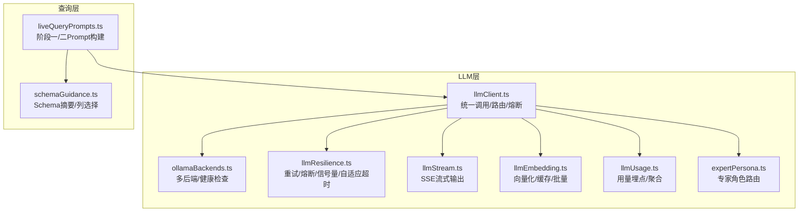
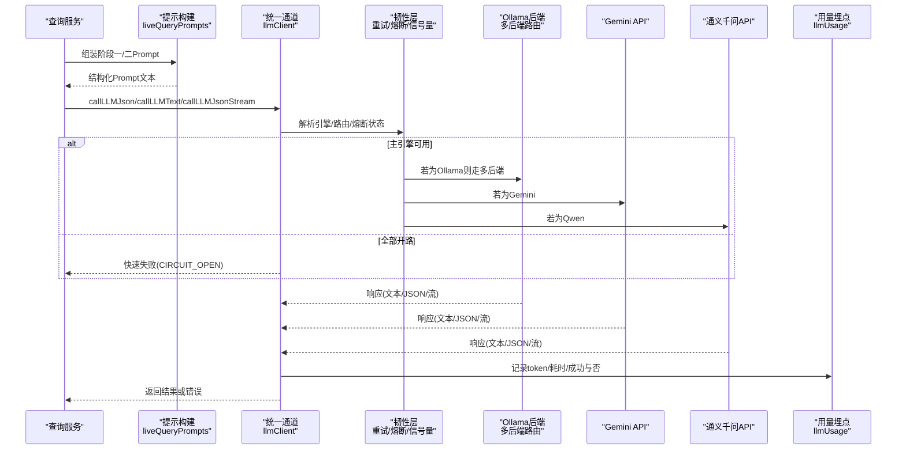
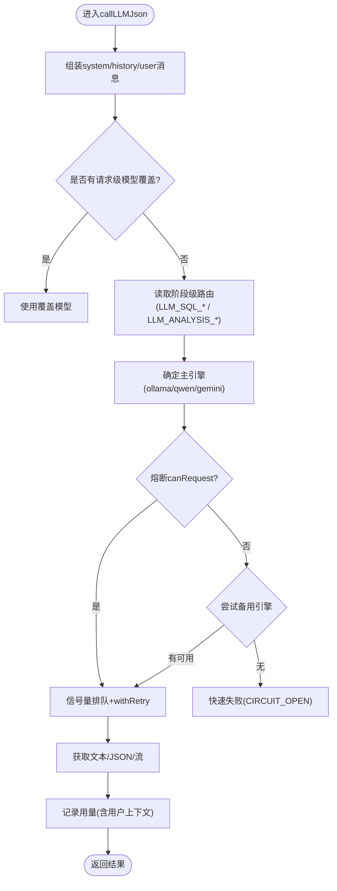
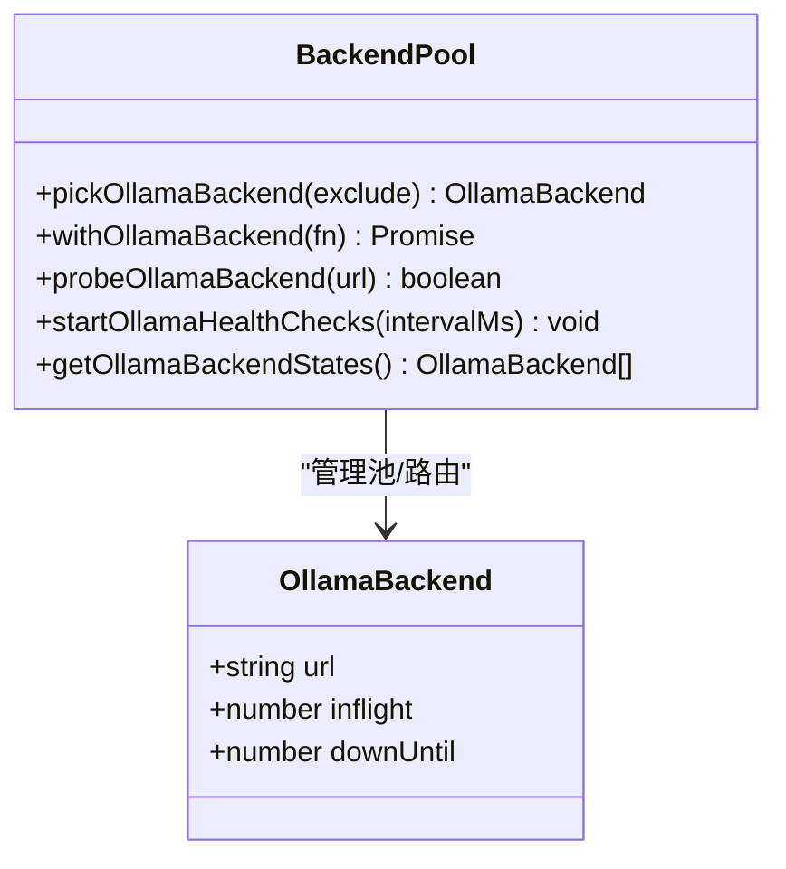
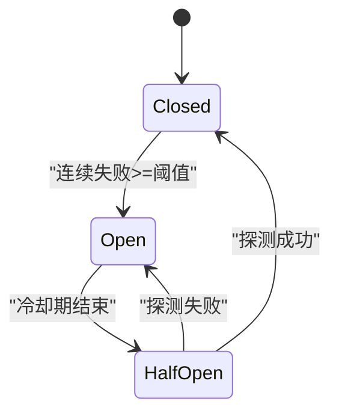
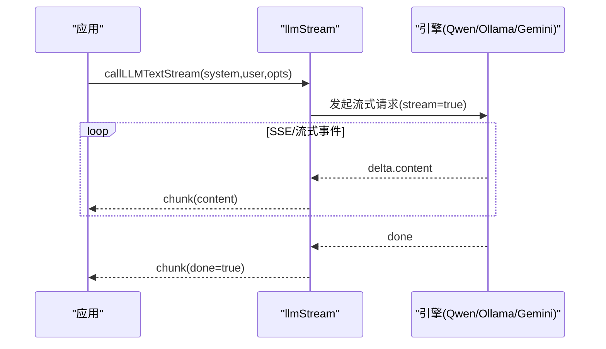
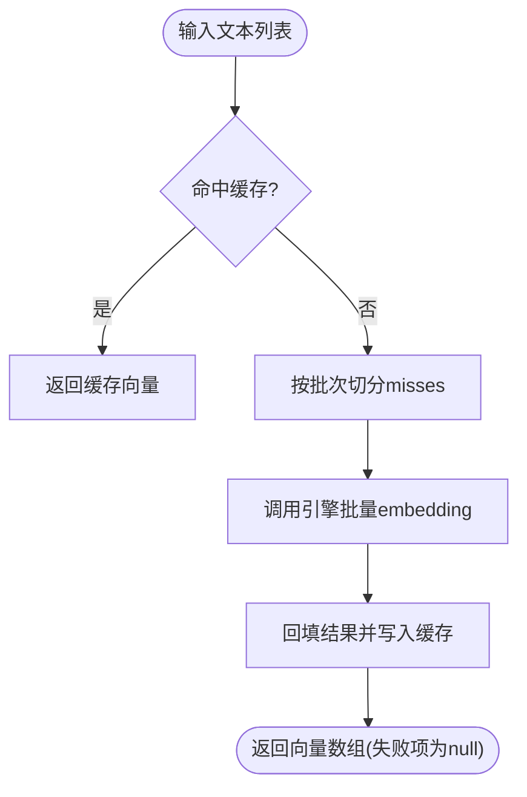
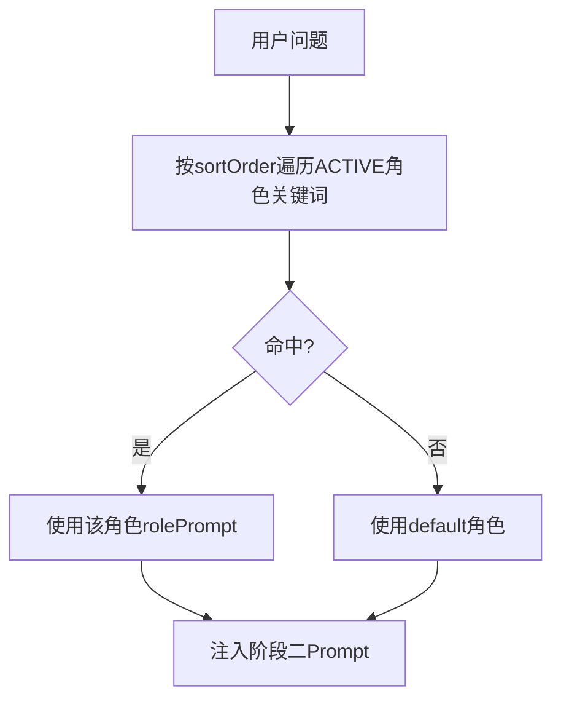
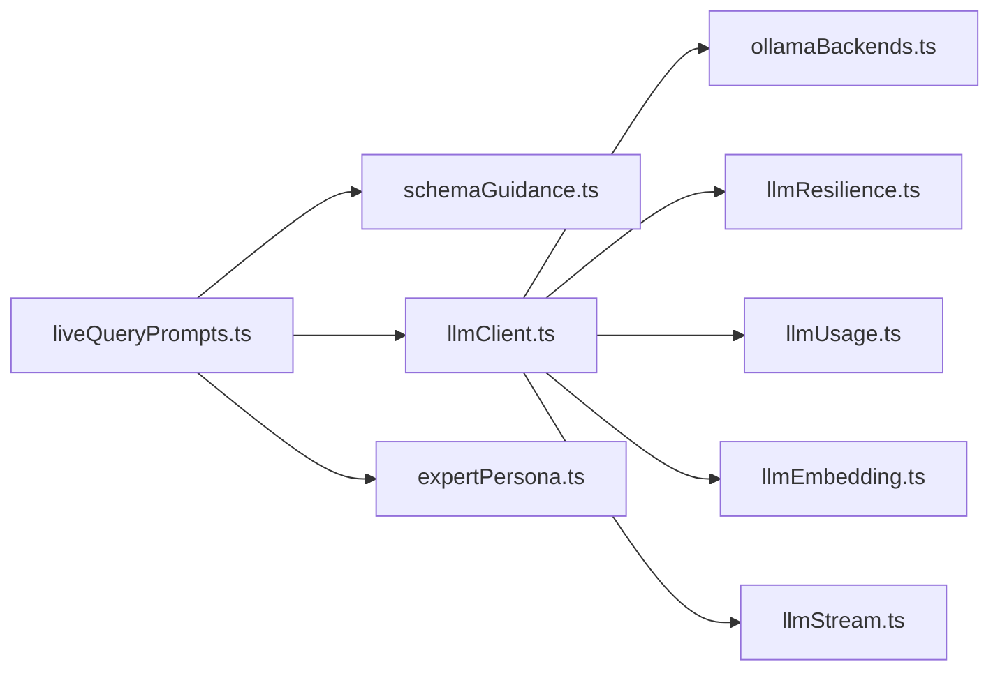

# AI与LLM集成

<cite>
**本文引用的文件**
- [llmClient.ts](file://server/llm/llmClient.ts)
- [ollamaBackends.ts](file://server/llm/ollamaBackends.ts)
- [expertPersona.ts](file://server/llm/expertPersona.ts)
- [llmResilience.ts](file://server/llm/llmResilience.ts)
- [llmEmbedding.ts](file://server/llm/llmEmbedding.ts)
- [llmStream.ts](file://server/llm/llmStream.ts)
- [llmUsage.ts](file://server/llm/llmUsage.ts)
- [liveQueryPrompts.ts](file://server/query/liveQueryPrompts.ts)
- [schemaGuidance.ts](file://server/query/schemaGuidance.ts)
</cite>

## 目录
1. [简介](#简介)
2. [项目结构](#项目结构)
3. [核心组件](#核心组件)
4. [架构总览](#架构总览)
5. [详细组件分析](#详细组件分析)
6. [依赖关系分析](#依赖关系分析)
7. [性能与成本优化](#性能与成本优化)
8. [故障排查指南](#故障排查指南)
9. [结论](#结论)
10. [附录：使用示例与调试技巧](#附录使用示例与调试技巧)

## 简介
本文件面向“智能问数据分析系统”的AI与LLM集成，聚焦多引擎统一抽象、提示工程最佳实践、专家角色系统、容错机制（熔断降级、重试、负载均衡）、模型选择策略、成本优化与性能监控指标，并提供实际使用示例与调试技巧，帮助开发者高效利用AI能力增强系统功能。

## 项目结构
与AI/LLM相关的核心代码集中在 server/llm 与 server/query 两个目录：
- server/llm：统一LLM调用通道、多后端路由、流式输出、嵌入向量、韧性原语、用量埋点、专家角色等。
- server/query：提示词构建、Schema摘要注入、阶段一/阶段二Prompt编排，支撑NL2SQL与分析解读。

图表来源
- [llmClient.ts:1-606](file://server/llm/llmClient.ts#L1-L606)
- [ollamaBackends.ts:1-143](file://server/llm/ollamaBackends.ts#L1-L143)
- [llmResilience.ts:1-245](file://server/llm/llmResilience.ts#L1-L245)
- [llmStream.ts:1-300](file://server/llm/llmStream.ts#L1-L300)
- [llmEmbedding.ts:1-317](file://server/llm/llmEmbedding.ts#L1-L317)
- [llmUsage.ts:1-134](file://server/llm/llmUsage.ts#L1-L134)
- [expertPersona.ts:1-329](file://server/llm/expertPersona.ts#L1-L329)
- [liveQueryPrompts.ts:1-117](file://server/query/liveQueryPrompts.ts#L1-L117)
- [schemaGuidance.ts:1-122](file://server/query/schemaGuidance.ts#L1-L122)

章节来源
- [llmClient.ts:1-606](file://server/llm/llmClient.ts#L1-L606)
- [ollamaBackends.ts:1-143](file://server/llm/ollamaBackends.ts#L1-L143)
- [llmResilience.ts:1-245](file://server/llm/llmResilience.ts#L1-L245)
- [llmStream.ts:1-300](file://server/llm/llmStream.ts#L1-L300)
- [llmEmbedding.ts:1-317](file://server/llm/llmEmbedding.ts#L1-L317)
- [llmUsage.ts:1-134](file://server/llm/llmUsage.ts#L1-L134)
- [expertPersona.ts:1-329](file://server/llm/expertPersona.ts#L1-L329)
- [liveQueryPrompts.ts:1-117](file://server/query/liveQueryPrompts.ts#L1-L117)
- [schemaGuidance.ts:1-122](file://server/query/schemaGuidance.ts#L1-L122)

## 核心组件
- 统一LLM通道：提供JSON/Text/流式三种调用模式，屏蔽Ollama/Gemini/通义千问差异，支持请求级覆盖、阶段级路由、引擎级熔断转移。
- Ollama多后端：最少并发路由、失败摘除与健康检查恢复、自动次优节点重试。
- 韧性原语：指数退避重试、引擎级熔断器、并发信号量、自适应超时。
- 嵌入向量：单条/批量向量化，短TTL缓存，兼容Ollama/Qwen/Gemini，失败可降级关键词检索。
- 专家角色：按问题关键词匹配ACTIVE角色，默认兜底；内置角色版本化同步，写操作即时失效缓存。
- 用量埋点：每次调用记录token与耗时，支持按引擎/模型/用户维度聚合，用于成本对比与监控。
- 提示工程：阶段一NL2SQL与阶段二数据解读的Prompt模板，动态注入Schema摘要、业务口径、负面样例、金额单位约束等。

章节来源
- [llmClient.ts:1-606](file://server/llm/llmClient.ts#L1-L606)
- [ollamaBackends.ts:1-143](file://server/llm/ollamaBackends.ts#L1-L143)
- [llmResilience.ts:1-245](file://server/llm/llmResilience.ts#L1-L245)
- [llmEmbedding.ts:1-317](file://server/llm/llmEmbedding.ts#L1-L317)
- [expertPersona.ts:1-329](file://server/llm/expertPersona.ts#L1-L329)
- [llmUsage.ts:1-134](file://server/llm/llmUsage.ts#L1-L134)
- [liveQueryPrompts.ts:1-117](file://server/query/liveQueryPrompts.ts#L1-L117)
- [schemaGuidance.ts:1-122](file://server/query/schemaGuidance.ts#L1-L122)

## 架构总览
下图展示从请求进入、提示构建、模型路由到结果返回的完整链路，包含熔断转移、重试、流式输出与用量埋点。

图表来源
- [llmClient.ts:141-525](file://server/llm/llmClient.ts#L141-L525)
- [ollamaBackends.ts:74-96](file://server/llm/ollamaBackends.ts#L74-L96)
- [llmResilience.ts:179-197](file://server/llm/llmResilience.ts#L179-L197)
- [llmUsage.ts:26-49](file://server/llm/llmUsage.ts#L26-L49)
- [liveQueryPrompts.ts:35-116](file://server/query/liveQueryPrompts.ts#L35-L116)

## 详细组件分析

### 统一LLM通道与多引擎抽象
- 引擎选择优先级：请求级覆盖 > 阶段级路由 > 环境变量显式指定 > 密钥存在性推断 > 回退Ollama。
- JSON/Text/流式三通道：JSON用于结构化输出（如SQL生成），Text用于非结构化解释，流式用于SSE逐字推送。
- 引擎级熔断转移：当主引擎连续失败达到阈值后自动切换到备用引擎，全部开路时快速失败避免雪崩。
- 自适应超时：基于近期成功调用的P95×3动态收紧配置上限，避免慢模型误杀、快模型被长超时拖死。
- 用量埋点：每次调用记录prompt/completion token、耗时、是否成功，并附带用户上下文（userId/username）。

图表来源
- [llmClient.ts:163-246](file://server/llm/llmClient.ts#L163-L246)
- [llmClient.ts:449-525](file://server/llm/llmClient.ts#L449-L525)
- [llmResilience.ts:179-197](file://server/llm/llmResilience.ts#L179-L197)
- [llmUsage.ts:26-49](file://server/llm/llmUsage.ts#L26-L49)

章节来源
- [llmClient.ts:1-606](file://server/llm/llmClient.ts#L1-L606)
- [llmResilience.ts:1-245](file://server/llm/llmResilience.ts#L1-L245)
- [llmUsage.ts:1-134](file://server/llm/llmUsage.ts#L1-L134)

### Ollama多后端与负载均衡
- 最少并发路由：在健康且未被排除的后端中选取inflight最小者，提升吞吐并降低热点。
- 失败摘除与恢复：调用失败将后端标记为downUntil，后台健康检查周期探测，恢复后重新接入。
- 自动次优重试：当前后端失败时自动尝试其他健康后端，单后端直接抛出交由外层重试。

图表来源
- [ollamaBackends.ts:12-18](file://server/llm/ollamaBackends.ts#L12-L18)
- [ollamaBackends.ts:45-96](file://server/llm/ollamaBackends.ts#L45-L96)
- [ollamaBackends.ts:98-133](file://server/llm/ollamaBackends.ts#L98-L133)

章节来源
- [ollamaBackends.ts:1-143](file://server/llm/ollamaBackends.ts#L1-L143)

### 韧性原语：重试、熔断、信号量、自适应超时
- 重试策略：仅对可恢复错误（超时/5xx/网络错误/限流）进行指数退避重试，4xx立即失败不浪费配额。
- 熔断器：按引擎隔离，连续失败N次开路，冷却期后半开单探测恢复。
- 信号量：每引擎并发上限，本地Ollama算力有限，超出排队而非打爆推理进程。
- 自适应超时：滑动窗口P95×3动态调整，避免固定超时的僵化。

图表来源
- [llmResilience.ts:103-160](file://server/llm/llmResilience.ts#L103-L160)
- [llmResilience.ts:179-197](file://server/llm/llmResilience.ts#L179-L197)
- [llmResilience.ts:201-245](file://server/llm/llmResilience.ts#L201-L245)

章节来源
- [llmResilience.ts:1-245](file://server/llm/llmResilience.ts#L1-L245)

### 流式输出与SSE
- 文本流式：通过SSE逐字推送，提升首字节延迟体验。
- JSON流式：先获取完整结果再分块推送，模拟打字机效果。
- 引擎适配：分别处理Qwen/SSE、Ollama/SSE、Gemini SDK流式接口。

图表来源
- [llmStream.ts:35-270](file://server/llm/llmStream.ts#L35-L270)

章节来源
- [llmStream.ts:1-300](file://server/llm/llmStream.ts#L1-L300)

### 嵌入向量与缓存
- 单条/批量向量化：兼容Ollama/Qwen/Gemini，失败时由调用方降级为关键词检索。
- 短TTL缓存：同一query向量在圈表精排与知识库检索间复用，减少重复调用。
- 批量优化：按EMBED_BATCH_SIZE分批一次请求多段文本，显著降低往返次数。

图表来源
- [llmEmbedding.ts:260-315](file://server/llm/llmEmbedding.ts#L260-L315)
- [llmEmbedding.ts:60-162](file://server/llm/llmEmbedding.ts#L60-L162)

章节来源
- [llmEmbedding.ts:1-317](file://server/llm/llmEmbedding.ts#L1-L317)

### 专家角色系统与个性化回答
- 角色定义：内置风险/客户/财务/不良资产/默认金融分析师，支持管理员新增自定义角色。
- 关键词匹配：按sortOrder升序匹配ACTIVE角色，未命中使用default兜底。
- 版本化同步：BUILTIN_PERSONA_CONTENT_VERSION升级时一次性刷新内置角色内容，保留管理员设置。
- 缓存与失效：60s内存缓存，写操作即时失效，保证最新配置生效。

图表来源
- [expertPersona.ts:128-212](file://server/llm/expertPersona.ts#L128-L212)
- [expertPersona.ts:214-246](file://server/llm/expertPersona.ts#L214-L246)

章节来源
- [expertPersona.ts:1-329](file://server/llm/expertPersona.ts#L1-L329)

### 提示工程最佳实践
- Prompt设计原则：
  - 明确角色与任务边界，强制JSON输出格式，避免自由文本导致解析失败。
  - 注入Schema摘要、业务口径说明、方言规则、负面样例，减少幻觉与歧义。
  - 金额单位口径显式告知，禁止自行换算，确保前后端一致。
- 上下文管理：
  - 历史消息净化为user-only，控制长度与相关性，避免上下文膨胀。
  - 阶段一专注SQL生成，阶段二专注数据解读，职责分离提高稳定性。
- 输出格式化策略：
  - 阶段一输出三类JSON：正常查询/澄清/拒答；阶段二输出aiExplanation/keyInsights/kpiMetrics/suggestedQuestions。
  - 图表字段严格对齐SQL输出列，columnNames提供中文表头映射。

章节来源
- [liveQueryPrompts.ts:15-116](file://server/query/liveQueryPrompts.ts#L15-L116)
- [schemaGuidance.ts:25-122](file://server/query/schemaGuidance.ts#L25-L122)

## 依赖关系分析
- llmClient.ts 依赖 ollamaBackends.ts（多后端）、llmResilience.ts（重试/熔断/信号量/自适应超时）、llmUsage.ts（用量埋点）、llmEmbedding.ts（向量化）、llmStream.ts（流式）。
- liveQueryPrompts.ts 依赖 schemaGuidance.ts（Schema摘要/列选择），并通过llmClient.ts调用LLM。
- expertPersona.ts 独立维护角色库与路由逻辑，供阶段二注入rolePrompt。

图表来源
- [llmClient.ts:1-606](file://server/llm/llmClient.ts#L1-L606)
- [liveQueryPrompts.ts:1-117](file://server/query/liveQueryPrompts.ts#L1-L117)
- [schemaGuidance.ts:1-122](file://server/query/schemaGuidance.ts#L1-L122)
- [expertPersona.ts:1-329](file://server/llm/expertPersona.ts#L1-L329)

章节来源
- [llmClient.ts:1-606](file://server/llm/llmClient.ts#L1-L606)
- [liveQueryPrompts.ts:1-117](file://server/query/liveQueryPrompts.ts#L1-L117)
- [schemaGuidance.ts:1-122](file://server/query/schemaGuidance.ts#L1-L122)
- [expertPersona.ts:1-329](file://server/llm/expertPersona.ts#L1-L329)

## 性能与成本优化
- 模型选择策略：
  - 阶段一（SQL生成）可使用快速小模型（LLM_SQL_ENGINE/LLM_SQL_MODEL），提升速度与稳定性。
  - 阶段二（数据解读）可配置快速模型（LLM_ANALYSIS_ENGINE/LLM_ANALYSIS_MODEL），缩短最大耗时环节。
  - 请求级覆盖（setLlmOverride）允许用户自选模型，灵活平衡质量与成本。
- 成本优化方案：
  - 嵌入向量短TTL缓存与批量调用，减少重复计算与网络往返。
  - 自适应超时避免长尾请求占用资源，结合重试策略控制失败成本。
  - 用量埋点按引擎/模型/用户维度聚合，识别高消耗路径并优化。
- 性能监控指标：
  - 成功率、平均耗时、P95/P99耗时、重试次数、熔断触发次数、各引擎token用量。
  - 通过Prometheus旁路埋点与数据库聚合视图，支撑可视化与告警。

章节来源
- [llmClient.ts:163-194](file://server/llm/llmClient.ts#L163-L194)
- [llmEmbedding.ts:26-47](file://server/llm/llmEmbedding.ts#L26-L47)
- [llmUsage.ts:63-134](file://server/llm/llmUsage.ts#L63-L134)
- [llmResilience.ts:235-245](file://server/llm/llmResilience.ts#L235-L245)

## 故障排查指南
- 熔断开路：检查连续失败原因（网络/鉴权/限流），确认备用引擎是否可用；观察冷却期后是否自动恢复。
- 重试风暴：确认isRetryable判定逻辑，避免对4xx参数错误重试；调整baseDelayMs与抖动范围。
- Ollama后端不可用：查看健康检查日志，确认downUntil时间戳；必要时重启后端或调整OLLAMA_URLS。
- 流式中断：检查SSE解析异常与AbortError；确认超时配置与引擎流式支持。
- 用量异常：核对recordUsage调用点，确认token统计来源（引擎返回或缺省0）；检查数据库写入是否成功。

章节来源
- [llmResilience.ts:42-49](file://server/llm/llmResilience.ts#L42-L49)
- [ollamaBackends.ts:98-133](file://server/llm/ollamaBackends.ts#L98-L133)
- [llmStream.ts:258-267](file://server/llm/llmStream.ts#L258-L267)
- [llmUsage.ts:26-49](file://server/llm/llmUsage.ts#L26-L49)

## 结论
本系统通过统一LLM通道、多后端路由、韧性原语与专家角色系统，实现了高可用、可扩展、可观测的AI与LLM集成。提示工程层面强调结构化输出、上下文精简与业务口径注入，保障生成质量与一致性。配合模型选择策略、成本优化与性能监控，可在不同部署环境下灵活平衡质量、成本与性能。

## 附录：使用示例与调试技巧
- 启用阶段一快速模型：设置LLM_SQL_ENGINE=ollama与LLM_SQL_MODEL=small-model，加速SQL生成。
- 启用阶段二快速模型：设置LLM_ANALYSIS_ENGINE=qwen与LLM_ANALYSIS_MODEL=fast-model，缩短解读耗时。
- 请求级模型覆盖：在服务中间件中调用setLlmOverride({engine:'qwen', model:'qwen3.8-max'})，实现用户自选。
- 调试流式输出：监听SSE事件，打印chunk内容与done标志，定位中断位置。
- 查看用量明细：调用summarizeLlmUsage(days=7)与summarizeLlmUsageByUser(days=7)，分析高消耗路径。
- 重置韧性状态：测试环境调用resetLlmResilienceForTest()与resetOllamaBackendsForTest()，便于复现问题。

章节来源
- [llmClient.ts:163-194](file://server/llm/llmClient.ts#L163-L194)
- [llmClient.ts:206-226](file://server/llm/llmClient.ts#L206-L226)
- [llmStream.ts:35-270](file://server/llm/llmStream.ts#L35-L270)
- [llmUsage.ts:63-134](file://server/llm/llmUsage.ts#L63-L134)
- [llmClient.ts:109-112](file://server/llm/llmClient.ts#L109-L112)
- [ollamaBackends.ts:135-143](file://server/llm/ollamaBackends.ts#L135-L143)