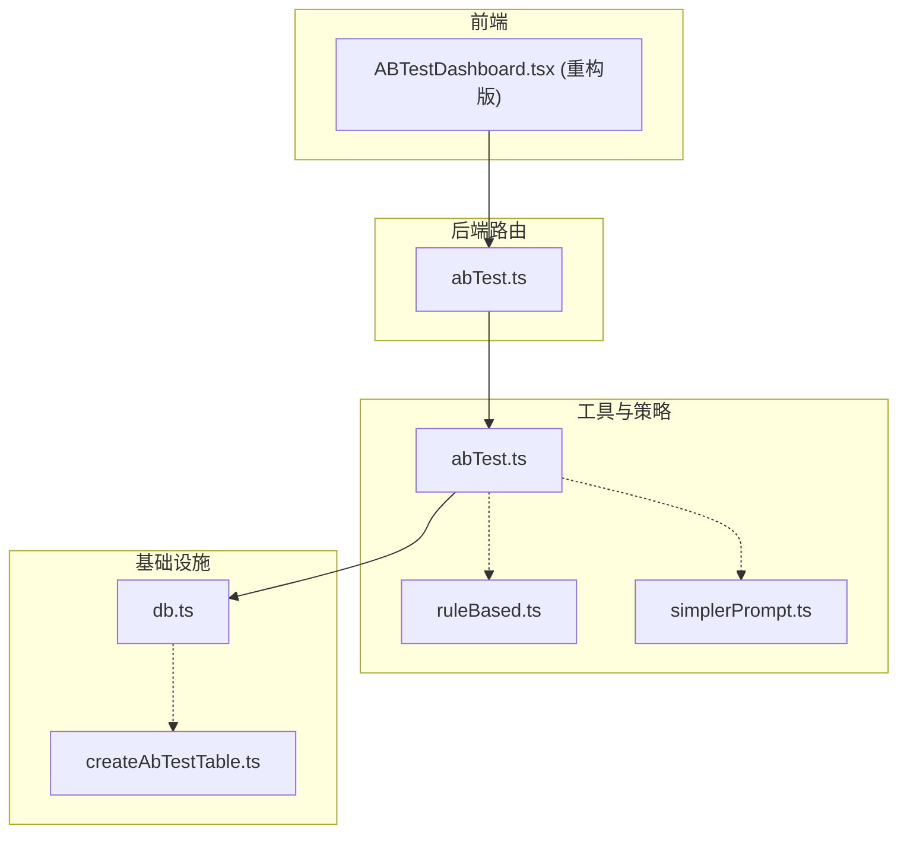
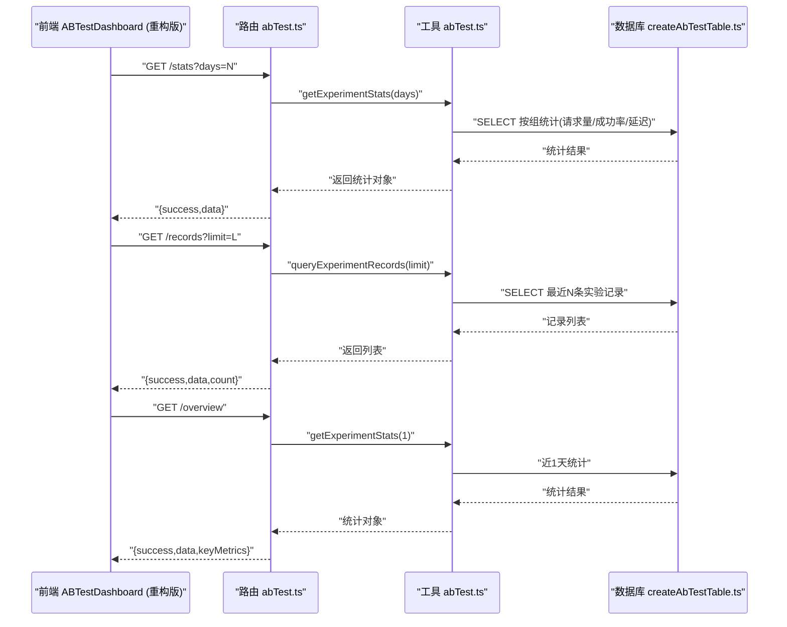
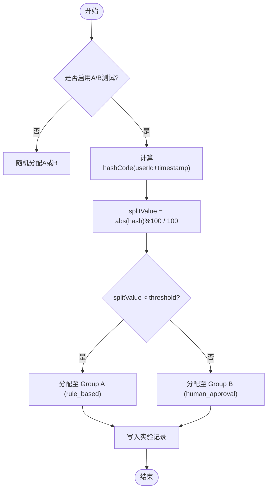
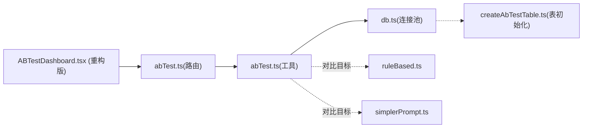

# A/B测试框架

<cite>
**本文引用的文件**
- [server/routes/abTest.ts](file://server/routes/abTest.ts)
- [server/utils/abTest.ts](file://server/utils/abTest.ts)
- [src/components/admin/ABTestDashboard.tsx](file://src/components/admin/ABTestDashboard.tsx)
- [server/utils/fallbackStrategies/ruleBased.ts](file://server/utils/fallbackStrategies/ruleBased.ts)
- [server/utils/fallbackStrategies/simplerPrompt.ts](file://server/utils/fallbackStrategies/simplerPrompt.ts)
- [server/infra/createAbTestTable.ts](file://server/infra/createAbTestTable.ts)
- [server/infra/db.ts](file://server/infra/db.ts)
</cite>

## 更新摘要
**变更内容**
- ABTestDashboard组件完全重构，采用全新视觉设计系统
- 移除了所有dark:前缀和不映射的类名，使用统一的slate深色类
- 引入映射强调色系统（青色/紫罗兰/翡翠/玫瑰/琥珀）支持自动主题切换
- 增强控制栏、改进KPI卡片布局、优化数据可视化功能
- 新增快速概览API端点和完整的管理员仪表板界面

## 目录
1. [简介](#简介)
2. [项目结构](#项目结构)
3. [核心组件](#核心组件)
4. [架构总览](#架构总览)
5. [详细组件分析](#详细组件分析)
6. [依赖关系分析](#依赖关系分析)
7. [性能考量](#性能考量)
8. [故障排查指南](#故障排查指南)
9. [结论](#结论)
10. [附录](#附录)

## 简介
本A/B测试框架用于对比两种Fallback策略的效果：规则化策略（Group A）与人工审核+Few-Shot增强策略（Group B）。系统为每次fallback决策分配实验组别，记录关键指标（成功率、延迟等），并提供管理员仪表板进行可视化分析与历史回溯。

**更新** ABTestDashboard组件现已完全重构，采用现代化的视觉设计系统，提供增强的用户体验和数据分析能力。

## 项目结构
围绕A/B测试的关键代码分布在以下位置：
- 路由层：提供统计、历史记录、快速概览接口
- 工具层：实验分组、记录写入、统计数据聚合
- 前端：重构后的管理员仪表板展示对比数据与最近记录
- 策略层：规则化与简化提示的Fallback实现（作为被比较的策略）
- 基础设施：数据库连接池、表初始化与索引管理

**图表来源**
- [server/routes/abTest.ts:1-130](file://server/routes/abTest.ts#L1-L130)
- [server/utils/abTest.ts:1-168](file://server/utils/abTest.ts#L1-L168)
- [src/components/admin/ABTestDashboard.tsx:1-379](file://src/components/admin/ABTestDashboard.tsx#L1-L379)
- [server/utils/fallbackStrategies/ruleBased.ts:1-161](file://server/utils/fallbackStrategies/ruleBased.ts#L1-L161)
- [server/utils/fallbackStrategies/simplerPrompt.ts:1-155](file://server/utils/fallbackStrategies/simplerPrompt.ts#L1-L155)
- [server/infra/createAbTestTable.ts:1-68](file://server/infra/createAbTestTable.ts#L1-L68)

**章节来源**
- [server/routes/abTest.ts:1-130](file://server/routes/abTest.ts#L1-L130)
- [server/utils/abTest.ts:1-168](file://server/utils/abTest.ts#L1-L168)
- [src/components/admin/ABTestDashboard.tsx:1-379](file://src/components/admin/ABTestDashboard.tsx#L1-L379)
- [server/utils/fallbackStrategies/ruleBased.ts:1-161](file://server/utils/fallbackStrategies/ruleBased.ts#L1-L161)
- [server/utils/fallbackStrategies/simplerPrompt.ts:1-155](file://server/utils/fallbackStrategies/simplerPrompt.ts#L1-L155)
- [server/infra/createAbTestTable.ts:1-68](file://server/infra/createAbTestTable.ts#L1-L68)

## 核心组件
- 路由层（abTest.ts）
  - GET /api/admin/ab-test/stats：获取指定天数的实验统计数据（需ADMIN）
  - GET /api/admin/ab-test/records：查询历史实验记录（需ADMIN）
  - GET /api/admin/ab-test/overview：快速概览（最近1天，计算关键指标对比）
- 工具层（abTest.ts）
  - 实验配置与开关（环境变量控制）
  - 确定性分组（基于userId+时间戳哈希）
  - 创建实验记录（写入数据库）
  - 统计聚合（按组统计请求量、成功率、平均/最小/最大延迟）
  - 历史查询（按时间倒序分页）
- 前端（ABTestDashboard.tsx - 重构版）
  - 现代化控制栏：标题 + 时间范围选择 + 刷新按钮
  - 增强的KPI卡片布局：Group A、Group B的请求量、成功率、平均延迟
  - 对比指标：成功率提升百分比、延迟优化百分比
  - 实验说明卡：详细的A/B测试机制说明
  - 最近实验记录表格：支持加载更多功能
- 策略层（ruleBased.ts、simplerPrompt.ts）
  - ruleBased.ts：基于正则与关键词检测时间范围与聚合意图，生成SQL模板
  - simplerPrompt.ts：提取最小Schema、构建Few-Shot示例、调用LLM生成SQL
- 基础设施（createAbTestTable.ts、db.ts）
  - 连接池初始化与表结构管理（包含fallback审计相关表）
  - 数据库表创建与索引优化

**更新** 前端组件已完全重构，采用全新的视觉设计系统和增强的用户交互功能。

**章节来源**
- [server/routes/abTest.ts:17-127](file://server/routes/abTest.ts#L17-L127)
- [server/utils/abTest.ts:13-167](file://server/utils/abTest.ts#L13-L167)
- [src/components/admin/ABTestDashboard.tsx:67-379](file://src/components/admin/ABTestDashboard.tsx#L67-L379)
- [server/utils/fallbackStrategies/ruleBased.ts:12-161](file://server/utils/fallbackStrategies/ruleBased.ts#L12-L161)
- [server/utils/fallbackStrategies/simplerPrompt.ts:17-155](file://server/utils/fallbackStrategies/simplerPrompt.ts#L17-L155)
- [server/infra/createAbTestTable.ts:11-68](file://server/infra/createAbTestTable.ts#L11-L68)

## 架构总览
下图展示了从前端到后端再到数据库的完整数据流，以及A/B测试在其中的作用点。

**图表来源**
- [server/routes/abTest.ts:17-127](file://server/routes/abTest.ts#L17-L127)
- [server/utils/abTest.ts:102-167](file://server/utils/abTest.ts#L102-L167)
- [server/infra/createAbTestTable.ts:18-36](file://server/infra/createAbTestTable.ts#L18-L36)

## 详细组件分析

### 路由层：abTest.ts
- 职责
  - 暴露三个只读接口，均受鉴权与角色校验保护
  - 将查询参数转换为业务参数并调用工具层
  - 统一错误处理与响应格式
- 关键点
  - /stats：根据days聚合统计
  - /records：限制返回条数
  - /overview：固定days=1，计算成功率差距与延迟优化百分比，并给出推荐策略

**更新** 新增了/overview端点，提供快速概览功能，自动计算关键指标对比和建议策略。

**章节来源**
- [server/routes/abTest.ts:17-127](file://server/routes/abTest.ts#L17-L127)

### 工具层：abTest.ts
- 实验配置
  - 通过环境变量启用/关闭A/B测试
  - 定义实验名称与两组名
  - 流量切分比例（默认各50%）
- 分组算法
  - 使用userId+时间戳字符串经DJB2哈希后取模，得到[0,1)区间值，按阈值分配到A或B
  - 若未启用，则退化为随机分配
- 数据持久化
  - createExperimentRecord：插入实验记录（含experiment_id、query、failed_sql、assigned_group、selected_strategy、success、latency_ms、created_at）
  - getExperimentStats：按组统计请求量、成功次数、成功率、平均/最小/最大延迟
  - queryExperimentRecords：按created_at倒序取最近N条
- 错误处理
  - 统计与查询失败时记录日志并返回错误信息或空数组

**图表来源**
- [server/utils/abTest.ts:46-59](file://server/utils/abTest.ts#L46-L59)
- [server/utils/abTest.ts:75-97](file://server/utils/abTest.ts#L75-L97)

**章节来源**
- [server/utils/abTest.ts:13-167](file://server/utils/abTest.ts#L13-L167)

### 前端：ABTestDashboard.tsx（重构版）
- **全新视觉设计系统**
  - 移除所有dark:前缀，使用统一的slate深色类
  - 引入映射强调色系统：青色(cyan)、紫罗兰(violet)、翡翠(emerald)、玫瑰(rose)、琥珀(amber)
  - 支持自动主题切换，无需手动适配明暗模式
- **增强的控制栏**
  - 现代化标题区域显示"A/B Test 实验分析"
  - 时间范围选择器（近24小时/7天/30天/90天）
  - 带图标的刷新按钮，支持加载状态指示
- **改进的KPI卡片布局**
  - Group A（Rule-Based）：青色主题，显示请求总量、成功率、平均延迟
  - Group B（Human Approval）：紫罗兰主题，显示相同指标
  - 成功率对比：翡翠主题，显示相对提升百分比
  - 响应延迟对比：琥珀主题，显示优化百分比
- **实验说明卡**
  - 详细说明A/B测试机制和两组策略差异
  - Few-Shot注入机制说明
- **增强的数据表格**
  - 完整的实验记录展示（实验ID、用户Query、失败SQL、分组、策略、结果、延迟、时间）
  - 支持"加载更多"功能获取更多记录
  - 响应式设计和悬停效果

**更新** 前端组件已完全重构，采用现代化设计系统和增强的用户交互体验。

**章节来源**
- [src/components/admin/ABTestDashboard.tsx:67-379](file://src/components/admin/ABTestDashboard.tsx#L67-L379)

### 策略层：ruleBased.ts 与 simplerPrompt.ts
- ruleBased.ts
  - 时间范围检测：支持多种日期格式的正则匹配
  - 聚合意图检测：金额/数量关键词识别
  - SQL模板生成：基于检测到的时间与聚合意图构造SQL片段
  - 适用场景：简单时间范围与单表聚合查询，快速响应
- simplerPrompt.ts
  - 最小Schema提取：仅保留关键表与字段，降低提示词长度
  - Few-Shot历史构建：从对话历史中抽取近期成功样例注入提示
  - LLM调用：以JSON形式返回SQL，并进行解析与校验
  - 适用场景：阶段二LLM失败后的降级生成，提高复杂查询成功率

**章节来源**
- [server/utils/fallbackStrategies/ruleBased.ts:12-161](file://server/utils/fallbackStrategies/ruleBased.ts#L12-L161)
- [server/utils/fallbackStrategies/simplerPrompt.ts:17-155](file://server/utils/fallbackStrategies/simplerPrompt.ts#L17-L155)

### 基础设施：createAbTestTable.ts 与 db.ts
- 数据库表初始化
  - 创建fallback_ab_tests表，包含实验记录所需的所有字段
  - 添加必要的索引优化查询性能（created_at、assigned_group、success、experiment_id）
  - 事务处理和错误回滚机制
- 连接池与数据库初始化
  - 动态读取MySQL连接参数
  - 应用库连接池容量公式化（可配置）
- 表结构
  - 包含fallback审计相关表（如fallback_audit_log等），支撑A/B测试的数据采集与分析

**更新** 新增了专门的数据库表初始化脚本，确保A/B测试数据的持久化存储和查询性能优化。

**章节来源**
- [server/infra/createAbTestTable.ts:11-68](file://server/infra/createAbTestTable.ts#L11-L68)
- [server/infra/db.ts:16-70](file://server/infra/db.ts#L16-L70)

## 依赖关系分析
- 路由依赖工具层：abTest.ts路由调用abTest.ts工具函数
- 工具层依赖基础设施：通过db.ts获取连接池执行SQL
- 前端依赖路由：通过HTTP接口获取统计与记录
- 策略层与工具层解耦：工具层不直接调用策略，但A/B测试的目标是对比这些策略效果

**图表来源**
- [server/routes/abTest.ts:1-130](file://server/routes/abTest.ts#L1-L130)
- [server/utils/abTest.ts:1-168](file://server/utils/abTest.ts#L1-L168)
- [server/infra/createAbTestTable.ts:1-68](file://server/infra/createAbTestTable.ts#L1-L68)
- [server/utils/fallbackStrategies/ruleBased.ts:1-161](file://server/utils/fallbackStrategies/ruleBased.ts#L1-L161)
- [server/utils/fallbackStrategies/simplerPrompt.ts:1-155](file://server/utils/fallbackStrategies/simplerPrompt.ts#L1-L155)

**章节来源**
- [server/routes/abTest.ts:1-130](file://server/routes/abTest.ts#L1-L130)
- [server/utils/abTest.ts:1-168](file://server/utils/abTest.ts#L1-L168)
- [server/infra/createAbTestTable.ts:1-68](file://server/infra/createAbTestTable.ts#L1-L68)

## 性能考量
- 分组算法复杂度：O(n)哈希计算，n为输入字符串长度；整体开销极低
- 统计查询复杂度：按天过滤并按组聚合，建议在fallback_ab_tests表上对created_at建立索引以提升查询性能
- 前端渲染：图表与表格按需加载，避免一次性渲染大量数据
- 数据库连接池：可通过环境变量调整连接池大小以应对并发压力
- 数据库索引：已为常用查询字段添加索引（created_at、assigned_group、success、experiment_id）

**更新** 新增了数据库索引优化，显著提升大数据量下的查询性能。

## 故障排查指南
- 统计接口返回错误
  - 检查数据库连接是否正常
  - 确认fallback_ab_tests表是否存在且字段正确
  - 查看工具层日志输出
- 历史记录为空
  - 确认是否有实验记录写入
  - 检查查询limit参数与排序逻辑
- 分组异常
  - 验证环境变量是否启用A/B测试
  - 检查hash函数与阈值配置
- 前端无法加载数据
  - 检查鉴权token是否正确传递
  - 确认路由路径与权限要求
- 数据库表问题
  - 运行createAbTestTable.ts脚本确保表存在
  - 检查索引是否正确创建
  - 验证数据库权限和连接配置

**更新** 新增了数据库表相关的故障排查指导。

**章节来源**
- [server/routes/abTest.ts:21-44](file://server/routes/abTest.ts#L21-L44)
- [server/routes/abTest.ts:56-74](file://server/routes/abTest.ts#L56-L74)
- [server/utils/abTest.ts:93-97](file://server/utils/abTest.ts#L93-L97)
- [server/utils/abTest.ts:134-137](file://server/utils/abTest.ts#L134-L137)
- [server/utils/abTest.ts:163-167](file://server/utils/abTest.ts#L163-L167)
- [server/infra/createAbTestTable.ts:47-50](file://server/infra/createAbTestTable.ts#L47-L50)

## 结论
该A/B测试框架以轻量、可观测的方式对比两类Fallback策略，提供稳定的统计与可视化能力。通过环境变量控制开关、确定性分组与完善的错误处理，便于在生产环境中安全启用与持续评估。**更新** 重构后的ABTestDashboard组件提供了现代化的视觉体验和增强的数据分析功能，包括全新的设计系统、改进的用户界面和更直观的数据展示方式。建议结合数据库索引与连接池调优，进一步提升大规模场景下的性能与稳定性。

## 附录
- 环境变量
  - AB_TEST_ENABLED：启用/关闭A/B测试
  - MYSQL_*：数据库连接参数
  - APP_POOL_MAX：应用库连接池上限
- 关键接口
  - GET /api/admin/ab-test/stats?days=N
  - GET /api/admin/ab-test/records?limit=L
  - GET /api/admin/ab-test/overview
- 数据表
  - fallback_ab_tests：存储实验记录（由工具层写入）
  - fallback_audit_log：fallback机制审计日志（由基础设施初始化）
- 数据库索引
  - idx_created_at：按创建时间查询优化
  - idx_assigned_group：按组别筛选优化
  - idx_success：按成功状态筛选优化
  - idx_experiment_id：按实验ID唯一查询优化

**更新** 新增了数据库索引说明和快速概览接口的详细说明。