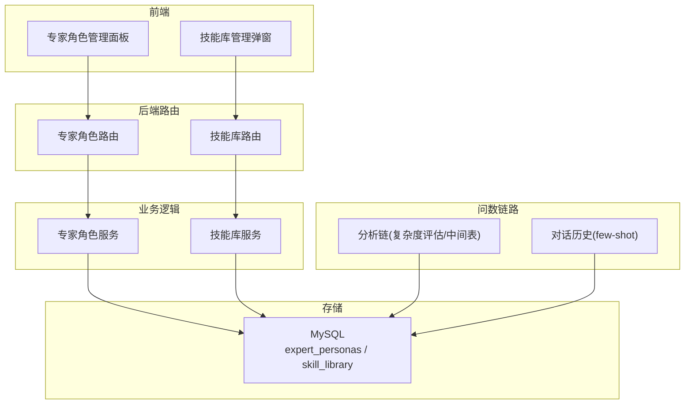
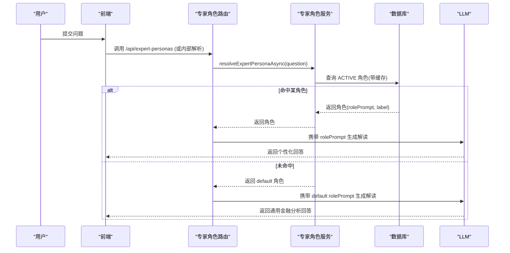
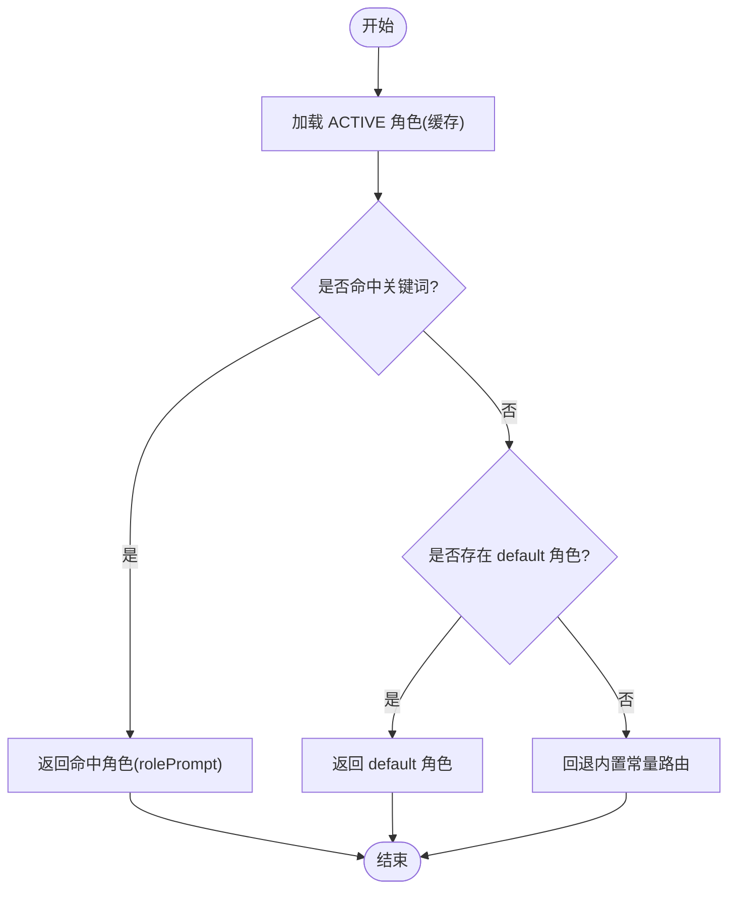
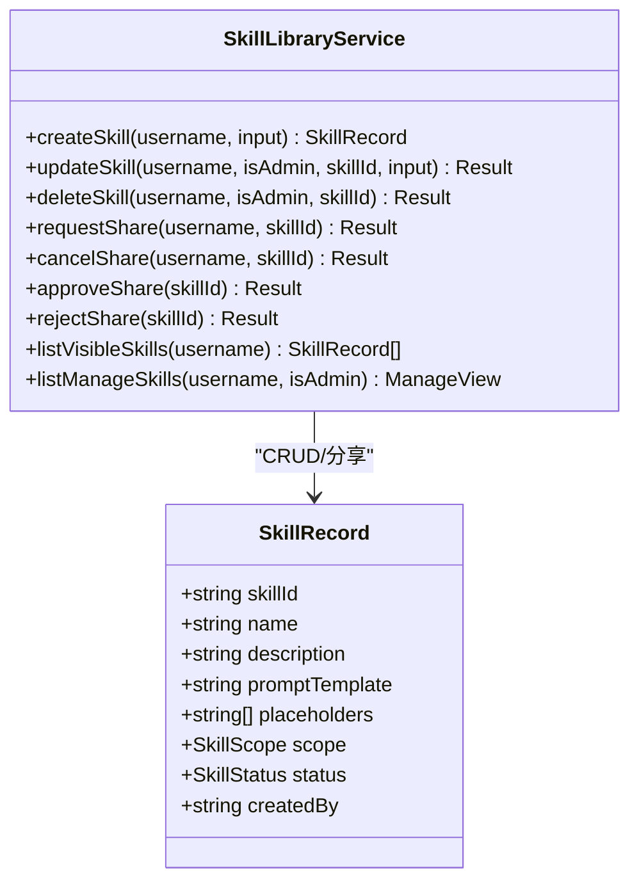
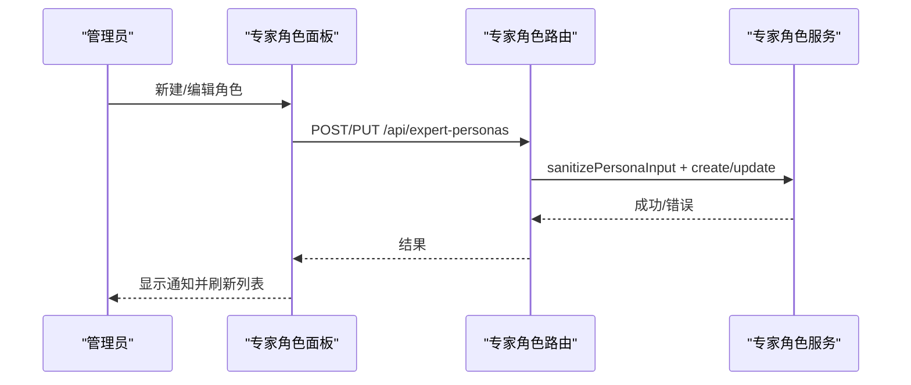
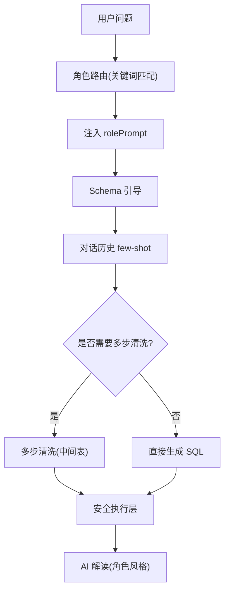
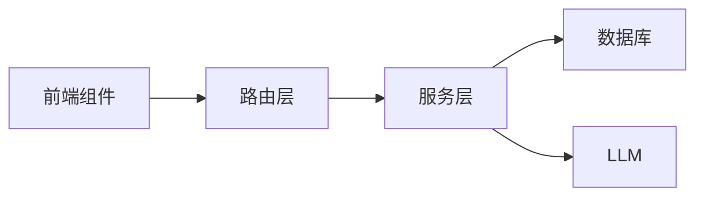

# 专家角色系统

<cite>
**本文引用的文件**
- [expertPersona.ts](file://server/llm/expertPersona.ts)
- [expertPersonas.ts](file://server/routes/expertPersonas.ts)
- [skillLibrary.ts](file://server/skillLibrary.ts)
- [skills.ts](file://server/skills.ts)
- [skills.ts（路由）](file://server/routes/skills.ts)
- [ExpertPersonasPanel.tsx](file://src/components/admin/ExpertPersonasPanel.tsx)
- [SkillLibraryModal.tsx](file://src/components/query/SkillLibraryModal.tsx)
- [db.ts](file://server/infra/db.ts)
- [analysisChain.ts](file://server/query/analysisChain.ts)
- [conversationHistory.ts](file://server/query/conversationHistory.ts)
</cite>

## 目录
1. [简介](#简介)
2. [项目结构](#项目结构)
3. [核心组件](#核心组件)
4. [架构总览](#架构总览)
5. [详细组件分析](#详细组件分析)
6. [依赖关系分析](#依赖关系分析)
7. [性能考量](#性能考量)
8. [故障排查指南](#故障排查指南)
9. [结论](#结论)
10. [附录：配置示例与最佳实践](#附录配置示例与最佳实践)

## 简介
本系统提供“专家角色”与“技能库”两大能力，用于构建专业的数据分析助手：
- 专家角色：在问数链路中按问题关键词匹配并注入角色上下文（rolePrompt），使 AI 解读具备领域视角、术语与输出规范。
- 技能库：将高频提问封装为可复用的模板（含占位符），支持个人与系统两级维护、分享审核与一键复用。

管理员可通过前端管理界面完成角色创建/编辑、权限控制与效果预览；用户可在问数面板使用技能快速构造高质量提问。系统内置多类金融不良资产相关角色与技能，便于快速落地企业级数据分析场景。

## 项目结构
围绕专家角色与技能库的核心代码分布如下：
- 后端服务层
  - 专家角色定义与路由：server/llm/expertPersona.ts、server/routes/expertPersonas.ts
  - 技能库数据模型与共享逻辑：server/skillLibrary.ts、server/skills.ts
  - 技能库路由：server/routes/skills.ts
  - 数据库表结构与版本迁移：server/infra/db.ts
- 前端管理界面
  - 专家角色管理面板：src/components/admin/ExpertPersonasPanel.tsx
  - 技能库管理弹窗：src/components/query/SkillLibraryModal.tsx
- 问数链路集成
  - 复杂度评估与中间表清洗链：server/query/analysisChain.ts
  - 对话历史与 few-shot 沉淀：server/query/conversationHistory.ts

图表来源
- [expertPersonas.ts:1-70](file://server/routes/expertPersonas.ts#L1-L70)
- [skills.ts（路由）:1-145](file://server/routes/skills.ts#L1-L145)
- [expertPersona.ts:1-329](file://server/llm/expertPersona.ts#L1-L329)
- [skillLibrary.ts:1-241](file://server/skillLibrary.ts#L1-L241)
- [db.ts:647-666](file://server/infra/db.ts#L647-L666)
- [analysisChain.ts:1-200](file://server/query/analysisChain.ts#L1-L200)
- [conversationHistory.ts:1-200](file://server/query/conversationHistory.ts#L1-L200)

章节来源
- [expertPersona.ts:1-329](file://server/llm/expertPersona.ts#L1-L329)
- [skillLibrary.ts:1-241](file://server/skillLibrary.ts#L1-L241)
- [skills.ts:1-97](file://server/skills.ts#L1-L97)
- [expertPersonas.ts:1-70](file://server/routes/expertPersonas.ts#L1-L70)
- [skills.ts（路由）:1-145](file://server/routes/skills.ts#L1-L145)
- [db.ts:647-666](file://server/infra/db.ts#L647-L666)
- [analysisChain.ts:1-200](file://server/query/analysisChain.ts#L1-L200)
- [conversationHistory.ts:1-200](file://server/query/conversationHistory.ts#L1-L200)

## 核心组件
- 专家角色服务
  - 内置角色常量、关键词匹配、优先级排序、默认兜底角色
  - 数据库持久化、缓存失效、启动播种与内容版本同步
  - 输入校验、CRUD 保护规则（default 不可禁用/删除等）
- 技能库服务
  - 个人与系统两级技能库、分享审核流程
  - 模板占位符提取与填充、权限控制（本人/管理员）
- 前端管理界面
  - 专家角色创建/编辑/启用停用/删除
  - 技能库新增/编辑/删除、分享申请/撤回、管理员审批/拒绝
- 问数链路集成
  - 基于问题的关键词路由到专家角色
  - 复杂问题触发多步清洗链，结合对话历史 few-shot 提升回答质量

章节来源
- [expertPersona.ts:1-329](file://server/llm/expertPersona.ts#L1-L329)
- [skillLibrary.ts:1-241](file://server/skillLibrary.ts#L1-L241)
- [skills.ts:1-97](file://server/skills.ts#L1-L97)
- [ExpertPersonasPanel.tsx:1-420](file://src/components/admin/ExpertPersonasPanel.tsx#L1-L420)
- [SkillLibraryModal.tsx:1-475](file://src/components/query/SkillLibraryModal.tsx#L1-L475)
- [analysisChain.ts:1-200](file://server/query/analysisChain.ts#L1-L200)
- [conversationHistory.ts:1-200](file://server/query/conversationHistory.ts#L1-L200)

## 架构总览
专家角色与技能库共同作用于问数链路：
- 角色路由：根据问题文本命中关键词，选择对应角色的 rolePrompt 注入 LLM 提示词，形成个性化回答风格与专业视角。
- 技能复用：通过技能模板快速生成结构化提问，配合 NL2SQL 与安全执行层，不绕过安全策略。
- 数据与缓存：角色配置写入 expert_personas 表，读路径采用内存缓存（TTL 60s），写操作即时失效缓存。
- 降级策略：数据库异常时回退到代码内置常量路由，保证可用性。

图表来源
- [expertPersona.ts:179-212](file://server/llm/expertPersona.ts#L179-L212)
- [expertPersonas.ts:19-26](file://server/routes/expertPersonas.ts#L19-L26)

章节来源
- [expertPersona.ts:179-212](file://server/llm/expertPersona.ts#L179-L212)
- [expertPersonas.ts:19-26](file://server/routes/expertPersonas.ts#L19-L26)

## 详细组件分析

### 专家角色服务
- 角色元数据
  - key、label、keywords、rolePrompt、sortOrder、status、isBuiltin、createdBy
  - 内置角色包含风险、客户、财务、不良资产从业者、默认金融分析师
- 匹配与路由
  - 阶段二解读前，对 ACTIVE 角色按 sortOrder 升序进行关键词包含匹配，首个命中生效
  - 无命中时使用 default 兜底角色（不参与匹配）
- 缓存与降级
  - 60s 内存缓存读取，写操作即时失效
  - 库不可用时回退到代码内置常量路由
- 版本同步与播种
  - 启动时播种内置角色；内容版本升级时一次性刷新内置角色内容（保留管理员设置）
- 权限与保护
  - default 角色不可禁用、不可删除、关键词恒为空
  - 内置角色可编辑但不可删除

图表来源
- [expertPersona.ts:179-212](file://server/llm/expertPersona.ts#L179-L212)
- [expertPersona.ts:128-139](file://server/llm/expertPersona.ts#L128-L139)

章节来源
- [expertPersona.ts:23-43](file://server/llm/expertPersona.ts#L23-L43)
- [expertPersona.ts:45-124](file://server/llm/expertPersona.ts#L45-L124)
- [expertPersona.ts:128-139](file://server/llm/expertPersona.ts#L128-L139)
- [expertPersona.ts:179-212](file://server/llm/expertPersona.ts#L179-L212)
- [expertPersona.ts:214-246](file://server/llm/expertPersona.ts#L214-L246)
- [expertPersona.ts:248-329](file://server/llm/expertPersona.ts#L248-L329)

### 技能库服务
- 范围与状态
  - USER 与 SYSTEM 两种范围；ACTIVE 与 PENDING_SHARE 两种状态
- 模板与占位符
  - 模板中使用 {{占位符}}，自动提取并展示；填充函数保留未填占位符以提示补全
- 权限控制
  - 个人技能仅本人可维护；系统技能仅管理员可维护
- 分享流程
  - 用户发起分享申请 → 管理员审核批准（复制进系统库，重名加后缀）或拒绝（退回私有）
- 可见性
  - 问数面板可见：系统库全部生效 + 本人个人库生效

图表来源
- [skillLibrary.ts:12-24](file://server/skillLibrary.ts#L12-L24)
- [skillLibrary.ts:26-57](file://server/skillLibrary.ts#L26-L57)
- [skillLibrary.ts:78-122](file://server/skillLibrary.ts#L78-L122)
- [skillLibrary.ts:124-241](file://server/skillLibrary.ts#L124-L241)

章节来源
- [skillLibrary.ts:12-24](file://server/skillLibrary.ts#L12-L24)
- [skillLibrary.ts:26-57](file://server/skillLibrary.ts#L26-L57)
- [skillLibrary.ts:78-122](file://server/skillLibrary.ts#L78-L122)
- [skillLibrary.ts:124-241](file://server/skillLibrary.ts#L124-L241)

### 前端管理界面
- 专家角色管理面板
  - 列表展示：标签、关键词、rolePrompt、优先级、状态
  - 新建/编辑：支持关键词文本解析、优先级设置、状态切换
  - 保护：default 不可禁用/删除；内置角色不可删除
- 技能库管理弹窗
  - 我的技能库：新增/编辑/删除、分享申请/撤回
  - 系统技能库：管理员可新增/编辑/删除
  - 待审核分享：管理员批准/拒绝

图表来源
- [ExpertPersonasPanel.tsx:121-160](file://src/components/admin/ExpertPersonasPanel.tsx#L121-L160)
- [expertPersonas.ts:28-54](file://server/routes/expertPersonas.ts#L28-L54)
- [expertPersona.ts:248-317](file://server/llm/expertPersona.ts#L248-L317)

章节来源
- [ExpertPersonasPanel.tsx:1-420](file://src/components/admin/ExpertPersonasPanel.tsx#L1-L420)
- [SkillLibraryModal.tsx:1-475](file://src/components/query/SkillLibraryModal.tsx#L1-L475)
- [expertPersonas.ts:1-70](file://server/routes/expertPersonas.ts#L1-L70)
- [skills.ts（路由）:1-145](file://server/routes/skills.ts#L1-L145)

### 问数链路中的角色与技能融合
- 角色上下文注入
  - 在阶段二解读前，根据问题关键词匹配角色，将 rolePrompt 注入 LLM 提示词，实现专业视角与术语统一
- 专业知识融合
  - 结合 schema 引导、few-shot（对话历史与样例库）提升回答准确性
- 回答风格定制
  - 不同角色的 rolePrompt 指定输出维度、术语与结论要求，确保风格一致且可审计
- 技能组合策略
  - 通过技能模板快速构造高质量提问；复杂问题触发多步清洗链，必要时结合 few-shot 提升稳定性

图表来源
- [expertPersona.ts:179-212](file://server/llm/expertPersona.ts#L179-L212)
- [analysisChain.ts:47-112](file://server/query/analysisChain.ts#L47-L112)
- [conversationHistory.ts:145-200](file://server/query/conversationHistory.ts#L145-L200)

章节来源
- [expertPersona.ts:179-212](file://server/llm/expertPersona.ts#L179-L212)
- [analysisChain.ts:47-112](file://server/query/analysisChain.ts#L47-L112)
- [conversationHistory.ts:145-200](file://server/query/conversationHistory.ts#L145-L200)

## 依赖关系分析
- 模块耦合
  - 路由层依赖服务层进行输入校验与 CRUD
  - 服务层依赖数据库连接池与缓存机制
  - 前端组件依赖路由 API 进行交互
- 外部依赖
  - MySQL 存储角色与技能库数据
  - LLM 用于解读生成与复杂度评估
- 潜在循环依赖
  - 当前结构清晰，未见循环依赖迹象
- 接口契约
  - 路由层与服务层之间通过明确的数据结构传递
  - 前端与后端通过 RESTful API 约定数据结构

图表来源
- [expertPersonas.ts:1-70](file://server/routes/expertPersonas.ts#L1-L70)
- [skills.ts（路由）:1-145](file://server/routes/skills.ts#L1-L145)
- [expertPersona.ts:1-329](file://server/llm/expertPersona.ts#L1-L329)
- [skillLibrary.ts:1-241](file://server/skillLibrary.ts#L1-L241)

章节来源
- [expertPersonas.ts:1-70](file://server/routes/expertPersonas.ts#L1-L70)
- [skills.ts（路由）:1-145](file://server/routes/skills.ts#L1-L145)
- [expertPersona.ts:1-329](file://server/llm/expertPersona.ts#L1-L329)
- [skillLibrary.ts:1-241](file://server/skillLibrary.ts#L1-L241)

## 性能考量
- 角色路由缓存
  - 60s 内存缓存减少数据库压力，写操作即时失效保证一致性
- 关键词匹配优化
  - 按 sortOrder 升序匹配，优先精确职能角色，避免宽泛领域抢先命中
- 多步清洗链门控
  - 启发式信号预判断，仅在必要时调用 LLM 进行复杂度评估，降低推理成本
- 对话历史窗口清理
  - 定期清理旧记录，避免存储膨胀与检索延迟

[本节为通用性能讨论，无需特定文件引用]

## 故障排查指南
- 角色路由异常
  - 检查 expert_personas 表数据完整性与状态
  - 确认缓存是否及时失效（写操作后）
  - 数据库异常时验证是否回退到内置常量路由
- 技能库访问失败
  - 检查权限控制（本人/管理员）
  - 确认技能状态（ACTIVE/PENDING_SHARE）
  - 分享流程状态是否正确（申请/撤回/批准/拒绝）
- 问数链路问题
  - 查看复杂度评估是否被正确触发
  - 检查多步清洗链 SQL 纠错与重试机制
  - 确认对话历史 few-shot 检索是否有效

章节来源
- [expertPersona.ts:179-212](file://server/llm/expertPersona.ts#L179-L212)
- [skillLibrary.ts:176-241](file://server/skillLibrary.ts#L176-L241)
- [analysisChain.ts:114-156](file://server/query/analysisChain.ts#L114-L156)
- [conversationHistory.ts:72-90](file://server/query/conversationHistory.ts#L72-L90)

## 结论
专家角色系统与技能库共同构建了灵活、可扩展的数据分析助手框架：
- 角色路由确保专业视角与术语一致性
- 技能库提供高效提问范式与知识沉淀
- 前端管理界面简化配置与维护
- 问数链路集成提升回答质量与稳定性

建议管理员结合业务场景定制角色与技能，持续优化关键词与 rolePrompt，利用监控与评估方法保障系统质量。

[本节为总结性内容，无需特定文件引用]

## 附录：配置示例与最佳实践
- 角色配置示例
  - 风险专家：关键词包含“风险、逾期、违约、不良率”等，rolePrompt 强调风险敞口、逾期特征、迁徙态势与缓释覆盖
  - 财务专家：关键词包含“财务、营收、利润、现金流”等，rolePrompt 聚焦收入结构、成本毛利、利润费用与现金流质量
  - 不良资产专家：关键词包含“不良、资产包、处置、债权”等，rolePrompt 关注资产包结构、处置进度、清收回收与阻力卡点
- 技能配置示例
  - 机构业务画像：零占位符模板，一键统计业务笔数、投放金额、长龄与逾期
  - 长龄资产分析：零占位符模板，统计长龄业务分布与集中度
  - 风险项目监控：零占位符模板，统计风险项目个数与集中度
- 最佳实践
  - 角色关键词设计：优先精确职能，避免宽泛领域抢先命中
  - rolePrompt 编写：明确输出维度、术语与结论要求，确保可审计
  - 技能模板设计：使用占位符提高灵活性，保持模板简洁易懂
  - 分享审核流程：严格审核技能质量，确保系统库内容权威可靠
  - 监控与评估：定期检查角色命中率、技能使用频率与回答质量

[本节为概念性指导，无需特定文件引用]