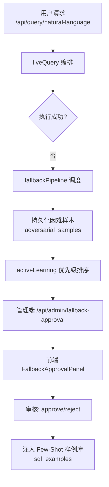
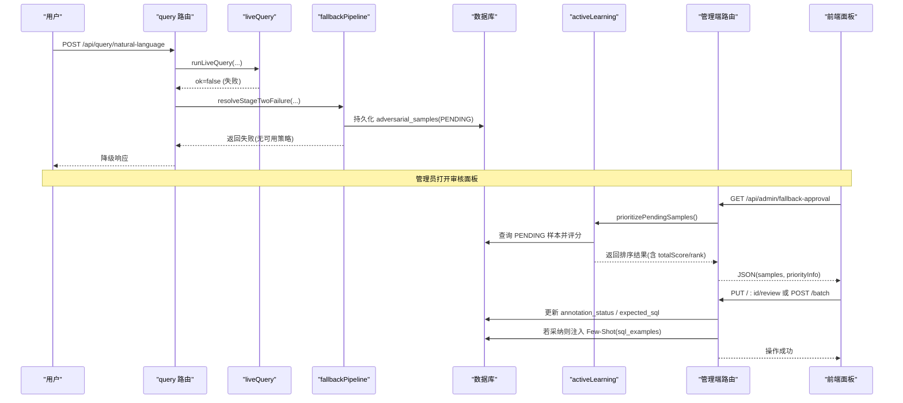
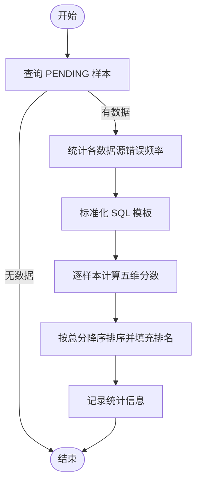
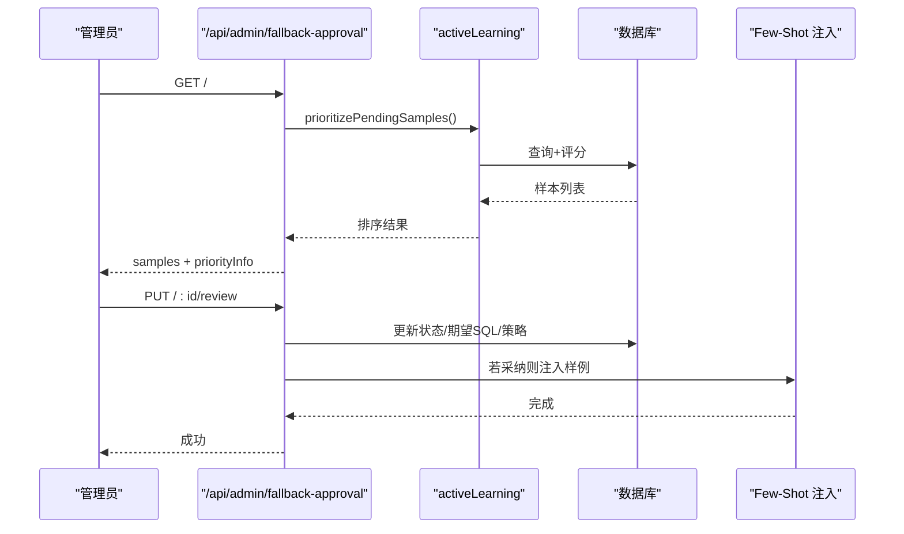
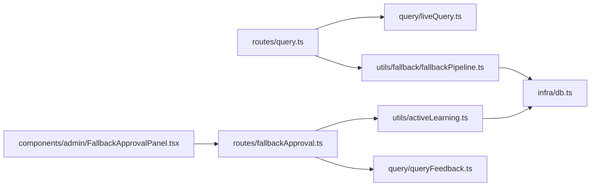

# 主动学习优先级系统

<cite>
**本文引用的文件**
- [server/utils/activeLearning.ts](file://server/utils/activeLearning.ts)
- [server/routes/fallbackApproval.ts](file://server/routes/fallbackApproval.ts)
- [src/components/admin/FallbackApprovalPanel.tsx](file://src/components/admin/FallbackApprovalPanel.tsx)
- [server/query/liveQuery.ts](file://server/query/liveQuery.ts)
- [server/routes/query.ts](file://server/routes/query.ts)
- [server/utils/fallback/fallbackPipeline.ts](file://server/utils/fallback/fallbackPipeline.ts)
- [server/query/queryFeedback.ts](file://server/query/queryFeedback.ts)
- [server/infra/db.ts](file://server/infra/db.ts)
</cite>

## 目录
1. [简介](#简介)
2. [项目结构](#项目结构)
3. [核心组件](#核心组件)
4. [架构总览](#架构总览)
5. [详细组件分析](#详细组件分析)
6. [依赖关系分析](#依赖关系分析)
7. [性能考量](#性能考量)
8. [故障排查指南](#故障排查指南)
9. [结论](#结论)
10. [附录](#附录)

## 简介
本系统为智能问数（NL2SQL）提供“主动学习优先级系统”，用于对自动收集到的失败样本进行多因子评分与排序，优先处理高价值样本，从而高效提升 Few-Shot 知识库质量与模型鲁棒性。其核心能力包括：
- 自动采集失败样本并持久化到困难样本库
- 基于时间衰减、错误频率、查询复杂度、多样性探索、重要用户加权等多维指标计算优先级
- 管理员审核工作流（待审→审核中→采纳/拒绝），采纳后自动注入 Few-Shot 样例库
- 前端可视化面板支持搜索、筛选、批量操作与详情编辑

该机制贯穿“失败回退 → 优先级排序 → 人工标注 → 反馈闭环”的完整链路，确保系统持续自我进化。

## 项目结构
围绕主动学习优先级系统的代码主要分布在以下模块：
- 优先级算法与数据访问：server/utils/activeLearning.ts
- 管理端路由与状态流转：server/routes/fallbackApproval.ts
- 前端审核面板：src/components/admin/FallbackApprovalPanel.tsx
- 失败样本采集入口：server/routes/query.ts 调用 fallback 调度器
- 失败回退策略调度：server/utils/fallback/fallbackPipeline.ts
- 反馈闭环与样例库：server/query/queryFeedback.ts
- 数据库表结构初始化：server/infra/db.ts
- 主查询编排（上下文构建、执行、降级）：server/query/liveQuery.ts

图表来源
- [server/routes/query.ts:186-386](file://server/routes/query.ts#L186-L386)
- [server/utils/fallback/fallbackPipeline.ts:47-138](file://server/utils/fallback/fallbackPipeline.ts#L47-L138)
- [server/utils/activeLearning.ts:40-129](file://server/utils/activeLearning.ts#L40-L129)
- [server/routes/fallbackApproval.ts:24-175](file://server/routes/fallbackApproval.ts#L24-L175)
- [src/components/admin/FallbackApprovalPanel.tsx:146-455](file://src/components/admin/FallbackApprovalPanel.tsx#L146-L455)
- [server/query/queryFeedback.ts:50-88](file://server/query/queryFeedback.ts#L50-L88)
- [server/infra/db.ts:729-749](file://server/infra/db.ts#L729-L749)

章节来源
- [server/routes/query.ts:186-386](file://server/routes/query.ts#L186-L386)
- [server/utils/fallback/fallbackPipeline.ts:47-138](file://server/utils/fallback/fallbackPipeline.ts#L47-L138)
- [server/utils/activeLearning.ts:40-129](file://server/utils/activeLearning.ts#L40-L129)
- [server/routes/fallbackApproval.ts:24-175](file://server/routes/fallbackApproval.ts#L24-L175)
- [src/components/admin/FallbackApprovalPanel.tsx:146-455](file://src/components/admin/FallbackApprovalPanel.tsx#L146-L455)
- [server/query/queryFeedback.ts:50-88](file://server/query/queryFeedback.ts#L50-L88)
- [server/infra/db.ts:729-749](file://server/infra/db.ts#L729-L749)

## 核心组件
- 优先级评分器：对 PENDING 样本计算多维分数并排序，输出带 rank 的结果集
- 管理端路由：暴露列表、批量审批、单个审核接口，驱动状态机流转
- 前端面板：展示 KPI、搜索过滤、批量操作、详情编辑与提交
- 失败回退调度器：按策略顺序尝试解决失败，最终将未解决问题沉淀为困难样本
- 反馈闭环：点赞自动沉淀正例；点踩反例注入阶段一提示；困难样本采纳后注入 Few-Shot

章节来源
- [server/utils/activeLearning.ts:11-144](file://server/utils/activeLearning.ts#L11-L144)
- [server/routes/fallbackApproval.ts:1-175](file://server/routes/fallbackApproval.ts#L1-L175)
- [src/components/admin/FallbackApprovalPanel.tsx:1-455](file://src/components/admin/FallbackApprovalPanel.tsx#L1-L455)
- [server/utils/fallback/fallbackPipeline.ts:1-138](file://server/utils/fallback/fallbackPipeline.ts#L1-L138)
- [server/query/queryFeedback.ts:1-471](file://server/query/queryFeedback.ts#L1-L471)

## 架构总览
主动学习优先级系统以“失败样本采集 → 优先级排序 → 人工审核 → 知识注入”为主线，结合安全与可观测性设计：
- 采集：在 NL2SQL 主链路失败时，通过 fallback 调度器记录困难样本
- 排序：按时间衰减、错误频率、复杂度、多样性、用户权重等维度打分
- 审核：管理员在面板上查看、编辑期望 SQL，选择采纳或拒绝
- 注入：采纳后自动写入 Few-Shot 样例库，参与后续问答的上下文增强

图表来源
- [server/routes/query.ts:186-386](file://server/routes/query.ts#L186-L386)
- [server/utils/fallback/fallbackPipeline.ts:47-138](file://server/utils/fallback/fallbackPipeline.ts#L47-L138)
- [server/utils/activeLearning.ts:40-129](file://server/utils/activeLearning.ts#L40-L129)
- [server/routes/fallbackApproval.ts:24-175](file://server/routes/fallbackApproval.ts#L24-L175)
- [src/components/admin/FallbackApprovalPanel.tsx:146-455](file://src/components/admin/FallbackApprovalPanel.tsx#L146-L455)

## 详细组件分析

### 优先级评分器（activeLearning）
- 功能：从 adversarial_samples 表读取 PENDING 样本，计算五类分数并汇总总分，按降序排序并填充排名
- 评分维度
  - 时间衰减分：越久未处理的样本得分越高，鼓励尽快消化积压
  - 高频错误分：同一数据源出现次数越多，得分越高
  - 查询复杂度分：基于 SQL 长度近似衡量复杂度
  - 多样性探索分：基于 SQL 模板去重后的唯一性，鼓励覆盖多样场景
  - 重要用户加权分：按用户 ID 归一化加权
- 关键实现要点
  - SQL 模板标准化：去除数字与字符串常量，便于统计重复度
  - 异常保护：捕获异常返回空数组，避免阻塞上游
  - 日志记录：记录样本数量、最高分与平均分

图表来源
- [server/utils/activeLearning.ts:40-129](file://server/utils/activeLearning.ts#L40-L129)

章节来源
- [server/utils/activeLearning.ts:11-144](file://server/utils/activeLearning.ts#L11-L144)

### 管理端路由（fallbackApproval）
- 列表接口：调用 activeLearning 获取排序后的样本，返回简化字段与优先级信息
- 批量操作：分批更新状态，若采纳则自动注入 Few-Shot 样例库
- 单个审核：先置为 IN_REVIEW，再根据是否提供期望 SQL 决定最终状态与策略标记
- 权限控制：仅管理员可访问

图表来源
- [server/routes/fallbackApproval.ts:24-175](file://server/routes/fallbackApproval.ts#L24-L175)
- [server/utils/activeLearning.ts:40-129](file://server/utils/activeLearning.ts#L40-L129)

章节来源
- [server/routes/fallbackApproval.ts:1-175](file://server/routes/fallbackApproval.ts#L1-L175)

### 前端面板（FallbackApprovalPanel）
- 展示 KPI：总数、待审、已采纳、已拒绝
- 工具栏：搜索、状态筛选、批量采纳/拒绝
- 表格：显示排名、原始查询、错误消息、优先级分、使用策略、状态、操作
- 审核弹窗：编辑期望 SQL，提交采纳或拒绝

章节来源
- [src/components/admin/FallbackApprovalPanel.tsx:1-455](file://src/components/admin/FallbackApprovalPanel.tsx#L1-L455)

### 失败回退调度器（fallbackPipeline）
- 三层策略：rule_based → simpler_prompt → human_approval
- 错误分类：语法错误、语义错误、权限拒绝、未知
- 审计与持久化：记录策略使用情况；全部失败时保存为 Hard Negative 供后续训练
- 可插拔依赖：logger、持久化、审计由调用方注入，便于测试与替换

章节来源
- [server/utils/fallback/fallbackPipeline.ts:1-138](file://server/utils/fallback/fallbackPipeline.ts#L1-L138)

### 反馈闭环与样例库（queryFeedback）
- 点赞自动沉淀：live 成功且点赞的问答对进入 sql_examples，附带 embedding
- 点踩反例：同数据源点踩问题作为反面教材注入阶段一，避免重复错误
- 相似度检索：向量+词法+表重合的多维打分，token 预算内贪心取 top

章节来源
- [server/query/queryFeedback.ts:1-471](file://server/query/queryFeedback.ts#L1-L471)

### 数据库表结构（db）
- adversarial_samples：存储困难样本、标注状态、期望 SQL、策略标记、时间戳
- fallback_audit_log：记录 fallback 策略使用、延迟、成功率等指标
- 索引优化：按状态、数据源、创建时间、用户等维度建立索引，提升查询效率

章节来源
- [server/infra/db.ts:729-749](file://server/infra/db.ts#L729-L749)

## 依赖关系分析
- 路由层依赖
  - query.ts 在 liveQuery 失败时调用 fallbackPipeline，并将失败样本持久化
  - fallbackApproval.ts 依赖 activeLearning 进行优先级排序，并在采纳时注入 Few-Shot
- 服务层依赖
  - activeLearning 依赖 db 连接与 logger
  - fallbackPipeline 依赖 rule_based/simpler_prompt 策略实现（外部注入）
  - queryFeedback 依赖 llmClient 进行 embedding 与文本生成
- 前端依赖
  - FallbackApprovalPanel 通过 apiFetch 调用管理端路由，渲染优先级信息与操作按钮

图表来源
- [server/routes/query.ts:186-386](file://server/routes/query.ts#L186-L386)
- [server/utils/fallback/fallbackPipeline.ts:47-138](file://server/utils/fallback/fallbackPipeline.ts#L47-L138)
- [server/utils/activeLearning.ts:40-129](file://server/utils/activeLearning.ts#L40-L129)
- [server/routes/fallbackApproval.ts:24-175](file://server/routes/fallbackApproval.ts#L24-L175)
- [server/query/queryFeedback.ts:50-88](file://server/query/queryFeedback.ts#L50-L88)
- [server/infra/db.ts:729-749](file://server/infra/db.ts#L729-L749)

章节来源
- [server/routes/query.ts:186-386](file://server/routes/query.ts#L186-L386)
- [server/utils/fallback/fallbackPipeline.ts:47-138](file://server/utils/fallback/fallbackPipeline.ts#L47-L138)
- [server/utils/activeLearning.ts:40-129](file://server/utils/activeLearning.ts#L40-L129)
- [server/routes/fallbackApproval.ts:24-175](file://server/routes/fallbackApproval.ts#L24-L175)
- [server/query/queryFeedback.ts:50-88](file://server/query/queryFeedback.ts#L50-L88)
- [server/infra/db.ts:729-749](file://server/infra/db.ts#L729-L749)

## 性能考量
- 优先级排序
  - 单次查询所有 PENDING 样本，内存中计算频率与模板计数，避免多次往返
  - 使用指数衰减函数控制时间权重，避免老样本长期霸榜
  - SQL 模板标准化减少噪声，提高多样性评估准确性
- 回退策略
  - 策略串行尝试，快速失败不阻塞整体流程
  - 审计日志记录策略耗时，便于定位瓶颈
- 样例库
  - Few-Shot 检索采用向量+词法+表重合的多维打分，token 预算内贪心取 top，控制 prompt 大小
  - 点赞自动沉淀时异步计算 embedding，失败降级为纯词法匹配
- 数据库
  - 针对 adversarial_samples 建立状态、数据源、创建时间、用户索引，提升列表与筛选性能
  - 批量更新采用分批处理，防止 SQL 过长

[本节为通用性能讨论，无需特定文件引用]

## 故障排查指南
- 优先级排序为空
  - 检查是否存在 PENDING 样本；确认数据库连接与查询语句
  - 查看日志中的统计信息（样本数量、最高分、平均分）
- 管理端无法加载样本
  - 确认路由权限（仅管理员）；检查 activeLearning 是否抛出异常
  - 验证 adversarial_samples 表结构与索引
- 审核操作失败
  - 检查状态流转：PENDING → IN_REVIEW → APPROVED/REJECTED
  - 若采纳但 Few-Shot 注入失败，查看相关日志，不影响审批返回
- 回退策略全部失败
  - 查看 fallbackPipeline 日志，确认策略执行顺序与错误原因
  - 检查是否已持久化为 Hard Negative，等待人工标注

章节来源
- [server/utils/activeLearning.ts:118-129](file://server/utils/activeLearning.ts#L118-L129)
- [server/routes/fallbackApproval.ts:24-175](file://server/routes/fallbackApproval.ts#L24-L175)
- [server/utils/fallback/fallbackPipeline.ts:115-138](file://server/utils/fallback/fallbackPipeline.ts#L115-L138)

## 结论
主动学习优先级系统将“失败样本 → 优先级排序 → 人工审核 → 知识注入”形成闭环，显著提升 Few-Shot 知识库质量与系统鲁棒性。通过多维度评分与管理端工作流，确保高价值样本优先处理，降低人工成本，加速模型迭代。未来可进一步优化评分权重、扩展策略与增强前端交互体验。

[本节为总结性内容，无需特定文件引用]

## 附录
- 关键数据模型
  - SamplePriorityScore：包含基础字段与五维分数、总分、排名
  - AdversarialSample：困难样本实体，含状态、期望 SQL、策略标记
  - SqlExampleRecord：Few-Shot 样例记录，含来源、创建者、时间

章节来源
- [server/utils/activeLearning.ts:11-33](file://server/utils/activeLearning.ts#L11-L33)
- [server/routes/fallbackApproval.ts:9-21](file://server/routes/fallbackApproval.ts#L9-L21)
- [server/query/queryFeedback.ts:236-256](file://server/query/queryFeedback.ts#L236-L256)