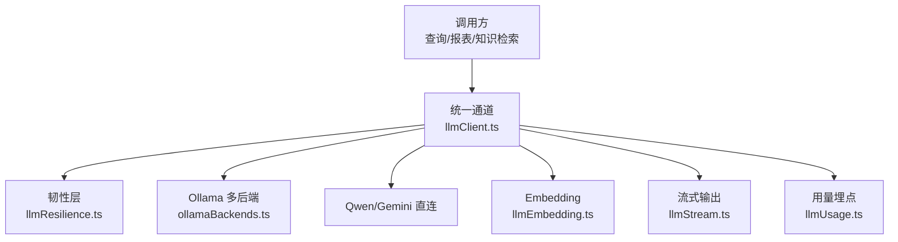
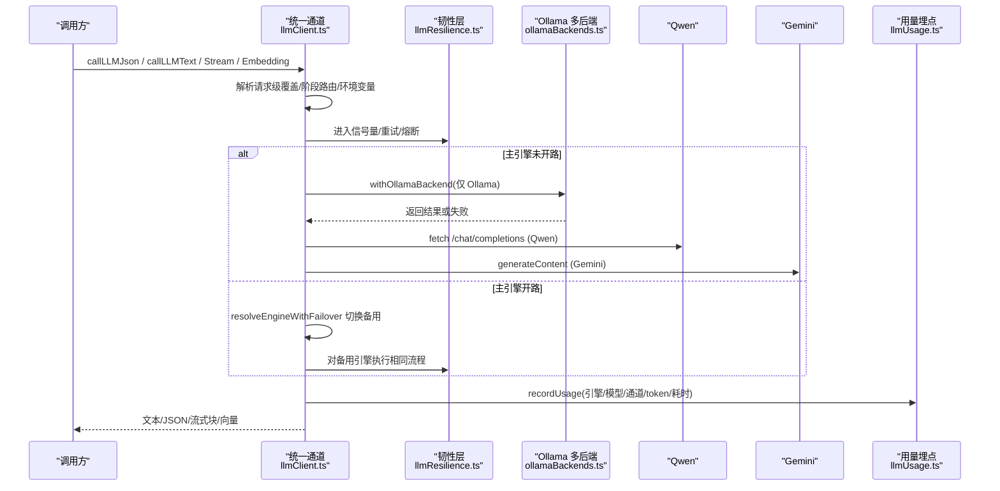
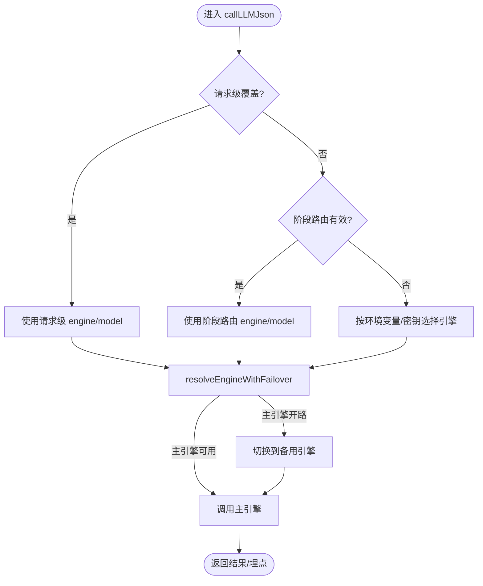
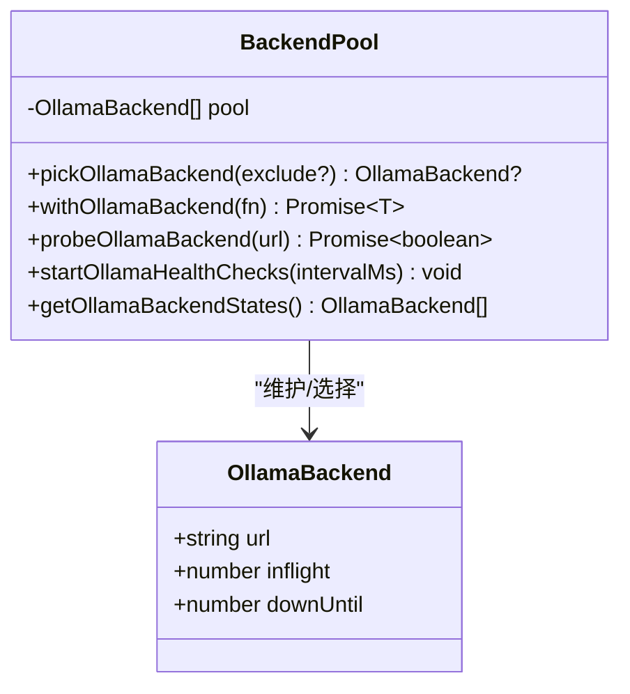
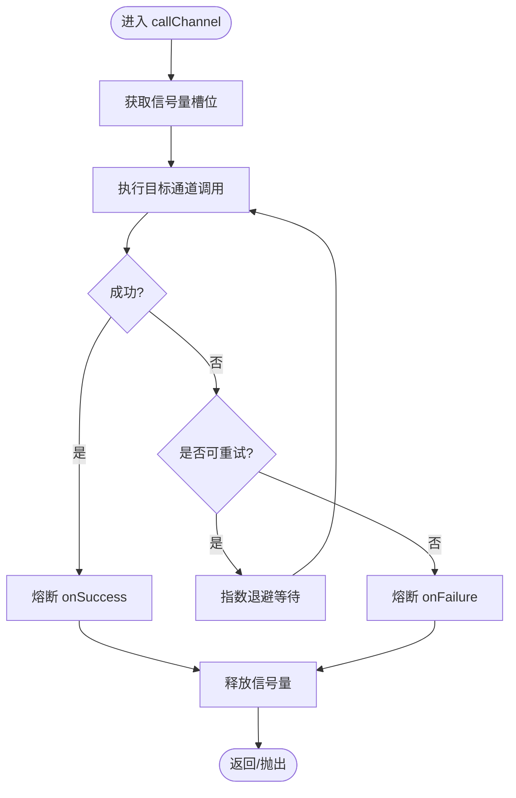
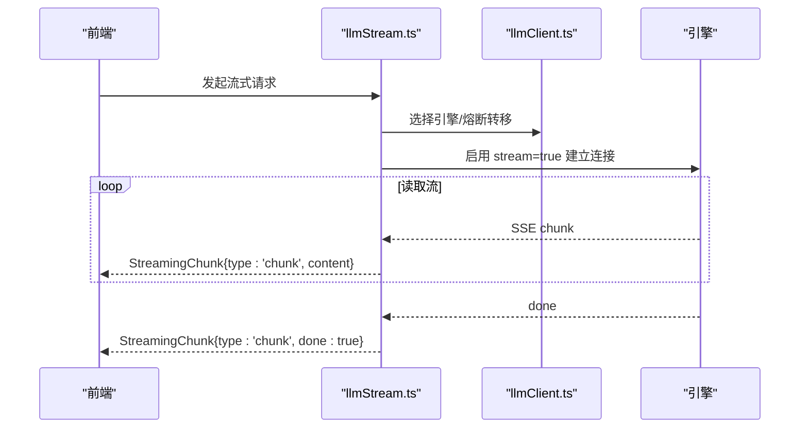
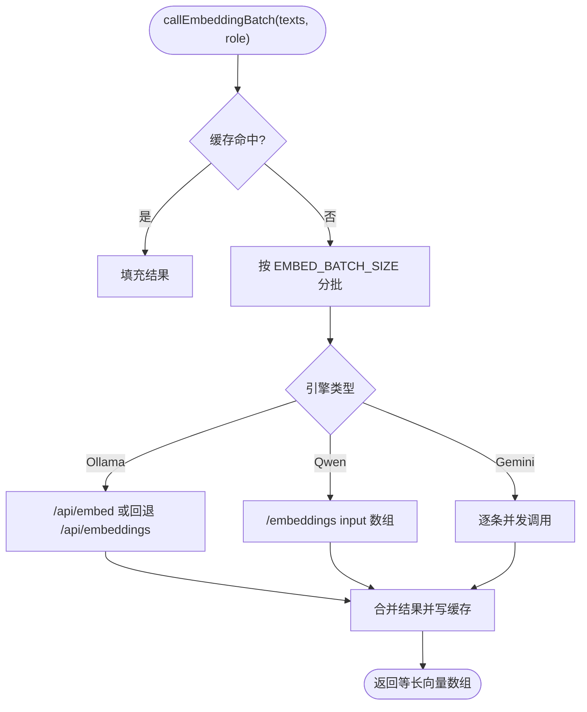
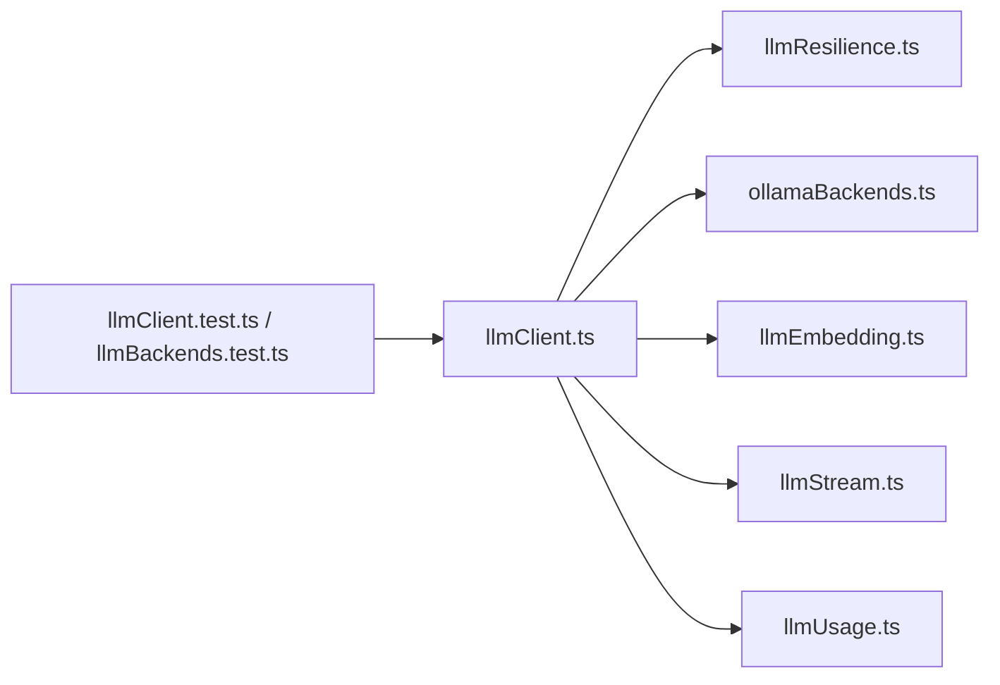

# 多引擎架构设计

<cite>
**本文引用的文件**
- [server/llm/llmClient.ts](file://server/llm/llmClient.ts)
- [server/llm/ollamaBackends.ts](file://server/llm/ollamaBackends.ts)
- [server/llm/llmResilience.ts](file://server/llm/llmResilience.ts)
- [server/llm/llmEmbedding.ts](file://server/llm/llmEmbedding.ts)
- [server/llm/llmStream.ts](file://server/llm/llmStream.ts)
- [server/llm/llmUsage.ts](file://server/llm/llmUsage.ts)
- [server/llm/llmClient.test.ts](file://server/llm/llmClient.test.ts)
- [server/llm/llmBackends.test.ts](file://server/llm/llmBackends.test.ts)
</cite>

## 目录
1. [简介](#简介)
2. [项目结构](#项目结构)
3. [核心组件](#核心组件)
4. [架构总览](#架构总览)
5. [详细组件分析](#详细组件分析)
6. [依赖关系分析](#依赖关系分析)
7. [性能考量](#性能考量)
8. [故障排查指南](#故障排查指南)
9. [结论](#结论)
10. [附录：配置与使用模式](#附录配置与使用模式)

## 简介
本系统为智能问数据分析提供统一的多 LLM 引擎抽象层，支持 Ollama 本地模型、Gemini 云端模型、通义千问（百炼）模型的接入与差异处理。通过请求级覆盖、阶段级路由与环境变量配置的优先级机制，实现灵活的引擎选择；通过多后端负载均衡与健康检查、熔断与自适应超时、指数退避重试等韧性原语，保障高可用与稳定性；通过动态模型目录发现与可用模型列表生成，便于前端展示与用户自选；并提供流式输出与 Embedding 批量化能力，支撑实时交互与知识库检索场景。

## 项目结构
围绕 LLM 能力的核心代码集中在 server/llm 目录：
- llmClient.ts：统一调用通道、引擎选择策略、模型目录、用量埋点入口
- ollamaBackends.ts：Ollama 多后端池、最少并发路由、健康检查与摘除恢复
- llmResilience.ts：重试、熔断、信号量、自适应超时等韧性原语
- llmEmbedding.ts：Embedding 单条/批量、缓存与多后端兼容
- llmStream.ts：Token 级流式输出（SSE）
- llmUsage.ts：用量统计落库与聚合查询

**图表来源**
- [server/llm/llmClient.ts:1-606](file://server/llm/llmClient.ts#L1-L606)
- [server/llm/ollamaBackends.ts:1-143](file://server/llm/ollamaBackends.ts#L1-L143)
- [server/llm/llmResilience.ts:1-245](file://server/llm/llmResilience.ts#L1-L245)
- [server/llm/llmEmbedding.ts:1-317](file://server/llm/llmEmbedding.ts#L1-L317)
- [server/llm/llmStream.ts:1-300](file://server/llm/llmStream.ts#L1-L300)
- [server/llm/llmUsage.ts:1-134](file://server/llm/llmUsage.ts#L1-L134)

**章节来源**
- [server/llm/llmClient.ts:1-606](file://server/llm/llmClient.ts#L1-L606)
- [server/llm/ollamaBackends.ts:1-143](file://server/llm/ollamaBackends.ts#L1-L143)
- [server/llm/llmResilience.ts:1-245](file://server/llm/llmResilience.ts#L1-L245)
- [server/llm/llmEmbedding.ts:1-317](file://server/llm/llmEmbedding.ts#L1-L317)
- [server/llm/llmStream.ts:1-300](file://server/llm/llmStream.ts#L1-L300)
- [server/llm/llmUsage.ts:1-134](file://server/llm/llmUsage.ts#L1-L134)

## 核心组件
- 统一抽象层：对外暴露 callLLMJson/callLLMText/callLLMTextStream/callLLMJsonStream/callEmbedding/callEmbeddingBatch 等接口，屏蔽底层引擎差异。
- 引擎选择策略：请求级覆盖 > 阶段级路由 > 环境变量显式指定 > 密钥存在性推断 > 默认回退。
- 多后端负载均衡：Ollama 多节点最少并发路由 + 失败摘除 + 健康检查恢复。
- 韧性机制：指数退避重试、引擎级熔断器、并发信号量、自适应超时。
- 模型目录管理：动态拉取 Ollama 已安装模型，结合 Qwen/Gemini 密钥状态生成可用模型列表。
- 用量与可观测性：按引擎/模型/通道记录 token 与耗时，支持 Prometheus 旁路与数据库聚合。

**章节来源**
- [server/llm/llmClient.ts:1-606](file://server/llm/llmClient.ts#L1-L606)
- [server/llm/llmResilience.ts:1-245](file://server/llm/llmResilience.ts#L1-L245)
- [server/llm/ollamaBackends.ts:1-143](file://server/llm/ollamaBackends.ts#L1-L143)
- [server/llm/llmEmbedding.ts:1-317](file://server/llm/llmEmbedding.ts#L1-L317)
- [server/llm/llmUsage.ts:1-134](file://server/llm/llmUsage.ts#L1-L134)

## 架构总览
下图展示了从调用方到各后端的完整链路，包括引擎选择、熔断转移、多后端路由、流式与 Embedding 分支以及用量埋点。

**图表来源**
- [server/llm/llmClient.ts:141-525](file://server/llm/llmClient.ts#L141-L525)
- [server/llm/ollamaBackends.ts:74-96](file://server/llm/ollamaBackends.ts#L74-L96)
- [server/llm/llmResilience.ts:179-197](file://server/llm/llmResilience.ts#L179-L197)
- [server/llm/llmUsage.ts:25-49](file://server/llm/llmUsage.ts#L25-L49)

## 详细组件分析

### 统一抽象层与引擎选择策略
- 请求级覆盖：通过异步上下文注入 setLlmOverride，可在单次请求内指定 engine/model，优先于一切其他策略。
- 阶段级路由：SQL 生成与数据解读阶段可通过环境变量 LLM_SQL_ENGINE/LLM_SQL_MODEL 与 LLM_ANALYSIS_ENGINE/LLM_ANALYSIS_MODEL 指定快速小模型，提升结构化任务吞吐与稳定性。
- 环境变量优先级：AI_ENGINE 显式指定 > 密钥存在性（有 GEMINI_API_KEY 则 Gemini，否则 QWEN_API_KEY 则 Qwen，否则 Ollama）。
- 模型名解析：各引擎的默认模型由对应函数提供，支持覆盖。
- 可用模型目录：listAvailableModels 动态拉取 Ollama 已安装模型，结合 Qwen/Gemini 密钥状态生成选项列表，供前端展示与用户自选。

**图表来源**
- [server/llm/llmClient.ts:196-246](file://server/llm/llmClient.ts#L196-L246)
- [server/llm/llmClient.ts:449-525](file://server/llm/llmClient.ts#L449-L525)
- [server/llm/llmClient.ts:302-337](file://server/llm/llmClient.ts#L302-L337)

**章节来源**
- [server/llm/llmClient.ts:196-246](file://server/llm/llmClient.ts#L196-L246)
- [server/llm/llmClient.ts:449-525](file://server/llm/llmClient.ts#L449-L525)
- [server/llm/llmClient.ts:302-337](file://server/llm/llmClient.ts#L302-L337)

### Ollama 多后端负载均衡与故障转移
- 多后端配置：OLLAMA_URLS 逗号分隔多个地址，自动去重与规范化；缺省回退 OLLAMA_URL。
- 最少并发路由：pickOllamaBackend 在健康节点中选择 in-flight 最小的节点；全部摘除时兜底最早恢复节点，尽力服务。
- 失败摘除与恢复：withOllamaBackend 失败即标记 downUntil；后台健康检查周期探测，恢复后重新接入。
- 自动切换：一次调用失败会尝试次优节点，直到成功或无可用节点。

**图表来源**
- [server/llm/ollamaBackends.ts:11-52](file://server/llm/ollamaBackends.ts#L11-L52)
- [server/llm/ollamaBackends.ts:74-133](file://server/llm/ollamaBackends.ts#L74-L133)

**章节来源**
- [server/llm/ollamaBackends.ts:1-143](file://server/llm/ollamaBackends.ts#L1-L143)

### 韧性机制：重试、熔断、信号量、自适应超时
- 指数退避重试：withRetry 针对超时/5xx/网络错误进行重试，4xx 立即失败，避免浪费配额。
- 引擎级熔断：CircuitBreaker 按引擎隔离，连续失败达到阈值后开路，冷却期后半开探测恢复。
- 并发信号量：Semaphore 限制每引擎并发，防止打爆本地推理进程。
- 自适应超时：LatencyWindow 维护近期成功耗时 P95，动态计算超时上限，避免慢模型误杀与快模型被长超时拖累。

**图表来源**
- [server/llm/llmResilience.ts:53-88](file://server/llm/llmResilience.ts#L53-L88)
- [server/llm/llmResilience.ts:103-160](file://server/llm/llmResilience.ts#L103-L160)
- [server/llm/llmResilience.ts:179-197](file://server/llm/llmResilience.ts#L179-L197)
- [server/llm/llmResilience.ts:201-245](file://server/llm/llmResilience.ts#L201-L245)
- [server/llm/llmClient.ts:141-161](file://server/llm/llmClient.ts#L141-L161)

**章节来源**
- [server/llm/llmResilience.ts:1-245](file://server/llm/llmResilience.ts#L1-L245)
- [server/llm/llmClient.ts:141-161](file://server/llm/llmClient.ts#L141-L161)

### 流式输出与 JSON 流式封装
- 文本流式：callLLMTextStream 基于 SSE 逐字推送，适配 Qwen/Ollama/Gemini 三种引擎。
- JSON 流式：callLLMJsonStream 先获取完整结果再分块推送，模拟打字机效果。
- 超时与错误：统一 AbortController 控制超时；流中异常以 error 帧通知前端。

**图表来源**
- [server/llm/llmStream.ts:35-270](file://server/llm/llmStream.ts#L35-L270)
- [server/llm/llmClient.ts:449-525](file://server/llm/llmClient.ts#L449-L525)

**章节来源**
- [server/llm/llmStream.ts:1-300](file://server/llm/llmStream.ts#L1-L300)

### Embedding 单条与批量
- 单条：callEmbedding 支持 Ollama/Qwen/Gemini，nomic 系列需加角色前缀以提升区分度；短 TTL 缓存复用。
- 批量：callEmbeddingBatch 将 misses 按批次发送，减少往返；Ollama 老版本回退逐条；Qwen 原生支持数组并按 index 归位。
- 降级：未安装 embedding 模型或网络异常时抛错，调用方可降级为关键词检索。

**图表来源**
- [server/llm/llmEmbedding.ts:260-315](file://server/llm/llmEmbedding.ts#L260-L315)
- [server/llm/llmEmbedding.ts:60-162](file://server/llm/llmEmbedding.ts#L60-L162)

**章节来源**
- [server/llm/llmEmbedding.ts:1-317](file://server/llm/llmEmbedding.ts#L1-L317)

### 模型目录管理与动态发现
- listAvailableModels：
  - Ollama：调用 /api/tags 获取已安装模型，不可达时回退配置模型；多后端取当前最优节点。
  - Qwen/Gemini：当配置密钥时列入，模型为环境配置值。
- 校验：validateModelSelection 对用户提交的 engine/model 进行合法性校验，非法返回错误原因。

**章节来源**
- [server/llm/llmClient.ts:282-337](file://server/llm/llmClient.ts#L282-L337)

## 依赖关系分析
- llmClient.ts 依赖：
  - ollamaBackends.ts：多后端路由、健康检查、超时常量
  - llmResilience.ts：重试、熔断、信号量、自适应超时
  - llmEmbedding.ts：Embedding 能力
  - llmStream.ts：流式输出
  - llmUsage.ts：用量埋点
- 测试用例验证了引擎选择、多后端路由、熔断与回退、Embedding 批量化等行为。

**图表来源**
- [server/llm/llmClient.ts:1-606](file://server/llm/llmClient.ts#L1-L606)
- [server/llm/llmClient.test.ts:1-130](file://server/llm/llmClient.test.ts#L1-L130)
- [server/llm/llmBackends.test.ts:1-200](file://server/llm/llmBackends.test.ts#L1-L200)

**章节来源**
- [server/llm/llmClient.ts:1-606](file://server/llm/llmClient.ts#L1-L606)
- [server/llm/llmClient.test.ts:1-130](file://server/llm/llmClient.test.ts#L1-L130)
- [server/llm/llmBackends.test.ts:1-200](file://server/llm/llmBackends.test.ts#L1-L200)

## 性能考量
- 并发控制：每引擎默认最大并发 4，避免打爆本地推理进程；超出排队而非丢弃。
- 自适应超时：基于近期成功调用的 P95×3 动态收紧超时上限，兼顾慢模型与快模型。
- 批量 Embedding：显著降低知识库导入/列裁剪等场景的网络往返次数。
- 流式输出：SSE 逐字推送改善首字节延迟与用户体验。
- 熔断与重试：仅在可恢复错误上重试，避免雪崩与配额浪费。

[本节为通用性能讨论，不直接分析具体文件]

## 故障排查指南
- 引擎熔断开路：若主引擎连续失败触发熔断，系统会自动切换到备用引擎；若全部开路，调用快速失败。可通过日志查看“引擎 X 熔断开路”提示。
- Ollama 节点摘除：失败节点会被暂时摘除，等待健康检查恢复；可通过 getOllamaBackendStates 查看节点状态。
- 超时问题：检查 LLM_ADAPTIVE_TIMEOUT、QWEN_TIMEOUT_MS、OLLAMA_TIMEOUT_MS 配置；流式场景注意 AbortController 超时。
- Embedding 失败：确认已安装相应 embedding 模型（如 nomic-embed-text），或 Qwen 端点支持；失败时调用方应降级为关键词检索。
- 用量统计：llm_usage 表写入为 fire-and-forget，失败不影响主链路；可通过 summarizeLlmUsage 按引擎/模型聚合分析成本与成功率。

**章节来源**
- [server/llm/llmClient.ts:125-139](file://server/llm/llmClient.ts#L125-L139)
- [server/llm/ollamaBackends.ts:98-133](file://server/llm/ollamaBackends.ts#L98-L133)
- [server/llm/llmResilience.ts:179-197](file://server/llm/llmResilience.ts#L179-L197)
- [server/llm/llmEmbedding.ts:60-162](file://server/llm/llmEmbedding.ts#L60-L162)
- [server/llm/llmUsage.ts:25-49](file://server/llm/llmUsage.ts#L25-L49)

## 结论
本架构通过统一抽象层屏蔽多引擎差异，结合请求级覆盖、阶段级路由与环境变量优先级，实现灵活可控的引擎选择；借助 Ollama 多后端最少并发路由与健康检查，配合引擎级熔断、指数退避重试与自适应超时，构建了高可用的韧性体系；同时提供模型目录动态发现、流式输出与 Embedding 批量化能力，满足实时交互与大规模数据处理需求。该设计便于扩展新的 LLM 引擎，并在生产环境中具备良好可观测性与可维护性。

[本节为总结性内容，不直接分析具体文件]

## 附录：配置与使用模式

### 环境变量与优先级
- 引擎选择优先级：请求级覆盖 > 阶段级路由 > AI_ENGINE 显式指定 > 密钥存在性（GEMINI_API_KEY/QWEN_API_KEY）> 默认 Ollama。
- 关键变量：
  - LLM_MODEL：Ollama 默认模型
  - QWEN_MODEL/QWEN_URL/QWEN_TIMEOUT_MS/QWEN_API_KEY：通义千问相关
  - GEMINI_API_KEY：Gemini 相关
  - LLM_SQL_ENGINE/LLM_SQL_MODEL、LLM_ANALYSIS_ENGINE/LLM_ANALYSIS_MODEL：阶段级快速模型
  - OLLAMA_URL/OLLAMA_URLS/OLLAMA_TIMEOUT_MS：Ollama 单/多后端与超时
  - EMBED_MODEL/EMBED_BATCH_SIZE：Embedding 模型与批量大小
  - LLM_RETRY_MAX/LLM_MAX_CONCURRENT/LLM_BREAKER_FAILS/LLM_BREAKER_COOLDOWN_MS/LLM_ADAPTIVE_TIMEOUT：韧性参数

**章节来源**
- [server/llm/llmClient.ts:33-57](file://server/llm/llmClient.ts#L33-L57)
- [server/llm/llmClient.ts:62-83](file://server/llm/llmClient.ts#L62-L83)
- [server/llm/llmClient.ts:172-194](file://server/llm/llmClient.ts#L172-L194)
- [server/llm/ollamaBackends.ts:8-9](file://server/llm/ollamaBackends.ts#L8-L9)
- [server/llm/llmEmbedding.ts:21-28](file://server/llm/llmEmbedding.ts#L21-L28)

### 使用模式示例（路径引用）
- 阶段级路由：参考测试中对 sqlStageRoute 的配置与断言
  - [server/llm/llmClient.test.ts:47-76](file://server/llm/llmClient.test.ts#L47-L76)
- 多后端路由与故障转移：参考测试中对 OLLAMA_URLS 与自动切换的验证
  - [server/llm/llmBackends.test.ts:55-125](file://server/llm/llmBackends.test.ts#L55-L125)
- Embedding 批量化：参考测试中对批量大小、缓存命中与老版本回退的验证
  - [server/llm/llmBackends.test.ts:127-200](file://server/llm/llmBackends.test.ts#L127-L200)

### 扩展新 LLM 引擎的步骤（概念性指导）
- 在统一通道中添加新引擎的调用实现（参考 Qwen/Gemini 的实现方式）
- 更新引擎选择逻辑与可用模型目录生成
- 为新引擎添加韧性配置（熔断、信号量、超时窗口）
- 补充测试用例覆盖引擎选择、路由与故障转移场景

[本节为概念性指导，不直接分析具体文件]