# 容错与故障转移

<cite>
**本文引用的文件**
- [llmResilience.ts](file://server/llm/llmResilience.ts)
- [llmClient.ts](file://server/llm/llmClient.ts)
- [ollamaBackends.ts](file://server/llm/ollamaBackends.ts)
- [rateLimiter.ts](file://server/infra/rateLimiter.ts)
- [taskQueue.ts](file://server/infra/taskQueue.ts)
- [monitoring.ts](file://server/infra/monitoring.ts)
- [stateStore.ts](file://server/infra/stateStore.ts)
- [logger.ts](file://server/infra/logger.ts)
- [llmUsage.ts](file://server/llm/llmUsage.ts)
- [auditLog.ts](file://server/infra/auditLog.ts)
- [db.ts](file://server/infra/db.ts)
- [fallbackPipeline.ts](file://server/utils/fallback/fallbackPipeline.ts)
- [types.ts](file://server/utils/fallback/types.ts)
- [ruleBased.ts](file://server/utils/fallbackStrategies/ruleBased.ts)
- [simplerPrompt.ts](file://server/utils/fallbackStrategies/simplerPrompt.ts)
- [fewShotService.ts](file://server/utils/fewShotService.ts)
- [conversationHistory.ts](file://server/query/conversationHistory.ts)
- [queryFeedback.ts](file://server/query/queryFeedback.ts)
- [abTest.ts](file://server/utils/abTest.ts)
- [abTest.ts](file://server/routes/abTest.ts)
- [activeLearning.ts](file://server/utils/activeLearning.ts)
</cite>

## 更新摘要
**变更内容**
- 完善了NL2SQL回退机制的三层策略降级实现，所有策略现在都连接到真实的执行路径
- simpler_prompt策略现在正确使用schema上下文和用户历史对话进行Few-Shot增强
- human_approval策略通过bigram相似度匹配从已批准的SQL示例库中检索相似问题并复用修正SQL
- 增强了few-shot知识库的自动构建和智能检索能力，支持团队和个人双重知识源
- 优化了回退机制的性能监控和审计日志记录

## 目录
1. [简介](#简介)
2. [项目结构](#项目结构)
3. [核心组件](#核心组件)
4. [架构总览](#架构总览)
5. [详细组件分析](#详细组件分析)
6. [NL2SQL 回退机制](#nl2sql-回退机制)
7. [A/B 测试框架](#a-b-测试框架)
8. [主动学习系统](#主动学习系统)
9. [少样本注入服务](#少样本注入服务)
10. [依赖关系分析](#依赖关系分析)
11. [性能考量](#性能考量)
12. [故障排查指南](#故障排查指南)
13. [结论](#结论)
14. [附录：配置调优建议](#附录：配置调优建议)

## 简介
本文件面向生产环境，系统性说明 LLM 调用链路的容错与故障转移机制，覆盖以下关键主题：
- 熔断器模式：失败阈值、冷却期管理、状态监控
- 重试策略：指数退避、可重试条件判断、最大重试次数控制
- 并发控制：信号量限流、队列管理、资源保护
- 自适应超时：P95 延迟计算、动态超时配置、性能监控
- 故障转移：主备引擎切换、健康检查、状态同步
- **增强版** NL2SQL 回退机制：三层策略降级（规则化 → 简化提示词 → 人工审核）、A/B 测试集成、主动学习优先级排序、少样本注入能力
- 配置调优与排障：在高负载下保障稳定性与可观测性

## 项目结构
围绕 LLM 容错与故障转移的相关代码主要分布在 server/llm 与 server/infra 两个子目录，同时新增了 server/utils/fallback 模块用于 NL2SQL 回退机制，以及新增的 A/B 测试和主动学习模块：
- server/llm：统一 LLM 调用通道、韧性原语（重试、熔断、信号量、自适应超时）、多后端路由与健康检查
- server/infra：限流、任务队列、监控埋点、状态存储抽象、日志等基础设施
- server/utils/fallback：NL2SQL 回退机制核心调度器与策略实现
- **新增** server/utils/abTest：A/B 测试框架，支持实验分组、统计分析和效果对比
- **新增** server/utils/activeLearning：主动学习系统，实现困难样本优先级排序
- **新增** server/utils/fewShotService：少样本注入服务，自动构建 Few-Shot 知识库

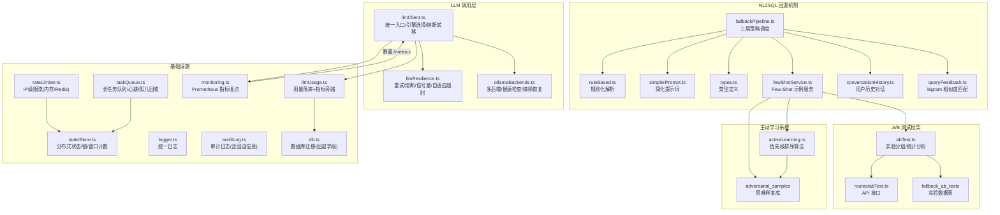

**图表来源**
- [llmClient.ts:125-161](file://server/llm/llmClient.ts#L125-L161)
- [llmResilience.ts:53-197](file://server/llm/llmResilience.ts#L53-L197)
- [ollamaBackends.ts:45-96](file://server/llm/ollamaBackends.ts#L45-L96)
- [fallbackPipeline.ts:47-138](file://server/utils/fallback/fallbackPipeline.ts#L47-L138)
- [fewShotService.ts:71-109](file://server/utils/fewShotService.ts#L71-L109)
- [conversationHistory.ts:158-203](file://server/query/conversationHistory.ts#L158-L203)
- [queryFeedback.ts:91-99](file://server/query/queryFeedback.ts#L91-L99)

## 核心组件
- 重试与可重试判定：基于错误码/状态码的细粒度判断，仅对可恢复错误进行指数退避重试，避免浪费配额。
- 引擎级熔断器：按引擎隔离（Ollama/Qwen/Gemini），连续失败达到阈值后开路，冷却期后半开探测，成功则闭合。
- 并发信号量：按引擎限制并发，超出排队，防止本地 Ollama 被压垮。
- 自适应超时：以近期成功调用 P95×3 动态收紧配置上限，避免慢模型误杀或快模型被长超时拖累。
- 故障转移：主引擎开路时自动切换到已配置且未开路的备用引擎；全部开路快速失败不雪崩。
- 多后端健康检查：Ollama 多节点最少并发路由，失败摘除并周期健康检查恢复。
- **增强版** NL2SQL 回退机制：三层策略降级（规则化 → 简化提示词 → 人工审核），所有失败样本自动记录为 Hard Negative。
- **新增** A/B 测试框架：支持回退策略效果对比分析，自动分配实验组别，提供统计数据查询接口。
- **新增** 主动学习系统：基于多因子评分模型的优先级排序算法，优化困难样本处理效率。
- **新增** 少样本注入服务：自动将专家修正的 SQL 注入知识库，提升后续 Few-Shot 生成质量。
- **增强** 审计日志系统：query_audit_log 表增加 fallback_latency_ms 和 fallback_strategy 字段，支持回退性能追踪。
- 限流与队列：IP 级限流（内存/Redis）与长任务队列（心跳/孤儿回收）保障系统稳定。
- 监控与用量：Prometheus 指标埋点与用量落库，支撑成本与性能分析。

**章节来源**
- [llmResilience.ts:42-197](file://server/llm/llmResilience.ts#L42-L197)
- [llmClient.ts:62-161](file://server/llm/llmClient.ts#L62-L161)
- [ollamaBackends.ts:45-128](file://server/llm/ollamaBackends.ts#L45-L128)
- [fallbackPipeline.ts:47-138](file://server/utils/fallback/fallbackPipeline.ts#L47-L138)
- [fewShotService.ts:71-109](file://server/utils/fewShotService.ts#L71-L109)
- [conversationHistory.ts:158-203](file://server/query/conversationHistory.ts#L158-L203)
- [queryFeedback.ts:91-99](file://server/query/queryFeedback.ts#L91-L99)

## 架构总览
下图展示一次 JSON 模式 LLM 调用的完整链路：请求进入统一入口，先做引擎选择与熔断转移，再经信号量排队、指数退避重试、实际通道调用，最后记录耗时到自适应窗口并上报用量与指标。当 LLM 调用失败时，触发增强的 NL2SQL 回退机制，包括 A/B 测试分组、主动学习优先级排序和少样本注入。

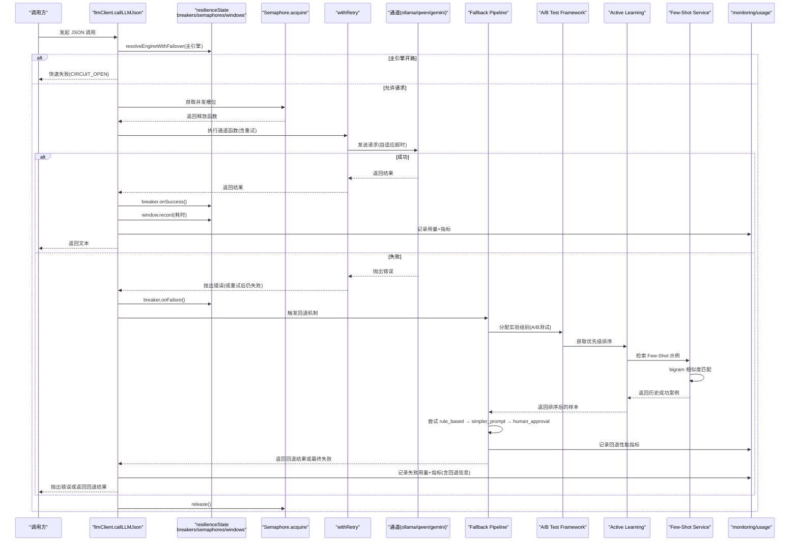

**图表来源**
- [llmClient.ts:449-525](file://server/llm/llmClient.ts#L449-L525)
- [llmResilience.ts:179-197](file://server/llm/llmResilience.ts#L179-L197)
- [llmResilience.ts:103-160](file://server/llm/llmResilience.ts#L103-L160)
- [fallbackPipeline.ts:47-138](file://server/utils/fallback/fallbackPipeline.ts#L47-L138)
- [fewShotService.ts:71-109](file://server/utils/fewShotService.ts#L71-L109)
- [queryFeedback.ts:91-99](file://server/query/queryFeedback.ts#L91-L99)

## 详细组件分析

### 熔断器模式（失败阈值、冷却期、状态监控）
- 状态机：closed → open（连续失败达阈值）→ half-open（冷却期结束，单探测）→ closed（探测成功）。
- 失败阈值与冷却期：通过环境变量配置，默认连续失败 3 次开路，冷却期 30s。
- 半开探测：仅允许一个探测请求，避免风暴；探测失败重新计时。
- 监控：每次成功/失败均记录用量与指标，便于观察熔断触发频率与恢复情况。

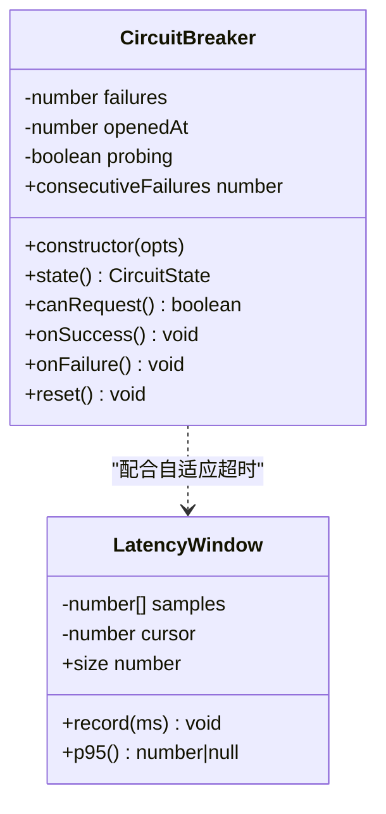

**图表来源**
- [llmResilience.ts:92-160](file://server/llm/llmResilience.ts#L92-L160)
- [llmResilience.ts:201-229](file://server/llm/llmResilience.ts#L201-L229)

**章节来源**
- [llmResilience.ts:92-160](file://server/llm/llmResilience.ts#L92-L160)
- [llmClient.ts:62-107](file://server/llm/llmClient.ts#L62-L107)
- [monitoring.ts:48-61](file://server/infra/monitoring.ts#L48-L61)

### 重试策略（指数退避、重试条件、最大重试次数）
- 可重试判定：TIMEOUT/AbortError、5xx、429、无状态码的网络错误可重试；4xx（鉴权/参数）立即失败。
- 指数退避：baseDelayMs × 2^(attempt-1)，叠加 25% 抖动，避免多实例同频重试。
- 最大重试次数：默认 2 次（不含首次），可通过环境变量限制上限。
- 回调：每次重试前触发 onRetry，用于日志/埋点。

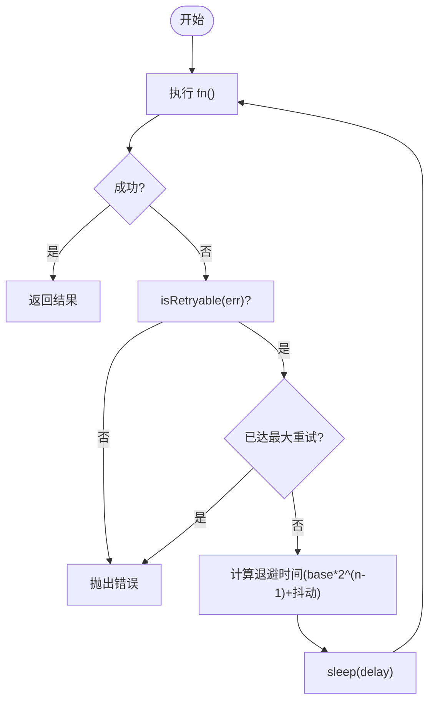

**图表来源**
- [llmResilience.ts:42-49](file://server/llm/llmResilience.ts#L42-L49)
- [llmResilience.ts:179-197](file://server/llm/llmResilience.ts#L179-L197)
- [llmClient.ts:62-80](file://server/llm/llmClient.ts#L62-L80)

**章节来源**
- [llmResilience.ts:42-49](file://server/llm/llmResilience.ts#L42-L49)
- [llmResilience.ts:179-197](file://server/llm/llmResilience.ts#L179-L197)
- [llmClient.ts:62-80](file://server/llm/llmClient.ts#L62-L80)

### 并发控制（信号量、队列、资源保护）
- 信号量：每引擎独立 Semaphore，限制并发数，超出排队等待；确保 finally 释放。
- Ollama 多后端：最少并发路由，失败摘除并健康检查恢复，避免单点过载。
- 长任务队列：MySQL 持久化任务表，worker 并发上限、用户队列上限、心跳与孤儿回收，避免阻塞 HTTP 连接。

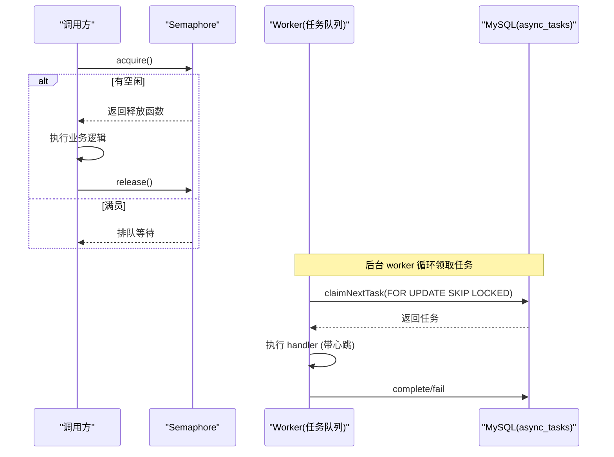

**图表来源**
- [llmResilience.ts:53-88](file://server/llm/llmResilience.ts#L53-L88)
- [ollamaBackends.ts:74-96](file://server/llm/ollamaBackends.ts#L74-L96)
- [taskQueue.ts:144-175](file://server/infra/taskQueue.ts#L144-L175)
- [taskQueue.ts:277-323](file://server/infra/taskQueue.ts#L277-L323)

**章节来源**
- [llmResilience.ts:53-88](file://server/llm/llmResilience.ts#L53-L88)
- [ollamaBackends.ts:45-96](file://server/llm/ollamaBackends.ts#L45-L96)
- [taskQueue.ts:120-227](file://server/infra/taskQueue.ts#L120-L227)

### 自适应超时（P95 延迟、动态配置、性能监控）
- 滑动窗口：维护最近 N 条成功调用耗时，样本不足不做自适应。
- 动态超时：取 P95×3，夹在 [floorMs, configuredMs]，保守不放大超时。
- 监控：每次成功调用记录耗时到对应引擎的窗口，并上报 Prometheus 指标。

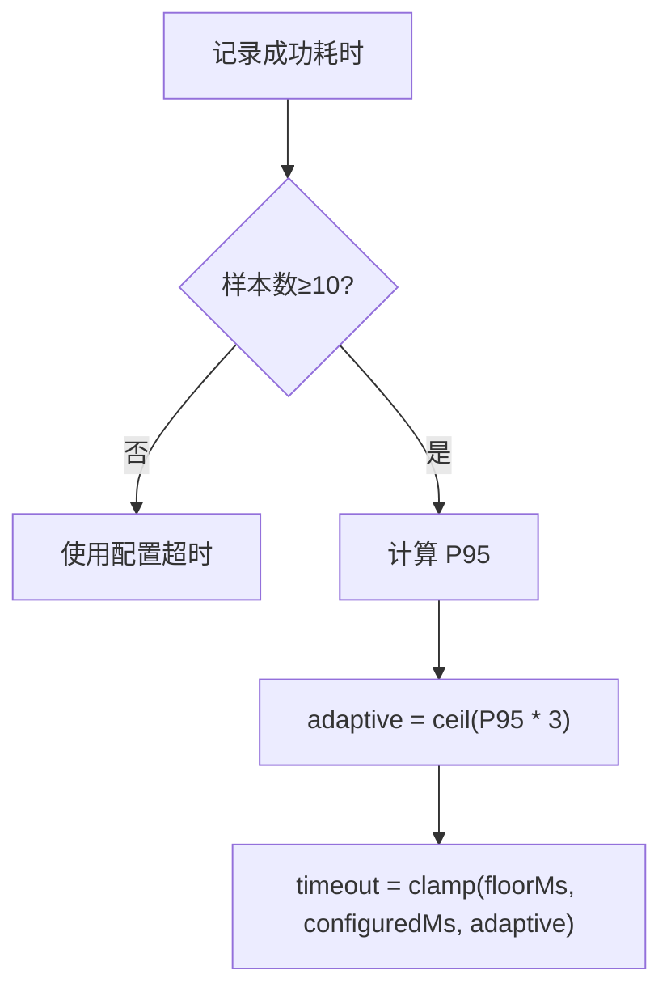

**图表来源**
- [llmResilience.ts:201-244](file://server/llm/llmResilience.ts#L201-244)
- [llmClient.ts:349-395](file://server/llm/llmClient.ts#L349-L395)
- [llmClient.ts:397-442](file://server/llm/llmClient.ts#L397-L442)
- [monitoring.ts:48-61](file://server/infra/monitoring.ts#L48-L61)

**章节来源**
- [llmResilience.ts:201-244](file://server/llm/llmResilience.ts#L201-244)
- [llmClient.ts:349-442](file://server/llm/llmClient.ts#L349-L442)
- [monitoring.ts:48-61](file://server/infra/monitoring.ts#L48-L61)

### 故障转移（主备切换、健康检查、状态同步）
- 主备顺序：根据主引擎确定备选顺序（如 ollama → qwen → gemini）。
- 切换条件：主引擎熔断器不可请求时，尝试备选引擎；若全部开路，快速失败。
- Ollama 多后端健康检查：失败摘除，周期探测恢复；最少并发路由降低热点。
- 状态同步：各引擎熔断器独立维护状态；Ollama 后端状态由池内 downUntil 字段管理。

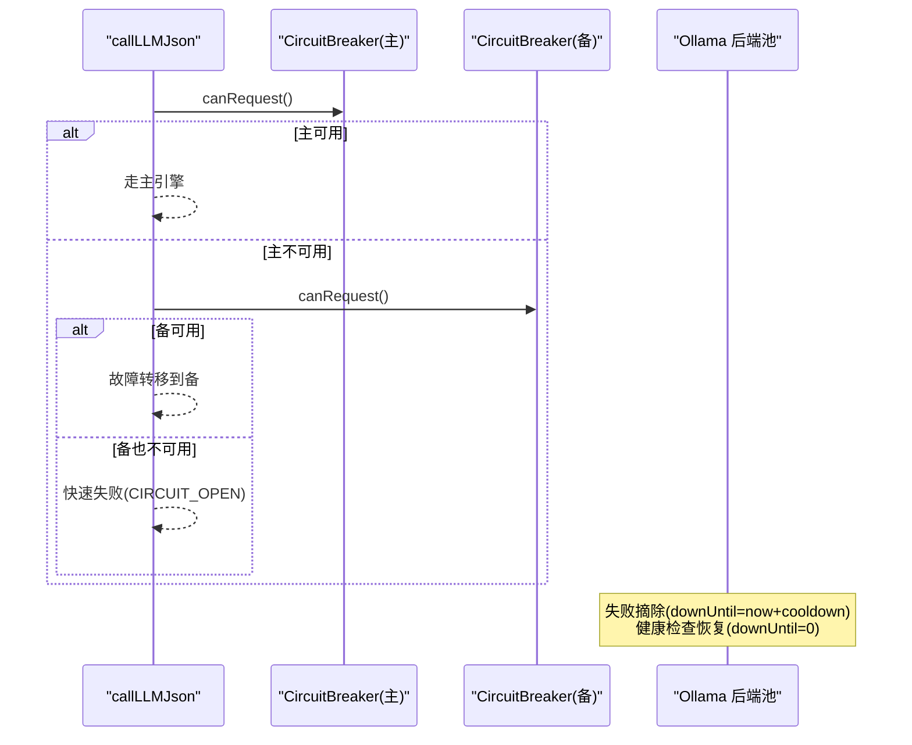

**图表来源**
- [llmClient.ts:125-139](file://server/llm/llmClient.ts#L125-L139)
- [ollamaBackends.ts:45-96](file://server/llm/ollamaBackends.ts#L45-L96)
- [ollamaBackends.ts:111-128](file://server/llm/ollamaBackends.ts#L111-L128)

**章节来源**
- [llmClient.ts:125-139](file://server/llm/llmClient.ts#L125-L139)
- [ollamaBackends.ts:45-128](file://server/llm/ollamaBackends.ts#L45-L128)

### 限流与队列（资源保护）
- IP 级限流：内存滑动窗口或 Redis 固定分钟窗口计数，超限返回 429。
- 长任务队列：提交即返回 taskId，worker 并发上限与用户队列上限控制；心跳与孤儿回收保证可靠性。

**章节来源**
- [rateLimiter.ts:14-42](file://server/infra/rateLimiter.ts#L14-L42)
- [taskQueue.ts:120-227](file://server/infra/taskQueue.ts#L120-L227)

## NL2SQL 回退机制

### 三层策略降级架构
NL2SQL 回退机制采用三层策略降级设计，确保在主 LLM 调用失败时能够优雅降级：

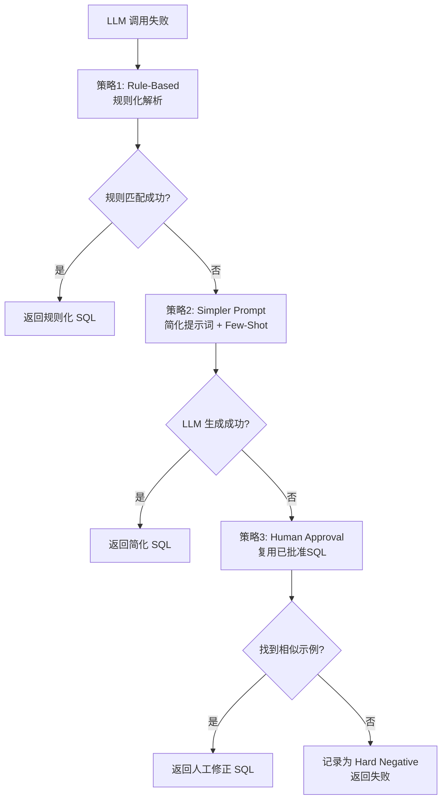

**图表来源**
- [fallbackPipeline.ts:16-138](file://server/utils/fallback/fallbackPipeline.ts#L16-L138)
- [ruleBased.ts:122-161](file://server/utils/fallbackStrategies/ruleBased.ts#L122-L161)
- [simplerPrompt.ts:87-155](file://server/utils/fallbackStrategies/simplerPrompt.ts#L87-L155)

### 规则化解析策略（Rule-Based）
规则化解析策略适用于简单的时间范围查询和单表聚合查询：
- **时间范围检测**：支持多种日期格式（YYYY-MM-DD、中文年月、英文月份）
- **聚合意图识别**：自动识别金额聚合（SUM）和数量聚合（COUNT）
- **快速响应**：无需调用 LLM，直接生成 SQL，响应时间 < 10ms

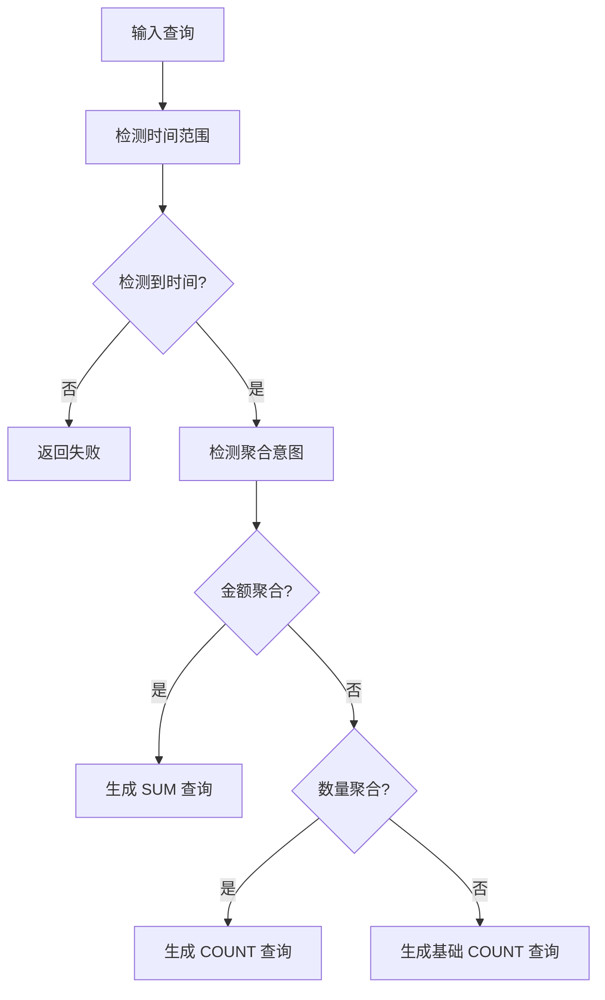

**图表来源**
- [ruleBased.ts:42-112](file://server/utils/fallbackStrategies/ruleBased.ts#L42-L112)
- [ruleBased.ts:122-161](file://server/utils/fallbackStrategies/ruleBased.ts#L122-L161)

**章节来源**
- [ruleBased.ts:1-161](file://server/utils/fallbackStrategies/ruleBased.ts#L1-L161)

### 简化提示词策略（Simpler Prompt）
简化提示词策略通过减少上下文信息并结合真实历史案例来提高 LLM 生成的成功率：

**核心改进**：
- **最小化 Schema**：仅保留最常用的 5-10 张表和关键字段，避免 token 溢出
- **真实 Few-Shot 示例**：结合对抗训练库（管理员已采纳的困难样本）和个人对话沉淀（本人同数据源执行成功的问答对）
- **智能相似度匹配**：使用 bigram 重叠算法进行问题相似度计算
- **用户历史整合**：加载用户个人的成功对话历史作为参考

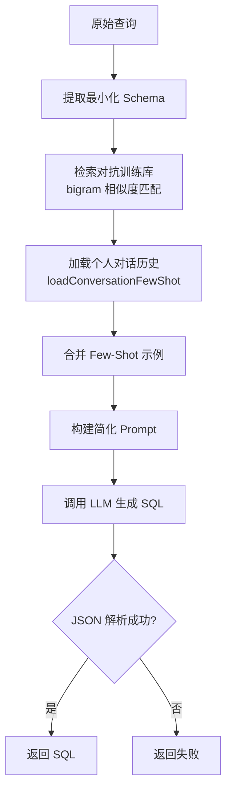

**图表来源**
- [simplerPrompt.ts:20-82](file://server/utils/fallbackStrategies/simplerPrompt.ts#L20-L82)
- [simplerPrompt.ts:87-155](file://server/utils/fallbackStrategies/simplerPrompt.ts#L87-L155)
- [fewShotService.ts:71-109](file://server/utils/fewShotService.ts#L71-L109)
- [conversationHistory.ts:158-203](file://server/query/conversationHistory.ts#L158-L203)

**章节来源**
- [simplerPrompt.ts:1-164](file://server/utils/fallbackStrategies/simplerPrompt.ts#L1-L164)

### 人工审核策略（Human Approval）
人工审核策略通过从已批准的 SQL 示例库中检索相似问题的修正 SQL 来复用人工审核成果：

**核心功能**：
- **bigram 相似度匹配**：使用二字滑窗算法计算问题相似度
- **数据源过滤**：确保检索的示例来自相同的数据源
- **异步计数更新**：命中计数仅用于运营观察，失败静默不影响主流程
- **最佳匹配选择**：返回最相似的单个示例供直接复用

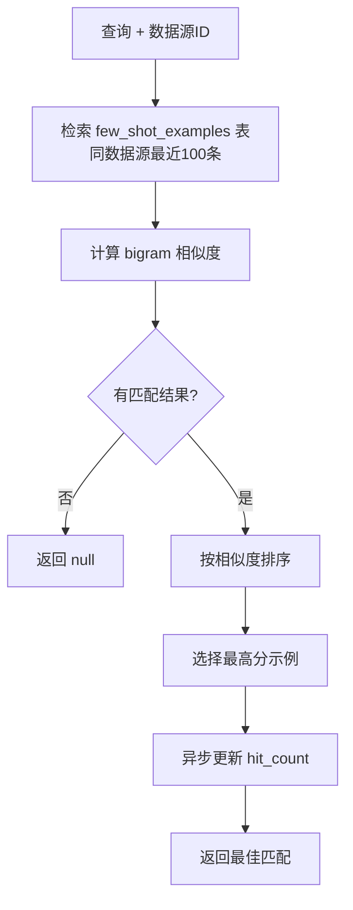

**图表来源**
- [fewShotService.ts:71-109](file://server/utils/fewShotService.ts#L71-L109)
- [queryFeedback.ts:91-99](file://server/query/queryFeedback.ts#L91-L99)

**章节来源**
- [fewShotService.ts:1-121](file://server/utils/fewShotService.ts#L1-L121)
- [queryFeedback.ts:91-99](file://server/query/queryFeedback.ts#L91-L99)

### 性能指标跟踪与审计日志
系统通过增强的审计日志系统跟踪回退机制的性能表现：

**数据库字段扩展**：
- `fallback_latency_ms`：记录回退策略执行的毫秒数
- `fallback_strategy`：记录使用的回退策略（rule_based/simpler_prompt/human_approval/none）

**审计日志流程**：
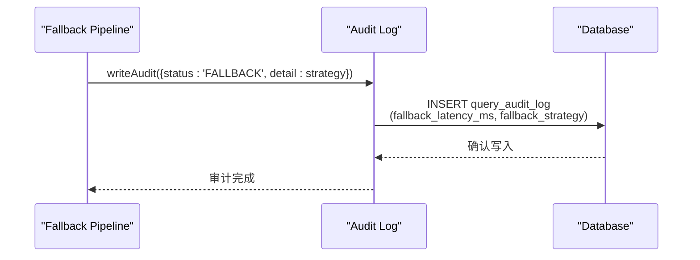

**图表来源**
- [db.ts:767-777](file://server/infra/db.ts#L767-L777)
- [auditLog.ts:38-62](file://server/infra/auditLog.ts#L38-L62)
- [fallbackPipeline.ts:95-101](file://server/utils/fallback/fallbackPipeline.ts#L95-L101)

**章节来源**
- [db.ts:760-867](file://server/infra/db.ts#L760-L867)
- [auditLog.ts:1-62](file://server/infra/auditLog.ts#L1-L62)
- [fallbackPipeline.ts:1-159](file://server/utils/fallback/fallbackPipeline.ts#L1-L159)

## A/B 测试框架

### 实验分组与流量分配
A/B 测试框架为每次回退决策分配实验组别，持续监控各策略效果：
- **Group A**：Rule-Based 策略（规则化解析）
- **Group B**：Human Approval + Few-Shot Enhanced（人工审核 + 少样本增强）
- **流量分配**：基于 userId + 时间戳的确定性哈希，支持可配置的流量比例

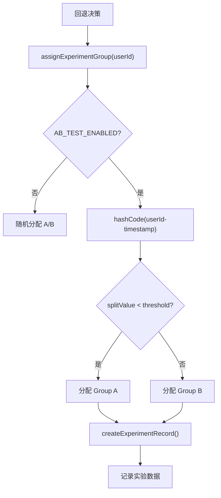

**图表来源**
- [abTest.ts:46-59](file://server/utils/abTest.ts#L46-L59)
- [abTest.ts:75-97](file://server/utils/abTest.ts#L75-L97)

### 统计分析与管理接口
系统提供完整的统计分析功能和管理接口：

**统计指标**：
- 总请求数、成功数、成功率
- 平均延迟、最小延迟、最大延迟
- 组间对比和改进率计算

**API 接口**：
- `/api/admin/ab-test/stats`：获取统计数据（管理员权限）
- `/api/admin/ab-test/records`：查询历史实验记录（管理员权限）
- `/api/admin/ab-test/overview`：快速概览（最近 24 小时）

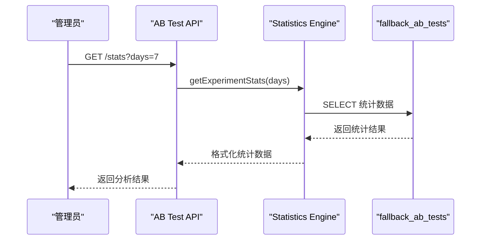

**图表来源**
- [abTest.ts:102-138](file://server/utils/abTest.ts#L102-L138)
- [routes/abTest.ts:17-46](file://server/routes/abTest.ts#L17-L46)
- [routes/abTest.ts:80-127](file://server/routes/abTest.ts#L80-L127)

**章节来源**
- [abTest.ts:13-168](file://server/utils/abTest.ts#L13-L168)
- [routes/abTest.ts:1-130](file://server/routes/abTest.ts#L1-L130)

## 主动学习系统

### 优先级排序算法
主动学习系统通过多因子评分模型对 PENDING 样本进行优先级排序，优先处理高价值样本以提高 Few-Shot 知识库质量：

**评分维度**：
- **时间衰减分**（0-10）：越老的样本分数越高，鼓励尽快审核积压样本
- **高频错误分**（0-30）：同一数据源出现次数越多分数越高
- **查询复杂度分**（0-25）：SQL 长度、关键词数量作为复杂度指标
- **多样性探索分**（0-10）：基于 SQL 模板的唯一性，鼓励覆盖多样场景
- **重要用户加权分**（0-25）：假设 userId 越大权重越高

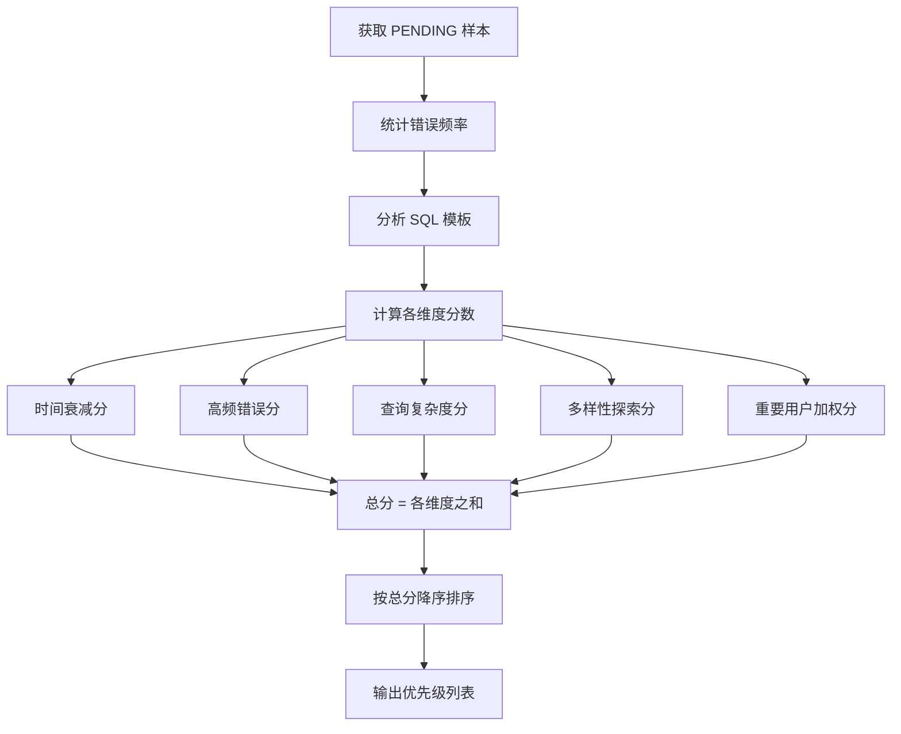

**图表来源**
- [activeLearning.ts:40-129](file://server/utils/activeLearning.ts#L40-L129)

### 样本标准化与去重
系统提供 SQL 模板标准化功能，去除具体数值和字符串，用于相似性检测和去重：

**标准化规则**：
- 数字替换为占位符 `?`
- 单引号字符串替换为占位符 `?`
- 双引号字符串替换为占位符 `?`
- 统一转换为大写格式

**章节来源**
- [activeLearning.ts:1-144](file://server/utils/activeLearning.ts#L1-L144)

## 少样本注入服务

### 知识库自动构建
少样本注入服务当人类专家采纳困难样本时，自动将 approved SQL 注入知识库作为 Few-Shot 示例：

**注入流程**：
1. 批量处理批准的困难样本（每批最多 10 个）
2. 格式化内容为标准 Few-Shot 模板
3. 插入到 few_shot_examples 表中，标记为 FEW_SHOT 类型
4. 记录注入日志和统计信息

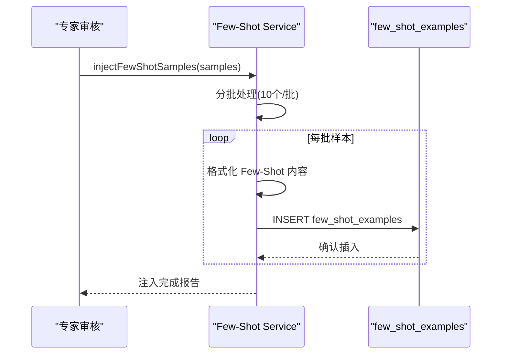

**图表来源**
- [fewShotService.ts:34-64](file://server/utils/fewShotService.ts#L34-L64)

### 智能检索与匹配
系统支持从知识库中检索相关的 Few-Shot 示例，用于指导 LLM 生成：

**检索策略**：
- 按数据源 ID 过滤，确保领域相关性
- 按创建时间倒序排列，优先使用最新知识
- 使用 bigram 相似度算法进行问题匹配
- 支持限制返回数量，控制上下文大小
- 异步检索，失败不影响主流程

**章节来源**
- [fewShotService.ts:1-121](file://server/utils/fewShotService.ts#L1-L121)

## 依赖关系分析
- llmClient.ts 依赖 llmResilience.ts 提供的重试、熔断、信号量、自适应超时能力，以及 ollamaBackends.ts 的多后端路由与健康检查。
- monitoring.ts 提供 Prometheus 指标埋点，被 llmUsage.ts 与业务埋点调用。
- stateStore.ts 为限流与分布式锁提供统一抽象，支持内存与 Redis 两种实现。
- taskQueue.ts 依赖 MySQL 持久化任务状态，并通过心跳与孤儿回收保障可靠性。
- **增强** fallbackPipeline.ts 依赖 ruleBased.ts 和 simplerPrompt.ts 实现三层策略降级，并集成 A/B 测试和主动学习功能。
- **新增** abTest.ts 提供实验分组和统计分析功能，routes/abTest.ts 提供管理接口。
- **新增** activeLearning.ts 实现优先级排序算法，fewShotService.ts 提供知识库注入和检索功能。
- **增强** auditLog.ts 与 db.ts 协作实现回退机制的审计日志记录，支持新的实验数据表。

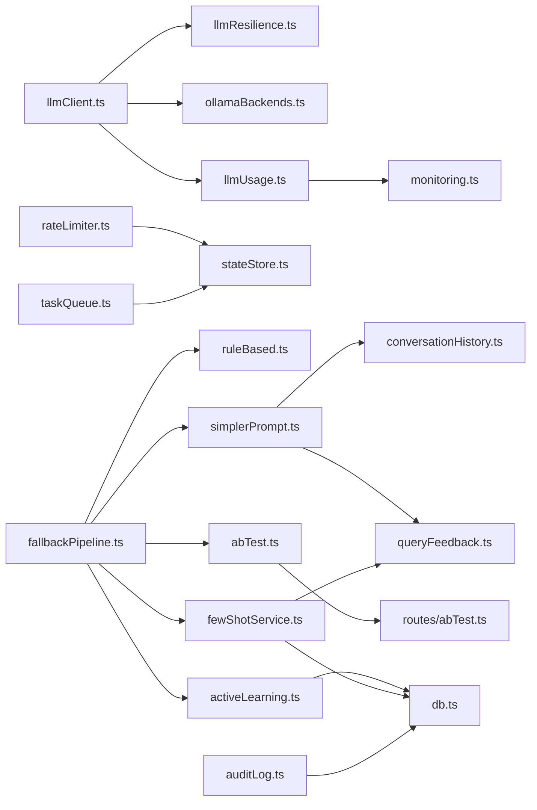

**图表来源**
- [llmClient.ts:9-26](file://server/llm/llmClient.ts#L9-L26)
- [llmUsage.ts:5-8](file://server/llm/llmUsage.ts#L5-L8)
- [rateLimiter.ts:6-8](file://server/infra/rateLimiter.ts#L6-L8)
- [taskQueue.ts:16-19](file://server/infra/taskQueue.ts#L16-L19)
- [fallbackPipeline.ts:12-14](file://server/utils/fallback/fallbackPipeline.ts#L12-L14)
- [abTest.ts:9-10](file://server/utils/abTest.ts#L9-L10)
- [activeLearning.ts:8-9](file://server/utils/activeLearning.ts#L8-L9)
- [fewShotService.ts:8-9](file://server/utils/fewShotService.ts#L8-L9)
- [simplerPrompt.ts:16-17](file://server/utils/fallbackStrategies/simplerPrompt.ts#L16-L17)
- [fewShotService.ts:13](file://server/utils/fewShotService.ts#L13)
- [auditLog.ts:6-8](file://server/infra/auditLog.ts#L6-L8)

**章节来源**
- [llmClient.ts:9-26](file://server/llm/llmClient.ts#L9-L26)
- [llmUsage.ts:5-8](file://server/llm/llmUsage.ts#L5-L8)
- [rateLimiter.ts:6-8](file://server/infra/rateLimiter.ts#L6-L8)
- [taskQueue.ts:16-19](file://server/infra/taskQueue.ts#L16-L19)
- [fallbackPipeline.ts:12-14](file://server/utils/fallback/fallbackPipeline.ts#L12-L14)
- [abTest.ts:9-10](file://server/utils/abTest.ts#L9-L10)
- [activeLearning.ts:8-9](file://server/utils/activeLearning.ts#L8-L9)
- [fewShotService.ts:8-9](file://server/utils/fewShotService.ts#L8-L9)
- [simplerPrompt.ts:16-17](file://server/utils/fallbackStrategies/simplerPrompt.ts#L16-L17)
- [fewShotService.ts:13](file://server/utils/fewShotService.ts#L13)
- [auditLog.ts:6-8](file://server/infra/auditLog.ts#L6-L8)

## 性能考量
- 重试风暴抑制：指数退避 + 抖动，避免多实例同时重试导致二次冲击。
- 熔断快速失败：主备全部开路时直接失败，减少无效网络开销。
- 自适应超时：基于 P95 动态调整，避免慢模型误杀与快模型被长超时拖累。
- 并发与队列：信号量与任务队列解耦交互与长任务，避免占用 HTTP 连接。
- **增强** 回退机制性能优化：规则化策略响应时间 < 10ms，简化提示词策略减少上下文大小提升生成速度。
- **新增** A/B 测试性能影响：实验分组基于确定性哈希，数据库操作异步化，对主流程影响极小。
- **新增** 主动学习性能优化：优先级排序算法时间复杂度 O(n log n)，支持批量处理。
- **新增** 少样本注入性能优化：批量插入（10个/批），异步处理，失败不影响主流程。
- **增强** 审计日志性能：异步写入，失败不影响主流程，确保高可用性。
- **新增** bigram 相似度匹配：轻量级算法，无需外部依赖，毫秒级计算。
- **新增** 个人对话历史缓存：限制检索范围（近100条），避免全表扫描。
- 监控与用量：Prometheus 直方图与计数器，结合用量落库，便于容量规划与成本优化。

## 故障排查指南
- 频繁熔断：检查连续失败是否超过阈值，确认上游服务健康与密钥配置；查看 Prometheus 指标 llm_call_duration_seconds 与 ok 标签。
- 重试过多：确认错误类型是否为可重试（TIMEOUT/5xx/429/网络错误），4xx 不应重试；调整 maxRetries 与 baseDelayMs。
- 超时异常：核对自适应超时是否生效（样本数≥10），必要时提高 floorMs 或配置上限；关注 Ollama 多后端摘除与恢复。
- 并发瓶颈：观察 Semaphore active/queued，适当提升 LLM_MAX_CONCURRENT；检查 Ollama 后端 inflight。
- 任务堆积：检查 taskWorkerConcurrency 与 TASK_QUEUE_USER_MAX；查看心跳超时与孤儿回收数量。
- 限流触发：确认 RATE_LIMIT_MAX 与窗口大小；Redis 模式下检查 incrWindow 原子性与 TTL。
- **增强** 回退机制问题排查：
  - 规则化策略失败：检查时间范围解析正则表达式，确认查询格式是否符合预期
  - 简化提示词策略失败：验证 schema 提取逻辑，检查 few-shot 历史数据质量
  - 人工审核策略失败：检查 few_shot_examples 表数据完整性，验证 bigram 相似度计算
  - 回退性能问题：查询 query_audit_log 表的 fallback_latency_ms 字段，分析各策略性能分布
  - 回退策略选择：检查 fallback_strategy 字段，确认策略降级路径是否符合预期
- **新增** A/B 测试问题排查：
  - 实验分组异常：检查 AB_TEST_ENABLED 配置和用户 ID 分配逻辑
  - 统计数据不准确：验证 fallback_ab_tests 表数据完整性，检查统计查询逻辑
  - 流量分配不均：确认 trafficSplit 配置和哈希函数实现
- **新增** 主动学习问题排查：
  - 优先级排序异常：检查 adversarial_samples 表数据和评分算法实现
  - 样本去重失效：验证 SQL 模板标准化逻辑和相似度计算
  - 处理效率低下：调整批次大小和并发度设置
- **新增** 少样本注入问题排查：
  - 注入失败：检查 few_shot_examples 表结构和插入权限
  - 检索结果不准确：验证数据源过滤和 bigram 相似度计算
  - 知识库膨胀：实施定期清理策略，控制知识库规模
- **新增** bigram 相似度匹配问题排查：
  - 匹配精度低：检查问题文本预处理和相似度阈值设置
  - 性能问题：验证查询索引和检索范围限制
  - 数据一致性：确认 few_shot_examples 表与 conversation_history 表的数据同步

**章节来源**
- [llmResilience.ts:42-49](file://server/llm/llmResilience.ts#L42-L49)
- [llmResilience.ts:179-197](file://server/llm/llmResilience.ts#L179-L197)
- [llmClient.ts:62-80](file://server/llm/llmClient.ts#L62-L80)
- [ollamaBackends.ts:45-96](file://server/llm/ollamaBackends.ts#L45-L96)
- [taskQueue.ts:206-227](file://server/infra/taskQueue.ts#L206-L227)
- [rateLimiter.ts:14-42](file://server/infra/rateLimiter.ts#L14-L42)
- [monitoring.ts:48-126](file://server/infra/monitoring.ts#L48-L126)
- [ruleBased.ts:42-112](file://server/utils/fallbackStrategies/ruleBased.ts#L42-L112)
- [simplerPrompt.ts:20-82](file://server/utils/fallbackStrategies/simplerPrompt.ts#L20-L82)
- [fewShotService.ts:71-109](file://server/utils/fewShotService.ts#L71-L109)
- [queryFeedback.ts:91-99](file://server/query/queryFeedback.ts#L91-L99)
- [auditLog.ts:38-62](file://server/infra/auditLog.ts#L38-L62)
- [abTest.ts:46-59](file://server/utils/abTest.ts#L46-L59)
- [activeLearning.ts:40-129](file://server/utils/activeLearning.ts#L40-L129)

## 结论
本系统通过"重试 + 熔断 + 信号量 + 自适应超时 + 故障转移 + 增强版 NL2SQL 回退机制"的组合拳，构建了高可用的 LLM 调用链路。新增的 A/B 测试框架、主动学习系统和少样本注入服务显著提升了回退机制的智能性和可观测性。三层策略降级机制确保了在主 LLM 调用失败时的优雅降级能力，而增强的审计日志系统提供了完整的性能追踪和问题诊断能力。配合限流、任务队列与完善的监控埋点，能够在高负载与不稳定外部依赖场景下保持服务稳定与可观测性。建议在生产中结合 Prometheus 与用量数据持续调优阈值与超时策略，确保成本与性能的平衡。

## 附录：配置调优建议
- 重试与退避
  - LLM_RETRY_MAX：建议 1–3，视上游稳定性而定
  - baseDelayMs：默认 1000ms，可根据网络抖动调整
- 熔断
  - LLM_BREAKER_FAILS：默认 3，过高易雪崩，过低易误判
  - LLM_BREAKER_COOLDOWN_MS：默认 30000ms，短冷却适合快速恢复
- 并发
  - LLM_MAX_CONCURRENT：默认 4，本地 Ollama 建议保守设置
- 自适应超时
  - LLM_ADAPTIVE_TIMEOUT：默认开启；样本不足时使用配置上限
  - floorMs：默认 15000ms，可按模型特性调整
- Ollama 多后端
  - OLLAMA_URLS：逗号分隔多节点，启用最少并发与健康检查
  - OLLAMA_TIMEOUT_MS：默认 180000ms，按需调整
- **增强** NL2SQL 回退机制配置
  - FALLBACK_STRATEGIES：策略优先级 ['rule_based', 'simpler_prompt', 'human_approval']
  - RULE_BASED_TIME_PATTERNS：时间范围匹配正则表达式配置
  - SIMPLER_PROMPT_SCHEMA_SIZE：简化 schema 的最大表数量
  - FEWSHOT_HISTORY_COUNT：few-shot 示例的历史对话数量
  - BIGRAM_SIMILARITY_THRESHOLD：bigram 相似度匹配阈值
- **新增** A/B 测试配置
  - AB_TEST_ENABLED：是否启用 A/B 测试（true/false）
  - trafficSplit.ruleBased：Group A 流量比例（默认 0.5）
  - trafficSplit.humanApproval：Group B 流量比例（默认 0.5）
- **新增** 主动学习配置
  - ACTIVE_LEARNING_ENABLED：是否启用主动学习（true/false）
  - BATCH_SIZE：批量处理大小（默认 10）
  - MAX_PRIORITY_SCORE：最高优先级分数阈值
- **新增** 少样本注入配置
  - FEWSHOT_INJECTION_ENABLED：是否启用自动注入（true/false）
  - KNOWLEDGE_BASE_RETENTION_DAYS：知识库保留天数
  - MAX_KNOWLEDGE_ENTRIES：最大知识条目数量
  - CONVERSATION_RETENTION：对话历史保留条数（默认 500）
- 限流与队列
  - RATE_LIMIT_MAX：默认 30 次/分钟/IP
  - TASK_WORKER_CONCURRENCY：默认 2，长任务并发
  - TASK_QUEUE_USER_MAX：默认 3，防排队风暴
  - TASK_HEARTBEAT_TIMEOUT_MS：默认 90000ms
  - TASK_EXEC_TIMEOUT_MS：默认 600000ms
- **增强** 审计日志配置
  - AUDIT_LOG_RETENTION_DAYS：审计日志保留天数
  - FALLBACK_METRICS_ENABLED：是否启用回退性能指标收集

**章节来源**
- [llmClient.ts:62-83](file://server/llm/llmClient.ts#L62-L83)
- [ollamaBackends.ts:8-9](file://server/llm/ollamaBackends.ts#L8-L9)
- [rateLimiter.ts:9-12](file://server/infra/rateLimiter.ts#L9-L12)
- [taskQueue.ts:66-81](file://server/infra/taskQueue.ts#L66-81)
- [monitoring.ts:48-61](file://server/infra/monitoring.ts#L48-L61)
- [fallbackPipeline.ts:16-17](file://server/utils/fallback/fallbackPipeline.ts#L16-L17)
- [ruleBased.ts:15-22](file://server/utils/fallbackStrategies/ruleBased.ts#L15-L22)
- [simplerPrompt.ts:20-30](file://server/utils/fallbackStrategies/simplerPrompt.ts#L20-L30)
- [fewShotService.ts:33-34](file://server/utils/fewShotService.ts#L33-L34)
- [conversationHistory.ts:77](file://server/query/conversationHistory.ts#L77)
- [auditLog.ts:38-62](file://server/infra/auditLog.ts#L38-L62)
- [abTest.ts:13-22](file://server/utils/abTest.ts#L13-L22)