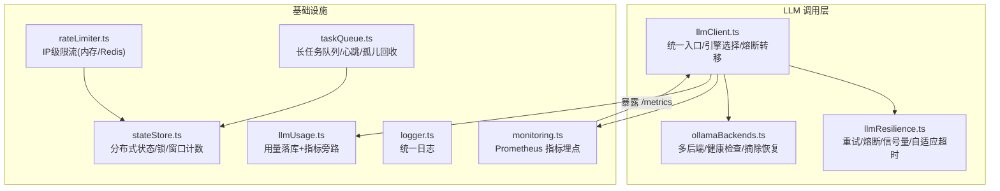
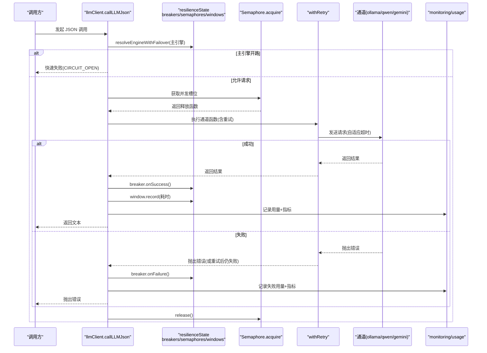
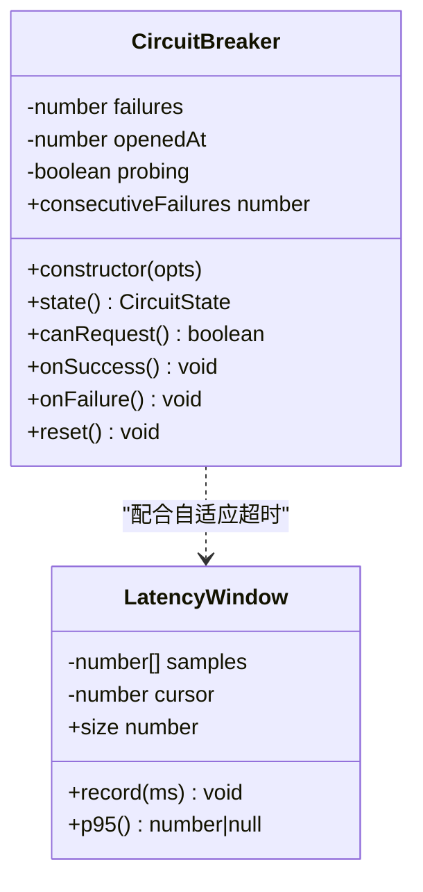
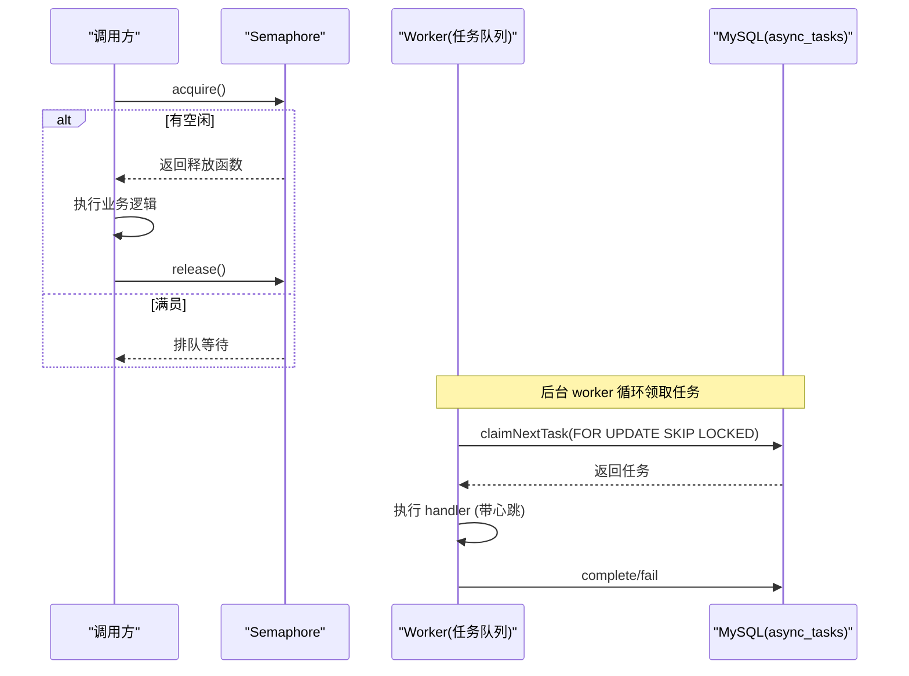
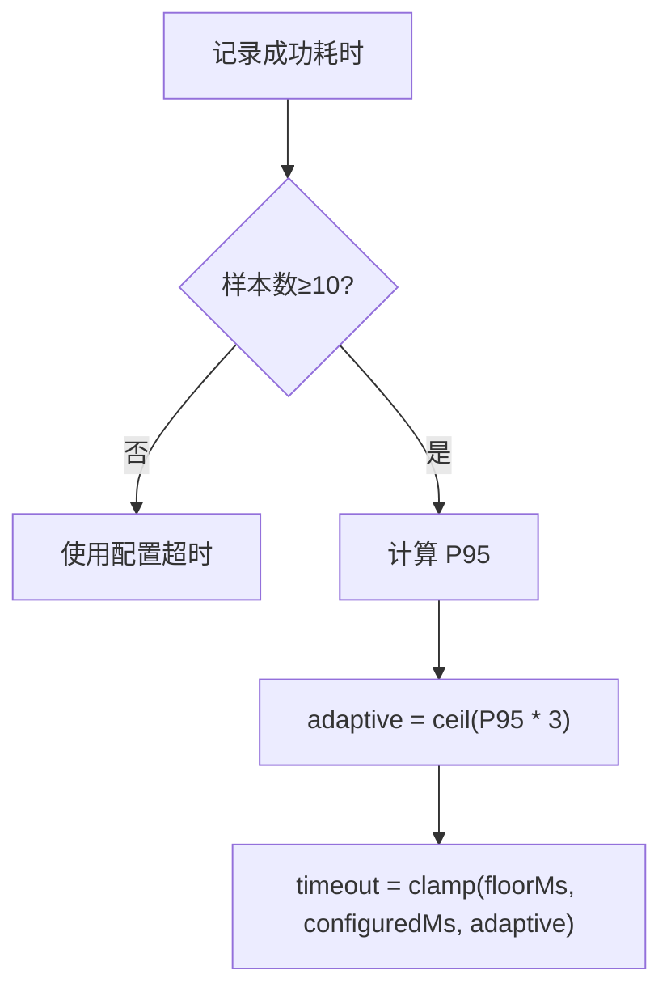
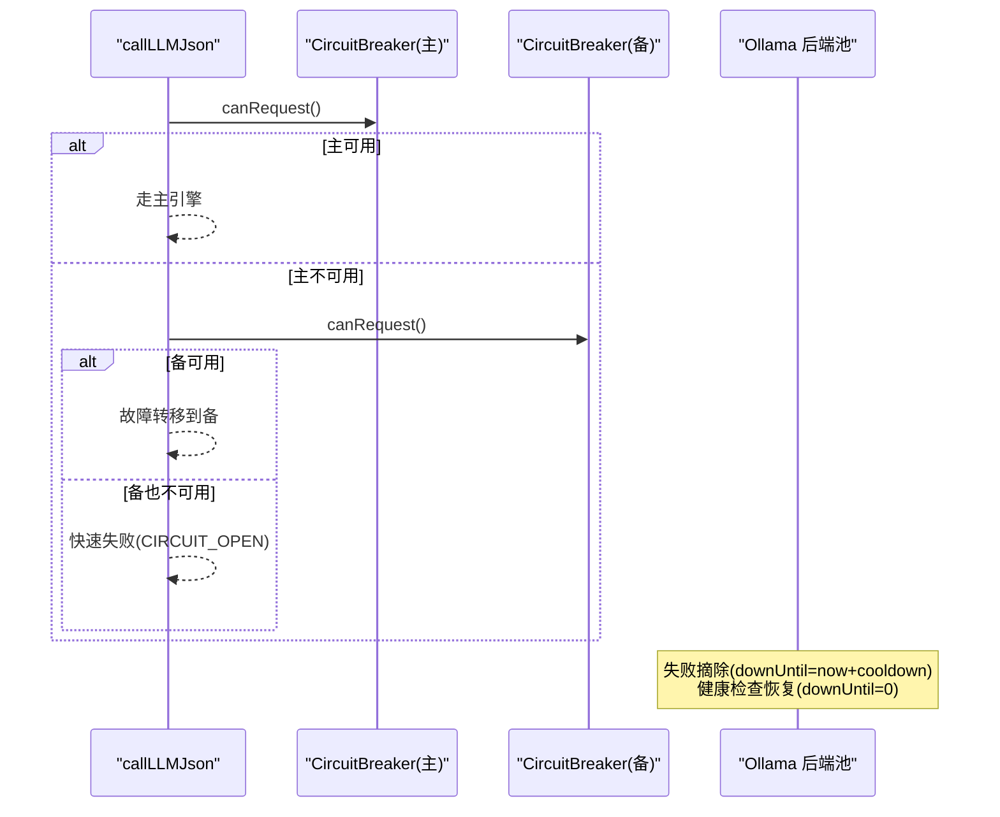
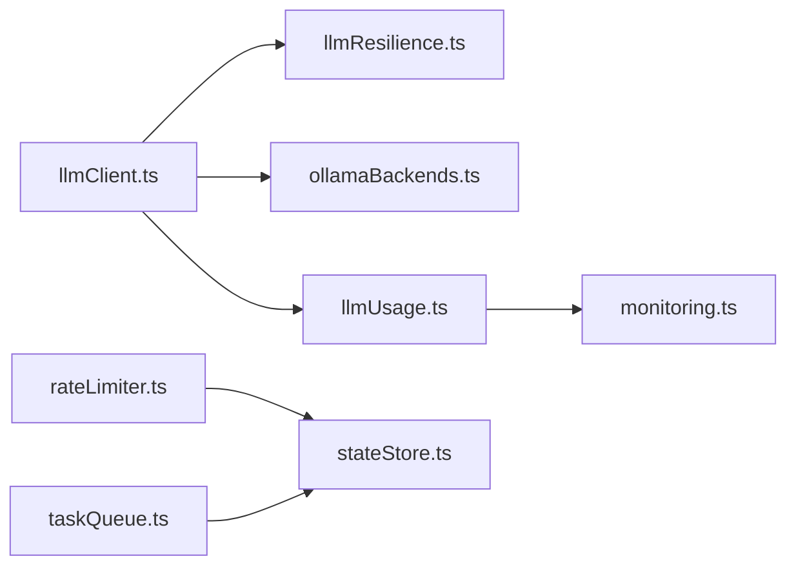

# 容错与故障转移

<cite>
**本文引用的文件**
- [llmResilience.ts](file://server/llm/llmResilience.ts)
- [llmClient.ts](file://server/llm/llmClient.ts)
- [ollamaBackends.ts](file://server/llm/ollamaBackends.ts)
- [rateLimiter.ts](file://server/infra/rateLimiter.ts)
- [taskQueue.ts](file://server/infra/taskQueue.ts)
- [monitoring.ts](file://server/infra/monitoring.ts)
- [stateStore.ts](file://server/infra/stateStore.ts)
- [logger.ts](file://server/infra/logger.ts)
- [llmUsage.ts](file://server/llm/llmUsage.ts)
</cite>

## 目录
1. [简介](#简介)
2. [项目结构](#项目结构)
3. [核心组件](#核心组件)
4. [架构总览](#架构总览)
5. [详细组件分析](#详细组件分析)
6. [依赖关系分析](#依赖关系分析)
7. [性能考量](#性能考量)
8. [故障排查指南](#故障排查指南)
9. [结论](#结论)
10. [附录：配置调优建议](#附录：配置调优建议)

## 简介
本文件面向生产环境，系统性说明 LLM 调用链路的容错与故障转移机制，覆盖以下关键主题：
- 熔断器模式：失败阈值、冷却期管理、状态监控
- 重试策略：指数退避、可重试条件判断、最大重试次数控制
- 并发控制：信号量限流、队列管理、资源保护
- 自适应超时：P95 延迟计算、动态超时配置、性能监控
- 故障转移：主备引擎切换、健康检查、状态同步
- 配置调优与排障：在高负载下保障稳定性与可观测性

## 项目结构
围绕 LLM 容错与故障转移的相关代码主要分布在 server/llm 与 server/infra 两个子目录：
- server/llm：统一 LLM 调用通道、韧性原语（重试、熔断、信号量、自适应超时）、多后端路由与健康检查
- server/infra：限流、任务队列、监控埋点、状态存储抽象、日志等基础设施

图表来源
- [llmClient.ts:125-161](file://server/llm/llmClient.ts#L125-L161)
- [llmResilience.ts:53-197](file://server/llm/llmResilience.ts#L53-L197)
- [ollamaBackends.ts:45-96](file://server/llm/ollamaBackends.ts#L45-L96)
- [rateLimiter.ts:14-42](file://server/infra/rateLimiter.ts#L14-L42)
- [taskQueue.ts:120-175](file://server/infra/taskQueue.ts#L120-L175)
- [monitoring.ts:117-126](file://server/infra/monitoring.ts#L117-L126)
- [stateStore.ts:169-187](file://server/infra/stateStore.ts#L169-L187)

章节来源
- [llmClient.ts:1-120](file://server/llm/llmClient.ts#L1-L120)
- [llmResilience.ts:1-197](file://server/llm/llmResilience.ts#L1-L197)
- [ollamaBackends.ts:1-143](file://server/llm/ollamaBackends.ts#L1-L143)
- [rateLimiter.ts:1-54](file://server/infra/rateLimiter.ts#L1-L54)
- [taskQueue.ts:1-347](file://server/infra/taskQueue.ts#L1-L347)
- [monitoring.ts:1-153](file://server/infra/monitoring.ts#L1-L153)
- [stateStore.ts:1-219](file://server/infra/stateStore.ts#L1-L219)
- [logger.ts:1-41](file://server/infra/logger.ts#L1-L41)
- [llmUsage.ts:1-134](file://server/llm/llmUsage.ts#L1-L134)

## 核心组件
- 重试与可重试判定：基于错误码/状态码的细粒度判断，仅对可恢复错误进行指数退避重试，避免浪费配额。
- 引擎级熔断器：按引擎隔离（Ollama/Qwen/Gemini），连续失败达到阈值后开路，冷却期后半开探测，成功则闭合。
- 并发信号量：按引擎限制并发，超出排队，防止本地 Ollama 被压垮。
- 自适应超时：以近期成功调用 P95×3 动态收紧配置上限，避免慢模型误杀或快模型被长超时拖累。
- 故障转移：主引擎开路时自动切换到已配置且未开路的备用引擎；全部开路快速失败不雪崩。
- 多后端健康检查：Ollama 多节点最少并发路由，失败摘除并周期健康检查恢复。
- 限流与队列：IP 级限流（内存/Redis）与长任务队列（心跳/孤儿回收）保障系统稳定。
- 监控与用量：Prometheus 指标埋点与用量落库，支撑成本与性能分析。

章节来源
- [llmResilience.ts:42-197](file://server/llm/llmResilience.ts#L42-L197)
- [llmClient.ts:62-161](file://server/llm/llmClient.ts#L62-L161)
- [ollamaBackends.ts:45-128](file://server/llm/ollamaBackends.ts#L45-L128)
- [rateLimiter.ts:14-42](file://server/infra/rateLimiter.ts#L14-L42)
- [taskQueue.ts:120-227](file://server/infra/taskQueue.ts#L120-L227)
- [monitoring.ts:48-126](file://server/infra/monitoring.ts#L48-L126)
- [llmUsage.ts:25-50](file://server/llm/llmUsage.ts#L25-L50)

## 架构总览
下图展示一次 JSON 模式 LLM 调用的完整链路：请求进入统一入口，先做引擎选择与熔断转移，再经信号量排队、指数退避重试、实际通道调用，最后记录耗时到自适应窗口并上报用量与指标。

图表来源
- [llmClient.ts:449-525](file://server/llm/llmClient.ts#L449-L525)
- [llmResilience.ts:179-197](file://server/llm/llmResilience.ts#L179-L197)
- [llmResilience.ts:103-160](file://server/llm/llmResilience.ts#L103-L160)
- [monitoring.ts:117-126](file://server/infra/monitoring.ts#L117-L126)
- [llmUsage.ts:25-50](file://server/llm/llmUsage.ts#L25-L50)

## 详细组件分析

### 熔断器模式（失败阈值、冷却期、状态监控）
- 状态机：closed → open（连续失败达阈值）→ half-open（冷却期结束，单探测）→ closed（探测成功）。
- 失败阈值与冷却期：通过环境变量配置，默认连续失败 3 次开路，冷却期 30s。
- 半开探测：仅允许一个探测请求，避免风暴；探测失败重新计时。
- 监控：每次成功/失败均记录用量与指标，便于观察熔断触发频率与恢复情况。

图表来源
- [llmResilience.ts:92-160](file://server/llm/llmResilience.ts#L92-L160)
- [llmResilience.ts:201-229](file://server/llm/llmResilience.ts#L201-L229)

章节来源
- [llmResilience.ts:92-160](file://server/llm/llmResilience.ts#L92-L160)
- [llmClient.ts:62-107](file://server/llm/llmClient.ts#L62-L107)
- [monitoring.ts:48-61](file://server/infra/monitoring.ts#L48-L61)

### 重试策略（指数退避、重试条件、最大重试次数）
- 可重试判定：TIMEOUT/AbortError、5xx、429、无状态码的网络错误可重试；4xx（鉴权/参数）立即失败。
- 指数退避：baseDelayMs × 2^(attempt-1)，叠加 25% 抖动，避免多实例同频重试。
- 最大重试次数：默认 2 次（不含首次），可通过环境变量限制上限。
- 回调：每次重试前触发 onRetry，用于日志/埋点。

图表来源
- [llmResilience.ts:42-49](file://server/llm/llmResilience.ts#L42-L49)
- [llmResilience.ts:179-197](file://server/llm/llmResilience.ts#L179-L197)
- [llmClient.ts:62-80](file://server/llm/llmClient.ts#L62-L80)

章节来源
- [llmResilience.ts:42-49](file://server/llm/llmResilience.ts#L42-L49)
- [llmResilience.ts:179-197](file://server/llm/llmResilience.ts#L179-L197)
- [llmClient.ts:62-80](file://server/llm/llmClient.ts#L62-L80)

### 并发控制（信号量、队列、资源保护）
- 信号量：每引擎独立 Semaphore，限制并发数，超出排队等待；确保 finally 释放。
- Ollama 多后端：最少并发路由，失败摘除并健康检查恢复，避免单点过载。
- 长任务队列：MySQL 持久化任务表，worker 并发上限、用户队列上限、心跳与孤儿回收，避免阻塞 HTTP 连接。

图表来源
- [llmResilience.ts:53-88](file://server/llm/llmResilience.ts#L53-L88)
- [ollamaBackends.ts:74-96](file://server/llm/ollamaBackends.ts#L74-L96)
- [taskQueue.ts:144-175](file://server/infra/taskQueue.ts#L144-L175)
- [taskQueue.ts:277-323](file://server/infra/taskQueue.ts#L277-L323)

章节来源
- [llmResilience.ts:53-88](file://server/llm/llmResilience.ts#L53-L88)
- [ollamaBackends.ts:45-96](file://server/llm/ollamaBackends.ts#L45-L96)
- [taskQueue.ts:120-227](file://server/infra/taskQueue.ts#L120-L227)

### 自适应超时（P95 延迟、动态配置、性能监控）
- 滑动窗口：维护最近 N 条成功调用耗时，样本不足不做自适应。
- 动态超时：取 P95×3，夹在 [floorMs, configuredMs]，保守不放大超时。
- 监控：每次成功调用记录耗时到对应引擎的窗口，并上报 Prometheus 指标。

图表来源
- [llmResilience.ts:201-244](file://server/llm/llmResilience.ts#L201-L244)
- [llmClient.ts:349-395](file://server/llm/llmClient.ts#L349-L395)
- [llmClient.ts:397-442](file://server/llm/llmClient.ts#L397-L442)
- [monitoring.ts:48-61](file://server/infra/monitoring.ts#L48-L61)

章节来源
- [llmResilience.ts:201-244](file://server/llm/llmResilience.ts#L201-L244)
- [llmClient.ts:349-442](file://server/llm/llmClient.ts#L349-L442)
- [monitoring.ts:48-61](file://server/infra/monitoring.ts#L48-L61)

### 故障转移（主备切换、健康检查、状态同步）
- 主备顺序：根据主引擎确定备选顺序（如 ollama → qwen → gemini）。
- 切换条件：主引擎熔断器不可请求时，尝试备选引擎；若全部开路，快速失败。
- Ollama 多后端健康检查：失败摘除，周期探测恢复；最少并发路由降低热点。
- 状态同步：各引擎熔断器独立维护状态；Ollama 后端状态由池内 downUntil 字段管理。

图表来源
- [llmClient.ts:125-139](file://server/llm/llmClient.ts#L125-L139)
- [ollamaBackends.ts:45-96](file://server/llm/ollamaBackends.ts#L45-L96)
- [ollamaBackends.ts:111-128](file://server/llm/ollamaBackends.ts#L111-L128)

章节来源
- [llmClient.ts:125-139](file://server/llm/llmClient.ts#L125-L139)
- [ollamaBackends.ts:45-128](file://server/llm/ollamaBackends.ts#L45-L128)

### 限流与队列（资源保护）
- IP 级限流：内存滑动窗口或 Redis 固定分钟窗口计数，超限返回 429。
- 长任务队列：提交即返回 taskId，worker 并发上限与用户队列上限控制；心跳与孤儿回收保证可靠性。

章节来源
- [rateLimiter.ts:14-42](file://server/infra/rateLimiter.ts#L14-L42)
- [taskQueue.ts:120-227](file://server/infra/taskQueue.ts#L120-L227)

## 依赖关系分析
- llmClient.ts 依赖 llmResilience.ts 提供的重试、熔断、信号量、自适应超时能力，以及 ollamaBackends.ts 的多后端路由与健康检查。
- monitoring.ts 提供 Prometheus 指标埋点，被 llmUsage.ts 与业务埋点调用。
- stateStore.ts 为限流与分布式锁提供统一抽象，支持内存与 Redis 两种实现。
- taskQueue.ts 依赖 MySQL 持久化任务状态，并通过心跳与孤儿回收保障可靠性。

图表来源
- [llmClient.ts:9-26](file://server/llm/llmClient.ts#L9-L26)
- [llmUsage.ts:5-8](file://server/llm/llmUsage.ts#L5-L8)
- [rateLimiter.ts:6-8](file://server/infra/rateLimiter.ts#L6-L8)
- [taskQueue.ts:16-19](file://server/infra/taskQueue.ts#L16-L19)

章节来源
- [llmClient.ts:9-26](file://server/llm/llmClient.ts#L9-L26)
- [llmUsage.ts:5-8](file://server/llm/llmUsage.ts#L5-L8)
- [rateLimiter.ts:6-8](file://server/infra/rateLimiter.ts#L6-L8)
- [taskQueue.ts:16-19](file://server/infra/taskQueue.ts#L16-L19)

## 性能考量
- 重试风暴抑制：指数退避 + 抖动，避免多实例同时重试导致二次冲击。
- 熔断快速失败：主备全部开路时直接失败，减少无效网络开销。
- 自适应超时：基于 P95 动态调整，避免慢模型误杀与快模型被长超时拖累。
- 并发与队列：信号量与任务队列解耦交互与长任务，避免占用 HTTP 连接。
- 监控与用量：Prometheus 直方图与计数器，结合用量落库，便于容量规划与成本优化。

[本节为通用性能讨论，不直接分析具体文件]

## 故障排查指南
- 频繁熔断：检查连续失败是否超过阈值，确认上游服务健康与密钥配置；查看 Prometheus 指标 llm_call_duration_seconds 与 ok 标签。
- 重试过多：确认错误类型是否为可重试（TIMEOUT/5xx/429/网络错误），4xx 不应重试；调整 maxRetries 与 baseDelayMs。
- 超时异常：核对自适应超时是否生效（样本数≥10），必要时提高 floorMs 或配置上限；关注 Ollama 多后端摘除与恢复。
- 并发瓶颈：观察 Semaphore active/queued，适当提升 LLM_MAX_CONCURRENT；检查 Ollama 后端 inflight。
- 任务堆积：检查 taskWorkerConcurrency 与 TASK_QUEUE_USER_MAX；查看心跳超时与孤儿回收数量。
- 限流触发：确认 RATE_LIMIT_MAX 与窗口大小；Redis 模式下检查 incrWindow 原子性与 TTL。

章节来源
- [llmResilience.ts:42-49](file://server/llm/llmResilience.ts#L42-L49)
- [llmResilience.ts:179-197](file://server/llm/llmResilience.ts#L179-L197)
- [llmClient.ts:62-80](file://server/llm/llmClient.ts#L62-L80)
- [ollamaBackends.ts:45-96](file://server/llm/ollamaBackends.ts#L45-L96)
- [taskQueue.ts:206-227](file://server/infra/taskQueue.ts#L206-L227)
- [rateLimiter.ts:14-42](file://server/infra/rateLimiter.ts#L14-L42)
- [monitoring.ts:48-126](file://server/infra/monitoring.ts#L48-L126)

## 结论
本系统通过“重试 + 熔断 + 信号量 + 自适应超时 + 故障转移”的组合拳，构建了高可用的 LLM 调用链路。配合限流、任务队列与完善的监控埋点，能够在高负载与不稳定外部依赖场景下保持服务稳定与可观测性。建议在生产中结合 Prometheus 与用量数据持续调优阈值与超时策略，确保成本与性能的平衡。

[本节为总结性内容，不直接分析具体文件]

## 附录：配置调优建议
- 重试与退避
  - LLM_RETRY_MAX：建议 1–3，视上游稳定性而定
  - baseDelayMs：默认 1000ms，可根据网络抖动调整
- 熔断
  - LLM_BREAKER_FAILS：默认 3，过高易雪崩，过低易误判
  - LLM_BREAKER_COOLDOWN_MS：默认 30000ms，短冷却适合快速恢复
- 并发
  - LLM_MAX_CONCURRENT：默认 4，本地 Ollama 建议保守设置
- 自适应超时
  - LLM_ADAPTIVE_TIMEOUT：默认开启；样本不足时使用配置上限
  - floorMs：默认 15000ms，可按模型特性调整
- Ollama 多后端
  - OLLAMA_URLS：逗号分隔多节点，启用最少并发与健康检查
  - OLLAMA_TIMEOUT_MS：默认 180000ms，按需调整
- 限流与队列
  - RATE_LIMIT_MAX：默认 30 次/分钟/IP
  - TASK_WORKER_CONCURRENCY：默认 2，长任务并发
  - TASK_QUEUE_USER_MAX：默认 3，防排队风暴
  - TASK_HEARTBEAT_TIMEOUT_MS：默认 90000ms
  - TASK_EXEC_TIMEOUT_MS：默认 600000ms

章节来源
- [llmClient.ts:62-83](file://server/llm/llmClient.ts#L62-L83)
- [ollamaBackends.ts:8-9](file://server/llm/ollamaBackends.ts#L8-L9)
- [rateLimiter.ts:9-12](file://server/infra/rateLimiter.ts#L9-L12)
- [taskQueue.ts:66-81](file://server/infra/taskQueue.ts#L66-L81)
- [monitoring.ts:48-61](file://server/infra/monitoring.ts#L48-L61)