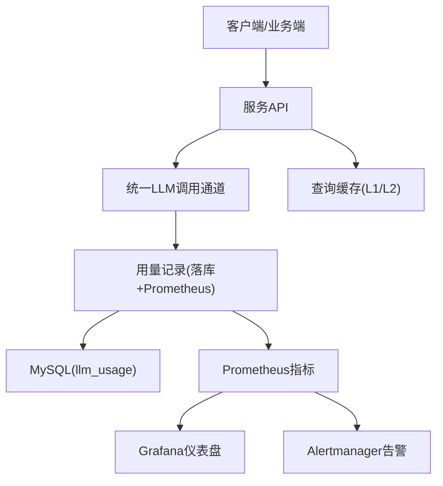
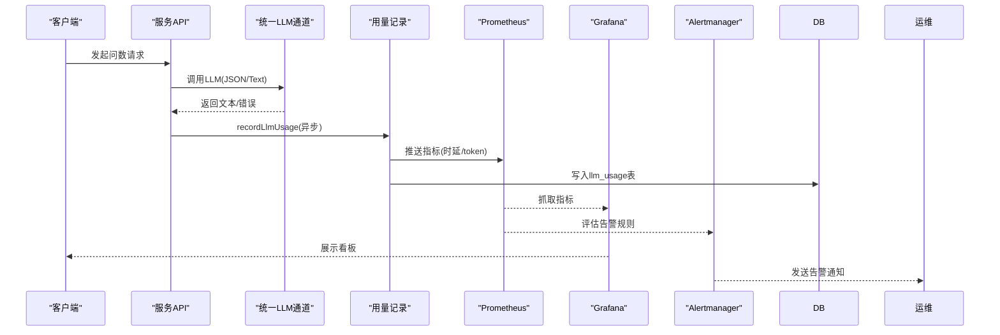
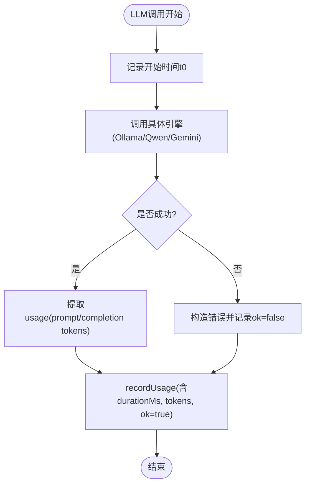
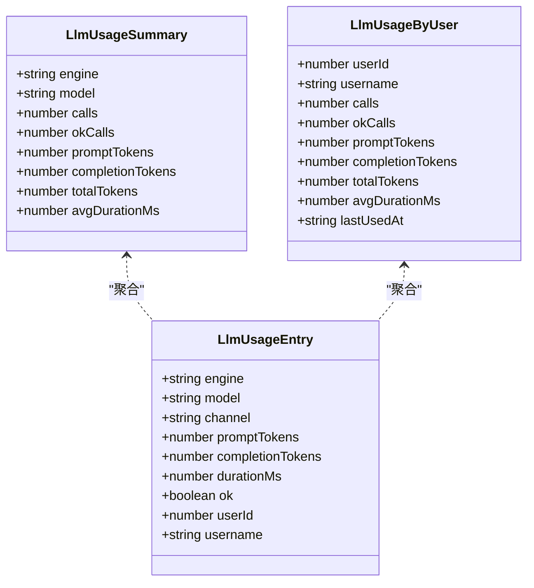
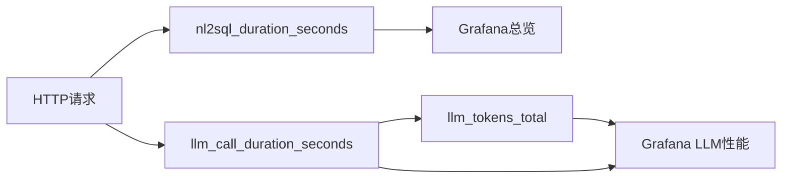
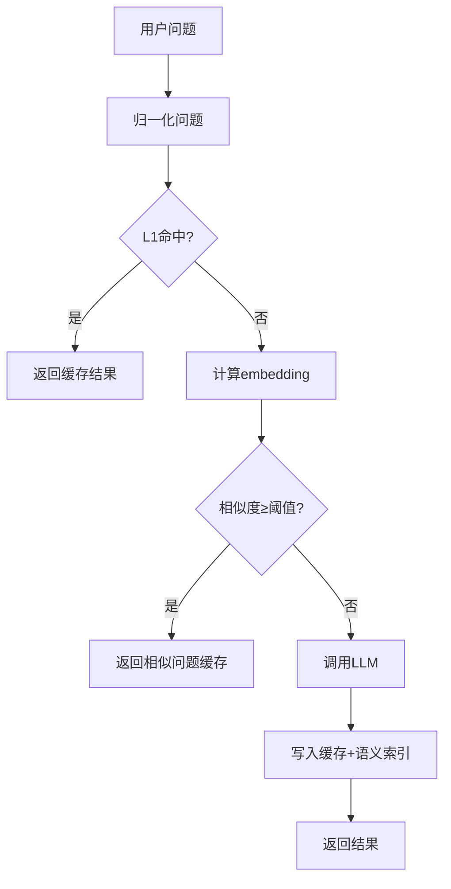
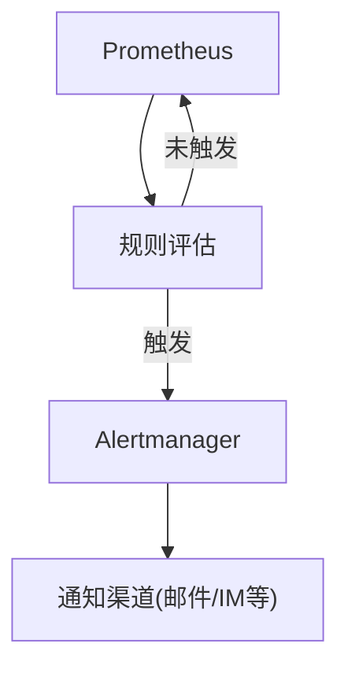
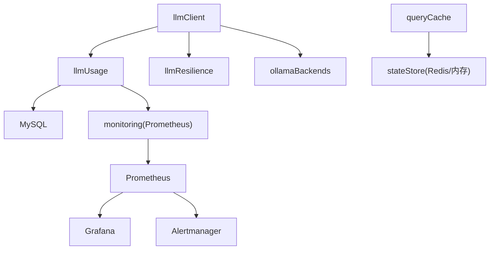

# 性能监控与成本优化

<cite>
**本文引用的文件**
- [server/llm/llmUsage.ts](file://server/llm/llmUsage.ts)
- [server/infra/monitoring.ts](file://server/infra/monitoring.ts)
- [server/llm/llmClient.ts](file://server/llm/llmClient.ts)
- [server/query/queryCache.ts](file://server/query/queryCache.ts)
- [deploy/prometheus-alerts.yml](file://deploy/prometheus-alerts.yml)
- [deploy/prometheus.yml](file://deploy/prometheus.yml)
- [deploy/grafana/dashboards/nl2sql-overview.json](file://deploy/grafana/dashboards/nl2sql-overview.json)
- [deploy/grafana/dashboards/nl2sql-llm.json](file://deploy/grafana/dashboards/nl2sql-llm.json)
- [src/components/admin/LlmUsagePanel.tsx](file://src/components/admin/LlmUsagePanel.tsx)
- [server/infra/userQueryLimit.ts](file://server/infra/userQueryLimit.ts)
</cite>

## 目录
1. [简介](#简介)
2. [项目结构](#项目结构)
3. [核心组件](#核心组件)
4. [架构总览](#架构总览)
5. [详细组件分析](#详细组件分析)
6. [依赖关系分析](#依赖关系分析)
7. [性能考量](#性能考量)
8. [故障排查指南](#故障排查指南)
9. [结论](#结论)
10. [附录](#附录)

## 简介
本文件面向运营与SRE团队，系统化说明智能问数系统的LLM性能监控与成本优化能力。内容覆盖：
- 用量统计机制：Token使用量记录、调用时长追踪、成功率监控
- 成本分析功能：按用户统计、按模型分类、费用估算方法（基于Token计量）
- 性能指标收集：响应时间分布、并发数监控、错误率统计
- 优化策略：模型选择优化、缓存机制、批量处理
- 监控告警配置：关键指标阈值、异常检测、通知机制
- 性能调优指南与成本控制最佳实践

## 项目结构
系统围绕“统一LLM调用通道 + 旁路埋点 + 持久化用量 + 可视化与告警”的架构展开：
- LLM调用层：统一封装Ollama/Gemini/Qwen，内置重试、熔断、并发控制、自适应超时
- 用量埋点：每次调用记录prompt/completion token、耗时、成功状态，并写入数据库；同时推送到Prometheus
- 查询缓存：L1精确匹配+L2语义相似度命中，降低重复LLM调用
- 监控与告警：Prometheus抓取应用指标，Grafana展示，Alertmanager规则触发告警
- 管理面板：前端提供按用户/模型的用量汇总视图

**图表来源**
- [server/llm/llmClient.ts:449-525](file://server/llm/llmClient.ts#L449-L525)
- [server/llm/llmUsage.ts:26-50](file://server/llm/llmUsage.ts#L26-L50)
- [server/infra/monitoring.ts:117-126](file://server/infra/monitoring.ts#L117-L126)
- [server/query/queryCache.ts:43-90](file://server/query/queryCache.ts#L43-L90)
- [deploy/prometheus.yml:16-43](file://deploy/prometheus.yml#L16-L43)

**章节来源**
- [server/llm/llmClient.ts:1-120](file://server/llm/llmClient.ts#L1-L120)
- [server/llm/llmUsage.ts:1-50](file://server/llm/llmUsage.ts#L1-L50)
- [server/infra/monitoring.ts:1-90](file://server/infra/monitoring.ts#L1-L90)
- [server/query/queryCache.ts:1-90](file://server/query/queryCache.ts#L1-L90)
- [deploy/prometheus.yml:1-57](file://deploy/prometheus.yml#L1-L57)

## 核心组件
- 统一LLM调用通道：支持多引擎、阶段级路由、请求级覆盖、并发信号量、熔断、自适应超时
- 用量记录：fire-and-forget落库，失败不阻断主链路；同时输出Prometheus指标
- 查询缓存：L1归一化精确匹配，L2 embedding相似度命中，TTL可配，支持Redis多实例共享
- 监控埋点：端到端耗时、缓存命中、SQL执行耗时、HTTP接口耗时、LLM调用时延与token消耗
- 告警规则：可用性、成功率、P95时延、缓存命中率、降级率、资源水位等
- 管理面板：按用户/模型维度统计Token消耗、调用次数、平均耗时

**章节来源**
- [server/llm/llmClient.ts:121-226](file://server/llm/llmClient.ts#L121-L226)
- [server/llm/llmUsage.ts:52-134](file://server/llm/llmUsage.ts#L52-L134)
- [server/query/queryCache.ts:116-254](file://server/query/queryCache.ts#L116-L254)
- [server/infra/monitoring.ts:90-153](file://server/infra/monitoring.ts#L90-L153)
- [deploy/prometheus-alerts.yml:1-144](file://deploy/prometheus-alerts.yml#L1-L144)
- [src/components/admin/LlmUsagePanel.tsx:44-70](file://src/components/admin/LlmUsagePanel.tsx#L44-L70)

## 架构总览
下图展示了从请求进入、LLM调用、用量记录到监控可视化的完整流程。

**图表来源**
- [server/llm/llmClient.ts:449-525](file://server/llm/llmClient.ts#L449-L525)
- [server/llm/llmUsage.ts:26-50](file://server/llm/llmUsage.ts#L26-L50)
- [server/infra/monitoring.ts:117-153](file://server/infra/monitoring.ts#L117-L153)
- [deploy/prometheus.yml:16-43](file://deploy/prometheus.yml#L16-L43)

## 详细组件分析

### 用量统计机制（Token使用量、调用时长、成功率）
- Token使用量记录：
  - 各通道在返回结果时提取prompt/completion token，统一通过recordUsage上报
  - 记录包含engine、model、channel、durationMs、ok、userId/username
  - 落库字段包括prompt_tokens、completion_tokens、total_tokens、duration_ms、ok
- 调用时长追踪：
  - 以毫秒为单位记录端到端耗时，Prometheus直方图分桶覆盖ms至分钟级
- 成功率监控：
  - ok字段标记成功/失败，Prometheus计数器与Grafana面板展示成功率
  - 告警规则对成功率低于阈值进行持续期告警

**图表来源**
- [server/llm/llmClient.ts:476-525](file://server/llm/llmClient.ts#L476-L525)
- [server/llm/llmUsage.ts:26-50](file://server/llm/llmUsage.ts#L26-L50)

**章节来源**
- [server/llm/llmClient.ts:339-525](file://server/llm/llmClient.ts#L339-L525)
- [server/llm/llmUsage.ts:1-50](file://server/llm/llmUsage.ts#L1-L50)
- [server/infra/monitoring.ts:46-61](file://server/infra/monitoring.ts#L46-L61)

### 成本分析功能（按用户统计、按模型分类、费用估算方法）
- 按用户统计：
  - summarizeLlmUsageByUser聚合近N天用户维度的calls、tokens、avgDurationMs、lastUsedAt
  - 无用户上下文的历史记录归类为“系统/后台”，便于区分前台与后台消耗
- 按模型分类：
  - summarizeLlmUsage按engine/model聚合calls、tokens、avgDurationMs，支撑多引擎成本对比
- 费用估算方法：
  - 系统未内置单价映射；建议结合外部定价表，将total_tokens乘以对应模型单价得到费用
  - 可通过导出llm_usage数据或对接财务系统进行成本核算

**图表来源**
- [server/llm/llmUsage.ts:12-23](file://server/llm/llmUsage.ts#L12-L23)
- [server/llm/llmUsage.ts:52-134](file://server/llm/llmUsage.ts#L52-L134)

**章节来源**
- [server/llm/llmUsage.ts:63-134](file://server/llm/llmUsage.ts#L63-L134)
- [src/components/admin/LlmUsagePanel.tsx:12-35](file://src/components/admin/LlmUsagePanel.tsx#L12-L35)

### 性能指标收集（响应时间分布、并发数监控、错误率统计）
- 响应时间分布：
  - nl2sql_duration_seconds直方图覆盖0.01s~600s，用于端到端P95/P99观测
  - llm_call_duration_seconds按channel/engine/model/ok分桶，定位慢调用
- 并发数监控：
  - 每引擎Semaphore限制最大并发（默认4），避免打爆本地推理进程
  - 可通过环境变量调整并发上限
- 错误率统计：
  - llm_call_duration_seconds{ok="0"}计数失败调用，Grafana面板展示失败趋势
  - 告警规则对FALLBACK率、成功率低进行持续期告警

**图表来源**
- [server/infra/monitoring.ts:21-88](file://server/infra/monitoring.ts#L21-L88)
- [deploy/grafana/dashboards/nl2sql-overview.json:1-192](file://deploy/grafana/dashboards/nl2sql-overview.json#L1-L192)
- [deploy/grafana/dashboards/nl2sql-llm.json:1-135](file://deploy/grafana/dashboards/nl2sql-llm.json#L1-L135)

**章节来源**
- [server/infra/monitoring.ts:21-88](file://server/infra/monitoring.ts#L21-L88)
- [deploy/prometheus-alerts.yml:35-83](file://deploy/prometheus-alerts.yml#L35-L83)

### 优化策略（模型选择优化、缓存机制、批量处理）
- 模型选择优化：
  - 阶段级路由：结构化任务（如SQL生成）可使用快速小模型，提升吞吐与稳定性
  - 请求级覆盖：用户可自选模型，服务端校验合法性后生效
  - 自适应超时：根据近期成功P95动态收紧超时，避免慢模型拖死快模型
- 缓存机制：
  - L1精确匹配：归一化问题键，内存Map或Redis存储，TTL默认30分钟
  - L2语义命中：embedding相似度≥0.95命中，减少同义改写带来的重复调用
  - 失效联动：数据源变更时清理对应前缀缓存与语义索引
- 批量处理：
  - Embedding批量接口可用（见re-export），适合离线构建索引或批量问答场景
  - 注意单条payload体积上限，避免大结果集缓存导致内存压力

**图表来源**
- [server/query/queryCache.ts:22-34](file://server/query/queryCache.ts#L22-L34)
- [server/query/queryCache.ts:43-90](file://server/query/queryCache.ts#L43-L90)
- [server/query/queryCache.ts:116-254](file://server/query/queryCache.ts#L116-L254)

**章节来源**
- [server/llm/llmClient.ts:163-194](file://server/llm/llmClient.ts#L163-L194)
- [server/llm/llmClient.ts:282-337](file://server/llm/llmClient.ts#L282-L337)
- [server/query/queryCache.ts:12-21](file://server/query/queryCache.ts#L12-L21)
- [server/query/queryCache.ts:92-114](file://server/query/queryCache.ts#L92-L114)

### 监控告警配置（关键指标阈值、异常检测、通知机制）
- 关键指标阈值：
  - 成功率：SUCCESS/CACHE占比低于85%持续5分钟告警
  - P95时延：超过180秒持续10分钟告警
  - 缓存命中率：低于15%且有流量持续1小时告警
  - FALLBACK率：超过15%持续30分钟告警
- 异常检测：
  - 应用/MySQL/Redis不可达告警
  - Prometheus序列基数过高、规则求值失败、抓取耗时过长
- 通知机制：
  - Alertmanager静态配置目标，Prometheus定期评估规则并推送告警

**图表来源**
- [deploy/prometheus-alerts.yml:1-144](file://deploy/prometheus-alerts.yml#L1-L144)
- [deploy/prometheus.yml:7-15](file://deploy/prometheus.yml#L7-L15)

**章节来源**
- [deploy/prometheus-alerts.yml:6-105](file://deploy/prometheus-alerts.yml#L6-L105)
- [deploy/prometheus.yml:1-57](file://deploy/prometheus.yml#L1-L57)

## 依赖关系分析
- 模块耦合：
  - llmClient依赖llmUsage、llmResilience、ollamaBackends
  - monitoring集中定义所有Prometheus指标，被多处旁路埋点调用
  - queryCache依赖stateStore（内存/Redis）与embedding能力
- 外部依赖：
  - MySQL：存储llm_usage、metric_definitions等
  - Redis：可选缓存与分布式锁
  - Ollama/Gemini/Qwen：LLM后端
  - Prometheus/Grafana/Alertmanager：监控与可视化

**图表来源**
- [server/llm/llmClient.ts:8-26](file://server/llm/llmClient.ts#L8-L26)
- [server/llm/llmUsage.ts:5-8](file://server/llm/llmUsage.ts#L5-L8)
- [server/query/queryCache.ts:8-10](file://server/query/queryCache.ts#L8-L10)
- [server/infra/monitoring.ts:11-15](file://server/infra/monitoring.ts#L11-L15)

**章节来源**
- [server/llm/llmClient.ts:1-120](file://server/llm/llmClient.ts#L1-L120)
- [server/llm/llmUsage.ts:1-50](file://server/llm/llmUsage.ts#L1-L50)
- [server/query/queryCache.ts:1-90](file://server/query/queryCache.ts#L1-L90)
- [server/infra/monitoring.ts:1-90](file://server/infra/monitoring.ts#L1-L90)

## 性能考量
- 并发控制：每引擎默认并发4，避免本地推理过载；可根据硬件调整
- 超时策略：自适应超时基于近期成功P95×3，平衡快慢模型体验
- 缓存收益：L1/L2命中可显著降低LLM调用频率，建议合理设置TTL与阈值
- 指标基数：严格避免高基数label（question/userId等），防止Prometheus内存膨胀
- 资源水位：监控进程内存、磁盘空间，及时扩容或清理历史数据

[本节为通用指导，无需特定文件引用]

## 故障排查指南
- 常见问题定位：
  - LLM调用失败：查看llm_call_duration_seconds{ok="0"}趋势，检查引擎密钥与网络
  - 缓存命中率低：检查数据源变更后是否调用invalidateQueryCache，确认TTL配置
  - 成功率下降：结合nl2sql_requests_total状态分布，定位ERROR/FALLBACK占比
- 告警处理：
  - 应用不可达：检查进程健康与端口监听
  - MySQL/Redis不可达：验证exporter与数据库连接
  - 抓取耗时过长：可能进程卡顿，优先排查LLM调用阻塞
- 日志与审计：
  - 审计落账包含endpoint、status、durationMs，辅助回溯问题链路

**章节来源**
- [deploy/prometheus-alerts.yml:6-105](file://deploy/prometheus-alerts.yml#L6-L105)
- [server/infra/monitoring.ts:92-107](file://server/infra/monitoring.ts#L92-L107)
- [server/query/queryCache.ts:92-114](file://server/query/queryCache.ts#L92-L114)

## 结论
本系统通过统一的LLM调用通道、旁路埋点、持久化用量与完善的监控告警体系，实现了对LLM性能与成本的精细化管控。运营团队可基于Token计量进行成本估算，结合缓存与模型路由优化提升效率，并通过Grafana与Alertmanager实现实时观测与主动告警。建议持续跟踪P95时延、缓存命中率与成功率，结合业务峰值调整并发与超时策略，确保服务稳定与成本可控。

[本节为总结性内容，无需特定文件引用]

## 附录
- 环境变量参考：
  - LLM_RETRY_MAX、LLM_MAX_CONCURRENT、LLM_BREAKER_FAILS、LLM_BREAKER_COOLDOWN_MS
  - LLM_ADAPTIVE_TIMEOUT、LLM_MODEL、QWEN_MODEL、GEMINI_API_KEY、QWEN_API_KEY
  - QUERY_CACHE_TTL_MINUTES、SEMANTIC_CACHE_THRESHOLD、USER_QUERY_RATE_MAX
- 相关面板与规则：
  - Grafana：nl2sql-overview、nl2sql-llm
  - Prometheus规则：prometheus-alerts.yml

[本节为补充信息，无需特定文件引用]