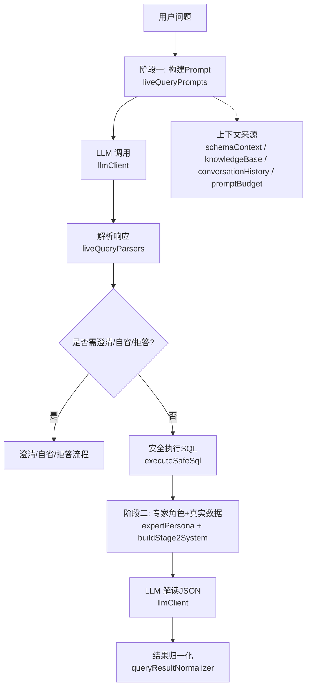
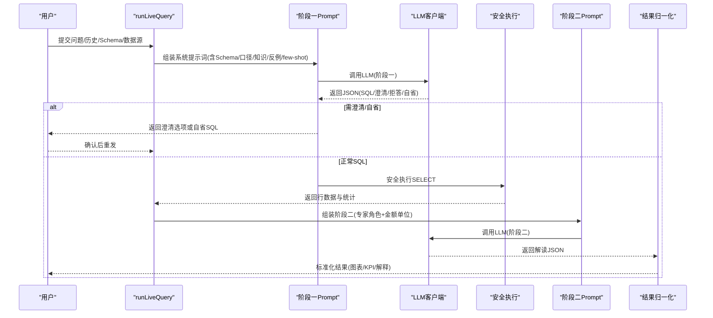
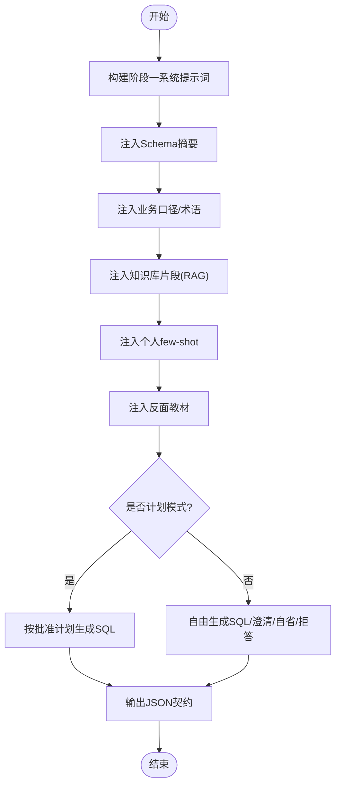
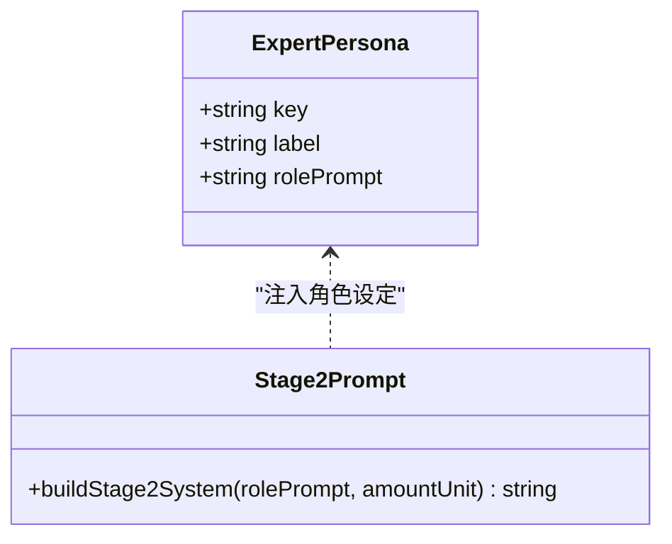
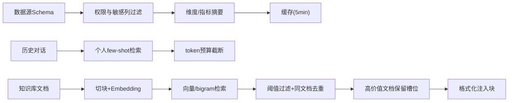
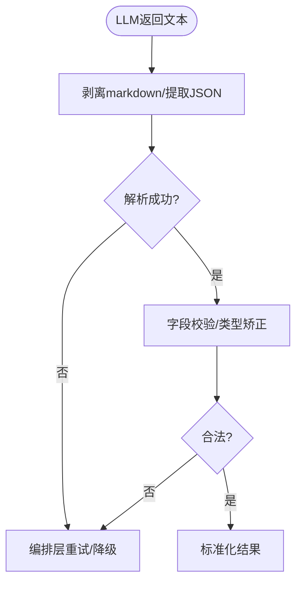
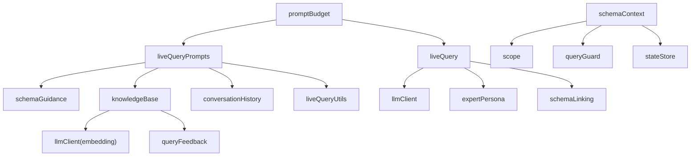

# 提示工程与优化

<cite>
**本文引用的文件**
- [liveQueryPrompts.ts](file://server/query/liveQueryPrompts.ts)
- [schemaContext.ts](file://server/query/schemaContext.ts)
- [knowledgeBase.ts](file://server/knowledge/knowledgeBase.ts)
- [conversationHistory.ts](file://server/query/conversationHistory.ts)
- [schemaGuidance.ts](file://server/query/schemaGuidance.ts)
- [promptBudget.ts](file://server/llm/promptBudget.ts)
- [llmClient.ts](file://server/llm/llmClient.ts)
- [expertPersona.ts](file://server/llm/expertPersona.ts)
- [liveQueryParsers.ts](file://server/query/liveQueryParsers.ts)
- [queryResultNormalizer.ts](file://src/utils/queryResultNormalizer.ts)
- [liveQuery.ts](file://server/query/liveQuery.ts)
</cite>

## 目录
1. [简介](#简介)
2. [项目结构](#项目结构)
3. [核心组件](#核心组件)
4. [架构总览](#架构总览)
5. [详细组件分析](#详细组件分析)
6. [依赖关系分析](#依赖关系分析)
7. [性能考虑](#性能考虑)
8. [故障排查指南](#故障排查指南)
9. [结论](#结论)
10. [附录](#附录)

## 简介
本文件面向“智能问数据分析系统”的提示工程与优化，围绕以下目标展开：
- Prompt 设计原则：结构化输出、上下文管理策略、业务术语映射。
- 场景化 Prompt 模板：SQL 生成、数据分析解读、知识检索增强（RAG）。
- 上下文构建机制：Schema 注入、历史对话管理、知识库内容整合。
- 输出格式控制：JSON 结构化、数据验证规则、错误处理策略。
- Prompt 优化技巧：温度参数调优、最大 token 限制、重试与熔断机制配置。
- 实际案例与最佳实践：结合代码实现给出可落地的操作建议。

## 项目结构
与提示工程直接相关的模块集中在 server 层：
- 阶段一（NL→SQL）：在 liveQueryPrompts 中拼装系统提示词，注入 Schema、方言约束、业务口径、知识库片段、反例与个人 few-shot 等上下文；通过 liveQuery 编排调用 LLM。
- 阶段二（数据分析解读）：使用 expertPersona 路由专家角色，结合真实查询结果生成 JSON 解读与 KPI。
- 上下文与资源预算：schemaContext 加载并摘要 Schema；knowledgeBase 提供 RAG 检索与片段格式化；conversationHistory 提供个人 few-shot；promptBudget 统一截断与预算控制。
- 输出解析与归一化：liveQueryParsers 解析阶段一 JSON（SQL/澄清/拒答/自省），queryResultNormalizer 对最终结果做类型矫正与校验。

图表来源
- [liveQueryPrompts.ts:35-80](file://server/query/liveQueryPrompts.ts#L35-L80)
- [llmClient.ts:141-161](file://server/llm/llmClient.ts#L141-L161)
- [liveQueryParsers.ts:32-119](file://server/query/liveQueryParsers.ts#L32-L119)
- [schemaContext.ts:108-171](file://server/query/schemaContext.ts#L108-L171)
- [knowledgeBase.ts:159-166](file://server/knowledge/knowledgeBase.ts#L159-L166)
- [conversationHistory.ts:158-203](file://server/query/conversationHistory.ts#L158-L203)
- [promptBudget.ts:1-43](file://server/llm/promptBudget.ts#L1-L43)

章节来源
- [liveQueryPrompts.ts:1-117](file://server/query/liveQueryPrompts.ts#L1-L117)
- [schemaContext.ts:1-172](file://server/query/schemaContext.ts#L1-L172)
- [knowledgeBase.ts:1-239](file://server/knowledge/knowledgeBase.ts#L1-L239)
- [conversationHistory.ts:1-204](file://server/query/conversationHistory.ts#L1-L204)
- [schemaGuidance.ts:1-122](file://server/query/schemaGuidance.ts#L1-L122)
- [promptBudget.ts:1-43](file://server/llm/promptBudget.ts#L1-L43)
- [llmClient.ts:1-200](file://server/llm/llmClient.ts#L1-L200)
- [expertPersona.ts:1-329](file://server/llm/expertPersona.ts#L1-L329)
- [liveQueryParsers.ts:1-120](file://server/query/liveQueryParsers.ts#L1-L120)
- [queryResultNormalizer.ts:1-171](file://src/utils/queryResultNormalizer.ts#L1-L171)
- [liveQuery.ts:1-200](file://server/query/liveQuery.ts#L1-L200)

## 核心组件
- 阶段一 Prompt 构建器：负责将 Schema、方言规则、业务口径、知识库片段、反例、个人 few-shot、计划模式与金额单位等上下文组装为强约束的系统提示词，强制纯 JSON 输出，并支持歧义澄清、自省探查与拒答分支。
- 专家角色路由：按问题关键词匹配领域专家（风险/客户/财务/不良资产/默认金融分析师），并在阶段二注入角色设定与金额单位约束，确保解读专业且一致。
- 上下文加载与摘要：从数据源加载 Schema，应用权限过滤与敏感列剔除，生成维度/指标摘要，缓存并跨实例失效。
- 知识库 RAG：按段落切块、向量或 bigram 检索、阈值过滤、同文档去重与高价值文档保留槽位，将权威口径与术语注入阶段一。
- 个人对话沉淀：记录成功问答对，基于问题相似度与表重合度打分，选取 top 2 作为 few-shot，受 token 预算限制。
- 输出解析与归一化：严格校验阶段一 JSON（SQL/澄清/拒答/自省），并对最终结果进行字段兼容、类型矫正与白名单校验。
- 资源预算控制：统一近似 token 估算与文本/历史消息截断，避免上下文膨胀稀释注意力。

章节来源
- [liveQueryPrompts.ts:35-117](file://server/query/liveQueryPrompts.ts#L35-L117)
- [expertPersona.ts:128-212](file://server/llm/expertPersona.ts#L128-L212)
- [schemaContext.ts:108-171](file://server/query/schemaContext.ts#L108-L171)
- [knowledgeBase.ts:106-166](file://server/knowledge/knowledgeBase.ts#L106-L166)
- [conversationHistory.ts:158-203](file://server/query/conversationHistory.ts#L158-L203)
- [liveQueryParsers.ts:32-119](file://server/query/liveQueryParsers.ts#L32-L119)
- [queryResultNormalizer.ts:22-147](file://src/utils/queryResultNormalizer.ts#L22-L147)
- [promptBudget.ts:1-43](file://server/llm/promptBudget.ts#L1-L43)

## 架构总览
下图展示从用户问题到最终结果的端到端流程，突出提示工程的关键节点：上下文构建、阶段一 SQL 生成、安全执行、阶段二解读、输出归一化。

图表来源
- [liveQuery.ts:189-200](file://server/query/liveQuery.ts#L189-L200)
- [liveQueryPrompts.ts:35-117](file://server/query/liveQueryPrompts.ts#L35-L117)
- [llmClient.ts:141-161](file://server/llm/llmClient.ts#L141-L161)
- [liveQueryParsers.ts:32-119](file://server/query/liveQueryParsers.ts#L32-L119)
- [queryResultNormalizer.ts:78-147](file://src/utils/queryResultNormalizer.ts#L78-L147)

## 详细组件分析

### 阶段一：NL→SQL 的提示词设计与上下文注入
- 结构化输出要求：强制纯 JSON，四选一（正常查询/歧义澄清/数据自省/拒答），字段名与取值范围明确，便于解析器稳定解析。
- 上下文管理策略：
  - Schema 注入：序列化紧凑 Schema，仅包含 name/displayName/description/columns，减少体积。
  - 业务术语映射：提取管理员登记的表级业务口径说明，强制遵循口径与枚举写法。
  - 知识库增强：按问题检索相关片段，以“必须遵循”强指令注入，防止小模型忽略口径。
  - 个人 few-shot：从本人历史成功问答对召回 top 2，受 token 预算限制。
  - 反例注入：提供曾失败的问题与错误表选择，避免重复错误。
  - 计划模式：若已批准分析计划，严格按步骤生成 SQL，跳过澄清。
  - 金额单位：阶段一 SQL 完成换算，阶段二禁止改写单位。
- 方言约束：PostgreSQL/Greenplum 与 MySQL 差异点明确，避免生成不兼容语法。
- 复杂分析范式：提供窗口函数、CTE、UNION ALL、同比环比等范式指引，但强调简单问题用简单 SQL。

图表来源
- [liveQueryPrompts.ts:35-80](file://server/query/liveQueryPrompts.ts#L35-L80)
- [schemaGuidance.ts:25-36](file://server/query/schemaGuidance.ts#L25-L36)
- [knowledgeBase.ts:159-166](file://server/knowledge/knowledgeBase.ts#L159-L166)
- [conversationHistory.ts:158-203](file://server/query/conversationHistory.ts#L158-L203)

章节来源
- [liveQueryPrompts.ts:14-80](file://server/query/liveQueryPrompts.ts#L14-L80)
- [schemaGuidance.ts:25-100](file://server/query/schemaGuidance.ts#L25-L100)
- [knowledgeBase.ts:106-166](file://server/knowledge/knowledgeBase.ts#L106-L166)
- [conversationHistory.ts:158-203](file://server/query/conversationHistory.ts#L158-L203)

### 阶段二：数据分析解读的专家角色与输出控制
- 专家角色路由：按问题关键词命中领域专家（风险/客户/财务/不良资产/默认），保证解读的专业性与术语一致性。
- 金额单位约束：阶段二引用金额必须沿用阶段一换算后的单位，禁止自行换算或进位改写。
- 结构化输出：强制 JSON 对象，包含 aiExplanation/keyInsights/kpiMetrics/suggestedQuestions，数值必须来自真实数据与列统计。
- 降级兜底：当 LLM 异常时，规则化降级解读，保证可用性。

图表来源
- [expertPersona.ts:23-123](file://server/llm/expertPersona.ts#L23-L123)
- [liveQueryPrompts.ts:99-116](file://server/query/liveQueryPrompts.ts#L99-L116)

章节来源
- [expertPersona.ts:128-212](file://server/llm/expertPersona.ts#L128-L212)
- [liveQueryPrompts.ts:99-116](file://server/query/liveQueryPrompts.ts#L99-L116)

### 上下文构建机制：Schema、历史对话与知识库整合
- Schema 上下文加载：
  - 从数据源读取 schema_json/scope_json/status/type，应用行级权限与敏感列过滤。
  - 生成维度/指标摘要，缓存 5 分钟，写操作后跨实例失效。
  - 支持演示模式（前端提交 schema）与真实执行模式（mysql/postgresql/greenplum/fileBacked）。
- 历史对话管理：
  - 每次问数记录问题/SQL/摘要/状态/耗时，支持搜索/重问/删除/导出。
  - 个人 few-shot 检索近 100 条成功记录，按问题相似度与表重合度打分，取 top 2，受 token 预算限制。
- 知识库整合：
  - 切块策略：按段落合并，超长块按步长切分，相邻块重叠防语义截断。
  - 检索策略：优先余弦相似度，低于阈值过滤无关片段；bigram 降级模式维持 score>0。
  - 高价值文档保留槽位：标题命中“口径/指南/速查/规则/枚举/对比/模式”的文档至少保留一个注入槽位。
  - 输出格式化：将片段拼接为“必须遵循”的强指令块，约束口径/术语/枚举，不放开表列白名单。

图表来源
- [schemaContext.ts:108-171](file://server/query/schemaContext.ts#L108-L171)
- [conversationHistory.ts:158-203](file://server/query/conversationHistory.ts#L158-L203)
- [knowledgeBase.ts:43-75](file://server/knowledge/knowledgeBase.ts#L43-L75)
- [knowledgeBase.ts:106-166](file://server/knowledge/knowledgeBase.ts#L106-L166)

章节来源
- [schemaContext.ts:1-172](file://server/query/schemaContext.ts#L1-L172)
- [conversationHistory.ts:1-204](file://server/query/conversationHistory.ts#L1-L204)
- [knowledgeBase.ts:1-239](file://server/knowledge/knowledgeBase.ts#L1-L239)

### 输出格式控制：JSON 结构化、数据验证与错误处理
- 阶段一 JSON 契约：
  - 正常查询：sql/title/chartType/xAxisKey/yAxisKeys/yAxisNames/columnNames/thoughtProcess。
  - 歧义澄清：needClarification/clarification(question/options)。
  - 数据自省：needIntrospection/intermediateSql/note。
  - 拒答：refuse/reason（统一话术，补充数据源覆盖表清单）。
- 解析与容错：
  - 剥离 markdown 代码块标记，尝试提取首个 JSON 对象。
  - 字段类型矫正与白名单校验（如 chartType 必须在允许集合内）。
  - 非法/不完整返回 null，由编排层走重试/澄清链路。
- 最终结果归一化：
  - 兼容 data/rows 两种字段名，校验图表配置、KPI 字段、建议问题数量。
  - 缺失关键字段返回 null，调用方走 fallback。

图表来源
- [liveQueryParsers.ts:32-119](file://server/query/liveQueryParsers.ts#L32-L119)
- [queryResultNormalizer.ts:12-41](file://src/utils/queryResultNormalizer.ts#L12-L41)
- [queryResultNormalizer.ts:78-147](file://src/utils/queryResultNormalizer.ts#L78-L147)

章节来源
- [liveQueryParsers.ts:1-120](file://server/query/liveQueryParsers.ts#L1-L120)
- [queryResultNormalizer.ts:1-171](file://src/utils/queryResultNormalizer.ts#L1-L171)

### Prompt 优化技巧：温度、最大 token、重试与熔断
- 温度参数调优：
  - 结构化任务（SQL 生成/解读）建议使用快速小模型，降低温度以提升稳定性与速度。
  - 可通过环境变量指定阶段级模型路由（SQL 生成与分析解读分别配置）。
- 最大 token 限制：
  - 知识库片段注入预算：KNOWLEDGE_TOKEN_BUDGET=2700。
  - 外部知识库片段预算：EXTERNAL_KB_TOKEN_BUDGET=1200。
  - few-shot 样例预算：FEWSHOT_TOKEN_BUDGET=3600。
  - 历史对话预算：HISTORY_TOKEN_BUDGET=1500。
  - 文本截断：按字符边界保守估算 token（中文约 1 字 1 token，length/1.5）。
- 重试与熔断：
  - 重试次数：LLM_RETRY_MAX（默认 2，上限 3），仅超时/5xx/网络错误重试。
  - 并发限制：LLM_MAX_CONCURRENT（默认 4），本地算力有限，超出排队。
  - 熔断：连续失败达到阈值开路，冷却期后半开探测；主引擎开路自动切换备用引擎。
  - 自适应超时：基于近期成功 P95×3 动态收紧配置上限，可关闭。

章节来源
- [promptBudget.ts:1-43](file://server/llm/promptBudget.ts#L1-L43)
- [llmClient.ts:61-83](file://server/llm/llmClient.ts#L61-L83)
- [llmClient.ts:141-161](file://server/llm/llmClient.ts#L141-L161)
- [llmClient.ts:180-194](file://server/llm/llmClient.ts#L180-L194)

### 实际案例与最佳实践
- SQL 生成场景：
  - 使用方言约束与业务口径，避免生成不兼容语法或错误口径。
  - 启用计划模式时，严格按步骤生成 SQL，跳过澄清，提升确定性。
  - 多候选差异化引导：通过 candidatePrompt 增加多样性，辅助择优。
- 数据分析场景：
  - 专家角色路由确保术语一致，金额单位约束避免表述冲突。
  - 真实数据样本与列统计回喂，确保洞察与 KPI 有据可依。
- 知识检索场景：
  - 合理设置 TOP_K_CHUNKS 与阈值，避免无关知识稀释注意力。
  - 高价值文档保留槽位，确保口径/指南类知识优先注入。
- 最佳实践：
  - 始终使用结构化 JSON 输出，配合解析器校验，避免裸字符串。
  - 严格控制上下文大小，使用预算截断，保持提示词精简有效。
  - 利用反例与个人 few-shot，持续优化 SQL 生成质量。
  - 监控 LLM 调用韧性（重试/熔断/并发），保障服务稳定性。

章节来源
- [liveQueryPrompts.ts:83-92](file://server/query/liveQueryPrompts.ts#L83-L92)
- [knowledgeBase.ts:106-166](file://server/knowledge/knowledgeBase.ts#L106-L166)
- [expertPersona.ts:128-212](file://server/llm/expertPersona.ts#L128-L212)
- [promptBudget.ts:1-43](file://server/llm/promptBudget.ts#L1-L43)

## 依赖关系分析
提示工程各模块之间的依赖关系如下：
- liveQueryPrompts 依赖 schemaGuidance（Schema 序列化）、knowledgeBase（RAG 片段）、conversationHistory（few-shot）、liveQueryUtils（图表/列名/统计）。
- liveQuery 编排调用 llmClient（LLM 通道）、expertPersona（角色路由）、schemaLinking（表/列关联）、metrics/ironRules（指标/铁律）。
- schemaContext 依赖 scope（权限过滤）、queryGuard（敏感列过滤）、stateStore（缓存）。
- knowledgeBase 依赖 llmClient（embedding）、queryFeedback（bigram 重叠）。
- promptBudget 被多个模块引用，统一控制上下文大小。

图表来源
- [liveQueryPrompts.ts:1-117](file://server/query/liveQueryPrompts.ts#L1-L117)
- [liveQuery.ts:16-73](file://server/query/liveQuery.ts#L16-L73)
- [schemaContext.ts:8-16](file://server/query/schemaContext.ts#L8-L16)
- [knowledgeBase.ts:8-12](file://server/knowledge/knowledgeBase.ts#L8-L12)
- [promptBudget.ts:1-43](file://server/llm/promptBudget.ts#L1-L43)

章节来源
- [liveQueryPrompts.ts:1-117](file://server/query/liveQueryPrompts.ts#L1-L117)
- [liveQuery.ts:16-73](file://server/query/liveQuery.ts#L16-L73)
- [schemaContext.ts:1-172](file://server/query/schemaContext.ts#L1-L172)
- [knowledgeBase.ts:1-239](file://server/knowledge/knowledgeBase.ts#L1-L239)
- [promptBudget.ts:1-43](file://server/llm/promptBudget.ts#L1-L43)

## 性能考虑
- 上下文大小控制：通过 promptBudget 统一截断，避免知识库/few-shot/历史对话无限注入导致推理变慢与注意力稀释。
- 缓存策略：Schema 上下文缓存 5 分钟，写操作后跨实例失效；专家角色缓存 60 秒，写操作即时失效。
- LLM 调用韧性：重试、熔断、并发限制与自适应超时，保障在高负载下的稳定性。
- 知识库检索优化：向量相似度阈值过滤无关片段，bigram 降级模式保证功能可用；同文档去重与高价值文档保留槽位，提升命中率。
- 解析与归一化：严格校验与类型矫正，减少下游异常处理成本。

[本节为通用性能指导，无需特定文件来源]

## 故障排查指南
- 阶段一解析失败：检查 LLM 返回是否为合法 JSON，确认字段是否符合契约；若非法，编排层会触发重试或降级。
- 拒答理由不规范：使用 enrichRefusalReason 统一话术，补充数据源覆盖表清单，避免模糊拒绝。
- 知识库注入无效：检查 embedding 是否可用，阈值是否过高；确认文档标题是否命中高价值关键词。
- 个人 few-shot 未生效：确认历史记录状态为 SUCCESS 且 provenance 为 live；检查 token 预算是否不足。
- LLM 调用失败：查看重试次数、熔断状态与并发限制；必要时切换备用引擎或调整超时配置。

章节来源
- [liveQueryParsers.ts:73-119](file://server/query/liveQueryParsers.ts#L73-L119)
- [knowledgeBase.ts:106-166](file://server/knowledge/knowledgeBase.ts#L106-L166)
- [conversationHistory.ts:158-203](file://server/query/conversationHistory.ts#L158-L203)
- [llmClient.ts:61-83](file://server/llm/llmClient.ts#L61-L83)

## 结论
本系统的提示工程以“结构化输出、强约束上下文、韧性调用”为核心，通过阶段一 SQL 生成与阶段二数据分析解读的双阶段流水线，结合 Schema、知识库、个人 few-shot 与专家角色，实现了高质量、可解释、可维护的智能问数能力。通过严格的 JSON 契约、解析校验与归一化，以及统一的 token 预算与 LLM 韧性机制，系统在准确性、稳定性与性能之间取得良好平衡。

[本节为总结性内容，无需特定文件来源]

## 附录
- 环境变量参考：
  - LLM_RETRY_MAX：最大重试次数（默认 2，上限 3）。
  - LLM_MAX_CONCURRENT：每引擎并发上限（默认 4）。
  - LLM_BREAKER_FAILS：熔断失败阈值（默认 3）。
  - LLM_BREAKER_COOLDOWN_MS：熔断冷却期（默认 30000ms）。
  - LLM_ADAPTIVE_TIMEOUT：自适应超时开关（默认开启）。
  - KNOWLEDGE_MIN_SCORE：知识库相关性阈值（默认 0.35）。
  - CONVERSATION_RETENTION：对话历史保留条数（默认 500）。
- 最佳实践清单：
  - 始终使用结构化 JSON 输出，配合解析器校验。
  - 严格控制上下文大小，使用预算截断。
  - 利用反例与个人 few-shot，持续优化 SQL 生成质量。
  - 监控 LLM 调用韧性，保障服务稳定性。
  - 定期更新知识库与业务口径，确保注入内容权威有效。

[本节为附录信息，无需特定文件来源]