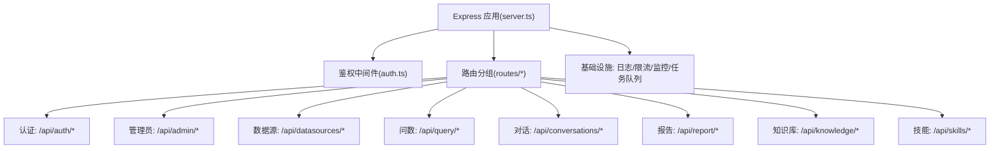
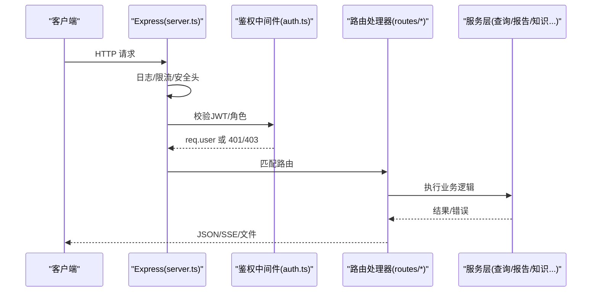
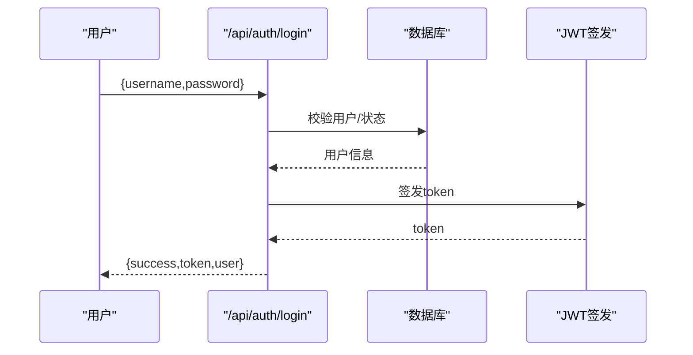
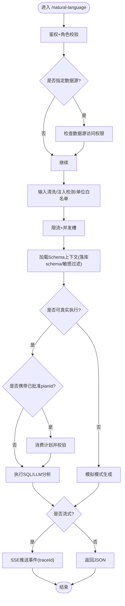
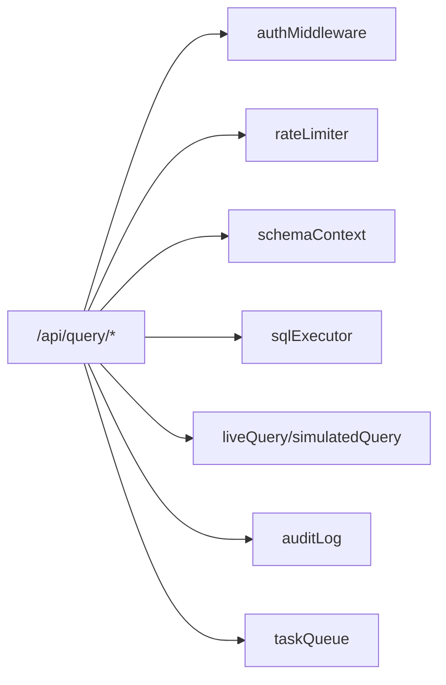

# API参考

<cite>
**本文引用的文件**
- [server.ts](file://server.ts)
- [openapi.json](file://docs/openapi.json)
- [auth.ts](file://server/auth/auth.ts)
- [client.ts](file://src/api/client.ts)
- [routes/auth.ts](file://server/routes/auth.ts)
- [routes/query.ts](file://server/routes/query.ts)
- [routes/report.ts](file://server/routes/report.ts)
- [routes/conversation.ts](file://server/routes/conversation.ts)
- [routes/admin.ts](file://server/routes/admin.ts)
- [routes/datasources.ts](file://server/routes/datasources.ts)
- [routes/knowledge.ts](file://server/routes/knowledge.ts)
- [routes/skills.ts](file://server/routes/skills.ts)
- [errorCodes.ts](file://server/infra/errorCodes.ts)
</cite>

## 目录
1. [简介](#简介)
2. [项目结构](#项目结构)
3. [核心组件](#核心组件)
4. [架构总览](#架构总览)
5. [详细组件分析](#详细组件分析)
6. [依赖关系分析](#依赖关系分析)
7. [性能与可用性](#性能与可用性)
8. [故障排查指南](#故障排查指南)
9. [结论](#结论)
10. [附录：API清单与示例](#附录api清单与示例)

## 简介
本参考文档面向“智能问数据分析系统”的后端 RESTful API，覆盖认证授权、数据源管理、自然语言问数、对话历史、报告生成与导出、知识库、技能库、运维指标等能力。文档基于 OpenAPI 规范与服务端路由实现，提供接口路径、HTTP方法、请求参数、响应格式、错误码、鉴权要求与调用时序说明，并给出前端 SDK 集成要点与测试建议。

## 项目结构
后端采用 Express 应用，按功能拆分路由模块；全局中间件负责安全头、日志、限流、鉴权与统一错误处理。OpenAPI 定义位于 docs/openapi.json，作为前后端契约与版本依据。

图表来源
- [server.ts:82-265](file://server.ts#L82-L265)
- [routes/auth.ts:39-156](file://server/routes/auth.ts#L39-L156)
- [routes/query.ts:44-47](file://server/routes/query.ts#L44-L47)

章节来源
- [server.ts:82-265](file://server.ts#L82-L265)
- [openapi.json:1-84](file://docs/openapi.json#L1-L84)

## 核心组件
- 认证与授权
  - JWT 签发与校验、角色守卫（ADMIN/ANALYST/VIEWER）、强制改密流程、OIDC 登录重定向与回调。
- 路由层
  - 按业务域拆分的 Express Router，统一挂载到 /api 前缀下。
- 基础设施
  - 请求日志、Prometheus 指标、限流器、审计日志、任务队列、SSE 断线续传缓冲。
- 前端 SDK
  - 统一 fetch 封装，自动注入 Authorization，处理 401/403 强制改密分支。

章节来源
- [auth.ts:1-127](file://server/auth/auth.ts#L1-L127)
- [routes/auth.ts:1-156](file://server/routes/auth.ts#L1-L156)
- [client.ts:1-74](file://src/api/client.ts#L1-L74)
- [server.ts:133-183](file://server.ts#L133-L183)

## 架构总览
整体请求链路：客户端 → Express → 中间件（日志/限流/安全头）→ 鉴权中间件 → 路由处理器 → 服务层（LLM/SQL/缓存/审计）→ 响应。

图表来源
- [server.ts:133-183](file://server.ts#L133-L183)
- [auth.ts:66-113](file://server/auth/auth.ts#L66-L113)
- [routes/query.ts:47-164](file://server/routes/query.ts#L47-L164)

## 详细组件分析

### 认证与授权（Auth）
- 登录获取 JWT
  - POST /api/auth/login（公开），限流保护，失败锁定策略由限流器控制。
  - 成功返回 token 与用户信息；首次登录或被重置密码时标记 mustChangePassword。
- 当前用户
  - GET /api/auth/me（需登录），返回当前用户详情。
- 修改密码
  - POST /api/auth/change-password（需登录），强度校验，旧密码验证。
- OIDC 企业登录
  - GET /api/auth/oidc/status（公开）
  - GET /api/auth/oidc/login（公开，302 跳转 IdP）
  - GET /api/auth/oidc/callback（公开，完成授权码流程后重定向携带本地 JWT）

图表来源
- [routes/auth.ts:41-77](file://server/routes/auth.ts#L41-L77)
- [auth.ts:60-64](file://server/auth/auth.ts#L60-L64)

章节来源
- [routes/auth.ts:1-156](file://server/routes/auth.ts#L1-L156)
- [auth.ts:1-127](file://server/auth/auth.ts#L1-L127)
- [openapi.json:383-486](file://docs/openapi.json#L383-L486)

### 管理员与RBAC（Admin）
- 用户管理（仅 ADMIN）
  - GET /api/admin/users
  - POST /api/admin/users
  - PUT /api/admin/users/:id
  - DELETE /api/admin/users/:id
  - POST /api/admin/users/:id/reset-password
- 角色与权限
  - 通过 requireRole('ADMIN'|'ANALYST'|'VIEWER') 在路由级进行访问控制。
  - 部分接口在服务层再次校验（如问数/报告）。

章节来源
- [routes/admin.ts:1-200](file://server/routes/admin.ts#L1-L200)
- [auth.ts:115-127](file://server/auth/auth.ts#L115-L127)
- [openapi.json:487-668](file://docs/openapi.json#L487-L668)

### 数据源管理（DataSources）
- 列表与创建（ADMIN 写操作）
  - GET /api/datasources
  - POST /api/datasources
- 导入文件型数据源
  - POST /api/datasources/import-file（ADMIN，支持 csv/xlsx/json，base64 上传）
- 连通性测试
  - POST /api/datasources/test-connection（ADMIN，不落库）
- 元数据映射
  - 自动推导列类型与角色（数值→指标，日期/枚举/布尔→维度，短文本→维度等）

章节来源
- [routes/datasources.ts:1-200](file://server/routes/datasources.ts#L1-L200)
- [openapi.json:669-800](file://docs/openapi.json#L669-L800)

### 自然语言问数（Query）
- 主链路
  - POST /api/query/natural-language（需 ADMIN/ANALYST）
  - 输入：query、history、schema、dataSourceId、model、amountUnit、stream、planId
  - 输出：JSON 或 SSE 事件流（含 traceId）
  - 防护：输入清洗、注入检测、金额单位白名单、频率限制、并发槽互斥、ACL 检查、计划模式校验
- 辅助端点
  - GET /api/query/stream-replay/:traceId（SSE 断线续传）
  - GET /api/query/trace/:traceId（推导过程回放）
  - POST /api/query/plan（先出计划再执行）
  - POST /api/query/feedback（反馈沉淀）
  - POST /api/query/execute-sql（SELECT-only 安全执行）
  - POST /api/query/sql-assist（AI 助手）
  - POST /api/query/drill（图表下钻）

图表来源
- [routes/query.ts:47-200](file://server/routes/query.ts#L47-L200)
- [server.ts:187-221](file://server.ts#L187-L221)

章节来源
- [routes/query.ts:1-200](file://server/routes/query.ts#L1-L200)
- [openapi.json:183-382](file://docs/openapi.json#L183-L382)

### 对话历史（Conversations）
- 检索本人对话
  - GET /api/conversations?dataSourceId=&q=（需 ADMIN/ANALYST）
- 删除单条对话
  - DELETE /api/conversations/:id（需 ADMIN/ANALYST）

章节来源
- [routes/conversation.ts:1-44](file://server/routes/conversation.ts#L1-L44)
- [openapi.json:427-443](file://docs/openapi.json#L427-L443)

### 报告生成与导出（Reports）
- 生成报告
  - POST /api/report/generate（需 ADMIN/ANALYST）
  - 支持模板类型、自定义提示、金额单位、计划模式（reportPlanId）
  - 真实执行或模拟模式，返回 dataProvenance 标识数据来源
- 报告计划
  - POST /api/report/plan（需 ADMIN/ANALYST）
- 导出 PPTX
  - POST /api/report/export（body 含 base64 图表，服务端放宽解析大小）

章节来源
- [routes/report.ts:1-200](file://server/routes/report.ts#L1-L200)
- [openapi.json:153-229](file://docs/openapi.json#L153-L229)

### 知识库（Knowledge）
- 文档 CRUD（读对所有登录开放，写需 ADMIN）
  - GET /api/knowledge?dataSourceId=
  - POST /api/knowledge（登记文档，切块入库）
  - GET /api/knowledge/:docId
  - PUT /api/knowledge/:docId
  - DELETE /api/knowledge/:docId
- 导入/导出
  - GET /api/knowledge/export?dataSourceId=（ADMIN）
  - POST /api/knowledge/import（ADMIN，JSON 备份恢复，支持 dryRun）
- 种子条目
  - GET /api/knowledge/seed-entries

章节来源
- [routes/knowledge.ts:1-200](file://server/routes/knowledge.ts#L1-L200)
- [openapi.json:230-382](file://docs/openapi.json#L230-L382)

### 技能库（Skills）
- 可见技能与管理视图
  - GET /api/skills
  - GET /api/skills/manage
- 个人技能维护
  - POST /api/skills
  - PUT /api/skills/:id
  - DELETE /api/skills/:id
- 分享审批流
  - POST /api/skills/:id/share
  - POST /api/skills/:id/share/cancel
  - POST /api/skills/:id/share/approve（ADMIN）
  - POST /api/skills/:id/share/reject（ADMIN）
- 详情
  - GET /api/skills/:id

章节来源
- [routes/skills.ts:1-145](file://server/routes/skills.ts#L1-L145)

### 系统与运维
- 健康检查
  - GET /api/health（公开）
- 引擎与模型
  - GET /api/system/engine（需登录）
  - GET /api/system/models（需登录）
- LLM 用量统计（仅 ADMIN）
  - GET /api/system/llm-usage?days=
- 在线准确率度量看板（仅 ADMIN）
  - GET /api/ops/metrics?days=
- 知识库漂移检测（仅 ADMIN）
  - GET /api/ops/drift
  - POST /api/ops/drift/scan
  - POST /api/ops/drift/watch
  - DELETE /api/ops/drift/watch
  - POST /api/ops/drift/{id}/ack

章节来源
- [server.ts:187-221](file://server.ts#L187-L221)
- [openapi.json:92-229](file://docs/openapi.json#L92-L229)

## 依赖关系分析
- 路由对中间件的依赖
  - 所有写操作与业务接口普遍使用 rateLimiter + authMiddleware + requireRole 组合。
- 服务层依赖
  - 问数/报告依赖 schemaContext、sqlExecutor、liveQuery/simulatedQuery、queryCache、auditLog、taskQueue。
- 外部依赖
  - LLM 多后端（Ollama/Gemini）、数据库连接池、Redis（可选，用于限流/缓存/任务队列）。

图表来源
- [routes/query.ts:17-42](file://server/routes/query.ts#L17-L42)
- [server.ts:22-64](file://server.ts#L22-L64)

章节来源
- [routes/query.ts:1-200](file://server/routes/query.ts#L1-L200)
- [server.ts:22-64](file://server.ts#L22-L64)

## 性能与可用性
- 限流与并发
  - 登录接口限流；问数/报告共享用户级频率限制与并发槽互斥（同用户串行）。
- 流式与断线续传
  - 问数支持 SSE 流式输出与基于 traceId 的重放缓冲，网络中断后可续传。
- 资源限制
  - JSON body 默认 2MB；报告导出/知识库导入/文件数据源导入放宽至 10MB 或 20MB。
- 可观测性
  - Prometheus 指标（/metrics）记录 /api/* 耗时直方图；请求日志包含 requestId。

章节来源
- [server.ts:133-183](file://server.ts#L133-L183)
- [routes/query.ts:118-153](file://server/routes/query.ts#L118-L153)

## 故障排查指南
- 常见错误码
  - INVALID_INPUT：参数非法或输入被拒绝
  - FORBIDDEN：角色或权限不足
  - DS_ACCESS_DENIED：无数据源访问权限
  - AI_SWITCHED_OFF：数据源停用问数功能
  - RATE_LIMITED：触发限流
  - QUERY_IN_FLIGHT：存在进行中的查询
  - PLAN_INVALID/PLAN_MISMATCH：计划无效或不匹配
  - SQL_REJECTED：SQL 未通过安全校验
  - LLM_UNAVAILABLE：LLM 服务不可用
  - INTERNAL_ERROR：内部错误
- 定位步骤
  - 查看请求日志与 Prometheus 指标，确认路由与耗时
  - 检查鉴权与角色（401/403）
  - 核对限流与并发槽（429）
  - 关注计划模式（409）
  - 检查 LLM 与数据库连接状态

章节来源
- [errorCodes.ts:1-36](file://server/infra/errorCodes.ts#L1-L36)
- [server.ts:267-280](file://server.ts#L267-L280)

## 结论
本系统以模块化路由与强中间件链构建高内聚、低耦合的 API 体系，围绕“自然语言问数”与“报告生成”两大主线，提供完善的鉴权、限流、审计、可观测性与容错机制。通过 OpenAPI 契约与前端 SDK 解耦，便于版本演进与跨端集成。

## 附录：API清单与示例

### 认证与用户
- 登录
  - POST /api/auth/login
  - 请求体：{ username, password }
  - 响应：{ success, token, user }
  - 错误：400/401/429
- 当前用户
  - GET /api/auth/me
  - 响应：{ success, user }
- 修改密码
  - POST /api/auth/change-password
  - 请求体：{ oldPassword, newPassword }
  - 响应：{ success }
- OIDC
  - GET /api/auth/oidc/status
  - GET /api/auth/oidc/login
  - GET /api/auth/oidc/callback

章节来源
- [routes/auth.ts:41-156](file://server/routes/auth.ts#L41-L156)
- [openapi.json:383-486](file://docs/openapi.json#L383-L486)

### 管理员
- 用户管理
  - GET /api/admin/users
  - POST /api/admin/users
  - PUT /api/admin/users/:id
  - DELETE /api/admin/users/:id
  - POST /api/admin/users/:id/reset-password

章节来源
- [routes/admin.ts:26-200](file://server/routes/admin.ts#L26-L200)
- [openapi.json:487-668](file://docs/openapi.json#L487-L668)

### 数据源
- 列表/创建/导入/测试
  - GET /api/datasources
  - POST /api/datasources
  - POST /api/datasources/import-file
  - POST /api/datasources/test-connection

章节来源
- [routes/datasources.ts:1-200](file://server/routes/datasources.ts#L1-L200)
- [openapi.json:669-800](file://docs/openapi.json#L669-L800)

### 问数
- 主链路
  - POST /api/query/natural-language
  - 请求体关键字段：query、history、schema、dataSourceId、model、amountUnit、stream、planId
  - 响应：JSON 或 SSE（text/event-stream）
- 辅助
  - GET /api/query/stream-replay/:traceId
  - GET /api/query/trace/:traceId
  - POST /api/query/plan
  - POST /api/query/feedback
  - POST /api/query/execute-sql
  - POST /api/query/sql-assist
  - POST /api/query/drill

章节来源
- [routes/query.ts:47-200](file://server/routes/query.ts#L47-L200)
- [openapi.json:183-382](file://docs/openapi.json#L183-L382)

### 对话历史
- 检索/删除
  - GET /api/conversations?dataSourceId=&q=
  - DELETE /api/conversations/:id

章节来源
- [routes/conversation.ts:15-41](file://server/routes/conversation.ts#L15-L41)

### 报告
- 生成/计划/导出
  - POST /api/report/generate
  - POST /api/report/plan
  - POST /api/report/export

章节来源
- [routes/report.ts:31-200](file://server/routes/report.ts#L31-L200)

### 知识库
- 文档CRUD/导入导出/种子
  - GET /api/knowledge?dataSourceId=
  - POST /api/knowledge
  - GET /api/knowledge/:docId
  - PUT /api/knowledge/:docId
  - DELETE /api/knowledge/:docId
  - GET /api/knowledge/export?dataSourceId=
  - POST /api/knowledge/import
  - GET /api/knowledge/seed-entries

章节来源
- [routes/knowledge.ts:58-200](file://server/routes/knowledge.ts#L58-L200)

### 技能库
- 列表/管理/维护/分享审批
  - GET /api/skills
  - GET /api/skills/manage
  - POST /api/skills
  - PUT /api/skills/:id
  - DELETE /api/skills/:id
  - POST /api/skills/:id/share
  - POST /api/skills/:id/share/cancel
  - POST /api/skills/:id/share/approve
  - POST /api/skills/:id/share/reject
  - GET /api/skills/:id

章节来源
- [routes/skills.ts:51-145](file://server/routes/skills.ts#L51-L145)

### 系统与运维
- 健康/引擎/模型/用量
  - GET /api/health
  - GET /api/system/engine
  - GET /api/system/models
  - GET /api/system/llm-usage?days=
- 在线指标/漂移
  - GET /api/ops/metrics?days=
  - GET /api/ops/drift
  - POST /api/ops/drift/scan
  - POST /api/ops/drift/watch
  - DELETE /api/ops/drift/watch
  - POST /api/ops/drift/{id}/ack

章节来源
- [server.ts:187-221](file://server.ts#L187-L221)
- [openapi.json:92-229](file://docs/openapi.json#L92-L229)

### 认证与授权机制
- JWT 令牌获取
  - 通过 /api/auth/login 或 OIDC 回调获得 Bearer Token。
- 权限验证
  - 鉴权中间件校验 Token 并回查用户状态，附加 req.user。
  - 路由级 requireRole 控制角色访问。
- 访问控制
  - 数据源访问控制（ACL）在服务层二次校验，非 ADMIN 需命中部门/个人授权清单。
- 强制改密
  - must_change_password 为真时，除 /api/auth/* 外均返回 403 并附带 code。

章节来源
- [auth.ts:66-113](file://server/auth/auth.ts#L66-L113)
- [routes/auth.ts:41-77](file://server/routes/auth.ts#L41-L77)
- [routes/query.ts:58-68](file://server/routes/query.ts#L58-L68)

### 数据模型与约束（摘要）
- 用户
  - 字段：id、username、display_name、department、role、status、must_change_password、created_at、last_login_at
  - 约束：用户名唯一；至少保留一个 ACTIVE 管理员；密码强度校验
- 数据源
  - 字段：id、name、type、status、config_json、schema_json、scope_json、acl_json、quick_questions_json、allow_introspection、updated_at
  - 约束：类型白名单；凭据加密存储；ACL 仅 ADMIN 下发
- 知识文档
  - 字段：doc_id、title、chunk_text、created_by、created_at
  - 约束：切块重叠拼接还原原文；导入支持 dryRun 预检

章节来源
- [routes/admin.ts:26-76](file://server/routes/admin.ts#L26-L76)
- [routes/datasources.ts:30-90](file://server/routes/datasources.ts#L30-L90)
- [routes/knowledge.ts:60-107](file://server/routes/knowledge.ts#L60-L107)

### 请求/响应示例（摘要）
- 登录成功
  - 响应：{ success: true, token: "...", user: {...} }
- 登录失败
  - 响应：{ error: "用户名或密码错误" }
- 权限不足
  - 响应：{ code: "FORBIDDEN", error: "没有权限执行此操作" }
- 限流
  - 响应：{ code: "RATE_LIMITED", error: "..." }
- 计划无效
  - 响应：{ code: "PLAN_INVALID", error: "..." }
- 404 未匹配
  - 响应：{ error: "API endpoint not found" }

章节来源
- [routes/auth.ts:41-77](file://server/routes/auth.ts#L41-L77)
- [errorCodes.ts:1-36](file://server/infra/errorCodes.ts#L1-L36)
- [server.ts:267-280](file://server.ts#L267-L280)

### API 版本管理与兼容性
- 版本依据
  - OpenAPI 文档位于 docs/openapi.json，描述标题与版本号，作为前后端契约。
- 向后兼容
  - 提供遗留别名（如 /api/datasource/* → /api/datasources/*）。
- 废弃策略
  - 新增路由优先使用新路径；旧路径保留一段时间并提供迁移指引。

章节来源
- [openapi.json:1-12](file://docs/openapi.json#L1-L12)
- [openapi.json:85-90](file://docs/openapi.json#L85-L90)

### 前端 SDK 与集成
- 统一 fetch 封装
  - 自动注入 Authorization 头；401 清空会话；403 且 code 为 PASSWORD_CHANGE_REQUIRED 时触发强制改密流程。
- 配置方式
  - 在应用启动时调用 configureApiAuth 注入 getToken/onUnauthorized/onMustChangePassword。
- 错误处理
  - ApiError 携带 code，便于前端精准分支处理。

章节来源
- [client.ts:1-74](file://src/api/client.ts#L1-L74)

### 集成示例代码（概念性）
- 登录并保存 Token
  - 调用 /api/auth/login，成功后将 token 存入本地存储。
- 发起问数请求
  - 调用 /api/query/natural-language，设置 stream=true 接收 SSE 事件。
- 处理强制改密
  - 捕获 403 且 code 为 PASSWORD_CHANGE_REQUIRED，跳转到改密页面。

[本节为概念性说明，不直接引用具体代码片段]