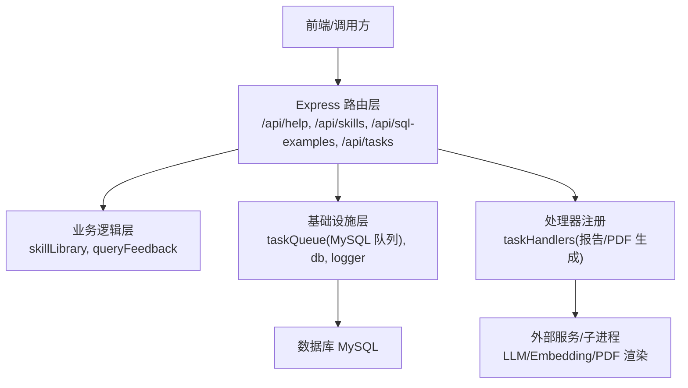
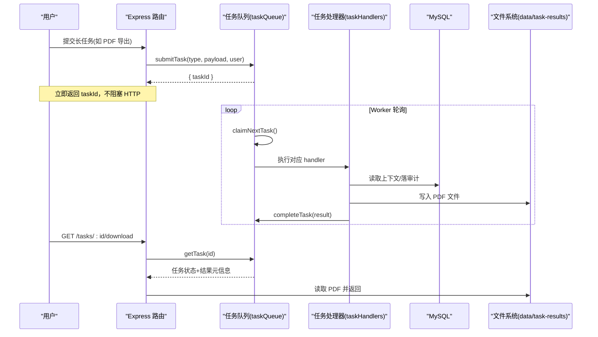
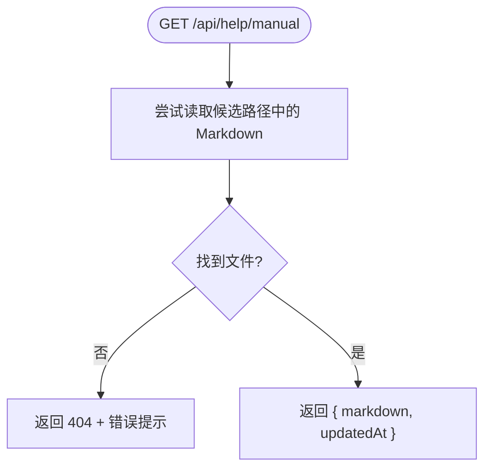
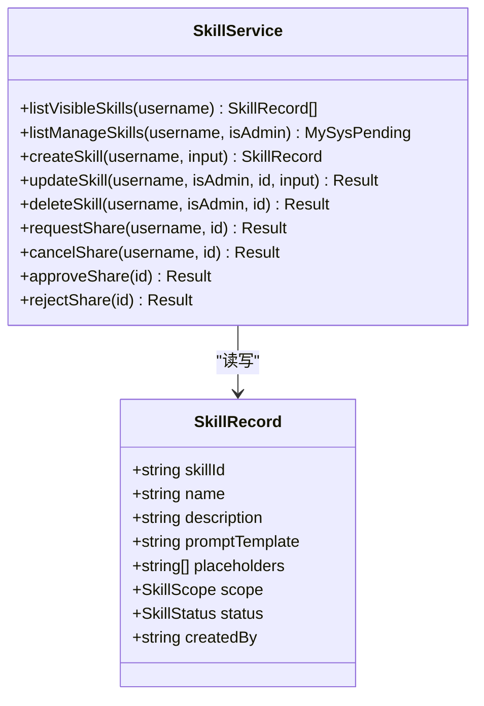
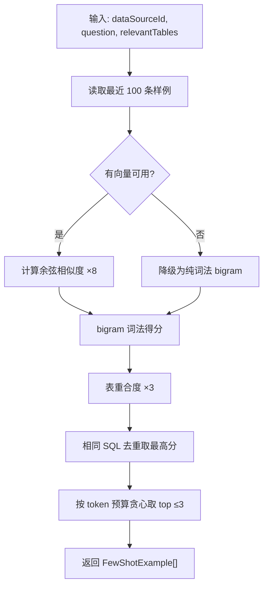
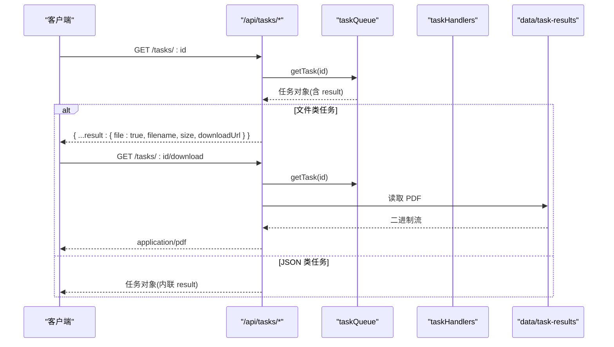
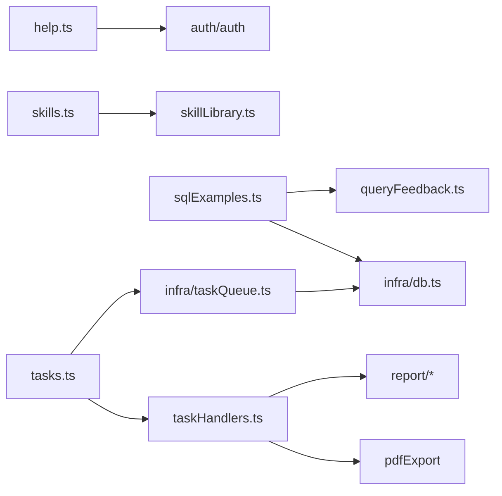

# 工具API

<cite>
**本文引用的文件**
- [server/routes/help.ts](file://server/routes/help.ts)
- [server/routes/skills.ts](file://server/routes/skills.ts)
- [server/skillLibrary.ts](file://server/skillLibrary.ts)
- [server/routes/sqlExamples.ts](file://server/routes/sqlExamples.ts)
- [server/query/queryFeedback.ts](file://server/query/queryFeedback.ts)
- [server/routes/tasks.ts](file://server/routes/tasks.ts)
- [server/infra/taskQueue.ts](file://server/infra/taskQueue.ts)
- [server/taskHandlers.ts](file://server/taskHandlers.ts)
- [docs/openapi.json](file://docs/openapi.json)
</cite>

## 目录
1. [简介](#简介)
2. [项目结构](#项目结构)
3. [核心组件](#核心组件)
4. [架构总览](#架构总览)
5. [详细组件分析](#详细组件分析)
6. [依赖关系分析](#依赖关系分析)
7. [性能与调度策略](#性能与调度策略)
8. [故障排查指南](#故障排查指南)
9. [结论](#结论)
10. [附录：请求与响应示例](#附录请求与响应示例)

## 简介
本章节面向“辅助工具API”，覆盖以下能力：
- 帮助文档接口：使用指南、更新日志（FAQ 类内容）的在线获取。
- 技能库管理接口：个人技能创建与维护、系统技能可见性、分享与审批流程。
- SQL 示例库：样例登记、批量导入导出、分类检索（按数据源）、质量评估（通过反馈沉淀与反例注入）。
- 异步任务队列：长任务提交、状态查询、结果下载；包含任务调度、错误重试、资源清理机制。
- 提供完整请求/响应示例，覆盖技能操作、示例查询、任务管理等场景。

## 项目结构
辅助工具相关路由与实现分布在 server/routes 与 server/infra、server/query 等模块中：
- 帮助文档：server/routes/help.ts
- 技能库：server/routes/skills.ts + server/skillLibrary.ts
- SQL 示例库：server/routes/sqlExamples.ts + server/query/queryFeedback.ts
- 异步任务：server/routes/tasks.ts + server/infra/taskQueue.ts + server/taskHandlers.ts
- OpenAPI 描述：docs/openapi.json（用于标签与分组说明）

图表来源
- [server/routes/help.ts:1-77](file://server/routes/help.ts#L1-L77)
- [server/routes/skills.ts:1-145](file://server/routes/skills.ts#L1-L145)
- [server/routes/sqlExamples.ts:1-190](file://server/routes/sqlExamples.ts#L1-L190)
- [server/routes/tasks.ts:1-86](file://server/routes/tasks.ts#L1-L86)
- [server/infra/taskQueue.ts:1-347](file://server/infra/taskQueue.ts#L1-L347)
- [server/taskHandlers.ts:1-198](file://server/taskHandlers.ts#L1-L198)

章节来源
- [server/routes/help.ts:1-77](file://server/routes/help.ts#L1-L77)
- [server/routes/skills.ts:1-145](file://server/routes/skills.ts#L1-L145)
- [server/routes/sqlExamples.ts:1-190](file://server/routes/sqlExamples.ts#L1-L190)
- [server/routes/tasks.ts:1-86](file://server/routes/tasks.ts#L1-L86)
- [server/infra/taskQueue.ts:1-347](file://server/infra/taskQueue.ts#L1-L347)
- [server/taskHandlers.ts:1-198](file://server/taskHandlers.ts#L1-L198)
- [docs/openapi.json:1-200](file://docs/openapi.json#L1-L200)

## 核心组件
- 帮助文档服务：读取 docs 下的 Markdown 并返回给前端渲染，支持回退策略。
- 技能库服务：维护 USER/SYSTEM 两类技能，支持分享申请与管理员审批。
- SQL 示例库：CRUD、批量导入导出、问题反推、few-shot 检索与反例注入。
- 异步任务队列：基于 MySQL 的任务表与内置 worker，支持心跳、超时、孤儿回收、并发控制。
- 任务处理器：报告生成、问数报告生成、PDF 导出三类任务的执行体。

章节来源
- [server/routes/help.ts:1-77](file://server/routes/help.ts#L1-L77)
- [server/skillLibrary.ts:1-241](file://server/skillLibrary.ts#L1-L241)
- [server/query/queryFeedback.ts:1-471](file://server/query/queryFeedback.ts#L1-L471)
- [server/infra/taskQueue.ts:1-347](file://server/infra/taskQueue.ts#L1-L347)
- [server/taskHandlers.ts:1-198](file://server/taskHandlers.ts#L1-L198)

## 架构总览

图表来源
- [server/routes/tasks.ts:1-86](file://server/routes/tasks.ts#L1-L86)
- [server/infra/taskQueue.ts:120-200](file://server/infra/taskQueue.ts#L120-L200)
- [server/taskHandlers.ts:165-198](file://server/taskHandlers.ts#L165-L198)

## 详细组件分析

### 帮助文档接口
- 功能：提供 /api/help/manual 与 /api/help/changelog，返回 Markdown 内容与更新时间。
- 行为：优先读取“用户使用指南.md”，不存在时回退到“系统功能说明书.md”；更新日志独立文件。
- 鉴权：需登录（authMiddleware）。
- 错误：文件缺失返回 404 与错误提示。

图表来源
- [server/routes/help.ts:20-74](file://server/routes/help.ts#L20-L74)

章节来源
- [server/routes/help.ts:1-77](file://server/routes/help.ts#L1-L77)

### 技能库管理接口
- 列表与详情：
  - GET /api/skills：返回当前用户可见的技能（系统库生效 + 本人个人库生效）。
  - GET /api/skills/:id：单个技能详情。
- 管理视图：
  - GET /api/skills/manage：我的技能 + 系统技能；管理员额外看到待审核分享列表。
- 维护：
  - POST /api/skills：新建个人技能。
  - PUT /api/skills/:id：编辑（个人仅本人，系统仅 ADMIN）。
  - DELETE /api/skills/:id：删除（权限同编辑）。
- 分享与审批：
  - POST /api/skills/:id/share：发起分享申请（PENDING_SHARE）。
  - POST /api/skills/:id/share/cancel：撤回分享申请。
  - POST /api/skills/:id/share/approve：管理员批准（复制进入系统库，重名自动加后缀）。
  - POST /api/skills/:id/share/reject：管理员拒绝（退回私有）。

图表来源
- [server/skillLibrary.ts:12-241](file://server/skillLibrary.ts#L12-L241)
- [server/routes/skills.ts:28-145](file://server/routes/skills.ts#L28-L145)

章节来源
- [server/routes/skills.ts:1-145](file://server/routes/skills.ts#L1-L145)
- [server/skillLibrary.ts:1-241](file://server/skillLibrary.ts#L1-L241)

### SQL 示例库功能
- 查询：
  - GET /api/sql-examples?dataSourceId=xxx：列出某数据源的全部样例。
- 登记/编辑/删除（ADMIN）：
  - POST /api/sql-examples：手工登记 {dataSourceId, question, sql}。
  - PUT /api/sql-examples/:id：编辑样例。
  - DELETE /api/sql-examples/:id：剔除劣质样例。
- 批量与冷启动：
  - POST /api/sql-examples/bulk：批量保存样例（上限 10）。
  - POST /api/sql-examples/generate-questions：对一批 SQL 反推问题（上限 10，不入库）。
- 导入导出（ADMIN）：
  - GET /api/sql-examples/export?dataSourceId=xxx：导出 JSON 备份。
  - POST /api/sql-examples/import：从 JSON 恢复，支持 mergeStrategy(skip/overwrite/append) 与 dryRun。
- 质量评估与检索：
  - 点赞自动沉淀为 few-shot 正例；点踩沉淀为反例（只保留错误表特征，避免照抄）。
  - 检索采用“语义向量 + bigram 词法 + 表重合度”的多维打分，按 token 预算贪心取 top。

图表来源
- [server/query/queryFeedback.ts:168-232](file://server/query/queryFeedback.ts#L168-L232)

章节来源
- [server/routes/sqlExamples.ts:1-190](file://server/routes/sqlExamples.ts#L1-L190)
- [server/query/queryFeedback.ts:1-471](file://server/query/queryFeedback.ts#L1-L471)

### 异步任务队列接口
- 提交：由上层路由（如报告/导出）调用 submitTask，返回 taskId。
- 查询：
  - GET /api/tasks/mine：我的最近任务列表（状态/进度/结果摘要）。
  - GET /api/tasks/:id：单任务状态（SUCCESS 时内联 result；文件类任务返回 downloadUrl）。
  - GET /api/tasks/:id/download：文件类任务结果下载（PDF）。
- 权限：仅任务提交人本人或 ADMIN 可查/下载。
- 处理：worker 周期领取 PENDING 任务，执行后写 SUCCESS/FAILED，并记录进度与错误。

图表来源
- [server/routes/tasks.ts:27-86](file://server/routes/tasks.ts#L27-L86)
- [server/infra/taskQueue.ts:229-269](file://server/infra/taskQueue.ts#L229-L269)
- [server/taskHandlers.ts:165-198](file://server/taskHandlers.ts#L165-L198)

章节来源
- [server/routes/tasks.ts:1-86](file://server/routes/tasks.ts#L1-L86)
- [server/infra/taskQueue.ts:1-347](file://server/infra/taskQueue.ts#L1-L347)
- [server/taskHandlers.ts:1-198](file://server/taskHandlers.ts#L1-L198)

## 依赖关系分析
- 路由层依赖认证中间件与业务服务：
  - help.ts → auth/auth
  - skills.ts → skillLibrary
  - sqlExamples.ts → queryFeedback + infra/db + logger
  - tasks.ts → taskQueue + taskHandlers + logger
- 任务队列依赖数据库连接池与日志；处理器依赖报告生成与 PDF 导出能力。
- 示例库依赖 LLM/Embedding 进行向量计算，失败时自动降级词法匹配。

图表来源
- [server/routes/help.ts:1-77](file://server/routes/help.ts#L1-L77)
- [server/routes/skills.ts:1-145](file://server/routes/skills.ts#L1-L145)
- [server/routes/sqlExamples.ts:1-190](file://server/routes/sqlExamples.ts#L1-L190)
- [server/routes/tasks.ts:1-86](file://server/routes/tasks.ts#L1-L86)
- [server/infra/taskQueue.ts:1-347](file://server/infra/taskQueue.ts#L1-L347)
- [server/taskHandlers.ts:1-198](file://server/taskHandlers.ts#L1-L198)

章节来源
- [server/routes/help.ts:1-77](file://server/routes/help.ts#L1-L77)
- [server/routes/skills.ts:1-145](file://server/routes/skills.ts#L1-L145)
- [server/routes/sqlExamples.ts:1-190](file://server/routes/sqlExamples.ts#L1-L190)
- [server/routes/tasks.ts:1-86](file://server/routes/tasks.ts#L1-L86)
- [server/infra/taskQueue.ts:1-347](file://server/infra/taskQueue.ts#L1-L347)
- [server/taskHandlers.ts:1-198](file://server/taskHandlers.ts#L1-L198)

## 性能与调度策略
- 任务并发：TASK_WORKER_CONCURRENCY（默认 2），限制同时执行任务数，避免与交互问数争抢资源。
- 用户排队上限：TASK_QUEUE_USER_MAX（默认 3），防止单用户排队风暴。
- 心跳与超时：
  - 任务执行期每 5s 心跳，心跳超时默认 90s 视为孤儿。
  - 执行超时默认 10 分钟，超时报 FAILED。
- 孤儿回收：启动与周期性巡检，将 RUNNING 且心跳超时的任务在 attempts < 2 时回 PENDING 重跑，否则标 FAILED。
- 资源清理：PDF 结果文件位于 data/task-results，下载端点检测文件存在性，若被清理则返回 410 提示重新发起。
- 示例检索优化：
  - 向量嵌入失败自动降级为 bigram 词法匹配。
  - 相同 SQL 去重，按 token 预算贪心选取 top 条目，控制 prompt 大小。

章节来源
- [server/infra/taskQueue.ts:65-84](file://server/infra/taskQueue.ts#L65-L84)
- [server/infra/taskQueue.ts:206-227](file://server/infra/taskQueue.ts#L206-L227)
- [server/infra/taskQueue.ts:277-306](file://server/infra/taskQueue.ts#L277-L306)
- [server/query/queryFeedback.ts:168-232](file://server/query/queryFeedback.ts#L168-L232)

## 故障排查指南
- 帮助文档 404：检查 docs 目录下是否存在“用户使用指南.md”或“系统功能说明书.md”以及“更新日志.md”。
- 技能操作 403/404：确认技能存在性与权限（个人技能仅本人，系统技能仅 ADMIN）。
- SQL 示例库导入失败：
  - 校验文件格式 type=sql-examples，examples 非空。
  - mergeStrategy 必须为 skip/overwrite/append。
  - 目标数据源必须存在。
- 任务下载 409/410：
  - 409：任务未完成或失败。
  - 410：结果文件已被清理，需重新发起任务。
- 任务长时间 RUNNING：检查 worker 是否启动、心跳是否正常、是否有孤儿回收。

章节来源
- [server/routes/help.ts:58-74](file://server/routes/help.ts#L58-L74)
- [server/routes/skills.ts:71-145](file://server/routes/skills.ts#L71-L145)
- [server/routes/sqlExamples.ts:88-158](file://server/routes/sqlExamples.ts#L88-L158)
- [server/routes/tasks.ts:38-86](file://server/routes/tasks.ts#L38-L86)
- [server/infra/taskQueue.ts:206-227](file://server/infra/taskQueue.ts#L206-L227)

## 结论
本 API 围绕“辅助工具”提供了帮助文档、技能库、SQL 示例库与异步任务四大能力。通过清晰的权限模型、稳健的队列机制与可扩展的示例检索策略，既满足日常运维与自助使用，也为后续扩展（更多任务类型、更丰富的示例治理）预留了空间。

## 附录：请求与响应示例
以下为各场景的典型请求与响应结构（以字段说明为主，不包含具体代码片段）。

- 帮助文档
  - GET /api/help/manual
    - 成功：{ markdown: string, updatedAt: string }
    - 失败：{ error: string }（404 当文件缺失）
  - GET /api/help/changelog
    - 成功：{ markdown: string, updatedAt: string }
    - 失败：{ error: string }（404 当文件缺失）

- 技能库
  - GET /api/skills
    - 成功：{ skills: [{ id, name, description, promptTemplate, placeholders, scope, status, createdBy }] }
  - POST /api/skills
    - 入参：{ name, description, promptTemplate }
    - 成功：{ skill: {...} }
    - 失败：{ error: string }（400 参数校验失败）
  - PUT /api/skills/:id
    - 成功：{ skill: {...} }
    - 失败：{ error: string }（403/404）
  - DELETE /api/skills/:id
    - 成功：{ success: true }
    - 失败：{ error: string }
  - POST /api/skills/:id/share
    - 成功：{ success: true }
    - 失败：{ error: string }（400/403/404）
  - POST /api/skills/:id/share/cancel
    - 成功：{ success: true }
    - 失败：{ error: string }
  - POST /api/skills/:id/share/approve（ADMIN）
    - 成功：{ success: true, skill: {...} }
    - 失败：{ error: string }
  - POST /api/skills/:id/share/reject（ADMIN）
    - 成功：{ success: true }
    - 失败：{ error: string }

- SQL 示例库
  - GET /api/sql-examples?dataSourceId=xxx
    - 成功：{ examples: [{ id, dataSourceId, question, sql, source, createdBy, createdAt }] }
    - 失败：{ error: string }（400/500）
  - POST /api/sql-examples（ADMIN）
    - 入参：{ dataSourceId, question, sql }
    - 成功：{ ok: true, example: {...} }
    - 失败：{ error: string }
  - POST /api/sql-examples/generate-questions（ADMIN）
    - 入参：{ sqls: string[] }（单次最多 10）
    - 成功：{ pairs: [{ sql, question }] }
    - 失败：{ error: string }
  - POST /api/sql-examples/bulk（ADMIN）
    - 入参：{ dataSourceId, examples: [{ question, sql }] }（单次最多 10）
    - 成功：{ ok: true, saved: number }
    - 失败：{ error: string }
  - GET /api/sql-examples/export?dataSourceId=xxx（ADMIN）
    - 成功：application/json 文件流（JSON 备份）
    - 失败：{ error: string }
  - POST /api/sql-examples/import（ADMIN）
    - 入参：{ fileData: object, dataSourceId?, mergeStrategy?: 'skip'|'overwrite'|'append', dryRun?: boolean }
    - 成功：{ success, dryRun, mergeStrategy, importedCount, updatedCount, skippedCount, errorCount, errors, summary, dataSourceId, dataSourceName }
    - 失败：{ error: string }
  - PUT /api/sql-examples/:id（ADMIN）
    - 成功：{ ok: true }
    - 失败：{ error: string }
  - DELETE /api/sql-examples/:id（ADMIN）
    - 成功：{ ok: true }
    - 失败：{ error: string }

- 异步任务
  - GET /api/tasks/mine
    - 成功：{ tasks: AsyncTask[] }
    - 失败：{ error: string }
  - GET /api/tasks/:id
    - 成功：AsyncTask（SUCCESS 时内联 result；文件类任务 result 中 file=true 并附带 downloadUrl）
    - 失败：{ error: string }（404/403/500）
  - GET /api/tasks/:id/download
    - 成功：application/pdf 文件流
    - 失败：{ error: string }（400/409/410/500）

章节来源
- [server/routes/help.ts:58-74](file://server/routes/help.ts#L58-L74)
- [server/routes/skills.ts:51-145](file://server/routes/skills.ts#L51-L145)
- [server/routes/sqlExamples.ts:25-187](file://server/routes/sqlExamples.ts#L25-L187)
- [server/routes/tasks.ts:27-86](file://server/routes/tasks.ts#L27-L86)
- [server/infra/taskQueue.ts:229-269](file://server/infra/taskQueue.ts#L229-L269)
- [server/taskHandlers.ts:165-198](file://server/taskHandlers.ts#L165-L198)