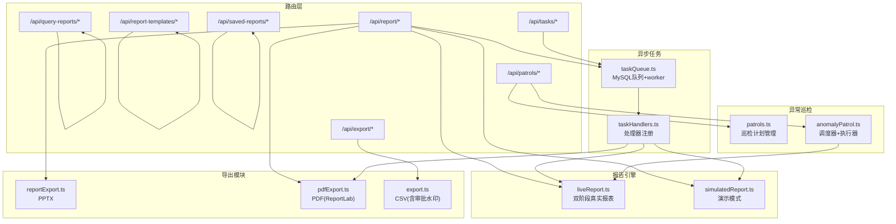
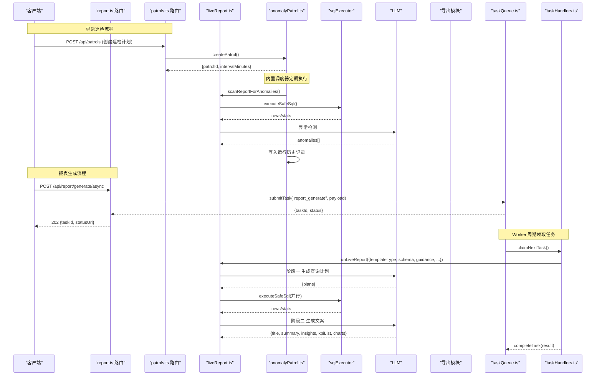
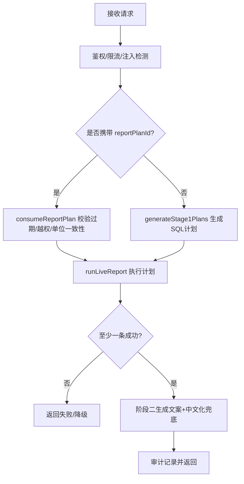
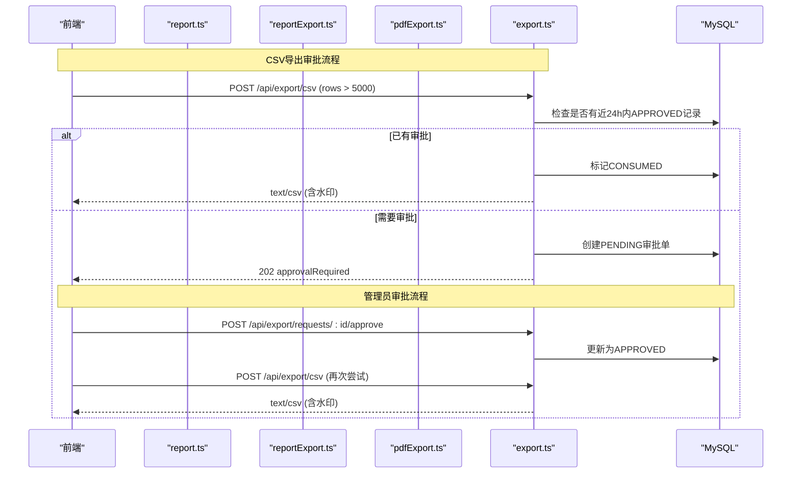
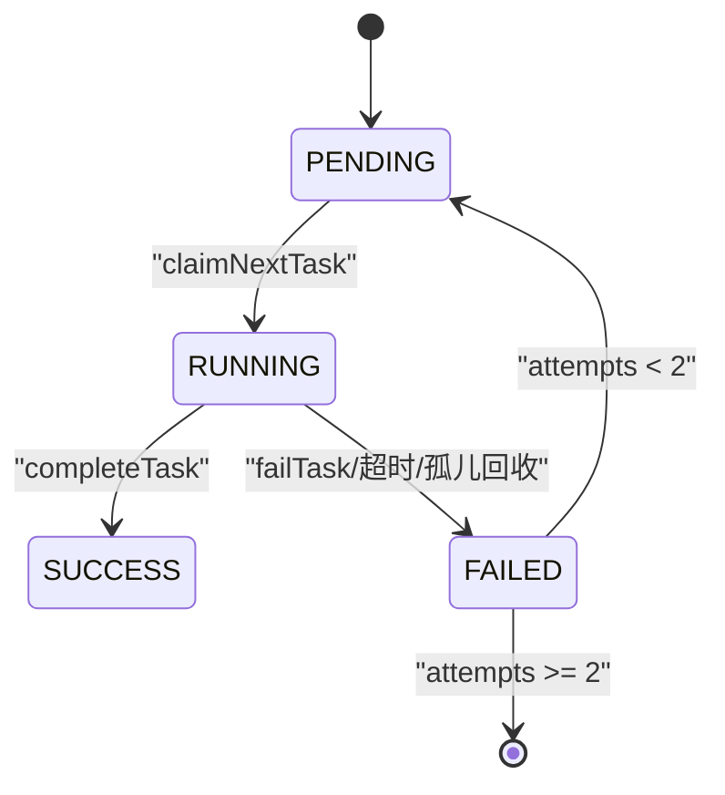
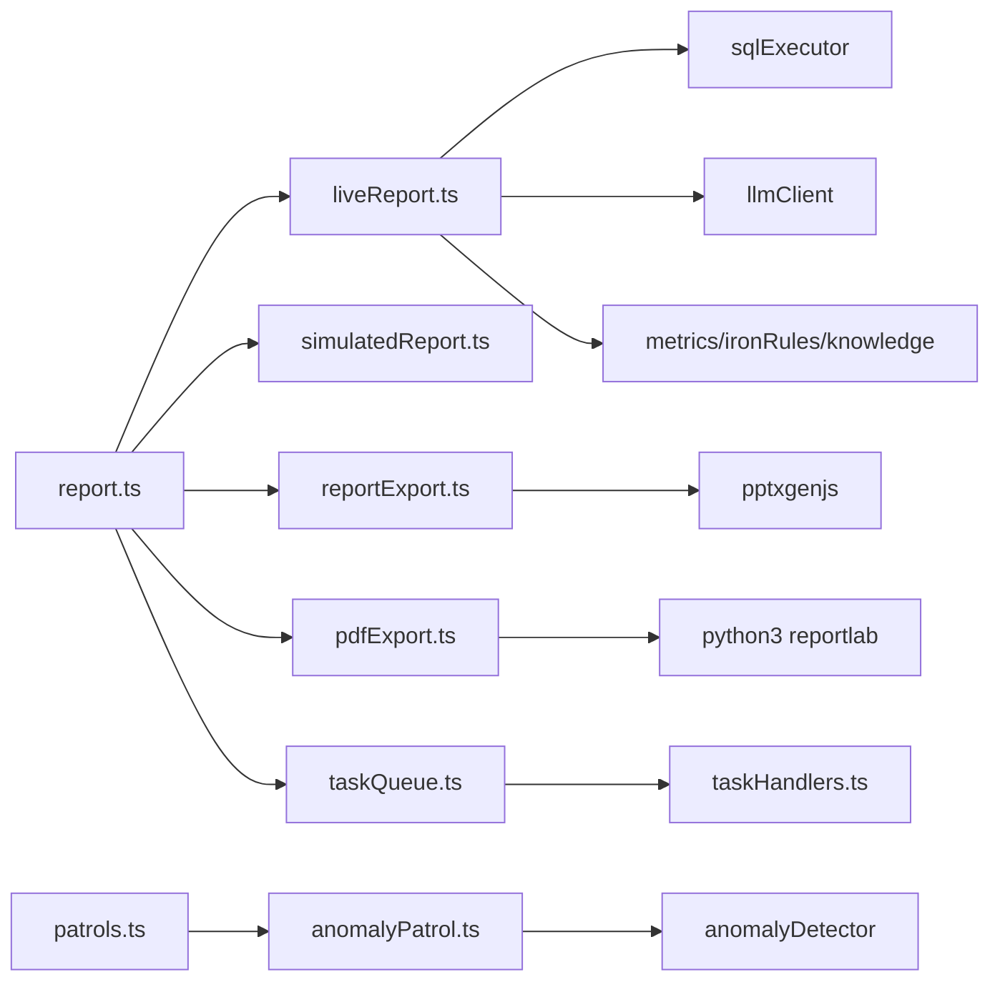

# 报表API

<cite>
**本文引用的文件**
- [server/routes/report.ts](file://server/routes/report.ts)
- [server/routes/queryReports.ts](file://server/routes/queryReports.ts)
- [server/routes/reportTemplates.ts](file://server/routes/reportTemplates.ts)
- [server/routes/savedReports.ts](file://server/routes/savedReports.ts)
- [server/routes/export.ts](file://server/routes/export.ts)
- [server/routes/tasks.ts](file://server/routes/tasks.ts)
- [server/routes/patrols.ts](file://server/routes/patrols.ts)
- [server/report/liveReport.ts](file://server/report/liveReport.ts)
- [server/report/simulatedReport.ts](file://server/report/simulatedReport.ts)
- [server/report/reportExport.ts](file://server/report/reportExport.ts)
- [server/report/pdfExport.ts](file://server/report/pdfExport.ts)
- [server/anomalyPatrol.ts](file://server/anomalyPatrol.ts)
- [server/infra/taskQueue.ts](file://server/infra/taskQueue.ts)
- [server/taskHandlers.ts](file://server/taskHandlers.ts)
</cite>

## 更新摘要
**变更内容**
- 新增巡逻系统相关端点（8个新端点）
- 增强导出功能端点（CSV导出审批机制）
- 总计154个一致的端点，包含详细的请求响应规范
- 新增异常巡检订阅和调度功能

## 目录
1. [简介](#简介)
2. [项目结构](#项目结构)
3. [核心组件](#核心组件)
4. [架构总览](#架构总览)
5. [详细组件分析](#详细组件分析)
6. [依赖关系分析](#依赖关系分析)
7. [性能与扩展性](#性能与扩展性)
8. [故障排查指南](#故障排查指南)
9. [结论](#结论)
10. [附录：接口清单与示例](#附录接口清单与示例)

## 简介
本文件面向"智能问数据分析系统"的报表生成与导出能力，覆盖以下目标：
- 动态报表的创建与管理：模板、图表配置、数据绑定
- 报表导出：PPT 导出、PDF 生成、CSV 自定义格式导出（含DLP水印和审批机制）
- 实时报表的数据更新机制：数据源连接、定时刷新、增量更新
- **新增**：异常巡检订阅系统，支持数据源级自动巡检和异常检测
- 权限控制、分享与版本管理
- 导出任务状态跟踪、错误处理与大文件策略
- 完整的请求/响应示例（以路径与字段说明为主，不直接粘贴代码）

## 项目结构
报表相关能力由路由层、报告引擎、导出模块、异步任务队列和异常巡检系统共同组成：
- 路由层：负责鉴权、限流、输入校验、审计记录与结果返回
- 报告引擎：双阶段真实报表生成（计划→执行→文案），以及演示模式
- 导出模块：PPTX/PDF/CSV 构建器，含DLP水印和审批机制
- 异步任务：MySQL 任务表 + 内置 worker，支持长任务提交、心跳、孤儿回收与下载
- **新增**：异常巡检系统，支持数据源级巡检计划和自动调度

**图示来源**
- [server/routes/report.ts:1-584](file://server/routes/report.ts#L1-L584)
- [server/routes/patrols.ts:1-210](file://server/routes/patrols.ts#L1-L210)
- [server/anomalyPatrol.ts:1-407](file://server/anomalyPatrol.ts#L1-L407)
- [server/report/liveReport.ts:1-493](file://server/report/liveReport.ts#L1-L493)
- [server/report/reportExport.ts:1-244](file://server/report/reportExport.ts#L1-L244)
- [server/report/pdfExport.ts:1-132](file://server/report/pdfExport.ts#L1-L132)
- [server/routes/export.ts:1-226](file://server/routes/export.ts#L1-L226)
- [server/infra/taskQueue.ts:1-347](file://server/infra/taskQueue.ts#L1-L347)
- [server/taskHandlers.ts:1-198](file://server/taskHandlers.ts#L1-L198)

**章节来源**
- [server/routes/report.ts:1-584](file://server/routes/report.ts#L1-L584)
- [server/routes/tasks.ts:1-86](file://server/routes/tasks.ts#L1-L86)

## 核心组件
### 报表生成路由
- POST /api/report/generate：同步生成（真实或演示）
- POST /api/report/plan：先生成查询计划，批准后再生成
- POST /api/report/generate-from-query：从对话问题生成报告
- POST /api/report/generate/async：异步生成，返回 taskId
- POST /api/report/export：PPT 导出（同步）
- POST /api/report/export-pdf：PDF 导出（同步）
- POST /api/report/export-pdf/async：PDF 导出（异步）

### 异常巡检系统（新增）
- GET /api/patrols：获取所有巡检计划列表
- POST /api/patrols：新建巡检计划（ADMIN/ANALYST）
- PUT /api/patrols/:patrolId：更新计划（名称/间隔/启停）
- DELETE /api/patrols/:patrolId：删除计划及其运行历史
- POST /api/patrols/:patrolId/run：立即执行一次巡检
- GET /api/patrols/:patrolId/runs：获取运行历史（含异常明细Top10）

### 报告中心与持久化
- GET/DELETE /api/query-reports/*：查询与删除历史报告
- GET/POST/PUT/DELETE /api/saved-reports/*：决策报表持久化、批注、替换

### 模板管理
- GET/POST/PUT/DELETE /api/report-templates/*：模板 CRUD，预设模板保护

### 数据导出（增强）
- POST /api/export/csv：带水印与阈值审批的 CSV 导出
- GET /api/export/requests/mine：我的下载申请
- GET /api/export/requests：ADMIN 审批列表
- POST /api/export/requests/:id/approve：批准导出申请
- POST /api/export/requests/:id/reject：拒绝导出申请

### 异步任务
- GET /api/tasks/mine：我的任务列表
- GET /api/tasks/:id：任务详情（JSON 类内联 result；文件类提供 downloadUrl）
- GET /api/tasks/:id/download：文件类任务下载

**章节来源**
- [server/routes/report.ts:30-584](file://server/routes/report.ts#L30-L584)
- [server/routes/patrols.ts:46-210](file://server/routes/patrols.ts#L46-L210)
- [server/routes/queryReports.ts:1-150](file://server/routes/queryReports.ts#L1-L150)
- [server/routes/reportTemplates.ts:1-253](file://server/routes/reportTemplates.ts#L1-L253)
- [server/routes/savedReports.ts:1-259](file://server/routes/savedReports.ts:1-L259)
- [server/routes/export.ts:91-226](file://server/routes/export.ts#L91-L226)
- [server/routes/tasks.ts:1-86](file://server/routes/tasks.ts#L1-L86)

## 架构总览
报表生成采用"双阶段真实报表"架构，并新增异常巡检订阅系统：
- 阶段一：LLM 根据 Schema、业务口径、铁律规则与知识库片段，生成 2-4 条聚合 SQL 计划（可复用已批准计划）
- 执行：并行安全执行 SQL，收集真实行数据与列统计
- 阶段二：将真实数据摘要回喂 LLM，生成标题、摘要、洞察、KPI 与逐图解读，并进行标识符中文化兜底

**新增异常巡检系统**：
- 数据源级巡检计划 = 既有报表异常检测引擎（scanReportForAnomalies）+ MySQL 巡检计划/运行历史表 + 内置低频调度器
- 每个计划绑定一个数据源，到期后扫描该数据源「最近一份真实数据（live）决策报表」
- 复用与报表同源的 Z-Score/阈值异常规则，把命中项写入巡检运行历史
- 调度：到期计划原子领取（UPDATE ... WHERE next_run_at <= NOW() 抢占），多实例不重复执行

导出链路：
- PPT：前端提供 base64 PNG 图表，服务端用 pptxgenjs 组装页面并返回 Buffer
- PDF：通过 Python ReportLab 子进程原生排版，文本矢量、图表 PNG 嵌入
- CSV：统一通道，首尾行水印，超阈值需管理员审批

**图示来源**
- [server/routes/report.ts:374-513](file://server/routes/report.ts#L374-L513)
- [server/routes/patrols.ts:57-193](file://server/routes/patrols.ts#L57-L193)
- [server/anomalyPatrol.ts:280-407](file://server/anomalyPatrol.ts#L280-L407)
- [server/report/liveReport.ts:237-493](file://server/report/liveReport.ts#L237-L493)
- [server/report/pdfExport.ts:66-132](file://server/report/pdfExport.ts#L66-L132)
- [server/infra/taskQueue.ts:120-347](file://server/infra/taskQueue.ts#L120-L347)
- [server/taskHandlers.ts:39-198](file://server/taskHandlers.ts#L39-L198)

## 详细组件分析

### 报表生成与计划模式
- 同步生成：鉴权→注入检测→金额单位白名单→限流/并发槽→加载 Schema→可复用 plan→执行→归一化→审计→返回
- 计划模式：先生成 plans 并存储（TTL 10 分钟，一次性消费），用户批准后携带 reportPlanId 执行，确保 SQL 与单位一致
- 从对话生成：支持指定模板或智能推断，成功后写入 query_reports 表，便于报告中心查看

**图示来源**
- [server/routes/report.ts:31-160](file://server/routes/report.ts#L31-L160)
- [server/report/liveReport.ts:195-493](file://server/report/liveReport.ts#L195-L493)

**章节来源**
- [server/routes/report.ts:31-226](file://server/routes/report.ts#L31-L226)
- [server/report/liveReport.ts:195-493](file://server/report/liveReport.ts#L195-L493)

### 异常巡检系统（新增）
**巡检计划管理**：
- 创建：绑定数据源 + 巡检间隔（15分钟~30天），自动生成下次执行时间
- 更新：支持修改名称、间隔、启停状态（ACTIVE/PAUSED）
- 删除：删除计划及其运行历史
- 权限：仅 ADMIN/ANALYST 可操作，按创建人隔离

**自动调度机制**：
- 内置低频调度器（默认60秒tick），支持环境变量配置
- 原子领取：使用 `UPDATE ... WHERE next_run_at <= NOW()` 防止多实例重复执行
- 批量处理：每tick最多处理5个计划（可配置PATROL_TICK_BATCH）
- 崩溃恢复：next_run_at 基于数据库时间推进，实例重启后自然续跑

**异常检测执行**：
- 扫描最近一份 live 决策报表（排除 simulated，避免演示数据误报）
- 复用报表同源的 Z-Score/阈值异常规则
- 记录运行历史：状态（ANOMALY/CLEAN/NO_DATA/ERROR）、异常数量、Top10异常明细
- 手动触发：支持立即执行一次巡检（不影响既有排期）

**章节来源**
- [server/routes/patrols.ts:46-210](file://server/routes/patrols.ts#L46-L210)
- [server/anomalyPatrol.ts:18-407](file://server/anomalyPatrol.ts#L18-L407)

### 模板管理与使用
- 模板结构：JSON，包含 sections 数组，每项必须有 title 与 prompt
- 权限：仅 ADMIN 可新增/编辑/删除；预设模板不可编辑或删除
- 使用：在"从对话生成报告"时，若传入 templateId，则加载模板内容并与用户提问合并为提示词

**章节来源**
- [server/routes/reportTemplates.ts:44-67](file://server/routes/reportTemplates.ts#L44-L67)
- [server/routes/reportTemplates.ts:84-132](file://server/routes/reportTemplates.ts#L84-L132)
- [server/routes/reportTemplates.ts:134-203](file://server/routes/reportTemplates.ts#L134-L203)
- [server/routes/reportTemplates.ts:205-253](file://server/routes/reportTemplates.ts#L205-L253)
- [server/routes/report.ts:295-310](file://server/routes/report.ts#L295-L310)

### 图表配置与数据绑定
- 图表类型：bar/line/area/pie/donut/radar/treemap/heatmap
- 轴键：xAxisKey 与 yAxisKeys 必须与 SQL 输出列严格一致
- 数据绑定：阶段一生成的 SQL 经安全执行后，按列名映射中文显示；图表数据来自真实查询结果
- 图表解读：阶段二基于真实数据样本与列统计生成 commentary

**章节来源**
- [server/report/liveReport.ts:275-320](file://server/report/liveReport.ts#L275-L320)
- [server/report/liveReport.ts:366-422](file://server/report/liveReport.ts#L366-L422)
- [server/report/liveReport.ts:428-489](file://server/report/liveReport.ts#L428-L489)

### 报表导出（PPT/PDF/CSV - 增强版）
**PPT 导出**：
- 前端传 base64 PNG，服务端构建封面/摘要/KPI/每图一页/结论页
- 文件名安全化处理，支持导出人水印标注

**PDF 导出**：
- 调用 ReportLab 子进程，文本矢量排版，PNG 图表嵌入
- 支持横竖版；DLP 水印在服务端注入
- 环境探测：检查 python3 + reportlab + PIL 可用性

**CSV 导出（增强）**：
- 统一通道，首尾行水印（含导出人、部门、时间、行数）
- 阈值审批机制：超过默认5000行需管理员审批（ADMIN豁免）
- 硬上限防护：默认10万行限制，防止内存溢出
- 审批流程：PENDING → APPROVED/REJECTED → CONSUMED（一次性授权）

**图示来源**
- [server/routes/report.ts:515-581](file://server/routes/report.ts#L515-L581)
- [server/report/reportExport.ts:66-244](file://server/report/reportExport.ts#L66-L244)
- [server/report/pdfExport.ts:66-132](file://server/report/pdfExport.ts#L66-L132)
- [server/routes/export.ts:91-226](file://server/routes/export.ts#L91-L226)

**章节来源**
- [server/report/reportExport.ts:66-244](file://server/report/reportExport.ts#L66-L244)
- [server/report/pdfExport.ts:1-132](file://server/report/pdfExport.ts#L1-L132)
- [server/routes/export.ts:1-226](file://server/routes/export.ts#L1-L226)

### 实时报表与数据更新机制
- 数据源连接：通过 loadSchemaContext 获取 Schema、guidance、敏感列剔除与行级权限过滤；支持数据库型与已导入文件的文件型数据源
- 定时刷新：当前实现未提供内置定时刷新；可通过外部调度触发 /generate 或 /generate/async 接口进行刷新
- 增量更新：当前实现基于全量 SQL 计划执行；如需增量，可在应用层设计时间窗口参数并传入 customPrompt 或模板提示词

**章节来源**
- [server/routes/report.ts:77-115](file://server/routes/report.ts#L77-L115)
- [server/report/liveReport.ts:65-88](file://server/report/liveReport.ts#L65-L88)

### 权限控制、分享与版本管理
**权限控制**：
- 路由层 requireRole('ADMIN','ANALYST') 限制报告生成/导出
- 报告中心与保存报表按用户隔离，ADMIN 可跨用户访问
- 大导出需管理员审批（CSV）
- 巡检计划按创建人隔离，ADMIN 可管理所有计划

**分享机制**：
- 报告中心 query_reports 与 saved_reports 提供列表与详情接口，可用于内部共享
- 无公开链接分享；可通过任务下载端点（/api/tasks/:id/download）在鉴权后下载 PDF

**版本管理**：
- saved_reports 支持整体替换（PUT :reportId），用于重新生成场景
- 批注字段独立更新（PUT :reportId/comments），支持协同批注

**章节来源**
- [server/routes/report.ts:31-46](file://server/routes/report.ts#L31-L46)
- [server/routes/queryReports.ts:46-104](file://server/routes/queryReports.ts#L46-L104)
- [server/routes/savedReports.ts:91-259](file://server/routes/savedReports.ts#L91-L259)
- [server/routes/export.ts:91-165](file://server/routes/export.ts#L91-L165)
- [server/routes/tasks.ts:58-83](file://server/routes/tasks.ts#L58-L83)
- [server/routes/patrols.ts:36-44](file://server/routes/patrols.ts#L36-L44)

### 异步任务状态跟踪、错误处理与大文件策略
**状态跟踪**：
- 提交返回 taskId 与 statusUrl
- GET /api/tasks/:id 返回进度、错误、result（JSON 类）或 downloadUrl（文件类）
- GET /api/tasks/mine 列出最近任务

**错误处理**：
- 任务失败记录 error 字段，最大尝试次数 2 次，超限标 FAILED
- 孤儿任务心跳超时自动回收并重试或标记失败

**大文件策略**：
- PDF 导出通过子进程生成并落盘 data/task-results，避免内存放大
- CSV 导出设置硬上限行数，防止撑爆内存
- 导出文件通过专用下载端点提供，避免长连接阻塞

**图示来源**
- [server/infra/taskQueue.ts:86-227](file://server/infra/taskQueue.ts#L86-L227)
- [server/infra/taskQueue.ts:271-347](file://server/infra/taskQueue.ts#L271-L347)
- [server/routes/tasks.ts:27-83](file://server/routes/tasks.ts#L27-L83)

**章节来源**
- [server/infra/taskQueue.ts:119-227](file://server/infra/taskQueue.ts#L119-L227)
- [server/routes/tasks.ts:27-83](file://server/routes/tasks.ts#L27-L83)

## 依赖关系分析
**路由层依赖**：
- 鉴权与限流：authMiddleware、rateLimiter
- 审计：writeAudit
- 数据源上下文：loadSchemaContext、isLiveCapableType
- 报告引擎：runLiveReport、runSimulatedReport、getFallbackExecutiveReport
- 导出：buildReportPptx、runPdfGenerator、normalizeExportData
- 任务队列：submitTask、getTask、listUserTasks
- **新增**：异常巡检：createPatrol、executePatrol、startPatrolScheduler

**报告引擎依赖**：
- LLM：callLLMJson（阶段一/二）
- SQL 执行：executeSafeSql（安全执行、行级权限、敏感列剔除）
- 指标/铁律/知识：loadActiveMetrics、loadActiveIronRules、retrieveKnowledgeSnippets

**导出模块依赖**：
- PPTX：pptxgenjs
- PDF：Python ReportLab 子进程
- CSV：内置构建器（含水印与审批）

**异常巡检依赖**：
- 报表扫描：scanReportForAnomalies（复用现有异常检测逻辑）
- 数据库：MySQL anomaly_patrols 和 anomaly_patrol_runs 表
- 调度器：内置定时器，支持环境变量配置

**图示来源**
- [server/routes/report.ts:1-584](file://server/routes/report.ts#L1-L584)
- [server/routes/patrols.ts:1-210](file://server/routes/patrols.ts#L1-L210)
- [server/anomalyPatrol.ts:1-407](file://server/anomalyPatrol.ts#L1-L407)
- [server/report/liveReport.ts:1-493](file://server/report/liveReport.ts#L1-L493)
- [server/report/reportExport.ts:1-244](file://server/report/reportExport.ts#L1-L244)
- [server/report/pdfExport.ts:1-132](file://server/report/pdfExport.ts#L1-L132)
- [server/infra/taskQueue.ts:1-347](file://server/infra/taskQueue.ts#L1-L347)
- [server/taskHandlers.ts:1-198](file://server/taskHandlers.ts#L1-L198)

**章节来源**
- [server/routes/report.ts:1-584](file://server/routes/report.ts#L1-L584)
- [server/routes/patrols.ts:1-210](file://server/routes/patrols.ts#L1-L210)
- [server/anomalyPatrol.ts:1-407](file://server/anomalyPatrol.ts#L1-L407)
- [server/report/liveReport.ts:1-493](file://server/report/liveReport.ts#L1-L493)
- [server/infra/taskQueue.ts:1-347](file://server/infra/taskQueue.ts#L1-L347)

## 性能与扩展性
**并发与限流**：
- 用户级并发槽互斥（查询与报告共享）
- 任务队列 worker 并发上限默认 2，可配置
- 单用户在途任务上限默认 3，可配置
- 巡检调度器 tick 级防重入，避免慢扫描导致的并发问题

**资源保护**：
- 阶段二采样行数限制（每图最多 10 行）
- CSV 导出硬上限行数（默认10万行）
- PDF 子进程超时强制 kill（默认60秒）
- 巡检计划间隔限制（15分钟~30天）

**可扩展点**：
- 增加更多导出格式（如 Excel）可复用 reportExport 风格
- 定时刷新可通过外部调度触发异步接口
- 增量更新需在应用层封装时间窗口参数并传入提示词
- 巡检频率可通过环境变量 PATROL_SCHEDULER_INTERVAL_MS 调整

## 故障排查指南
**常见错误码与含义**：
- INVALID_INPUT：参数非法（如金额单位不支持、columns/rows 形状不合法）
- FORBIDDEN：角色无权限（非 ADMIN/ANALYST）
- RATE_LIMITED：限流或在途任务过多
- PLAN_INVALID：报告计划过期/越权/不匹配
- LLM_UNAVAILABLE：LLM 调用失败
- INTERNAL_ERROR：服务器内部错误

**定位步骤**：
- 检查审计日志 endpoint='report'/'export'/'patrol' 的 status 与 detail
- 任务失败查看 task.error 与 attempts
- PDF 导出失败检查 Python 环境与脚本路径
- CSV 导出被拦截查看是否超过阈值且未获审批
- 巡检问题检查 anomaly_patrols 和 anomaly_patrol_runs 表状态

**章节来源**
- [server/routes/report.ts:42-75](file://server/routes/report.ts#L42-L75)
- [server/routes/report.ts:214-225](file://server/routes/report.ts#L214-L225)
- [server/routes/export.ts:109-149](file://server/routes/export.ts#L109-L149)
- [server/report/pdfExport.ts:36-60](file://server/report/pdfExport.ts#L36-L60)
- [server/infra/taskQueue.ts:202-227](file://server/infra/taskQueue.ts#L202-L227)

## 结论
本系统提供了完整的报表生成与导出能力，涵盖模板管理、图表配置、数据绑定、PPT/PDF/CSV 导出、权限控制与异步任务管理。**新增的异常巡检系统**进一步增强了系统的自动化监控能力，支持数据源级的自动异常检测和告警。通过双阶段真实报表与严格的输入校验、审计与限流，保障了报表质量与安全性。对于实时性与增量更新，建议结合外部调度与应用层参数设计以满足不同场景需求。

## 附录：接口清单与示例

### 报表生成
- POST /api/report/generate
  - 请求体关键字段：templateType、customPrompt、dataSourceId、schema、amountUnit、reportPlanId（可选）
  - 响应：success、executionTimeMs、report、dataProvenance（live/simulated）、executedSqls（可选）
- POST /api/report/plan
  - 请求体关键字段：templateType、customPrompt、dataSourceId、schema、amountUnit
  - 响应：success、reportPlanId、plan、expiresInSec
- POST /api/report/generate-from-query
  - 请求体关键字段：question、dataSourceId、templateId（可选）、amountUnit
  - 响应：success、executionTimeMs、report、reportId、templateName、dataProvenance
- POST /api/report/generate/async
  - 请求体关键字段：templateType、customPrompt、dataSourceId、amountUnit、reportPlanId（可选）
  - 响应：202 success、taskId、status、statusUrl

**章节来源**
- [server/routes/report.ts:31-160](file://server/routes/report.ts#L31-L160)
- [server/routes/report.ts:162-226](file://server/routes/report.ts#L162-L226)
- [server/routes/report.ts:228-372](file://server/routes/report.ts#L228-L372)
- [server/routes/report.ts:374-423](file://server/routes/report.ts#L374-L423)

### 异常巡检系统（新增）
- GET /api/patrols?dataSourceId=xxx
  - 响应：ok、patrols[]（patrolId、name、dataSourceId、intervalMinutes、status、nextRunAt、lastRunStatus等）
- POST /api/patrols
  - 请求体：name、dataSourceId、intervalMinutes（15~43200分钟）
  - 响应：201 ok、patrol（patrolId、name、dataSourceId、intervalMinutes、nextRunAt）
- PUT /api/patrols/:patrolId
  - 请求体：name、intervalMinutes、status（ACTIVE/PAUSED）
  - 响应：ok、patrol
- DELETE /api/patrols/:patrolId
  - 响应：ok
- POST /api/patrols/:patrolId/run
  - 响应：ok、result（status、anomalyCount、highCount、reportId、reportTitle、anomalies[]、error）
- GET /api/patrols/:patrolId/runs?limit=20
  - 响应：ok、runs[]（id、patrolId、runAt、status、reportId、reportTitle、anomalyCount、highCount、anomalies[]、error）

**章节来源**
- [server/routes/patrols.ts:46-210](file://server/routes/patrols.ts#L46-L210)
- [server/anomalyPatrol.ts:143-242](file://server/anomalyPatrol.ts#L143-L242)

### 报告中心与持久化
- GET /api/query-reports?dataSourceId=xxx
  - 响应：ok、reports[]（reportId、question、templateName、reportData、createdAt）
- GET /api/query-reports/:reportId
  - 响应：ok、report
- DELETE /api/query-reports/:reportId
  - 响应：ok
- GET /api/saved-reports?dataSourceId=xxx
  - 响应：ok、reports[]（reportId、userId、username、dataSourceId、templateType、dataProvenance、report、createdAt、updatedAt）
- POST /api/saved-reports
  - 请求体：report（id、title、dataSourceId、templateType、dataProvenance、genParams 等）
  - 响应：ok、reportId
- PUT /api/saved-reports/:reportId
  - 请求体：report（id 与路径一致）
  - 响应：ok
- PUT /api/saved-reports/:reportId/comments
  - 请求体：comments[]
  - 响应：ok
- DELETE /api/saved-reports/:reportId
  - 响应：ok

**章节来源**
- [server/routes/queryReports.ts:46-147](file://server/routes/queryReports.ts#L46-L147)
- [server/routes/savedReports.ts:91-259](file://server/routes/savedReports.ts#L91-L259)

### 模板管理
- GET /api/report-templates
  - 响应：ok、templates[]
- POST /api/report-templates
  - 请求体：name、description、templateContent（JSON，含 sections）
  - 响应：ok、template
- PUT /api/report-templates/:id
  - 请求体：name、description、templateContent
  - 响应：ok
- DELETE /api/report-templates/:id
  - 响应：ok

**章节来源**
- [server/routes/reportTemplates.ts:69-82](file://server/routes/reportTemplates.ts#L69-L82)
- [server/routes/reportTemplates.ts:84-132](file://server/routes/reportTemplates.ts#L84-L132)
- [server/routes/reportTemplates.ts:134-203](file://server/routes/reportTemplates.ts#L134-L203)
- [server/routes/reportTemplates.ts:205-253](file://server/routes/reportTemplates.ts#L205-L253)

### 导出（增强版）
- POST /api/report/export
  - 请求体：report（title、summary、charts[].imageBase64、kpiList、insights 等）
  - 响应：application/vnd.openxmlformats-officedocument.presentationml.presentation
- POST /api/report/export-pdf
  - 请求体：report、orientation（portrait/landscape）
  - 响应：application/pdf
- POST /api/report/export-pdf/async
  - 请求体：report、orientation、watermark（服务端注入）
  - 响应：202 success、taskId、status、statusUrl
- POST /api/export/csv
  - 请求体：title、columns[]、rows[][]、dataSourceId
  - 响应：text/csv（含水印；超阈值返回 202 审批信息）
- GET /api/export/requests/mine
  - 响应：success、requests[]（id、userId、username、department、dataSourceId、title、rowCount、status等）
- GET /api/export/requests?status=PENDING
  - 响应：success、requests[]（ADMIN专用，含dataSourceName）
- POST /api/export/requests/:id/approve
  - 请求体：note（可选）
  - 响应：success
- POST /api/export/requests/:id/reject
  - 请求体：note（可选）
  - 响应：success

**章节来源**
- [server/routes/report.ts:515-581](file://server/routes/report.ts#L515-L581)
- [server/routes/export.ts:91-226](file://server/routes/export.ts#L91-L226)

### 异步任务
- GET /api/tasks/mine?limit=20
  - 响应：tasks[]（id、type、status、progress、error、createdAt 等）
- GET /api/tasks/:id
  - 响应：任务详情（JSON 类任务内联 result；文件类任务提供 downloadUrl）
- GET /api/tasks/:id/download
  - 响应：application/pdf（文件类任务）

**章节来源**
- [server/routes/tasks.ts:27-83](file://server/routes/tasks.ts#L27-L83)