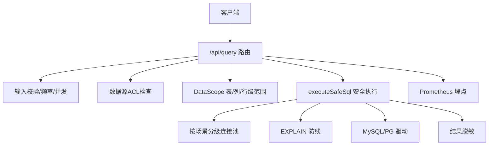
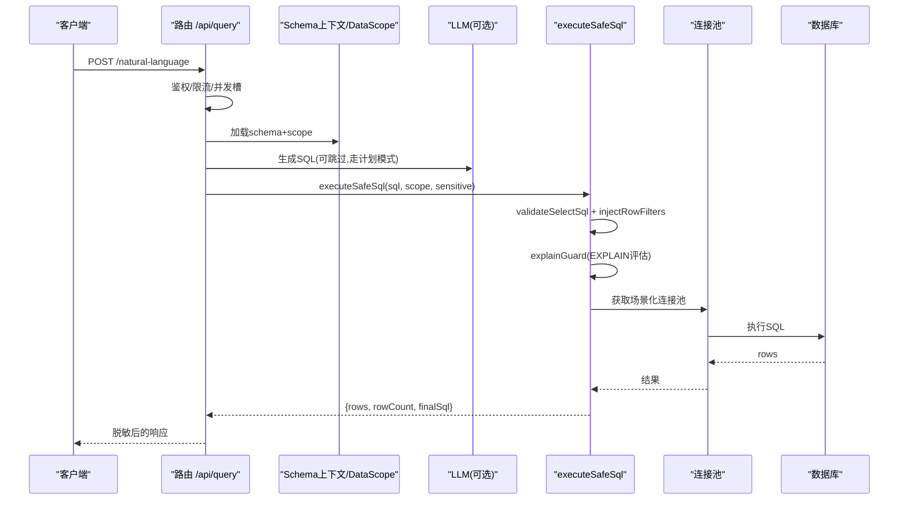
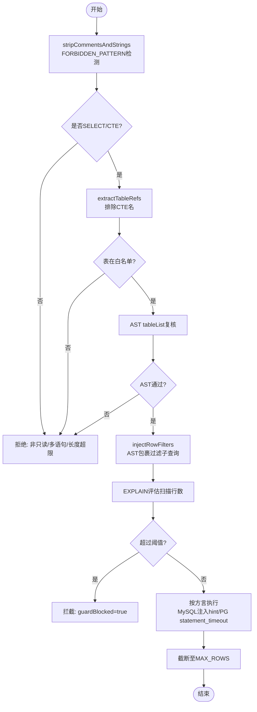
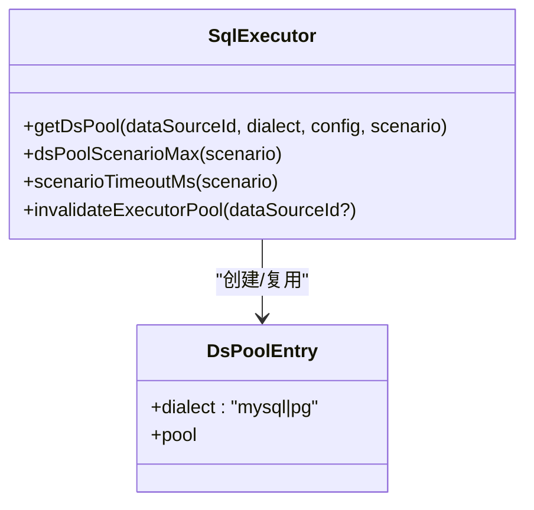
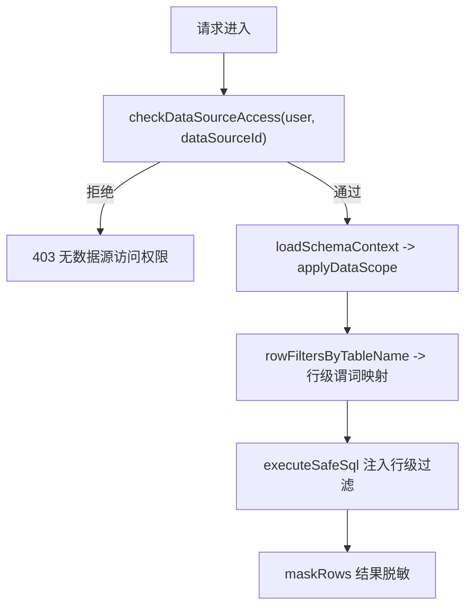
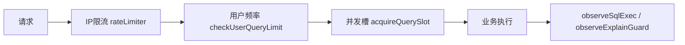
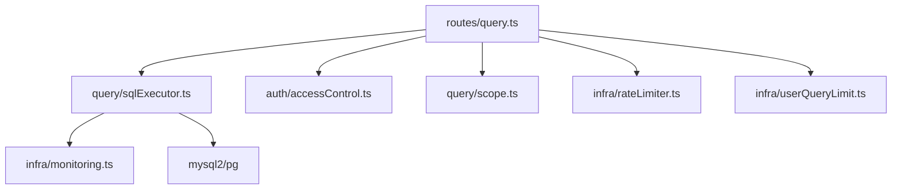

# SQL执行引擎

<cite>
**本文引用的文件**
- [sqlExecutor.ts](file://server/query/sqlExecutor.ts)
- [sqlExecutorPool.test.ts](file://server/query/sqlExecutorPool.test.ts)
- [accessControl.ts](file://server/auth/accessControl.ts)
- [scope.ts](file://server/query/scope.ts)
- [query.ts](file://server/routes/query.ts)
- [monitoring.ts](file://server/infra/monitoring.ts)
- [taskQueue.ts](file://server/infra/taskQueue.ts)
- [userQueryLimit.ts](file://server/infra/userQueryLimit.ts)
- [rateLimiter.ts](file://server/infra/rateLimiter.ts)
- [queryPlan.ts](file://server/query/queryPlan.ts)
</cite>

## 目录
1. [简介](#简介)
2. [项目结构](#项目结构)
3. [核心组件](#核心组件)
4. [架构总览](#架构总览)
5. [详细组件分析](#详细组件分析)
6. [依赖关系分析](#依赖关系分析)
7. [性能考量](#性能考量)
8. [故障排查指南](#故障排查指南)
9. [结论](#结论)
10. [附录：完整示例与最佳实践](#附录完整示例与最佳实践)

## 简介
本文件面向“智能问数据分析系统”的SQL执行引擎，系统性说明从查询解析、权限验证、性能优化到结果返回的全链路流程；并深入讲解连接池管理（连接复用、并发控制、资源限制）、数据权限控制（行级过滤、列级脱敏、访问控制列表ACL）、监控与优化策略（执行计划分析、慢查询日志、索引建议），以及错误处理与异常恢复机制。

## 项目结构
SQL执行相关代码主要分布在以下模块：
- 安全执行层：server/query/sqlExecutor.ts
- 路由入口：server/routes/query.ts
- 权限与范围：server/auth/accessControl.ts、server/query/scope.ts
- 监控与限流：server/infra/monitoring.ts、server/infra/rateLimiter.ts、server/infra/userQueryLimit.ts
- 长任务队列：server/infra/taskQueue.ts
- 计划模式：server/query/queryPlan.ts

**图表来源**
- [query.ts:47-393](file://server/routes/query.ts#L47-L393)
- [sqlExecutor.ts:734-832](file://server/query/sqlExecutor.ts#L734-L832)
- [monitoring.ts:63-78](file://server/infra/monitoring.ts#L63-L78)

**章节来源**
- [query.ts:47-393](file://server/routes/query.ts#L47-L393)
- [sqlExecutor.ts:734-832](file://server/query/sqlExecutor.ts#L734-L832)

## 核心组件
- 安全执行器：validateSelectSql、injectRowFilters、explainGuard、getDsPool、executeSafeSql
- 连接池：按数据源+场景分级缓存，支持MySQL与PG两种方言
- 权限控制：ACL（部门/用户白名单）与DataScope（表/列/行级）
- 监控与限流：Prometheus指标、IP级限流、用户级频率与并发槽
- 长任务队列：异步任务提交、心跳、孤儿回收、重试上限
- 计划模式：先出分析计划再执行，防误操作

**章节来源**
- [sqlExecutor.ts:169-489](file://server/query/sqlExecutor.ts#L169-L489)
- [sqlExecutor.ts:491-726](file://server/query/sqlExecutor.ts#L491-L726)
- [accessControl.ts:18-73](file://server/auth/accessControl.ts#L18-L73)
- [scope.ts:17-100](file://server/query/scope.ts#L17-L100)
- [monitoring.ts:63-78](file://server/infra/monitoring.ts#L63-L78)
- [taskQueue.ts:61-84](file://server/infra/taskQueue.ts#L61-L84)
- [queryPlan.ts:14-100](file://server/query/queryPlan.ts#L14-L100)

## 架构总览
SQL执行主路径（自然语言→真实执行）：
1. 路由接收请求，进行角色与频率/并发控制
2. 加载Schema上下文（含DataScope与敏感列过滤）
3. 调用LLM生成SQL（或走计划模式）
4. 进入安全执行层：只读校验、表白名单、AST复核、行级注入、EXPLAIN防线
5. 通过分级连接池执行SQL，结果截断与脱敏后返回
6. 全链路埋点与审计

**图表来源**
- [query.ts:47-393](file://server/routes/query.ts#L47-L393)
- [sqlExecutor.ts:734-832](file://server/query/sqlExecutor.ts#L734-L832)

## 详细组件分析

### 安全执行器（SQL安全执行层）
- 只读与单语句：仅允许SELECT开头（含WITH CTE），拒绝写/DDL/管理类关键字
- 表白名单：基于DataScope过滤后的表集合，正则+AST双重校验
- 敏感列拒绝：命中即拒绝
- 强制LIMIT：无LIMIT时追加，有LIMIT则clamp到MAX_ROWS
- 行级权限注入：AST递归包裹FROM子句为过滤子查询，覆盖CTE与子查询
- EXPLAIN防线：预估扫描行数超阈值拦截（MySQL/PG分别解析）
- MySQL服务端超时：注入MAX_EXECUTION_TIME hint（CTE链定位主SELECT）
- 结果截断：最多返回MAX_ROWS行，标记truncated

**图表来源**
- [sqlExecutor.ts:169-489](file://server/query/sqlExecutor.ts#L169-L489)
- [sqlExecutor.ts:531-662](file://server/query/sqlExecutor.ts#L531-L662)
- [sqlExecutor.ts:801-832](file://server/query/sqlExecutor.ts#L801-L832)

**章节来源**
- [sqlExecutor.ts:169-489](file://server/query/sqlExecutor.ts#L169-L489)
- [sqlExecutor.ts:531-662](file://server/query/sqlExecutor.ts#L531-L662)
- [sqlExecutor.ts:734-832](file://server/query/sqlExecutor.ts#L734-L832)

### 连接池与场景配额
- 分级建池：key= dataSourceId::scenario（interactive/chain/export）
- 容量公式：dsPoolMax()默认按EXPECTED_CONCURRENT_USERS推导，DS_POOL_MAX优先；场景配额按比例分配
- 超时档位：交互15s、分析链120s、导出60s，可通过环境变量覆盖
- 失效机制：配置变更时invalidateExecutorPool关闭旧池并重建
- 方言差异：MySQL使用connectionLimit与connectTimeout；PG使用max与statement_timeout

**图表来源**
- [sqlExecutor.ts:491-726](file://server/query/sqlExecutor.ts#L491-L726)
- [sqlExecutorPool.test.ts:117-170](file://server/query/sqlExecutorPool.test.ts#L117-L170)

**章节来源**
- [sqlExecutor.ts:491-726](file://server/query/sqlExecutor.ts#L491-L726)
- [sqlExecutorPool.test.ts:46-96](file://server/query/sqlExecutorPool.test.ts#L46-L96)
- [sqlExecutorPool.test.ts:117-170](file://server/query/sqlExecutorPool.test.ts#L117-L170)

### 数据权限控制（ACL + DataScope）
- ACL（数据源访问控制）：按部门/用户ID白名单控制能否使用该数据源；ADMIN豁免
- DataScope：tables/columns/rowFilters三维度圈定可用范围；行级谓词经sanitizeRowFilterPredicate清洗后由执行层AST注入
- 列级脱敏（DLP）：响应出口按角色对敏感列掩码（手机号/身份证/邮箱/银行卡等），ADMIN可豁免

**图表来源**
- [accessControl.ts:43-73](file://server/auth/accessControl.ts#L43-L73)
- [scope.ts:28-100](file://server/query/scope.ts#L28-L100)
- [sqlExecutor.ts:396-489](file://server/query/sqlExecutor.ts#L396-L489)

**章节来源**
- [accessControl.ts:18-73](file://server/auth/accessControl.ts#L18-L73)
- [scope.ts:17-100](file://server/query/scope.ts#L17-L100)
- [sqlExecutor.ts:396-489](file://server/query/sqlExecutor.ts#L396-L489)

### 监控、限流与并发控制
- Prometheus指标：SQL执行耗时、EXPLAIN防线状态、HTTP接口耗时、LLM调用耗时与token消耗
- IP级限流：固定分钟窗口INCR（Redis）或内存滑动窗口，默认30次/分钟
- 用户级频率：每小时20次（可配置），Redis模式固定小时窗口计数
- 并发互斥：同一用户同时仅允许一个进行中查询（分布式锁/内存TTL）

**图表来源**
- [rateLimiter.ts:14-42](file://server/infra/rateLimiter.ts#L14-L42)
- [userQueryLimit.ts:24-81](file://server/infra/userQueryLimit.ts#L24-L81)
- [monitoring.ts:63-78](file://server/infra/monitoring.ts#L63-L78)

**章节来源**
- [rateLimiter.ts:14-42](file://server/infra/rateLimiter.ts#L14-L42)
- [userQueryLimit.ts:24-81](file://server/infra/userQueryLimit.ts#L24-L81)
- [monitoring.ts:63-78](file://server/infra/monitoring.ts#L63-L78)

### 长任务队列（异步报告/导出）
- 任务类型：report_generate、report_generate_from_query、report_export_pdf
- 并发上限：TASK_WORKER_CONCURRENCY（默认2），与交互问数隔离
- 用户排队上限：TASK_QUEUE_USER_MAX（默认3）
- 心跳与孤儿回收：RUNNING心跳超时回PENDING重试，超过最大尝试次数标FAILED
- 原子领取：MySQL 8 SKIP LOCKED避免重复领取

**章节来源**
- [taskQueue.ts:61-84](file://server/infra/taskQueue.ts#L61-L84)
- [taskQueue.ts:120-175](file://server/infra/taskQueue.ts#L120-L175)
- [taskQueue.ts:202-227](file://server/infra/taskQueue.ts#L202-L227)
- [taskQueue.ts:277-338](file://server/infra/taskQueue.ts#L277-L338)

### 计划模式（先计划后执行）
- 生成计划：根据问题与Schema输出结构化步骤（filter/aggregate/join等）
- 存储与消费：内存Map或Redis TTL，一次性消费防重放，校验用户与数据源匹配
- 在路由中携带planId执行，确保计划与问题一致

**章节来源**
- [queryPlan.ts:14-100](file://server/query/queryPlan.ts#L14-L100)
- [queryPlan.ts:161-183](file://server/query/queryPlan.ts#L161-L183)
- [query.ts:188-203](file://server/routes/query.ts#L188-L203)

## 依赖关系分析
- 路由层依赖：authMiddleware、rateLimiter、loadSchemaContext、executeSafeSql、maskRows、writeAudit
- 执行层依赖：node-sql-parser（AST）、mysql2/pg驱动、监控埋点、密钥解密
- 权限依赖：accessControl（ACL）、scope（DataScope）
- 基础设施依赖：stateStore（Redis/内存）、logger

**图表来源**
- [query.ts:17-42](file://server/routes/query.ts#L17-L42)
- [sqlExecutor.ts:11-21](file://server/query/sqlExecutor.ts#L11-L21)
- [monitoring.ts:11-14](file://server/infra/monitoring.ts#L11-L14)

**章节来源**
- [query.ts:17-42](file://server/routes/query.ts#L17-L42)
- [sqlExecutor.ts:11-21](file://server/query/sqlExecutor.ts#L11-L21)

## 性能考量
- 连接池分级：按场景隔离配额，避免大导出挤占交互问数
- EXPLAIN防线：预估扫描行数超阈值拦截，保护业务库
- MySQL MAX_EXECUTION_TIME：服务端执行时限，双保险（驱动timeout + hint）
- 结果截断：MAX_ROWS防止OOM
- 缓存命中：L1精确+L2语义缓存减少重复执行
- 慢查询治理：执行时长>3s或行数>10万标记SLOW，便于审计与优化

**章节来源**
- [sqlExecutor.ts:41-109](file://server/query/sqlExecutor.ts#L41-L109)
- [sqlExecutor.ts:531-662](file://server/query/sqlExecutor.ts#L531-L662)
- [sqlExecutor.ts:801-832](file://server/query/sqlExecutor.ts#L801-L832)
- [query.ts:595-612](file://server/routes/query.ts#L595-L612)

## 故障排查指南
- 连接失败：检查数据源配置与密码解密、连接超时（CONNECT_TIMEOUT_MS）
- 查询超时：确认场景超时档位与MySQL hint注入；PG的statement_timeout
- 语法错误/AST失败：AST解析失败会放行但标记astFallback，审计可见
- 权限拒绝：ACL未命中或DataScope未包含目标表/列
- 慢查询：关注SLOW标记与EXPLAIN_GUARD拦截原因，调整筛选条件或索引

**章节来源**
- [sqlExecutor.ts:664-726](file://server/query/sqlExecutor.ts#L664-L726)
- [sqlExecutor.ts:754-832](file://server/query/sqlExecutor.ts#L754-L832)
- [query.ts:595-612](file://server/routes/query.ts#L595-L612)

## 结论
该SQL执行引擎以“安全优先、性能可控、权限严密”为核心设计原则，通过多层防护（只读校验、AST复核、行级注入、EXPLAIN防线）与分级连接池、场景化超时、监控与限流，保障在高并发与复杂查询场景下的稳定性与安全性。配合计划模式与长任务队列，既满足交互式问数的低延迟需求，也支撑后台任务的可靠执行。

## 附录：完整示例与最佳实践

### 简单查询
- 场景：查询某表前N行
- 要点：无LIMIT自动追加；若已有LIMIT会被clamp到MAX_ROWS
- 参考路径：[sqlExecutor.ts:364-386](file://server/query/sqlExecutor.ts#L364-L386)

### 复杂分析（CTE）
- 场景：WITH CTE链式计算
- 要点：WITH开头放行，AST强校验；MAX_EXECUTION_TIME注入到主SELECT
- 参考路径：[sqlExecutor.ts:118-153](file://server/query/sqlExecutor.ts#L118-L153)
- 参考路径：[sqlExecutor.ts:322-353](file://server/query/sqlExecutor.ts#L322-L353)

### 聚合统计
- 场景：GROUP BY聚合，可能扫描大量行
- 要点：EXPLAIN防线拦截预估扫描过大；建议增加时间/部门等筛选
- 参考路径：[sqlExecutor.ts:531-662](file://server/query/sqlExecutor.ts#L531-L662)

### 行级过滤与列级脱敏
- 行级：管理员登记谓词，执行层AST注入过滤子查询
- 列级：响应出口按角色脱敏，ADMIN豁免
- 参考路径：[scope.ts:68-100](file://server/query/scope.ts#L68-L100)
- 参考路径：[sqlExecutor.ts:396-489](file://server/query/sqlExecutor.ts#L396-L489)

### 权限控制（ACL）
- 部门/用户白名单控制数据源访问；ADMIN豁免
- 参考路径：[accessControl.ts:43-73](file://server/auth/accessControl.ts#L43-L73)

### 连接池与并发
- 按场景分级配额与超时；配置变更后失效重建
- 参考路径：[sqlExecutor.ts:491-726](file://server/query/sqlExecutor.ts#L491-L726)
- 参考路径：[sqlExecutorPool.test.ts:117-170](file://server/query/sqlExecutorPool.test.ts#L117-L170)

### 监控与优化
- 指标：SQL执行耗时、EXPLAIN防线状态、HTTP接口耗时
- 慢查询：SLOW标记与审计详情
- 参考路径：[monitoring.ts:63-78](file://server/infra/monitoring.ts#L63-L78)
- 参考路径：[query.ts:605-612](file://server/routes/query.ts#L605-L612)

### 错误处理与恢复
- 连接失败：捕获并返回明确错误信息
- 查询超时：驱动timeout与hint双保险
- 语法错误：AST失败放行但审计标记，便于追踪
- 参考路径：[sqlExecutor.ts:754-832](file://server/query/sqlExecutor.ts#L754-L832)