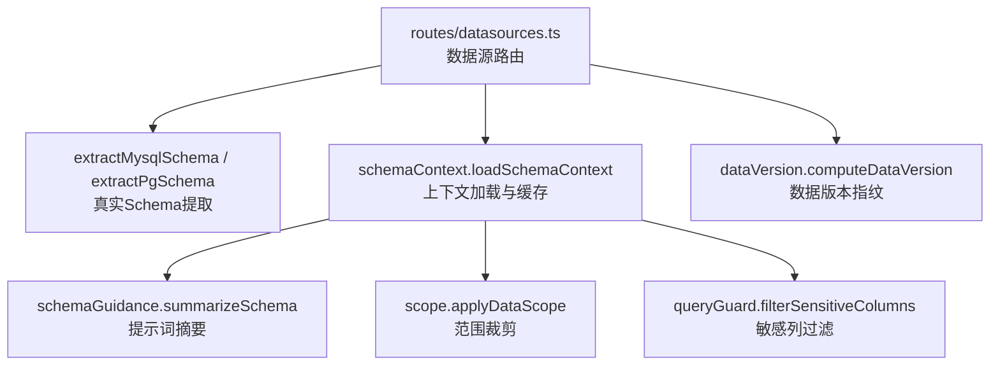
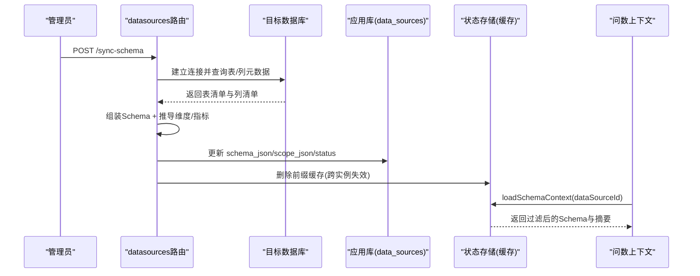
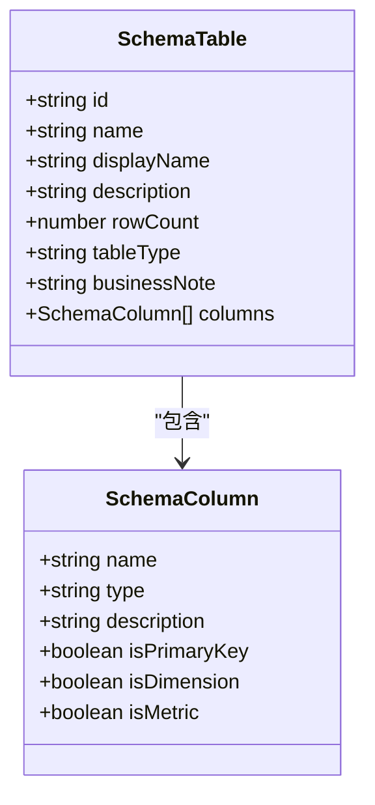
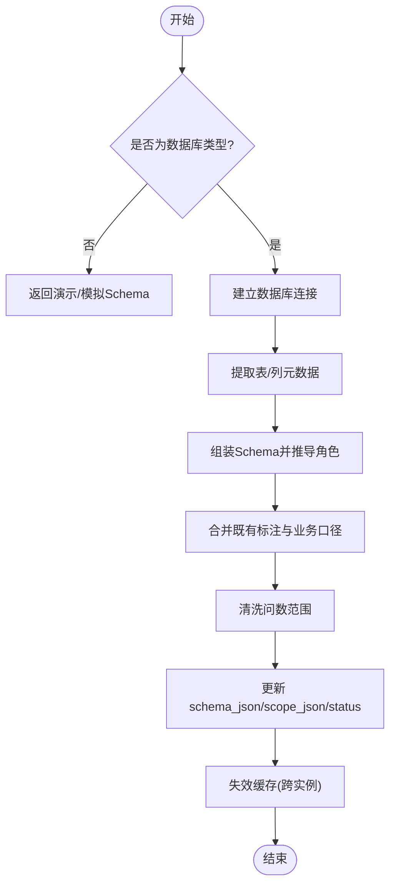
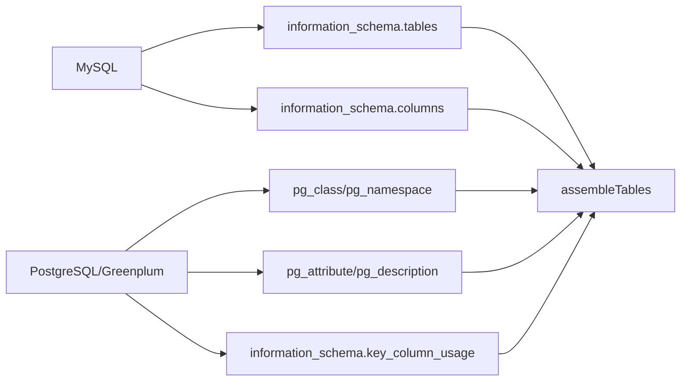
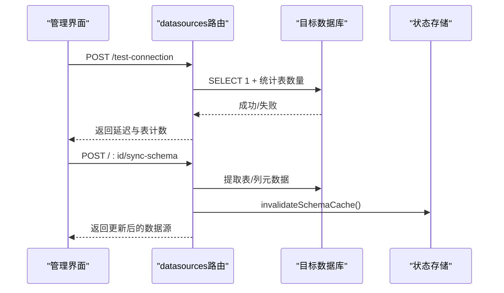
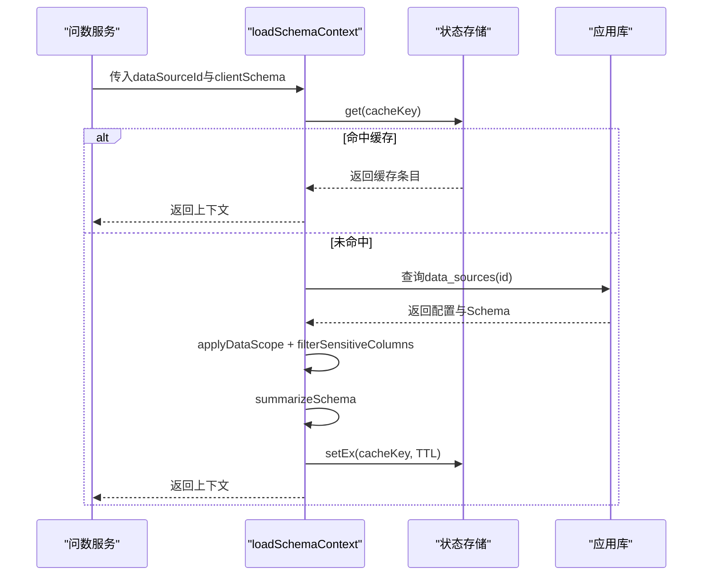
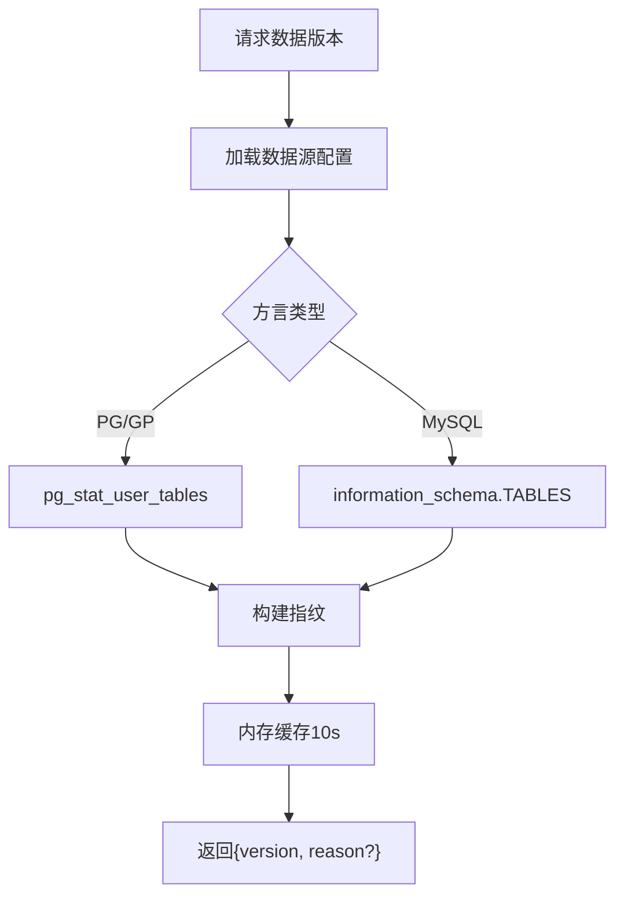
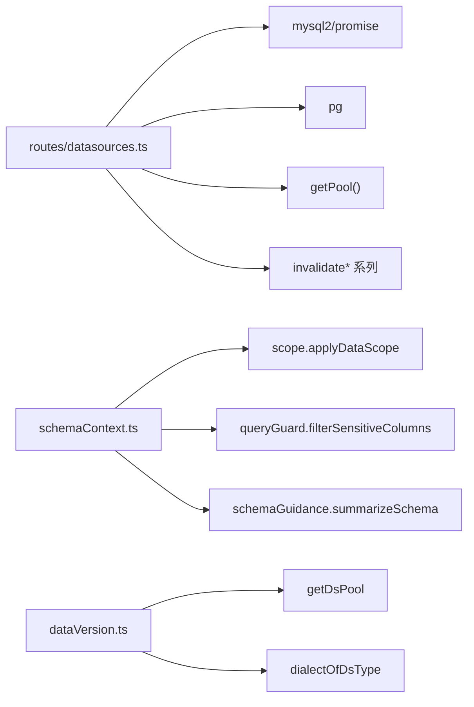

# Schema元数据管理

<cite>
**本文引用的文件**
- [server/query/schemaTypes.ts](file://server/query/schemaTypes.ts)
- [server/query/schemaContext.ts](file://server/query/schemaContext.ts)
- [server/query/schemaGuidance.ts](file://server/query/schemaGuidance.ts)
- [server/routes/datasources.ts](file://server/routes/datasources.ts)
- [server/dataVersion.ts](file://server/dataVersion.ts)
</cite>

## 目录
1. [简介](#简介)
2. [项目结构](#项目结构)
3. [核心组件](#核心组件)
4. [架构总览](#架构总览)
5. [详细组件分析](#详细组件分析)
6. [依赖关系分析](#依赖关系分析)
7. [性能考量](#性能考量)
8. [故障排查指南](#故障排查指南)
9. [结论](#结论)
10. [附录](#附录)

## 简介
本文件面向“Schema元数据管理”能力，系统性说明表结构同步机制（自动提取、增量/手动触发）、Schema数据结构定义（表信息、字段类型、主键约束、注释与业务口径）、不同数据库类型的提取策略（MySQL information_schema、PostgreSQL/Greenplum pg_catalog/information_schema），以及完整的Schema同步流程（连接验证、元数据获取、角色推导、缓存更新）。同时覆盖版本管理与变更检测（数据版本指纹、变更通知、缓存失效策略），帮助读者理解从数据源到AI上下文的端到端链路。

## 项目结构
围绕Schema元数据管理的代码主要分布在以下模块：
- 类型定义：统一Schema列/表结构类型，作为全链路事实源
- 上下文加载：从应用库读取并组装Schema，结合范围、敏感列过滤、摘要生成与缓存
- 路由层：提供数据源创建、连接测试、Schema同步、元数据维护等API
- 数据版本：轻量级数据变化探测与指纹计算，支撑前端轮询与缓存失效

图表来源
- [server/routes/datasources.ts:224-347](file://server/routes/datasources.ts#L224-L347)
- [server/query/schemaContext.ts:108-171](file://server/query/schemaContext.ts#L108-L171)
- [server/query/schemaGuidance.ts:26-36](file://server/query/schemaGuidance.ts#L26-L36)
- [server/dataVersion.ts:56-98](file://server/dataVersion.ts#L56-L98)

章节来源
- [server/routes/datasources.ts:1-120](file://server/routes/datasources.ts#L1-L120)
- [server/query/schemaContext.ts:1-73](file://server/query/schemaContext.ts#L1-L73)
- [server/query/schemaGuidance.ts:1-36](file://server/query/schemaGuidance.ts#L1-L36)
- [server/dataVersion.ts:1-41](file://server/dataVersion.ts#L1-L41)

## 核心组件
- Schema类型规范：集中定义列与表的字段、类型、主键、维度/指标标记、描述与业务口径，保证全链路一致性
- Schema上下文加载：从应用库读取数据源配置与Schema，执行范围与敏感列过滤，生成提示词摘要，写入短期缓存
- 路由与同步：提供创建、测试连接、同步Schema、维护元数据等接口；对数据库型数据源执行真实连接与结构提取
- 数据版本探测：基于information_schema/pg_stat的轻量统计计算指纹，支持前端轮询与缓存失效

章节来源
- [server/query/schemaTypes.ts:8-29](file://server/query/schemaTypes.ts#L8-L29)
- [server/query/schemaContext.ts:18-73](file://server/query/schemaContext.ts#L18-L73)
- [server/routes/datasources.ts:442-656](file://server/routes/datasources.ts#L442-L656)
- [server/dataVersion.ts:10-41](file://server/dataVersion.ts#L10-L41)

## 架构总览
下图展示从请求到Schema落库与上下文使用的完整路径，包括连接验证、元数据提取、角色推导、缓存更新与查询侧使用。

图表来源
- [server/routes/datasources.ts:588-656](file://server/routes/datasources.ts#L588-L656)
- [server/query/schemaContext.ts:108-171](file://server/query/schemaContext.ts#L108-L171)

## 详细组件分析

### Schema数据结构定义
- 表信息：包含唯一标识、名称、显示名、描述、行数、表类型、业务口径等
- 字段信息：包含名称、类型、描述、是否主键、是否维度、是否指标等
- 扩展位：保留索引签名以兼容历史或演示模式额外字段

图表来源
- [server/query/schemaTypes.ts:8-29](file://server/query/schemaTypes.ts#L8-L29)

章节来源
- [server/query/schemaTypes.ts:8-29](file://server/query/schemaTypes.ts#L8-L29)

### 表结构同步机制
- 自动Schema提取：创建数据源时，若类型为MySQL/PostgreSQL/Greenplum，则直接连接目标库并提取表/列结构
- 手动触发同步：通过POST /:id/sync-schema接口重新连接并覆盖schema_json，同时清理相关缓存
- 增量同步策略：同步时保留既有列的标注（isMetric/isDimension/description）与表级业务口径，新列采用自动推导结果；同时清洗问数范围中已删除的表/字段

图表来源
- [server/routes/datasources.ts:442-482](file://server/routes/datasources.ts#L442-L482)
- [server/routes/datasources.ts:588-656](file://server/routes/datasources.ts#L588-L656)

章节来源
- [server/routes/datasources.ts:442-482](file://server/routes/datasources.ts#L442-L482)
- [server/routes/datasources.ts:588-656](file://server/routes/datasources.ts#L588-L656)

### 不同数据库类型的Schema提取策略
- MySQL
  - 表清单：查询information_schema.tables，过滤BASE TABLE，限制数量
  - 列清单：查询information_schema.columns，获取数据类型、主键、注释、长度
  - 类型映射：将MySQL data_type映射为统一type（number/date/category/boolean/string）
  - 角色推导：依据主键、类型、长度等推导维度/指标
- PostgreSQL/Greenplum
  - 表清单：访问pg_class与pg_namespace，按schema过滤对象，区分表/视图/物化视图/外部表
  - 列清单：通过pg_attribute+pg_description获取列信息与注释；主键通过information_schema.key_column_usage判断
  - 类型映射：将PG/GP data_type映射为统一type，处理timestamp/time/numeric等
  - 角色推导：同MySQL，结合主键、类型、长度进行推导

图表来源
- [server/routes/datasources.ts:224-255](file://server/routes/datasources.ts#L224-L255)
- [server/routes/datasources.ts:257-337](file://server/routes/datasources.ts#L257-L337)

章节来源
- [server/routes/datasources.ts:92-135](file://server/routes/datasources.ts#L92-L135)
- [server/routes/datasources.ts:224-347](file://server/routes/datasources.ts#L224-L347)

### Schema同步完整流程（连接验证、元数据获取、角色推导、缓存更新）
- 连接验证：test-connection接口针对MySQL/PG/GP建立连接并执行SELECT 1，同时统计表数量
- 元数据获取：根据类型调用对应提取函数，获取表/列清单
- 角色推导：依据主键、类型、长度等推导维度/指标，保留既有标注
- 缓存更新：同步后调用失效接口删除前缀缓存，确保多实例一致；同时失效执行器池与查询缓存

图表来源
- [server/routes/datasources.ts:880-968](file://server/routes/datasources.ts#L880-L968)
- [server/routes/datasources.ts:588-656](file://server/routes/datasources.ts#L588-L656)
- [server/query/schemaContext.ts:50-55](file://server/query/schemaContext.ts#L50-L55)

章节来源
- [server/routes/datasources.ts:880-968](file://server/routes/datasources.ts#L880-L968)
- [server/query/schemaContext.ts:50-55](file://server/query/schemaContext.ts#L50-L55)

### Schema上下文加载与提示词注入
- 上下文加载：优先从缓存读取，未命中则从应用库读取数据源配置与Schema，执行范围与敏感列过滤，生成摘要并写回缓存
- 提示词摘要：按表输出维度/指标候选，控制长度避免Prompt膨胀
- 降级选择：当缺少维度/指标时，按语义相关性选择替代轴

图表来源
- [server/query/schemaContext.ts:108-171](file://server/query/schemaContext.ts#L108-L171)
- [server/query/schemaGuidance.ts:26-36](file://server/query/schemaGuidance.ts#L26-L36)

章节来源
- [server/query/schemaContext.ts:108-171](file://server/query/schemaContext.ts#L108-L171)
- [server/query/schemaGuidance.ts:26-36](file://server/query/schemaGuidance.ts#L26-L36)

### Schema版本管理与变更检测
- 数据版本指纹：基于information_schema或pg_stat的行数与更新时间（或vacuum/analyze时间）计算稳定哈希，空库返回null
- 缓存策略：内存缓存10秒，防止多端轮询风暴
- 前端联动：看板/报表轮询此端点，检测到version变化时自主重放SQL或重新生成报表

图表来源
- [server/dataVersion.ts:56-98](file://server/dataVersion.ts#L56-L98)

章节来源
- [server/dataVersion.ts:10-41](file://server/dataVersion.ts#L10-L41)
- [server/dataVersion.ts:56-98](file://server/dataVersion.ts#L56-L98)

## 依赖关系分析
- 路由层依赖：
  - 真实Schema提取：mysql2/promise、pg客户端
  - 应用库操作：getPool()
  - 缓存失效：invalidateSchemaCache、invalidateExecutorPool、invalidateQueryCache
  - 安全与权限：auth中间件、ACL校验
- 上下文层依赖：
  - 范围裁剪：applyDataScope
  - 敏感列过滤：filterSensitiveColumns
  - 提示词摘要：summarizeSchema
  - 文件数据源判定：isFileDataSourceType/getFilePhysicalTable
- 数据版本依赖：
  - 连接池：getDsPool(dialect, config)
  - 方言识别：dialectOfDsType

图表来源
- [server/routes/datasources.ts:1-28](file://server/routes/datasources.ts#L1-L28)
- [server/query/schemaContext.ts:8-16](file://server/query/schemaContext.ts#L8-L16)
- [server/dataVersion.ts:6-8](file://server/dataVersion.ts#L6-L8)

章节来源
- [server/routes/datasources.ts:1-28](file://server/routes/datasources.ts#L1-L28)
- [server/query/schemaContext.ts:8-16](file://server/query/schemaContext.ts#L8-L16)
- [server/dataVersion.ts:6-8](file://server/dataVersion.ts#L6-L8)

## 性能考量
- 缓存时效：Schema上下文缓存TTL为5分钟，支持多实例共享（Redis模式下按前缀广播失效）
- 数据版本缓存：内存缓存10秒，降低轮询压力
- 提取限制：表/列提取设置LIMIT，避免大库拖慢
- 连接超时：连接与语句执行设置超时，提升鲁棒性
- 提示词瘦身：序列化Schema为紧凑格式，减少Prompt体积

章节来源
- [server/query/schemaContext.ts:30-31](file://server/query/schemaContext.ts#L30-L31)
- [server/dataVersion.ts:43-44](file://server/dataVersion.ts#L43-L44)
- [server/routes/datasources.ts:235-240](file://server/routes/datasources.ts#L235-L240)
- [server/routes/datasources.ts:267-269](file://server/routes/datasources.ts#L267-L269)
- [server/query/schemaGuidance.ts:84-100](file://server/query/schemaGuidance.ts#L84-L100)

## 故障排查指南
- 连接失败：检查test-connection返回的message与latencyMs，确认主机、端口、用户名、密码与数据库名
- Schema同步失败：查看sync-schema错误信息，确认数据库类型与权限；必要时在请求体补充password
- 缓存不一致：确认invalidateSchemaCache是否被调用；Redis模式下应能跨实例失效
- 数据版本不变：检查MySQL statistics过期设置与PG vacuum/analyze时间；必要时清空版本缓存
- 提示词异常：检查summarizeSchema输入是否为数组且非空；确认列类型与描述是否正确

章节来源
- [server/routes/datasources.ts:880-968](file://server/routes/datasources.ts#L880-L968)
- [server/routes/datasources.ts:588-656](file://server/routes/datasources.ts#L588-L656)
- [server/query/schemaContext.ts:50-55](file://server/query/schemaContext.ts#L50-L55)
- [server/dataVersion.ts:74-83](file://server/dataVersion.ts#L74-L83)
- [server/query/schemaGuidance.ts:26-36](file://server/query/schemaGuidance.ts#L26-L36)

## 结论
本方案通过统一的Schema类型定义、差异化的数据库提取策略、严格的范围与敏感列过滤、短期缓存与跨实例失效机制，实现了高效可靠的Schema元数据管理。配合数据版本指纹与变更通知，系统可在底层数据变化时快速感知并驱动前端刷新，保障AI问数与分析结果的准确性与时效性。

## 附录
- 关键API参考
  - 创建数据源：POST /api/datasources（数据库类型自动提取Schema）
  - 连接测试：POST /api/datasources/test-connection
  - 同步Schema：POST /api/datasources/:id/sync-schema
  - 维护元数据：PUT /api/datasources/:id/schema-meta
  - 数据版本：GET /api/datasources/:id/data-version

章节来源
- [server/routes/datasources.ts:442-482](file://server/routes/datasources.ts#L442-L482)
- [server/routes/datasources.ts:880-968](file://server/routes/datasources.ts#L880-L968)
- [server/routes/datasources.ts:588-656](file://server/routes/datasources.ts#L588-L656)
- [server/routes/datasources.ts:754-818](file://server/routes/datasources.ts#L754-L818)
- [server/routes/datasources.ts:403-417](file://server/routes/datasources.ts#L403-L417)