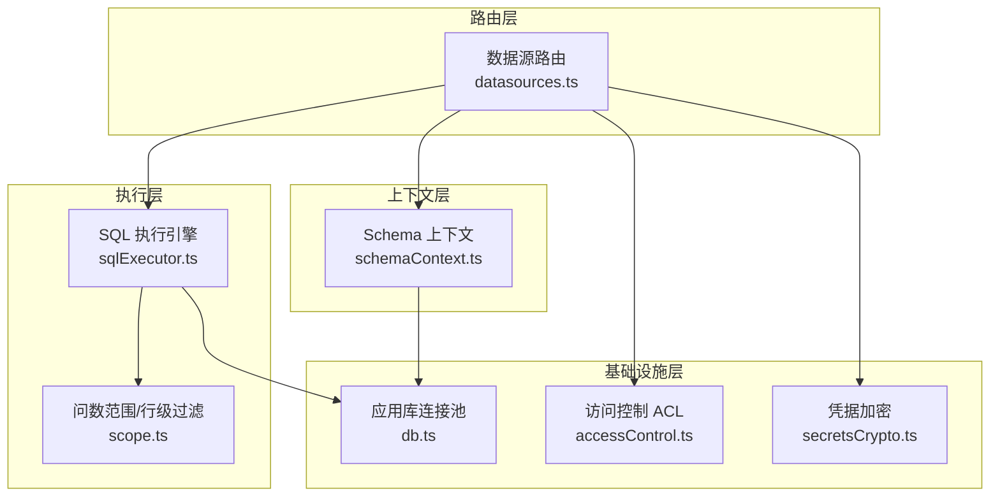
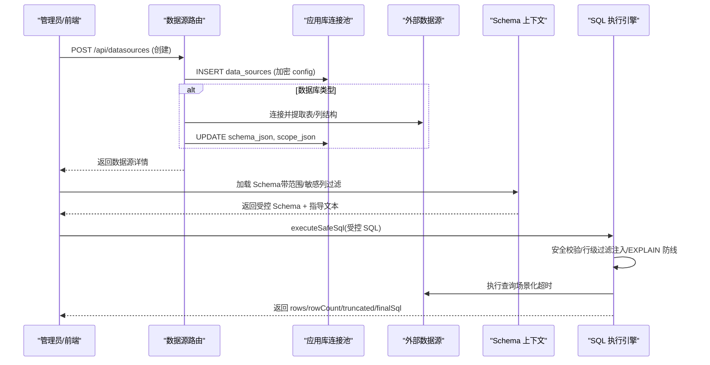
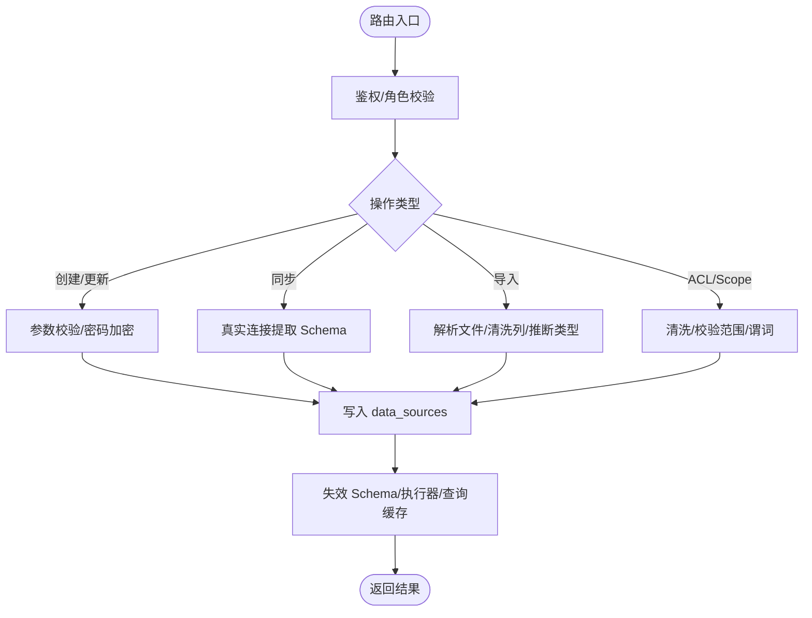
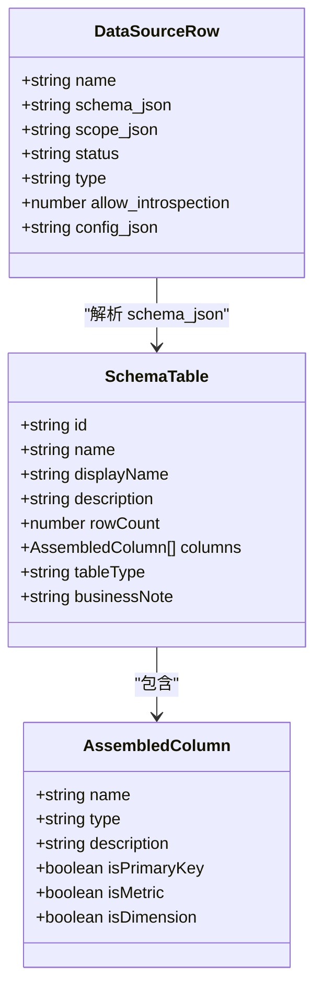
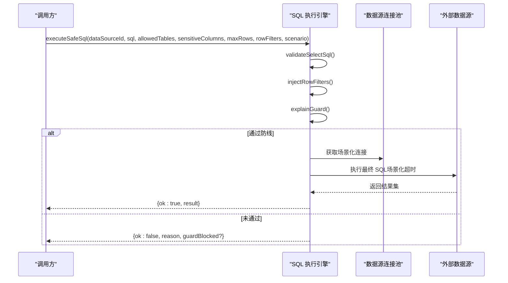
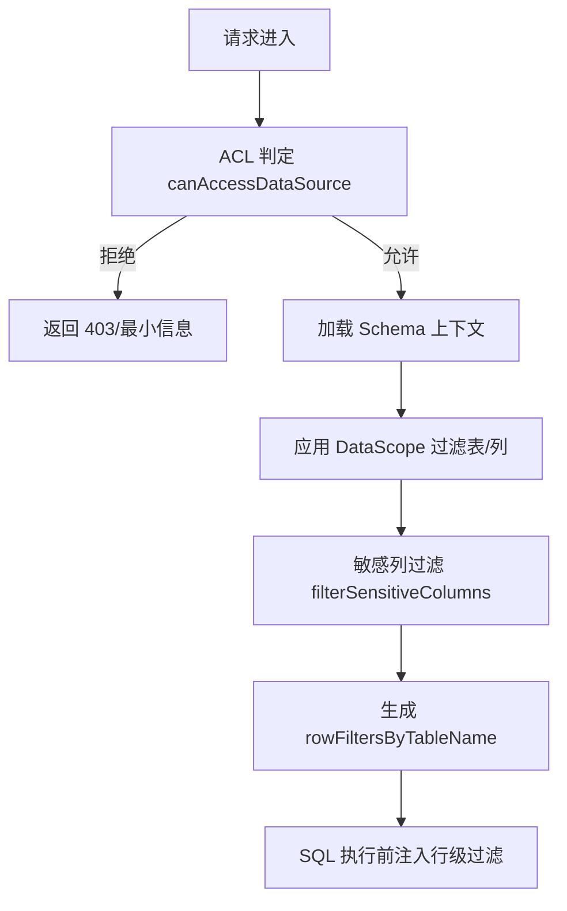
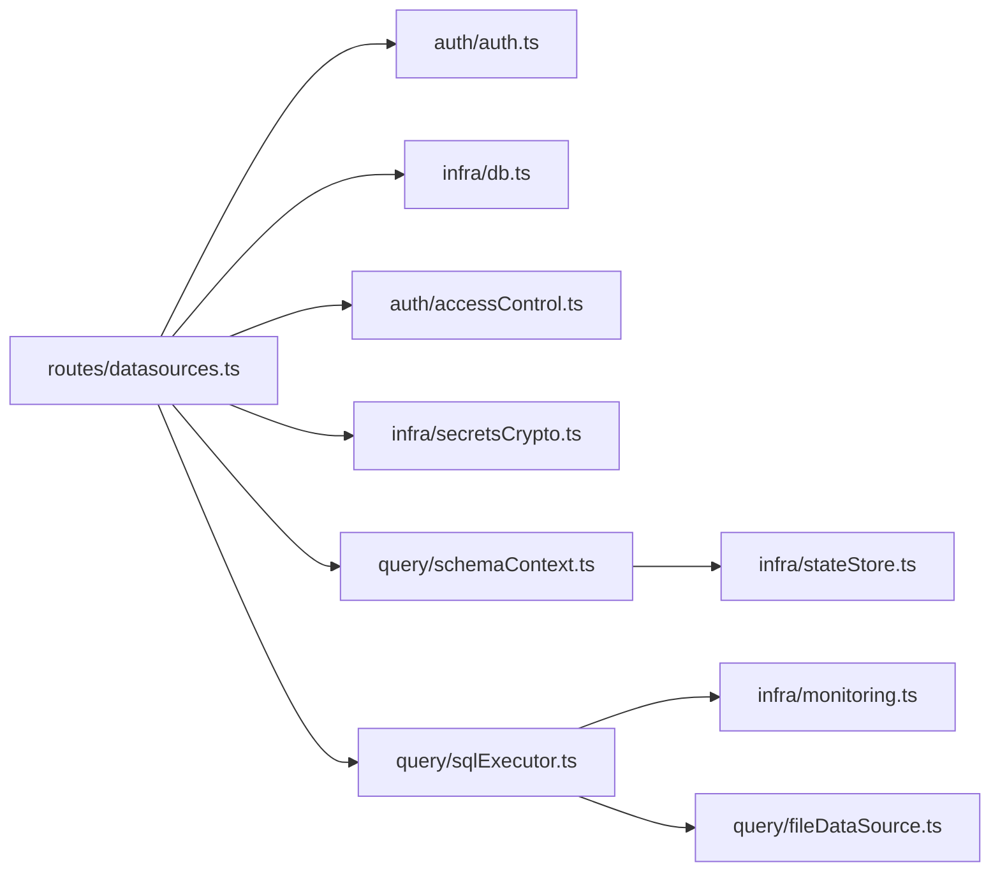

# 数据源API

<cite>
**本文引用的文件**
- [server/routes/datasources.ts](file://server/routes/datasources.ts)
- [server/query/sqlExecutor.ts](file://server/query/sqlExecutor.ts)
- [server/query/schemaContext.ts](file://server/query/schemaContext.ts)
- [server/infra/db.ts](file://server/infra/db.ts)
- [server/auth/accessControl.ts](file://server/auth/accessControl.ts)
- [server/query/scope.ts](file://server/query/scope.ts)
- [server/infra/secretsCrypto.ts](file://server/infra/secretsCrypto.ts)
</cite>

## 目录
1. [简介](#简介)
2. [项目结构](#项目结构)
3. [核心组件](#核心组件)
4. [架构总览](#架构总览)
5. [详细组件分析](#详细组件分析)
6. [依赖关系分析](#依赖关系分析)
7. [性能与容量规划](#性能与容量规划)
8. [故障处理与重试策略](#故障处理与重试策略)
9. [请求与响应示例](#请求与响应示例)
10. [结论](#结论)

## 简介
本文件面向“数据源管理”相关 API，覆盖数据源的增删改查、连接配置与连接池管理；Schema 元数据的获取与管理（表结构同步、字段信息提取）；SQL 执行引擎的调用方式（查询执行、结果返回、性能监控）；以及数据权限控制（行级过滤、列级脱敏）、连接故障处理、超时配置等。文档以代码为依据，提供端到端流程与可视化图示，便于不同技术背景的读者理解和使用。

## 项目结构
数据源能力由路由层、执行层、上下文层、基础设施层共同构成：
- 路由层：对外暴露 REST 接口，负责鉴权、参数校验、落库持久化与缓存失效。
- 执行层：安全校验 SQL、注入行级过滤、EXPLAIN 防线、按场景化超时执行并返回结果。
- 上下文层：加载 Schema 到 LLM 上下文，进行范围过滤、敏感列过滤、摘要生成与缓存。
- 基础设施层：应用库连接池、加密解密、状态存储、日志与监控埋点。

图表来源
- [server/routes/datasources.ts:1-100](file://server/routes/datasources.ts#L1-L100)
- [server/query/sqlExecutor.ts:1-120](file://server/query/sqlExecutor.ts#L1-L120)
- [server/query/schemaContext.ts:1-80](file://server/query/schemaContext.ts#L1-L80)
- [server/infra/db.ts:1-70](file://server/infra/db.ts#L1-L70)
- [server/auth/accessControl.ts:1-60](file://server/auth/accessControl.ts#L1-L60)
- [server/infra/secretsCrypto.ts:1-50](file://server/infra/secretsCrypto.ts#L1-L50)

章节来源
- [server/routes/datasources.ts:1-120](file://server/routes/datasources.ts#L1-L120)
- [server/query/sqlExecutor.ts:1-120](file://server/query/sqlExecutor.ts#L1-L120)
- [server/query/schemaContext.ts:1-80](file://server/query/schemaContext.ts#L1-L80)
- [server/infra/db.ts:1-70](file://server/infra/db.ts#L1-L70)
- [server/auth/accessControl.ts:1-60](file://server/auth/accessControl.ts#L1-L60)
- [server/infra/secretsCrypto.ts:1-50](file://server/infra/secretsCrypto.ts#L1-L50)

## 核心组件
- 数据源路由（CRUD + 同步 + 测试连接 + ACL/Scope 管理）
- SQL 执行引擎（安全校验、行级过滤注入、EXPLAIN 防线、场景化超时、连接池分级）
- Schema 上下文（从数据库拉取 schema、范围过滤、敏感列过滤、摘要、缓存）
- 访问控制（部门/用户维度 ACL）
- 应用库连接池（初始化、建表、默认种子）
- 凭据加密（AES-256-GCM 落库加密）

章节来源
- [server/routes/datasources.ts:364-971](file://server/routes/datasources.ts#L364-L971)
- [server/query/sqlExecutor.ts:24-120](file://server/query/sqlExecutor.ts#L24-L120)
- [server/query/schemaContext.ts:1-80](file://server/query/schemaContext.ts#L1-L80)
- [server/auth/accessControl.ts:1-108](file://server/auth/accessControl.ts#L1-L108)
- [server/infra/db.ts:1-120](file://server/infra/db.ts#L1-L120)
- [server/infra/secretsCrypto.ts:1-50](file://server/infra/secretsCrypto.ts#L1-L50)

## 架构总览
数据源管理的整体交互如下：
- 管理员通过路由创建/更新/删除数据源，或导入文件型数据源。
- 对数据库类型数据源，系统真实连接并提取 Schema，落库 schema_json，同时清理/对齐 scope。
- 问数链路通过 Schema 上下文加载受控 Schema（含行级过滤映射），SQL 执行前经安全校验、行级过滤注入、EXPLAIN 防线评估，再按场景化超时执行。
- 所有写操作会触发 Schema 缓存、执行器连接池、查询结果缓存失效，保证一致性。

图表来源
- [server/routes/datasources.ts:442-482](file://server/routes/datasources.ts#L442-L482)
- [server/routes/datasources.ts:588-656](file://server/routes/datasources.ts#L588-L656)
- [server/query/schemaContext.ts:108-172](file://server/query/schemaContext.ts#L108-L172)
- [server/query/sqlExecutor.ts:734-832](file://server/query/sqlExecutor.ts#L734-L832)

## 详细组件分析

### 数据源路由（CRUD、同步、ACL、Scope、测试连接）
- 列表 GET /api/datasources：对所有登录用户开放；非 ADMIN 仅返回最小信息与 tableCount；无权限时标记 accessDenied。
- 数据版本探测 GET /api/datasources/:id/data-version：轻量探测底层数据变化，服务端缓存 10s。
- 灵活查询 Schema GET /api/datasources/:id/flex-schema：ADMIN/ANALYST 可读取只读 Schema，仍受 ACL 约束。
- 创建 POST /api/datasources：仅 ADMIN；数据库类型将真实连接并提取 Schema；config.password 加密存储。
- 文件导入 POST /api/datasources/import-file：上传 CSV/Excel/JSON，解析后写入应用库物理表 upl_*，登记为数据源。
- 同步 Schema POST /api/datasources/:id/sync-schema：重新连接数据库提取最新结构，保留管理员手工标注，清洗 scope，并失效缓存。
- 更新 PUT /api/datasources/:id：支持 name/type/config/status/allowIntrospection/quickQuestions 等字段更新。
- 删除 DELETE /api/datasources/:id：级联删除文件物理表（失败仅告警）。
- 维护 Schema 元数据 PUT /api/datasources/:id/schema-meta：批量维护列角色与描述、表业务口径说明。
- 访问控制 PUT /api/datasources/:id/acl：设置部门/用户白名单。
- 问数范围 PUT /api/datasources/:id/scope：限制可用表/列/行级过滤谓词。
- 连接测试 POST /api/datasources/test-connection：真实连接 MySQL/PG/Greenplum，返回延迟与表数量。

图表来源
- [server/routes/datasources.ts:364-482](file://server/routes/datasources.ts#L364-L482)
- [server/routes/datasources.ts:484-586](file://server/routes/datasources.ts#L484-L586)
- [server/routes/datasources.ts:588-656](file://server/routes/datasources.ts#L588-L656)
- [server/routes/datasources.ts:658-752](file://server/routes/datasources.ts#L658-L752)
- [server/routes/datasources.ts:754-873](file://server/routes/datasources.ts#L754-L873)
- [server/routes/datasources.ts:880-971](file://server/routes/datasources.ts#L880-L971)

章节来源
- [server/routes/datasources.ts:364-971](file://server/routes/datasources.ts#L364-L971)

### Schema 元数据获取与管理
- 表结构同步：针对 mysql/postgresql/greenplum，分别通过 information_schema/pg_catalog 提取表清单与列清单，自动推导列类型与指标/维度角色，组装为统一 SchemaTable 结构落库。
- 字段信息提取：包含主键、注释、最大长度等信息；短字符串默认维度、数值默认指标、长文本/BLOB 不参与分析。
- 元数据维护：管理员可批量维护列角色、描述与表业务口径说明，同步时保留既有标注。
- 上下文加载：loadSchemaContext 从 data_sources 读取 schema_json，应用 DataScope 过滤与敏感列过滤，生成摘要并缓存 5 分钟；支持 Redis 多实例共享与跨实例失效。

图表来源
- [server/routes/datasources.ts:137-204](file://server/routes/datasources.ts#L137-L204)
- [server/routes/datasources.ts:223-347](file://server/routes/datasources.ts#L223-L347)
- [server/query/schemaContext.ts:18-48](file://server/query/schemaContext.ts#L18-L48)

章节来源
- [server/routes/datasources.ts:137-347](file://server/routes/datasources.ts#L137-L347)
- [server/query/schemaContext.ts:108-172](file://server/query/schemaContext.ts#L108-L172)

### SQL 执行引擎（查询执行、结果返回、性能监控）
- 安全校验：仅允许 SELECT（含 WITH CTE），单语句，拒绝危险关键字，表名白名单校验，AST 二道防线复核。
- 行级过滤注入：基于 AST 递归包裹 FROM 子句，确保 CTE/子查询/UNION 内受控表均被强制注入谓词。
- EXPLAIN 防线：执行前预估扫描行数，超过阈值拦截（MySQL/PG 兼容解析），失败则 fail-open 放行。
- 场景化超时与连接池：interactive/chain/export 三类场景独立配额与超时；MySQL 注入 MAX_EXECUTION_TIME hint，PG 使用 statement_timeout。
- 结果返回：rows、rowCount、truncated、finalSql、astFallback；文件数据源走应用库执行，跳过 EXPLAIN 防线。
- 监控埋点：executeSafeSql 包装计时与成败 label；EXPLAIN 守卫统计 blocked/passed/error。

图表来源
- [server/query/sqlExecutor.ts:291-387](file://server/query/sqlExecutor.ts#L291-L387)
- [server/query/sqlExecutor.ts:396-489](file://server/query/sqlExecutor.ts#L396-L489)
- [server/query/sqlExecutor.ts:531-662](file://server/query/sqlExecutor.ts#L531-L662)
- [server/query/sqlExecutor.ts:686-726](file://server/query/sqlExecutor.ts#L686-L726)
- [server/query/sqlExecutor.ts:734-832](file://server/query/sqlExecutor.ts#L734-L832)

章节来源
- [server/query/sqlExecutor.ts:24-120](file://server/query/sqlExecutor.ts#L24-L120)
- [server/query/sqlExecutor.ts:291-832](file://server/query/sqlExecutor.ts#L291-L832)

### 数据权限控制（行级过滤、列级脱敏、ACL）
- 列级脱敏：Schema 上下文加载时对敏感列进行过滤，返回受控 Schema 与 removed 列名清单。
- 行级过滤：DataScope.rowFilters 定义 WHERE 片段，执行层通过 AST 强制注入，防止越权读取。
- 访问控制 ACL：data_sources.acl_json 指定 departments/userIds；非 ADMIN 若无权限则列表接口剥离 tables 并标记 accessDenied；flex-schema 等需显式检查。

图表来源
- [server/auth/accessControl.ts:43-73](file://server/auth/accessControl.ts#L43-L73)
- [server/query/schemaContext.ts:108-172](file://server/query/schemaContext.ts#L108-L172)
- [server/query/scope.ts:28-101](file://server/query/scope.ts#L28-L101)
- [server/query/sqlExecutor.ts:396-489](file://server/query/sqlExecutor.ts#L396-L489)

章节来源
- [server/auth/accessControl.ts:1-108](file://server/auth/accessControl.ts#L1-L108)
- [server/query/scope.ts:1-101](file://server/query/scope.ts#L1-L101)
- [server/query/schemaContext.ts:108-172](file://server/query/schemaContext.ts#L108-L172)
- [server/query/sqlExecutor.ts:396-489](file://server/query/sqlExecutor.ts#L396-L489)

### 连接池管理与超时配置
- 应用库连接池：initSchema 创建 pool，connectionLimit=appPoolMax()，默认按 EXPECTED_CONCURRENT_USERS 推导，上限 50。
- 数据源连接池：按 dataSourceId+scenario 分级缓存；pool 大小 dsPoolScenarioMax()，超时 scenarioTimeoutMs()。
- 场景化超时：interactive 默认 15s，chain 120s，export 60s；可通过环境变量覆盖。
- MySQL 双保险：驱动 query timeout + MAX_EXECUTION_TIME hint；PG 使用 statement_timeout。
- 失效机制：配置/结构变更后调用 invalidateExecutorPool 关闭旧池并重建。

章节来源
- [server/infra/db.ts:35-70](file://server/infra/db.ts#L35-L70)
- [server/query/sqlExecutor.ts:44-109](file://server/query/sqlExecutor.ts#L44-L109)
- [server/query/sqlExecutor.ts:686-726](file://server/query/sqlExecutor.ts#L686-L726)
- [server/query/sqlExecutor.ts:118-153](file://server/query/sqlExecutor.ts#L118-L153)

### 凭据加密与安全
- 密码加密：encryptConfigPassword 幂等加密 password 字段，落库格式 enc:v1:...；连接前 decryptSecret 解密。
- 密钥来源：优先 DS_SECRET_KEY，其次 JWT_SECRET；生产环境缺失将 fail-fast。
- 迁移兼容：明文存量原样返回，服务启动时可就地加密。

章节来源
- [server/infra/secretsCrypto.ts:1-50](file://server/infra/secretsCrypto.ts#L1-L50)
- [server/routes/datasources.ts:442-482](file://server/routes/datasources.ts#L442-L482)

## 依赖关系分析
- 路由层依赖：authMiddleware、requireRole、getPool、invalidateSchemaCache、invalidateExecutorPool、decryptSecret、parseAcl/sanitizeAcl、sanitizeDataScope。
- 执行层依赖：mysql2/pg 驱动、node-sql-parser、monitoring 埋点、secretsCrypto、fileDataSource。
- 上下文层依赖：stateStore（Redis/内存）、scope、queryGuard、fileDataSource。
- 基础设施层：db 提供应用库连接池与建表；accessControl 提供 ACL 判定；secretsCrypto 提供凭据加解密。

图表来源
- [server/routes/datasources.ts:1-30](file://server/routes/datasources.ts#L1-L30)
- [server/query/sqlExecutor.ts:11-22](file://server/query/sqlExecutor.ts#L11-L22)
- [server/query/schemaContext.ts:8-16](file://server/query/schemaContext.ts#L8-L16)

章节来源
- [server/routes/datasources.ts:1-30](file://server/routes/datasources.ts#L1-L30)
- [server/query/sqlExecutor.ts:11-22](file://server/query/sqlExecutor.ts#L11-L22)
- [server/query/schemaContext.ts:8-16](file://server/query/schemaContext.ts#L8-L16)

## 性能与容量规划
- 应用库连接池：默认 connectionLimit=appPoolMax()，按 EXPECTED_CONCURRENT_USERS 推导，上限 50。
- 数据源连接池：dsPoolMax() 默认按用户并发/4 推导，上限 20；场景化配额 chain/export 进一步细分。
- 执行超时：interactive 15s、chain 120s、export 60s；可通过环境变量覆盖。
- EXPLAIN 防线：默认 100 万行阈值，export 放宽 10 倍；失败 fail-open 不阻断正常查询。
- 结果截断：MAX_ROWS=100000，避免 OOM；文件数据源同样截断。
- 缓存：Schema 上下文缓存 5 分钟；数据版本探测缓存 10 秒；查询结果缓存 TTL 延长至 30 分钟，写操作后失效。

章节来源
- [server/infra/db.ts:35-70](file://server/infra/db.ts#L35-L70)
- [server/query/sqlExecutor.ts:44-109](file://server/query/sqlExecutor.ts#L44-L109)
- [server/query/sqlExecutor.ts:531-662](file://server/query/sqlExecutor.ts#L531-L662)
- [server/query/schemaContext.ts:30-55](file://server/query/schemaContext.ts#L30-L55)

## 故障处理与重试策略
- 连接失败：test-connection 返回 success=false 与错误消息；创建/同步失败返回具体原因。
- 执行失败：executeSafeSql 捕获异常并返回 reason；EXPLAIN 失败 fail-open 放行但记录告警。
- 超时：MySQL 注入 MAX_EXECUTION_TIME hint，PG 使用 statement_timeout；驱动层也设置 connect/query timeout。
- 缓存失效：配置/结构/范围变更后调用 invalidateSchemaCache/invalidateExecutorPool/invalidateQueryCache 保证一致性。
- 审计与监控：executeSafeSql 包装埋点；EXPLAIN 守卫统计 blocked/passed/error；路由层记录错误日志。

章节来源
- [server/routes/datasources.ts:880-971](file://server/routes/datasources.ts#L880-L971)
- [server/query/sqlExecutor.ts:734-832](file://server/query/sqlExecutor.ts#L734-L832)
- [server/query/sqlExecutor.ts:629-662](file://server/query/sqlExecutor.ts#L629-L662)
- [server/routes/datasources.ts:642-656](file://server/routes/datasources.ts#L642-L656)

## 请求与响应示例
以下为典型场景的请求与响应结构说明（字段含义来自实现逻辑）：

- 创建数据源（数据库类型）
  - 方法：POST /api/datasources
  - 请求体要点：name、type（mysql/postgresql/greenplum）、config（host/port/username/password/database/schema）
  - 响应要点：success、id、dataSource（含 tables、status、lastSyncedAt 等）
  - 参考路径：[server/routes/datasources.ts:442-482](file://server/routes/datasources.ts#L442-L482)

- 同步 Schema
  - 方法：POST /api/datasources/:id/sync-schema
  - 请求体要点：可选 password（历史数据源补充）
  - 响应要点：success、dataSource（tables 已更新，scope 已清洗）
  - 参考路径：[server/routes/datasources.ts:588-656](file://server/routes/datasources.ts#L588-L656)

- 导入文件数据源
  - 方法：POST /api/datasources/import-file
  - 请求体要点：fileType（csv/xlsx/json）、fileName、fileBase64
  - 响应要点：success、id、dataSource、stats（rows/columns/droppedSensitive/truncated）
  - 参考路径：[server/routes/datasources.ts:484-586](file://server/routes/datasources.ts#L484-L586)

- 测试连接
  - 方法：POST /api/datasources/test-connection
  - 请求体要点：type、config
  - 响应要点：success、message、latencyMs、tableCount
  - 参考路径：[server/routes/datasources.ts:880-971](file://server/routes/datasources.ts#L880-L971)

- 灵活查询 Schema
  - 方法：GET /api/datasources/:id/flex-schema
  - 响应要点：success、tables（受 ACL 与状态约束）
  - 参考路径：[server/routes/datasources.ts:419-440](file://server/routes/datasources.ts#L419-L440)

- 执行 SQL（通过执行引擎）
  - 调用：executeSafeSql(dataSourceId, rawSql, allowedTables, sensitiveColumns, maxRows, rowFilters, scenario)
  - 响应：{ ok: true, result: { rows, rowCount, truncated, finalSql, astFallback } } 或 { ok: false, reason, guardBlocked? }
  - 参考路径：[server/query/sqlExecutor.ts:734-832](file://server/query/sqlExecutor.ts#L734-L832)

- 维护 Schema 元数据
  - 方法：PUT /api/datasources/:id/schema-meta
  - 请求体要点：tables[{ id, businessNote?, columns:[{ name, isMetric?, isDimension?, description? }] }]
  - 响应要点：success、touched、dataSource
  - 参考路径：[server/routes/datasources.ts:754-818](file://server/routes/datasources.ts#L754-L818)

- 设置访问控制
  - 方法：PUT /api/datasources/:id/acl
  - 请求体要点：departments[], userIds[]
  - 响应要点：success、dataSource
  - 参考路径：[server/routes/datasources.ts:821-840](file://server/routes/datasources.ts#L821-L840)

- 设置问数范围
  - 方法：PUT /api/datasources/:id/scope
  - 请求体要点：scope（tables、columns、rowFilters）
  - 响应要点：success、dataSource
  - 参考路径：[server/routes/datasources.ts:842-873](file://server/routes/datasources.ts#L842-L873)

章节来源
- [server/routes/datasources.ts:419-873](file://server/routes/datasources.ts#L419-L873)
- [server/query/sqlExecutor.ts:734-832](file://server/query/sqlExecutor.ts#L734-L832)

## 结论
该数据源 API 提供了完整的数据源生命周期管理能力，结合严格的 SQL 安全校验、行级过滤、列级脱敏与 EXPLAIN 防线，确保在复杂企业环境下安全、可控地执行查询。连接池与超时按场景化配置，兼顾交互体验与资源保护；Schema 上下文与缓存机制提升性能与一致性。建议在生产环境中合理配置环境变量（如 EXPECTED_CONCURRENT_USERS、DS_POOL_MAX、QUERY_TIMEOUT_*、SQL_EXPLAIN_MAX_ROWS），并结合监控与审计持续优化。