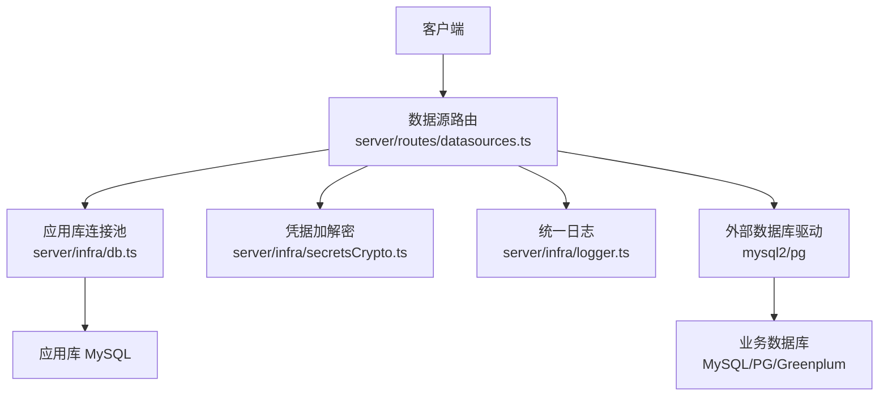
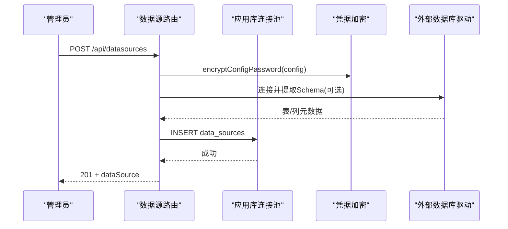
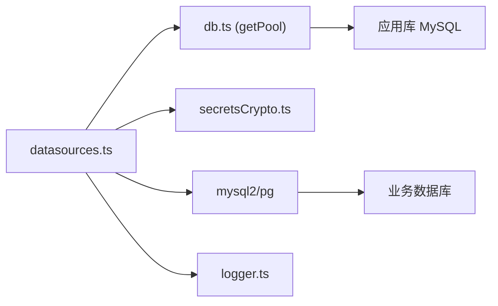

# 数据源配置管理

<cite>
**本文引用的文件**
- [server/routes/datasources.ts](file://server/routes/datasources.ts)
- [server/infra/secretsCrypto.ts](file://server/infra/secretsCrypto.ts)
- [server/infra/db.ts](file://server/infra/db.ts)
- [server/seedDataResources.ts](file://server/seedDataResources.ts)
- [server/infra/logger.ts](file://server/infra/logger.ts)
</cite>

## 目录
1. [简介](#简介)
2. [项目结构](#项目结构)
3. [核心组件](#核心组件)
4. [架构总览](#架构总览)
5. [详细组件分析](#详细组件分析)
6. [依赖关系分析](#依赖关系分析)
7. [性能与连接池](#性能与连接池)
8. [故障恢复与重试策略](#故障恢复与重试策略)
9. [请求与响应示例](#请求与响应示例)
10. [安全与审计](#安全与审计)
11. [常见问题排查](#常见问题排查)
12. [结论](#结论)

## 简介
本文件面向“数据源配置管理”的完整实现，覆盖以下能力：
- 数据源的增删改查（CRUD）
- 支持的数据库类型及配置项（MySQL、PostgreSQL、Greenplum；以及 csv/json/api/excel/demo 等）
- 连接参数校验与连接测试
- 密码加密存储（AES-256-GCM）
- Schema 自动提取与同步（表/列元数据、角色推导）
- 连接池管理与超时控制
- 访问控制与范围限制（ACL、Scope）
- 安全处理（敏感信息加密、权限控制、审计日志）

## 项目结构
数据源管理由路由层、持久化层与安全工具组成：
- 路由层：提供 REST API，负责鉴权、参数校验、调用底层能力并返回结果
- 持久化层：应用库（MySQL）连接池、建库建表、种子数据
- 安全工具：凭据加密/解密、统一日志输出

图表来源
- [server/routes/datasources.ts:1-100](file://server/routes/datasources.ts#L1-L100)
- [server/infra/db.ts:45-70](file://server/infra/db.ts#L45-L70)
- [server/infra/secretsCrypto.ts:1-50](file://server/infra/secretsCrypto.ts#L1-L50)
- [server/infra/logger.ts:1-41](file://server/infra/logger.ts#L1-L41)

章节来源
- [server/routes/datasources.ts:1-120](file://server/routes/datasources.ts#L1-L120)
- [server/infra/db.ts:1-80](file://server/infra/db.ts#L1-L80)
- [server/infra/secretsCrypto.ts:1-50](file://server/infra/secretsCrypto.ts#L1-L50)
- [server/infra/logger.ts:1-41](file://server/infra/logger.ts#L1-L41)

## 核心组件
- 数据源路由：提供数据源列表、创建、更新、删除、Schema 同步、ACL/Scope 设置、连接测试等接口
- 应用库连接池：基于 mysql2/promise 的连接池，负责系统元数据（用户、数据源、审计等）的读写
- 凭据加密：使用 AES-256-GCM 对数据源密码进行落库加密，支持明文存量兼容
- 日志：统一日志封装，按级别输出，便于问题定位

章节来源
- [server/routes/datasources.ts:30-120](file://server/routes/datasources.ts#L30-L120)
- [server/infra/db.ts:45-70](file://server/infra/db.ts#L45-L70)
- [server/infra/secretsCrypto.ts:1-50](file://server/infra/secretsCrypto.ts#L1-L50)
- [server/infra/logger.ts:1-41](file://server/infra/logger.ts#L1-L41)

## 架构总览
数据源管理的整体流程如下：
- 管理员通过前端或调用方发起数据源操作（创建/更新/删除/同步/测试）
- 路由层进行鉴权与参数校验
- 对于数据库类型（MySQL/PostgreSQL/Greenplum），执行真实连接探测与 Schema 提取
- 配置中的密码在落库前加密，读取时按需解密
- 变更触发缓存失效（Schema、执行器、查询缓存）
- 所有关键路径记录日志，便于追踪

图表来源
- [server/routes/datasources.ts:442-482](file://server/routes/datasources.ts#L442-L482)
- [server/infra/secretsCrypto.ts:27-49](file://server/infra/secretsCrypto.ts#L27-L49)
- [server/infra/db.ts:104-117](file://server/infra/db.ts#L104-L117)

## 详细组件分析

### 数据源路由（CRUD 与 Schema 同步）
- 列表：GET /api/datasources
  - 对所有登录用户开放；非管理员仅返回最小信息，tables 剥离并附带 tableCount
  - 受 ACL 约束，无权限时标记 accessDenied
- 创建：POST /api/datasources
  - 仅 ADMIN；支持 mysql/postgresql/greenplum 真实连接并提取 Schema；其他类型模拟
  - 配置中 password 加密后落库
- 更新：PUT /api/datasources/:id
  - 仅 ADMIN；可更新 name/type/config/status/allowIntrospection/quickQuestions 等
  - config 中 password 加密后落库
- 删除：DELETE /api/datasources/:id
  - 仅 ADMIN；级联清理导入文件的物理表（如存在）
- Schema 同步：POST /api/datasources/:id/sync-schema
  - 仅 ADMIN；重新连接数据库提取最新表结构，保留管理员手工标注（指标/维度/描述）
  - 清洗问数范围（剔除已删除的表/字段）
- 元数据维护：PUT /api/datasources/:id/schema-meta
  - 仅 ADMIN；维护列的指标/维度角色与描述，以及表级业务口径说明
- 访问控制：PUT /api/datasources/:id/acl
  - 仅 ADMIN；设置部门/用户白名单
- 问数范围：PUT /api/datasources/:id/scope
  - 仅 ADMIN；限定允许纳入智能问数的表与字段

章节来源
- [server/routes/datasources.ts:364-401](file://server/routes/datasources.ts#L364-L401)
- [server/routes/datasources.ts:442-482](file://server/routes/datasources.ts#L442-L482)
- [server/routes/datasources.ts:588-656](file://server/routes/datasources.ts#L588-L656)
- [server/routes/datasources.ts:658-727](file://server/routes/datasources.ts#L658-L727)
- [server/routes/datasources.ts:729-752](file://server/routes/datasources.ts#L729-L752)
- [server/routes/datasources.ts:754-819](file://server/routes/datasources.ts#L754-L819)
- [server/routes/datasources.ts:821-873](file://server/routes/datasources.ts#L821-L873)

### 数据库类型与配置选项
- 支持类型
  - 数据库类：mysql、postgresql、greenplum（真实连接与 Schema 提取）
  - 文件/演示类：csv、json、api、demo、excel（模拟或本地解析）
- 配置项（config_json）
  - host：主机地址
  - port：端口号
  - username：用户名
  - password：密码（加密存储）
  - database：数据库名
  - schema：PostgreSQL/Greenplum 的 Schema（默认 public）
- 类型判断与分派
  - isDbType(type)：是否为数据库类型
  - extractDbSchema(type, config)：根据类型选择 MySQL 或 PG/GP 的提取逻辑

章节来源
- [server/routes/datasources.ts:64-69](file://server/routes/datasources.ts#L64-L69)
- [server/routes/datasources.ts:223-255](file://server/routes/datasources.ts#L223-L255)
- [server/routes/datasources.ts:257-347](file://server/routes/datasources.ts#L257-L347)

### 连接参数验证与连接测试
- 参数校验
  - 名称必填且长度限制
  - type 必须在允许列表中
  - status 必须为 connected/disconnected/error
  - quickQuestions 必须为字符串数组或 null
- 连接测试
  - POST /api/datasources/test-connection
  - 对 mysql/postgresql/greenplum 执行真实连接探测，统计表数量并返回延迟
  - 对其他类型返回模拟响应

章节来源
- [server/routes/datasources.ts:442-482](file://server/routes/datasources.ts#L442-L482)
- [server/routes/datasources.ts:658-727](file://server/routes/datasources.ts#L658-L727)
- [server/routes/datasources.ts:875-968](file://server/routes/datasources.ts#L875-L968)

### Schema 提取与角色推导
- MySQL
  - 通过 information_schema.tables/columns 获取表清单与列信息
  - 映射数据类型到前端类型（number/date/category/boolean/string）
- PostgreSQL/Greenplum
  - 通过 pg_catalog/information_schema 获取表/列元数据
  - 兼容视图、物化视图、外部表
  - 主键检测走 information_schema，避免部分版本差异
- 角色推导
  - 主键与 id 形态的数字外键不参与分析
  - 数值列为指标；日期/枚举/布尔为维度
  - 短文本（≤64字符）为维度；长文本/JSON/BLOB 不参与分析

章节来源
- [server/routes/datasources.ts:92-135](file://server/routes/datasources.ts#L92-L135)
- [server/routes/datasources.ts:223-347](file://server/routes/datasources.ts#L223-L347)

### 文件数据源导入
- 支持 csv/xlsx/json 上传，服务端解析并写入应用库物理表（upl_*）
- 自动推断列类型、剔除敏感列、截断超限数据
- 登记为可真实问数/报表的数据源，不再走演示模式

章节来源
- [server/routes/datasources.ts:484-586](file://server/routes/datasources.ts#L484-L586)

## 依赖关系分析
- 路由依赖
  - 应用库连接池（getPool）用于读写 data_sources 等元数据
  - 凭据加密（encryptConfigPassword/decryptSecret）用于密码安全
  - 外部数据库驱动（mysql2/pg）用于真实连接与 Schema 提取
  - 统一日志（logger）用于错误与调试输出
- 持久化层
  - 初始化数据库与表结构，包含 data_sources、审计、知识库、任务队列等
  - 连接池容量公式化，支持环境变量配置

图表来源
- [server/routes/datasources.ts:1-30](file://server/routes/datasources.ts#L1-L30)
- [server/infra/db.ts:45-70](file://server/infra/db.ts#L45-L70)
- [server/infra/secretsCrypto.ts:1-50](file://server/infra/secretsCrypto.ts#L1-L50)
- [server/infra/logger.ts:1-41](file://server/infra/logger.ts#L1-L41)

章节来源
- [server/routes/datasources.ts:1-30](file://server/routes/datasources.ts#L1-L30)
- [server/infra/db.ts:45-70](file://server/infra/db.ts#L45-L70)

## 性能与连接池
- 应用库连接池
  - 容量公式：APP_POOL_MAX 优先；否则按 EXPECTED_CONCURRENT_USERS 推导，clamp 到 [10, 50]
  - 连接池参数：waitForConnections=true、charset=utf8mb4
- 外部数据库连接
  - MySQL：connectTimeout=5000ms
  - PostgreSQL/Greenplum：connectionTimeoutMillis=5000ms、statement_timeout=15000ms（提取）、10000ms（测试）
- 缓存失效
  - 变更 Schema/配置/范围后，主动失效 Schema 缓存、执行器池、查询缓存，保证一致性

章节来源
- [server/infra/db.ts:29-43](file://server/infra/db.ts#L29-L43)
- [server/infra/db.ts:64-70](file://server/infra/db.ts#L64-L70)
- [server/routes/datasources.ts:223-270](file://server/routes/datasources.ts#L223-L270)
- [server/routes/datasources.ts:642-650](file://server/routes/datasources.ts#L642-L650)
- [server/routes/datasources.ts:718-722](file://server/routes/datasources.ts#L718-L722)

## 故障恢复与重试策略
- 连接失败
  - 测试连接端点捕获异常并返回 success=false 与错误消息
  - 创建/同步 Schema 失败时返回明确错误提示
- 资源清理
  - 导入文件登记失败时级联删除物理表，避免孤儿表
  - 删除数据源时异步清理物理表，失败仅告警不阻断
- 幂等与健壮性
  - 建库建表语句幂等（IF NOT EXISTS）
  - 迁移脚本捕获重复字段错误，继续执行

章节来源
- [server/routes/datasources.ts:484-586](file://server/routes/datasources.ts#L484-L586)
- [server/routes/datasources.ts:729-752](file://server/routes/datasources.ts#L729-L752)
- [server/routes/datasources.ts:875-968](file://server/routes/datasources.ts#L875-L968)
- [server/infra/db.ts:52-70](file://server/infra/db.ts#L52-L70)

## 请求与响应示例
以下为典型场景的请求与响应结构（以文字描述为主，具体字段见源码注释）：

- 创建数据源（POST /api/datasources）
  - 请求体：{ name, type, config }
  - 响应：201 { success, id, dataSource }
  - 说明：数据库类型会真实连接并提取 Schema；password 加密存储

- 更新数据源（PUT /api/datasources/:id）
  - 请求体：{ name, type, config, status, allowIntrospection, quickQuestions }
  - 响应：200 { success }
  - 说明：config.password 加密存储；变更触发缓存失效

- 删除数据源（DELETE /api/datasources/:id）
  - 响应：200 { success }
  - 说明：级联清理导入文件的物理表（如存在）

- 同步 Schema（POST /api/datasources/:id/sync-schema）
  - 请求体：{ password? }（历史数据源可补充密码）
  - 响应：200 { success, dataSource }
  - 说明：保留管理员手工标注；清洗 Scope

- 测试连接（POST /api/datasources/test-connection）
  - 请求体：{ type, config }
  - 响应：200 { success, message, latencyMs, tableCount }
  - 说明：数据库类型真实探测；其他类型模拟

- 设置 ACL（PUT /api/datasources/:id/acl）
  - 请求体：{ departments?, userIds? }
  - 响应：200 { success, dataSource }

- 设置 Scope（PUT /api/datasources/:id/scope）
  - 请求体：{ scope }（null 表示不限制）
  - 响应：200 { success, dataSource }

章节来源
- [server/routes/datasources.ts:442-482](file://server/routes/datasources.ts#L442-L482)
- [server/routes/datasources.ts:588-656](file://server/routes/datasources.ts#L588-L656)
- [server/routes/datasources.ts:658-727](file://server/routes/datasources.ts#L658-L727)
- [server/routes/datasources.ts:729-752](file://server/routes/datasources.ts#L729-L752)
- [server/routes/datasources.ts:821-873](file://server/routes/datasources.ts#L821-L873)
- [server/routes/datasources.ts:875-968](file://server/routes/datasources.ts#L875-L968)

## 安全与审计
- 敏感信息加密
  - 密码使用 AES-256-GCM 加密存储，密文格式含 iv、authTag、cipher
  - 支持明文存量兼容（未加密值原样返回）
  - 密钥来源：DS_SECRET_KEY 优先，其次 JWT_SECRET；生产环境缺失将 fail-fast
- 权限控制
  - 列表接口对非管理员剥离 tables 详情，仅返回 tableCount
  - 无权限时标记 accessDenied，供前端展示申请入口
  - ACL 支持部门与用户白名单，空对象/空数组表示解除限制
- 审计日志
  - 统一日志出口（logger）记录错误与关键步骤
  - 应用库包含 query_audit_log、query_trace 等表，支撑全链路审计与回放

章节来源
- [server/infra/secretsCrypto.ts:1-50](file://server/infra/secretsCrypto.ts#L1-L50)
- [server/routes/datasources.ts:364-401](file://server/routes/datasources.ts#L364-L401)
- [server/routes/datasources.ts:821-873](file://server/routes/datasources.ts#L821-L873)
- [server/infra/db.ts:181-234](file://server/infra/db.ts#L181-L234)
- [server/infra/logger.ts:1-41](file://server/infra/logger.ts#L1-L41)

## 常见问题排查
- 连接失败
  - 检查 host/port/username/password/database/schema 是否正确
  - 查看测试连接返回的错误消息与延迟
- Schema 同步失败
  - 确认数据库权限与网络连通
  - 检查 PostgreSQL/Greenplum 的 schema 是否存在且可读
- 导入文件失败
  - 确认文件格式与大小限制
  - 检查敏感列是否全部被剔除导致无可用列
- 权限不足
  - 确认当前用户角色（ADMIN/ANALYST/VIEWER）
  - 检查 ACL 是否限制了访问

章节来源
- [server/routes/datasources.ts:875-968](file://server/routes/datasources.ts#L875-L968)
- [server/routes/datasources.ts:484-586](file://server/routes/datasources.ts#L484-L586)
- [server/routes/datasources.ts:364-401](file://server/routes/datasources.ts#L364-L401)

## 结论
该数据源配置管理系统提供了完整的 CRUD、Schema 同步、连接测试、权限控制与安全加密能力。通过连接池与超时控制保障稳定性，通过缓存失效确保一致性，通过审计日志与权限控制满足企业级安全需求。建议在生产环境中：
- 配置 DS_SECRET_KEY 并妥善保管
- 合理设置 APP_POOL_MAX 与 EXPECTED_CONCURRENT_USERS
- 定期同步 Schema 并维护 ACL/Scope
- 关注日志与审计表，及时发现问题