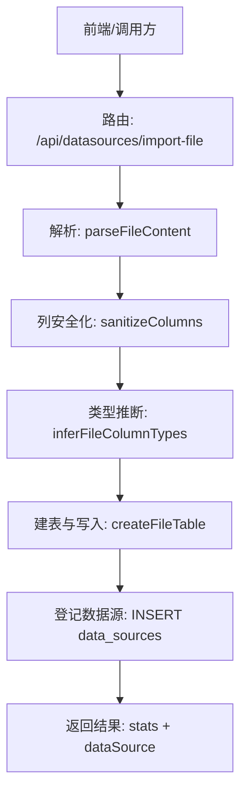
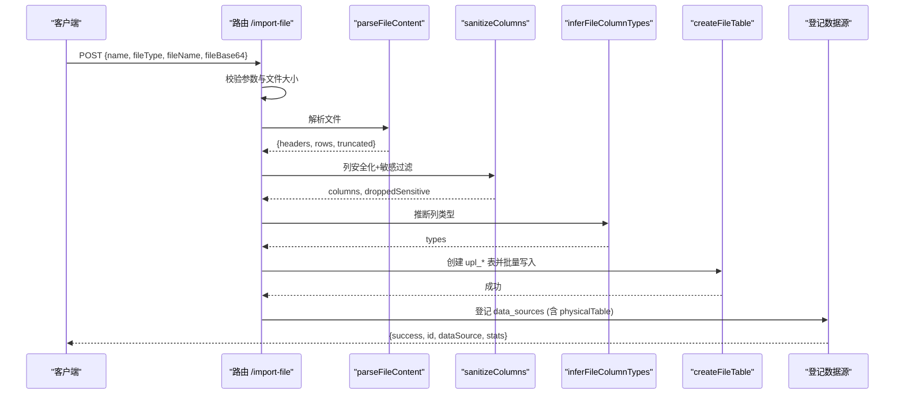
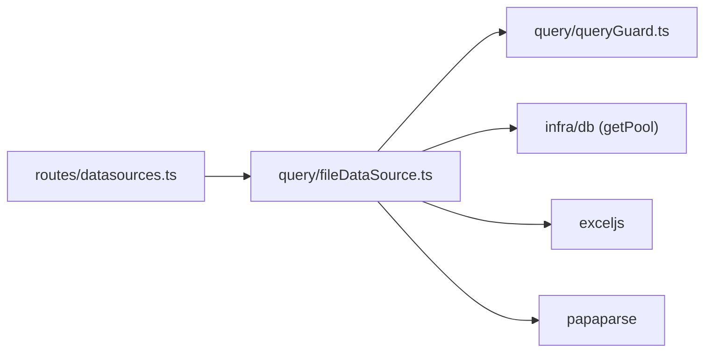

# 文件数据源

<cite>
**本文引用的文件**
- [server/query/fileDataSource.ts](file://server/query/fileDataSource.ts)
- [server/routes/datasources.ts](file://server/routes/datasources.ts)
- [server/query/queryGuard.ts](file://server/query/queryGuard.ts)
- [server/query/fileDataSource.test.ts](file://server/query/fileDataSource.test.ts)
</cite>

## 目录
1. [简介](#简介)
2. [项目结构](#项目结构)
3. [核心组件](#核心组件)
4. [架构总览](#架构总览)
5. [详细组件分析](#详细组件分析)
6. [依赖关系分析](#依赖关系分析)
7. [性能与内存优化](#性能与内存优化)
8. [故障排查指南](#故障排查指南)
9. [结论](#结论)
10. [附录：导入示例与最佳实践](#附录导入示例与最佳实践)

## 简介
本文件数据源功能支持上传 CSV、Excel（xlsx）、JSON 三类文件，服务端解析真实数据后落库为应用库中的物理表（upl_* 前缀），并登记为可被“问数/报表”链路直接查询的真实数据源。该能力包含：
- 文件格式校验与内容解析
- 列名安全化与敏感信息过滤
- 类型推断与 Schema 生成
- 物理表创建与批量参数化写入
- 数据源登记、删除级联清理
- 大小限制、截断策略与错误反馈

## 项目结构
围绕文件数据源的核心代码主要分布在以下位置：
- 解析与落库逻辑：server/query/fileDataSource.ts
- 路由与端点：server/routes/datasources.ts（含 /import-file）
- 敏感列规则：server/query/queryGuard.ts
- 单测用例：server/query/fileDataSource.test.ts

图表来源
- [server/routes/datasources.ts:484-586](file://server/routes/datasources.ts#L484-L586)
- [server/query/fileDataSource.ts:138-201](file://server/query/fileDataSource.ts#L138-L201)

章节来源
- [server/query/fileDataSource.ts:1-208](file://server/query/fileDataSource.ts#L1-L208)
- [server/routes/datasources.ts:484-586](file://server/routes/datasources.ts#L484-L586)

## 核心组件
- 文件解析器：统一将 CSV/Excel/JSON 转换为行列结构，并进行行/列上限截断与 truncated 标记
- 列安全化：将非法/保留字/冲突的列名转为安全标识符，同时剔除命中敏感词列
- 类型推断：基于样本统计推断列类型为 DOUBLE 或 TEXT
- 物理表管理：以 upl_ 前缀白名单创建/删除物理表，参数化批量写入
- 路由端点：接收 base64 文件，执行完整流程并返回统计信息

章节来源
- [server/query/fileDataSource.ts:20-27](file://server/query/fileDataSource.ts#L20-L27)
- [server/query/fileDataSource.ts:78-109](file://server/query/fileDataSource.ts#L78-L109)
- [server/query/fileDataSource.ts:138-201](file://server/query/fileDataSource.ts#L138-L201)
- [server/routes/datasources.ts:484-586](file://server/routes/datasources.ts#L484-L586)

## 架构总览
文件数据源从上传到可用，经历如下阶段：
- 输入校验：检查 fileType、fileName、fileBase64；校验文件大小
- 解析：按类型解析为 headers + rows，并做行列上限截断
- 清洗：列名安全化，剔除敏感列；按 sourceIndex 投影对齐行数据
- 推断：对每列进行类型推断（DOUBLE/TEXT）
- 落库：创建 upl_* 物理表，分批参数化插入
- 登记：在 data_sources 中登记 schema_json、config_json（含 physicalTable）
- 响应：返回成功状态、dataSource 与 stats（rows/columns/droppedSensitive/truncated）

图表来源
- [server/routes/datasources.ts:484-586](file://server/routes/datasources.ts#L484-L586)
- [server/query/fileDataSource.ts:138-201](file://server/query/fileDataSource.ts#L138-L201)

## 详细组件分析

### 文件解析与截断
- 支持的格式与行为
  - CSV：自动识别分隔符，跳过空行，去除 BOM，首行为表头
  - Excel：读取首个工作表，单元格值规整（日期转字符串、超链接取文本、公式取计算结果）
  - JSON：支持对象数组（键并集作为表头）或二维数组（首行为表头）
- 截断策略
  - 行数上限：MAX_FILE_ROWS（默认 20000）
  - 列数上限：MAX_FILE_COLS（默认 100）
  - 超出时仅截断并设置 truncated=true，不报错
- 异常处理
  - 无数据行、无法解析、类型不一致等抛出明确错误

章节来源
- [server/query/fileDataSource.ts:138-181](file://server/query/fileDataSource.ts#L138-L181)
- [server/query/fileDataSource.test.ts:142-234](file://server/query/fileDataSource.test.ts#L142-L234)

### 列名安全化与敏感信息过滤
- 安全化规则
  - 合法标识符且非保留字直接使用
  - 中文/非法字符/冲突 → f{序号}，冲突追加 _x 后缀
  - 空表头 → “列N”，再按非法字符规则改名
  - 记录原始表头至 description，便于提示注入与展示
- 敏感列过滤
  - 使用共享正则 SENSITIVE_COLUMN_PATTERN（密码、密钥、令牌、身份证等）
  - 命中列整体剔除，不落库、不进 Schema
  - 返回 droppedSensitive 供前端提示
- 行数据投影
  - 通过 sourceIndex 将原始行按保留列下标重新投影，保证与列一一对应

章节来源
- [server/query/fileDataSource.ts:78-99](file://server/query/fileDataSource.ts#L78-L99)
- [server/query/queryGuard.ts:71-100](file://server/query/queryGuard.ts#L71-L100)
- [server/query/fileDataSource.test.ts:63-115](file://server/query/fileDataSource.test.ts#L63-L115)

### 类型推断
- 策略
  - 采样前 100 行，按列统计数值占比 ≥60% 则推断为 DOUBLE，否则 TEXT
  - 空值不计入分母；number 类型同样识别
- 用途
  - 决定物理表列类型与后续 toCellValue 转换
  - 影响前端展示的字段类型（number/string）

章节来源
- [server/query/fileDataSource.ts:101-109](file://server/query/fileDataSource.ts#L101-L109)
- [server/query/fileDataSource.test.ts:117-140](file://server/query/fileDataSource.test.ts#L117-L140)

### 物理表创建与批量写入
- 表名白名单
  - 仅允许 upl_[a-z0-9_] 形式，防止任意表操作
- 建表语句
  - DROP 同名残留 → CREATE TABLE（列类型来自推断）
- 写入策略
  - 参数化批量插入，批次大小 INSERT_BATCH=500
  - 值规整：toCellValue 根据目标类型转换（如 DOUBLE 非数值→null）
- 删除策略
  - dropFileTable 仅允许 upl_* 前缀，防误删

章节来源
- [server/query/fileDataSource.ts:183-207](file://server/query/fileDataSource.ts#L183-L207)
- [server/query/fileDataSource.test.ts:236-287](file://server/query/fileDataSource.test.ts#L236-L287)

### 路由端点与数据源登记
- 端点：POST /api/datasources/import-file（仅 ADMIN）
- 请求体：name?, fileType: csv/xlsx/json, fileName, fileBase64
- 流程
  - 校验参数与文件大小（MAX_FILE_BYTES）
  - 解析、安全化、推断、建表写入
  - 登记 data_sources：schema_json（表/列元数据）、config_json（含 fileName/fileSize/fileType/physicalTable）
  - 失败回滚：若登记失败，尝试级联删除已创建的物理表
- 响应
  - success、id、dataSource、stats（rows、columns、droppedSensitive、truncated）

章节来源
- [server/routes/datasources.ts:484-586](file://server/routes/datasources.ts#L484-L586)

### 生命周期管理与清理
- 创建
  - 每次导入生成唯一物理表 upl_{id}，避免撞表
- 更新
  - 文件数据源为静态快照，需重新导入以更新
- 删除
  - 删除数据源时，读取 config 中的 physicalTable 并异步级联 DROP（失败仅告警）
- 存储
  - 物理表位于应用库；Schema 与配置存储在 data_sources

章节来源
- [server/routes/datasources.ts:729-752](file://server/routes/datasources.ts#L729-L752)
- [server/query/fileDataSource.ts:51-58](file://server/query/fileDataSource.ts#L51-L58)

## 依赖关系分析
- 模块耦合
  - routes/datasources.ts 依赖 fileDataSource.ts 的解析、安全化、推断、建表函数
  - fileDataSource.ts 依赖 queryGuard.ts 的敏感列规则
  - 所有数据库操作通过 getPool() 连接池
- 外部依赖
  - exceljs：解析 xlsx
  - papaparse：解析 csv
  - mysql2/promise：数据库连接与执行

图表来源
- [server/routes/datasources.ts:18-27](file://server/routes/datasources.ts#L18-L27)
- [server/query/fileDataSource.ts:14-18](file://server/query/fileDataSource.ts#L14-L18)

章节来源
- [server/routes/datasources.ts:18-27](file://server/routes/datasources.ts#L18-L27)
- [server/query/fileDataSource.ts:14-18](file://server/query/fileDataSource.ts#L14-L18)

## 性能与内存优化
- 文件大小限制
  - MAX_FILE_BYTES：默认约 7MB（与 server.ts 10mb JSON 通道匹配）
- 行列上限
  - MAX_FILE_ROWS：20000 行
  - MAX_FILE_COLS：100 列
  - 超限即截断并标注 truncated，避免内存膨胀
- 批量写入
  - INSERT_BATCH=500，降低单次 SQL 体积与锁竞争
- 类型转换
  - 仅在写入时进行 toCellValue 转换，减少中间对象开销
- 建议
  - 大文件建议拆分或精简后再导入
  - 关注 truncated 标志，必要时调整业务侧阈值

章节来源
- [server/query/fileDataSource.ts:21-27](file://server/query/fileDataSource.ts#L21-L27)
- [server/query/fileDataSource.ts:126-136](file://server/query/fileDataSource.ts#L126-L136)
- [server/query/fileDataSource.ts:196-200](file://server/query/fileDataSource.ts#L196-L200)
- [server/routes/datasources.ts:501-503](file://server/routes/datasources.ts#L501-L503)

## 故障排查指南
- 常见错误与原因
  - 文件为空或无法解析：检查 fileType 与 Base64 内容是否正确
  - 没有可导入的列：全部列命中敏感词或被截断为空
  - 只有表头没有数据行：确保至少有一行数据
  - 数据写入失败：检查数据库权限与连接
  - 登记失败：系统会尝试回滚物理表，查看日志定位
- 诊断要点
  - 关注响应中的 stats.droppedSensitive 与 truncated
  - 检查物理表是否创建成功（upl_* 前缀）
  - 查看服务端日志中的错误堆栈

章节来源
- [server/routes/datasources.ts:488-586](file://server/routes/datasources.ts#L488-L586)
- [server/query/fileDataSource.test.ts:154-178](file://server/query/fileDataSource.test.ts#L154-L178)

## 结论
文件数据源提供了从上传到可用的端到端能力，覆盖多格式解析、安全化、类型推断、批量写入与生命周期管理。通过严格的白名单、大小与行列限制、敏感列过滤与参数化写入，系统在安全性与稳定性方面具备良好保障。对于大规模数据，建议结合分批导入与监控指标持续优化。

## 附录：导入示例与最佳实践

### 支持的格式
- CSV：首行表头，自动识别分隔符，跳过空行
- Excel（xlsx）：读取首个工作表，单元格值规整
- JSON：对象数组或二维数组（首行为表头）

### 单文件导入
- 接口：POST /api/datasources/import-file
- 请求体字段：
  - name：可选，数据源名称
  - fileType：csv | xlsx | json
  - fileName：文件名
  - fileBase64：文件内容的 Base64 编码
- 响应字段：
  - success：布尔
  - id：数据源 ID
  - dataSource：数据源详情（含 tables/schema）
  - stats：
    - rows：导入行数
    - columns：有效列数
    - droppedSensitive：被剔除的敏感列名列表
    - truncated：是否发生截断

### 批量处理
- 当前实现为单文件一次导入
- 如需批量，可在调用方循环调用同一接口，注意控制并发与重试策略

### 错误处理
- 参数校验失败：返回具体错误消息（缺少字段、类型无效等）
- 解析失败：返回“文件解析失败”及原因
- 无有效列：返回“没有可导入的列”
- 无数据行：返回“只有表头没有数据行”
- 写入/登记失败：返回“数据写入应用库失败”或“数据源登记失败”，并尝试回滚

### 大小与性能
- 文件大小上限：约 7MB（BASE64 净荷经 10MB JSON 通道）
- 行数上限：20000 行
- 列数上限：100 列
- 超过限制将被截断并在 stats.truncated 中标注

### 生命周期管理
- 创建：生成 upl_* 物理表，登记 data_sources
- 更新：重新导入以刷新数据（静态快照）
- 删除：删除数据源时级联 DROP 对应物理表（仅 upl_* 白名单）

章节来源
- [server/routes/datasources.ts:484-586](file://server/routes/datasources.ts#L484-L586)
- [server/query/fileDataSource.ts:21-27](file://server/query/fileDataSource.ts#L21-L27)
- [server/query/fileDataSource.ts:126-136](file://server/query/fileDataSource.ts#L126-L136)
- [server/query/fileDataSource.ts:183-207](file://server/query/fileDataSource.ts#L183-L207)