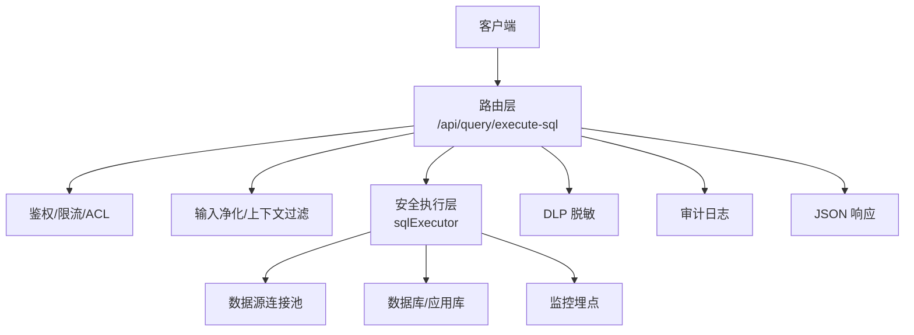
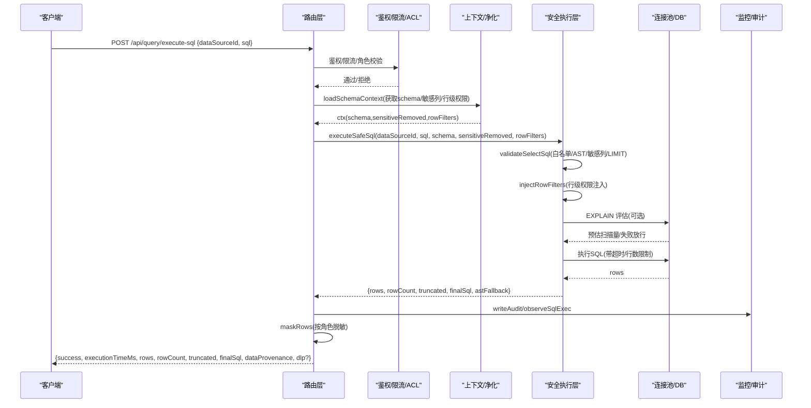
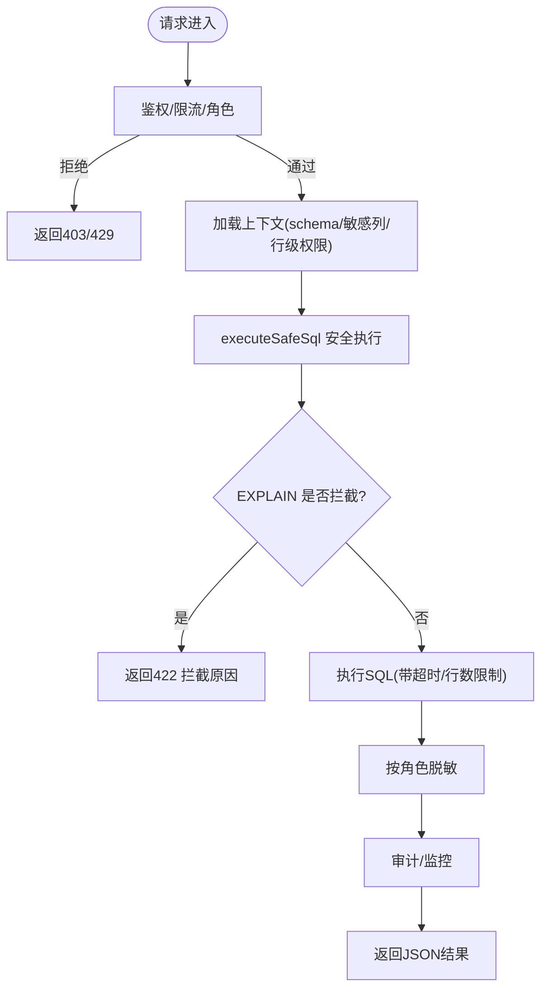
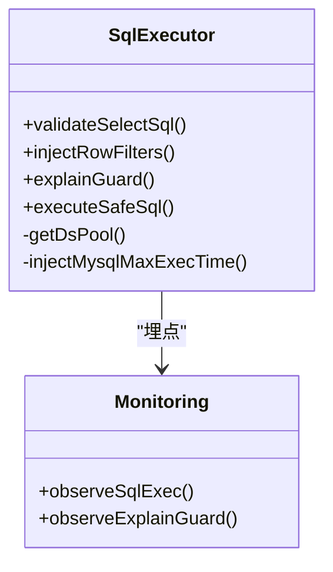
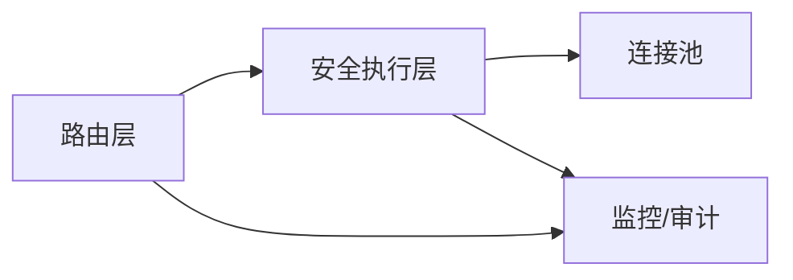

# SQL执行接口

<cite>
**本文引用的文件**
- [server/routes/query.ts](file://server/routes/query.ts)
- [server/query/sqlExecutor.ts](file://server/query/sqlExecutor.ts)
- [server/query/queryGuard.ts](file://server/query/queryGuard.ts)
- [server/infra/monitoring.ts](file://server/infra/monitoring.ts)
- [server/query/dlp.test.ts](file://server/query/dlp.test.ts)
</cite>

## 目录
1. [简介](#简介)
2. [项目结构](#项目结构)
3. [核心组件](#核心组件)
4. [架构总览](#架构总览)
5. [详细组件分析](#详细组件分析)
6. [依赖关系分析](#依赖关系分析)
7. [性能考量](#性能考量)
8. [故障排查指南](#故障排查指南)
9. [结论](#结论)
10. [附录](#附录)

## 简介
本文件面向 POST /api/query/execute-sql 端点，提供端到端的接口文档与实现说明。该端点用于“SQL 重跑”，在严格的安全约束下对真实数据源执行只读查询，并返回行数据、元数据、性能指标与脱敏信息。它同时与智能问数链路共享安全执行层、权限控制、审计与监控能力。

## 项目结构
- 路由层：负责鉴权、限流、入参校验、访问控制、审计与响应组装。
- 安全执行层：负责 SQL 白名单校验、AST 复核、敏感列拒绝、行级权限注入、EXPLAIN 防线、连接池与超时控制、结果截断等。
- 输入净化与上下文过滤：负责提示注入防护、历史清洗、敏感列剔除。
- 监控与审计：统一埋点与审计落库，支撑慢查询治理与性能优化。
- DLP 脱敏：按角色对结果进行字段级脱敏，避免敏感信息泄露。

**图表来源**
- [server/routes/query.ts:558-625](file://server/routes/query.ts#L558-L625)
- [server/query/sqlExecutor.ts:734-832](file://server/query/sqlExecutor.ts#L734-L832)
- [server/infra/monitoring.ts:63-78](file://server/infra/monitoring.ts#L63-L78)

**章节来源**
- [server/routes/query.ts:558-625](file://server/routes/query.ts#L558-L625)
- [server/query/sqlExecutor.ts:734-832](file://server/query/sqlExecutor.ts#L734-L832)

## 核心组件
- 路由端点：POST /api/query/execute-sql
  - 鉴权与限流：authMiddleware + rateLimiter + requireRole('ADMIN','ANALYST')
  - 访问控制：checkDataSourceAccess（数据源 ACL）
  - 参数校验：dataSourceId 与 sql 必填；SQL 长度限制
  - 上下文加载：loadSchemaContext（获取 schema、敏感列、行级权限）
  - 执行调用：executeSafeSql（SELECT-only、白名单、AST 复核、行级权限注入、EXPLAIN 防线、超时与行数限制）
  - 审计与监控：writeAudit、observeSqlExec
  - 结果脱敏：maskRows（按角色脱敏）
  - 响应体：success、executionTimeMs、rows、rowCount、truncated、finalSql、dataProvenance、可选 dlp 标记

- 安全执行层：sqlExecutor
  - validateSelectSql：仅允许 SELECT（含 WITH CTE），单语句，关键字黑名单，表名白名单，敏感列拒绝，强制 LIMIT
  - injectRowFilters：AST 注入行级权限谓词
  - explainGuard：EXPLAIN 预估扫描量拦截
  - 连接池：按数据源+场景分级缓存，场景化超时与容量
  - 执行：MySQL/PG/Greenplum 驱动执行，MAX_EXECUTION_TIME hint，结果截断

- 输入净化与上下文过滤：queryGuard
  - sanitizeQuestion/sanitizeHistory：控制字符过滤、注入特征拒绝、长度限制
  - filterSensitiveColumns：从 Schema 中剔除疑似敏感列

- 监控与审计：monitoring
  - executeSafeSql 耗时直方图、EXPLAIN 防线计数、HTTP 请求耗时等

- DLP 脱敏：dlp.test（行为验证）
  - maskRows/maskQueryPayload：按角色脱敏，记录 maskedColumns/maskedLabels

**章节来源**
- [server/routes/query.ts:558-625](file://server/routes/query.ts#L558-L625)
- [server/query/sqlExecutor.ts:291-387](file://server/query/sqlExecutor.ts#L291-L387)
- [server/query/sqlExecutor.ts:396-489](file://server/query/sqlExecutor.ts#L396-L489)
- [server/query/sqlExecutor.ts:629-662](file://server/query/sqlExecutor.ts#L629-L662)
- [server/query/sqlExecutor.ts:734-832](file://server/query/sqlExecutor.ts#L734-L832)
- [server/query/queryGuard.ts:38-69](file://server/query/queryGuard.ts#L38-L69)
- [server/query/queryGuard.ts:72-100](file://server/query/queryGuard.ts#L72-L100)
- [server/infra/monitoring.ts:63-78](file://server/infra/monitoring.ts#L63-L78)
- [server/query/dlp.test.ts:18-165](file://server/query/dlp.test.ts#L18-L165)

## 架构总览
下图展示一次 SQL 执行的完整流程：从请求进入路由到最终返回 JSON 的时序。

**图表来源**
- [server/routes/query.ts:558-625](file://server/routes/query.ts#L558-L625)
- [server/query/sqlExecutor.ts:734-832](file://server/query/sqlExecutor.ts#L734-L832)
- [server/infra/monitoring.ts:63-78](file://server/infra/monitoring.ts#L63-L78)

## 详细组件分析

### 端点：POST /api/query/execute-sql
- 功能
  - 以当前用户身份对指定数据源执行一条只读 SQL，返回结果集与执行元信息。
- 安全机制
  - 路由层：鉴权、限流、角色白名单、数据源 ACL。
  - 执行层：SELECT-only、关键字黑名单、表名白名单、AST 复核、敏感列拒绝、行级权限注入、EXPLAIN 防线、强制 LIMIT、超时保护。
- 权限验证
  - 需要 ADMIN 或 ANALYST 角色；必须拥有目标数据源的访问权限。
- 结果返回
  - 成功时返回 success=true，包含 executionTimeMs、rows、rowCount、truncated、finalSql、dataProvenance=live，以及可选 dlp 标记（被脱敏的列与标签）。
  - 失败时返回错误码与原因（如不支持的数据源类型、SQL 被拒绝、执行异常等）。

**图表来源**
- [server/routes/query.ts:558-625](file://server/routes/query.ts#L558-L625)
- [server/query/sqlExecutor.ts:629-662](file://server/query/sqlExecutor.ts#L629-L662)
- [server/query/sqlExecutor.ts:734-832](file://server/query/sqlExecutor.ts#L734-L832)

**章节来源**
- [server/routes/query.ts:558-625](file://server/routes/query.ts#L558-L625)

### 安全执行层：sqlExecutor
- 只读限制与注入防护
  - 仅允许 SELECT（含 WITH CTE），单语句；关键字黑名单拦截危险操作；字符串与注释剥离后做结构校验。
  - AST 二道防线：node-sql-parser 语法树复核语句类型与表引用；WITH 开头要求 AST 解析成功。
- 表名白名单与敏感列过滤
  - 仅允许访问已授权表；若 SQL 引用了范围外表则拒绝。
  - 敏感列（如密码、密钥、身份证等）整词匹配拒绝。
- 行级权限注入
  - 基于 AST 将受控表包裹为子查询并注入 WHERE 谓词，递归覆盖子查询/UNION/CTE 定义内的真实表引用。
- EXPLAIN 防线
  - 执行前估算扫描行数，超过阈值拦截（MySQL 与 PG 兼容解析）；EXPLAIN 失败 fail-open 放行但不影响安全主路径。
- 超时与行数限制
  - MySQL 注入 MAX_EXECUTION_TIME hint；PG 使用 statement_timeout；统一按场景设置超时。
  - 结果强制 LIMIT，默认最大行数可配置，超出时 truncated=true。
- 连接池与场景分级
  - 按 dataSourceId+场景（interactive/chain/export）分级缓存连接池，独立配额与超时，避免大任务挤占交互。

**图表来源**
- [server/query/sqlExecutor.ts:291-387](file://server/query/sqlExecutor.ts#L291-L387)
- [server/query/sqlExecutor.ts:396-489](file://server/query/sqlExecutor.ts#L396-L489)
- [server/query/sqlExecutor.ts:629-662](file://server/query/sqlExecutor.ts#L629-L662)
- [server/query/sqlExecutor.ts:734-832](file://server/query/sqlExecutor.ts#L734-L832)
- [server/infra/monitoring.ts:63-78](file://server/infra/monitoring.ts#L63-L78)

**章节来源**
- [server/query/sqlExecutor.ts:291-387](file://server/query/sqlExecutor.ts#L291-L387)
- [server/query/sqlExecutor.ts:396-489](file://server/query/sqlExecutor.ts#L396-L489)
- [server/query/sqlExecutor.ts:629-662](file://server/query/sqlExecutor.ts#L629-L662)
- [server/query/sqlExecutor.ts:734-832](file://server/query/sqlExecutor.ts#L734-L832)

### 输入净化与上下文过滤：queryGuard
- L1 输入净化：控制字符过滤、注入特征拒绝、长度截断。
- L4 历史净化：丢弃 assistant 输出，user 消息过注入检测，最多保留最近若干轮。
- L3 敏感列过滤：从 Schema 中剔除疑似敏感列，返回 removed 清单供 UI 标注与审计。

**章节来源**
- [server/query/queryGuard.ts:38-69](file://server/query/queryGuard.ts#L38-L69)
- [server/query/queryGuard.ts:72-100](file://server/query/queryGuard.ts#L72-L100)

### 监控与审计：monitoring
- SQL 执行耗时直方图、EXPLAIN 防线计数、HTTP 请求耗时等指标。
- 审计落账：记录状态、耗时、执行 SQL、行数等，支持慢查询治理。

**章节来源**
- [server/infra/monitoring.ts:63-78](file://server/infra/monitoring.ts#L63-L78)

### DLP 脱敏：dlp.test（行为验证）
- 按角色脱敏：VIEWER/ANALYST 对敏感列掩码，ADMIN 豁免。
- 列名命中与内容抽样命中：手机号、身份证、邮箱、银行卡号等。
- 不修改原对象，避免污染缓存；空数组与 null 值安全。

**章节来源**
- [server/query/dlp.test.ts:18-165](file://server/query/dlp.test.ts#L18-L165)

## 依赖关系分析
- 路由依赖
  - 鉴权与限流：authMiddleware、rateLimiter、requireRole
  - 访问控制：checkDataSourceAccess
  - 上下文：loadSchemaContext
  - 执行：executeSafeSql
  - 脱敏：maskRows
  - 审计/监控：writeAudit、observeSqlExec
- 执行层依赖
  - 数据源连接池：mysql2/pg 驱动，按场景分级缓存
  - 监控埋点：observeSqlExec、observeExplainGuard
  - 文件数据源：通过应用库物理表执行（upl_*）

**图表来源**
- [server/routes/query.ts:558-625](file://server/routes/query.ts#L558-L625)
- [server/query/sqlExecutor.ts:734-832](file://server/query/sqlExecutor.ts#L734-L832)
- [server/infra/monitoring.ts:63-78](file://server/infra/monitoring.ts#L63-L78)

**章节来源**
- [server/routes/query.ts:558-625](file://server/routes/query.ts#L558-L625)
- [server/query/sqlExecutor.ts:734-832](file://server/query/sqlExecutor.ts#L734-L832)

## 性能考量
- 慢查询监控
  - 路由层记录执行时长与行数，当 >3s 或 >10万行时标记 SLOW 并写入审计。
  - 监控埋点提供 SQL 执行耗时直方图与 EXPLAIN 防线统计。
- 执行保护
  - EXPLAIN 防线拦截预估扫描量过大的查询，防止拖垮业务库。
  - 强制 LIMIT 与超时保护（MySQL hint + 驱动 timeout；PG statement_timeout）。
- 连接池与场景分级
  - 按场景分配连接池容量与超时，避免导出/报表任务阻塞交互查询。
- 优化建议
  - 增加时间范围、部门或维度筛选，缩小查询范围。
  - 合理索引与改写复杂 JOIN/聚合，减少全表扫描。
  - 避免无 LIMIT 的大结果集；必要时分页处理。
  - 关注 EXPLAIN 拦截告警，及时优化高扫描量查询。

**章节来源**
- [server/routes/query.ts:603-612](file://server/routes/query.ts#L603-L612)
- [server/query/sqlExecutor.ts:629-662](file://server/query/sqlExecutor.ts#L629-L662)
- [server/query/sqlExecutor.ts:734-832](file://server/query/sqlExecutor.ts#L734-L832)
- [server/infra/monitoring.ts:63-78](file://server/infra/monitoring.ts#L63-L78)

## 故障排查指南
- 常见错误
  - 非法输入：缺少 dataSourceId/sql、SQL 过长、非 SELECT 语句、多语句、关键字违规、引用范围外表、涉及敏感列。
  - 权限不足：角色不符、无数据源访问权限、数据源停用。
  - 执行失败：数据库连接异常、SQL 语法错误、超时、行数超限。
  - EXPLAIN 拦截：预估扫描量过大，需加筛选条件。
- 定位步骤
  - 查看审计日志中的 status/detail/executedSql/rowCount/durationMs。
  - 检查监控指标：sql_execute_duration_seconds、sql_explain_guard_total。
  - 核对白名单与敏感列配置，确认行级权限谓词是否正确注入。
  - 对于 WITH CTE，确保 AST 解析成功；否则会被拒绝。
- 恢复建议
  - 修正 SQL 语法与语义，添加必要筛选条件与 LIMIT。
  - 申请数据源访问权限或调整 ACL。
  - 联系管理员调整 EXPLAIN 阈值或连接池配置。

**章节来源**
- [server/routes/query.ts:558-625](file://server/routes/query.ts#L558-L625)
- [server/query/sqlExecutor.ts:291-387](file://server/query/sqlExecutor.ts#L291-L387)
- [server/query/sqlExecutor.ts:629-662](file://server/query/sqlExecutor.ts#L629-L662)
- [server/infra/monitoring.ts:63-78](file://server/infra/monitoring.ts#L63-L78)

## 结论
POST /api/query/execute-sql 提供了安全的 SQL 重跑能力，通过多层防护（输入净化、白名单、AST 复核、敏感列拒绝、行级权限注入、EXPLAIN 防线、超时与行数限制）保障数据安全与系统稳定。结合审计与监控，可实现慢查询治理与持续优化。结果按角色脱敏，满足合规要求。

## 附录

### 接口定义
- 方法：POST
- 路径：/api/query/execute-sql
- 认证：需要登录且具备 ADMIN 或 ANALYST 角色
- 请求体
  - dataSourceId：string，必填，数据源标识
  - sql：string，必填，待执行的 SQL（仅 SELECT）
- 响应体（成功）
  - success：boolean
  - executionTimeMs：number，执行耗时（毫秒）
  - rows：array，行数据
  - rowCount：number，行数
  - truncated：boolean，是否被 MAX_ROWS 截断
  - finalSql：string，实际执行 SQL（可能包含追加的 LIMIT）
  - dataProvenance：'live'
  - dlp：object（可选）
    - maskedColumns：array，被脱敏的列名
    - maskedLabels：array，脱敏标签（如“手机号”）
- 响应体（失败）
  - code：错误码
  - error：错误描述

**章节来源**
- [server/routes/query.ts:558-625](file://server/routes/query.ts#L558-L625)

### 安全机制要点
- SELECT-only：仅允许 SELECT（含 WITH CTE），单语句；关键字黑名单拦截危险操作。
- 注入防护：剥离注释与字符串后进行结构校验；AST 二道防线复核语句类型与表引用。
- 敏感列过滤：敏感列整词匹配拒绝；Schema 中剔除疑似敏感列。
- 行级权限：AST 注入 WHERE 谓词，覆盖子查询/UNION/CTE 内真实表引用。
- 执行保护：EXPLAIN 预估扫描量拦截；强制 LIMIT；超时保护（MySQL hint + 驱动 timeout；PG statement_timeout）。

**章节来源**
- [server/query/sqlExecutor.ts:291-387](file://server/query/sqlExecutor.ts#L291-L387)
- [server/query/sqlExecutor.ts:396-489](file://server/query/sqlExecutor.ts#L396-L489)
- [server/query/sqlExecutor.ts:629-662](file://server/query/sqlExecutor.ts#L629-L662)
- [server/query/queryGuard.ts:72-100](file://server/query/queryGuard.ts#L72-L100)

### 执行结果格式说明
- 行数据：rows 为对象数组，键为列名，值为对应单元格数据。
- 元数据：rowCount、truncated、finalSql、executionTimeMs、dataProvenance。
- 性能指标：executionTimeMs；审计与监控中记录 durationMs、status、detail（含 SLOW 标记）。
- 脱敏信息：dlp.maskedColumns、dlp.maskedLabels；按角色脱敏，ADMIN 豁免。

**章节来源**
- [server/routes/query.ts:613-625](file://server/routes/query.ts#L613-L625)
- [server/query/sqlExecutor.ts:734-832](file://server/query/sqlExecutor.ts#L734-L832)
- [server/query/dlp.test.ts:18-165](file://server/query/dlp.test.ts#L18-L165)

### 示例（概念性）
- 简单查询：SELECT 单表基础字段，自动追加 LIMIT，返回 rows 与 rowCount。
- 聚合分析：GROUP BY/聚合函数，注意添加时间/部门等筛选以控制扫描量。
- 复杂 JOIN：多表关联，确保所有表在白名单内，避免无界 JOIN。
- 注意事项：避免 INTO、写操作、危险关键字；如需 CTE，确保 AST 解析成功。

[本节为概念性说明，不直接分析具体代码文件]

### 与智能问数功能的集成方式
- 共享安全执行层：智能问数生成的 SQL 同样经过 validateSelectSql、AST 复核、行级权限注入、EXPLAIN 防线与超时/行数限制。
- 共享上下文与过滤：智能问数加载 schema、敏感列、行级权限，与 execute-sql 一致。
- 共享审计与监控：两者均记录审计与埋点，便于统一分析与优化。
- 差异点：execute-sql 直接执行 SQL；智能问数还包含 LLM 生成、澄清、拒答、缓存与 SSE 流式等能力。

**章节来源**
- [server/routes/query.ts:225-291](file://server/routes/query.ts#L225-L291)
- [server/query/sqlExecutor.ts:734-832](file://server/query/sqlExecutor.ts#L734-L832)