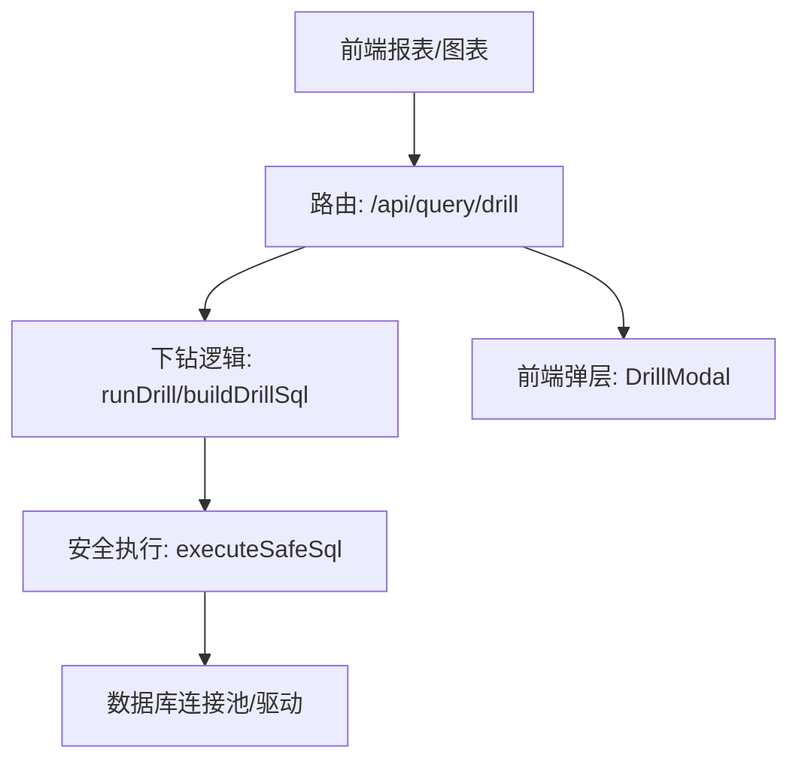
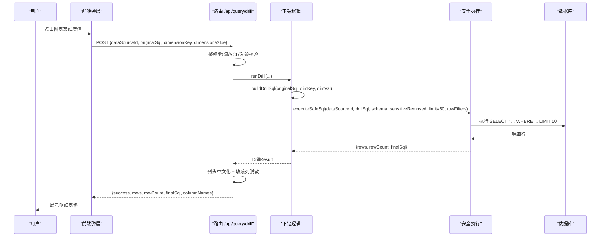
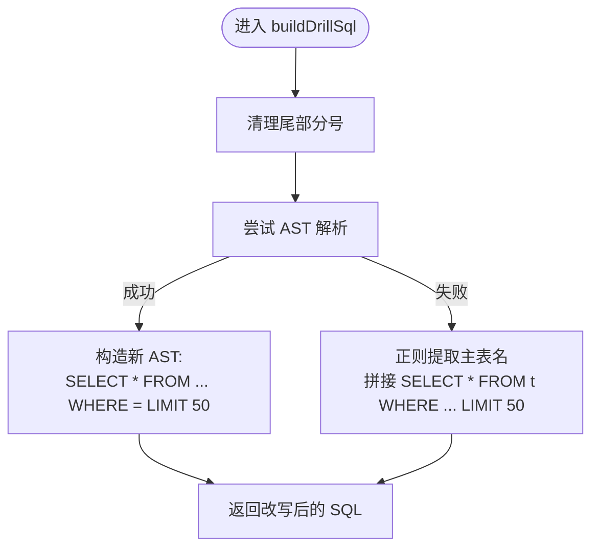
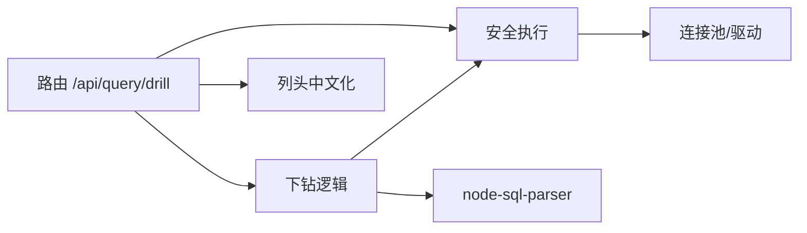

# 下钻分析接口

<cite>
**本文引用的文件**
- [server/routes/query.ts](file://server/routes/query.ts)
- [server/query/drill.ts](file://server/query/drill.ts)
- [server/query/sqlExecutor.ts](file://server/query/sqlExecutor.ts)
- [server/query/liveQueryUtils.ts](file://server/query/liveQueryUtils.ts)
- [src/components/reports/DrillModal.tsx](file://src/components/reports/DrillModal.tsx)
</cite>

## 目录
1. [简介](#简介)
2. [项目结构](#项目结构)
3. [核心组件](#核心组件)
4. [架构总览](#架构总览)
5. [详细组件分析](#详细组件分析)
6. [依赖关系分析](#依赖关系分析)
7. [性能考量](#性能考量)
8. [故障排查指南](#故障排查指南)
9. [结论](#结论)
10. [附录：API 与示例](#附录api-与示例)

## 简介
本文件面向“下钻分析”能力，围绕 POST /api/query/drill 端点，说明其如何从聚合结果自动转换为明细数据。文档涵盖：
- 下钻参数含义（原始 SQL、维度键、维度值）
- 下钻 SQL 生成逻辑（WHERE 条件构建、字段映射、性能优化）
- 多维度下钻示例（时间、地区、产品等）
- 下钻结果的数据格式与前端展示方式
- 与报表系统的集成方式

## 项目结构
下钻功能由路由层、下钻逻辑层、安全执行层与前端弹层共同组成：
- 路由层：POST /api/query/drill，负责鉴权、入参校验、调用下钻逻辑并返回结果
- 下钻逻辑层：根据原聚合 SQL 与点击的维度值生成明细 SQL，并执行
- 安全执行层：统一的安全执行与防护（只读、白名单、行级权限、超时、限流、EXPLAIN 防线等）
- 前端弹层：报表图表点击后弹出明细表格，展示列头中文化与最终 SQL

**图示来源**
- [server/routes/query.ts:654-707](file://server/routes/query.ts#L654-L707)
- [server/query/drill.ts:39-132](file://server/query/drill.ts#L39-L132)
- [server/query/sqlExecutor.ts:734-800](file://server/query/sqlExecutor.ts#L734-L800)
- [src/components/reports/DrillModal.tsx:18-72](file://src/components/reports/DrillModal.tsx#L18-L72)

**章节来源**
- [server/routes/query.ts:654-707](file://server/routes/query.ts#L654-L707)
- [server/query/drill.ts:39-132](file://server/query/drill.ts#L39-L132)
- [server/query/sqlExecutor.ts:734-800](file://server/query/sqlExecutor.ts#L734-L800)
- [src/components/reports/DrillModal.tsx:18-72](file://src/components/reports/DrillModal.tsx#L18-L72)

## 核心组件
- 路由端点 POST /api/query/drill
  - 职责：鉴权、入参校验、数据源访问控制、调用下钻逻辑、结果脱敏与返回
- 下钻逻辑 runDrill / buildDrillSql
  - 职责：基于原聚合 SQL 生成明细 SQL；保留 FROM/JOIN，去除 GROUP BY/聚合，追加 WHERE 维度过滤，限制行数
- 安全执行 executeSafeSql
  - 职责：SQL 安全校验（只读、白名单、敏感列拒绝）、行级权限注入、执行超时与 EXPLAIN 防线、结果截断与审计
- 列名映射 buildColumnNames
  - 职责：将结果列映射为中文表头（优先 schema description，其次 LLM/计划覆盖，最后词根推断兜底）
- 前端弹层 DrillModal
  - 职责：发起下钻请求、渲染明细表格、展示最终 SQL

**章节来源**
- [server/routes/query.ts:654-707](file://server/routes/query.ts#L654-L707)
- [server/query/drill.ts:39-132](file://server/query/drill.ts#L39-L132)
- [server/query/sqlExecutor.ts:734-800](file://server/query/sqlExecutor.ts#L734-L800)
- [server/query/liveQueryUtils.ts:111-149](file://server/query/liveQueryUtils.ts#L111-L149)
- [src/components/reports/DrillModal.tsx:18-72](file://src/components/reports/DrillModal.tsx#L18-L72)

## 架构总览
下钻流程从用户点击图表开始，到明细数据展示结束，关键步骤如下：
1. 前端携带 dataSourceId、originalSql、dimensionKey、dimensionValue 调用 /api/query/drill
2. 路由层进行鉴权、频率限制、数据源访问控制与入参校验
3. 调用下钻逻辑生成明细 SQL，并执行安全查询
4. 对结果进行列头中文化、敏感列脱敏，返回 rows、rowCount、finalSql、columnNames
5. 前端弹层渲染明细表格，并可展示 finalSql 用于调试

**图示来源**
- [server/routes/query.ts:654-707](file://server/routes/query.ts#L654-L707)
- [server/query/drill.ts:39-132](file://server/query/drill.ts#L39-L132)
- [server/query/sqlExecutor.ts:734-800](file://server/query/sqlExecutor.ts#L734-L800)
- [src/components/reports/DrillModal.tsx:34-72](file://src/components/reports/DrillModal.tsx#L34-L72)

## 详细组件分析

### 路由端点 POST /api/query/drill
- 输入参数
  - dataSourceId：数据源标识
  - originalSql：阶段一生成的聚合 SQL（必须）
  - dimensionKey：点击的维度列名（如 region、month、product）
  - dimensionValue：点击的维度值（字符串或数字）
- 处理流程
  - 鉴权与频率限制
  - 数据源访问控制（ACL）
  - 加载 Schema 上下文（schema、sensitiveRemoved、rowFilters）
  - 调用 runDrill 生成并执行下钻 SQL
  - 列头中文化（buildColumnNames）
  - 敏感列脱敏（按角色）
  - 返回 success、rows、rowCount、finalSql、columnNames
- 错误处理
  - 入参缺失/非法 → 400
  - 无数据源访问权限 → 403
  - 下钻失败 → 422（包含 reason）

**章节来源**
- [server/routes/query.ts:654-707](file://server/routes/query.ts#L654-L707)

### 下钻逻辑：runDrill 与 buildDrillSql
- runDrill
  - 接收 originalSql、dimensionKey、dimensionValue、dataSourceId、schema、sensitiveRemoved、rowFilters
  - 调用 buildDrillSql 生成明细 SQL
  - 通过 executeSafeSql 执行，限制行数 50，防止数据爆炸
  - 返回 DrillResult（ok、rows、rowCount、finalSql）
- buildDrillSql
  - 使用 AST 解析原 SQL，提取 from/join 与 where
  - 构造新 AST：SELECT * FROM ... WHERE <dim>=<val> LIMIT 50
  - 若 AST 解析失败，回退正则提取主表名，拼接简单 SELECT * WHERE ... LIMIT 50
  - combineWhere：将维度谓词与原 WHERE 以 AND 合并
- 注意事项
  - 仅支持只读查询（由安全执行层保证）
  - 维度值为数字时不加引号，字符串加引号并转义

**图示来源**
- [server/query/drill.ts:65-132](file://server/query/drill.ts#L65-L132)

**章节来源**
- [server/query/drill.ts:39-132](file://server/query/drill.ts#L39-L132)

### 安全执行：executeSafeSql
- 安全策略
  - 只读校验（仅允许 SELECT）
  - 表名白名单（scope + 敏感过滤后的 Schema）
  - 敏感列拒绝
  - 单语句限制
  - 强制 LIMIT（默认上限可配置，下钻固定 50）
  - 执行超时（场景化超时，交互默认 15s）
  - EXPLAIN 防线（预估扫描量超阈值拦截）
  - 行级权限注入（AST 包裹派生表）
- 执行路径
  - 校验通过后，注入行级权限谓词
  - 获取数据源连接池（按数据源+场景分级）
  - 执行 SQL，返回 rows、rowCount、finalSql、truncated、astFallback
- 下钻中的使用
  - 下钻传入 maxRows=50，确保明细不爆炸
  - 同时注入 rowFilters，保障行级权限生效

**章节来源**
- [server/query/sqlExecutor.ts:291-387](file://server/query/sqlExecutor.ts#L291-L387)
- [server/query/sqlExecutor.ts:396-489](file://server/query/sqlExecutor.ts#L396-L489)
- [server/query/sqlExecutor.ts:734-800](file://server/query/sqlExecutor.ts#L734-L800)

### 列头中文化：buildColumnNames
- 优先级
  - 优先使用 schema 中列的 description（管理员维护的业务中文名）
  - 其次接受上层覆盖（如 LLM 生成的 columnNames/yAxisNames）
  - 最后对英文标识符列进行词根推断兜底（保守转换，未识别保持原值）
- 下钻中的应用
  - 下钻结果为 SELECT *，列名为原始字段名
  - 通过 buildColumnNames 将列名映射为业务中文表头，提升可读性

**章节来源**
- [server/query/liveQueryUtils.ts:111-149](file://server/query/liveQueryUtils.ts#L111-L149)

### 前端弹层：DrillModal
- 触发时机：报表图表点击某个维度值
- 请求体：dataSourceId、originalSql、dimensionKey、dimensionValue
- 响应处理：
  - 渲染 rows 为表格
  - 使用 columnNames 作为列头
  - 可选展示 finalSql 用于调试
- 防御：缺少必要参数时直接提示无法下钻

**章节来源**
- [src/components/reports/DrillModal.tsx:18-72](file://src/components/reports/DrillModal.tsx#L18-L72)
- [src/components/reports/DrillModal.tsx:78-166](file://src/components/reports/DrillModal.tsx#L78-L166)

## 依赖关系分析
- 路由依赖
  - 鉴权与限流中间件
  - 数据源访问控制
  - Schema 上下文加载
  - 下钻逻辑模块
  - 安全执行模块
  - 列头中文化工具
  - 结果脱敏工具
- 下钻逻辑依赖
  - node-sql-parser（AST 解析与重写）
  - 安全执行模块（executeSafeSql）
- 安全执行依赖
  - 数据源连接池（mysql/pg）
  - EXPLAIN 评估（MySQL/PG）
  - 行级权限注入（AST 遍历与重写）
- 前端依赖
  - API 客户端封装
  - 表格渲染与样式

**图示来源**
- [server/routes/query.ts:654-707](file://server/routes/query.ts#L654-L707)
- [server/query/drill.ts:9-15](file://server/query/drill.ts#L9-L15)
- [server/query/sqlExecutor.ts:734-800](file://server/query/sqlExecutor.ts#L734-L800)
- [server/query/liveQueryUtils.ts:111-149](file://server/query/liveQueryUtils.ts#L111-L149)

**章节来源**
- [server/routes/query.ts:654-707](file://server/routes/query.ts#L654-L707)
- [server/query/drill.ts:9-15](file://server/query/drill.ts#L9-L15)
- [server/query/sqlExecutor.ts:734-800](file://server/query/sqlExecutor.ts#L734-L800)
- [server/query/liveQueryUtils.ts:111-149](file://server/query/liveQueryUtils.ts#L111-L149)

## 性能考量
- 行数限制
  - 下钻固定 LIMIT 50，避免明细数据爆炸导致前端卡顿与数据库压力
- 执行超时
  - 交互场景默认 15s，可通过环境变量调整；MySQL 注入 MAX_EXECUTION_TIME hint 双保险
- EXPLAIN 防线
  - 预估扫描行数超过阈值则拦截，保护数据源性能；下钻因有维度过滤通常能命中索引
- 连接池分级
  - 按数据源+场景分级缓存连接池，减少连接创建开销
- 列头中文化
  - 基于 schema 描述与词根推断，避免前端额外计算

[本节提供通用指导，无需特定文件引用]

## 故障排查指南
- 常见错误码与原因
  - 400：入参缺失或非法（dataSourceId/originalSql/dimensionKey/dimensionValue）
  - 403：无数据源访问权限或数据源已停用
  - 422：下钻失败（如 SQL 被拒绝、AST 解析失败且回退失败）
- 排查要点
  - 检查 originalSql 是否为合法 SELECT 且来自受信任的报表阶段一
  - 确认 dimensionKey 在 schema 中存在且可被 WHERE 过滤
  - 查看返回的 finalSql 是否合理（含维度谓词与 LIMIT）
  - 关注安全执行层的 reason（如敏感列、非白名单表、EXPLAIN 拦截）
  - 前端弹层会显示 error 信息，便于快速定位

**章节来源**
- [server/routes/query.ts:654-707](file://server/routes/query.ts#L654-L707)
- [server/query/drill.ts:42-57](file://server/query/drill.ts#L42-L57)
- [server/query/sqlExecutor.ts:291-387](file://server/query/sqlExecutor.ts#L291-L387)

## 结论
POST /api/query/drill 提供了从聚合结果到明细数据的自动化下钻能力。通过 AST 解析与回退机制，结合安全执行层的严格防护，既能保证灵活性又能确保安全与性能。配合列头中文化与前端弹层，形成完整的下钻体验。建议在报表系统中广泛启用该能力，以提升数据分析的深度与效率。

[本节为总结性内容，无需特定文件引用]

## 附录：API 与示例

### 端点定义
- 方法：POST
- 路径：/api/query/drill
- 请求体
  - dataSourceId：string（必填）
  - originalSql：string（必填，长度不超过 10000）
  - dimensionKey：string（必填）
  - dimensionValue：string | number（必填）
- 响应体
  - success：boolean
  - executionTimeMs：number
  - rows：Record<string, any>[]
  - rowCount：number
  - finalSql：string
  - columnNames：Record<string, string>
  - dlp：{ maskedColumns: string[], maskedLabels: string[] }（当存在敏感列脱敏时）

**章节来源**
- [server/routes/query.ts:654-707](file://server/routes/query.ts#L654-L707)

### 下钻参数含义
- originalSql：阶段一生成的聚合 SQL，用于推导明细查询的 FROM/JOIN 与基础 WHERE
- dimensionKey：点击的维度列名（如 region、month、product），用于构建 WHERE 条件
- dimensionValue：点击的维度值，类型决定 SQL 字面量写法（数字不加引号，字符串加引号并转义）

**章节来源**
- [server/query/drill.ts:16-28](file://server/query/drill.ts#L16-L28)
- [server/query/drill.ts:102-122](file://server/query/drill.ts#L102-L122)

### 下钻 SQL 生成逻辑
- 保留原查询的 FROM/JOIN，去除 GROUP BY 与聚合函数，改为 SELECT *
- 将维度谓词与原 WHERE 以 AND 合并
- 追加 LIMIT 50 防止数据爆炸
- 若 AST 解析失败，回退正则提取主表名并拼接简单 SELECT * WHERE ... LIMIT 50

**章节来源**
- [server/query/drill.ts:65-132](file://server/query/drill.ts#L65-L132)

### 多维度下钻示例
- 按时间下钻
  - 维度键：month
  - 维度值：2026-01
  - 效果：WHERE month = '2026-01' LIMIT 50
- 按地区下钻
  - 维度键：region
  - 维度值：合肥市
  - 效果：WHERE region = '合肥市' LIMIT 50
- 按产品下钻
  - 维度键：product
  - 维度值：A 类商品
  - 效果：WHERE product = 'A 类商品' LIMIT 50

[以上示例为概念性说明，具体行为由 buildDrillSql 实现]

### 下钻结果的数据格式与展示方式
- 数据格式
  - rows：明细行数组
  - rowCount：实际返回行数
  - finalSql：最终执行的 SQL（可用于调试）
  - columnNames：列名到中文表头的映射
- 展示方式
  - 前端弹层以表格形式展示 rows，使用 columnNames 作为列头
  - 可选展示 finalSql 用于问题定位

**章节来源**
- [server/routes/query.ts:694-707](file://server/routes/query.ts#L694-L707)
- [src/components/reports/DrillModal.tsx:50-72](file://src/components/reports/DrillModal.tsx#L50-L72)
- [src/components/reports/DrillModal.tsx:119-160](file://src/components/reports/DrillModal.tsx#L119-L160)

### 与报表系统的集成方式
- 报表阶段一生成聚合 SQL 并缓存 originalSql
- 图表点击维度值时，携带 originalSql 与维度信息调用 /api/query/drill
- 后端返回明细数据与列头中文化映射，前端弹层渲染
- 支持多图表、多数据源的下钻，复用同一套安全执行与权限体系

**章节来源**
- [server/routes/query.ts:654-707](file://server/routes/query.ts#L654-L707)
- [src/components/reports/DrillModal.tsx:18-72](file://src/components/reports/DrillModal.tsx#L18-L72)