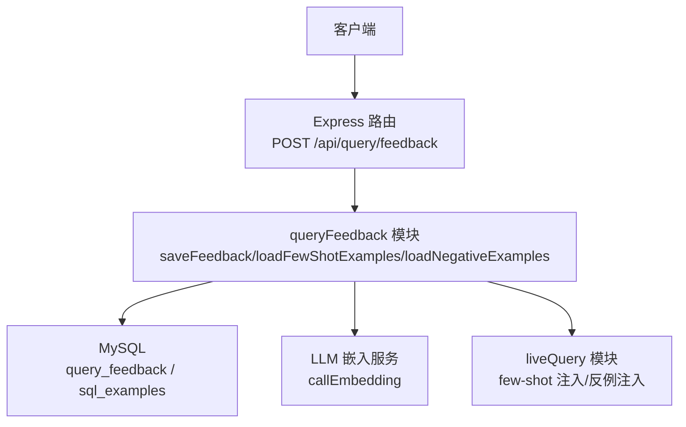
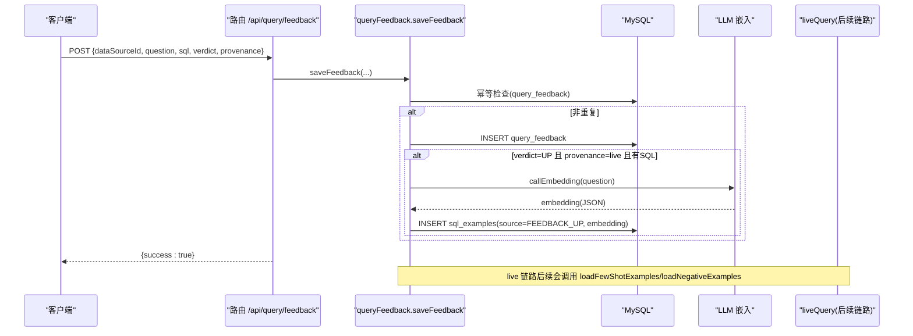
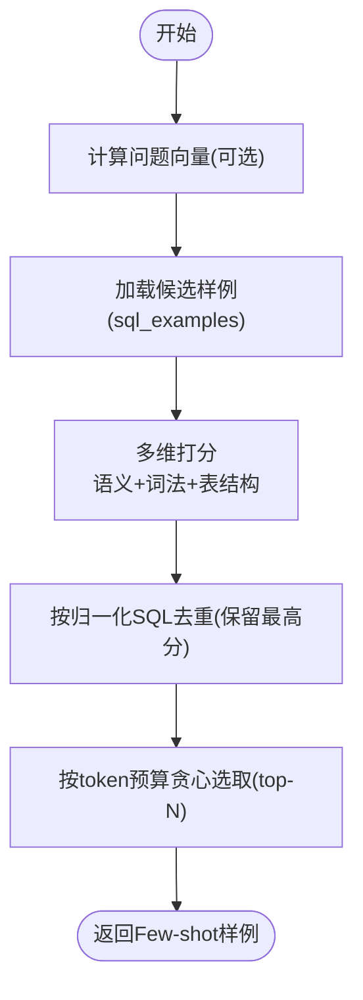
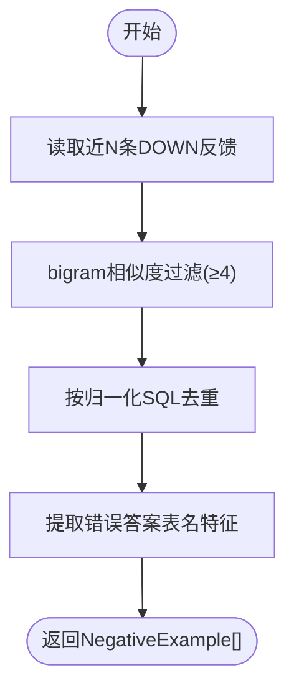
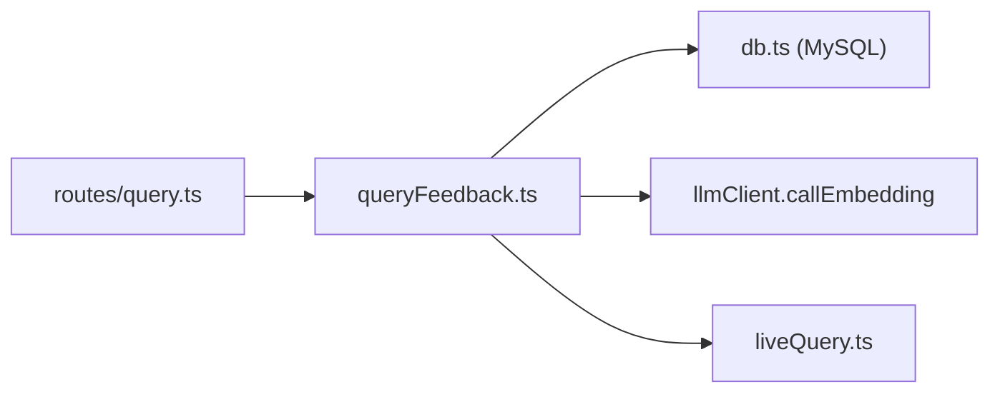

# 反馈系统接口

<cite>
**本文引用的文件**
- [server/routes/query.ts](file://server/routes/query.ts)
- [server/query/queryFeedback.ts](file://server/query/queryFeedback.ts)
- [server/infra/db.ts](file://server/infra/db.ts)
- [server/query/liveQuery.ts](file://server/query/liveQuery.ts)
- [server/query/queryFeedback.test.ts](file://server/query/queryFeedback.test.ts)
</cite>

## 目录
1. [简介](#简介)
2. [项目结构](#项目结构)
3. [核心组件](#核心组件)
4. [架构总览](#架构总览)
5. [详细组件分析](#详细组件分析)
6. [依赖关系分析](#依赖关系分析)
7. [性能考量](#性能考量)
8. [故障排查指南](#故障排查指南)
9. [结论](#结论)
10. [附录：API 使用示例](#附录api-使用示例)

## 简介
本文件面向“智能问数据分析系统”的反馈闭环能力，重点说明 POST /api/query/feedback 端点的功能与实现，包括用户反馈（点赞/点踩）的收集、存储与处理；few-shot 样例的自动生成与质量治理；反馈数据在模型训练中的应用（提示词优化、查询理解改进）；并提供 API 使用示例。同时说明反馈数据的隐私保护与访问控制机制。

## 项目结构
反馈系统涉及路由层、业务逻辑层、数据库层以及 LLM 嵌入服务：
- 路由层：负责鉴权、限流、参数校验与调用业务函数
- 业务逻辑层：负责反馈幂等保存、few-shot 检索、反例沉淀、样例库管理
- 数据库层：持久化反馈记录与 few-shot 样例（含向量字段）
- LLM 层：提供问题向量化（embedding），用于语义相似度检索



**图表来源**
- [server/routes/query.ts:531-556](file://server/routes/query.ts#L531-L556)
- [server/query/queryFeedback.ts:50-88](file://server/query/queryFeedback.ts#L50-L88)
- [server/query/queryFeedback.ts:168-232](file://server/query/queryFeedback.ts#L168-L232)
- [server/query/liveQuery.ts:20-20](file://server/query/liveQuery.ts#L20-L20)

**章节来源**
- [server/routes/query.ts:531-556](file://server/routes/query.ts#L531-L556)
- [server/query/queryFeedback.ts:50-88](file://server/query/queryFeedback.ts#L50-L88)
- [server/query/queryFeedback.ts:168-232](file://server/query/queryFeedback.ts#L168-L232)
- [server/query/liveQuery.ts:20-20](file://server/query/liveQuery.ts#L20-L20)

## 核心组件
- 反馈保存：幂等写入 query_feedback，并在条件满足时自动沉淀为 few-shot 样例
- Few-shot 检索：基于“问题语义 + 词法 + SQL 表结构”的多维打分，按 token 预算选取 top-N
- 反例沉淀：对点踩记录进行相似度筛选，提取错误答案涉及的表名特征作为负样本提示
- 样例库管理：管理员可手工登记、批量导入/导出、更新/删除，支持冲突策略与 dry-run
- 与 live 链路集成：在真实执行链路中注入 few-shot 正例与反例，提升提示词质量与查询理解

**章节来源**
- [server/query/queryFeedback.ts:50-88](file://server/query/queryFeedback.ts#L50-L88)
- [server/query/queryFeedback.ts:125-156](file://server/query/queryFeedback.ts#L125-L156)
- [server/query/queryFeedback.ts:168-232](file://server/query/queryFeedback.ts#L168-L232)
- [server/query/queryFeedback.ts:270-309](file://server/query/queryFeedback.ts#L270-L309)
- [server/query/queryFeedback.ts:400-469](file://server/query/queryFeedback.ts#L400-L469)

## 架构总览
反馈系统通过“采集—沉淀—检索—注入—评估”形成闭环：
- 采集：POST /api/query/feedback 接收点赞/点踩
- 沉淀：点赞且 provenance=live 的问答对自动进入 sql_examples（FEEDBACK_UP）
- 检索：根据当前问题与相关表集合，从 sql_examples 召回相似样例
- 注入：将精选样例以 user/assistant 消息对注入到阶段一 prompt
- 评估：结合点踩反例，避免重复犯同类错误



**图表来源**
- [server/routes/query.ts:531-556](file://server/routes/query.ts#L531-L556)
- [server/query/queryFeedback.ts:50-88](file://server/query/queryFeedback.ts#L50-L88)
- [server/query/queryFeedback.ts:168-232](file://server/query/queryFeedback.ts#L168-L232)

## 详细组件分析

### 反馈保存与幂等
- 幂等规则：同一用户、同一数据源、同一问题、同一 SQL、同一结论在 24 小时内重复提交直接跳过
- 点赞自动沉淀：当 verdict=UP 且 provenance=live 且存在 executedSql 时，自动写入 sql_examples（source=FEEDBACK_UP），并尝试生成问题向量
- 输入清洗：对用户名校验长度限制，问题与 SQL 截断防止超长

**章节来源**
- [server/query/queryFeedback.ts:50-88](file://server/query/queryFeedback.ts#L50-L88)
- [server/query/queryFeedback.ts:101-104](file://server/query/queryFeedback.ts#L101-L104)

### Few-shot 样例检索与注入
- 多维打分：
  - 语义相似度：问题向量与样例问题向量余弦相似度（权重×8）
  - 词法相似度：中文 bigram 重合数
  - 结构相似度：样例 SQL 引用的表与当前问题 schema-linking 圈定表的重合度（权重×3）
- 去重与预算：相同归一化 SQL 仅保留最高分；按 token 预算贪心取 top-N（最多 3 条）
- 降级策略：若 embedding 不可用或向量损坏，自动降级为纯词法打分



**图表来源**
- [server/query/queryFeedback.ts:168-232](file://server/query/queryFeedback.ts#L168-L232)

**章节来源**
- [server/query/queryFeedback.ts:168-232](file://server/query/queryFeedback.ts#L168-L232)

### 反例沉淀与负样本注入
- 点踩反例：从 query_feedback 中筛选 DOWN 且 executed_sql 非空，按问题相似度（bigram≥4）取 top N
- 安全输出：仅返回错误答案涉及的表名特征，不暴露完整错误 SQL，防止 LLM 照抄
- 去重：相同归一化 SQL 只保留一条



**图表来源**
- [server/query/queryFeedback.ts:125-156](file://server/query/queryFeedback.ts#L125-L156)

**章节来源**
- [server/query/queryFeedback.ts:125-156](file://server/query/queryFeedback.ts#L125-L156)

### 样例库管理（管理员）
- 手工登记：validateExampleInput 校验（仅 SELECT、长度限制）
- 列表/更新/删除：listSqlExamples/updateSqlExample/deleteSqlExample
- 批量导入：importSqlExamples 支持 skip/overwrite/append 三种冲突策略，dry-run 仅统计不写库
- 导出：buildSqlExamplesExport 生成结构化备份文件

**章节来源**
- [server/query/queryFeedback.ts:258-309](file://server/query/queryFeedback.ts#L258-L309)
- [server/query/queryFeedback.ts:400-469](file://server/query/queryFeedback.ts#L400-L469)
- [server/query/queryFeedback.ts:337-372](file://server/query/queryFeedback.ts#L337-L372)

### 与 live 链路的集成
- 在真实执行链路中，调用 loadFewShotExamples 与 loadNegativeExamples，将精选样例与反例注入阶段一 prompt，提升提示词质量与查询理解
- 该集成位于 liveQuery 模块，统一读取 sql_examples 与 query_feedback 数据

**章节来源**
- [server/query/liveQuery.ts:20-20](file://server/query/liveQuery.ts#L20-L20)
- [server/query/liveQuery.ts:223-237](file://server/query/liveQuery.ts#L223-L237)

## 依赖关系分析
- 路由依赖：authMiddleware、requireRole、rateLimiter、saveFeedback
- 业务依赖：getPool（数据库连接）、callEmbedding（LLM 嵌入）、extractTableRefs/stripCommentsAndStrings（SQL 解析）
- 数据依赖：query_feedback（反馈记录）、sql_examples（few-shot 样例，含 embedding）



**图表来源**
- [server/routes/query.ts:531-556](file://server/routes/query.ts#L531-L556)
- [server/query/queryFeedback.ts:50-88](file://server/query/queryFeedback.ts#L50-L88)
- [server/query/liveQuery.ts:20-20](file://server/query/liveQuery.ts#L20-L20)

**章节来源**
- [server/routes/query.ts:531-556](file://server/routes/query.ts#L531-L556)
- [server/query/queryFeedback.ts:50-88](file://server/query/queryFeedback.ts#L50-L88)
- [server/query/liveQuery.ts:20-20](file://server/query/liveQuery.ts#L20-L20)

## 性能考量
- 幂等写入：24 小时窗口内重复提交直接跳过，降低写入压力
- 向量检索降级：embedding 不可用时自动降级为 bigram 词法，保证可用性
- 去重与预算：按归一化 SQL 去重并按 token 预算选取 top-N，避免提示词膨胀
- 导入上限：单次导入最大条目限制，防止滥用
- 缓存与并发：路由层已有限流与并发槽控制，反馈保存为轻量写入

[本节为通用指导，无需具体文件引用]

## 故障排查指南
- 反馈保存失败：检查鉴权、限流、数据库连接与字段长度限制
- 未生成 few-shot 样例：确认 verdict=UP 且 provenance=live 且 executedSql 非空；检查 embedding 服务是否可用
- 检索不到样例：检查 sql_examples 是否存在对应 data_source_id；若 embedding 不可用，确认词法相似度阈值与表结构维度
- 导入失败：检查 validateExampleInput 校验结果与冲突策略；查看 errors 数组定位非法条目

**章节来源**
- [server/query/queryFeedback.test.ts:114-138](file://server/query/queryFeedback.test.ts#L114-L138)
- [server/query/queryFeedback.test.ts:140-173](file://server/query/queryFeedback.test.ts#L140-L173)
- [server/query/queryFeedback.test.ts:188-268](file://server/query/queryFeedback.test.ts#L188-L268)

## 结论
反馈系统通过“点赞自动沉淀 + 点踩反例沉淀 + 多维检索 + 安全注入”的闭环，持续优化提示词与查询理解。其设计兼顾了可用性（降级策略）、安全性（反例脱敏、权限控制）与可扩展性（样例库管理、导入导出）。在生产环境中建议配合监控与审计，持续评估反馈数据的质量与效果。

[本节为总结性内容，无需具体文件引用]

## 附录：API 使用示例

### 提交反馈
- 端点：POST /api/query/feedback
- 鉴权：需要 ADMIN 或 ANALYST 角色
- 请求体字段：
  - dataSourceId: string（数据源标识）
  - question: string（用户问题）
  - sql: string（执行的 SQL，可选但建议提供）
  - verdict: 'UP' | 'DOWN'（点赞/点踩）
  - provenance: string（来源标记，如 'live'）
- 响应：{ success: true } 或错误码

示例（JSON）：
```json
{
  "dataSourceId": "ds_001",
  "question": "本月各渠道的投放金额",
  "sql": "SELECT channel, SUM(amount) FROM ad_spend WHERE month='2026-01' GROUP BY channel",
  "verdict": "UP",
  "provenance": "live"
}
```

**章节来源**
- [server/routes/query.ts:531-556](file://server/routes/query.ts#L531-L556)

### 查询统计与效果分析（概念）
- 可通过查询 query_feedback 与 sql_examples 表，统计点赞/点踩比例、热门问题、样例命中率等
- 结合 live 链路埋点（trace 与审计日志），评估反馈对提示词与查询理解的改善效果

[本节为概念性说明，无需具体文件引用]

### 隐私保护与访问控制
- 鉴权与角色：反馈端点受 authMiddleware 与 requireRole('ADMIN','ANALYST') 保护
- 数据源访问控制：其他写操作需通过 checkDataSourceAccess 校验
- DLP 脱敏：查询结果与缓存数据在出口处按角色脱敏（敏感列掩码，ADMIN 豁免）
- 反例安全：点踩反例仅返回错误答案涉及的表名特征，不暴露完整错误 SQL

**章节来源**
- [server/routes/query.ts:531-556](file://server/routes/query.ts#L531-L556)
- [server/query/queryFeedback.ts:125-156](file://server/query/queryFeedback.ts#L125-L156)

### 数据库模式（关键表）
- query_feedback：记录用户反馈（user_id、username、data_source_id、question、executed_sql、verdict、provenance、created_at）
- sql_examples：few-shot 样例库（data_source_id、question、sql_text、source、created_by、created_at、updated_at、embedding）

**章节来源**
- [server/infra/db.ts:370-381](file://server/infra/db.ts#L370-L381)
- [server/infra/db.ts:390-399](file://server/infra/db.ts#L390-L399)