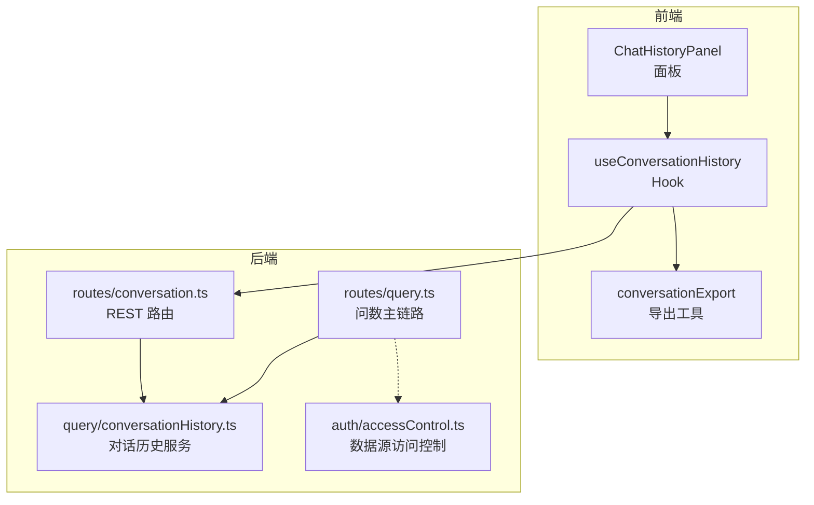
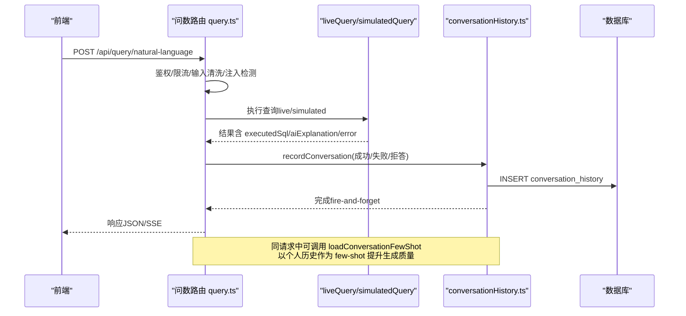
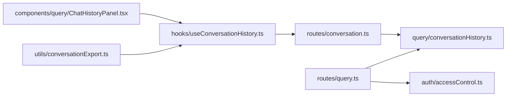

# 对话管理接口

<cite>
**本文引用的文件**
- [server/routes/conversation.ts](file://server/routes/conversation.ts)
- [server/query/conversationHistory.ts](file://server/query/conversationHistory.ts)
- [src/hooks/useConversationHistory.ts](file://src/hooks/useConversationHistory.ts)
- [src/components/query/ChatHistoryPanel.tsx](file://src/components/query/ChatHistoryPanel.tsx)
- [src/utils/conversationExport.ts](file://src/utils/conversationExport.ts)
- [server/routes/query.ts](file://server/routes/query.ts)
- [server/auth/accessControl.ts](file://server/auth/accessControl.ts)
</cite>

## 目录
1. [简介](#简介)
2. [项目结构](#项目结构)
3. [核心组件](#核心组件)
4. [架构总览](#架构总览)
5. [详细组件分析](#详细组件分析)
6. [依赖关系分析](#依赖关系分析)
7. [性能与容量](#性能与容量)
8. [故障排查指南](#故障排查指南)
9. [结论](#结论)
10. [附录：API 参考与使用示例](#附录api-参考与使用示例)

## 简介
本文件面向“智能问数据分析系统”的对话管理子系统，聚焦多轮对话上下文管理、历史消息维护、注入检测与过滤、对话历史存储结构与查询优化（few-shot 学习、语义检索增强），并提供对话管理的 API 使用示例与隐私保护、访问控制说明。该能力将每次问数的用户问题、执行 SQL、答案摘要、状态标记等持久化到数据库，支持跨设备共享、搜索、删除与导出，同时沉淀个人高频口径用于后续问答优化。

## 项目结构
对话管理涉及服务端路由、业务逻辑、前端 Hook 与 UI 面板、以及导出工具：
- 服务端路由：提供对话历史的检索与删除接口
- 业务逻辑：对话记录写入、窗口清理、检索、删除、个人 few-shot 检索
- 前端 Hook：封装加载、删除、导出等交互
- 前端面板：展示历史、支持搜索、重问、删除
- 导出工具：将当前会话导出为 Markdown
- 问数主链路：在成功/失败/拒答时异步落库对话记录，并触发 few-shot 检索

图表来源
- [server/routes/conversation.ts:1-44](file://server/routes/conversation.ts#L1-L44)
- [server/query/conversationHistory.ts:1-204](file://server/query/conversationHistory.ts#L1-L204)
- [src/hooks/useConversationHistory.ts:1-124](file://src/hooks/useConversationHistory.ts#L1-L124)
- [src/components/query/ChatHistoryPanel.tsx:1-116](file://src/components/query/ChatHistoryPanel.tsx#L1-L116)
- [src/utils/conversationExport.ts:1-44](file://src/utils/conversationExport.ts#L1-L44)
- [server/routes/query.ts:1-200](file://server/routes/query.ts#L1-L200)
- [server/auth/accessControl.ts:1-108](file://server/auth/accessControl.ts#L1-L108)

章节来源
- [server/routes/conversation.ts:1-44](file://server/routes/conversation.ts#L1-L44)
- [server/query/conversationHistory.ts:1-204](file://server/query/conversationHistory.ts#L1-L204)
- [src/hooks/useConversationHistory.ts:1-124](file://src/hooks/useConversationHistory.ts#L1-L124)
- [src/components/query/ChatHistoryPanel.tsx:1-116](file://src/components/query/ChatHistoryPanel.tsx#L1-L116)
- [src/utils/conversationExport.ts:1-44](file://src/utils/conversationExport.ts#L1-L44)
- [server/routes/query.ts:1-200](file://server/routes/query.ts#L1-L200)
- [server/auth/accessControl.ts:1-108](file://server/auth/accessControl.ts#L1-L108)

## 核心组件
- 对话历史服务（conversationHistory.ts）
  - 记录对话：recordConversation 将用户问题、执行 SQL、答案摘要、状态、来源、行数、耗时等写入 conversation_history 表，并抽样触发窗口清理
  - 窗口清理：pruneConversationHistory 按用户+数据源保留最近 N 条（默认 500，可通过环境变量调整）
  - 检索与删除：searchConversations 支持关键词匹配问题与答案摘要；deleteConversation 仅允许删除本人记录
  - 个人 few-shot：loadConversationFewShot 从近 100 条成功真实问答对中筛选并打分，结合 bigram 重合与表引用重合，取 top 2 且受 token 预算限制
- 对话历史路由（routes/conversation.ts）
  - GET /api/conversations：检索本人当前数据源的对话历史（支持 q 关键词）
  - DELETE /api/conversations/:id：删除单条对话（越权返回 404）
- 前端 Hook（useConversationHistory.ts）
  - 封装加载、删除、切换数据源自动刷新、导出 Markdown 等
- 前端面板（ChatHistoryPanel.tsx）
  - 展示历史条目、支持搜索、回填重新提问、删除
- 导出工具（conversationExport.ts）
  - 构建 Markdown（问题、回答、SQL）并触发浏览器下载
- 问数主链路（routes/query.ts）
  - 在 live/simulated 两种模式下，成功/失败/拒答均异步记录对话历史
  - 通过 sanitizeQuestion/sanitizeHistory 进行输入清洗与注入检测
  - 调用 loadConversationFewShot 实现个人经验反哺

章节来源
- [server/query/conversationHistory.ts:1-204](file://server/query/conversationHistory.ts#L1-L204)
- [server/routes/conversation.ts:1-44](file://server/routes/conversation.ts#L1-L44)
- [src/hooks/useConversationHistory.ts:1-124](file://src/hooks/useConversationHistory.ts#L1-L124)
- [src/components/query/ChatHistoryPanel.tsx:1-116](file://src/components/query/ChatHistoryPanel.tsx#L1-L116)
- [src/utils/conversationExport.ts:1-44](file://src/utils/conversationExport.ts#L1-L44)
- [server/routes/query.ts:1-200](file://server/routes/query.ts#L1-L200)

## 架构总览
对话管理贯穿“问数主链路 → 对话落库 → 历史检索/删除 → 个人 few-shot 反哺”的闭环。

图表来源
- [server/routes/query.ts:1-200](file://server/routes/query.ts#L1-L200)
- [server/query/conversationHistory.ts:1-204](file://server/query/conversationHistory.ts#L1-L204)

## 详细组件分析

### 对话历史存储结构与字段说明
- 表名：conversation_history
- 关键字段
  - user_id：用户 ID
  - username：用户名（截断至 50）
  - data_source_id：数据源 ID（截断至 64）
  - question：用户问题（截断至 500）
  - executed_sql：执行 SQL（标准化后截断至 2000）
  - answer_summary：答案摘要（截断至 800）
  - status：状态（SUCCESS/FALLBACK/REFUSED）
  - provenance：来源（live/simulated）
  - row_count：返回行数
  - duration_ms：耗时毫秒
  - created_at：创建时间
- 设计要点
  - 写路径 fire-and-forget，失败不阻断主链路
  - 抽样 10% 触发窗口清理，避免每写一删的写放大
  - 窗口大小由环境变量 CONVERSATION_RETENTION 控制（默认 500，0=不限制）

章节来源
- [server/query/conversationHistory.ts:42-90](file://server/query/conversationHistory.ts#L42-L90)

### 多轮对话上下文管理与注入检测
- 历史消息注入检测
  - 问数主链路对 history 调用 sanitizeHistory 进行清洗与注入特征拒绝
  - 对 user 消息逐条检测，assistant 输出一律丢弃，防止回流污染
  - 最多保留 5 轮历史
- 上下文作用
  - 用于后续 LLM 推理时的上下文提示，提高意图理解与 SQL 生成准确性
  - 结合个人 few-shot 进一步减少幻觉与错误

章节来源
- [server/routes/query.ts:180-190](file://server/routes/query.ts#L180-L190)

### 对话历史在查询优化中的作用（few-shot 与语义检索增强）
- 个人 few-shot 检索
  - 从近 100 条 SUCCESS 且 provenance=live 的记录中检索
  - 评分维度：问题 bigram 重合度 + SQL 引用表与当前相关表的圈定表重合度（权重×3）
  - 相同 SQL 只保留最高分，token 预算内贪心取 top 2（预算约 500 tokens）
- 效果
  - 将用户高频口径沉淀为个人经验，反哺后续问数
  - 与团队样例库互补，提升复杂口径命中率

章节来源
- [server/query/conversationHistory.ts:145-203](file://server/query/conversationHistory.ts#L145-L203)

### 对话历史检索、删除与导出
- 检索
  - GET /api/conversations?dataSourceId=&q=...
  - 支持按用户+数据源检索，关键词模糊匹配问题与答案摘要
- 删除
  - DELETE /api/conversations/:id
  - 仅允许删除本人记录，越权返回 404
- 导出
  - 前端将当前可见消息导出为 Markdown（包含问题、回答、SQL），文件名带数据源名称与日期

章节来源
- [server/routes/conversation.ts:15-41](file://server/routes/conversation.ts#L15-L41)
- [src/hooks/useConversationHistory.ts:48-109](file://src/hooks/useConversationHistory.ts#L48-L109)
- [src/utils/conversationExport.ts:12-43](file://src/utils/conversationExport.ts#L12-L43)

### 隐私保护与访问控制
- 数据源级访问控制（ACL）
  - 非 ADMIN 需命中部门或个人白名单方可访问数据源
  - 问数主链路在鉴权后调用 checkDataSourceAccess 校验
- 对话记录隔离
  - 所有检索/删除均以 user_id 限定，确保只能操作本人记录
- 输入安全
  - 问数入口对问题与历史进行注入检测与长度限制，非法输入直接拒绝
- 审计与日志
  - 关键拒绝与异常写入审计日志，便于追踪与合规

章节来源
- [server/auth/accessControl.ts:43-73](file://server/auth/accessControl.ts#L43-L73)
- [server/routes/query.ts:58-75](file://server/routes/query.ts#L58-L75)
- [server/query/conversationHistory.ts:106-138](file://server/query/conversationHistory.ts#L106-L138)

## 依赖关系分析

图表来源
- [server/routes/conversation.ts:1-44](file://server/routes/conversation.ts#L1-L44)
- [server/query/conversationHistory.ts:1-204](file://server/query/conversationHistory.ts#L1-L204)
- [server/routes/query.ts:1-200](file://server/routes/query.ts#L1-L200)
- [server/auth/accessControl.ts:1-108](file://server/auth/accessControl.ts#L1-L108)
- [src/hooks/useConversationHistory.ts:1-124](file://src/hooks/useConversationHistory.ts#L1-L124)
- [src/components/query/ChatHistoryPanel.tsx:1-116](file://src/components/query/ChatHistoryPanel.tsx#L1-L116)
- [src/utils/conversationExport.ts:1-44](file://src/utils/conversationExport.ts#L1-L44)

章节来源
- [server/routes/conversation.ts:1-44](file://server/routes/conversation.ts#L1-L44)
- [server/query/conversationHistory.ts:1-204](file://server/query/conversationHistory.ts#L1-L204)
- [server/routes/query.ts:1-200](file://server/routes/query.ts#L1-L200)
- [server/auth/accessControl.ts:1-108](file://server/auth/accessControl.ts#L1-L108)
- [src/hooks/useConversationHistory.ts:1-124](file://src/hooks/useConversationHistory.ts#L1-L124)
- [src/components/query/ChatHistoryPanel.tsx:1-116](file://src/components/query/ChatHistoryPanel.tsx#L1-L116)
- [src/utils/conversationExport.ts:1-44](file://src/utils/conversationExport.ts#L1-L44)

## 性能与容量
- 写入路径
  - 记录对话为 fire-and-forget，失败不影响主链路
  - 抽样 10% 触发窗口清理，降低写放大
- 窗口清理
  - 按用户+数据源保留最近 N 条（默认 500），旧记录自动清理
  - 个人 few-shot 仅读近 100 条，窗口足够覆盖检索源
- 检索性能
  - 检索支持 LIMIT 上限（最大 200），避免大结果集
  - 关键词匹配基于 LIKE，建议配合索引或合理分页
- Few-shot 开销
  - 仅读取近 100 条，并按 token 预算限制选取 top 2，控制提示词体积

[本节为通用性能讨论，无需特定文件引用]

## 故障排查指南
- 无法检索对话历史
  - 检查是否传入有效的 dataSourceId
  - 确认当前用户角色具备访问权限（ADMIN/ANALYST）
  - 查看服务端日志中对话历史查询失败信息
- 删除失败
  - 确认 id 有效且属于本人记录
  - 越权删除会返回 404
- 对话未落库
  - 检查问数主链路是否成功执行
  - 关注 recordConversation 的异步失败日志（不会阻断主链路）
- 导出为空
  - 当前数据源无可见消息时无法导出
  - 检查 visibleMessages 是否为空

章节来源
- [server/routes/conversation.ts:15-41](file://server/routes/conversation.ts#L15-L41)
- [server/query/conversationHistory.ts:106-138](file://server/query/conversationHistory.ts#L106-L138)
- [src/hooks/useConversationHistory.ts:48-109](file://src/hooks/useConversationHistory.ts#L48-L109)

## 结论
对话管理通过“问数主链路异步落库 + 窗口清理 + 个人 few-shot 反哺”形成闭环，既保障用户体验与性能，又持续沉淀个人高频口径，提升后续问答质量。接口层面提供安全的检索与删除能力，前端提供便捷的搜索、重问与导出体验。配合数据源级 ACL 与输入注入检测，满足企业级隐私与合规要求。

## 附录：API 参考与使用示例

### 获取对话历史
- 方法：GET
- 路径：/api/conversations
- 查询参数
  - dataSourceId：必填，字符串
  - q：可选，关键词（匹配问题与答案摘要）
- 成功响应
  - { success: true, conversations: [...] }
- 失败响应
  - 缺少数据源：400
  - 内部错误：500

示例
- GET /api/conversations?dataSourceId=ds_123&q=销售额

章节来源
- [server/routes/conversation.ts:15-27](file://server/routes/conversation.ts#L15-L27)

### 删除对话历史
- 方法：DELETE
- 路径：/api/conversations/:id
- 路径参数
  - id：正整数
- 成功响应
  - { success: true }
- 失败响应
  - ID 无效：400
  - 不存在或无权：404
  - 内部错误：500

示例
- DELETE /api/conversations/123

章节来源
- [server/routes/conversation.ts:29-41](file://server/routes/conversation.ts#L29-L41)

### 对话历史在问数主链路中的落库时机
- 成功：记录 executedSql、answerSummary、status=SUCCESS、provenance=live/simulated
- 失败：记录 error 摘要、status=FALLBACK
- 拒答：记录 refuseReason 摘要、status=REFUSED
- 均为异步落库，失败不阻断主链路

章节来源
- [server/routes/query.ts:260-370](file://server/routes/query.ts#L260-L370)

### 前端使用示例（Hook 与面板）
- 打开历史面板：toggleHistoryPanel
- 加载历史：loadHistory(keyword)
- 删除记录：handleDeleteConversation(id)
- 导出 Markdown：handleExportConversation()

章节来源
- [src/hooks/useConversationHistory.ts:41-123](file://src/hooks/useConversationHistory.ts#L41-L123)
- [src/components/query/ChatHistoryPanel.tsx:21-115](file://src/components/query/ChatHistoryPanel.tsx#L21-L115)
- [src/utils/conversationExport.ts:12-43](file://src/utils/conversationExport.ts#L12-L43)