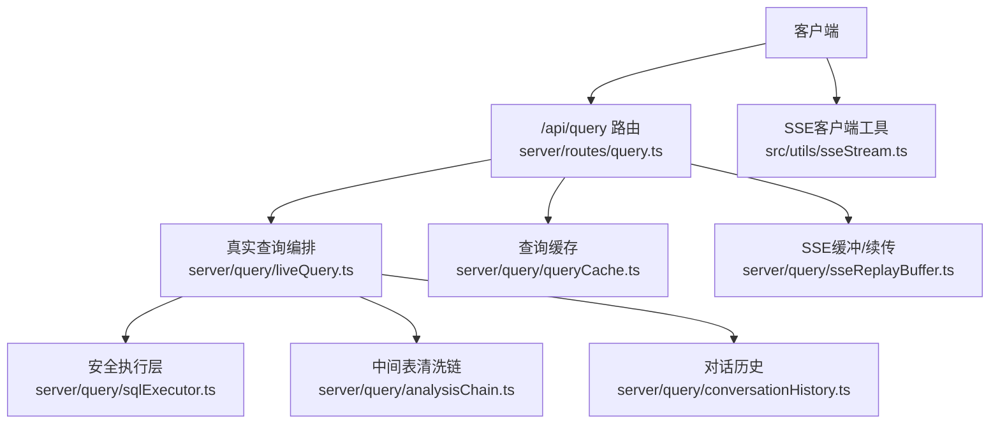
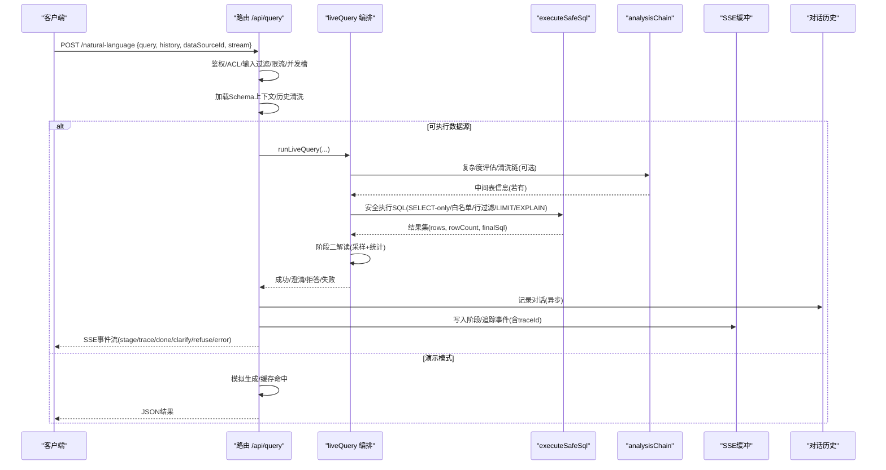
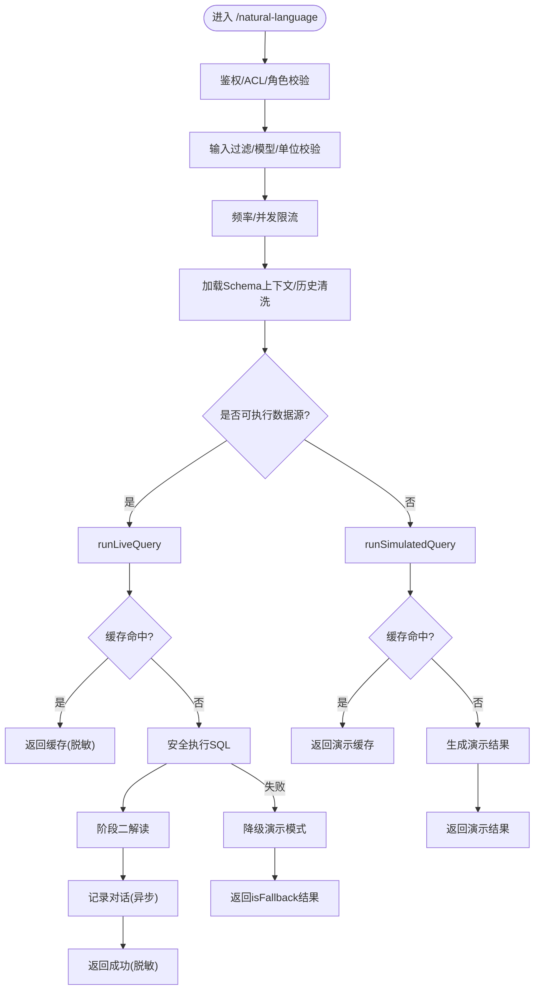
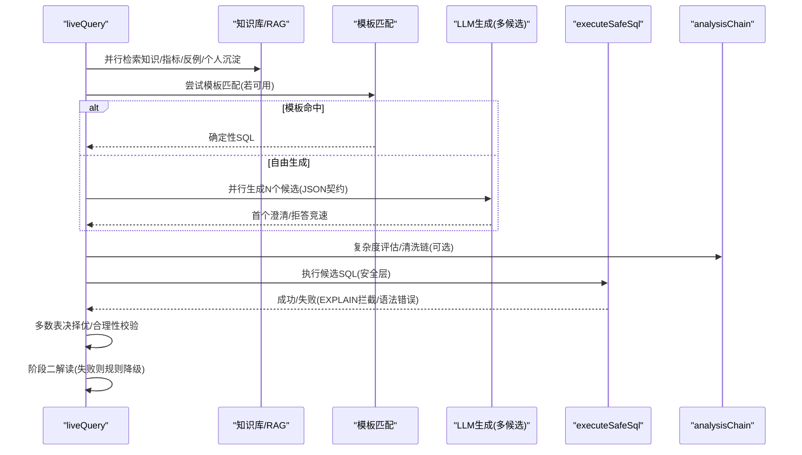
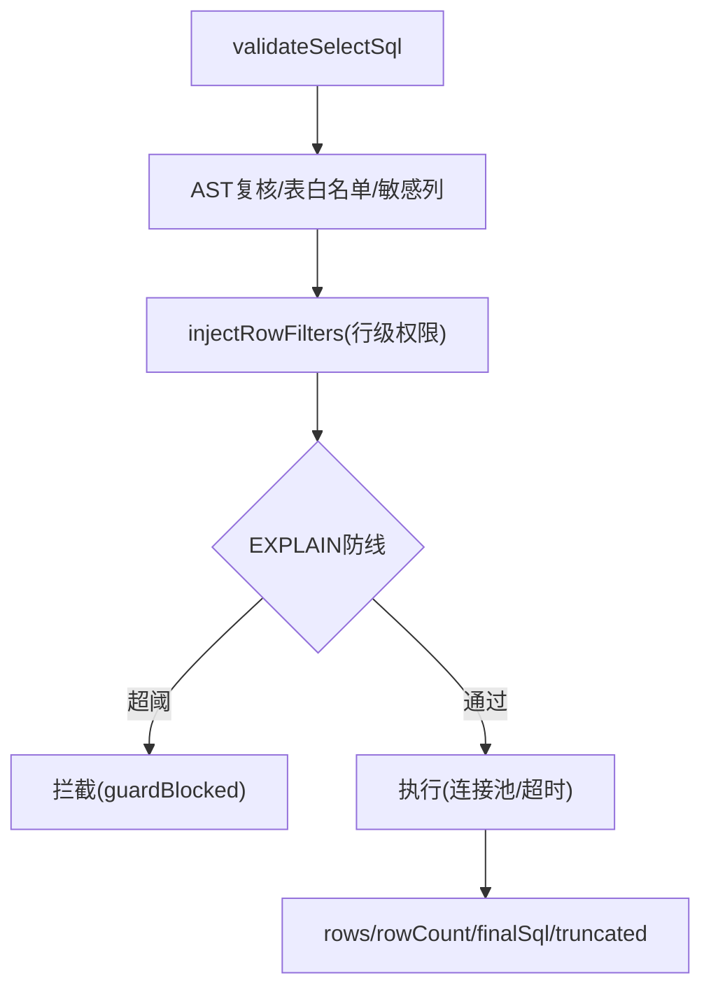
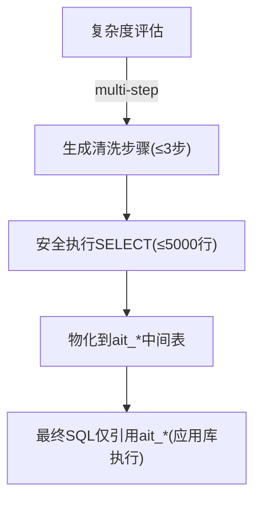
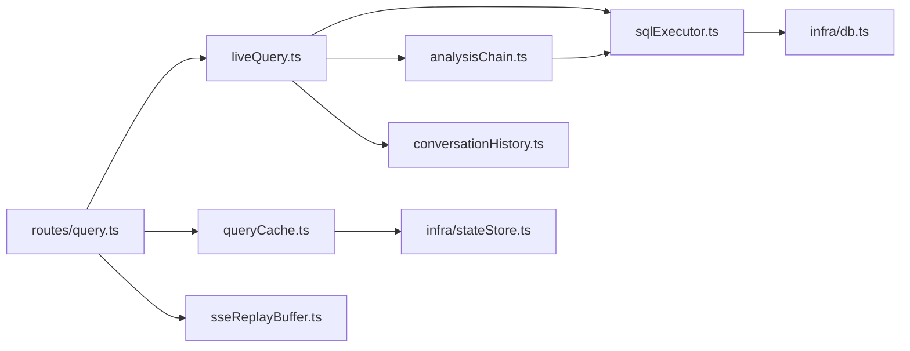

# 查询API

<cite>
**本文引用的文件**
- [server/routes/query.ts](file://server/routes/query.ts)
- [server/query/liveQuery.ts](file://server/query/liveQuery.ts)
- [server/query/analysisChain.ts](file://server/query/analysisChain.ts)
- [server/query/sqlExecutor.ts](file://server/query/sqlExecutor.ts)
- [server/query/conversationHistory.ts](file://server/query/conversationHistory.ts)
- [server/query/queryCache.ts](file://server/query/queryCache.ts)
- [server/query/sseReplayBuffer.ts](file://server/query/sseReplayBuffer.ts)
- [src/utils/sseStream.ts](file://src/utils/sseStream.ts)
- [server/routes/conversation.ts](file://server/routes/conversation.ts)
</cite>

## 目录
1. [简介](#简介)
2. [项目结构](#项目结构)
3. [核心组件](#核心组件)
4. [架构总览](#架构总览)
5. [详细组件分析](#详细组件分析)
6. [依赖关系分析](#依赖关系分析)
7. [性能与优化](#性能与优化)
8. [故障排查指南](#故障排查指南)
9. [结论](#结论)
10. [附录：请求响应示例与SSE客户端实现](#附录请求响应示例与sse客户端实现)

## 简介
本文件面向“智能问数据分析系统”的查询API，聚焦自然语言转SQL的核心接口、多轮对话管理、查询分析链路（意图理解→SQL生成→执行优化）、结果缓存与重试机制，以及SSE流式响应的客户端实现。文档以代码为依据，提供端到端流程、关键路径与可操作建议，帮助开发者快速集成与排障。

## 项目结构
- 路由层：统一入口在 server/routes/query.ts，暴露 /api/query 下的多个端点，包括主查询、计划模式、反馈、SQL重跑、下钻等。
- 编排层：server/query/liveQuery.ts 负责两阶段真实查询编排（阶段一生成SQL并安全执行；阶段二基于真实数据生成解读）。
- 安全执行层：server/query/sqlExecutor.ts 提供SELECT-only校验、表白名单、敏感列拒绝、行级权限注入、EXPLAIN防线、连接池与超时控制。
- 中间表清洗链：server/query/analysisChain.ts 对复杂问题先做复杂度评估，必要时在源库执行SELECT清洗并物化到应用库中间表，最终查询可引用。
- 对话历史：server/query/conversationHistory.ts 记录每次问数的问题/SQL/摘要/状态，支持检索、删除与个人few-shot沉淀。
- 缓存：server/query/queryCache.ts 提供L1精确缓存与L2语义缓存（embedding相似度），支持Redis或内存模式。
- SSE与断线续传：server/query/sseReplayBuffer.ts 维护事件缓冲与订阅；src/utils/sseStream.ts 提供前端解析SSE的工具。

**图表来源**
- [server/routes/query.ts:47-393](file://server/routes/query.ts#L47-L393)
- [server/query/liveQuery.ts:189-749](file://server/query/liveQuery.ts#L189-L749)
- [server/query/sqlExecutor.ts:734-800](file://server/query/sqlExecutor.ts#L734-L800)
- [server/query/analysisChain.ts:269-326](file://server/query/analysisChain.ts#L269-L326)
- [server/query/queryCache.ts:43-90](file://server/query/queryCache.ts#L43-L90)
- [server/query/sseReplayBuffer.ts:42-84](file://server/query/sseReplayBuffer.ts#L42-L84)
- [src/utils/sseStream.ts:38-116](file://src/utils/sseStream.ts#L38-L116)

**章节来源**
- [server/routes/query.ts:1-710](file://server/routes/query.ts#L1-L710)

## 核心组件
- 查询主端点 POST /api/query/natural-language：六层防护（输入过滤、角色/ACL、上下文、历史清洗、频率/并发限流、审计），支持live/simulated双链路、SSE流式、推导留痕、计划模式、缓存命中与降级。
- 真实查询编排 runLiveQuery：并行构建七路上下文（few-shot、知识库RAG、外部知识、指标、反例、个人沉淀、铁律），模板匹配优先，多候选并行生成+多数表决择优，失败回喂重试（最多3次），EXPLAIN防线拦截一次自纠错机会。
- 安全执行 executeSafeSql：SELECT-only、表白名单、敏感列拒绝、AST复核、行级权限注入、LIMIT强制、EXPLAIN防线、场景化连接池与超时。
- 中间表清洗链 analysisChain：复杂度评估→多步清洗→物化中间表→仅允许引用ait_*的应用库执行。
- 对话历史 conversationHistory：落库记录、窗口清理、个人few-shot检索。
- 查询缓存 queryCache：L1精确键 + L2语义索引（阈值默认0.95），支持Redis或内存，TTL可配置。
- SSE与断线续传 sseReplayBuffer：事件入缓冲、按traceId回放增量、订阅终态。
- 前端SSE工具 sseStream：解析event/data/id，分发stage/trace/chunk/终端事件，支持断线续传序号。

**章节来源**
- [server/routes/query.ts:47-393](file://server/routes/query.ts#L47-L393)
- [server/query/liveQuery.ts:189-749](file://server/query/liveQuery.ts#L189-L749)
- [server/query/sqlExecutor.ts:291-387](file://server/query/sqlExecutor.ts#L291-L387)
- [server/query/analysisChain.ts:97-112](file://server/query/analysisChain.ts#L97-L112)
- [server/query/conversationHistory.ts:43-65](file://server/query/conversationHistory.ts#L43-L65)
- [server/query/queryCache.ts:23-34](file://server/query/queryCache.ts#L23-L34)
- [server/query/sseReplayBuffer.ts:42-84](file://server/query/sseReplayBuffer.ts#L42-L84)
- [src/utils/sseStream.ts:38-116](file://src/utils/sseStream.ts#L38-L116)

## 架构总览

**图表来源**
- [server/routes/query.ts:47-393](file://server/routes/query.ts#L47-L393)
- [server/query/liveQuery.ts:189-749](file://server/query/liveQuery.ts#L189-L749)
- [server/query/sqlExecutor.ts:734-800](file://server/query/sqlExecutor.ts#L734-L800)
- [server/query/analysisChain.ts:269-326](file://server/query/analysisChain.ts#L269-L326)
- [server/query/sseReplayBuffer.ts:42-84](file://server/query/sseReplayBuffer.ts#L42-L84)

## 详细组件分析

### 查询主端点 POST /api/query/natural-language
- 输入校验与防护：字符过滤、注入特征拒绝、长度截断；模型/金额单位白名单校验；用户并发槽串行化（防昂贵LLM调用并发）；频率限制。
- 上下文与历史：加载Schema上下文（含scope/敏感列过滤/行级权限），历史消息逐条过注入检测，最多保留5轮。
- 双阶段真实执行：数据库型/已落库文件型走live链路；否则走simulated演示模式。
- 缓存策略：L1精确键 + L2语义缓存（相似度阈值默认0.95），命中直接返回；refreshCache=true跳过读缓存。
- SSE流式：stream=true时按阶段推送事件（understanding/sql_ready/executed/analyzing/trace），错误/澄清/拒答为终态事件；支持断线续传 GET /api/query/stream-replay/:traceId。
- 计划模式：携带planId时校验有效性并跳过澄清，按步骤引导生成SQL。
- 审计与降级：全链路审计；真实执行失败降级演示模式（带isFallback标识）。

**图表来源**
- [server/routes/query.ts:47-393](file://server/routes/query.ts#L47-L393)

**章节来源**
- [server/routes/query.ts:47-393](file://server/routes/query.ts#L47-L393)

### 真实查询编排 runLiveQuery
- 上下文并行构建：few-shot样例、知识库RAG、外部知识库、语义指标、点踩反例、个人对话沉淀、铁律规则。
- 模板匹配优先：命中则确定性拼装SQL，零偏差兜底；未命中则自由生成。
- 多候选并行生成：简单问题走快速模型路由，复杂问题主模型；首轮澄清/拒答竞速返回。
- 安全执行与多数表决：多候选执行后按结果签名分组多数派胜出；空结果/全NULL触发合理性校验并回喂重试（最多3次）。
- EXPLAIN防线：预估扫描超阈值拦截，给一次收窄条件自纠错机会（防空转）。
- 阶段二解读：真实rows采样+列统计回喂LLM生成解读；异常时规则化降级。

**图表来源**
- [server/query/liveQuery.ts:189-749](file://server/query/liveQuery.ts#L189-L749)
- [server/query/analysisChain.ts:97-112](file://server/query/analysisChain.ts#L97-L112)
- [server/query/sqlExecutor.ts:629-662](file://server/query/sqlExecutor.ts#L629-L662)

**章节来源**
- [server/query/liveQuery.ts:189-749](file://server/query/liveQuery.ts#L189-L749)

### 安全执行层 executeSafeSql
- 校验与加固：SELECT-only、单语句、禁止危险关键字、表白名单、敏感列拒绝、AST复核、CTE名排除、行级权限注入（AST包裹派生表）。
- LIMIT强制：无LIMIT追加；有LIMIT则clamp到MAX_ROWS（默认10万）。
- EXPLAIN防线：MySQL/PG分别解析计划树，预估扫描超阈值拦截（fail-open放行EXPLAIN失败）。
- 连接池与超时：按数据源+场景分级池，交互/分析链/导出独立配额与超时；MySQL注入MAX_EXECUTION_TIME hint。
- 文件数据源：改道应用库执行，跳过EXPLAIN防线（针对业务库大扫描）。

**图表来源**
- [server/query/sqlExecutor.ts:291-387](file://server/query/sqlExecutor.ts#L291-L387)
- [server/query/sqlExecutor.ts:629-662](file://server/query/sqlExecutor.ts#L629-L662)
- [server/query/sqlExecutor.ts:734-800](file://server/query/sqlExecutor.ts#L734-L800)

**章节来源**
- [server/query/sqlExecutor.ts:291-387](file://server/query/sqlExecutor.ts#L291-L387)
- [server/query/sqlExecutor.ts:629-662](file://server/query/sqlExecutor.ts#L629-L662)
- [server/query/sqlExecutor.ts:734-800](file://server/query/sqlExecutor.ts#L734-L800)

### 中间表清洗链 analysisChain
- 复杂度评估：启发式信号+LLM评估，multi-step才启用清洗链。
- 多步清洗：每步SELECT-only安全执行，失败一次LLM自愈重试；行数上限5000。
- 物化中间表：剔除敏感列、推断列类型、批量写入应用库ait_*表，注册元数据（含TTL）。
- 应用库执行：仅允许引用已注册的ait_*表，单条SELECT，LIMIT 500。

**图表来源**
- [server/query/analysisChain.ts:97-112](file://server/query/analysisChain.ts#L97-L112)
- [server/query/analysisChain.ts:269-326](file://server/query/analysisChain.ts#L269-L326)
- [server/query/analysisChain.ts:361-384](file://server/query/analysisChain.ts#L361-L384)

**章节来源**
- [server/query/analysisChain.ts:97-112](file://server/query/analysisChain.ts#L97-L112)
- [server/query/analysisChain.ts:269-326](file://server/query/analysisChain.ts#L269-L326)
- [server/query/analysisChain.ts:361-384](file://server/query/analysisChain.ts#L361-L384)

### 对话历史与多轮管理
- 记录：每次问数成功后fire-and-forget落库（问题/SQL/摘要/状态/来源/耗时），失败也记录便于审计。
- 窗口清理：抽样触发清理，保留最近N条（默认500），避免写放大。
- 检索与删除：支持关键词模糊搜索本人某数据源的对话，支持删除本人记录。
- 个人few-shot：近100条成功问答按bigram重合+表重叠打分，取top2注入后续问数提示词。

**章节来源**
- [server/query/conversationHistory.ts:43-65](file://server/query/conversationHistory.ts#L43-L65)
- [server/query/conversationHistory.ts:76-90](file://server/query/conversationHistory.ts#L76-L90)
- [server/query/conversationHistory.ts:107-129](file://server/query/conversationHistory.ts#L107-L129)
- [server/query/conversationHistory.ts:158-203](file://server/query/conversationHistory.ts#L158-L203)
- [server/routes/conversation.ts:16-41](file://server/routes/conversation.ts#L16-L41)

### 查询缓存与性能优化
- L1精确缓存：归一化问题+数据源+模型变体作为键，命中直接返回（含DLP脱敏）。
- L2语义缓存：embedding相似度≥阈值（默认0.95）命中，返回原问题供前端标注“来自相似问题缓存”。
- TTL与容量：默认30分钟TTL，内存模式最大200项；Redis模式支持多实例共享，超大载荷不缓存。
- 失效：数据源结构变更后按前缀清理缓存与语义索引。

**章节来源**
- [server/query/queryCache.ts:23-34](file://server/query/queryCache.ts#L23-L34)
- [server/query/queryCache.ts:43-90](file://server/query/queryCache.ts#L43-L90)
- [server/query/queryCache.ts:116-129](file://server/query/queryCache.ts#L116-L129)
- [server/query/queryCache.ts:235-253](file://server/query/queryCache.ts#L235-L253)

### SSE流式与断线续传
- 服务端：stream=true时按阶段推送事件（stage/trace/done/clarify/refuse/error），事件先入缓冲再写流；客户端断开不影响后端继续执行。
- 断线续传：GET /api/query/stream-replay/:traceId 支持Last-Event-ID或after参数，回放增量事件直到终态；多实例部署可能404降级为完整重试。
- 前端：使用readSseStream解析event/data/id，分发onStage/onTrace/onChunk/onTerminal，错误事件标记sseTerminal用于区分网络中断与业务错误。

**章节来源**
- [server/routes/query.ts:118-153](file://server/routes/query.ts#L118-L153)
- [server/routes/query.ts:395-456](file://server/routes/query.ts#L395-L456)
- [server/query/sseReplayBuffer.ts:42-84](file://server/query/sseReplayBuffer.ts#L42-L84)
- [src/utils/sseStream.ts:38-116](file://src/utils/sseStream.ts#L38-L116)

## 依赖关系分析
- 路由依赖：auth/rateLimit/schemaContext/liveQuery/simulatedQuery/sqlExecutor/queryCache/queryPlan/queryHooks/sseReplayBuffer等。
- liveQuery依赖：llmClient、schemaLinking、knowledgeBase、externalKnowledge、metrics、ironRules、analysisChain、sqlTemplates、liveQueryPrompts/Parsers/Utils。
- sqlExecutor依赖：mysql2/pg、node-sql-parser、db连接池、monitoring、secretsCrypto、fileDataSource。
- analysisChain依赖：sqlExecutor、llmClient、schemaGuidance、queryTrace。
- conversationHistory依赖：db、queryFeedback、promptBudget。
- queryCache依赖：stateStore、llmClient(embedding)、monitoring。
- sseReplayBuffer：进程内Map缓冲，定时清扫。
- sseStream：浏览器ReadableStream解码SSE。

**图表来源**
- [server/routes/query.ts:17-42](file://server/routes/query.ts#L17-L42)
- [server/query/liveQuery.ts:16-43](file://server/query/liveQuery.ts#L16-L43)
- [server/query/sqlExecutor.ts:11-20](file://server/query/sqlExecutor.ts#L11-L20)
- [server/query/analysisChain.ts:7-14](file://server/query/analysisChain.ts#L7-L14)
- [server/query/conversationHistory.ts:8-12](file://server/query/conversationHistory.ts#L8-L12)
- [server/query/queryCache.ts:8-10](file://server/query/queryCache.ts#L8-L10)

**章节来源**
- [server/routes/query.ts:17-42](file://server/routes/query.ts#L17-L42)
- [server/query/liveQuery.ts:16-43](file://server/query/liveQuery.ts#L16-L43)
- [server/query/sqlExecutor.ts:11-20](file://server/query/sqlExecutor.ts#L11-L20)
- [server/query/analysisChain.ts:7-14](file://server/query/analysisChain.ts#L7-L14)
- [server/query/conversationHistory.ts:8-12](file://server/query/conversationHistory.ts#L8-L12)
- [server/query/queryCache.ts:8-10](file://server/query/queryCache.ts#L8-L10)

## 性能与优化
- 并发与限流：用户并发槽串行化（昂贵LLM调用保护），频率限制滑动窗口。
- 缓存命中：L1精确+L2语义（阈值0.95），演示模式同样缓存命中，显著降低延迟。
- 模型路由：简单单表走快速模型（环境变量可调），复杂问题主模型保证口径正确性。
- 多候选并行：全并行生成候选，澄清/拒答竞速返回，减少等待时间。
- EXPLAIN防线：拦截大扫描查询，保护数据源性能。
- 连接池分级：按数据源+场景分配池大小与超时，避免相互影响。
- 中间表清洗：复杂问题先清洗物化，最终查询范围小、速度快。
- DLP脱敏：响应出口按角色脱敏，避免敏感数据泄露。

[本节为通用性能讨论，无需特定文件来源]

## 故障排查指南
- 输入非法/越权：检查sanitizeQuestion、角色/ACL校验、dataSourceId权限。
- 缓存未命中：确认cacheKey包含variant（模型/单位），刷新缓存refreshCache=true。
- SQL被拒：查看executeSafeSql返回reason（表不在白名单/敏感列/非SELECT/INTO等）。
- EXPLAIN拦截：根据guardBlocked提示增加筛选条件收窄范围。
- 澄清/拒答：首轮首个候选命中澄清/拒答即返回，需调整问题或数据源能力。
- SSE断线：使用GET /api/query/stream-replay/:traceId续传；注意Last-Event-ID或after参数。
- 对话历史：检索/删除接口报错检查userId与dataSourceId权限。

**章节来源**
- [server/routes/query.ts:70-109](file://server/routes/query.ts#L70-L109)
- [server/query/sqlExecutor.ts:291-387](file://server/query/sqlExecutor.ts#L291-L387)
- [server/query/sqlExecutor.ts:629-662](file://server/query/sqlExecutor.ts#L629-L662)
- [server/query/liveQuery.ts:427-467](file://server/query/liveQuery.ts#L427-L467)
- [server/routes/query.ts:395-456](file://server/routes/query.ts#L395-L456)
- [server/routes/conversation.ts:16-41](file://server/routes/conversation.ts#L16-L41)

## 结论
该查询API以“安全先行、性能优先、体验流畅”为核心设计：严格的安全执行层保障数据安全，多层缓存与模型路由提升性能，SSE流式与断线续传改善用户体验，中间表清洗链支撑复杂分析，对话历史沉淀驱动自学习。通过模块化编排与可观测性（审计/监控/追踪），系统在可用性、准确性与安全性之间取得平衡。

[本节为总结，无需特定文件来源]

## 附录：请求响应示例与SSE客户端实现

### 请求示例
- 简单查询（JSON响应）
  - 方法：POST /api/query/natural-language
  - 请求体：{ "query": "各客户类型的数量", "dataSourceId": "ds_001", "history": [] }
  - 响应：{ "success": true, "result": {...}, "executionTimeMs": 1234, "dataProvenance": "live|simulated", "traceId": "tr_xxx" }
- 复杂分析（开启深度分析与金额单位）
  - 请求体：{ "query": "去除异常值后的月度销售额中位数", "dataSourceId": "ds_001", "deepAnalysis": true, "amountUnit": "万元" }
- 流式输出（SSE）
  - 请求体：{ "query": "...", "dataSourceId": "ds_001", "stream": true }
  - 响应：text/event-stream，事件包括 stage/trace/done/clarify/refuse/error

**章节来源**
- [server/routes/query.ts:47-393](file://server/routes/query.ts#L47-L393)

### SSE客户端实现指南
- 使用readSseStream消费Response.body，处理以下回调：
  - onStage：显示进度文案（如“正在理解问题语义…”、“SQL已生成…”等）。
  - onTrace：追加步骤器展示推导过程。
  - onChunk：流式文本内容（打字机效果）。
  - onTerminal：接收done/clarify/refuse，渲染最终结果或澄清选项。
  - onEventId：记录最后事件序号，用于断线续传。
- 断线续传：
  - 监听error事件且err.sseTerminal为true时，发起GET /api/query/stream-replay/:traceId?after=lastSeq续传。
  - 若返回404（多实例未命中缓冲），降级为完整重试。

**章节来源**
- [src/utils/sseStream.ts:38-116](file://src/utils/sseStream.ts#L38-L116)
- [server/routes/query.ts:395-456](file://server/routes/query.ts#L395-L456)