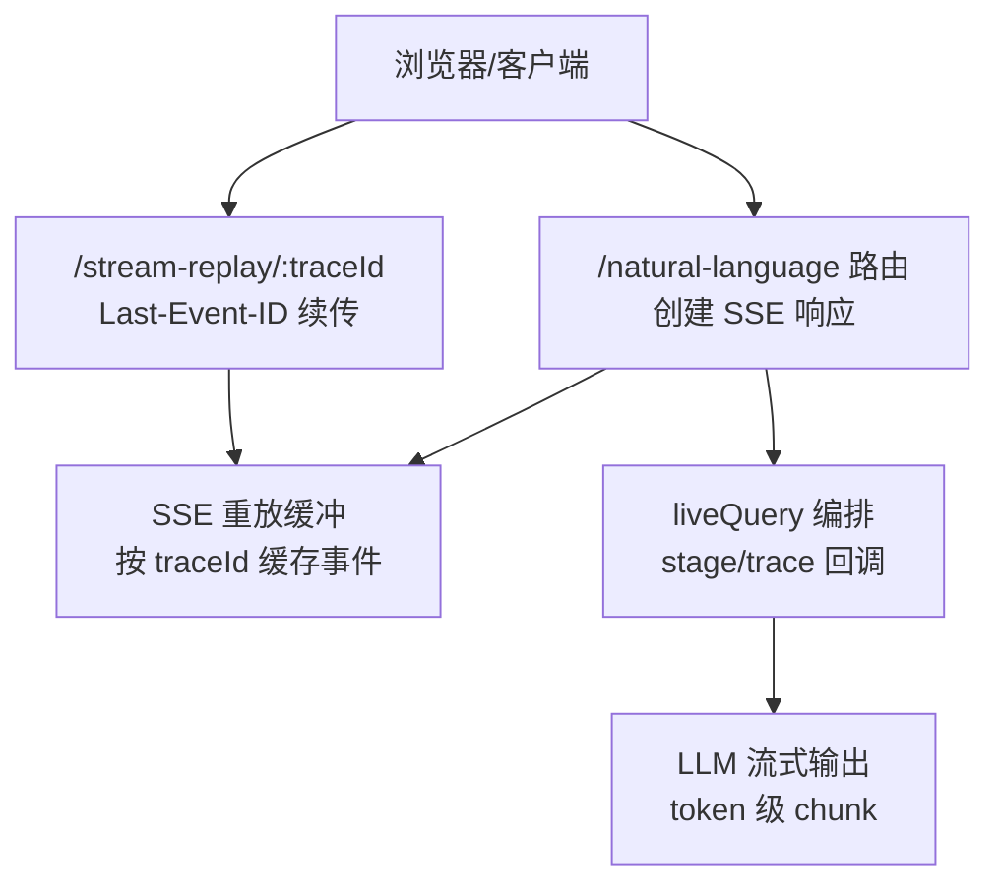
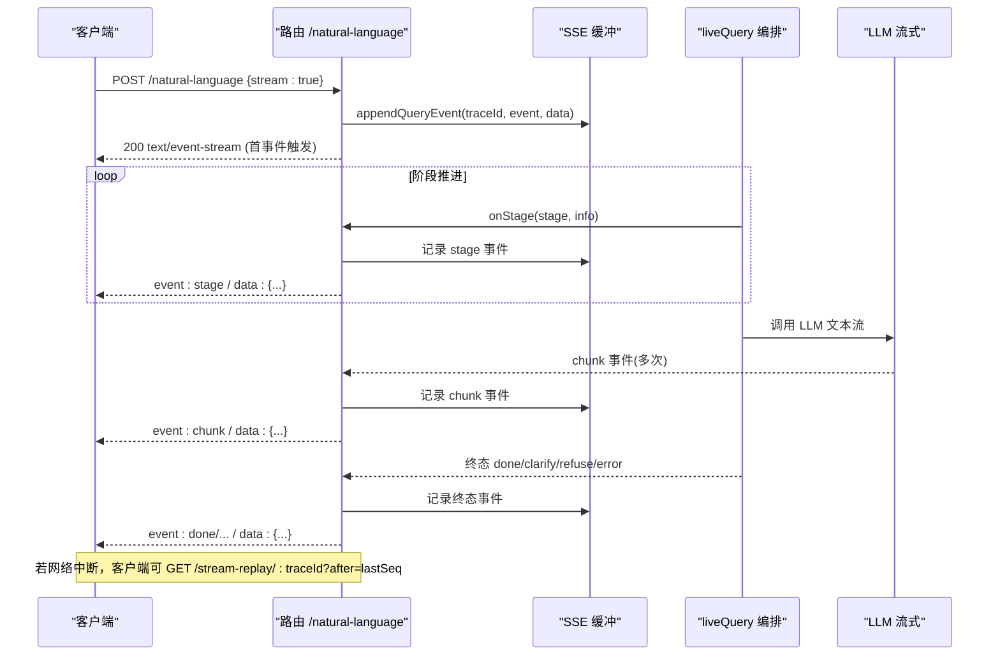
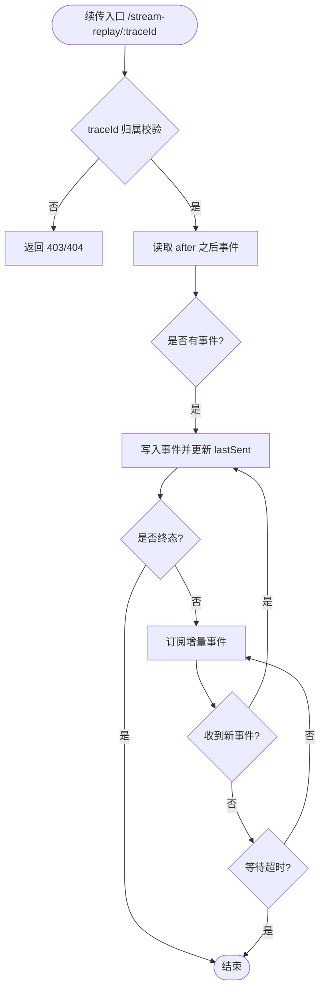
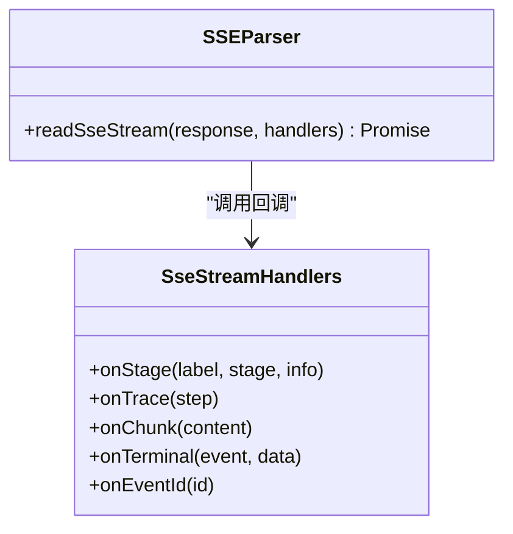
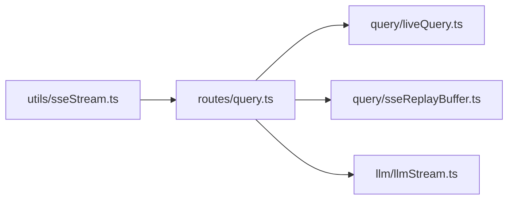

# 流式响应处理

<cite>
**本文引用的文件**
- [server/routes/query.ts](file://server/routes/query.ts)
- [server/query/sseReplayBuffer.ts](file://server/query/sseReplayBuffer.ts)
- [src/utils/sseStream.ts](file://src/utils/sseStream.ts)
- [server/llm/llmStream.ts](file://server/llm/llmStream.ts)
- [server/query/liveQuery.ts](file://server/query/liveQuery.ts)
</cite>

## 目录
1. [简介](#简介)
2. [项目结构](#项目结构)
3. [核心组件](#核心组件)
4. [架构总览](#架构总览)
5. [详细组件分析](#详细组件分析)
6. [依赖关系分析](#依赖关系分析)
7. [性能考量](#性能考量)
8. [故障排查指南](#故障排查指南)
9. [结论](#结论)
10. [附录](#附录)

## 简介
本文件面向“智能问数据分析系统”的流式响应能力，系统性说明 SSE（Server-Sent Events）的实现机制、事件类型与数据格式、连接管理与断线续传（traceId、事件缓冲、Last-Event-ID）、以及客户端实现要点。同时给出在实时数据分析中的优势与典型使用场景。

## 项目结构
SSE 相关能力由服务端路由、查询编排、LLM 流式输出、前端解析工具共同组成：
- 服务端路由负责创建 SSE 响应、事件入缓冲、回放接口
- 查询编排按阶段推送 stage/trace/done/clarify/refuse/error 等事件
- LLM 层提供 token 级流式输出（chunk）
- 前端工具负责解析 SSE、维护事件序号、错误降级与重连

图表来源
- [server/routes/query.ts:118-153](file://server/routes/query.ts#L118-L153)
- [server/query/sseReplayBuffer.ts:41-84](file://server/query/sseReplayBuffer.ts#L41-L84)
- [server/query/liveQuery.ts:189-200](file://server/query/liveQuery.ts#L189-L200)
- [server/llm/llmStream.ts:35-133](file://server/llm/llmStream.ts#L35-L133)

章节来源
- [server/routes/query.ts:118-153](file://server/routes/query.ts#L118-L153)
- [server/query/sseReplayBuffer.ts:1-132](file://server/query/sseReplayBuffer.ts#L1-L132)
- [server/query/liveQuery.ts:189-200](file://server/query/liveQuery.ts#L189-L200)
- [server/llm/llmStream.ts:35-133](file://server/llm/llmStream.ts#L35-L133)

## 核心组件
- SSE 事件缓冲与续传
  - 以 traceId 为键的事件缓冲，分配单调递增的 seq 作为 SSE id
  - 终态事件集合：done/clarify/refuse/error；到达后不再追加新事件
  - TTL 清理：终态 10 分钟、进行中 30 分钟
  - 订阅机制：续传端点回放存量后订阅增量，保证不重不漏
- 流式响应路由
  - 首段事件时设置 text/event-stream 头并开启 keep-alive
  - 每个事件先入缓冲再写入响应体，客户端断开不影响后续执行
  - 提供 /stream-replay/:traceId 支持 Last-Event-ID 与 after 参数
- 前端 SSE 解析器
  - 逐块解码、按空行分段、解析 event/data/id
  - 分发 onStage/onTrace/onChunk/onTerminal/onEventId
  - error 事件标记 sseTerminal，用于区分业务终态错误与网络中断
- LLM 流式输出
  - 将后端 LLM 的 token 流包装为 StreamingChunk，通过 chunk 事件推送到前端
  - 支持多后端（如 Qwen、Ollama），统一解析 SSE 帧

章节来源
- [server/query/sseReplayBuffer.ts:10-34](file://server/query/sseReplayBuffer.ts#L10-L34)
- [server/query/sseReplayBuffer.ts:41-132](file://server/query/sseReplayBuffer.ts#L41-L132)
- [server/routes/query.ts:118-153](file://server/routes/query.ts#L118-L153)
- [server/routes/query.ts:395-456](file://server/routes/query.ts#L395-L456)
- [src/utils/sseStream.ts:24-116](file://src/utils/sseStream.ts#L24-L116)
- [server/llm/llmStream.ts:23-133](file://server/llm/llmStream.ts#L23-L133)

## 架构总览
下图展示一次完整 SSE 请求的生命周期：从路由创建响应、阶段事件推送、LLM 流式内容、到终态结束与断线续传。

图表来源
- [server/routes/query.ts:118-153](file://server/routes/query.ts#L118-L153)
- [server/query/sseReplayBuffer.ts:41-84](file://server/query/sseReplayBuffer.ts#L41-L84)
- [server/query/liveQuery.ts:189-200](file://server/query/liveQuery.ts#L189-L200)
- [server/llm/llmStream.ts:35-133](file://server/llm/llmStream.ts#L35-L133)

## 详细组件分析

### SSE 事件类型与数据格式
- event: stage
  - 含义：查询流程的阶段进度，如 understanding/introspecting/sql_ready/executed/analyzing
  - 用途：前端渲染进度文案与步骤状态
  - 数据来源：liveQuery 在各阶段调用 onStage
- event: trace
  - 含义：推导留痕步骤（如 schema 圈表、知识库检索、指标命中、SQL 生成等）
  - 用途：前端步骤器展示，辅助审计与调试
  - 数据来源：liveQuery 各步骤回调 onTrace
- event: chunk
  - 含义：LLM 生成的 token 片段，用于打字机效果
  - 用途：实时渲染回答内容
  - 数据来源：LLM 流式输出经路由转发
- event: done
  - 含义：成功完成，携带最终结果与元信息（含 traceId）
  - 用途：结束流式显示，进入结果渲染
- event: clarify
  - 含义：问题存在歧义，返回澄清问题与候选理解
  - 用途：前端提示用户确认后再提交
- event: refuse
  - 含义：问题与数据源无关或超出能力，拒绝回答
  - 用途：如实反馈原因，不走演示数据兜底
- event: error
  - 含义：查询失败（业务错误或系统异常）
  - 用途：前端区分“业务终态错误”与“网络中断”，仅后者允许断线续传

章节来源
- [server/query/liveQuery.ts:189-200](file://server/query/liveQuery.ts#L189-L200)
- [server/query/liveQuery.ts:474-674](file://server/query/liveQuery.ts#L474-L674)
- [server/routes/query.ts:249-290](file://server/routes/query.ts#L249-L290)
- [src/utils/sseStream.ts:98-116](file://src/utils/sseStream.ts#L98-L116)

### 断线续传机制（traceId、事件缓冲、Last-Event-ID）
- traceId
  - 每次问数生成唯一 traceId，贯穿全链路，用于关联事件与回放
- 事件缓冲
  - 每个事件分配单调递增的 seq（SSE id），存入按 traceId 索引的缓冲
  - 终态事件到达后停止追加，TTL 到期自动清理
- Last-Event-ID
  - 续传端点支持 Last-Event-ID 头与 ?after= 参数，回放指定序号之后的事件
  - 回放完成后若未达终态则订阅增量，直到终态或超时关闭
- 权限校验
  - 仅本人或管理员可续传他人会话，防止越权

图表来源
- [server/routes/query.ts:395-456](file://server/routes/query.ts#L395-L456)
- [server/query/sseReplayBuffer.ts:75-109](file://server/query/sseReplayBuffer.ts#L75-L109)

章节来源
- [server/routes/query.ts:395-456](file://server/routes/query.ts#L395-L456)
- [server/query/sseReplayBuffer.ts:41-132](file://server/query/sseReplayBuffer.ts#L41-L132)

### 连接管理
- 首事件触发响应头
  - 首个事件发送时设置 Content-Type: text/event-stream; charset=utf-8
  - 附加 Cache-Control: no-cache、Connection: keep-alive、X-Accel-Buffering: no
- 客户端断开处理
  - res.write 抛错表示客户端已断开，但事件仍入缓冲，主链路继续执行
  - 续传端点在 req close 时释放订阅与定时器
- 生命周期钩子
  - before/after 钩子用于审计、缓存与插件扩展

章节来源
- [server/routes/query.ts:118-153](file://server/routes/query.ts#L118-L153)
- [server/routes/query.ts:395-456](file://server/routes/query.ts#L395-L456)

### 前端 SSE 解析与事件分发
- 解析策略
  - 使用 ReadableStream + TextDecoder 逐块解码
  - 按空行分割消息，解析 event:/data:/id: 行
- 事件分发
  - onStage：阶段进度文案映射（understanding/introspecting/sql_ready/executed/analyzing）
  - onTrace：推导步骤追加
  - onChunk：流式内容累积与实时推送
  - onTerminal：终态事件（done/clarify/refuse）
  - onEventId：记录 SSE id（用于断线续传锚点）
- 错误处理
  - error 事件标记 sseTerminal，供调用方区分业务终态错误与网络中断

图表来源
- [src/utils/sseStream.ts:24-116](file://src/utils/sseStream.ts#L24-L116)

章节来源
- [src/utils/sseStream.ts:37-116](file://src/utils/sseStream.ts#L37-L116)

### LLM 流式输出（Token 级）
- 将后端 LLM 的 SSE 流转换为 StreamingChunk
- 支持多引擎（Qwen、Ollama），统一解析 data: {...} 帧
- 将 chunk 事件透传到路由，再由路由写入 SSE 响应

章节来源
- [server/llm/llmStream.ts:35-133](file://server/llm/llmStream.ts#L35-L133)

## 依赖关系分析
- 路由依赖 liveQuery 的 onStage/onTrace 回调，驱动阶段与步骤事件
- 路由依赖 sseReplayBuffer 进行事件缓冲与续传
- 前端依赖 sseStream 解析 SSE，维护事件序号与错误降级
- LLM 流式输出通过路由桥接到 SSE 通道

图表来源
- [server/routes/query.ts:118-153](file://server/routes/query.ts#L118-L153)
- [server/query/liveQuery.ts:189-200](file://server/query/liveQuery.ts#L189-L200)
- [server/query/sseReplayBuffer.ts:41-84](file://server/query/sseReplayBuffer.ts#L41-L84)
- [server/llm/llmStream.ts:35-133](file://server/llm/llmStream.ts#L35-L133)
- [src/utils/sseStream.ts:37-116](file://src/utils/sseStream.ts#L37-L116)

章节来源
- [server/routes/query.ts:118-153](file://server/routes/query.ts#L118-L153)
- [server/query/liveQuery.ts:189-200](file://server/query/liveQuery.ts#L189-L200)
- [server/query/sseReplayBuffer.ts:41-84](file://server/query/sseReplayBuffer.ts#L41-L84)
- [server/llm/llmStream.ts:35-133](file://server/llm/llmStream.ts#L35-L133)
- [src/utils/sseStream.ts:37-116](file://src/utils/sseStream.ts#L37-L116)

## 性能考量
- 事件缓冲上限与 TTL
  - 单 trace 事件上限保护（防刷屏）
  - 终态 10 分钟、进行中 30 分钟 TTL，定期清扫降低内存占用
- 流式传输优化
  - 首事件才写响应头，减少无用开销
  - X-Accel-Buffering: no 避免反向代理缓冲导致延迟
- 并发控制
  - 同用户并发限 1，昂贵 LLM 调用串行化，避免资源争用
- 前端解析效率
  - 按空行分段与增量解码，避免整块内存放大

[本节为通用指导，不直接分析具体文件]

## 故障排查指南
- 常见错误与定位
  - 404：traceId 不存在或已过期，需重新发起查询
  - 403：无权续传他人会话
  - 400：traceId 格式非法
  - 429：频率限制或上一个查询仍在进行中
- 错误分类
  - 业务终态错误（error 事件且 sseTerminal=true）：直接呈现，不重试
  - 网络中断：允许断线续传，优先走 /stream-replay 恢复
- 日志与审计
  - 路由层记录审计信息（状态、耗时、SQL、行数等）
  - 推导步骤旁路落库，便于事后复盘

章节来源
- [server/routes/query.ts:395-456](file://server/routes/query.ts#L395-L456)
- [server/routes/query.ts:100-116](file://server/routes/query.ts#L100-L116)
- [src/utils/sseStream.ts:106-116](file://src/utils/sseStream.ts#L106-L116)

## 结论
该系统的 SSE 流式响应以 traceId 为核心，结合事件缓冲与 Last-Event-ID 续传，实现了高可用的实时交互体验。通过阶段事件与推导留痕，前端可精准呈现进度与过程；LLM 的 token 级流式输出带来即时反馈。整体设计兼顾了可靠性、可观测性与性能，适用于实时数据分析、交互式问答等场景。

[本节为总结性内容，不直接分析具体文件]

## 附录

### 客户端 SSE 连接实现示例（要点）
- 建立连接
  - 使用 fetch 发起 POST /natural-language，设置 stream: true
  - 获取 Response.body.getReader()，交由解析器消费
- 事件监听
  - onStage：更新进度文案
  - onTrace：追加步骤
  - onChunk：累积并实时渲染内容
  - onTerminal：处理 done/clarify/refuse
  - onEventId：记录最后收到的 SSE id
- 重连机制
  - 捕获网络错误后，携带 traceId 与 last-event-id 调用 /stream-replay/:traceId?after=lastSeq
  - 回放完成后继续订阅增量，直到终态
- 错误处理
  - 区分业务终态错误与网络中断
  - 对 404/403/400 等错误进行降级提示

[本节为概念性说明，不直接分析具体文件]

### 实时数据分析的优势与场景
- 优势
  - 低延迟：边生成边展示，提升用户体验
  - 可观测：阶段与步骤事件便于监控与排障
  - 韧性：断线续传保障长任务稳定性
- 场景
  - 自然语言问数、交互式报表生成、复杂 SQL 分析与解读、大模型推理过程的可视化

[本节为概念性说明，不直接分析具体文件]