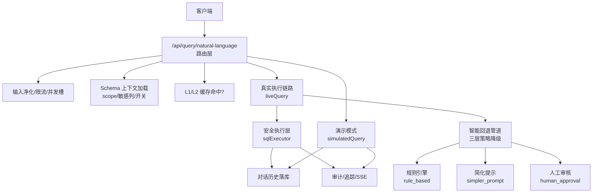
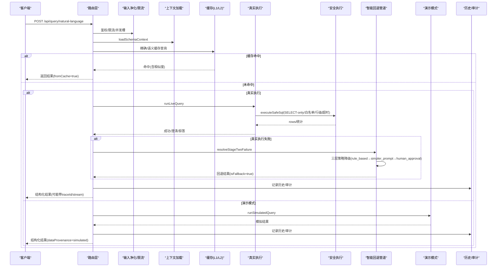
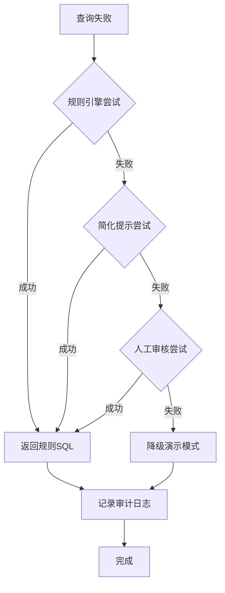
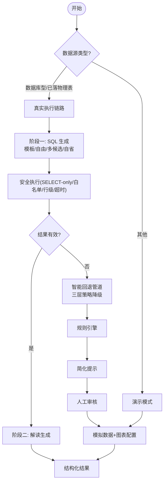
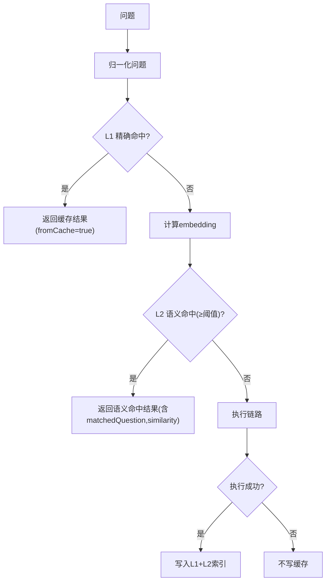
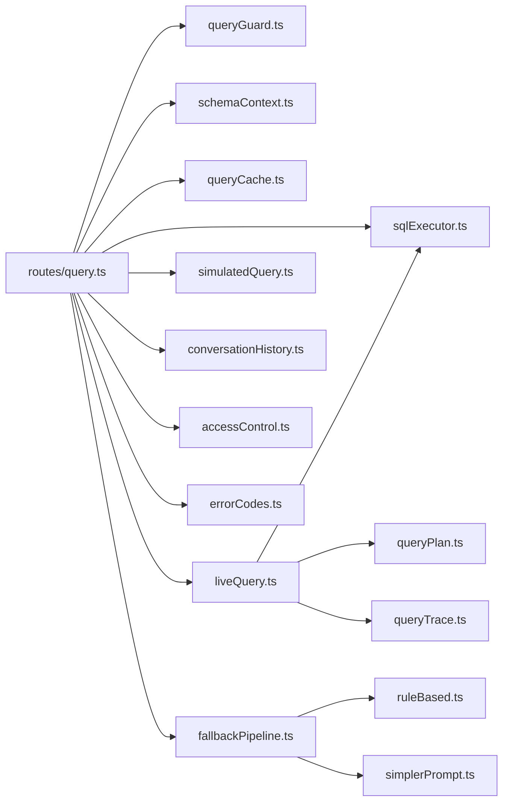

# 自然语言查询接口

<cite>
**本文引用的文件**
- [server/routes/query.ts](file://server/routes/query.ts)
- [server/query/liveQuery.ts](file://server/query/liveQuery.ts)
- [server/query/simulatedQuery.ts](file://server/query/simulatedQuery.ts)
- [server/query/queryGuard.ts](file://server/query/queryGuard.ts)
- [server/query/schemaContext.ts](file://server/query/schemaContext.ts)
- [server/query/conversationHistory.ts](file://server/query/conversationHistory.ts)
- [server/query/queryCache.ts](file://server/query/queryCache.ts)
- [server/query/sqlExecutor.ts](file://server/query/sqlExecutor.ts)
- [server/auth/accessControl.ts](file://server/auth/accessControl.ts)
- [server/infra/errorCodes.ts](file://server/infra/errorCodes.ts)
- [server/utils/fallback/fallbackPipeline.ts](file://server/utils/fallback/fallbackPipeline.ts)
- [server/utils/fallbackStrategies/ruleBased.ts](file://server/utils/fallbackStrategies/ruleBased.ts)
- [server/utils/fallbackStrategies/simplerPrompt.ts](file://server/utils/fallbackStrategies/simplerPrompt.ts)
- [server/serverFallbacks.ts](file://server/serverFallbacks.ts)
</cite>

## 更新摘要
**所做更改**
- 新增集成回退管道机制章节，详细说明三层策略降级流程
- 更新真实执行链路部分，包含自动回退触发逻辑
- 增强错误处理章节，涵盖回退策略的审计和监控
- 更新架构图表以反映新的回退流程
- 新增回退策略的技术实现细节

## 目录
1. [简介](#简介)
2. [项目结构](#项目结构)
3. [核心组件](#核心组件)
4. [架构总览](#架构总览)
5. [详细组件分析](#详细组件分析)
6. [依赖关系分析](#依赖关系分析)
7. [性能考虑](#性能考虑)
8. [故障排查指南](#故障排查指南)
9. [结论](#结论)
10. [附录：请求与响应示例](#附录请求与响应示例)

## 简介
本文件面向 POST /api/query/natural-language 端点，提供完整的功能说明、参数规范、响应格式、错误处理机制，以及六层防护、真实执行与演示模式的区别、缓存机制（精确匹配与语义缓存）的详细说明。**最新更新**：系统现已集成智能回退管道，当 NL2SQL 查询失败时自动触发三层恢复策略，显著提升查询成功率和服务可用性。该端点是"智能问数"的核心入口，将自然语言问题转化为可执行的 SQL，并在安全边界内执行，最终返回结构化结果与可视化配置。

## 项目结构
- 路由层：server/routes/query.ts 定义 /api/query/* 系列端点，其中 natural-language 是主链路。
- 业务编排：server/query/liveQuery.ts 负责真实执行链路的两阶段编排（SQL 生成→安全执行→解读）。
- 演示模式：server/query/simulatedQuery.ts 在非数据库型数据源时由 LLM 生成模拟数据与图表配置。
- **新增**：回退管道：server/utils/fallback/fallbackPipeline.ts 提供三层策略降级机制。
- 输入与上下文：server/query/queryGuard.ts 做输入净化；server/query/schemaContext.ts 加载 Schema 并做权限与敏感列过滤。
- 历史与自学习：server/query/conversationHistory.ts 记录对话历史，并提供个人 few-shot 检索。
- 缓存：server/query/queryCache.ts 实现 L1 精确缓存与 L2 语义缓存。
- 安全执行：server/query/sqlExecutor.ts 提供 SELECT-only、白名单、行级权限、超时等安全执行能力。
- 访问控制：server/auth/accessControl.ts 实现数据源 ACL（部门/个人授权）。
- 错误码：server/infra/errorCodes.ts 统一错误码，便于前端精准分支。

**图示来源**
- [server/routes/query.ts:47-393](file://server/routes/query.ts#L47-L393)
- [server/query/liveQuery.ts:189-749](file://server/query/liveQuery.ts#L189-L749)
- [server/utils/fallback/fallbackPipeline.ts:47-138](file://server/utils/fallback/fallbackPipeline.ts#L47-L138)
- [server/query/simulatedQuery.ts:75-114](file://server/query/simulatedQuery.ts#L75-L114)
- [server/query/sqlExecutor.ts:1-200](file://server/query/sqlExecutor.ts#L1-L200)

**章节来源**
- [server/routes/query.ts:1-782](file://server/routes/query.ts#L1-L782)

## 核心组件
- 路由与中间件：rateLimiter、authMiddleware、requireRole 保障基础鉴权与限流。
- 输入净化：sanitizeQuestion/sanitizeHistory 过滤控制字符、注入特征、长度限制。
- 上下文加载：loadSchemaContext 从数据源表读取 schema/scope/status/type，应用 scope 过滤、敏感列剔除、行级权限谓词，并缓存 5 分钟。
- 双链路选择：isLiveCapableType 判断是否走真实执行（mysql/postgresql/greenplum 或已落物理表的文件型），否则走演示模式。
- 真实执行：runLiveQuery 两阶段（SQL 生成+安全执行→解读），支持澄清、拒答、模板匹配、多候选多数表决、EXPLAIN 防线拦截、自省等。
- **新增**：智能回退管道：resolveStageTwoFailure 提供三层策略降级（rule_based → simpler_prompt → human_approval），自动处理查询失败场景。
- 演示模式：runSimulatedQuery 单阶段生成模拟数据与图表配置，拒绝无关问题。
- 缓存：L1 精确键 + L2 语义 embedding 相似度阈值命中，跨模型变体隔离。
- 历史与自学习：recordConversation 落库，loadConversationFewShot 作为个人 few-shot 反哺后续问数。
- 安全执行：executeSafeSql 强制 SELECT-only、表白名单、敏感列拒绝、LIMIT、超时、行级权限注入。
- 访问控制：checkDataSourceAccess 基于 ACL（部门/个人）校验数据源访问。

**章节来源**
- [server/query/queryGuard.ts:1-101](file://server/query/queryGuard.ts#L1-L101)
- [server/query/schemaContext.ts:1-172](file://server/query/schemaContext.ts#L1-L172)
- [server/query/liveQuery.ts:189-749](file://server/query/liveQuery.ts#L189-L749)
- [server/utils/fallback/fallbackPipeline.ts:1-138](file://server/utils/fallback/fallbackPipeline.ts#L1-L138)
- [server/query/simulatedQuery.ts:1-114](file://server/query/simulatedQuery.ts#L1-L114)
- [server/query/queryCache.ts:1-254](file://server/query/queryCache.ts#L1-L254)
- [server/query/conversationHistory.ts:1-204](file://server/query/conversationHistory.ts#L1-L204)
- [server/query/sqlExecutor.ts:1-200](file://server/query/sqlExecutor.ts#L1-L200)
- [server/auth/accessControl.ts:1-108](file://server/auth/accessControl.ts#L1-L108)

## 架构总览
POST /api/query/natural-language 的处理流程如下：
- 鉴权与限流：角色校验、数据源 ACL 检查、频率限制、并发槽控制。
- 输入净化：去除控制字符、拒绝注入指令、截断超长问题。
- 上下文加载：拉取 schema、scope、敏感列过滤、行级权限、AI 开关状态。
- 缓存命中：先查 L1 精确键，再查 L2 语义缓存（含相似度与命中原问题）。
- 链路选择：若为数据库型或已落物理表的文件型，进入真实执行；否则进入演示模式。
- 真实执行：阶段一生成 SQL（模板/自由生成、多候选、自省、EXPLAIN 防线），安全执行后阶段二生成解读。
- **新增**：智能回退：当真实执行失败时，自动触发三层回退策略（规则引擎 → 简化提示 → 人工审核）。
- 演示模式：LLM 直接生成模拟数据与图表配置。
- 结果处理：成功写缓存、记录对话历史、按角色脱敏输出；失败降级到演示模式并标记 isFallback。
- SSE 与追踪：可选流式事件推送与推导步骤回放。

**图示来源**
- [server/routes/query.ts:47-393](file://server/routes/query.ts#L47-L393)
- [server/query/liveQuery.ts:189-749](file://server/query/liveQuery.ts#L189-L749)
- [server/utils/fallback/fallbackPipeline.ts:47-138](file://server/utils/fallback/fallbackPipeline.ts#L47-L138)
- [server/query/simulatedQuery.ts:75-114](file://server/query/simulatedQuery.ts#L75-L114)
- [server/query/sqlExecutor.ts:1-200](file://server/query/sqlExecutor.ts#L1-L200)

## 详细组件分析

### 端点：POST /api/query/natural-language
- 功能：自然语言 → SQL → 真实执行/演示 → 结构化结果（图表/KPI/洞察/建议追问）。
- 关键参数（请求体）：
  - query: string，用户问题（必填，经 L1 净化）。
  - schema: any[]，可选；当无 dataSourceId 时使用前端提交的 schema（演示模式）。
  - dataSourceId: string，可选；指定数据源 ID，用于 ACL、上下文加载、缓存键。
  - model: object，可选；{ engine, model }，用于在请求内切换 LLM 引擎/模型（非法值拒绝）。
  - amountUnit: string，可选；金额单位（亿元/百万元/万元/元），白名单外拒绝。
  - history: ChatMessage[]，可选；多轮历史（仅 user 消息保留，注入检测，最多 5 轮）。
  - stream: boolean，可选；true 启用 SSE 流式事件推送。
  - deepAnalysis: boolean，可选；true 强制开启深度分析（中间表清洗链）。
  - refreshCache: boolean，可选；true 跳过缓存读（强制刷新）。
  - planId: string，可选；计划模式下携带已批准的分析计划 ID。
- 响应字段（JSON）：
  - success: boolean，始终为 true（异常路径通过 code 与 error 表达）。
  - executionTimeMs: number，端到端耗时。
  - result: object，标准化后的结果（data/chartConfig/kpiMetrics/aiExplanation/keyInsights/suggestedQuestions/columnNames 等）。
  - defense: object，防御信息（如 sensitiveRemoved 数量、是否被截断）。
  - dataProvenance: 'live' | 'simulated' | 'fallback'，数据来源。
  - fromCache: boolean，是否来自缓存。
  - semanticCache: object，语义缓存命中时包含 matchedQuestion 与 similarity。
  - needClarification/refused/refuseReason: 歧义澄清或拒答时的附加字段。
  - isFallback: boolean，真实执行失败降级演示模式时标记。
  - fallbackInfo: object，回退策略信息（strategy、explanation、latencyMs）。
  - traceId: string，推导留痕 ID（可用于回放）。
- 错误处理：
  - 使用统一错误码（INVALID_INPUT、FORBIDDEN、DS_ACCESS_DENIED、RATE_LIMITED、QUERY_IN_FLIGHT、PLAN_INVALID、PLAN_MISMATCH、NOT_FOUND、SQL_REJECTED、LLM_UNAVAILABLE、INTERNAL_ERROR）。
  - 常见 HTTP 状态：400（参数/输入）、403（权限/ACL/AI 关闭）、409（计划不匹配）、429（限流/并发）、500（内部异常）。

**章节来源**
- [server/routes/query.ts:47-393](file://server/routes/query.ts#L47-L393)
- [server/infra/errorCodes.ts:1-36](file://server/infra/errorCodes.ts#L1-L36)

### 六层防护机制
- L1 输入过滤：sanitizeQuestion/sanitizeHistory 去除控制字符、拒绝注入指令、长度限制（500 字）、历史轮数限制（5 轮）。
- L2 权限验证：角色白名单（ADMIN/ANALYST）+ 数据源 ACL（部门/个人）双重校验。
- L3 上下文加载：从数据源表加载 schema/scope/status/type，应用 scope 过滤、敏感列剔除、行级权限谓词，缓存 5 分钟；AI 开关断开则拒绝。
- L4 历史管理：仅保留 user 消息，逐条注入检测，截断与轮数限制，防止回流污染。
- L5 执行优化：并发槽串行化（同用户并发=1）、频率限制（滑动窗口）、缓存命中（L1/L2）、模板匹配、多候选多数表决、EXPLAIN 防线拦截、自省减少无效重试。
- L6 审计记录：全链路 writeAudit 记录状态（SUCCESS/CACHE/REFUSED/FALLBACK/ERROR 等），对话历史落库，SSE 事件入缓冲供断线续传。

**章节来源**
- [server/query/queryGuard.ts:1-101](file://server/query/queryGuard.ts#L1-L101)
- [server/auth/accessControl.ts:1-108](file://server/auth/accessControl.ts#L1-L108)
- [server/query/schemaContext.ts:1-172](file://server/query/schemaContext.ts#L1-L172)
- [server/query/conversationHistory.ts:1-204](file://server/query/conversationHistory.ts#L1-L204)
- [server/routes/query.ts:47-393](file://server/routes/query.ts#L47-L393)

### 智能回退管道机制（新增）
**更新**：系统现已集成智能回退管道，当 NL2SQL 查询失败时自动触发三层恢复策略。

#### 三层策略降级流程
1. **规则引擎（rule_based）**：
   - 适用场景：简单的时间范围查询、单表聚合查询
   - 优点：快速响应（无需调用 LLM），准确率可控
   - 实现：时间范围正则匹配、关键词识别、SQL 模板生成

2. **简化提示（simpler_prompt）**：
   - 适用场景：复杂查询失败后的降级生成
   - 核心策略：简化 Schema 提示、添加对话历史作为 few-shot 示例、更直白的自然语言引导
   - 优点：提高复杂查询的成功率，降低幻觉

3. **人工审核（human_approval）**：
   - 适用场景：自动化策略均失败的情况
   - 功能：创建标注任务，等待人工修正
   - 状态：待数据库表创建后启用

#### 回退管道工作流程

**图示来源**
- [server/utils/fallback/fallbackPipeline.ts:66-113](file://server/utils/fallback/fallbackPipeline.ts#L66-L113)
- [server/utils/fallbackStrategies/ruleBased.ts:122-161](file://server/utils/fallbackStrategies/ruleBased.ts#L122-L161)
- [server/utils/fallbackStrategies/simplerPrompt.ts:87-155](file://server/utils/fallbackStrategies/simplerPrompt.ts#L87-L155)

#### 回退策略技术实现
- **规则引擎**：基于正则表达式的时间范围检测、关键词聚合意图识别、SQL 模板生成
- **简化提示**：最小化 Schema 提取、Few-Shot 历史构建、简化 Prompt 生成
- **错误分类**：语法错误、语义错误、权限拒绝、未知错误的自动分类
- **硬负样本持久化**：所有失败样本自动记录用于后续对抗训练

**章节来源**
- [server/utils/fallback/fallbackPipeline.ts:1-138](file://server/utils/fallback/fallbackPipeline.ts#L1-L138)
- [server/utils/fallbackStrategies/ruleBased.ts:1-161](file://server/utils/fallbackStrategies/ruleBased.ts#L1-L161)
- [server/utils/fallbackStrategies/simplerPrompt.ts:1-155](file://server/utils/fallbackStrategies/simplerPrompt.ts#L1-L155)
- [server/utils/fallback/types.ts:1-99](file://server/utils/fallback/types.ts#L1-L99)

### 真实执行链路 vs 演示模式
- 数据源类型判断：isLiveCapableType 判定 mysql/postgresql/greenplum 或 fileBacked=true（文件型已落物理表）。
- 执行策略选择：
  - 真实执行：阶段一生成 SQL（模板/自由生成、多候选、自省、EXPLAIN 防线），安全执行后阶段二生成解读；支持澄清与拒答。
  - **新增**：智能回退：真实执行失败时自动触发三层回退策略，提升成功率。
  - 演示模式：LLM 直接生成模拟数据与图表配置；拒绝无关问题；结果标记 simulated。
- 降级策略：真实执行失败（LLM 解析失败/执行失败/结果异常）会先尝试回退管道，全部失败后降级到演示模式，并标记 isFallback。

**图示来源**
- [server/query/schemaContext.ts:75-81](file://server/query/schemaContext.ts#L75-L81)
- [server/query/liveQuery.ts:359-628](file://server/query/liveQuery.ts#L359-L628)
- [server/utils/fallback/fallbackPipeline.ts:47-138](file://server/utils/fallback/fallbackPipeline.ts#L47-L138)
- [server/query/simulatedQuery.ts:75-114](file://server/query/simulatedQuery.ts#L75-L114)
- [server/routes/query.ts:185-315](file://server/routes/query.ts#L185-L315)

**章节来源**
- [server/query/schemaContext.ts:75-81](file://server/query/schemaContext.ts#L75-L81)
- [server/query/liveQuery.ts:359-628](file://server/query/liveQuery.ts#L359-L628)
- [server/utils/fallback/fallbackPipeline.ts:47-138](file://server/utils/fallback/fallbackPipeline.ts#L47-L138)
- [server/query/simulatedQuery.ts:75-114](file://server/query/simulatedQuery.ts#L75-L114)
- [server/routes/query.ts:185-315](file://server/routes/query.ts#L185-L315)

### 查询缓存机制（精确匹配与语义缓存）
- L1 精确缓存：
  - 键：dataSourceId::normalizeQuestion(variant)，variant 包含模型变体与金额单位，避免跨模型串用。
  - TTL：默认 30 分钟（可覆盖），内存 Map 或 Redis（多实例共享）。
  - 命中：直接返回 cached 结果，标记 fromCache=true。
- L2 语义缓存：
  - 索引：成功结果的问题 embedding（归一化文本），按数据源+variant 维护最近 N 条。
  - 阈值：默认 0.95（可覆盖），保守阈值避免误命中导致答非所问。
  - 命中：返回 payload 并附带 matchedQuestion 与 similarity，前端可标注"来自相似问题缓存"。
- 失效：数据源结构变更后调用 invalidateQueryCache 清理对应前缀缓存与语义索引。

**图示来源**
- [server/query/queryCache.ts:22-34](file://server/query/queryCache.ts#L22-L34)
- [server/query/queryCache.ts:43-90](file://server/query/queryCache.ts#L43-L90)
- [server/query/queryCache.ts:116-254](file://server/query/queryCache.ts#L116-L254)

**章节来源**
- [server/query/queryCache.ts:1-254](file://server/query/queryCache.ts#L1-L254)
- [server/routes/query.ts:205-223](file://server/routes/query.ts#L205-L223)

### 安全执行层（SELECT-only 白名单/行级权限/超时）
- 规则：
  - 仅允许 SELECT 语句，拒绝危险关键字（DDL/DML/管理命令）。
  - 表名白名单：基于 scope 与敏感列过滤后的 schema。
  - 敏感列拒绝：禁止引用敏感列。
  - 行级权限：AST 解析后注入 WHERE 谓词，无法绕过。
  - 超时：MySQL 注入 MAX_EXECUTION_TIME 提示；驱动层连接池场景化超时。
  - 行数限制：默认 100000 行，防止 OOM。
- 自愈：校验失败时可回喂 LLM 纠偏一次（EXPLAIN 防线拦截提供收窄指引）。

**章节来源**
- [server/query/sqlExecutor.ts:1-200](file://server/query/sqlExecutor.ts#L1-L200)
- [server/query/liveQuery.ts:527-628](file://server/query/liveQuery.ts#L527-L628)

### 对话历史与自学习
- 记录：每次问数成功后记录 question/executed_sql/answer_summary/status/provenance/rowCount/durationMs。
- 窗口：每用户每数据源保留最近 N 条（默认 500），抽样清理。
- 自学习：个人 few-shot 检索（近 100 条内），结合 bigram 重合与表重叠打分，贪心取 top 2 注入 prompt，提升后续问数质量。

**章节来源**
- [server/query/conversationHistory.ts:43-90](file://server/query/conversationHistory.ts#L43-L90)
- [server/query/conversationHistory.ts:158-204](file://server/query/conversationHistory.ts#L158-L204)

## 依赖关系分析
- 路由依赖：auth/rateLimit、queryGuard、schemaContext、liveQuery/simulatedQuery、queryCache、conversationHistory、sqlExecutor、accessControl、errorCodes、**新增** fallbackPipeline。
- liveQuery 依赖：llmClient、sqlExecutor、schemaLinking、knowledgeBase、externalKnowledge、metrics、ironRules、analysisChain、sqlTemplates、queryTrace、queryPlan。
- sqlExecutor 依赖：node-sql-parser、db pool、secretsCrypto、monitoring。
- accessControl 依赖：db pool。
- **新增**：fallbackPipeline 依赖 ruleBased、simplerPrompt 策略模块。

**图示来源**
- [server/routes/query.ts:17-42](file://server/routes/query.ts#L17-L42)
- [server/query/liveQuery.ts:16-43](file://server/query/liveQuery.ts#L16-L43)
- [server/query/sqlExecutor.ts:11-22](file://server/query/sqlExecutor.ts#L11-L22)
- [server/utils/fallback/fallbackPipeline.ts:12-14](file://server/utils/fallback/fallbackPipeline.ts#L12-L14)

**章节来源**
- [server/routes/query.ts:17-42](file://server/routes/query.ts#L17-L42)
- [server/query/liveQuery.ts:16-43](file://server/query/liveQuery.ts#L16-L43)

## 性能考虑
- 并发与限流：同用户并发=1，频率限制（滑动窗口），避免 LLM/DB 过载。
- 缓存命中：L1 精确与 L2 语义命中显著降低 LLM 调用与 DB 执行成本。
- 模板匹配：优先确定性模板拼装 SQL，减少 LLM 不确定性。
- 多候选多数表决：提升复杂查询稳定性。
- EXPLAIN 防线拦截：减少无效重试，提供收窄指引。
- **新增**：回退管道优化：规则引擎零延迟响应，简化提示减少 LLM 负载，硬负样本持续优化模型。
- 连接池分级：交互/分析链/导出独立配额与超时，避免相互影响。
- 结果截断：行数上限与采样（阶段二仅前 15 行）控制 token 预算。

## 故障排查指南
- 400 INVALID_INPUT：输入为空、包含注入指令、金额单位非法、SQL 长度超限等。
- 403 FORBIDDEN/DS_ACCESS_DENIED/AI_SWITCHED_OFF：角色不足、ACL 未授权、数据源 AI 关闭。
- 409 PLAN_INVALID/PLAN_MISMATCH：计划过期或被消费、提交问题与计划不匹配。
- 429 RATE_LIMITED/QUERY_IN_FLIGHT：触发频率限制或存在进行中的查询。
- 500 INTERNAL_ERROR：未归类异常（LLM/DB/StateStore 等）。
- **新增**：回退管道相关错误：
  - 规则引擎失败：检查时间范围正则匹配和关键词识别
  - 简化提示失败：验证 Schema 提取和 Few-Shot 历史构建
  - 人工审核不可用：确认数据库表结构和任务队列配置
- 调试建议：
  - 查看审计日志（writeAudit）确认状态（SUCCESS/CACHE/REFUSED/FALLBACK/ERROR）。
  - 使用 traceId 回放推导步骤（/api/query/trace/:traceId）。
  - 使用 stream-replay 续传 SSE 事件（/api/query/stream-replay/:traceId）。
  - 检查缓存命中（fromCache/semanticCache）与模型变体（modelVariant）。
  - **新增**：监控回退管道性能指标（fallbackLatencyMs、fallbackStrategy）。

**章节来源**
- [server/infra/errorCodes.ts:1-36](file://server/infra/errorCodes.ts#L1-L36)
- [server/routes/query.ts:377-393](file://server/routes/query.ts#L377-L393)

## 结论
POST /api/query/natural-language 提供了健壮的自然语言查询能力，通过六层防护确保安全性与可用性，支持真实执行与演示模式双链路，具备精确与语义两级缓存以提升性能，并通过对话历史与自学习持续优化效果。**最新更新**：集成的智能回退管道机制进一步提升了系统的鲁棒性，当 NL2SQL 查询失败时能够自动触发三层恢复策略，显著提高了查询成功率和用户体验。建议在部署中合理配置缓存 TTL、语义阈值、连接池与超时参数，以获得最佳性能与稳定性。

## 附录：请求与响应示例

### 简单查询（真实执行）
- 请求体示例：
  - query: "各客户类型的订单数量是多少？"
  - dataSourceId: "ds_123"
  - amountUnit: "万元"
  - stream: false
- 响应要点：
  - success: true
  - dataProvenance: "live"
  - result.data/chartConfig/kpiMetrics/aiExplanation 等
  - 可能包含 fromCache=true（若命中缓存）

### 复杂分析（真实执行，深度分析）
- 请求体示例：
  - query: "对比近三个月各渠道的销售额与退货率，并给出趋势洞察"
  - dataSourceId: "ds_123"
  - deepAnalysis: true
  - stream: true
- 响应要点：
  - 可能触发中间表清洗链（复杂度评估 multi-step）
  - SSE 事件：stage/trace/done
  - result.chartConfig 更复杂，kpiMetrics 丰富

### 歧义澄清（真实执行）
- 请求体示例：
  - query: "本月销售额"
  - dataSourceId: "ds_123"
- 响应要点：
  - success: true
  - needClarification: true
  - clarification.question/options（前端渲染选项供用户确认）

### 拒绝回答（真实/演示）
- 请求体示例：
  - query: "今天天气如何？"
  - dataSourceId: "ds_123"
- 响应要点：
  - success: true
  - refused: true
  - refuseReason: "抱歉，我是数据分析助手，仅协助处理数据分析相关工作，无法处理天气查询"

### 演示模式（非数据库型数据源）
- 请求体示例：
  - query: "展示各产品的销量分布"
  - schema: [{name:"products", columns:[...]}]
- 响应要点：
  - success: true
  - dataProvenance: "simulated"
  - result.data 为模拟数据，chartConfig 合理

### **新增**：回退管道场景
- 触发条件：真实执行失败（LLM 解析失败、SQL 执行错误、结果结构异常）
- 响应特征：
  - isFallback: true
  - dataProvenance: "fallback"
  - fallbackInfo: { strategy, explanation, latencyMs }
  - 可能包含 rule_based 或 simpler_prompt 生成的 SQL

[以上示例为概念性说明，实际字段以服务端实现为准]