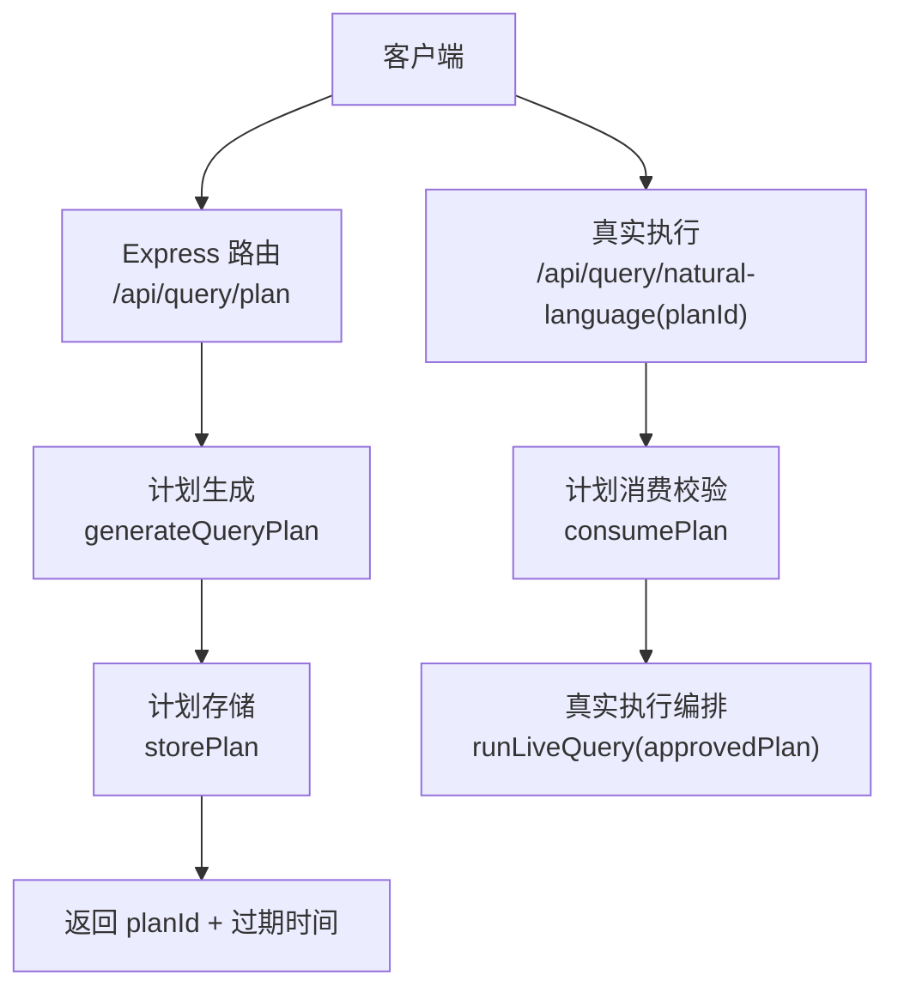
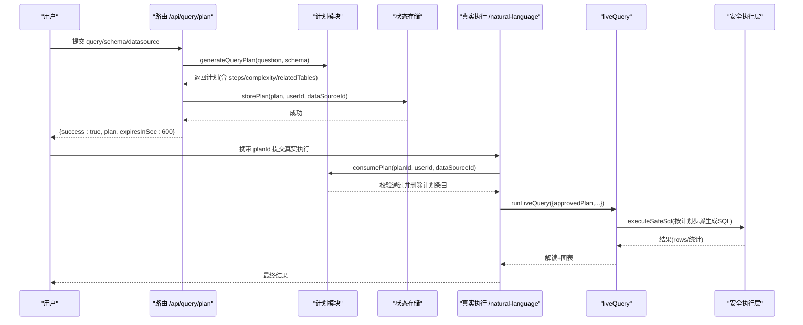
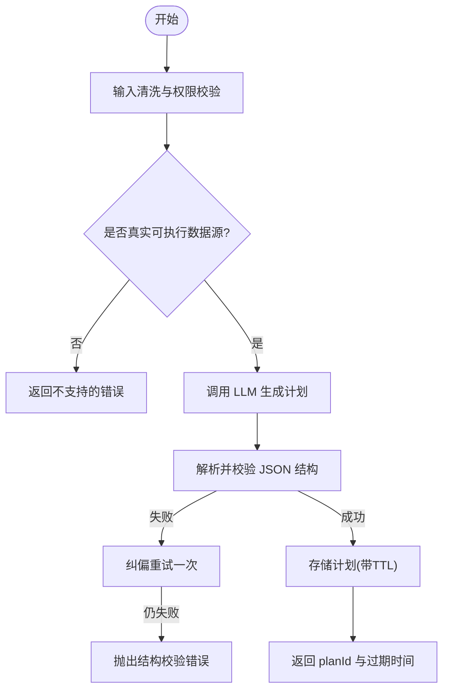
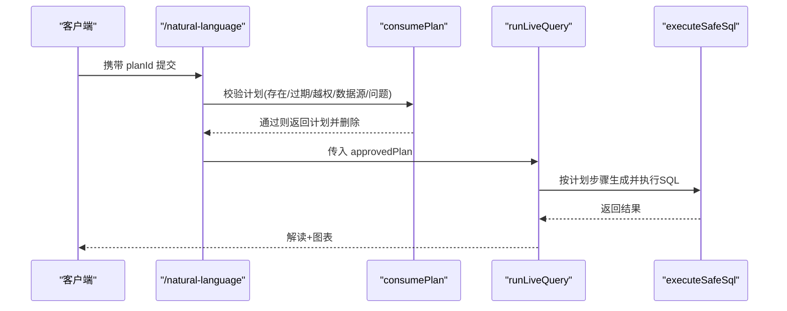
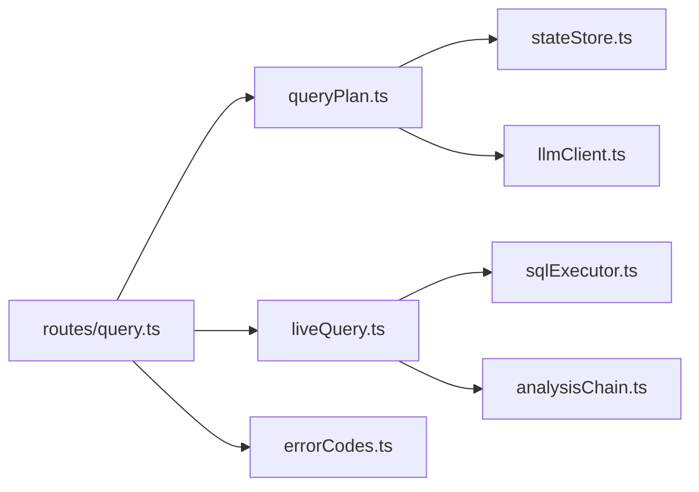

# 计划模式查询

<cite>
**本文引用的文件**
- [server/routes/query.ts](file://server/routes/query.ts)
- [server/query/queryPlan.ts](file://server/query/queryPlan.ts)
- [server/query/liveQuery.ts](file://server/query/liveQuery.ts)
- [server/infra/stateStore.ts](file://server/infra/stateStore.ts)
- [server/infra/errorCodes.ts](file://server/infra/errorCodes.ts)
- [server/query/queryPlan.test.ts](file://server/query/queryPlan.test.ts)
</cite>

## 目录
1. [简介](#简介)
2. [项目结构](#项目结构)
3. [核心组件](#核心组件)
4. [架构总览](#架构总览)
5. [详细组件分析](#详细组件分析)
6. [依赖关系分析](#依赖关系分析)
7. [性能与可用性](#性能与可用性)
8. [故障排查指南](#故障排查指南)
9. [结论](#结论)
10. [附录：使用示例](#附录使用示例)

## 简介
本文件面向“计划模式查询”的完整实现，围绕 POST /api/query/plan 端点，系统性地说明分析计划的生成、存储、验证与执行。计划模式将问数流程拆分为两个阶段：
- 计划生成阶段：由 LLM 基于用户问题与 Schema 生成可执行的“分析计划”，不执行任何 SQL。
- 分析执行阶段：用户确认计划后，携带 planId 提交真实执行；服务端校验计划有效性（过期、越权、数据源匹配、问题一致）后再进入正常问数链路。

计划包含步骤分解、复杂度评估、相关表声明等关键信息，用于引导后续 SQL 生成与分析，提升复杂查询的可控性与可审计性。计划具备生命周期管理（TTL 过期）、权限校验（用户归属）、冲突检测（一次性消费防重放）。

## 项目结构
与计划模式直接相关的代码主要分布在以下模块：
- 路由层：POST /api/query/plan 入口，负责鉴权、限流、输入清洗、上下文加载、调用计划生成并持久化。
- 计划模块：LLM 提示词构建、JSON 解析与校验、计划存储（内存或 Redis）、过期清理、一次性消费。
- 执行链路：当请求携带已批准的 planId 时，进入 liveQuery 的真实执行路径，并在阶段一按计划步骤引导 SQL 生成。
- 状态存储：统一 StateStore 抽象，支持进程内 Map 与 Redis 两种后端，提供 TTL、原子 GETDEL、前缀删除等能力。
- 错误码：统一的错误码定义，便于前端精准分支处理。

图表来源
- [server/routes/query.ts:478-529](file://server/routes/query.ts#L478-L529)
- [server/query/queryPlan.ts:162-183](file://server/query/queryPlan.ts#L162-L183)
- [server/query/queryPlan.ts:56-100](file://server/query/queryPlan.ts#L56-L100)
- [server/query/liveQuery.ts:189-200](file://server/query/liveQuery.ts#L189-L200)

章节来源
- [server/routes/query.ts:478-529](file://server/routes/query.ts#L478-L529)
- [server/query/queryPlan.ts:162-183](file://server/query/queryPlan.ts#L162-L183)
- [server/query/queryPlan.ts:56-100](file://server/query/queryPlan.ts#L56-L100)
- [server/query/liveQuery.ts:189-200](file://server/query/liveQuery.ts#L189-L200)

## 核心组件
- 计划生成器：根据 Schema 与问题，调用 LLM 输出结构化 JSON，并进行严格的结构校验与归一化；失败时自动纠偏重试一次。
- 计划存储：默认进程内 Map（TTL 10 分钟），可选外置 Redis（多实例共享、TTL 自动过期、原子 GETDEL 防重放）。
- 计划消费者：在真实执行前校验计划存在性、过期时间、用户归属、数据源匹配，并通过一次性消费防止重放。
- 执行编排：当 approvedPlan 存在时，跳过歧义澄清，按步骤引导 SQL 生成，确保执行与计划一致。

章节来源
- [server/query/queryPlan.ts:116-183](file://server/query/queryPlan.ts#L116-L183)
- [server/query/queryPlan.ts:56-100](file://server/query/queryPlan.ts#L56-L100)
- [server/query/liveQuery.ts:189-200](file://server/query/liveQuery.ts#L189-L200)

## 架构总览
计划模式贯穿“先规划、再执行”的两阶段流程，结合安全执行层与缓存、审计、SSE 推导留痕等机制，形成可控、可观测、可回放的问数体系。

图表来源
- [server/routes/query.ts:478-529](file://server/routes/query.ts#L478-L529)
- [server/query/queryPlan.ts:56-100](file://server/query/queryPlan.ts#L56-L100)
- [server/query/liveQuery.ts:189-200](file://server/query/liveQuery.ts#L189-L200)

## 详细组件分析

### 计划生成阶段
- 输入：用户问题、Schema、模型选择（可选）。
- 过程：
  - 路由层进行输入清洗、数据源访问控制、并发槽获取。
  - 加载 Schema 上下文，仅对“真实可执行的数据源类型”开放计划模式。
  - 调用 LLM 生成结构化计划，并进行严格解析与字段归一化。
  - 存储计划（带 TTL），返回 planId 与过期时间（600 秒）。
- 输出：{ success: true, plan, expiresInSec }。

图表来源
- [server/routes/query.ts:478-529](file://server/routes/query.ts#L478-L529)
- [server/query/queryPlan.ts:116-183](file://server/query/queryPlan.ts#L116-L183)

章节来源
- [server/routes/query.ts:478-529](file://server/routes/query.ts#L478-L529)
- [server/query/queryPlan.ts:116-183](file://server/query/queryPlan.ts#L116-L183)

### 计划执行阶段
- 触发：用户在自然语言问数接口中携带 planId。
- 校验：
  - 计划是否存在且未过期。
  - 当前用户是否为计划创建者（防越权）。
  - 数据源是否与计划一致（防跨库误用）。
  - 提交问题是否与计划中的问题一致（防篡改）。
- 执行：
  - 将 approvedPlan 注入 liveQuery，跳过歧义澄清，按步骤引导 SQL 生成。
  - 安全执行层执行 SELECT-only 查询，失败可自纠错（最多 3 次），EXPLAIN 防线拦截一次收窄条件机会。
  - 阶段二将真实行采样回喂 LLM 生成解读与 KPI。

图表来源
- [server/routes/query.ts:189-203](file://server/routes/query.ts#L189-L203)
- [server/query/queryPlan.ts:73-100](file://server/query/queryPlan.ts#L73-L100)
- [server/query/liveQuery.ts:189-200](file://server/query/liveQuery.ts#L189-L200)

章节来源
- [server/routes/query.ts:189-203](file://server/routes/query.ts#L189-L203)
- [server/query/queryPlan.ts:73-100](file://server/query/queryPlan.ts#L73-L100)
- [server/query/liveQuery.ts:189-200](file://server/query/liveQuery.ts#L189-L200)

### 计划结构与语义
- 计划对象包含：
  - planId：唯一标识。
  - question：原始问题。
  - understanding：对问题的理解摘要。
  - steps：有序步骤数组，每步包含 type/title/description/sql（可选）。
    - 支持的 step type：filter/aggregate/join/compare/rank/trend/clean/other。
  - relatedTables：涉及的表名数组（必须来自 Schema）。
  - complexity：simple 或 multi-step，用于指导后续深度分析与中间表策略。
- 约束：
  - 步骤数量限制（最多 8 步）。
  - 字段长度裁剪（title/description/sql/understanding/relatedTables 均有上限）。
  - 非法 type 归一为 other，缺失 complexity 默认为 simple。

章节来源
- [server/query/queryPlan.ts:13-27](file://server/query/queryPlan.ts#L13-L27)
- [server/query/queryPlan.ts:116-142](file://server/query/queryPlan.ts#L116-L142)

### 生命周期管理
- 过期时间：
  - 默认 TTL 为 10 分钟（PLAN_TTL_MS）。
  - 内存模式下惰性清理（pruneExpiredPlans），Redis 模式由 TTL 自动过期。
- 权限验证：
  - 消费时校验 userId 与 dataSourceId 一致性，防止越权与跨库误用。
- 冲突检测：
  - 一次性消费：consumePlan 成功后删除计划条目，防止重放。
  - Redis 模式使用原子 GETDEL，避免多实例下的竞态。

章节来源
- [server/query/queryPlan.ts:36-54](file://server/query/queryPlan.ts#L36-L54)
- [server/query/queryPlan.ts:56-100](file://server/query/queryPlan.ts#L56-L100)
- [server/infra/stateStore.ts:10-23](file://server/infra/stateStore.ts#L10-L23)

### 数据存储与扩展
- 内存实现：
  - 进程内 Map，键为 planId，值为 {plan, userId, dataSourceId, expiresAt}。
  - 提供 get/setEx/getDel/deleteByPrefix/incrWindow/acquireLock/releaseLock 等通用能力。
- Redis 实现：
  - 多实例共享，TTL 自动过期，GETDEL 原子消费。
  - 支持 Lua 脚本释放锁，保证 token 匹配才删除。
- 工厂与预热：
  - 根据 REDIS_URL 自动切换实现。
  - 启动时可预热连接，减少冷启动窗口异常。

章节来源
- [server/infra/stateStore.ts:32-98](file://server/infra/stateStore.ts#L32-L98)
- [server/infra/stateStore.ts:105-163](file://server/infra/stateStore.ts#L105-L163)
- [server/infra/stateStore.ts:169-219](file://server/infra/stateStore.ts#L169-L219)

## 依赖关系分析
- 路由层依赖：
  - 计划模块：generateQueryPlan/storePlan/consumePlan。
  - 执行链路：runLiveQuery（接收 approvedPlan）。
  - 状态存储：StateStore（TTL、原子操作）。
  - 错误码：PLAN_INVALID/PLAN_MISMATCH 等。
- 计划模块依赖：
  - LLM 客户端：callLLMJson（结构化输出）。
  - Schema 序列化：serializeSchemaForPrompt（注入系统提示词）。
  - 状态存储：get/setEx/getDel/deleteByPrefix。
- 执行链路依赖：
  - 安全执行层：executeSafeSql（SELECT-only、白名单、超时、权限注入）。
  - 分析链：assessComplexity/runAnalysisChain（中间表与深度分析）。
  - SSE/Trace：onStage/onTrace（阶段进度与推导留痕）。

图表来源
- [server/routes/query.ts:478-529](file://server/routes/query.ts#L478-L529)
- [server/query/queryPlan.ts:162-183](file://server/query/queryPlan.ts#L162-L183)
- [server/query/liveQuery.ts:189-200](file://server/query/liveQuery.ts#L189-L200)
- [server/infra/stateStore.ts:169-219](file://server/infra/stateStore.ts#L169-L219)
- [server/infra/errorCodes.ts:6-33](file://server/infra/errorCodes.ts#L6-L33)

章节来源
- [server/routes/query.ts:478-529](file://server/routes/query.ts#L478-L529)
- [server/query/queryPlan.ts:162-183](file://server/query/queryPlan.ts#L162-L183)
- [server/query/liveQuery.ts:189-200](file://server/query/liveQuery.ts#L189-L200)
- [server/infra/stateStore.ts:169-219](file://server/infra/stateStore.ts#L169-L219)
- [server/infra/errorCodes.ts:6-33](file://server/infra/errorCodes.ts#L6-L33)

## 性能与可用性
- 计划生成：
  - 首次 LLM 输出失败会进行一次纠偏重试，提高鲁棒性。
  - 步骤与字段长度限制降低 Token 消耗与解析成本。
- 计划存储：
  - 内存模式惰性清理，避免无限增长；Redis 模式 TTL 自动过期。
  - 原子 GETDEL 防止重复消费，适合多实例部署。
- 执行链路：
  - 计划模式跳过歧义澄清，减少交互轮次。
  - 安全执行层支持 EXPLAIN 防线与自纠错，降低反复失败概率。
- 缓存与会话：
  - 真实执行结果走精确与语义缓存，相似问题快速命中。
  - SSE 断线续传与推导留痕保障用户体验与可追溯性。

[本节为通用性能讨论，不直接分析具体文件]

## 故障排查指南
- 常见错误码与含义：
  - PLAN_INVALID：计划不存在、已过期或已被消费。
  - PLAN_MISMATCH：提交问题与计划不匹配。
  - DS_ACCESS_DENIED：无数据源访问权限。
  - AI_SWITCHED_OFF：数据源智能问数功能被停用。
  - QUERY_IN_FLIGHT：同一用户并发查询仍在进行中。
  - LLM_UNAVAILABLE：AI/LLM 服务不可用。
- 排查建议：
  - 检查 planId 是否有效且在有效期内。
  - 确认当前用户与数据源是否与计划一致。
  - 查看 LLM 输出是否符合契约（可通过日志定位 raw output head）。
  - 若启用 Redis，检查连接与 TTL 配置是否正确。
  - 关注慢查询与大结果集（执行时长 > 3s 或行数 > 10 万）以优化性能。

章节来源
- [server/infra/errorCodes.ts:6-33](file://server/infra/errorCodes.ts#L6-L33)
- [server/query/queryPlan.ts:73-100](file://server/query/queryPlan.ts#L73-L100)
- [server/routes/query.ts:478-529](file://server/routes/query.ts#L478-L529)

## 结论
计划模式通过“先规划、再执行”的两阶段设计，显著提升了复杂查询的可控性、可审计性与安全性。计划的结构化步骤与复杂度评估为后续 SQL 生成与分析提供了明确指引；生命周期管理（TTL、权限、一次性消费）确保了计划的安全与可靠；与真实执行链路的无缝衔接，使得用户可在确认计划后高效完成数据分析任务。

[本节为总结性内容，不直接分析具体文件]

## 附录：使用示例
- 复杂查询的计划制定：
  - 调用 POST /api/query/plan，提交问题与 Schema，获取 planId 与过期时间。
  - 前端展示计划步骤与复杂度，供用户审阅。
- 用户确认与执行：
  - 用户确认后，携带 planId 调用 /api/query/natural-language，服务端校验通过后执行。
- 批量执行场景：
  - 针对多个相似问题，可复用同一计划（需分别校验问题匹配与一次性消费）。
  - 结合缓存与语义检索，提升批量处理的吞吐与一致性。
- 数据安全管控价值：
  - 计划阶段不执行 SQL，避免敏感数据泄露风险。
  - 执行阶段强制安全执行层（SELECT-only、白名单、行级权限），结合 DLP 脱敏与审计留痕，确保合规与可追溯。

[本节为概念性示例，不直接分析具体文件]