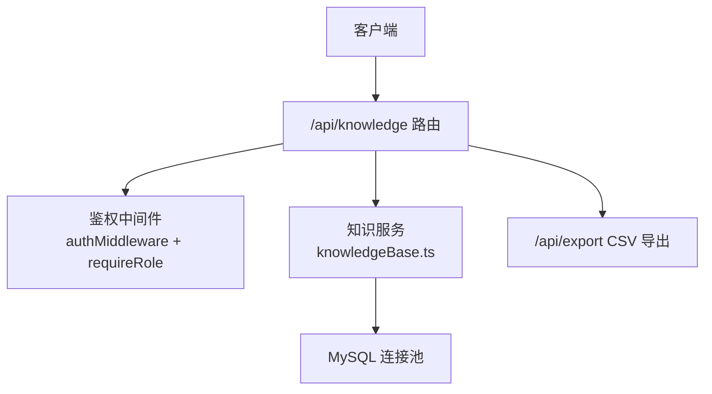
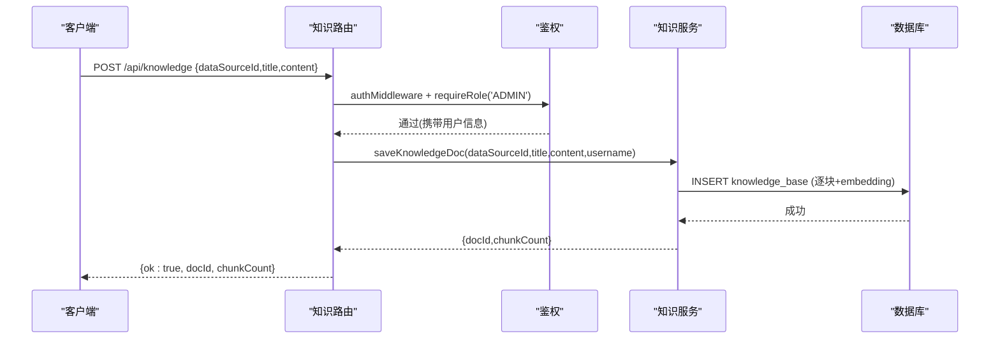
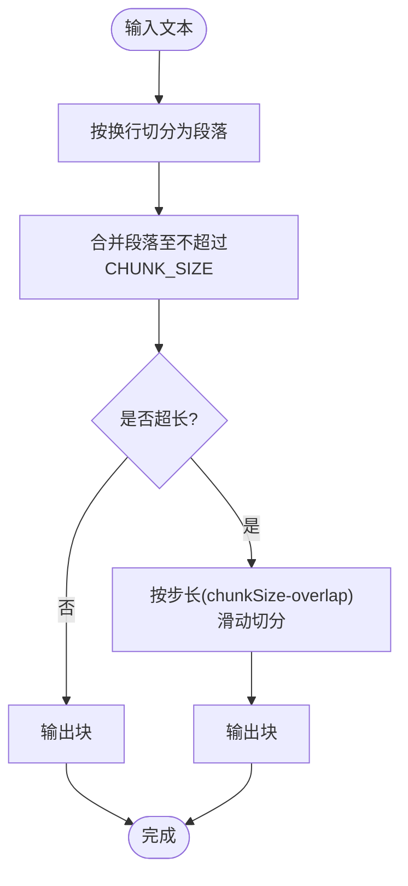
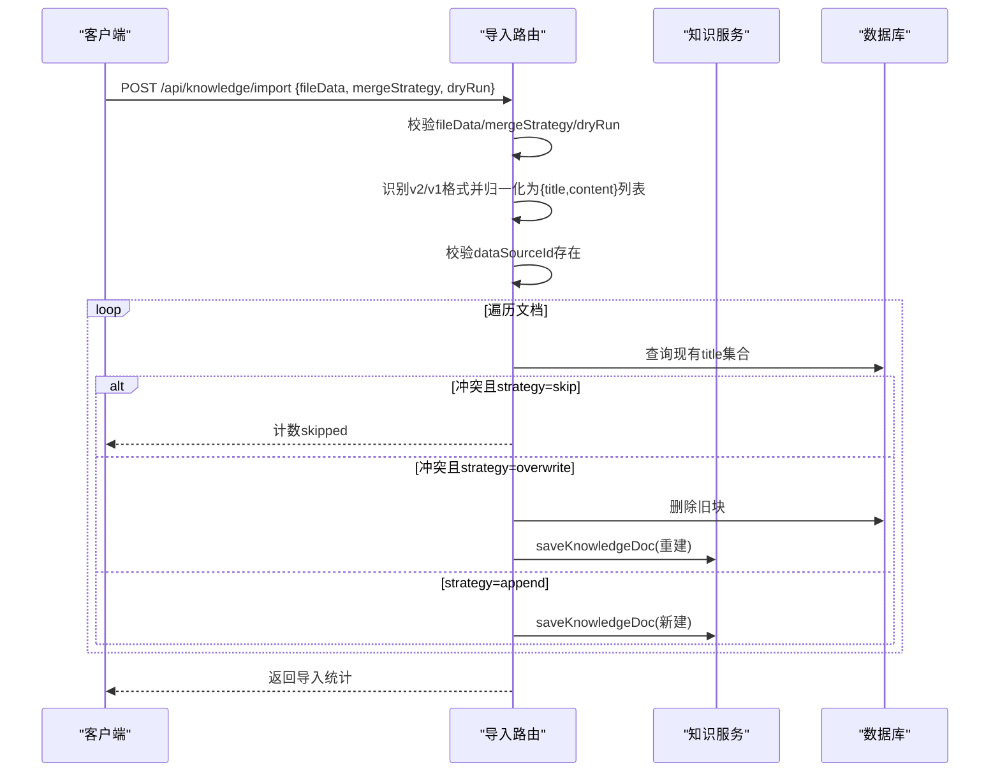
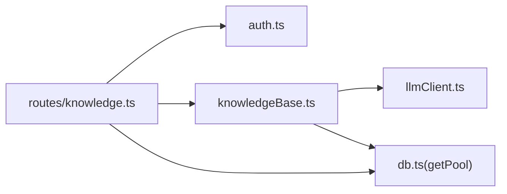

# 内部知识管理API

<cite>
**本文引用的文件**
- [server/routes/knowledge.ts](file://server/routes/knowledge.ts)
- [server/knowledge/knowledgeBase.ts](file://server/knowledge/knowledgeBase.ts)
- [server/auth/auth.ts](file://server/auth/auth.ts)
- [server/auth/accessControl.ts](file://server/auth/accessControl.ts)
- [server/routes/export.ts](file://server/routes/export.ts)
</cite>

## 目录
1. [简介](#简介)
2. [项目结构](#项目结构)
3. [核心组件](#核心组件)
4. [架构总览](#架构总览)
5. [详细组件分析](#详细组件分析)
6. [依赖关系分析](#依赖关系分析)
7. [性能考量](#性能考量)
8. [故障排查指南](#故障排查指南)
9. [结论](#结论)
10. [附录：接口规范与示例](#附录接口规范与示例)

## 简介
本文件为“内部知识管理API”的完整技术文档，覆盖知识文档的CRUD接口、知识切块机制（含重叠策略与序列还原）、权限控制（ADMIN角色限制与登录用户读取权限）、错误处理机制，以及批量导入导出功能（含mergeStrategy策略）。该能力用于在问数链路中注入权威的业务口径、术语与计算规则，提升生成SQL与回答的准确性。

## 项目结构
- 路由层：Express 路由集中定义 /api/knowledge 相关端点，负责参数校验、鉴权、调用服务层并返回统一响应。
- 服务层：knowledgeBase.ts 提供切块、检索、持久化等核心逻辑；accessControl.ts 提供数据源访问控制。
- 认证授权：auth.ts 提供JWT鉴权中间件与角色守卫 requireRole('ADMIN')。
- 导出通道：export.ts 提供CSV导出审批与审计（与本知识库导出JSON互补）。

图表来源
- [server/routes/knowledge.ts:25-56](file://server/routes/knowledge.ts#L25-L56)
- [server/auth/auth.ts:66-126](file://server/auth/auth.ts#L66-L126)
- [server/knowledge/knowledgeBase.ts:170-197](file://server/knowledge/knowledgeBase.ts#L170-L197)

章节来源
- [server/routes/knowledge.ts:1-23](file://server/routes/knowledge.ts#L1-L23)
- [server/auth/auth.ts:1-127](file://server/auth/auth.ts#L1-L127)

## 核心组件
- 路由模块：实现知识文档列表、创建、详情、编辑、删除，以及导入/导出端点。
- 切块与检索：按段落优先、定长兜底切块，相邻块保留重叠；支持向量相似度与关键词降级；提供片段排序与阈值过滤。
- 权限控制：所有读/写均通过鉴权中间件；写操作需ADMIN角色；读取对已登录用户开放。
- 导入导出：导出JSON包含还原后的原文与原始切块；导入支持skip/overwrite/append三种冲突策略，支持dryRun预检。

章节来源
- [server/routes/knowledge.ts:58-454](file://server/routes/knowledge.ts#L58-L454)
- [server/knowledge/knowledgeBase.ts:43-166](file://server/knowledge/knowledgeBase.ts#L43-L166)
- [server/auth/auth.ts:66-126](file://server/auth/auth.ts#L66-L126)

## 架构总览

图表来源
- [server/routes/knowledge.ts:93-107](file://server/routes/knowledge.ts#L93-L107)
- [server/knowledge/knowledgeBase.ts:170-197](file://server/knowledge/knowledgeBase.ts#L170-L197)
- [server/auth/auth.ts:66-126](file://server/auth/auth.ts#L66-L126)

## 详细组件分析

### 知识文档CRUD接口
- GET /api/knowledge?dataSourceId=xxx
  - 作用：列出某数据源的知识文档（按doc聚合），返回docId、title、chunkCount、createdBy、createdAt。
  - 权限：已登录用户可读。
  - 错误：缺少dataSourceId返回400；查询异常返回500。
- POST /api/knowledge
  - 作用：登记知识文档，自动切块并入库。
  - 权限：需要ADMIN角色。
  - 请求体：{dataSourceId, title, content}
  - 返回：{ok:true, docId, chunkCount}
  - 错误：参数缺失或为空返回400；保存失败返回500。
- GET /api/knowledge/:docId
  - 作用：获取文档详情（元信息+切块明细，按入库顺序）。
  - 权限：已登录用户可读。
  - 返回：doc对象包含dataSourceId、title、createdBy、createdAt、chunkCount、chunks数组（index从1开始）。
  - 错误：不存在返回404；查询异常返回500。
- PUT /api/knowledge/:docId
  - 作用：编辑文档，先删除旧块再以原docId重新切块入库（embedding重新生成）。
  - 权限：需要ADMIN角色。
  - 请求体：{title, content}
  - 返回：{ok:true, docId, chunkCount}
  - 错误：不存在返回404；内容为空无法切块返回400；保存失败返回500。
- DELETE /api/knowledge/:docId
  - 作用：删除文档及其全部切块。
  - 权限：需要ADMIN角色。
  - 返回：{ok:true}
  - 错误：不存在返回404；删除异常返回500。

章节来源
- [server/routes/knowledge.ts:69-107](file://server/routes/knowledge.ts#L69-L107)
- [server/routes/knowledge.ts:389-453](file://server/routes/knowledge.ts#L389-L453)

### 知识切块机制
- 切块策略
  - 段落优先：按换行切分段落，合并至不超过CHUNK_SIZE。
  - 重叠策略：相邻块保留CHUNK_OVERLAP字符重叠，避免语义被截断。
  - 超长兜底：单段超过CHUNK_SIZE时按步长(chunkSize - overlap)滑动切分。
- 常量
  - CHUNK_SIZE = 400
  - CHUNK_OVERLAP = 80
- 序列还原算法 stitchChunks
  - 目标：将按重叠切分的块序列还原为完整原文。
  - 方法：依次比较前一块的后缀与后一块的前缀，找到最长匹配长度k，拼接时跳过重复部分。
  - 复杂度：近似O(N·K)，N为块数，K为最大重叠长度。
- 检索与排序
  - 向量模式：使用余弦相似度，低于阈值（默认0.35）视为无关不注入。
  - 降级模式：无向量时使用bigram关键词匹配。
  - 每文档最多入选块数：防止大字典文档占满注入槽位。
  - 高价值文档引导：标题命中特定关键词（如“口径”“指南”等）时优先保留一个槽位。

图表来源
- [server/knowledge/knowledgeBase.ts:43-75](file://server/knowledge/knowledgeBase.ts#L43-L75)

章节来源
- [server/knowledge/knowledgeBase.ts:13-25](file://server/knowledge/knowledgeBase.ts#L13-L25)
- [server/knowledge/knowledgeBase.ts:43-75](file://server/knowledge/knowledgeBase.ts#L43-L75)
- [server/routes/knowledge.ts:33-51](file://server/routes/knowledge.ts#L33-L51)

### 权限控制
- 鉴权中间件
  - 所有路由均挂载authMiddleware，校验Bearer Token并回查用户状态，注入req.user。
- 角色守卫
  - 写操作（POST/PUT/DELETE/IMPORT/EXPORT）使用requireRole('ADMIN')，仅ADMIN可执行。
  - 读取（GET列表/详情/导出）仅需已登录用户。
- 数据源访问控制（ACL）
  - 针对数据源维度配置部门/用户白名单；未配置则不限制。
  - ADMIN始终可访问；非ADMIN需满足ACL条件。

章节来源
- [server/auth/auth.ts:66-126](file://server/auth/auth.ts#L66-L126)
- [server/routes/knowledge.ts:55-56](file://server/routes/knowledge.ts#L55-L56)
- [server/auth/accessControl.ts:43-73](file://server/auth/accessControl.ts#L43-L73)

### 批量导入导出
- 导出 GET /api/knowledge/export?dataSourceId=xxx
  - 权限：ADMIN
  - 行为：查询指定数据源的全部知识文档，按doc聚合并还原content，同时保留原始chunks作为参考。
  - 返回：application/json文件流，文件名包含数据源名与日期。
  - 错误：缺少dataSourceId返回400；查询异常返回500。
- 导入 POST /api/knowledge/import
  - 权限：ADMIN
  - 请求体：
    - fileData: object（导出的JSON内容）
    - dataSourceId?: string（目标数据源，缺省用文件中的来源数据源）
    - mergeStrategy: 'skip' | 'overwrite' | 'append'（默认skip）
    - dryRun?: boolean（仅预检不写库）
  - 冲突判定：目标数据源下已存在相同title的文档。
  - 行为：
    - skip：跳过冲突文档
    - overwrite：删除旧块并以新内容重建（同docId）
    - append：同title也照常新建（新docId）
  - 返回：统计结果（importedCount、updatedCount、skippedCount、errorCount、errors等）
  - 错误：文件格式不支持、缺少必填字段、目标数据源不存在等返回相应错误码。

图表来源
- [server/routes/knowledge.ts:249-374](file://server/routes/knowledge.ts#L249-L374)
- [server/knowledge/knowledgeBase.ts:170-197](file://server/knowledge/knowledgeBase.ts#L170-L197)

章节来源
- [server/routes/knowledge.ts:159-224](file://server/routes/knowledge.ts#L159-L224)
- [server/routes/knowledge.ts:237-374](file://server/routes/knowledge.ts#L237-L374)

## 依赖关系分析
- 路由依赖
  - 鉴权：authMiddleware、requireRole
  - 数据库：getPool()
  - 知识服务：saveKnowledgeDoc、CHUNK_OVERLAP、stitchChunks（本地实现）
- 服务依赖
  - LLM客户端：callEmbeddingBatch（批量化嵌入，失败降级为null走关键词检索）
  - 关键词检索：bigramOverlap（降级模式）
  - 日志：logger
- 外部系统
  - MySQL：knowledge_base表存储doc/chunk及embedding_json
  - 可选：embedding模型（若不可用，系统自动降级）

图表来源
- [server/routes/knowledge.ts:25-31](file://server/routes/knowledge.ts#L25-L31)
- [server/knowledge/knowledgeBase.ts:8-11](file://server/knowledge/knowledgeBase.ts#L8-L11)
- [server/knowledge/knowledgeBase.ts:170-197](file://server/knowledge/knowledgeBase.ts#L170-L197)

章节来源
- [server/routes/knowledge.ts:25-31](file://server/routes/knowledge.ts#L25-L31)
- [server/knowledge/knowledgeBase.ts:8-11](file://server/knowledge/knowledgeBase.ts#L8-L11)

## 性能考量
- 切块与重叠
  - 段落优先减少跨句切割，重叠保证边界语义连续性。
  - 超长文本按步长切分，避免过大块影响检索效率。
- 嵌入批处理
  - 使用批量化embedding调用，降低往返次数；整体失败时降级为关键词检索，保障可用性。
- 检索优化
  - topK扩容至6，提高命中率；每文档最多入选2块，避免单一文档垄断注入槽位。
  - 相关性阈值过滤无关片段，减少噪声注入。
- 导入导出
  - 导入支持dryRun预检，避免无效写入；overwrite策略先删后建，确保一致性。
  - 导出按doc聚合还原content，便于备份与迁移。

[本节为通用性能讨论，不直接分析具体文件]

## 故障排查指南
- 参数验证错误
  - 缺少dataSourceId、title或content：返回400，检查请求体字段类型与是否为空。
  - mergeStrategy非法：返回400，确认值为skip/overwrite/append之一。
- 数据库异常
  - 查询/插入/删除失败：返回500，检查数据库连接与表结构，关注日志中的错误消息。
- 业务逻辑错误
  - 内容为空无法切块：返回400，检查content是否有效。
  - 文档不存在：GET/PUT/DELETE对应docId不存在返回404。
  - 导入文件格式不支持：返回400，确认fileData包含docs或knowledgeBase字段。
- 权限问题
  - 未登录：返回401，检查Authorization头。
  - 非ADMIN尝试写操作：返回403，确认用户角色。

章节来源
- [server/routes/knowledge.ts:70-107](file://server/routes/knowledge.ts#L70-L107)
- [server/routes/knowledge.ts:389-453](file://server/routes/knowledge.ts#L389-L453)
- [server/routes/knowledge.ts:249-374](file://server/routes/knowledge.ts#L249-L374)
- [server/auth/auth.ts:66-126](file://server/auth/auth.ts#L66-L126)

## 结论
本API提供了完整的知识文档生命周期管理能力，结合稳健的切块与检索机制，可在问数链路中稳定注入权威业务知识。权限控制严格区分读写，导入导出支持灵活策略与预检，便于团队协作与数据治理。建议在生产环境合理配置embedding模型与阈值参数，以获得最佳检索效果。

[本节为总结性内容，不直接分析具体文件]

## 附录：接口规范与示例

### 通用说明
- 鉴权：所有请求需在Header中携带Authorization: Bearer <token>。
- 角色：写操作需ADMIN角色；读操作仅需已登录用户。
- 数据源：dataSourceId为字符串，用于限定知识文档归属。

### 接口清单与示例

- GET /api/knowledge?dataSourceId=xxx
  - 响应示例
    - docs: Array<{docId, title, chunkCount, createdBy, createdAt}>
  - 错误示例
    - { error: "缺少 dataSourceId" }
    - { error: "查询知识库失败：..." }

- POST /api/knowledge
  - 请求体
    - { dataSourceId: string, title: string, content: string }
  - 响应示例
    - { ok: true, docId: string, chunkCount: number }
  - 错误示例
    - { error: "缺少 dataSourceId" }
    - { error: "标题必填" }
    - { error: "内容必填" }
    - { error: "内容为空，无法切块" }
    - { error: "登记失败：..." }

- GET /api/knowledge/:docId
  - 响应示例
    - doc: {
        docId: string,
        dataSourceId: string,
        title: string,
        createdBy: string,
        createdAt: Date,
        chunkCount: number,
        chunks: Array<{ index: number, text: string }>
      }
  - 错误示例
    - { error: "知识文档不存在" }
    - { error: "查询详情失败：..." }

- PUT /api/knowledge/:docId
  - 请求体
    - { title: string, content: string }
  - 响应示例
    - { ok: true, docId: string, chunkCount: number }
  - 错误示例
    - { error: "标题必填" }
    - { error: "内容必填" }
    - { error: "知识文档不存在" }
    - { error: "内容为空，无法切块" }
    - { error: "保存失败：..." }

- DELETE /api/knowledge/:docId
  - 响应示例
    - { ok: true }
  - 错误示例
    - { error: "知识文档不存在" }
    - { error: "删除失败：..." }

- GET /api/knowledge/export?dataSourceId=xxx
  - 权限：ADMIN
  - 响应：application/json文件流
  - JSON结构
    - version: "2.0"
    - type: "knowledge-docs"
    - exportedAt: ISO时间戳
    - exportedBy: 用户名
    - dataSourceId: string
    - dataSourceName: string
    - docCount: number
    - docs: Array<{
        docId: string,
        title: string,
        content: string,
        chunkCount: number,
        createdBy: string,
        createdAt: Date
      }>
  - 错误示例
    - { error: "缺少 dataSourceId" }
    - { error: "导出失败：..." }

- POST /api/knowledge/import
  - 权限：ADMIN
  - 请求体
    - fileData: object（导出文件的完整JSON内容）
    - dataSourceId?: string
    - mergeStrategy?: "skip" | "overwrite" | "append"
    - dryRun?: boolean
  - 响应示例
    - success: boolean
    - dryRun: boolean
    - mergeStrategy: string
    - dataSourceId: string
    - dataSourceName: string
    - importedCount: number
    - updatedCount: number
    - skippedCount: number
    - errorCount: number
    - errors: Array<{ title: string, message: string }>
    - summary: { totalDocs, newDocs, conflictDocs, invalidDocs }
  - 错误示例
    - { error: "缺少 fileData（备份文件的 JSON 内容）" }
    - { error: "mergeStrategy 必须是 skip / overwrite / append" }
    - { error: "无法识别的文件格式：..." }
    - { error: "文件中没有可导入的有效知识文档..." }
    - { error: "缺少目标数据源 dataSourceId（文件中也没有来源信息）" }
    - { error: "目标数据源不存在：..." }
    - { error: "导入失败：..." }

章节来源
- [server/routes/knowledge.ts:69-107](file://server/routes/knowledge.ts#L69-L107)
- [server/routes/knowledge.ts:389-453](file://server/routes/knowledge.ts#L389-L453)
- [server/routes/knowledge.ts:159-224](file://server/routes/knowledge.ts#L159-L224)
- [server/routes/knowledge.ts:237-374](file://server/routes/knowledge.ts#L237-L374)