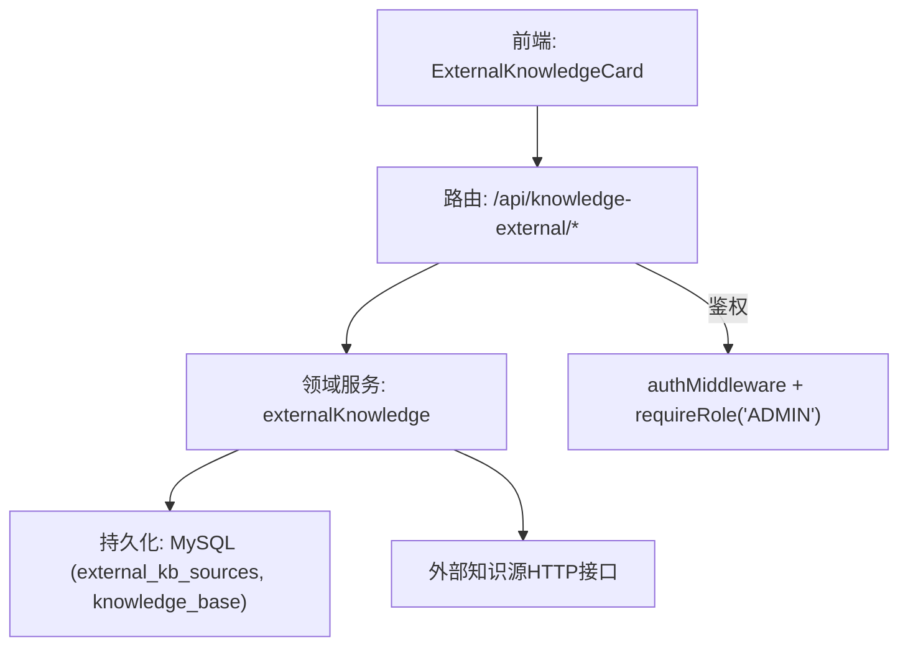
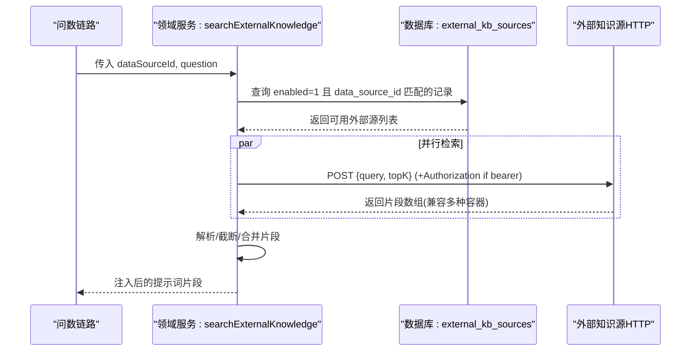
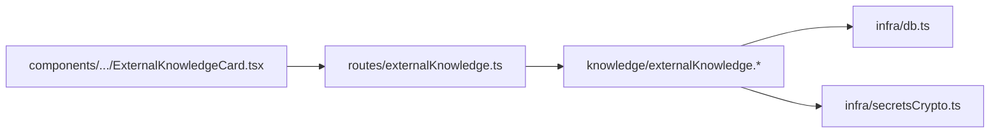

# 外部知识源集成API

<cite>
**本文引用的文件**
- [server/routes/externalKnowledge.ts](file://server/routes/externalKnowledge.ts)
- [server/knowledge/externalKnowledge.test.ts](file://server/knowledge/externalKnowledge.test.ts)
- [server/knowledge/knowledgeBase.ts](file://server/knowledge/knowledgeBase.ts)
- [server/infra/db.ts](file://server/infra/db.ts)
- [server/infra/secretsCrypto.ts](file://server/infra/secretsCrypto.ts)
- [src/components/datasource/ExternalKnowledgeCard.tsx](file://src/components/datasource/ExternalKnowledgeCard.tsx)
</cite>

## 目录
1. [简介](#简介)
2. [项目结构](#项目结构)
3. [核心组件](#核心组件)
4. [架构总览](#架构总览)
5. [详细组件分析](#详细组件分析)
6. [依赖关系分析](#依赖关系分析)
7. [性能考虑](#性能考虑)
8. [故障排查指南](#故障排查指南)
9. [结论](#结论)
10. [附录：接口规范与示例](#附录接口规范与示例)

## 简介
本文件面向“外部知识源集成”能力，提供管理员配置与管理企业级外部 RAG/知识服务检索接口的完整说明。系统支持在问数链路中并行检索多个外部知识源，并将结果片段注入提示词，增强回答的准确性与业务一致性。文档涵盖：
- 外部知识源的配置与管理（增删改查、启用范围、认证方式）
- API 对接机制（请求体、响应体、超时控制、认证头）
- 数据同步策略（全量/增量/定时任务建议）
- 语义搜索接口（向量检索、相似度阈值、排序规则）
- 错误处理策略（网络异常重试、认证失败、数据格式校验）
- 性能优化选项（连接池、缓存、并发控制）
- 监控与日志（进度跟踪、告警、指标收集）

## 项目结构
外部知识源能力由路由层、领域服务层、持久化层和前端管理界面组成：
- 路由层：对外暴露 REST 接口，负责鉴权、参数校验与统一错误封装
- 领域服务层：实现外部源检索、聚合、解析与降级逻辑
- 持久化层：存储外部源配置、本地知识库切片与向量
- 前端：提供可视化配置、连通性测试、启用开关与生效范围选择

图表来源
- [server/routes/externalKnowledge.ts:1-85](file://server/routes/externalKnowledge.ts#L1-L85)
- [server/knowledge/externalKnowledge.test.ts:74-123](file://server/knowledge/externalKnowledge.test.ts#L74-L123)
- [server/infra/db.ts:706-724](file://server/infra/db.ts#L706-L724)

章节来源
- [server/routes/externalKnowledge.ts:1-85](file://server/routes/externalKnowledge.ts#L1-L85)
- [server/infra/db.ts:706-724](file://server/infra/db.ts#L706-L724)

## 核心组件
- 路由模块：提供外部知识源的列表、新增、编辑、删除与连通性测试接口，统一使用管理员权限保护
- 领域服务：实现外部源配置的保存/读取、单源调用、多源并行检索、响应容错解析、降级与统计
- 持久化：外部源配置表、本地知识库切片表；敏感字段加密存储
- 前端卡片：管理员可配置名称、端点、认证类型、API Key、超时、生效范围与启用状态，并执行连通性测试

章节来源
- [server/routes/externalKnowledge.ts:1-85](file://server/routes/externalKnowledge.ts#L1-L85)
- [server/knowledge/externalKnowledge.test.ts:54-72](file://server/knowledge/externalKnowledge.test.ts#L54-L72)
- [server/infra/db.ts:706-724](file://server/infra/db.ts#L706-L724)
- [src/components/datasource/ExternalKnowledgeCard.tsx:1-402](file://src/components/datasource/ExternalKnowledgeCard.tsx#L1-L402)

## 架构总览
外部知识源在问数链路中的角色是“额外上下文来源”。系统在检索阶段会：
- 根据当前数据源 ID 筛选启用的外部源（精确匹配或全局通配）
- 对每个适用源发起 POST 检索请求，携带 query 与 topK
- 若为 Bearer 认证，自动附加 Authorization 头
- 将各源返回的片段统一解析、截断与去重，拼接成提示词注入块
- 任一源失败不影响其他源，整体降级为空时不阻断主链路

图表来源
- [server/knowledge/externalKnowledge.test.ts:125-206](file://server/knowledge/externalKnowledge.test.ts#L125-L206)
- [server/knowledge/externalKnowledge.test.ts:74-123](file://server/knowledge/externalKnowledge.test.ts#L74-L123)

## 详细组件分析

### 路由层：外部知识源管理接口
- GET /api/knowledge-external：列出全部外部知识源（不包含明文密钥）
- POST /api/knowledge-external：新增外部源（name, endpoint, authType, apiKey?, timeoutMs, dataSourceId, enabled）
- PUT /api/knowledge-external/:id：编辑外部源（apiKey 留空保留原密钥；authType 改为 none 时清空密钥）
- DELETE /api/knowledge-external/:id：删除外部源
- POST /api/knowledge-external/test：连通性测试（不落库，仅用当前表单值即时检索）

所有写操作受管理员权限保护；统一捕获异常并返回结构化错误信息。

章节来源
- [server/routes/externalKnowledge.ts:1-85](file://server/routes/externalKnowledge.ts#L1-L85)

### 领域服务：外部源配置与检索
- 配置校验：名称非空、endpoint 必须为 http(s)、超时范围限制、bearer 需携带 apiKey
- 配置落库：新增时加密 api_key；编辑时按规则保留或清空；列表返回 hasKey 标记而不泄露密钥
- 单源调用：POST JSON 请求体 {query, topK}；Bearer 模式添加 Authorization 头；非 2xx 抛错；支持超时中断
- 多源聚合：按数据源过滤启用源，并行调用；任一失败降级为空；统计 okSources/failSources；片段统一解析与截断
- 降级策略：数据库异常或无适用源时返回空片段，不阻断问数主链路

章节来源
- [server/knowledge/externalKnowledge.test.ts:54-72](file://server/knowledge/externalKnowledge.test.ts#L54-L72)
- [server/knowledge/externalKnowledge.test.ts:74-123](file://server/knowledge/externalKnowledge.test.ts#L74-L123)
- [server/knowledge/externalKnowledge.test.ts:125-206](file://server/knowledge/externalKnowledge.test.ts#L125-L206)
- [server/infra/db.ts:706-724](file://server/infra/db.ts#L706-L724)
- [server/infra/secretsCrypto.ts:1-50](file://server/infra/secretsCrypto.ts#L1-L50)

### 本地知识库：语义搜索与阈值
- 切块与嵌入：按段落优先切块，相邻块重叠避免语义断裂；批量调用 embedding，失败降级为关键词检索
- 相似度阈值：向量模式下设置最小余弦相似度阈值（默认 0.35，可通过环境变量调整），低于阈值的片段不注入
- 排序规则：向量相似度降序；同一文档最多入选固定数量；高价值口径/指南类文档保留一个槽位
- 降级模式：当无法获取向量时，回退到 bigram 关键词重叠度排序

章节来源
- [server/knowledge/knowledgeBase.ts:1-239](file://server/knowledge/knowledgeBase.ts#L1-L239)

### 前端管理：配置与测试
- 表单字段：名称、端点、认证类型（none/bearer）、API Key、超时、生效范围（全部/指定数据源）、启用开关
- 连通性测试：提交当前表单值进行真实检索，返回耗时与片段数，便于快速验证配置
- 保存行为：新增/编辑后刷新列表，显示创建者、超时、生效范围与启用状态

章节来源
- [src/components/datasource/ExternalKnowledgeCard.tsx:1-402](file://src/components/datasource/ExternalKnowledgeCard.tsx#L1-L402)

## 依赖关系分析
- 路由依赖鉴权中间件与领域服务
- 领域服务依赖数据库连接池、加密工具与外部 HTTP 客户端
- 前端通过 REST 接口与后端交互，展示配置与测试结果

图表来源
- [server/routes/externalKnowledge.ts:1-85](file://server/routes/externalKnowledge.ts#L1-L85)
- [server/knowledge/externalKnowledge.test.ts:74-123](file://server/knowledge/externalKnowledge.test.ts#L74-L123)
- [server/infra/db.ts:706-724](file://server/infra/db.ts#L706-L724)
- [server/infra/secretsCrypto.ts:1-50](file://server/infra/secretsCrypto.ts#L1-L50)
- [src/components/datasource/ExternalKnowledgeCard.tsx:1-402](file://src/components/datasource/ExternalKnowledgeCard.tsx#L1-L402)

章节来源
- [server/routes/externalKnowledge.ts:1-85](file://server/routes/externalKnowledge.ts#L1-L85)
- [server/knowledge/externalKnowledge.test.ts:74-123](file://server/knowledge/externalKnowledge.test.ts#L74-L123)
- [server/infra/db.ts:706-724](file://server/infra/db.ts#L706-L724)
- [server/infra/secretsCrypto.ts:1-50](file://server/infra/secretsCrypto.ts#L1-L50)
- [src/components/datasource/ExternalKnowledgeCard.tsx:1-402](file://src/components/datasource/ExternalKnowledgeCard.tsx#L1-L402)

## 性能考虑
- 连接池：应用库连接池大小可按期望并发用户数动态计算，上限有保护，避免资源耗尽
- 并发控制：外部源检索采用并行调用，提升总体吞吐；单源失败不阻塞其他源
- 超时控制：每个外部源可配置超时毫秒数，到达时限即中止请求，防止长尾拖慢
- 缓存策略：建议在网关或上游服务侧对相同 query+topK 做短期缓存；服务端未内置外部源结果缓存
- 向量检索优化：本地知识库支持批量 embedding 与相似度阈值过滤，减少无关片段注入

章节来源
- [server/infra/db.ts:29-43](file://server/infra/db.ts#L29-L43)
- [server/knowledge/externalKnowledge.test.ts:125-206](file://server/knowledge/externalKnowledge.test.ts#L125-L206)
- [server/knowledge/knowledgeBase.ts:170-197](file://server/knowledge/knowledgeBase.ts#L170-L197)
- [server/knowledge/knowledgeBase.ts:106-157](file://server/knowledge/knowledgeBase.ts#L106-L157)

## 故障排查指南
- 网络异常：非 2xx 响应会抛出错误；建议在上游服务增加重试与熔断；检查超时配置是否过短
- 认证失败：Bearer 模式需正确设置 Authorization 头；确认 API Key 已加密存储且解密正常
- 数据格式校验：名称、endpoint、超时范围、认证类型必填项会在路由层校验；前端表单也做了基础校验
- 降级与可用性：数据库异常或无适用源时，外部检索结果为空，不会阻断问数主链路
- 调试建议：使用连通性测试接口验证端点可达性与响应结构；查看日志定位具体失败源

章节来源
- [server/routes/externalKnowledge.ts:28-82](file://server/routes/externalKnowledge.ts#L28-L82)
- [server/knowledge/externalKnowledge.test.ts:74-123](file://server/knowledge/externalKnowledge.test.ts#L74-L123)
- [server/knowledge/externalKnowledge.test.ts:125-206](file://server/knowledge/externalKnowledge.test.ts#L125-L206)

## 结论
外部知识源集成为问数链路提供了可扩展的企业级上下文来源。通过管理员集中配置、严格的安全加密、灵活的认证与超时控制、以及健壮的降级策略，系统能够在保证稳定性的同时显著提升回答质量。结合本地知识库的向量检索与阈值控制，可实现更精准的语义匹配与提示词注入。

## 附录：接口规范与示例

### 接口清单
- GET /api/knowledge-external：列出外部知识源
- POST /api/knowledge-external：新增外部知识源
- PUT /api/knowledge-external/:id：编辑外部知识源
- DELETE /api/knowledge-external/:id：删除外部知识源
- POST /api/knowledge-external/test：连通性测试

章节来源
- [server/routes/externalKnowledge.ts:19-82](file://server/routes/externalKnowledge.ts#L19-L82)

### 请求与响应示例（文本描述）
- 新增外部知识源
  - 请求体字段：name, endpoint, authType, apiKey?, timeoutMs, dataSourceId, enabled
  - 成功响应：{ ok: true, id }
  - 失败响应：{ error: "..." }
- 编辑外部知识源
  - 路径参数：id
  - 请求体字段：同上（apiKey 留空保留原密钥；authType 改为 none 时清空密钥）
  - 成功响应：{ ok: true, id }
- 删除外部知识源
  - 路径参数：id
  - 成功响应：{ ok: true }
  - 不存在响应：{ error: "外部知识源不存在" }
- 连通性测试
  - 请求体字段：name, endpoint, authType, apiKey?, timeoutMs
  - 成功响应：{ ok: boolean, latencyMs: number, chunks: number }
  - 失败响应：{ error: "..." }

章节来源
- [server/routes/externalKnowledge.ts:28-82](file://server/routes/externalKnowledge.ts#L28-L82)
- [src/components/datasource/ExternalKnowledgeCard.tsx:119-148](file://src/components/datasource/ExternalKnowledgeCard.tsx#L119-L148)

### 外部源配置格式（字段说明）
- name：字符串，必填，用于标识外部源
- endpoint：字符串，http(s) 地址，必填
- authType：枚举，none 或 bearer
- apiKey：字符串，bearer 模式必填
- timeoutMs：整数，超时毫秒数，建议范围 500~30000
- dataSourceId：字符串，* 表示全部数据源生效，否则限定特定数据源
- enabled：布尔，是否启用

章节来源
- [server/knowledge/externalKnowledge.test.ts:54-72](file://server/knowledge/externalKnowledge.test.ts#L54-L72)
- [src/components/datasource/ExternalKnowledgeCard.tsx:33-41](file://src/components/datasource/ExternalKnowledgeCard.tsx#L33-L41)

### 同步状态查询
- 当前版本未提供独立的“同步状态”接口；连通性测试可用于验证外部源可达性与响应片段数
- 如需长期监控，可在上层任务调度中定期调用测试接口并记录结果

章节来源
- [server/routes/externalKnowledge.ts:66-82](file://server/routes/externalKnowledge.ts#L66-L82)

### 搜索结果结构（外部源返回）
- 兼容多种容器字段：results、documents、data、items
- 每项内容字段：content、text、chunk、pageContent
- 可选来源标注：source/title
- 片段长度限制：单片段最大 600 字；最多取 20 个片段

章节来源
- [server/knowledge/externalKnowledge.test.ts:18-52](file://server/knowledge/externalKnowledge.test.ts#L18-L52)

### 语义搜索接口（本地知识库）
- 输入：question、dataSourceId、topK
- 输出：格式化后的提示词注入块（包含标题与片段）
- 阈值：向量模式使用最小余弦相似度阈值（默认 0.35，可配置）
- 排序：向量相似度降序；同文档最多入选固定数量；高价值文档保留槽位

章节来源
- [server/knowledge/knowledgeBase.ts:106-157](file://server/knowledge/knowledgeBase.ts#L106-L157)
- [server/knowledge/knowledgeBase.ts:159-166](file://server/knowledge/knowledgeBase.ts#L159-L166)

### 错误处理策略
- 网络异常：非 2xx 响应抛出错误；建议上游服务实现重试与熔断
- 认证失败：Bearer 模式需确保 Authorization 头正确；密钥加密存储与解密流程需正常
- 数据格式校验：路由层与前端均进行基础校验；非法输入直接返回错误
- 降级策略：数据库异常或无适用源时，外部检索结果为空，不阻断主链路

章节来源
- [server/knowledge/externalKnowledge.test.ts:74-123](file://server/knowledge/externalKnowledge.test.ts#L74-L123)
- [server/knowledge/externalKnowledge.test.ts:125-206](file://server/knowledge/externalKnowledge.test.ts#L125-L206)

### 性能优化选项
- 连接池：按期望并发用户数动态计算连接池大小，上限保护
- 缓存策略：建议在网关或上游服务对相同查询做短期缓存
- 并发控制：外部源并行检索，单源失败不阻塞其他源
- 超时控制：为每个外部源配置合理超时，避免长尾影响

章节来源
- [server/infra/db.ts:29-43](file://server/infra/db.ts#L29-L43)
- [server/knowledge/externalKnowledge.test.ts:125-206](file://server/knowledge/externalKnowledge.test.ts#L125-L206)

### 监控与日志
- 同步进度跟踪：连通性测试返回耗时与片段数，可作为进度与效果指标
- 错误告警：建议对测试失败、超时、认证失败等事件设置告警
- 性能指标收集：记录每次测试的耗时与成功率，纳入监控大盘

章节来源
- [server/routes/externalKnowledge.ts:66-82](file://server/routes/externalKnowledge.ts#L66-L82)
- [src/components/datasource/ExternalKnowledgeCard.tsx:119-148](file://src/components/datasource/ExternalKnowledgeCard.tsx#L119-L148)