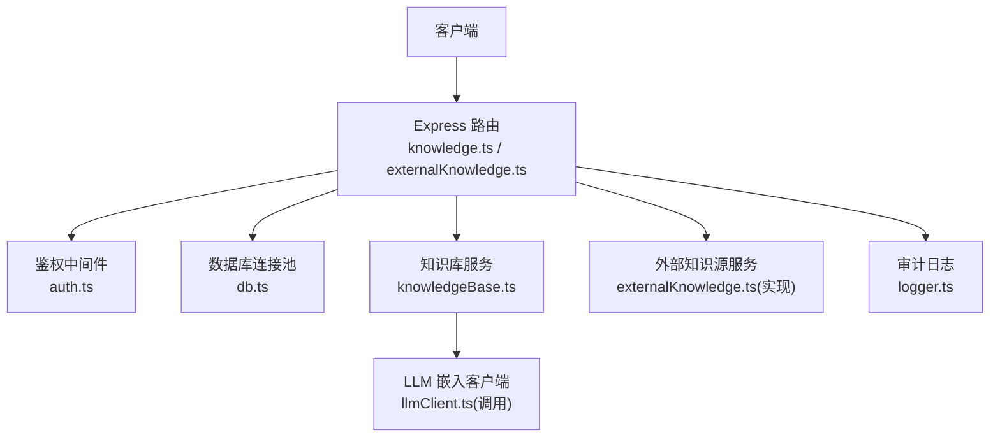
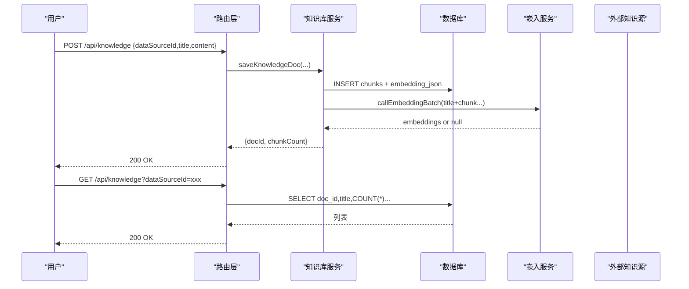
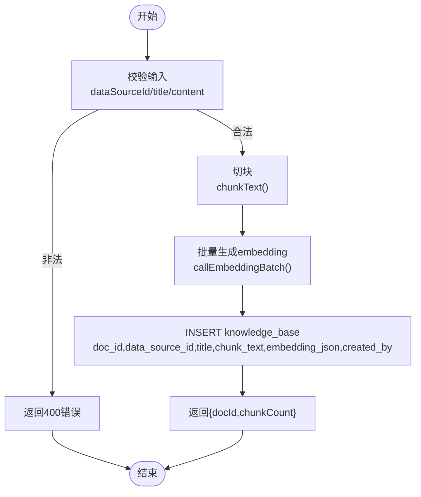
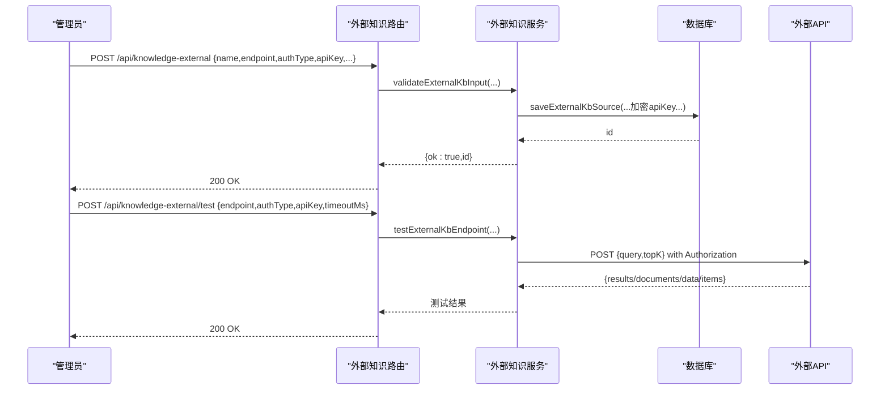
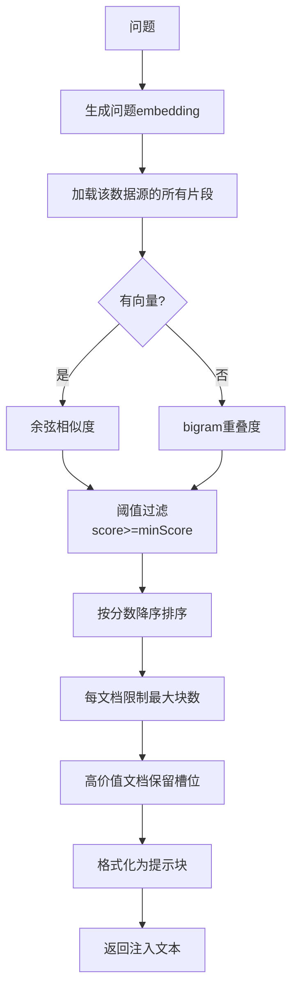
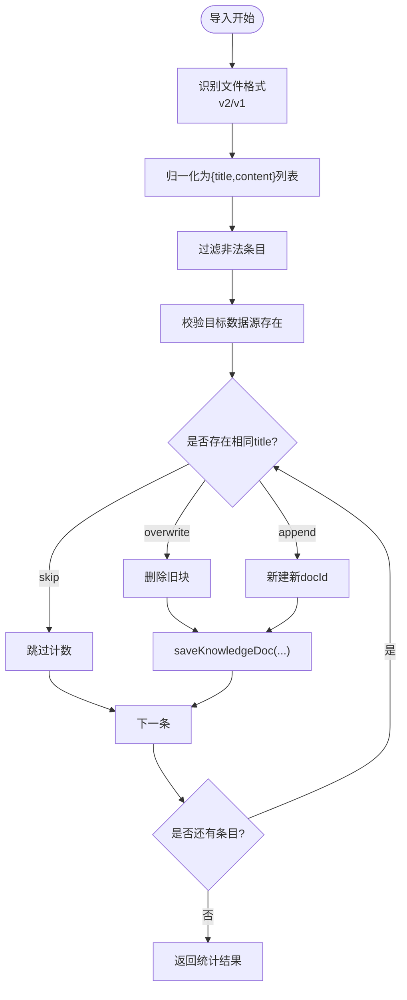
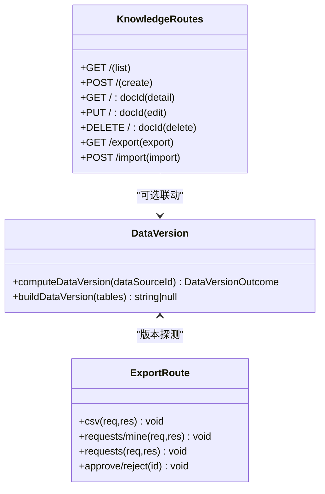
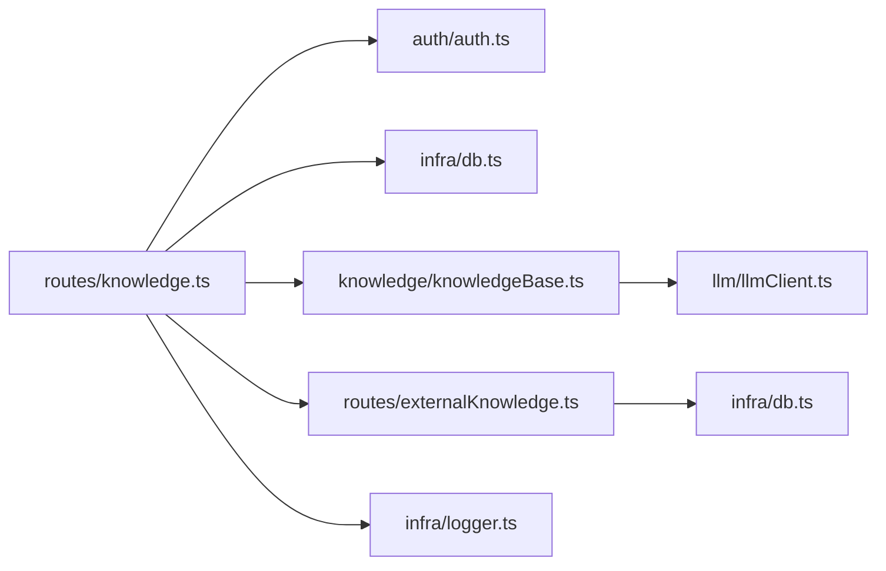

# 知识库API

<cite>
**本文引用的文件**
- [server/routes/knowledge.ts](file://server/routes/knowledge.ts)
- [server/routes/externalKnowledge.ts](file://server/routes/externalKnowledge.ts)
- [server/knowledge/knowledgeBase.ts](file://server/knowledge/knowledgeBase.ts)
- [server/knowledge/knowledgeServices.ts](file://server/knowledge/knowledgeServices.ts)
- [server/knowledge/knowledgeBaseTools.ts](file://server/knowledge/knowledgeBaseTools.ts)
- [server/routes/export.ts](file://server/routes/export.ts)
- [server/dataVersion.ts](file://server/dataVersion.ts)
- [server/auth/auth.ts](file://server/auth/auth.ts)
- [server/infra/db.ts](file://server/infra/db.ts)
- [server/infra/logger.ts](file://server/infra/logger.ts)
</cite>

## 目录
1. [简介](#简介)
2. [项目结构](#项目结构)
3. [核心组件](#核心组件)
4. [架构总览](#架构总览)
5. [详细组件分析](#详细组件分析)
6. [依赖关系分析](#依赖关系分析)
7. [性能考量](#性能考量)
8. [故障排查指南](#故障排查指南)
9. [结论](#结论)
10. [附录：接口规范与示例](#附录接口规范与示例)

## 简介
本文件为“知识库管理API”的权威技术文档，覆盖以下能力：
- 内部知识条目（doc/chunk）的CRUD：创建、编辑、删除、查询。
- 外部知识源集成：配置、认证、连通性测试、检索聚合。
- 语义搜索：向量检索、相似度匹配、结果排序与阈值过滤。
- 导入导出：完整备份恢复、批量操作、增量策略、dryRun预检。
- 版本管理与权限控制：数据版本指纹、管理员权限、审计日志。
- 外部知识源的错误处理、超时控制、降级与一致性保障。

## 项目结构
知识库相关代码主要分布在 server/routes 与 server/knowledge 两个层次：
- routes 层：HTTP 路由、鉴权、参数校验、响应封装。
- knowledge 层：业务逻辑（切块、嵌入、检索、排序）、外部源调用、导入导出工具。

图表来源
- [server/routes/knowledge.ts:1-457](file://server/routes/knowledge.ts#L1-L457)
- [server/routes/externalKnowledge.ts:1-85](file://server/routes/externalKnowledge.ts#L1-L85)
- [server/knowledge/knowledgeBase.ts:1-239](file://server/knowledge/knowledgeBase.ts#L1-L239)
- [server/auth/auth.ts:1-200](file://server/auth/auth.ts#L1-L200)
- [server/infra/db.ts:1-200](file://server/infra/db.ts#L1-L200)
- [server/infra/logger.ts:1-200](file://server/infra/logger.ts#L1-L200)

章节来源
- [server/routes/knowledge.ts:1-457](file://server/routes/knowledge.ts#L1-L457)
- [server/routes/externalKnowledge.ts:1-85](file://server/routes/externalKnowledge.ts#L1-L85)

## 核心组件
- 内部知识库（doc/chunk）：按数据源登记知识文档，自动切块、生成向量并入库；检索时按问题与片段计算相似度，返回Top-K片段注入到问答流程。
- 外部知识源：管理员配置外部API端点与认证；问数链路并行检索多个外部源，聚合结果并标注来源。
- 导入导出：支持JSON格式的知识库备份与恢复，兼容新旧格式，提供冲突处理策略与dryRun预检。
- 版本与权限：数据版本指纹用于检测底层数据变化；写操作需ADMIN角色；导出带水印与审批流；所有关键操作记录审计日志。

章节来源
- [server/knowledge/knowledgeBase.ts:1-239](file://server/knowledge/knowledgeBase.ts#L1-L239)
- [server/knowledge/knowledgeServices.ts:1-260](file://server/knowledge/knowledgeServices.ts#L1-L260)
- [server/knowledge/knowledgeBaseTools.ts:1-201](file://server/knowledge/knowledgeBaseTools.ts#L1-L201)
- [server/routes/export.ts:1-226](file://server/routes/export.ts#L1-L226)
- [server/dataVersion.ts:1-104](file://server/dataVersion.ts#L1-L104)

## 架构总览
知识库系统由“路由层 + 服务层 + 存储层 + 外部服务”构成：
- 路由层负责鉴权、参数校验、调用服务并返回统一响应。
- 服务层实现切块、嵌入、检索、排序、外部源调用、导入导出等核心逻辑。
- 存储层通过数据库连接池访问MySQL，持久化知识片段与外部源配置。
- 外部服务通过HTTP API对接，支持Bearer认证与超时控制。

图表来源
- [server/routes/knowledge.ts:93-107](file://server/routes/knowledge.ts#L93-L107)
- [server/knowledge/knowledgeBase.ts:172-197](file://server/knowledge/knowledgeBase.ts#L172-L197)
- [server/routes/knowledge.ts:70-91](file://server/routes/knowledge.ts#L70-L91)

## 详细组件分析

### 内部知识条目 CRUD（doc/chunk）
- 列出文档：按数据源聚合，返回doc元信息与切块数量。
- 创建文档：校验必填字段，切块后批量生成embedding并插入，返回docId与chunkCount。
- 详情查询：按docId返回切块明细（含顺序）。
- 编辑文档：删除旧块后以同一docId重新切块入库（embedding重新生成）。
- 删除文档：按docId删除全部关联块。

图表来源
- [server/routes/knowledge.ts:93-107](file://server/routes/knowledge.ts#L93-L107)
- [server/knowledge/knowledgeBase.ts:44-75](file://server/knowledge/knowledgeBase.ts#L44-L75)
- [server/knowledge/knowledgeBase.ts:172-197](file://server/knowledge/knowledgeBase.ts#L172-L197)

章节来源
- [server/routes/knowledge.ts:70-107](file://server/routes/knowledge.ts#L70-L107)
- [server/routes/knowledge.ts:389-453](file://server/routes/knowledge.ts#L389-L453)
- [server/knowledge/knowledgeBase.ts:172-197](file://server/knowledge/knowledgeBase.ts#L172-L197)

### 外部知识源集成接口
- 配置管理：新增、编辑、删除外部知识源；名称、endpoint、authType、apiKey、timeoutMs、dataSourceId、enabled。
- 连通性测试：不保存配置，直接发起一次检索请求验证连通性与响应解析。
- 检索聚合：根据当前数据源筛选启用的外部源（精确匹配或通配*），并行调用，失败降级为空，最终聚合为带来源前缀的片段文本。

图表来源
- [server/routes/externalKnowledge.ts:19-82](file://server/routes/externalKnowledge.ts#L19-L82)
- [server/knowledge/externalKnowledge.test.ts:74-123](file://server/knowledge/externalKnowledge.test.ts#L74-L123)
- [server/knowledge/externalKnowledge.test.ts:193-205](file://server/knowledge/externalKnowledge.test.ts#L193-L205)

章节来源
- [server/routes/externalKnowledge.ts:1-85](file://server/routes/externalKnowledge.ts#L1-L85)
- [server/knowledge/externalKnowledge.test.ts:18-72](file://server/knowledge/externalKnowledge.test.ts#L18-L72)
- [server/knowledge/externalKnowledge.test.ts:125-206](file://server/knowledge/externalKnowledge.test.ts#L125-L206)

### 语义搜索功能（向量检索、相似度匹配、结果排序）
- 切块与嵌入：按段落优先、定长兜底切块，相邻块保留重叠；批量生成embedding，失败则置空走关键词降级。
- 相似度计算：向量模式使用余弦相似度；无向量时降级为bigram关键词重叠。
- 阈值过滤：向量模式下设置最小相似度阈值（默认0.35，可通过环境变量调整），低于阈值的片段不注入。
- 排序与去重：按得分降序；同一文档最多入选固定数量块；高价值口径/指南类文档可保留一个槽位。
- 格式化注入：将命中片段拼接为强指令提示块，约束SQL生成遵循口径与术语。

图表来源
- [server/knowledge/knowledgeBase.ts:106-166](file://server/knowledge/knowledgeBase.ts#L106-L166)
- [server/knowledge/knowledgeBase.ts:207-239](file://server/knowledge/knowledgeBase.ts#L207-L239)

章节来源
- [server/knowledge/knowledgeBase.ts:13-41](file://server/knowledge/knowledgeBase.ts#L13-L41)
- [server/knowledge/knowledgeBase.ts:106-166](file://server/knowledge/knowledgeBase.ts#L106-L166)
- [server/knowledge/knowledgeBase.ts:207-239](file://server/knowledge/knowledgeBase.ts#L207-L239)

### 导入导出与批量操作
- 导出：按数据源导出全部知识文档为JSON，包含还原后的content与原始chunks；文件名带日期与数据源名。
- 导入：支持v2（knowledge-docs）与v1（knowledgeBase条目数组）两种格式；冲突判定基于同数据源下同title；支持skip/overwrite/append策略；dryRun仅预检不写库。
- 批量初始化：应用启动时可批量写入种子数据，事务保证一致性。

图表来源
- [server/routes/knowledge.ts:249-375](file://server/routes/knowledge.ts#L249-L375)
- [server/knowledge/knowledgeServices.ts:214-259](file://server/knowledge/knowledgeServices.ts#L214-L259)

章节来源
- [server/routes/knowledge.ts:164-224](file://server/routes/knowledge.ts#L164-L224)
- [server/routes/knowledge.ts:249-375](file://server/routes/knowledge.ts#L249-L375)
- [server/knowledge/knowledgeServices.ts:214-259](file://server/knowledge/knowledgeServices.ts#L214-L259)

### 版本管理、权限控制、审计日志
- 版本管理：数据版本指纹基于表行数与更新时间计算，缓存10秒，用于前端检测数据变化并触发更新。
- 权限控制：写操作（创建、编辑、删除、导入、外部源配置）要求ADMIN角色；读操作对所有登录用户开放。
- 审计日志：导出CSV带水印与审批流；所有导出/拦截均记录审计日志；知识库导入/导出也记录日志。

图表来源
- [server/dataVersion.ts:37-98](file://server/dataVersion.ts#L37-L98)
- [server/routes/export.ts:91-223](file://server/routes/export.ts#L91-L223)
- [server/routes/knowledge.ts:70-453](file://server/routes/knowledge.ts#L70-L453)

章节来源
- [server/dataVersion.ts:1-104](file://server/dataVersion.ts#L1-L104)
- [server/routes/export.ts:1-226](file://server/routes/export.ts#L1-L226)
- [server/routes/knowledge.ts:27-31](file://server/routes/knowledge.ts#L27-L31)

## 依赖关系分析
- 路由层依赖鉴权中间件与数据库连接池。
- 知识库服务依赖LLM嵌入客户端进行向量化，失败时降级为关键词检索。
- 外部知识源服务依赖HTTP客户端，支持超时与认证头注入。
- 审计日志模块记录关键操作，便于追踪与合规。

图表来源
- [server/routes/knowledge.ts:25-31](file://server/routes/knowledge.ts#L25-L31)
- [server/knowledge/knowledgeBase.ts:9-11](file://server/knowledge/knowledgeBase.ts#L9-L11)
- [server/routes/externalKnowledge.ts:6-14](file://server/routes/externalKnowledge.ts#L6-L14)

章节来源
- [server/routes/knowledge.ts:25-31](file://server/routes/knowledge.ts#L25-L31)
- [server/knowledge/knowledgeBase.ts:9-11](file://server/knowledge/knowledgeBase.ts#L9-L11)
- [server/routes/externalKnowledge.ts:6-14](file://server/routes/externalKnowledge.ts#L6-L14)

## 性能考量
- 切块与重叠：按段落优先合并，超长块按步长切分，减少语义截断影响。
- 批量嵌入：一次性提交多段文本，降低网络往返次数；整体失败时降级为关键词检索。
- 相似度阈值：避免无关问题强行注入知识，提升模型注意力效率。
- 外部源并行：多源并发检索，单源失败不影响其他源结果。
- 版本缓存：数据版本指纹内存缓存10秒，防止轮询风暴。

[本节为通用性能建议，无需特定文件引用]

## 故障排查指南
- 导入失败：检查文件格式是否为v2或v1；确认dataSourceId存在；查看mergeStrategy是否正确；关注dryRun预检结果。
- 外部源测试失败：确认endpoint为http(s)；bearer认证需携带apiKey；检查timeoutMs是否合理；查看非2xx响应错误。
- 检索结果为空：检查向量阈值是否过高；确认embedding生成是否成功；验证数据源下是否有知识片段。
- 权限错误：确认当前用户角色为ADMIN；写操作均需ADMIN权限。
- 审计日志：导出CSV会记录水印与审批状态；知识库导入导出也会记录日志，便于定位问题。

章节来源
- [server/routes/knowledge.ts:249-375](file://server/routes/knowledge.ts#L249-L375)
- [server/routes/externalKnowledge.ts:66-82](file://server/routes/externalKnowledge.ts#L66-L82)
- [server/knowledge/knowledgeBase.ts:207-239](file://server/knowledge/knowledgeBase.ts#L207-L239)
- [server/routes/export.ts:91-223](file://server/routes/export.ts#L91-L223)

## 结论
知识库API提供了完整的内部知识管理与外部知识源集成能力，支持语义搜索、导入导出、版本管理、权限控制与审计日志。系统设计注重健壮性与可维护性，具备降级机制与错误处理，确保在异常情况下仍能提供稳定服务。

[本节为总结性内容，无需特定文件引用]

## 附录：接口规范与示例

### 内部知识条目接口
- GET /api/knowledge?dataSourceId=xxx
  - 描述：列出某数据源的知识文档（按doc聚合）
  - 响应：{ docs: [{ docId, title, chunkCount, createdBy, createdAt }] }
- POST /api/knowledge
  - 描述：登记知识文档（ADMIN）
  - 请求体：{ dataSourceId, title, content }
  - 响应：{ ok: true, docId, chunkCount }
- GET /api/knowledge/:docId
  - 描述：知识文档详情（元信息 + 切块明细）
  - 响应：{ doc: { docId, dataSourceId, title, createdBy, createdAt, chunkCount, chunks: [{ index, text }] } }
- PUT /api/knowledge/:docId
  - 描述：编辑知识文档（ADMIN）
  - 请求体：{ title, content }
  - 响应：{ ok: true, docId, chunkCount }
- DELETE /api/knowledge/:docId
  - 描述：删除知识文档（ADMIN）
  - 响应：{ ok: true }

章节来源
- [server/routes/knowledge.ts:70-107](file://server/routes/knowledge.ts#L70-L107)
- [server/routes/knowledge.ts:389-453](file://server/routes/knowledge.ts#L389-L453)

### 外部知识源接口
- GET /api/knowledge-external
  - 描述：列出全部外部知识源（不包含明文密钥）
  - 响应：{ sources: [{ id, name, endpoint, authType, hasKey, enabled, ... }] }
- POST /api/knowledge-external
  - 描述：新增外部知识源（ADMIN）
  - 请求体：{ name, endpoint, authType, apiKey?, timeoutMs, dataSourceId, enabled }
  - 响应：{ ok: true, id }
- PUT /api/knowledge-external/:id
  - 描述：编辑外部知识源（ADMIN）
  - 请求体：同上
  - 响应：{ ok: true, id }
- DELETE /api/knowledge-external/:id
  - 描述：删除外部知识源（ADMIN）
  - 响应：{ ok: true }
- POST /api/knowledge-external/test
  - 描述：连通性测试（不落库）
  - 请求体：{ endpoint, authType, apiKey?, timeoutMs }
  - 响应：测试结果对象

章节来源
- [server/routes/externalKnowledge.ts:19-82](file://server/routes/externalKnowledge.ts#L19-L82)

### 导入导出接口
- GET /api/knowledge/export?dataSourceId=xxx
  - 描述：导出指定数据源的全部知识文档为JSON（ADMIN）
  - 响应：application/json 文件流，包含version、type、exportedAt、dataSourceId、docs[]
- POST /api/knowledge/import
  - 描述：从JSON备份恢复知识文档（ADMIN）
  - 请求体：{ fileData, dataSourceId?, mergeStrategy: skip|overwrite|append, dryRun }
  - 响应：{ success, dryRun, mergeStrategy, dataSourceId, dataSourceName, importedCount, updatedCount, skippedCount, errorCount, errors, summary }

章节来源
- [server/routes/knowledge.ts:164-224](file://server/routes/knowledge.ts#L164-L224)
- [server/routes/knowledge.ts:249-375](file://server/routes/knowledge.ts#L249-L375)

### 语义搜索行为说明
- 向量检索：当问题与片段均有embedding时，使用余弦相似度计算相关性。
- 相似度阈值：默认0.35，可通过环境变量KNOWLEDGE_MIN_SCORE调整。
- 结果排序：按得分降序；同一文档最多入选固定数量块；高价值文档可保留一个槽位。
- 降级策略：无向量时降级为bigram关键词检索；外部源失败不影响其他源结果。

章节来源
- [server/knowledge/knowledgeBase.ts:13-41](file://server/knowledge/knowledgeBase.ts#L13-L41)
- [server/knowledge/knowledgeBase.ts:106-166](file://server/knowledge/knowledgeBase.ts#L106-L166)
- [server/knowledge/knowledgeBase.ts:207-239](file://server/knowledge/knowledgeBase.ts#L207-L239)

### 版本管理与权限控制
- 数据版本指纹：基于表行数与更新时间计算，缓存10秒，用于前端检测数据变化。
- 权限控制：写操作需ADMIN角色；读操作对所有登录用户开放。
- 审计日志：导出CSV带水印与审批流；知识库导入导出记录日志。

章节来源
- [server/dataVersion.ts:37-98](file://server/dataVersion.ts#L37-L98)
- [server/routes/export.ts:91-223](file://server/routes/export.ts#L91-L223)
- [server/routes/knowledge.ts:27-31](file://server/routes/knowledge.ts#L27-L31)