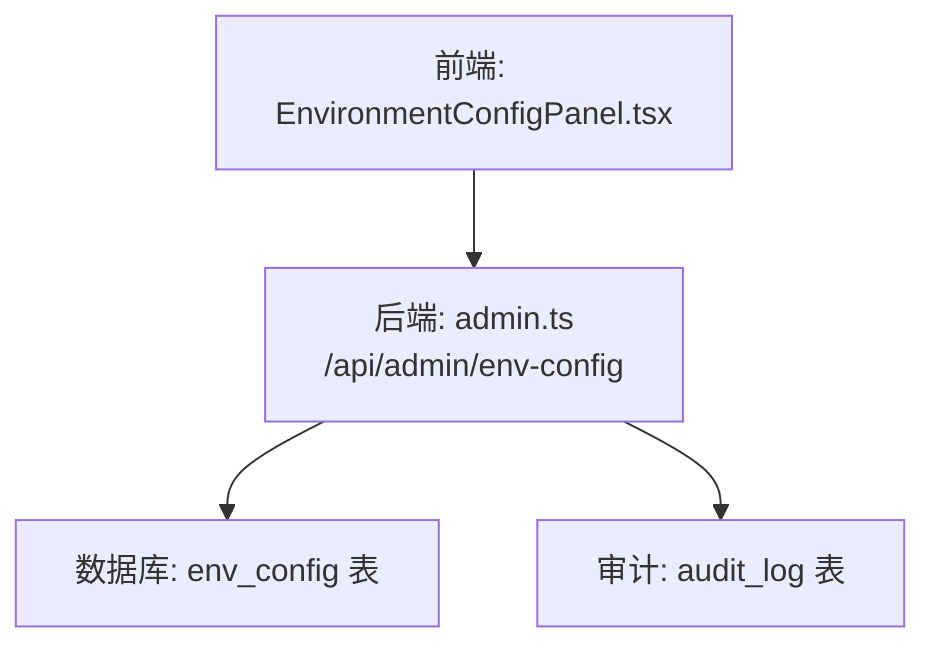
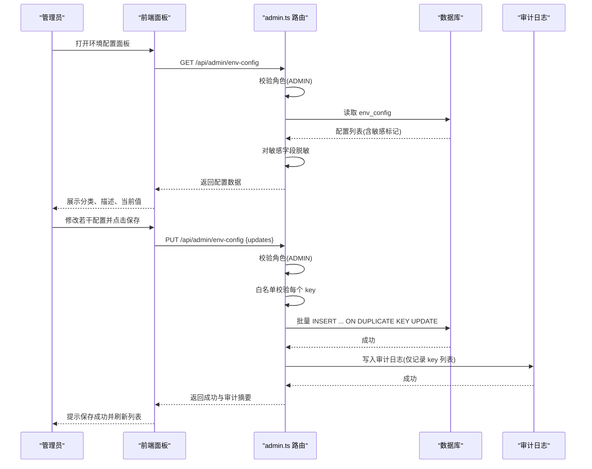
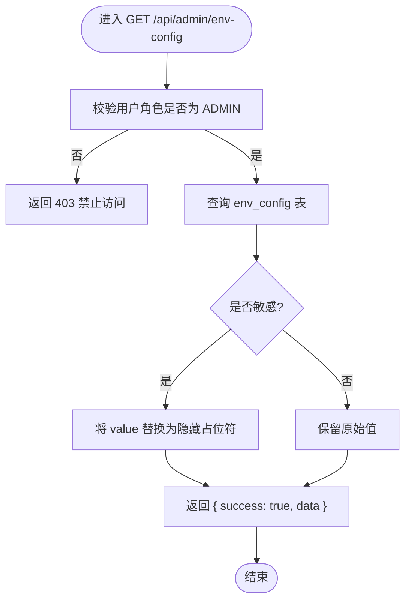
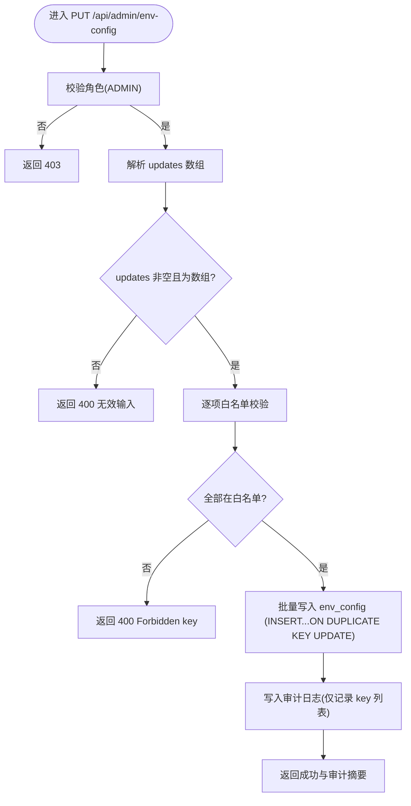
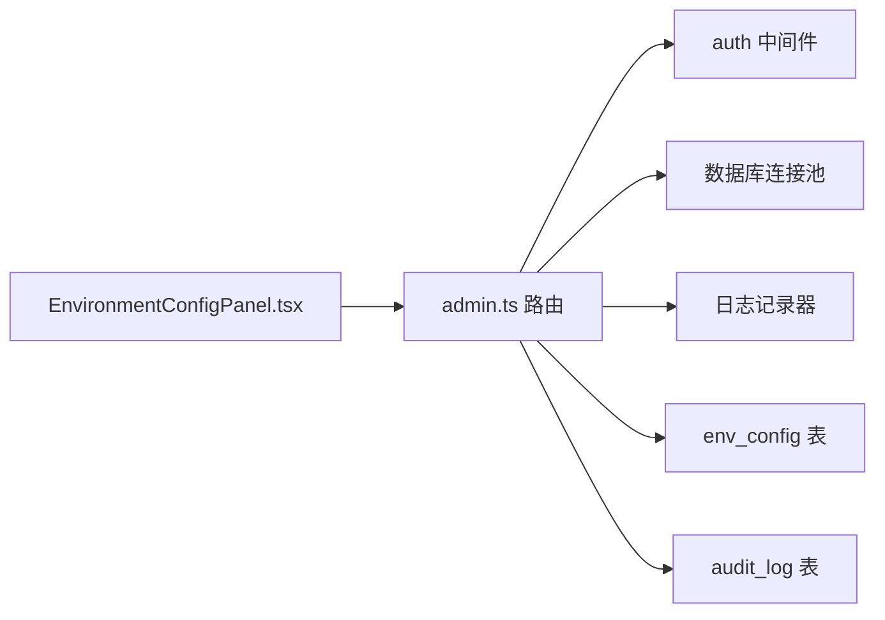

# 环境配置API

<cite>
**本文引用的文件**
- [server/routes/admin.ts](file://server/routes/admin.ts)
- [src/components/admin/EnvironmentConfigPanel.tsx](file://src/components/admin/EnvironmentConfigPanel.tsx)
- [server/infra/auditLog.ts](file://server/infra/auditLog.ts)
</cite>

## 目录
1. [简介](#简介)
2. [项目结构](#项目结构)
3. [核心组件](#核心组件)
4. [架构总览](#架构总览)
5. [详细组件分析](#详细组件分析)
6. [依赖关系分析](#依赖关系分析)
7. [性能考虑](#性能考虑)
8. [故障排查指南](#故障排查指南)
9. [结论](#结论)
10. [附录：请求与响应示例](#附录请求与响应示例)

## 简介
本章节面向“环境配置管理”能力，提供系统级环境变量（持久化到数据库）的查询与批量更新接口。重点说明：
- 配置项白名单机制与允许键列表
- 敏感信息保护（脱敏显示、审计日志）
- 配置更新的原子性与错误回滚策略
- 权限控制与访问限制
- 配置分类管理与描述信息展示
- 完整的请求/响应示例（查询、批量更新、权限校验等）

## 项目结构
与环境配置API相关的代码主要位于服务端路由与前端管理面板：
- 服务端路由：实现 GET/PUT /api/admin/env-config，负责权限校验、白名单校验、数据读写、审计记录
- 前端面板：提供可视化编辑界面，按分类展示配置项，支持保存与刷新

图表来源
- [server/routes/admin.ts:212-292](file://server/routes/admin.ts#L212-L292)
- [src/components/admin/EnvironmentConfigPanel.tsx:42-85](file://src/components/admin/EnvironmentConfigPanel.tsx#L42-L85)

章节来源
- [server/routes/admin.ts:212-292](file://server/routes/admin.ts#L212-L292)
- [src/components/admin/EnvironmentConfigPanel.tsx:1-209](file://src/components/admin/EnvironmentConfigPanel.tsx#L1-L209)

## 核心组件
- 配置查询接口 GET /api/admin/env-config
  - 仅 ADMIN 角色可访问
  - 返回所有配置项，包含 key、value、category、description、is_sensitive、updated_at
  - 对 is_sensitive=true 的配置值进行脱敏显示（返回固定占位符）
- 配置批量更新接口 PUT /api/admin/env-config
  - 仅 ADMIN 角色可访问
  - 接收 updates 数组，每项为 {key, value}
  - 严格白名单校验，不在允许列表中的 key 将被拒绝
  - 使用“插入或更新”语句进行批量写入
  - 写入成功后记录审计日志（仅记录变更的 key 列表，不记录明文值）

章节来源
- [server/routes/admin.ts:212-292](file://server/routes/admin.ts#L212-L292)

## 架构总览
下图展示了从前端到后端的完整调用链，包括权限校验、白名单校验、数据持久化与审计落库。

图表来源
- [server/routes/admin.ts:212-292](file://server/routes/admin.ts#L212-L292)
- [src/components/admin/EnvironmentConfigPanel.tsx:42-85](file://src/components/admin/EnvironmentConfigPanel.tsx#L42-L85)

## 详细组件分析

### 配置查询接口 GET /api/admin/env-config
- 权限控制：要求登录且角色为 ADMIN，否则返回 403
- 数据来源：env_config 表，字段包括 key、value、category、description、is_sensitive、updated_at
- 敏感信息保护：当 is_sensitive 为真时，返回的 value 统一替换为固定占位符，避免泄露真实值
- 错误处理：捕获异常并返回 500 及错误信息

图表来源
- [server/routes/admin.ts:212-233](file://server/routes/admin.ts#L212-L233)

章节来源
- [server/routes/admin.ts:212-233](file://server/routes/admin.ts#L212-L233)

### 配置批量更新接口 PUT /api/admin/env-config
- 权限控制：要求登录且角色为 ADMIN，否则返回 403
- 输入校验：
  - 必须提供 updates 数组且非空
  - 白名单校验：仅允许以下键（大小写敏感）：
    - OLLAMA_URL、LLM_MODEL、AI_ENGINE、QWEN_API_KEY、QWEN_URL、QWEN_MODEL
    - OLLAMA_TIMEOUT_MS、LLM_SQL_ENGINE、LLM_SQL_MODEL、LLM_ANALYSIS_ENGINE、LLM_ANALYSIS_MODEL
    - LLM_SQL_ROUTE_MAX_TABLES、QUERY_CACHE_TTL_MINUTES
    - MYSQL_HOST、MYSQL_PORT、MYSQL_USER、MYSQL_PASSWORD
    - MYSQL_DATABASE、JWT_SECRET、JWT_EXPIRES_IN
    - USER_QUERY_RATE_MAX、APP_URL
  - 任何不在白名单的 key 将直接拒绝并返回 400
- 数据持久化：
  - 使用“插入或更新”语句，保证幂等性；若 key 已存在则更新 value 与 updated_by、updated_at
  - 每次写入均记录 updated_by 为当前管理员 ID
- 审计日志：
  - 成功后写入审计日志，action 为 ENV_CONFIG_UPDATE
  - details 中仅记录变更的 key 列表，并对值进行脱敏处理（不记录明文）
- 错误处理：
  - 捕获异常并返回 500 及错误信息
  - 注意：当前实现未显式开启事务，单条失败不会自动回滚其他条目

图表来源
- [server/routes/admin.ts:235-292](file://server/routes/admin.ts#L235-L292)

章节来源
- [server/routes/admin.ts:235-292](file://server/routes/admin.ts#L235-L292)

### 前端环境配置面板
- 仅 ADMIN 可见，加载时调用 GET /api/admin/env-config 获取配置列表
- 按 category 分组展示，支持编辑 value（敏感字段默认以密码框形式呈现）
- 保存时将当前所有配置项转为 updates 数组，调用 PUT /api/admin/env-config
- 保存成功后刷新列表并提示结果

章节来源
- [src/components/admin/EnvironmentConfigPanel.tsx:30-85](file://src/components/admin/EnvironmentConfigPanel.tsx#L30-L85)
- [src/components/admin/EnvironmentConfigPanel.tsx:119-209](file://src/components/admin/EnvironmentConfigPanel.tsx#L119-L209)

### 审计追踪与历史记录
- 配置更新成功后，会向审计日志表写入一条记录，action 为 ENV_CONFIG_UPDATE
- 审计详情中仅记录变更的 key 列表，不对值进行明文记录
- 通用审计写入逻辑见审计模块，确保旁路埋点与写入失败不影响主流程

章节来源
- [server/routes/admin.ts:271-287](file://server/routes/admin.ts#L271-L287)
- [server/infra/auditLog.ts:38-61](file://server/infra/auditLog.ts#L38-L61)

## 依赖关系分析
- 路由层依赖：
  - 认证与鉴权中间件（requireRole('ADMIN')）
  - 数据库连接池（getPool）
  - 日志记录器（logger）
- 数据层依赖：
  - env_config 表：存储配置项及其元数据
  - audit_log 表：记录配置变更审计
- 前端依赖：
  - 统一的 apiFetch 客户端
  - 用户状态 store（用于判断角色）

图表来源
- [server/routes/admin.ts:1-13](file://server/routes/admin.ts#L1-L13)
- [server/routes/admin.ts:212-292](file://server/routes/admin.ts#L212-L292)
- [src/components/admin/EnvironmentConfigPanel.tsx:1-10](file://src/components/admin/EnvironmentConfigPanel.tsx#L1-L10)

章节来源
- [server/routes/admin.ts:1-13](file://server/routes/admin.ts#L1-L13)
- [server/routes/admin.ts:212-292](file://server/routes/admin.ts#L212-L292)
- [src/components/admin/EnvironmentConfigPanel.tsx:1-10](file://src/components/admin/EnvironmentConfigPanel.tsx#L1-L10)

## 性能考虑
- 查询接口为简单 SELECT，无复杂过滤，性能开销低
- 批量更新采用“插入或更新”语句，减少重复写入成本
- 审计日志写入为异步旁路埋点，写入失败不阻塞主流程，保障可用性
- 建议在高并发场景下：
  - 对 env_config 表 key 列建立唯一索引（由业务语义保证）
  - 合理设置数据库连接池大小与超时参数
  - 对频繁更新的键进行缓存（如应用启动时加载），但需关注一致性

[本节为通用指导，无需特定文件引用]

## 故障排查指南
- 403 禁止访问
  - 原因：当前用户不是 ADMIN 或未登录
  - 处理：确认用户角色并重新登录
- 400 无效输入/Forbidden key
  - 原因：updates 为空或非数组，或包含不在白名单的 key
  - 处理：检查请求体结构与键名是否在允许列表中
- 500 内部服务器错误
  - 原因：数据库异常或未知错误
  - 处理：查看服务端日志定位具体错误堆栈
- 敏感字段显示为隐藏占位符
  - 行为：is_sensitive=true 的配置在查询时会被脱敏
  - 处理：如需修改，请在前端重新输入明文值再提交保存

章节来源
- [server/routes/admin.ts:212-292](file://server/routes/admin.ts#L212-L292)

## 结论
环境配置API通过严格的权限控制、白名单校验与审计记录，提供了安全可控的环境变量管理能力。敏感字段在查询时自动脱敏，更新操作记录审计日志以便追溯。当前实现未显式开启事务，批量更新不具备原子回滚特性；在高可靠性需求场景下，建议引入事务以保证一致性与可回滚性。

[本节为总结性内容，无需特定文件引用]

## 附录：请求与响应示例

- 配置查询
  - 方法：GET
  - 路径：/api/admin/env-config
  - 权限：ADMIN
  - 请求头：需携带有效会话令牌
  - 响应体示例：
    - 成功：{ success: true, data: [{ key, value, category, description, is_sensitive, updated_at }, ...] }
    - 失败：{ success: false, error: "Access denied" }（403）或 { success: false, error: "..." }（500）

- 批量更新配置
  - 方法：PUT
  - 路径：/api/admin/env-config
  - 权限：ADMIN
  - 请求体示例：
    - { updates: [{ key: "OLLAMA_URL", value: "http://localhost:11434" }, { key: "LLM_MODEL", value: "deepseek-r1:32b" }] }
  - 响应体示例：
    - 成功：{ success: true, message: "Updated N config items", audit_log: { user_id, username, timestamp, changes: ["KEY1","KEY2",...] } }
    - 失败：{ success: false, error: "Forbidden key: INVALID_KEY" }（400）或 { success: false, error: "..." }（500）

- 权限验证失败
  - 非 ADMIN 用户访问任一配置接口均返回 403

- 前端交互要点
  - 仅 ADMIN 可见面板
  - 敏感字段在前端以密码框形式展示，保存时需重新输入明文
  - 保存成功后刷新列表并提示

章节来源
- [server/routes/admin.ts:212-292](file://server/routes/admin.ts#L212-L292)
- [src/components/admin/EnvironmentConfigPanel.tsx:30-85](file://src/components/admin/EnvironmentConfigPanel.tsx#L30-L85)