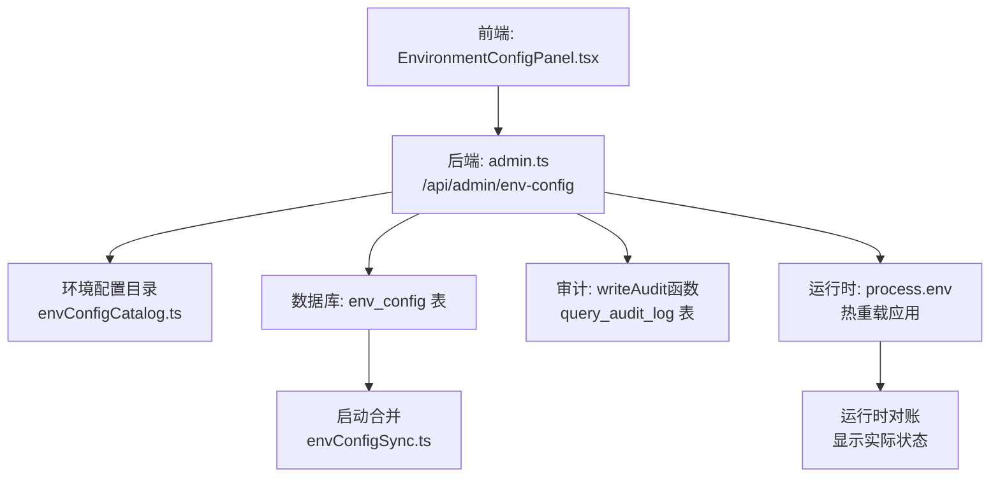
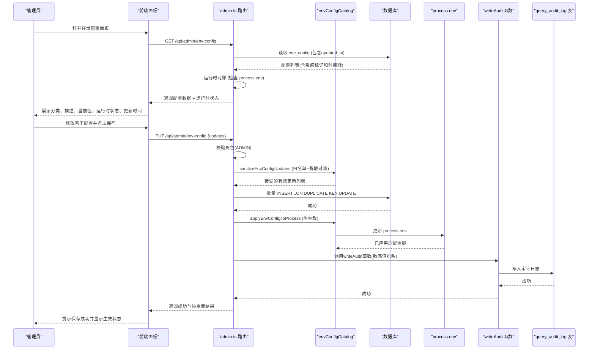
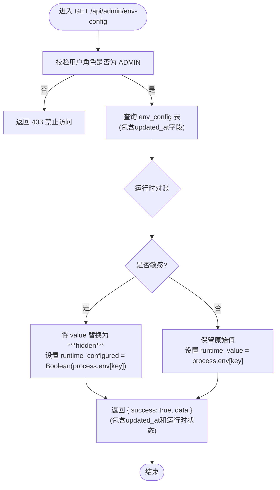
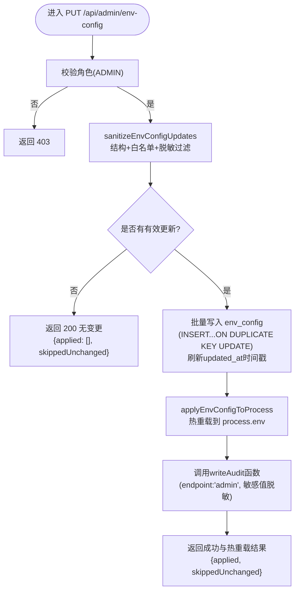
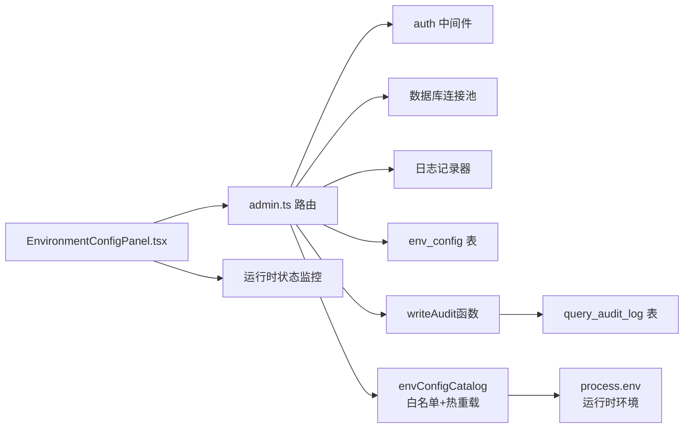

# 环境配置API

<cite>
**本文引用的文件**
- [server/routes/admin.ts](file://server/routes/admin.ts)
- [src/components/admin/EnvironmentConfigPanel.tsx](file://src/components/admin/EnvironmentConfigPanel.tsx)
- [server/infra/envConfigCatalog.ts](file://server/infra/envConfigCatalog.ts)
- [server/infra/envConfigSync.ts](file://server/infra/envConfigSync.ts)
- [server/infra/auditLog.ts](file://server/infra/auditLog.ts)
</cite>

## 更新摘要
**变更内容**
- **v0.9.61重大改进**：实现真正的运行时热重载配置值，无需服务重启即可生效
- 新增运行时对账功能，显示面板保存值与进程环境变量的实际差异
- 增强验证机制，支持脱敏哨兵跳过未修改的敏感字段
- 启动时自动合并数据库配置到进程环境，确保配置持久化
- 前端界面增加实时状态反馈和重启提示

## 目录
1. [简介](#简介)
2. [项目结构](#项目结构)
3. [核心组件](#核心组件)
4. [架构总览](#架构总览)
5. [详细组件分析](#详细组件分析)
6. [依赖关系分析](#依赖关系分析)
7. [性能考虑](#性能考虑)
8. [故障排查指南](#故障排查指南)
9. [结论](#结论)
10. [附录：请求与响应示例](#附录请求与响应示例)

## 简介
本章节面向"环境配置管理"能力，提供系统级环境变量（持久化到数据库）的查询与批量更新接口。**v0.9.61版本实现了真正的运行时热重载功能**，允许管理员在不重启服务的情况下动态调整系统配置。重点说明：
- 配置项白名单机制与允许键列表
- 敏感信息保护（脱敏显示、审计日志）
- **v0.9.61新增**：运行时热重载机制与配置生效策略
- **v0.9.61新增**：运行时对账功能，显示配置的实际生效状态
- 配置更新的原子性保证和错误回滚策略
- 权限控制与访问限制
- 配置分类管理与描述信息展示
- 完整的请求/响应示例（查询、批量更新、权限校验等）
- 配置变更的审计追踪和历史记录管理

## 项目结构
与环境配置API相关的代码主要位于服务端路由、前端管理面板和环境配置管理模块：
- 服务端路由：实现 GET/PUT /api/admin/env-config，负责权限校验、白名单校验、数据读写、审计记录和**运行时热重载**
- 前端面板：提供可视化编辑界面，按分类展示配置项，支持保存、刷新和**运行时状态监控**
- **v0.9.61新增**：环境配置目录模块，定义白名单、脱敏规则和热重载逻辑
- **v0.9.61新增**：配置同步模块，处理启动时的配置合并

```mermaid
graph TB
FE["前端: EnvironmentConfigPanel.tsx"] --> API["后端: admin.ts<br/>/api/admin/env-config"]
API --> Catalog["环境配置目录<br/>envConfigCatalog.ts"]
API --> DB["数据库: env_config 表"]
API --> Audit["审计: writeAudit函数<br/>query_audit_log 表"]
API --> Runtime["运行时: process.env<br/>热重载应用"]
Runtime --> Monitor["运行时对账<br/>显示实际状态"]
DB --> Sync["启动合并<br/>envConfigSync.ts"]
```

**图表来源**
- [server/routes/admin.ts:274-354](file://server/routes/admin.ts#L274-L354)
- [src/components/admin/EnvironmentConfigPanel.tsx:42-122](file://src/components/admin/EnvironmentConfigPanel.tsx#L42-L122)
- [server/infra/envConfigCatalog.ts:115-133](file://server/infra/envConfigCatalog.ts#L115-L133)
- [server/infra/envConfigSync.ts:14-26](file://server/infra/envConfigSync.ts#L14-L26)

**章节来源**
- [server/routes/admin.ts:274-354](file://server/routes/admin.ts#L274-L354)
- [src/components/admin/EnvironmentConfigPanel.tsx:1-268](file://src/components/admin/EnvironmentConfigPanel.tsx#L1-L268)
- [server/infra/envConfigCatalog.ts:1-133](file://server/infra/envConfigCatalog.ts#L1-L133)
- [server/infra/envConfigSync.ts:1-26](file://server/infra/envConfigSync.ts#L1-L26)

## 核心组件
- 配置查询接口 GET /api/admin/env-config
  - 仅 ADMIN 角色可访问
  - 返回所有配置项，包含 key、value、category、description、is_sensitive、updated_at
  - **v0.9.61增强**：新增 runtime_configured 和 runtime_value 字段，用于运行时对账
  - 对 is_sensitive=true 的配置值进行脱敏显示（返回固定占位符 `***hidden***`）
- 配置批量更新接口 PUT /api/admin/env-config
  - 仅 ADMIN 角色可访问
  - 接收 updates 数组，每项为 {key, value}
  - 严格白名单校验，不在允许列表中的 key 将被拒绝
  - **v0.9.61增强**：使用 sanitizeEnvConfigUpdates 进行智能过滤，跳过未修改的敏感字段
  - 使用"插入或更新"语句进行批量写入，自动刷新 updated_at 时间戳
  - **v0.9.61新增**：调用 applyEnvConfigToProcess 实现运行时热重载
  - 写入成功后通过统一writeAudit函数记录审计日志

**章节来源**
- [server/routes/admin.ts:274-354](file://server/routes/admin.ts#L274-L354)
- [server/infra/envConfigCatalog.ts:94-125](file://server/infra/envConfigCatalog.ts#L94-L125)

## 架构总览
下图展示了从前端到后端的完整调用链，包括权限校验、白名单校验、数据持久化、**运行时热重载**与增强的审计落库。

```mermaid
sequenceDiagram
participant U as "管理员"
participant FE as "前端面板"
participant API as "admin.ts 路由"
participant Catalog as "envConfigCatalog"
participant DB as "数据库"
participant Runtime as "process.env"
participant AUDIT as "writeAudit函数"
participant LOG as "query_audit_log 表"
U->>FE : 打开环境配置面板
FE->>API : GET /api/admin/env-config
API->>DB : 读取 env_config (包含updated_at)
DB-->>API : 配置列表(含敏感标记和时间戳)
API->>API : 运行时对账 (检查 process.env)
API-->>FE : 返回配置数据 + 运行时状态
FE-->>U : 展示分类、描述、当前值、运行时状态、更新时间
U->>FE : 修改若干配置并点击保存
FE->>API : PUT /api/admin/env-config {updates}
API->>API : 校验角色(ADMIN)
API->>Catalog : sanitizeEnvConfigUpdates (白名单+脱敏过滤)
Catalog-->>API : 接受的有效更新列表
API->>DB : 批量 INSERT...ON DUPLICATE KEY UPDATE
DB-->>API : 成功
API->>Catalog : applyEnvConfigToProcess (热重载)
Catalog->>Runtime : 更新 process.env
Runtime-->>Catalog : 已应用的配置键
API->>AUDIT : 调用writeAudit函数(敏感值脱敏)
AUDIT->>LOG : 写入审计日志
LOG-->>AUDIT : 成功
AUDIT-->>API : 成功
API-->>FE : 返回成功与热重载结果
FE-->>U : 提示保存成功并显示生效状态
```

**图表来源**
- [server/routes/admin.ts:274-354](file://server/routes/admin.ts#L274-L354)
- [src/components/admin/EnvironmentConfigPanel.tsx:42-122](file://src/components/admin/EnvironmentConfigPanel.tsx#L42-L122)
- [server/infra/envConfigCatalog.ts:94-125](file://server/infra/envConfigCatalog.ts#L94-L125)
- [server/infra/envConfigSync.ts:14-26](file://server/infra/envConfigSync.ts#L14-L26)

## 详细组件分析

### 配置查询接口 GET /api/admin/env-config
- 权限控制：要求登录且角色为 ADMIN，否则返回 403
- 数据来源：env_config 表，字段包括 key、value、category、description、is_sensitive、updated_at
- **v0.9.61关键增强**：
  - 显式查询 updated_at 字段，解决前端显示'Invalid Date'问题
  - 新增运行时对账：检查每个配置项在 process.env 中的实际状态
  - 对敏感字段进行脱敏显示，同时暴露 runtime_configured 布尔值
- 敏感信息保护：当 is_sensitive 为真时，返回的 value 统一替换为 `***hidden***`，避免泄露真实值
- 错误处理：捕获异常并返回 500 及错误信息

```mermaid
flowchart TD
Start(["进入 GET /api/admin/env-config"]) --> CheckRole["校验用户角色是否为 ADMIN"]
CheckRole --> |否| Deny["返回 403 禁止访问"]
CheckRole --> |是| Query["查询 env_config 表<br/>(包含updated_at字段)"]
Query --> RuntimeCheck{"运行时对账"}
RuntimeCheck --> Sanitize{"是否敏感?"}
Sanitize --> |是| Mask["将 value 替换为 ***hidden***<br/>设置 runtime_configured = Boolean(process.env[key])"]
Sanitize --> |否| Keep["保留原始值<br/>设置 runtime_value = process.env[key]"]
Mask --> Return["返回 { success: true, data }<br/>(包含updated_at和运行时状态)"]
Keep --> Return
Return --> End(["结束"])
```

**图表来源**
- [server/routes/admin.ts:274-297](file://server/routes/admin.ts#L274-L297)

**章节来源**
- [server/routes/admin.ts:274-297](file://server/routes/admin.ts#L274-L297)

### 配置批量更新接口 PUT /api/admin/env-config
- 权限控制：要求登录且角色为 ADMIN，否则返回 403
- **v0.9.61增强输入校验**：
  - 使用 sanitizeEnvConfigUpdates 进行结构化校验
  - 白名单校验：仅允许 ENV_CONFIG_SEED 中定义的键
  - 脱敏哨兵过滤：跳过值为 `***hidden***` 的敏感字段（表示未修改）
  - 任何不在白名单的 key 将直接拒绝并返回 400
- 数据持久化：
  - 使用"插入或更新"语句，保证幂等性；若 key 已存在则更新 value 与 updated_by、updated_at
  - 每次写入均记录 updated_by 为当前管理员 ID
- **v0.9.61新增运行时热重载**：
  - 调用 applyEnvConfigToProcess 将有效配置立即应用到 process.env
  - 排除 MYSQL_* 连接配置（自举悖论，需重启生效）
  - 返回实际应用的配置键列表
- 审计日志：
  - 使用统一的writeAudit函数，endpoint类型为'admin'
  - details中仅记录变更的 key 列表，并对值进行脱敏处理
  - 支持fail-open模式，审计失败不影响主流程
- 错误处理：
  - 捕获异常并返回 500 及错误信息
  - 注意：当前实现未显式开启事务，单条失败不会自动回滚其他条目

```mermaid
flowchart TD
S(["进入 PUT /api/admin/env-config"]) --> Auth["校验角色(ADMIN)"]
Auth --> |否| R403["返回 403"]
Auth --> |是| Parse["sanitizeEnvConfigUpdates<br/>结构+白名单+脱敏过滤"]
Parse --> Valid{"是否有有效更新?"}
Valid --> |否| NoChange["返回 200 无变更<br/>{applied: [], skippedUnchanged}"]
Valid --> |是| Persist["批量写入 env_config<br/>(INSERT...ON DUPLICATE KEY UPDATE)<br/>刷新updated_at时间戳"]
Persist --> HotReload["applyEnvConfigToProcess<br/>热重载到 process.env"]
HotReload --> Audit["调用writeAudit函数<br/>(endpoint:'admin', 敏感值脱敏)"]
Audit --> R200["返回成功与热重载结果<br/>{applied, skippedUnchanged}"]
```

**图表来源**
- [server/routes/admin.ts:299-354](file://server/routes/admin.ts#L299-L354)
- [server/infra/envConfigCatalog.ts:94-125](file://server/infra/envConfigCatalog.ts#L94-L125)

**章节来源**
- [server/routes/admin.ts:299-354](file://server/routes/admin.ts#L299-L354)
- [server/infra/envConfigCatalog.ts:94-125](file://server/infra/envConfigCatalog.ts#L94-L125)

### 运行时热重载机制
- **v0.9.61新增核心功能**：配置更新后立即应用到进程环境，无需重启服务
- **适用配置类型**：AI引擎配置、系统参数、认证令牌等大多数配置
- **不适用配置类型**：MYSQL_* 数据库连接配置（自举悖论：连接池建立前无法读取数据库）
- **优先级规则**：面板保存的非空值 > 进程环境变量 / .env.local > 代码默认值
- **安全机制**：
  - 白名单限制：仅允许预定义的安全键
  - 脱敏保护：敏感字段使用哨兵值防止意外覆盖
  - 运行时对账：前端显示配置的实际生效状态

**章节来源**
- [server/infra/envConfigCatalog.ts:115-125](file://server/infra/envConfigCatalog.ts#L115-L125)
- [server/routes/admin.ts:325-327](file://server/routes/admin.ts#L325-L327)

### 启动时配置合并
- **v0.9.61新增功能**：服务启动时自动从 env_config 表加载配置到 process.env
- **容错机制**：采用 fail-open 设计，数据库读取失败不影响服务启动
- **一致性保证**：确保面板配置在重启后依然优先于 .env.local 文件
- **日志记录**：记录合并的配置数量和具体键名

**章节来源**
- [server/infra/envConfigSync.ts:14-26](file://server/infra/envConfigSync.ts#L14-L26)

### 前端环境配置面板
- 仅 ADMIN 可见，加载时调用 GET /api/admin/env-config 获取配置列表
- 按 category 分组展示，支持编辑 value（敏感字段默认以密码框形式呈现）
- **v0.9.61增强功能**：
  - 运行时对账显示：显示每个配置的运行时状态（已配置/未配置）
  - 差异检测：非敏感字段如果面板值与运行时值不一致，显示重启提示
  - 智能草稿：仅记录用户显式修改过的键，避免全量提交敏感字段
  - 格式化的更新时间显示，防止'Invalid Date'泄漏
- 保存时将变更项转为 updates 数组，调用 PUT /api/admin/env-config
- 保存成功后根据返回的热重载结果显示相应提示信息

**章节来源**
- [src/components/admin/EnvironmentConfigPanel.tsx:42-122](file://src/components/admin/EnvironmentConfigPanel.tsx#L42-L122)
- [src/components/admin/EnvironmentConfigPanel.tsx:173-227](file://src/components/admin/EnvironmentConfigPanel.tsx#L173-L227)

### 审计追踪与历史记录
- **v0.9.61增强**：配置更新成功后，通过统一的writeAudit函数写入审计日志
- endpoint类型设置为'admin'，支持管理员操作的专门追踪
- 审计详情中记录变更的 key 列表和热重载结果，不对值进行明文记录
- 支持fail-open模式，审计写入失败仅告警不阻塞主流程

**章节来源**
- [server/routes/admin.ts:329-336](file://server/routes/admin.ts#L329-L336)
- [server/infra/auditLog.ts:38-61](file://server/infra/auditLog.ts#L38-L61)

## 依赖关系分析
- 路由层依赖：
  - 认证与鉴权中间件（requireRole('ADMIN')）
  - 数据库连接池（getPool）
  - 日志记录器（logger）
  - **v0.9.61新增**：环境配置目录模块（envConfigCatalog）
  - **v0.9.61新增**：统一的writeAudit函数用于审计日志
- 数据层依赖：
  - env_config 表：存储配置项及其元数据（包含updated_at字段）
  - query_audit_log 表：记录配置变更审计（通过writeAudit函数写入）
- **v0.9.61新增依赖**：
  - 进程环境变量（process.env）：运行时热重载目标
  - 启动时配置同步：确保重启后配置一致性
- 前端依赖：
  - 统一的 apiFetch 客户端
  - 用户状态 store（用于判断角色）
  - **v0.9.61增强**：运行时状态监控和差异显示

```mermaid
graph LR
AdminRoute["admin.ts 路由"] --> Auth["auth 中间件"]
AdminRoute --> DB["数据库连接池"]
AdminRoute --> Logger["日志记录器"]
AdminRoute --> EnvCfg["env_config 表"]
AdminRoute --> WriteAudit["writeAudit函数"]
AdminRoute --> Catalog["envConfigCatalog<br/>白名单+热重载"]
Catalog --> Runtime["process.env<br/>运行时环境"]
WriteAudit --> AuditLog["query_audit_log 表"]
FE["EnvironmentConfigPanel.tsx"] --> AdminRoute
FE --> RuntimeMonitor["运行时状态监控"]
```

**图表来源**
- [server/routes/admin.ts:1-13](file://server/routes/admin.ts#L1-L13)
- [server/routes/admin.ts:274-354](file://server/routes/admin.ts#L274-L354)
- [server/infra/envConfigCatalog.ts:1-133](file://server/infra/envConfigCatalog.ts#L1-L133)
- [server/infra/auditLog.ts:38-61](file://server/infra/auditLog.ts#L38-L61)
- [src/components/admin/EnvironmentConfigPanel.tsx:1-10](file://src/components/admin/EnvironmentConfigPanel.tsx#L1-L10)

**章节来源**
- [server/routes/admin.ts:1-13](file://server/routes/admin.ts#L1-L13)
- [server/routes/admin.ts:274-354](file://server/routes/admin.ts#L274-L354)
- [server/infra/envConfigCatalog.ts:1-133](file://server/infra/envConfigCatalog.ts#L1-L133)
- [server/infra/auditLog.ts:38-61](file://server/infra/auditLog.ts#L38-L61)
- [src/components/admin/EnvironmentConfigPanel.tsx:1-10](file://src/components/admin/EnvironmentConfigPanel.tsx#L1-L10)

## 性能考虑
- 查询接口为简单 SELECT，无复杂过滤，性能开销低
- 批量更新采用"插入或更新"语句，减少重复写入成本
- **v0.9.61增强**：
  - 运行时热重载直接操作 process.env，性能开销极小
  - 脱敏哨兵机制避免不必要的敏感字段处理
  - 启动时配置合并采用 fail-open 设计，不影响启动性能
- 建议在高并发场景下：
  - 对 env_config 表 key 列建立唯一索引（由业务语义保证）
  - 合理设置数据库连接池大小与超时参数
  - 利用 updated_at 字段进行增量同步和变更检测
  - 对频繁更新的键进行缓存（如应用启动时加载），但需关注一致性

## 故障排查指南
- 403 禁止访问
  - 原因：当前用户不是 ADMIN 或未登录
  - 处理：确认用户角色并重新登录
- 400 无效输入/Forbidden key
  - 原因：updates 为空或非数组，或包含不在白名单的 key
  - 处理：检查请求体结构与键名是否在允许列表中
- 500 内部服务器错误
  - 原因：数据库异常或未知错误
  - 处理：查看服务端日志定位具体错误堆栈
- **v0.9.61新增**：前端显示'Invalid Date'
  - 原因：后端未返回updated_at字段或字段格式不正确
  - 处理：确认GET接口返回包含updated_at字段，前端使用formatUpdatedAt函数安全处理
- 敏感字段显示为隐藏占位符
  - 行为：is_sensitive=true 的配置在查询时会被脱敏
  - 处理：如需修改，请在前端重新输入明文值再提交保存
- **v0.9.61新增**：配置未即时生效
  - 原因：可能是 MYSQL_* 连接配置，需要重启服务
  - 处理：检查配置类型，数据库连接配置需修改 .env.local 并重启
- **v0.9.61新增**：运行时对账显示不一致
  - 原因：面板保存值与进程环境变量不同步
  - 处理：检查热重载是否成功，查看应用日志确认配置应用情况
- **v0.9.61新增**：审计日志缺失
  - 原因：writeAudit函数调用失败或数据库写入失败
  - 处理：检查query_audit_log表结构和writeAudit函数的fail-open机制

**章节来源**
- [server/routes/admin.ts:274-354](file://server/routes/admin.ts#L274-L354)

## 结论
环境配置API通过严格的权限控制、白名单校验与增强的审计记录，提供了安全可控的环境变量管理能力。**v0.9.61版本实现了重大突破**：

1. **真正的运行时热重载**：配置更新后立即生效，无需重启服务（除数据库连接配置外）
2. **智能验证机制**：支持脱敏哨兵跳过未修改的敏感字段，防止意外覆盖
3. **运行时对账功能**：前端实时显示配置的实际生效状态，提升运维透明度
4. **启动时配置合并**：确保重启后面板配置依然优先，保持配置一致性
5. **增强的用户体验**：详细的提示信息、差异检测和状态反馈

敏感字段在查询时自动脱敏，更新操作通过统一的审计系统记录以便追溯。当前实现未显式开启事务，批量更新不具备原子回滚特性；在高可靠性需求场景下，建议引入事务以保证一致性与可回滚性。

## 附录：请求与响应示例

- 配置查询
  - 方法：GET
  - 路径：/api/admin/env-config
  - 权限：ADMIN
  - 请求头：需携带有效会话令牌
  - **v0.9.61增强**：响应现在包含 runtime_configured 和 runtime_value 字段
  - 响应体示例：
    - 成功：{ success: true, data: [{ key, value, category, description, is_sensitive, updated_at, runtime_configured, runtime_value }, ...] }
    - 失败：{ success: false, error: "Access denied" }（403）或 { success: false, error: "..." }（500）

- 批量更新配置
  - 方法：PUT
  - 路径：/api/admin/env-config
  - 权限：ADMIN
  - 请求体示例：
    - { updates: [{ key: "OLLAMA_URL", value: "http://localhost:11434" }, { key: "LLM_MODEL", value: "deepseek-r1:32b" }] }
  - **v0.9.61增强**：响应现在包含热重载结果和跳过项
  - 响应体示例：
    - 成功：{ success: true, message: "Updated N config items (hot-applied M)", applied: ["KEY1","KEY2"], skippedUnchanged: ["JWT_SECRET"], audit_log: { user_id, username, timestamp, changes: ["KEY1","KEY2"] } }
    - 无变更：{ success: true, message: "No changes (sensitive fields unmodified)", applied: [], skippedUnchanged: ["JWT_SECRET"] }
    - 失败：{ success: false, error: "Forbidden key: INVALID_KEY" }（400）或 { success: false, error: "..." }（500）

- 权限验证失败
  - 非 ADMIN 用户访问任一配置接口均返回 403

- 前端交互要点
  - 仅 ADMIN 可见面板
  - 敏感字段在前端以密码框形式展示，保存时需重新输入明文
  - **v0.9.61增强**：运行时状态监控显示配置的实际生效情况
  - **v0.9.61增强**：差异检测提示需要重启的配置项
  - 保存成功后根据热重载结果显示相应提示信息

**章节来源**
- [server/routes/admin.ts:274-354](file://server/routes/admin.ts#L274-L354)
- [src/components/admin/EnvironmentConfigPanel.tsx:42-122](file://src/components/admin/EnvironmentConfigPanel.tsx#L42-L122)
- [server/infra/envConfigCatalog.ts:94-125](file://server/infra/envConfigCatalog.ts#L94-L125)