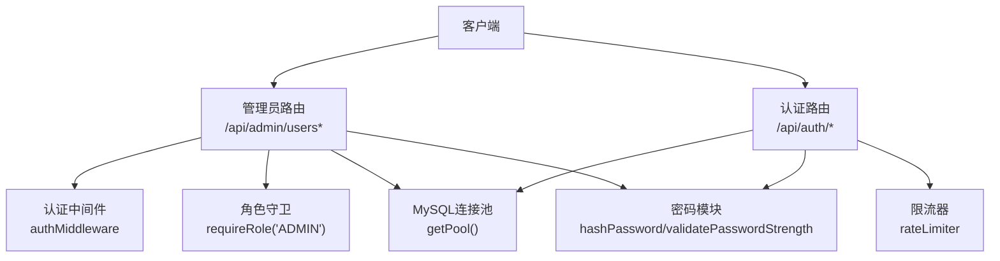
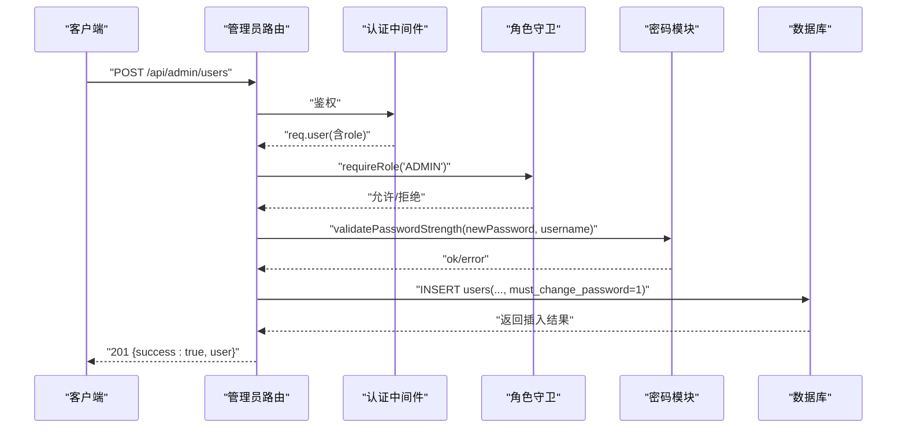
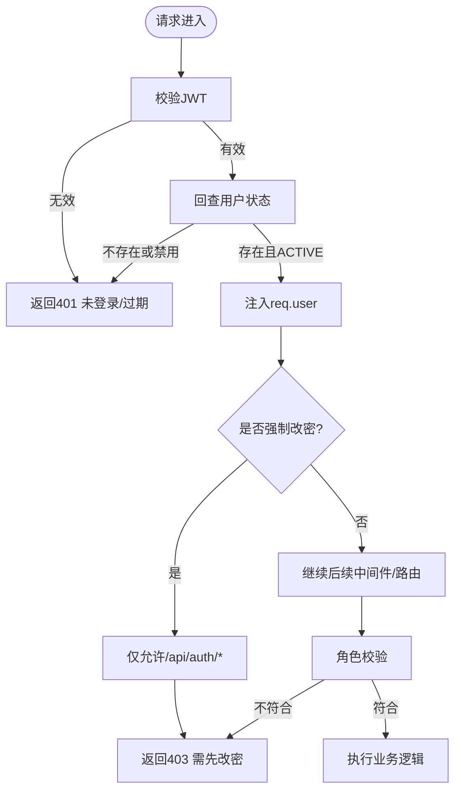
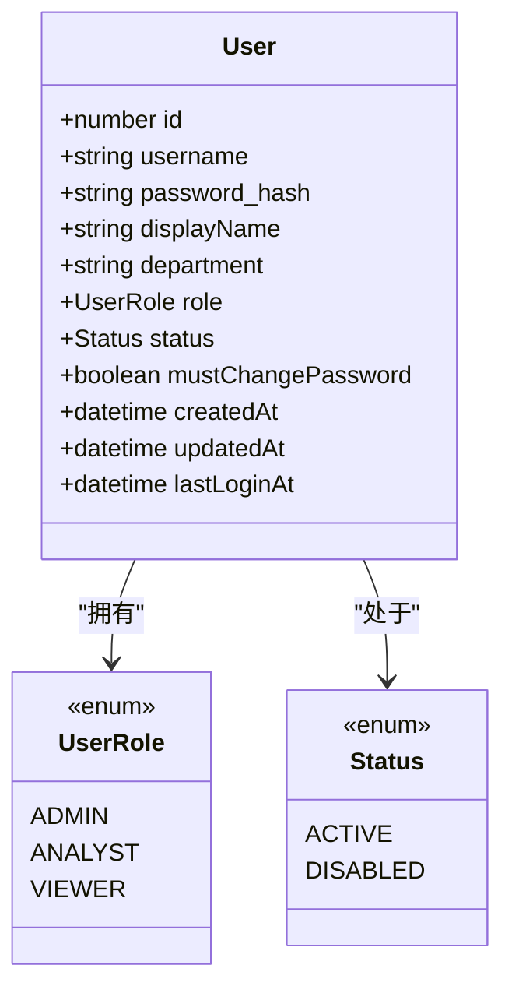
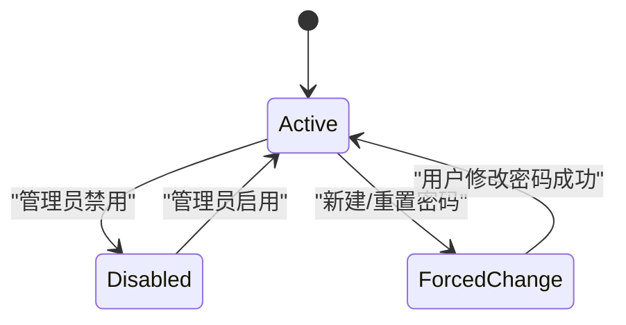
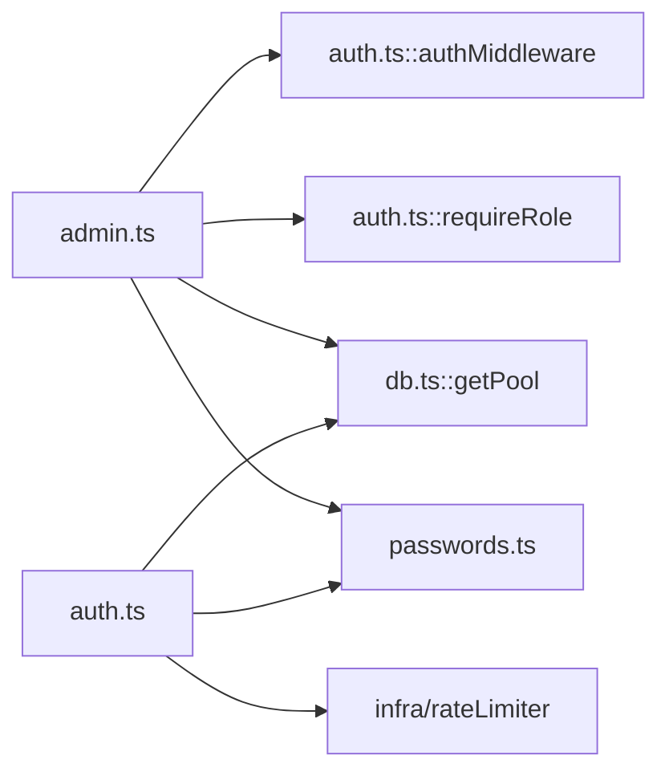

# 用户管理API

<cite>
**本文引用的文件**
- [server/routes/admin.ts](file://server/routes/admin.ts)
- [server/routes/auth.ts](file://server/routes/auth.ts)
- [server/auth/auth.ts](file://server/auth/auth.ts)
- [server/auth/passwords.ts](file://server/auth/passwords.ts)
- [server/infra/db.ts](file://server/infra/db.ts)
</cite>

## 目录
1. [简介](#简介)
2. [项目结构](#项目结构)
3. [核心组件](#核心组件)
4. [架构总览](#架构总览)
5. [详细组件分析](#详细组件分析)
6. [依赖关系分析](#依赖关系分析)
7. [性能考虑](#性能考虑)
8. [故障排查指南](#故障排查指南)
9. [结论](#结论)
10. [附录](#附录)

## 简介
本文件面向管理员，提供用户管理的完整API文档。覆盖以下能力：
- 用户列表查询、创建、更新、密码重置、删除
- 权限控制与角色验证（ADMIN/ANALYST/VIEWER）
- 自我保护规则（不能修改或删除自己）
- 安全限制（至少保留一个活跃管理员）
- 用户数据模型与校验（用户名格式、密码强度、部门信息）
- 用户状态管理（ACTIVE/DISABLED）与强制密码修改机制
- 错误处理策略与安全防护措施
- 完整的请求/响应示例（成功与失败场景）

## 项目结构
用户管理相关代码主要分布在以下模块：
- 路由层：管理员用户CRUD接口定义
- 认证与授权：JWT鉴权、角色守卫、强制改密拦截
- 密码模块：哈希、校验、弱口令黑名单
- 数据库层：用户表结构与初始化、默认管理员种子

**图表来源**
- [server/routes/admin.ts:1-20](file://server/routes/admin.ts#L1-L20)
- [server/routes/auth.ts:1-20](file://server/routes/auth.ts#L1-L20)
- [server/auth/auth.ts:60-127](file://server/auth/auth.ts#L60-L127)
- [server/auth/passwords.ts:30-56](file://server/auth/passwords.ts#L30-L56)
- [server/infra/db.ts:47-86](file://server/infra/db.ts#L47-L86)

**章节来源**
- [server/routes/admin.ts:1-20](file://server/routes/admin.ts#L1-L20)
- [server/routes/auth.ts:1-20](file://server/routes/auth.ts#L1-L20)
- [server/auth/auth.ts:60-127](file://server/auth/auth.ts#L60-L127)
- [server/auth/passwords.ts:30-56](file://server/auth/passwords.ts#L30-L56)
- [server/infra/db.ts:47-86](file://server/infra/db.ts#L47-L86)

## 核心组件
- 管理员路由：提供用户CRUD与环境配置管理能力，统一要求ADMIN角色访问
- 认证中间件：校验JWT并回查用户状态，支持强制改密拦截
- 密码模块：统一密码强度校验与哈希存储，兼容新旧格式
- 数据库层：维护users表结构、索引与默认管理员种子

**章节来源**
- [server/routes/admin.ts:1-20](file://server/routes/admin.ts#L1-L20)
- [server/auth/auth.ts:60-127](file://server/auth/auth.ts#L60-L127)
- [server/auth/passwords.ts:30-56](file://server/auth/passwords.ts#L30-L56)
- [server/infra/db.ts:72-102](file://server/infra/db.ts#L72-L102)

## 架构总览
下图展示了管理员用户管理的端到端流程：客户端发起请求，经过认证与角色校验后，路由执行业务逻辑，必要时调用密码模块进行强度校验与哈希，最终通过数据库连接池完成持久化操作。

**图表来源**
- [server/routes/admin.ts:41-76](file://server/routes/admin.ts#L41-L76)
- [server/auth/auth.ts:67-113](file://server/auth/auth.ts#L67-L113)
- [server/auth/passwords.ts:30-56](file://server/auth/passwords.ts#L30-L56)
- [server/infra/db.ts:72-86](file://server/infra/db.ts#L72-L86)

## 详细组件分析

### 管理员用户CRUD接口
- 获取用户列表
  - 方法：GET
  - 路径：/api/admin/users
  - 权限：ADMIN
  - 行为：返回所有用户的基本信息与状态
  - 成功响应：包含success标志与用户数组
  - 失败响应：服务异常时返回错误消息

- 创建用户
  - 方法：POST
  - 路径：/api/admin/users
  - 权限：ADMIN
  - 入参：username、password、displayName、role、department（可选）
  - 校验：用户名格式、密码长度与强度、角色有效性
  - 行为：插入用户记录，设置must_change_password为1，初始状态ACTIVE
  - 成功响应：返回新用户的id、username、displayName、department、role、status
  - 失败场景：
    - 用户名重复：409冲突
    - 参数无效：400错误
    - 服务异常：500错误

- 更新用户
  - 方法：PUT
  - 路径：/api/admin/users/:id
  - 权限：ADMIN
  - 入参：displayName、role、status、department（部分更新）
  - 校验：字段合法性、角色枚举、状态枚举
  - 行为：动态构建更新语句，执行更新
  - 自我保护：禁止当前登录管理员修改自己的角色或状态
  - 安全限制：若目标为活跃管理员且降级或禁用会导致无活跃管理员，则拒绝
  - 成功响应：{success:true}
  - 失败场景：
    - 用户不存在：404
    - 参数无效：400
    - 违反安全限制：400
    - 服务异常：500

- 重置密码
  - 方法：POST
  - 路径：/api/admin/users/:id/reset-password
  - 权限：ADMIN
  - 入参：newPassword
  - 校验：密码强度
  - 行为：更新密码哈希，并置must_change_password为1
  - 成功响应：{success:true}
  - 失败场景：
    - 用户不存在：404
    - 密码强度不合规：400
    - 服务异常：500

- 删除用户
  - 方法：DELETE
  - 路径：/api/admin/users/:id
  - 权限：ADMIN
  - 行为：删除指定用户
  - 自我保护：禁止删除当前登录的管理员
  - 安全限制：若目标为活跃管理员且删除会导致无活跃管理员，则拒绝
  - 成功响应：{success:true}
  - 失败场景：
    - 用户不存在：404
    - 违反安全限制：400
    - 服务异常：500

**章节来源**
- [server/routes/admin.ts:26-76](file://server/routes/admin.ts#L26-L76)
- [server/routes/admin.ts:78-149](file://server/routes/admin.ts#L78-L149)
- [server/routes/admin.ts:151-177](file://server/routes/admin.ts#L151-L177)
- [server/routes/admin.ts:179-208](file://server/routes/admin.ts#L179-L208)

### 权限控制与角色验证
- 角色枚举：ADMIN、ANALYST、VIEWER
- 管理员路由全局保护：所有接口需ADMIN角色
- 认证中间件：
  - 校验Bearer Token
  - 回查users表确认账号存在且状态为ACTIVE
  - 注入req.user（含id、username、displayName、department、role、mustChangePassword）
  - 强制改密拦截：当must_change_password为真时，仅放行/api/auth/*路径
- 角色守卫：
  - requireRole(...)用于细粒度权限控制
  - 未登录或角色不符返回401/403

**图表来源**
- [server/auth/auth.ts:67-127](file://server/auth/auth.ts#L67-L127)
- [server/routes/admin.ts:12-17](file://server/routes/admin.ts#L12-L17)

**章节来源**
- [server/auth/auth.ts:67-127](file://server/auth/auth.ts#L67-L127)
- [server/routes/admin.ts:12-17](file://server/routes/admin.ts#L12-L17)

### 用户数据模型与校验
- 用户表字段（关键）
  - id：自增主键
  - username：唯一用户名
  - password_hash：密码哈希
  - display_name：显示名
  - department：部门（组织维度授权匹配键）
  - role：角色（ADMIN/ANALYST/VIEWER）
  - status：状态（ACTIVE/DISABLED）
  - must_change_password：是否强制首次改密
  - created_at/updated_at/last_login_at：时间戳

- 用户名格式
  - 仅字母、数字、下划线
  - 长度3-20位

- 密码强度校验
  - 长度8-64位
  - 必须同时包含字母与数字
  - 排除常见弱口令
  - 不得包含用户名

- 部门信息管理
  - 仅管理员可修改
  - 用于数据源ACL按部门匹配

**图表来源**
- [server/infra/db.ts:72-102](file://server/infra/db.ts#L72-L102)
- [server/auth/auth.ts:13-24](file://server/auth/auth.ts#L13-L24)

**章节来源**
- [server/infra/db.ts:72-102](file://server/infra/db.ts#L72-L102)
- [server/auth/passwords.ts:30-48](file://server/auth/passwords.ts#L30-L48)
- [server/routes/admin.ts:15-17](file://server/routes/admin.ts#L15-L17)

### 用户状态管理与强制密码修改
- 状态管理
  - ACTIVE：正常可用
  - DISABLED：被禁用，无法登录
- 强制密码修改
  - 新建用户或管理员重置密码时，must_change_password置1
  - 认证中间件在must_change_password为真时，除/api/auth/*外全部拒绝
  - 用户通过变更密码接口成功后，must_change_password清零

**图表来源**
- [server/auth/auth.ts:104-108](file://server/auth/auth.ts#L104-L108)
- [server/routes/auth.ts:84-114](file://server/routes/auth.ts#L84-L114)
- [server/routes/admin.ts:59-68](file://server/routes/admin.ts#L59-L68)
- [server/routes/admin.ts:164-172](file://server/routes/admin.ts#L164-L172)

**章节来源**
- [server/auth/auth.ts:104-108](file://server/auth/auth.ts#L104-L108)
- [server/routes/auth.ts:84-114](file://server/routes/auth.ts#L84-L114)
- [server/routes/admin.ts:59-68](file://server/routes/admin.ts#L59-L68)
- [server/routes/admin.ts:164-172](file://server/routes/admin.ts#L164-L172)

### 请求与响应示例
以下为典型场景的请求与响应说明（以文本描述为主，避免直接粘贴代码内容）：

- 获取用户列表
  - 请求：GET /api/admin/users，携带有效的Admin JWT
  - 成功响应：{ success: true, users: [...] }
  - 失败响应：{ error: "用户列表获取失败" }

- 创建用户
  - 请求：POST /api/admin/users，body包含username、password、displayName、role、department（可选）
  - 成功响应：{ success: true, user: { id, username, displayName, department, role, status: "ACTIVE" } }
  - 失败场景：
    - 用户名重复：{ error: "用户名已存在" }
    - 用户名格式非法：{ error: "用户名需为 3-20 位字母、数字或下划线" }
    - 密码强度不足：{ error: "密码长度需为 8-64 位" 或更具体的原因 }
    - 角色无效：{ error: "角色无效，可选：ADMIN / ANALYST / VIEWER" }

- 更新用户
  - 请求：PUT /api/admin/users/:id，body包含displayName、role、status、department（部分更新）
  - 成功响应：{ success: true }
  - 失败场景：
    - 用户不存在：{ error: "用户不存在" }
    - 参数非法：{ error: "角色无效" 或 "状态无效" }
    - 自我保护：{ error: "不能修改自己的角色或状态" }
    - 安全限制：{ error: "系统至少需要保留一个可用管理员" }

- 重置密码
  - 请求：POST /api/admin/users/:id/reset-password，body包含newPassword
  - 成功响应：{ success: true }
  - 失败场景：
    - 用户不存在：{ error: "用户不存在" }
    - 密码强度不足：{ error: "密码长度需为 8-64 位" 或更具体的原因 }

- 删除用户
  - 请求：DELETE /api/admin/users/:id
  - 成功响应：{ success: true }
  - 失败场景：
    - 用户不存在：{ error: "用户不存在" }
    - 自我保护：{ error: "不能删除当前登录的管理员账号" }
    - 安全限制：{ error: "系统至少需要保留一个可用管理员" }

**章节来源**
- [server/routes/admin.ts:26-76](file://server/routes/admin.ts#L26-L76)
- [server/routes/admin.ts:78-149](file://server/routes/admin.ts#L78-L149)
- [server/routes/admin.ts:151-177](file://server/routes/admin.ts#L151-L177)
- [server/routes/admin.ts:179-208](file://server/routes/admin.ts#L179-L208)

## 依赖关系分析
- 管理员路由依赖：
  - 认证中间件与角色守卫，确保只有ADMIN可访问
  - 数据库连接池，执行用户CRUD
  - 密码模块，进行强度校验与哈希
- 认证路由依赖：
  - 限流器，防止暴力破解
  - 密码模块，验证旧密码与强度
  - 数据库连接池，读取用户信息与更新状态

**图表来源**
- [server/routes/admin.ts:1-17](file://server/routes/admin.ts#L1-L17)
- [server/routes/auth.ts:1-20](file://server/routes/auth.ts#L1-L20)
- [server/auth/auth.ts:60-127](file://server/auth/auth.ts#L60-L127)
- [server/auth/passwords.ts:30-56](file://server/auth/passwords.ts#L30-L56)
- [server/infra/db.ts:47-86](file://server/infra/db.ts#L47-L86)

**章节来源**
- [server/routes/admin.ts:1-17](file://server/routes/admin.ts#L1-L17)
- [server/routes/auth.ts:1-20](file://server/routes/auth.ts#L1-L20)
- [server/auth/auth.ts:60-127](file://server/auth/auth.ts#L60-L127)
- [server/auth/passwords.ts:30-56](file://server/auth/passwords.ts#L30-L56)
- [server/infra/db.ts:47-86](file://server/infra/db.ts#L47-L86)

## 性能考虑
- 数据库连接池容量根据并发用户数动态计算，避免资源争用
- 密码哈希使用scrypt算法，参数N=2^15，单次约80ms，兼顾安全与性能
- 认证中间件每次请求回查用户状态，确保禁用/角色变更即时生效
- 管理员操作涉及多次数据库查询（如检查活跃管理员数量），在高并发下需注意事务与锁的影响

[本节为通用性能建议，不直接分析具体文件]

## 故障排查指南
- 登录失败
  - 检查用户名与密码是否正确
  - 确认账号未被禁用
  - 查看是否触发强制改密拦截（需先修改密码）

- 创建用户失败
  - 检查用户名是否重复
  - 确认密码强度满足要求
  - 确认角色值合法

- 更新用户失败
  - 检查目标用户是否存在
  - 确认未尝试修改自身角色或状态
  - 确认不会导致无活跃管理员

- 重置密码失败
  - 检查目标用户是否存在
  - 确认新密码强度满足要求

- 删除用户失败
  - 检查目标用户是否存在
  - 确认未尝试删除当前登录的管理员
  - 确认不会导致无活跃管理员

**章节来源**
- [server/routes/auth.ts:42-77](file://server/routes/auth.ts#L42-L77)
- [server/routes/admin.ts:41-76](file://server/routes/admin.ts#L41-L76)
- [server/routes/admin.ts:78-149](file://server/routes/admin.ts#L78-L149)
- [server/routes/admin.ts:151-177](file://server/routes/admin.ts#L151-L177)
- [server/routes/admin.ts:179-208](file://server/routes/admin.ts#L179-L208)

## 结论
本用户管理API提供了完善的管理员用户CRUD能力，结合严格的权限控制、自我保护规则与安全限制，确保系统的安全性与可用性。通过统一的密码强度校验与强制改密机制，提升了账户安全性。建议在部署时合理配置JWT密钥与数据库连接池，并在高并发场景下关注数据库性能与一致性。

[本节为总结性内容，不直接分析具体文件]

## 附录
- 环境变量与安全
  - JWT_SECRET：生产环境必须配置固定强密钥
  - SCRYPT_PEPPER：可选的pepper，增强离线爆破成本
  - MYSQL_*：数据库连接配置
  - APP_POOL_MAX：显式配置应用库连接池上限

- 默认管理员
  - 首次启动时自动创建默认管理员账号，并标记强制改密
  - 若检测到默认密码且从未登录，将提示安全风险

**章节来源**
- [server/auth/auth.ts:46-58](file://server/auth/auth.ts#L46-L58)
- [server/auth/passwords.ts:15-17](file://server/auth/passwords.ts#L15-L17)
- [server/infra/db.ts:26-28](file://server/infra/db.ts#L26-L28)
- [server/infra/db.ts:755-778](file://server/infra/db.ts#L755-L778)