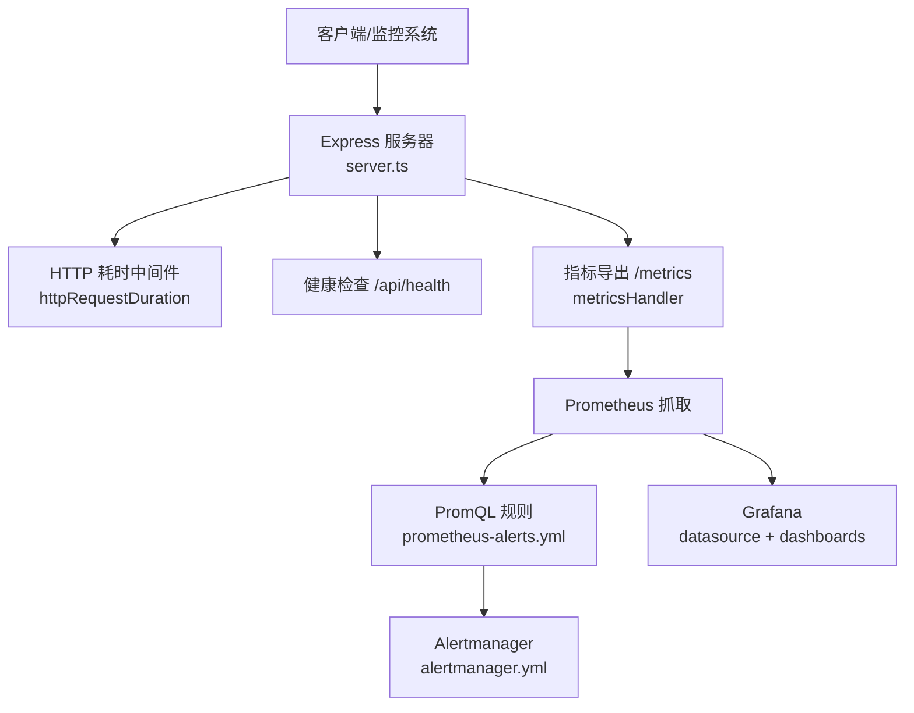
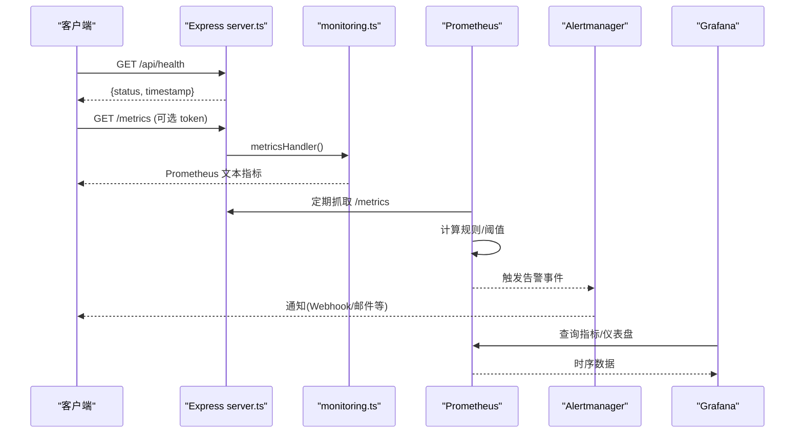
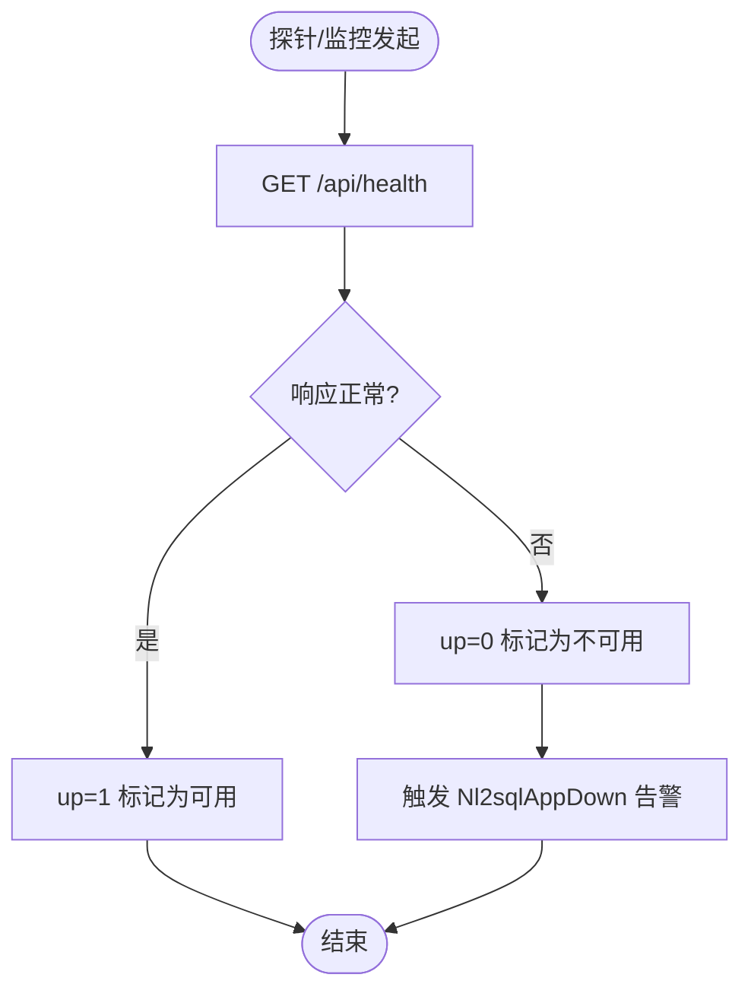
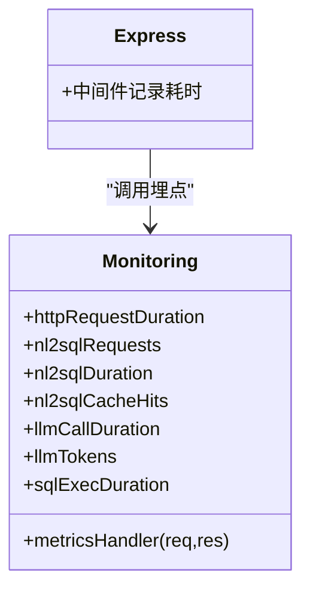
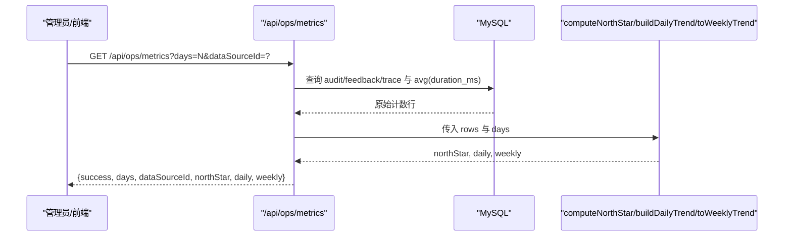
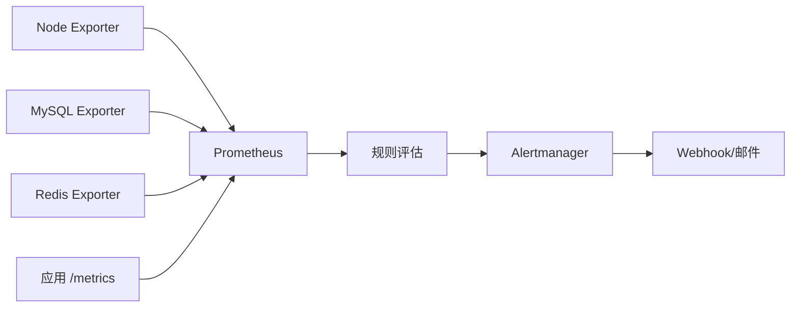
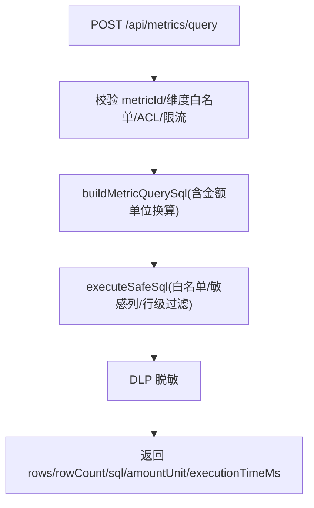
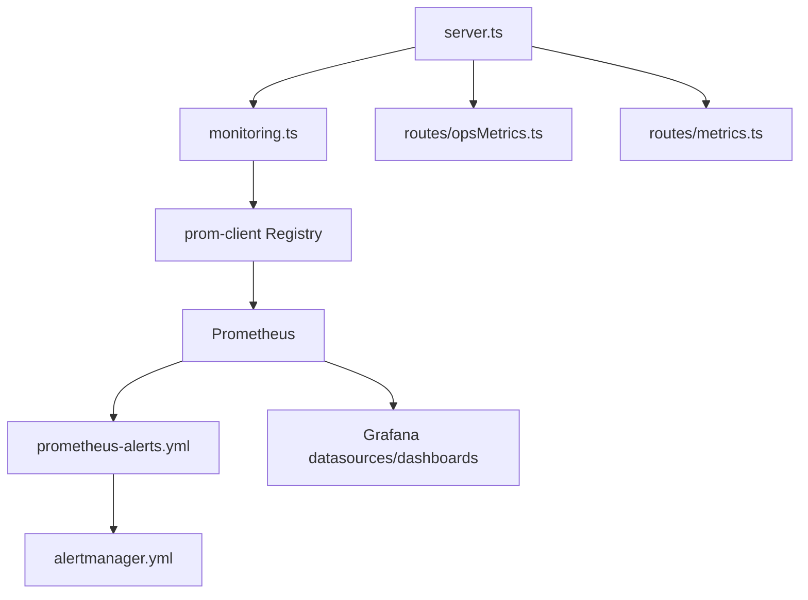

# 监控指标API

<cite>
**本文引用的文件**
- [server.ts](file://server.ts)
- [server/infra/monitoring.ts](file://server/infra/monitoring.ts)
- [server/routes/opsMetrics.ts](file://server/routes/opsMetrics.ts)
- [server/query/metrics.ts](file://server/query/metrics.ts)
- [server/routes/metrics.ts](file://server/routes/metrics.ts)
- [deploy/prometheus.yml](file://deploy/prometheus.yml)
- [deploy/prometheus-alerts.yml](file://deploy/prometheus-alerts.yml)
- [deploy/alertmanager.yml](file://deploy/alertmanager.yml)
- [deploy/grafana/provisioning/datasources/prometheus.yml](file://deploy/grafana/provisioning/datasources/prometheus.yml)
- [deploy/grafana/provisioning/dashboards/dashboards.yml](file://deploy/grafana/provisioning/dashboards/dashboards.yml)
</cite>

## 目录
1. [简介](#简介)
2. [项目结构](#项目结构)
3. [核心组件](#核心组件)
4. [架构总览](#架构总览)
5. [详细组件分析](#详细组件分析)
6. [依赖关系分析](#依赖关系分析)
7. [性能考量](#性能考量)
8. [故障排查指南](#故障排查指南)
9. [结论](#结论)
10. [附录](#附录)

## 简介
本文件面向“监控指标API”，覆盖系统健康检查、服务可用性探测、性能与业务指标采集、运维资源监控、告警与可视化展示，以及指标数据的存储策略、查询优化与聚合计算。文档以代码级为依据，提供端到端的数据流、调用序列与配置说明，帮助读者快速理解并正确使用该系统的监控能力。

## 项目结构
本项目采用 Express 作为 HTTP 服务入口，通过中间件对 /api/* 请求进行耗时统计；应用暴露 /metrics 供 Prometheus 抓取；Prometheus 负责规则评估与告警触发，Alertmanager 负责通知；Grafana 自动加载数据源与仪表盘 JSON，用于可视化展示。

图表来源
- [server.ts:172-193](file://server.ts#L172-L193)
- [server/infra/monitoring.ts:135-152](file://server/infra/monitoring.ts#L135-L152)
- [deploy/prometheus.yml:16-38](file://deploy/prometheus.yml#L16-L38)
- [deploy/prometheus-alerts.yml:1-144](file://deploy/prometheus-alerts.yml#L1-144)
- [deploy/alertmanager.yml:1-43](file://deploy/alertmanager.yml#L1-L43)
- [deploy/grafana/provisioning/datasources/prometheus.yml:1-11](file://deploy/grafana/provisioning/datasources/prometheus.yml#L1-L11)
- [deploy/grafana/provisioning/dashboards/dashboards.yml:1-14](file://deploy/grafana/provisioning/dashboards/dashboards.yml#L1-L14)

章节来源
- [server.ts:172-193](file://server.ts#L172-L193)
- [deploy/prometheus.yml:16-38](file://deploy/prometheus.yml#L16-L38)

## 核心组件
- 健康检查接口：/api/health，返回进程可达性与时间戳，用于存活探针与基础可用性检测。
- 指标采集与导出：/metrics，暴露 Prometheus 格式指标（可选 METRICS_TOKEN 保护），包含默认运行时指标与业务埋点。
- 运维指标聚合 API：/api/ops/metrics，仅管理员可访问，聚合问数链路十态、反馈点赞/点踩、自纠错触发与平均耗时，输出北极星指标、日趋势与周趋势。
- 语义指标层管理：/api/metrics 系列接口，支持指标定义 CRUD、审批流程、版本回溯、统一指标查询（POST /api/metrics/query）与导入导出。

章节来源
- [server.ts:187-193](file://server.ts#L187-L193)
- [server/infra/monitoring.ts:135-152](file://server/infra/monitoring.ts#L135-L152)
- [server/routes/opsMetrics.ts:257-324](file://server/routes/opsMetrics.ts#L257-L324)
- [server/routes/metrics.ts:38-301](file://server/routes/metrics.ts#L38-L301)

## 架构总览
系统通过三层实现“采集—聚合—可视/告警”的闭环：
- 采集层：Express 中间件记录 HTTP 耗时；业务关键路径旁路埋点（审计、缓存命中、LLM 调用、SQL 执行）。
- 聚合层：Prometheus 定时抓取 /metrics，按规则计算比率与时延分位；/api/ops/metrics 从数据库聚合十态与反馈，计算北极星指标与趋势。
- 展示与告警：Grafana 自动加载 Prometheus 数据源与仪表盘；Prometheus 规则触发告警，经 Alertmanager 推送至 Webhook。

图表来源
- [server.ts:172-193](file://server.ts#L172-L193)
- [server/infra/monitoring.ts:135-152](file://server/infra/monitoring.ts#L135-L152)
- [deploy/prometheus.yml:16-38](file://deploy/prometheus.yml#L16-L38)
- [deploy/prometheus-alerts.yml:1-144](file://deploy/prometheus-alerts.yml#L1-L144)
- [deploy/alertmanager.yml:1-43](file://deploy/alertmanager.yml#L1-L43)
- [deploy/grafana/provisioning/datasources/prometheus.yml:1-11](file://deploy/grafana/provisioning/datasources/prometheus.yml#L1-L11)

## 详细组件分析

### 健康检查与服务可用性
- 健康检查接口：/api/health，返回进程状态与时间戳，适合容器编排与健康探针使用。
- 服务可用性探测：通过 Prometheus 抓取 /metrics 的 up 指标判断实例是否可达；结合 MySQL/Redis/Alertmanager 的 up 指标完成依赖服务可用性检查。

图表来源
- [server.ts:187-190](file://server.ts#L187-L190)
- [deploy/prometheus-alerts.yml:8-15](file://deploy/prometheus-alerts.yml#L8-L15)

章节来源
- [server.ts:187-190](file://server.ts#L187-L190)
- [deploy/prometheus-alerts.yml:8-15](file://deploy/prometheus-alerts.yml#L8-L15)

### 性能指标收集接口
- HTTP 接口耗时：中间件对 /api/* 记录 method/route/status 直方图，便于定位慢接口。
- 问数端到端耗时：nl2sql_duration_seconds，按 status 分桶，覆盖毫秒到分钟级。
- LLM 调用耗时与 Token：llm_call_duration_seconds、llm_tokens_total，区分 channel/engine/model/ok。
- SQL 执行耗时：sql_execute_duration_seconds，区分 ok/error。
- 缓存命中：nl2sql_cache_hits_total，区分 l1/l2。

图表来源
- [server/infra/monitoring.ts:16-88](file://server/infra/monitoring.ts#L16-L88)
- [server.ts:172-183](file://server.ts#L172-L183)

章节来源
- [server/infra/monitoring.ts:16-88](file://server/infra/monitoring.ts#L16-L88)
- [server.ts:172-183](file://server.ts#L172-L183)

### 业务指标统计（北极星指标与趋势）
- 数据来源：query_audit_log（十态）、query_feedback（UP/DOWN）、query_trace（自纠错触发）。
- 聚合函数：computeNorthStar、buildDailyTrend、toWeeklyTrend，纯函数便于单测与复用。
- 输出：northStar（成功率、缓存命中率、澄清率、拒绝率、降级率、错误率、被拒率、反馈率、自纠错率、平均耗时）、daily（按日）、weekly（按周）。

图表来源
- [server/routes/opsMetrics.ts:257-324](file://server/routes/opsMetrics.ts#L257-L324)
- [server/routes/opsMetrics.ts:100-250](file://server/routes/opsMetrics.ts#L100-L250)

章节来源
- [server/routes/opsMetrics.ts:100-250](file://server/routes/opsMetrics.ts#L100-L250)
- [server/routes/opsMetrics.ts:257-324](file://server/routes/opsMetrics.ts#L257-L324)

### 运维指标监控（系统资源、网络I/O、磁盘空间、进程状态）
- 抓取目标：node-exporter（CPU/内存/磁盘）、mysql-exporter（数据库）、redis-exporter（缓存）、alertmanager（自监控）。
- 告警规则：应用宕机、MySQL/Redis 不可达、内存高、磁盘低、Prometheus/Alertmanager 异常等。
- 抑制规则：应用宕机时抑制下游业务类告警，避免风暴。

图表来源
- [deploy/prometheus.yml:16-43](file://deploy/prometheus.yml#L16-L43)
- [deploy/prometheus-alerts.yml:86-144](file://deploy/prometheus-alerts.yml#L86-L144)
- [deploy/alertmanager.yml:16-43](file://deploy/alertmanager.yml#L16-L43)

章节来源
- [deploy/prometheus.yml:16-43](file://deploy/prometheus.yml#L16-L43)
- [deploy/prometheus-alerts.yml:86-144](file://deploy/prometheus-alerts.yml#L86-L144)
- [deploy/alertmanager.yml:16-43](file://deploy/alertmanager.yml#L16-L43)

### 语义指标层管理与统一查询
- 指标定义：名称、同义词、口径表达式、归属表、固定过滤、可切分维度白名单、治理状态与版本。
- 统一查询：POST /api/metrics/query，按白名单维度生成 GROUP BY 查询，走安全执行层，结果按角色脱敏，支持金额单位换算标注。
- 治理流程：提议(PENDING)→审批(ACTIVE/REJECTED)→版本化快照，支持回溯与导入导出。

图表来源
- [server/routes/metrics.ts:65-134](file://server/routes/metrics.ts#L65-L134)
- [server/query/metrics.ts:133-162](file://server/query/metrics.ts#L133-L162)

章节来源
- [server/routes/metrics.ts:65-134](file://server/routes/metrics.ts#L65-L134)
- [server/query/metrics.ts:133-162](file://server/query/metrics.ts#L133-L162)

## 依赖关系分析
- 服务启动与路由挂载：server.ts 注册健康检查、/metrics、各业务路由（含 opsMetrics、metrics）。
- 指标采集：monitoring.ts 注册 prom-client 指标与 /metrics 处理器；Express 中间件记录 HTTP 耗时。
- 抓取与告警：prometheus.yml 配置抓取目标与规则文件；prometheus-alerts.yml 定义可用性、业务、资源三类告警；alertmanager.yml 配置通知渠道与抑制规则。
- 可视化：Grafana 自动加载 Prometheus 数据源与仪表盘 JSON。

图表来源
- [server.ts:172-257](file://server.ts#L172-L257)
- [server/infra/monitoring.ts:16-88](file://server/infra/monitoring.ts#L16-L88)
- [deploy/prometheus.yml:16-43](file://deploy/prometheus.yml#L16-L43)
- [deploy/prometheus-alerts.yml:1-144](file://deploy/prometheus-alerts.yml#L1-L144)
- [deploy/alertmanager.yml:1-43](file://deploy/alertmanager.yml#L1-L43)
- [deploy/grafana/provisioning/datasources/prometheus.yml:1-11](file://deploy/grafana/provisioning/datasources/prometheus.yml#L1-L11)
- [deploy/grafana/provisioning/dashboards/dashboards.yml:1-14](file://deploy/grafana/provisioning/dashboards/dashboards.yml#L1-L14)

章节来源
- [server.ts:172-257](file://server.ts#L172-L257)
- [server/infra/monitoring.ts:16-88](file://server/infra/monitoring.ts#L16-L88)
- [deploy/prometheus.yml:16-43](file://deploy/prometheus.yml#L16-L43)

## 性能考量
- 低基数标签：所有埋点严格避免 question/userId/dataSourceId 等高基数字段进入 label，防止时序膨胀。
- 直方图分桶：针对成功/失败/降级等不同状态设置合理分桶，覆盖 ms 到分钟级，确保 P95/P99 估算准确。
- 旁路埋点：审计、缓存、LLM、SQL 执行均通过 try/catch 静默失败，保证 fail-open，不影响主链路。
- 查询优化：/api/ops/metrics 使用按日分组与聚合函数，限制 days≤90，减少扫描范围；必要时可按 dataSourceId 下钻。
- 多实例兼容：Prometheus 通过 instance label 区分多实例，仪表盘使用 sum() 聚合，口径一致。

[本节为通用指导，不直接分析具体文件]

## 故障排查指南
- 应用不可达：检查 up{job="nl2sql-app"}，确认 /metrics 可抓取；若为 0，查看 Nl2sqlAppDown 告警。
- 成功率下降：观察 QuerySuccessRateLow，结合 nl2sql_duration_seconds 与 sql_execute_duration_seconds 定位瓶颈。
- 缓存命中率低：关注 CacheHitRateLow，检查数据源变更后的失效联动与 TTL 配置。
- 延迟升高：查看 QueryLatencyP95High，结合 llm_call_duration_seconds 与 sql_execute_duration_seconds 占比定位。
- 资源问题：AppMemoryHigh 提示内存占用过高；DiskSpaceLow 提示磁盘不足；ScrapeDurationSlow 提示抓取变慢。
- 告警通道：AlertmanagerDown 表示通知中断；抑制规则生效时，上游应用宕机会抑制下游业务告警。

章节来源
- [deploy/prometheus-alerts.yml:8-144](file://deploy/prometheus-alerts.yml#L8-L144)
- [deploy/alertmanager.yml:16-43](file://deploy/alertmanager.yml#L16-L43)

## 结论
本系统通过标准化的指标采集、严格的低基数约束、旁路埋点与 fail-open 设计，实现了稳定可靠的监控能力。Prometheus 负责规则评估与告警，Alertmanager 负责通知，Grafana 提供可视化。运维侧可通过 /api/ops/metrics 获取北极星指标与趋势，业务侧可通过 /api/metrics 管理指标定义与统一查询。整体架构兼顾可扩展性、可观测性与安全性。

[本节为总结性内容，不直接分析具体文件]

## 附录

### 接口清单与示例（基于仓库实现）
- 健康检查
  - 方法/路径：GET /api/health
  - 鉴权：无
  - 响应：包含状态与时间戳
  - 参考：[server.ts:187-190](file://server.ts#L187-L190)

- 指标导出
  - 方法/路径：GET /metrics
  - 鉴权：可选 METRICS_TOKEN（Authorization: Bearer <token> 或 query token）
  - 响应：Prometheus 文本格式
  - 参考：[server/infra/monitoring.ts:135-152](file://server/infra/monitoring.ts#L135-L152)

- 运维指标聚合
  - 方法/路径：GET /api/ops/metrics?days=7&dataSourceId=xxx
  - 鉴权：ADMIN
  - 响应：{ success, days, dataSourceId, northStar, daily, weekly }
  - 参考：[server/routes/opsMetrics.ts:257-324](file://server/routes/opsMetrics.ts#L257-L324)

- 语义指标查询
  - 方法/路径：POST /api/metrics/query
  - 鉴权：ADMIN/ANALYST
  - 请求体：metricId、dimensions[]、limit、amountUnit
  - 响应：{ ok, metric, groupBy, sql, rows, rowCount, truncated, amountUnit, executionTimeMs, dlp? }
  - 参考：[server/routes/metrics.ts:65-134](file://server/routes/metrics.ts#L65-L134)

- 指标库导入/导出
  - 导出：GET /api/metrics/export?dataSourceId=xxx（ADMIN）
  - 导入：POST /api/metrics/import（ADMIN），支持 mergeStrategy 与 dryRun
  - 参考：[server/routes/metrics.ts:136-206](file://server/routes/metrics.ts#L136-L206)

### 存储策略与查询优化
- 指标定义与版本：metric_definitions 与 metric_versions 表，支持创建/更新/审批/回溯留痕。
- 审计与反馈：query_audit_log、query_feedback、query_trace 支撑北极星指标与趋势计算。
- 查询优化：按日期范围过滤、GROUP BY 聚合、限制 days≤90、可选 dataSourceId 下钻；指标查询走白名单维度与安全执行层。
- 参考：
  - [server/query/metrics.ts:199-214](file://server/query/metrics.ts#L199-L214)
  - [server/query/metrics.ts:234-279](file://server/query/metrics.ts#L234-L279)
  - [server/query/metrics.ts:335-377](file://server/query/metrics.ts#L335-L377)
  - [server/routes/opsMetrics.ts:268-313](file://server/routes/opsMetrics.ts#L268-L313)

### 可视化与告警通知机制
- 可视化：Grafana 自动加载 Prometheus 数据源与仪表盘 JSON，文件夹“智能问数”。
- 告警：Prometheus 规则评估后推送到 Alertmanager，按 severity 与 group_by 分组，支持抑制规则避免风暴。
- 通知：Webhook（企业微信/钉钉/自研网关）或邮件（模板已预留）。
- 参考：
  - [deploy/grafana/provisioning/datasources/prometheus.yml:1-11](file://deploy/grafana/provisioning/datasources/prometheus.yml#L1-L11)
  - [deploy/grafana/provisioning/dashboards/dashboards.yml:1-14](file://deploy/grafana/provisioning/dashboards/dashboards.yml#L1-L14)
  - [deploy/prometheus-alerts.yml:1-144](file://deploy/prometheus-alerts.yml#L1-L144)
  - [deploy/alertmanager.yml:1-43](file://deploy/alertmanager.yml#L1-L43)