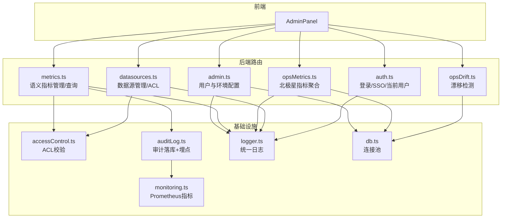
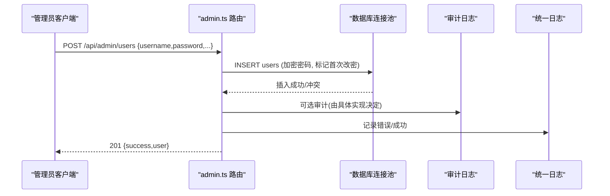
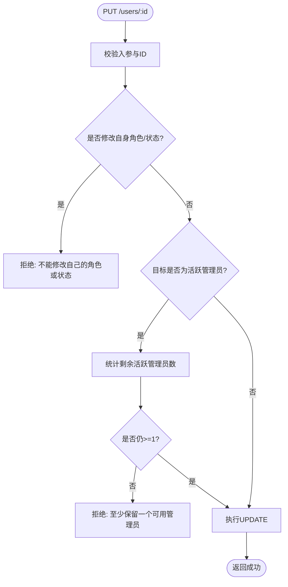
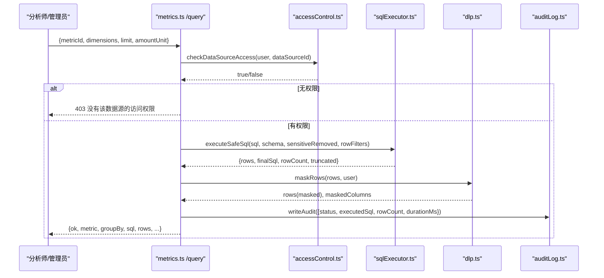
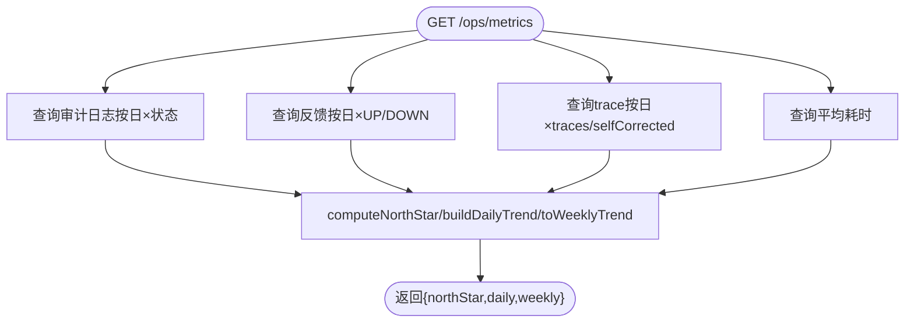
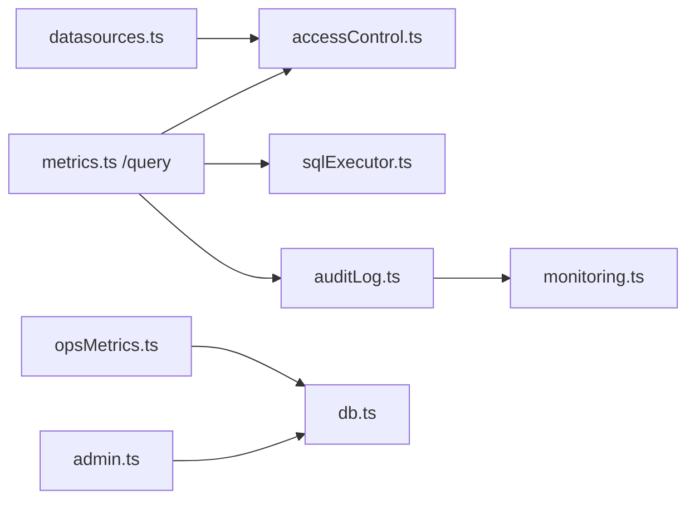

# 管理API

<cite>
**本文引用的文件**
- [server/routes/admin.ts](file://server/routes/admin.ts)
- [server/routes/metrics.ts](file://server/routes/metrics.ts)
- [server/routes/opsMetrics.ts](file://server/routes/opsMetrics.ts)
- [server/routes/auth.ts](file://server/routes/auth.ts)
- [server/routes/datasources.ts](file://server/routes/datasources.ts)
- [server/routes/opsDrift.ts](file://server/routes/opsDrift.ts)
- [server/auth/accessControl.ts](file://server/auth/accessControl.ts)
- [server/infra/monitoring.ts](file://server/infra/monitoring.ts)
- [server/infra/auditLog.ts](file://server/infra/auditLog.ts)
- [server/infra/logger.ts](file://server/infra/logger.ts)
- [src/components/admin/AdminPanel.tsx](file://src/components/admin/AdminPanel.tsx)
</cite>

## 目录
1. [简介](#简介)
2. [项目结构](#项目结构)
3. [核心组件](#核心组件)
4. [架构总览](#架构总览)
5. [详细组件分析](#详细组件分析)
6. [依赖关系分析](#依赖关系分析)
7. [性能与监控](#性能与监控)
8. [故障排查指南](#故障排查指南)
9. [结论](#结论)
10. [附录：请求与响应示例](#附录请求与响应示例)

## 简介
本文件面向系统管理员，提供“管理API”的完整说明，覆盖以下能力：
- 管理员专用接口：用户管理、系统配置、权限分配（数据源访问控制）
- 监控指标接口：系统健康检查、性能指标、业务指标聚合
- 运维管理功能：日志查看、故障诊断、系统调优（漂移检测、审计与限流）
- 安全与合规：管理员权限验证、操作审计、安全限制（ACL、DLP、限流）
- 监控数据存储策略、查询优化与历史数据管理建议

## 项目结构
后端以 Express Router 组织路由，按职责拆分为 admin、metrics、opsMetrics、auth、datasources、opsDrift 等模块；基础设施层提供鉴权、审计、日志、Prometheus 埋点、数据库连接池等。前端 AdminPanel 通过统一客户端调用上述 API。

图表来源
- [server/routes/admin.ts:1-295](file://server/routes/admin.ts#L1-L295)
- [server/routes/metrics.ts:1-302](file://server/routes/metrics.ts#L1-L302)
- [server/routes/opsMetrics.ts:1-327](file://server/routes/opsMetrics.ts#L1-L327)
- [server/routes/auth.ts:1-156](file://server/routes/auth.ts#L1-L156)
- [server/routes/datasources.ts:1-200](file://server/routes/datasources.ts#L1-L200)
- [server/routes/opsDrift.ts:1-80](file://server/routes/opsDrift.ts#L1-L80)
- [server/auth/accessControl.ts:1-108](file://server/auth/accessControl.ts#L1-L108)
- [server/infra/auditLog.ts:1-62](file://server/infra/auditLog.ts#L1-L62)
- [server/infra/monitoring.ts:1-153](file://server/infra/monitoring.ts#L1-L153)
- [server/infra/logger.ts:1-41](file://server/infra/logger.ts#L1-L41)

章节来源
- [server/routes/admin.ts:1-295](file://server/routes/admin.ts#L1-L295)
- [server/routes/metrics.ts:1-302](file://server/routes/metrics.ts#L1-L302)
- [server/routes/opsMetrics.ts:1-327](file://server/routes/opsMetrics.ts#L1-L327)
- [server/routes/auth.ts:1-156](file://server/routes/auth.ts#L1-L156)
- [server/routes/datasources.ts:1-200](file://server/routes/datasources.ts#L1-L200)
- [server/routes/opsDrift.ts:1-80](file://server/routes/opsDrift.ts#L1-L80)
- [server/auth/accessControl.ts:1-108](file://server/auth/accessControl.ts#L1-L108)
- [server/infra/auditLog.ts:1-62](file://server/infra/auditLog.ts#L1-L62)
- [server/infra/monitoring.ts:1-153](file://server/infra/monitoring.ts#L1-L153)
- [server/infra/logger.ts:1-41](file://server/infra/logger.ts#L1-L41)

## 核心组件
- 管理员用户与环境配置管理：提供用户CRUD、密码重置、环境配置读取与更新（白名单键），并强制保留至少一个活跃管理员。
- 语义指标管理：指标定义创建/审批/编辑/删除/导入导出、版本回溯；统一指标查询接口，复用安全SQL执行层并按角色脱敏。
- 运维指标聚合：基于审计日志、反馈、追踪数据计算北极星指标与日/周趋势，支持按数据源过滤。
- 认证与授权：本地登录、OIDC集成、当前用户信息；全局鉴权中间件与角色守卫。
- 数据源与ACL：数据源管理、Schema同步、部门/个人维度访问控制。
- 漂移检测：知识库/Schema漂移扫描、观察列登记、事件确认。
- 审计与监控：全链路审计落库、Prometheus指标采集、统一日志输出。

章节来源
- [server/routes/admin.ts:1-295](file://server/routes/admin.ts#L1-L295)
- [server/routes/metrics.ts:1-302](file://server/routes/metrics.ts#L1-L302)
- [server/routes/opsMetrics.ts:1-327](file://server/routes/opsMetrics.ts#L1-L327)
- [server/routes/auth.ts:1-156](file://server/routes/auth.ts#L1-L156)
- [server/routes/datasources.ts:1-200](file://server/routes/datasources.ts#L1-L200)
- [server/routes/opsDrift.ts:1-80](file://server/routes/opsDrift.ts#L1-L80)
- [server/infra/auditLog.ts:1-62](file://server/infra/auditLog.ts#L1-L62)
- [server/infra/monitoring.ts:1-153](file://server/infra/monitoring.ts#L1-L153)

## 架构总览
管理API采用“路由层 + 领域服务 + 基础设施”的分层设计：
- 路由层：Express Router 暴露REST端点，负责参数校验、权限拦截、结果封装。
- 领域服务：指标管理、数据源ACL、漂移检测、查询构建等。
- 基础设施：数据库连接池、审计日志、Prometheus埋点、统一日志、限流器。

图表来源
- [server/routes/admin.ts:41-76](file://server/routes/admin.ts#L41-L76)
- [server/infra/auditLog.ts:38-62](file://server/infra/auditLog.ts#L38-L62)
- [server/infra/logger.ts:27-41](file://server/infra/logger.ts#L27-L41)

## 详细组件分析

### 管理员用户与环境配置
- 用户管理
  - 列出用户：GET /api/admin/users
  - 创建用户：POST /api/admin/users（用户名/密码强度校验，初始强制改密）
  - 更新用户：PUT /api/admin/users/:id（角色/状态/部门变更保护，禁止降级/禁用自己，保证至少一个活跃管理员）
  - 重置密码：POST /api/admin/users/:id/reset-password（强度校验，强制下次改密）
  - 删除用户：DELETE /api/admin/users/:id（禁止删除当前管理员，保证至少一个活跃管理员）
- 环境配置
  - 获取配置：GET /api/admin/env-config（敏感字段脱敏）
  - 更新配置：PUT /api/admin/env-config（白名单键批量更新，写入审计日志）

图表来源
- [server/routes/admin.ts:78-149](file://server/routes/admin.ts#L78-L149)

章节来源
- [server/routes/admin.ts:15-208](file://server/routes/admin.ts#L15-L208)
- [server/routes/admin.ts:210-292](file://server/routes/admin.ts#L210-L292)

### 语义指标管理与查询
- 指标定义
  - 列表：GET /api/metrics?dataSourceId=xxx
  - 创建：POST /api/metrics（ADMIN直接生效，分析师提交为PENDING待审批）
  - 更新/删除：PUT/DELETE /api/metrics/:id（仅ADMIN）
  - 审批/驳回/重新提议：POST /:id/approve|reject|repropose
  - 版本历史/回溯：GET /:id/versions，POST /:id/restore（仅ADMIN）
  - 导入/导出：POST /import，GET /export（仅ADMIN）
- 指标查询
  - 统一查询：POST /api/metrics/query（ADMIN/ANALYST）
  - 流程要点：ACL校验 → 构建GROUP BY SQL → 安全执行（表白名单/敏感列剔除/部门行级过滤）→ DLP脱敏 → 审计与耗时统计

图表来源
- [server/routes/metrics.ts:65-134](file://server/routes/metrics.ts#L65-L134)
- [server/auth/accessControl.ts:65-73](file://server/auth/accessControl.ts#L65-L73)
- [server/infra/auditLog.ts:38-62](file://server/infra/auditLog.ts#L38-L62)

章节来源
- [server/routes/metrics.ts:35-302](file://server/routes/metrics.ts#L35-L302)
- [server/auth/accessControl.ts:1-108](file://server/auth/accessControl.ts#L1-L108)
- [server/infra/auditLog.ts:1-62](file://server/infra/auditLog.ts#L1-L62)

### 运维指标聚合（北极星指标）
- 接口：GET /api/ops/metrics?days=7&dataSourceId=xxx（仅ADMIN）
- 数据来源：query_audit_log（十态）、query_feedback（UP/DOWN）、query_trace（自纠错触发）
- 输出：northStar（成功率、缓存命中率、澄清率、拒绝率、回退率、错误率、被拒率、点赞率、自纠错率、平均耗时）、daily、weekly

图表来源
- [server/routes/opsMetrics.ts:257-324](file://server/routes/opsMetrics.ts#L257-L324)

章节来源
- [server/routes/opsMetrics.ts:1-327](file://server/routes/opsMetrics.ts#L1-L327)

### 认证与权限
- 认证
  - 登录：POST /api/auth/login（限流保护）
  - 当前用户：GET /api/auth/me（需鉴权）
  - 修改密码：POST /api/auth/change-password（强度校验）
  - OIDC：/oidc/status、/oidc/login、/oidc/callback
- 权限
  - 全局鉴权中间件与角色守卫（requireRole）
  - 数据源ACL：部门/个人维度授权，ADMIN豁免

章节来源
- [server/routes/auth.ts:1-156](file://server/routes/auth.ts#L1-L156)
- [server/auth/accessControl.ts:1-108](file://server/auth/accessControl.ts#L1-L108)

### 数据源与权限分配
- 数据源管理：增删改查、连接测试、Schema提取/同步、快速问题推荐
- 权限分配：acl_json 维护部门与用户清单；非管理员不可见敏感配置；ACL与DataScope正交（ACL决定能否访问，scope决定可用范围）

章节来源
- [server/routes/datasources.ts:1-200](file://server/routes/datasources.ts#L1-L200)
- [server/auth/accessControl.ts:1-108](file://server/auth/accessControl.ts#L1-L108)

### 运维管理：日志、诊断、调优
- 日志查看：统一日志出口（logger），级别可控；审计日志落库（query_audit_log）
- 故障诊断：漂移检测（opsDrift），支持手动扫描、观察列登记、事件确认
- 系统调优：指标查询限流（userQueryLimit）、缓存命中统计、EXPLAIN防线、LLM用量与时延监控

章节来源
- [server/infra/logger.ts:1-41](file://server/infra/logger.ts#L1-L41)
- [server/infra/auditLog.ts:1-62](file://server/infra/auditLog.ts#L1-L62)
- [server/routes/opsDrift.ts:1-80](file://server/routes/opsDrift.ts#L1-L80)
- [server/infra/monitoring.ts:1-153](file://server/infra/monitoring.ts#L1-L153)

## 依赖关系分析
- 路由间耦合度低，通过中间件与共享基础设施解耦
- 关键依赖链：
  - metrics.query → accessControl.checkDataSourceAccess → db pool
  - metrics.query → sqlExecutor.executeSafeSql → db pool
  - metrics.query → auditLog.writeAudit → monitoring.observeAudit
  - opsMetrics → db pool（多表聚合）
  - admin.env-config → db pool + auditLog

图表来源
- [server/routes/metrics.ts:65-134](file://server/routes/metrics.ts#L65-L134)
- [server/routes/opsMetrics.ts:257-324](file://server/routes/opsMetrics.ts#L257-L324)
- [server/routes/admin.ts:210-292](file://server/routes/admin.ts#L210-L292)
- [server/routes/datasources.ts:1-200](file://server/routes/datasources.ts#L1-L200)
- [server/infra/auditLog.ts:38-62](file://server/infra/auditLog.ts#L38-L62)
- [server/infra/monitoring.ts:92-133](file://server/infra/monitoring.ts#L92-L133)

## 性能与监控
- Prometheus指标
  - 问数请求计数与耗时、缓存命中、LLM调用耗时与token、SQL执行耗时、EXPLAIN防线、HTTP接口耗时
  - /metrics 端点可配置令牌保护
- 审计与限流
  - 全链路审计落库（失败不阻塞主流程）
  - 登录限流、用户查询速率限制
- 查询优化
  - 指标查询使用白名单维度与GROUP BY，避免任意SQL注入
  - 安全执行层包含表白名单、敏感列剔除、部门行级过滤
  - 金额单位换算在SQL层完成，减少前端处理开销
- 历史数据管理建议
  - 对 query_audit_log、query_feedback、query_trace 建立分区索引（按 created_at）
  - 定期归档旧数据至冷存储，保留最近N天在线查询
  - 对高频查询条件（如 endpoint='query'）建立复合索引

章节来源
- [server/infra/monitoring.ts:1-153](file://server/infra/monitoring.ts#L1-L153)
- [server/infra/auditLog.ts:1-62](file://server/infra/auditLog.ts#L1-L62)
- [server/routes/metrics.ts:65-134](file://server/routes/metrics.ts#L65-L134)

## 故障排查指南
- 常见问题定位
  - 指标查询失败：检查数据源ACL、Schema上下文、安全执行层返回原因
  - 权限不足：确认用户角色与数据源ACL配置
  - 限流拒绝：检查用户查询速率限制
  - 漂移告警：查看漂移事件列表，必要时手动扫描并确认
- 日志与指标
  - 通过统一日志查看错误堆栈
  - 通过Prometheus指标观察耗时分布与错误比例
  - 通过审计日志回溯具体请求的执行SQL与行数

章节来源
- [server/infra/logger.ts:1-41](file://server/infra/logger.ts#L1-L41)
- [server/infra/monitoring.ts:135-153](file://server/infra/monitoring.ts#L135-L153)
- [server/routes/opsDrift.ts:25-77](file://server/routes/opsDrift.ts#L25-L77)

## 结论
本管理API围绕“安全、可观测、可治理”的目标，提供了完善的管理员能力：
- 用户与环境配置管理具备强约束与审计
- 指标治理提供从定义到查询的全生命周期管控
- 运维指标聚合帮助把握系统质量与性能
- 审计与监控贯穿全链路，便于问题定位与持续优化

## 附录：请求与响应示例
以下为典型场景的请求与响应示例（字段名与状态码依据源码实现）。

- 管理员创建用户
  - 请求：POST /api/admin/users
    - 主体：{ username, password, displayName, role, department }
  - 响应：201 { success: true, user: { id, username, displayName, department, role, status } }
  - 参考：[server/routes/admin.ts:41-76](file://server/routes/admin.ts#L41-L76)

- 管理员更新用户状态
  - 请求：PUT /api/admin/users/:id
    - 主体：{ status: "ACTIVE" | "DISABLED" }
  - 响应：200 { success: true }
  - 参考：[server/routes/admin.ts:78-149](file://server/routes/admin.ts#L78-L149)

- 管理员重置用户密码
  - 请求：POST /api/admin/users/:id/reset-password
    - 主体：{ newPassword }
  - 响应：200 { success: true }
  - 参考：[server/routes/admin.ts:151-177](file://server/routes/admin.ts#L151-L177)

- 管理员删除用户
  - 请求：DELETE /api/admin/users/:id
  - 响应：200 { success: true }
  - 参考：[server/routes/admin.ts:179-208](file://server/routes/admin.ts#L179-L208)

- 获取环境配置
  - 请求：GET /api/admin/env-config
  - 响应：200 { success: true, data: [{ key, value, category, description, is_sensitive }] }
  - 参考：[server/routes/admin.ts:210-233](file://server/routes/admin.ts#L210-L233)

- 更新环境配置
  - 请求：PUT /api/admin/env-config
    - 主体：{ updates: [{ key, value }] }
  - 响应：200 { success: true, message, audit_log: { user_id, username, timestamp, changes } }
  - 参考：[server/routes/admin.ts:235-292](file://server/routes/admin.ts#L235-L292)

- 指标查询
  - 请求：POST /api/metrics/query
    - 主体：{ metricId, dimensions[], limit?, amountUnit? }
  - 响应：200 { ok: true, metric, groupBy, sql, rows, rowCount, truncated, amountUnit, executionTimeMs, dlp? }
  - 参考：[server/routes/metrics.ts:65-134](file://server/routes/metrics.ts#L65-L134)

- 指标导入
  - 请求：POST /api/metrics/import
    - 主体：{ fileData, dataSourceId?, mergeStrategy?, dryRun? }
  - 响应：200 { importedCount, updatedCount, skippedCount, errorCount, dataSourceId, dataSourceName }
  - 参考：[server/routes/metrics.ts:160-206](file://server/routes/metrics.ts#L160-L206)

- 北极星指标
  - 请求：GET /api/ops/metrics?days=7&dataSourceId=xxx
  - 响应：200 { success: true, days, dataSourceId, northStar, daily, weekly }
  - 参考：[server/routes/opsMetrics.ts:257-324](file://server/routes/opsMetrics.ts#L257-L324)

- 登录
  - 请求：POST /api/auth/login
    - 主体：{ username, password }
  - 响应：200 { success: true, token, user }
  - 参考：[server/routes/auth.ts:41-77](file://server/routes/auth.ts#L41-L77)

- 当前用户
  - 请求：GET /api/auth/me
  - 响应：200 { success: true, user }
  - 参考：[server/routes/auth.ts:79-82](file://server/routes/auth.ts#L79-L82)

- 数据源ACL校验（服务端内部）
  - 入口：checkDataSourceAccess(user, dataSourceId)
  - 行为：ADMIN放行；否则解析acl_json，匹配部门或个人ID
  - 参考：[server/auth/accessControl.ts:65-73](file://server/auth/accessControl.ts#L65-L73)

- 漂移检测
  - 请求：POST /api/ops/drift/scan
    - 主体：{ dataSourceId? }
  - 响应：200 { success: true, summaries[] }
  - 参考：[server/routes/opsDrift.ts:35-48](file://server/routes/opsDrift.ts#L35-L48)

- Prometheus指标抓取
  - 请求：GET /metrics（可配置METRICS_TOKEN保护）
  - 响应：text/plain; charset=utf-8（Prometheus格式）
  - 参考：[server/infra/monitoring.ts:135-153](file://server/infra/monitoring.ts#L135-L153)