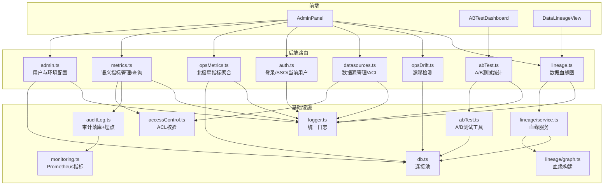
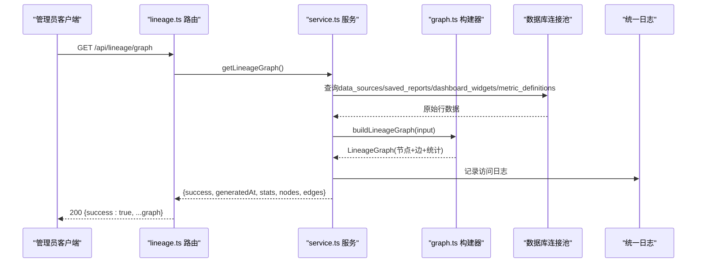
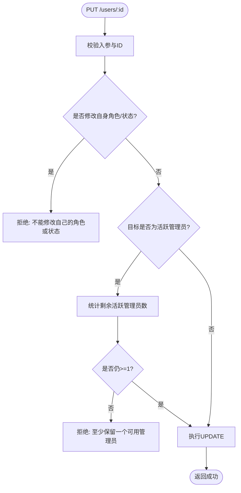
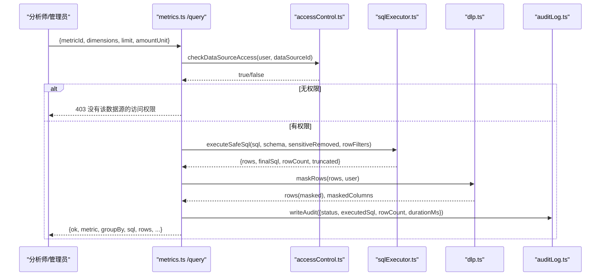
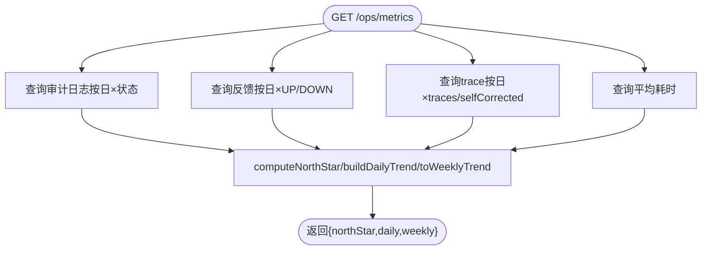
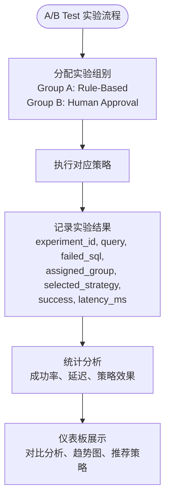
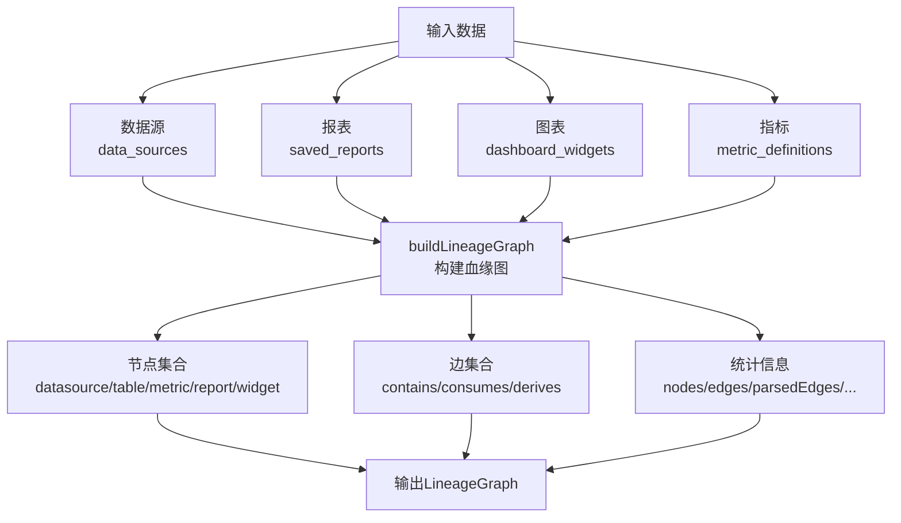
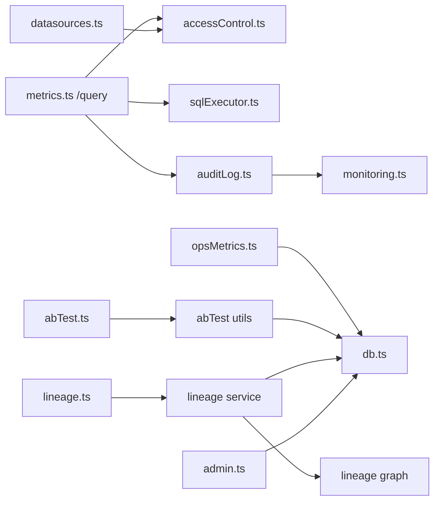

# 管理API

<cite>
**本文引用的文件**
- [server/routes/admin.ts](file://server/routes/admin.ts)
- [server/routes/metrics.ts](file://server/routes/metrics.ts)
- [server/routes/opsMetrics.ts](file://server/routes/opsMetrics.ts)
- [server/routes/auth.ts](file://server/routes/auth.ts)
- [server/routes/datasources.ts](file://server/routes/datasources.ts)
- [server/routes/opsDrift.ts](file://server/routes/opsDrift.ts)
- [server/routes/abTest.ts](file://server/routes/abTest.ts)
- [server/routes/lineage.ts](file://server/routes/lineage.ts)
- [server/utils/abTest.ts](file://server/utils/abTest.ts)
- [server/infra/createAbTestTable.ts](file://server/infra/createAbTestTable.ts)
- [src/components/admin/ABTestDashboard.tsx](file://src/components/admin/ABTestDashboard.tsx)
- [server/auth/accessControl.ts](file://server/auth/accessControl.ts)
- [server/infra/monitoring.ts](file://server/infra/monitoring.ts)
- [server/infra/auditLog.ts](file://server/infra/auditLog.ts)
- [server/infra/logger.ts](file://server/infra/logger.ts)
- [src/components/admin/AdminPanel.tsx](file://src/components/admin/AdminPanel.tsx)
- [server/lineage/service.ts](file://server/lineage/service.ts)
- [server/lineage/graph.ts](file://server/lineage/graph.ts)
- [src/components/datasource/DataLineageView.tsx](file://src/components/datasource/DataLineageView.tsx)
</cite>

## 更新摘要
**变更内容**
- 新增A/B测试管理API端点，包括统计数据获取、实验记录查询和概览信息接口
- 添加A/B测试仪表板组件，提供可视化对比分析
- 集成A/B测试数据库表和监控功能
- **新增** 数据血缘管理API端点GET /api/lineage/graph，用于获取完整的数据血缘图结构
- 完善系统的监控和分析能力，支持策略效果评估和数据血缘追踪
- 增强管理员权限验证、操作审计、安全限制

## 目录
1. [简介](#简介)
2. [项目结构](#项目结构)
3. [核心组件](#核心组件)
4. [架构总览](#架构总览)
5. [详细组件分析](#详细组件分析)
6. [依赖关系分析](#依赖关系分析)
7. [性能与监控](#性能与监控)
8. [故障排查指南](#故障排查指南)
9. [结论](#结论)
10. [附录：请求与响应示例](#附录请求与响应示例)

## 简介
本文件面向系统管理员，提供"管理API"的完整说明，覆盖以下能力：
- 管理员专用接口：用户管理、系统配置、权限分配（数据源访问控制）
- 监控指标接口：系统健康检查、性能指标、业务指标聚合
- **新增** A/B测试管理：实验统计分析、历史记录查询、策略效果对比
- **新增** 数据血缘管理：全量血缘图构建、节点边统计、解析覆盖率分析
- 运维管理功能：日志查看、故障诊断、系统调优（漂移检测、审计与限流）
- 安全与合规：管理员权限验证、操作审计、安全限制（ACL、DLP、限流）
- 监控数据存储策略、查询优化与历史数据管理建议

## 项目结构
后端以 Express Router 组织路由，按职责拆分为 admin、metrics、opsMetrics、auth、datasources、opsDrift、abTest、lineage 等模块；基础设施层提供鉴权、审计、日志、Prometheus 埋点、数据库连接池等。前端 AdminPanel 通过统一客户端调用上述 API。

```mermaid
graph TB
subgraph "前端"
AP["AdminPanel"]
ABTD["ABTestDashboard"]
DLV["DataLineageView"]
end
subgraph "后端路由"
A["admin.ts<br/>用户与环境配置"]
M["metrics.ts<br/>语义指标管理/查询"]
OM["opsMetrics.ts<br/>北极星指标聚合"]
AU["auth.ts<br/>登录/SSO/当前用户"]
DS["datasources.ts<br/>数据源管理/ACL"]
OD["opsDrift.ts<br/>漂移检测"]
ABT["abTest.ts<br/>A/B测试统计"]
LG["lineage.ts<br/>数据血缘图"]
end
subgraph "基础设施"
AC["accessControl.ts<br/>ACL校验"]
AL["auditLog.ts<br/>审计落库+埋点"]
MO["monitoring.ts<br/>Prometheus指标"]
LG2["logger.ts<br/>统一日志"]
DB["db.ts<br/>连接池"]
ABTU["abTest.ts<br/>A/B测试工具"]
LGS["lineage/service.ts<br/>血缘服务"]
LGG["lineage/graph.ts<br/>血缘构建"]
end
AP --> A
AP --> M
AP --> OM
AP --> AU
AP --> DS
AP --> OD
AP --> LG
ABTD --> ABT
DLV --> LG
ABT --> ABTU
ABTU --> DB
A --> DB
M --> AC
M --> AL
OM --> DB
DS --> AC
OD --> DB
LG --> LGS
LGS --> LGG
LGS --> DB
AL --> MO
A --> LG2
M --> LG2
OM --> LG2
DS --> LG2
AU --> LG2
ABT --> LG2
LG --> LG2
```

**图表来源**
- [server/routes/admin.ts:1-295](file://server/routes/admin.ts#L1-L295)
- [server/routes/metrics.ts:1-302](file://server/routes/metrics.ts#L1-L302)
- [server/routes/opsMetrics.ts:1-327](file://server/routes/opsMetrics.ts#L1-L327)
- [server/routes/auth.ts:1-156](file://server/routes/auth.ts#L1-L156)
- [server/routes/datasources.ts:1-200](file://server/routes/datasources.ts#L1-L200)
- [server/routes/opsDrift.ts:1-80](file://server/routes/opsDrift.ts#L1-L80)
- [server/routes/abTest.ts:1-130](file://server/routes/abTest.ts#L1-L130)
- [server/routes/lineage.ts:1-28](file://server/routes/lineage.ts#L1-L28)
- [server/utils/abTest.ts:1-168](file://server/utils/abTest.ts#L1-L168)
- [server/lineage/service.ts:1-188](file://server/lineage/service.ts#L1-L188)
- [server/lineage/graph.ts:1-417](file://server/lineage/graph.ts#L1-L417)
- [src/components/admin/ABTestDashboard.tsx:1-444](file://src/components/admin/ABTestDashboard.tsx#L1-L444)
- [src/components/datasource/DataLineageView.tsx:1-300](file://src/components/datasource/DataLineageView.tsx#L1-L300)

## 核心组件
- 管理员用户与环境配置管理：提供用户CRUD、密码重置、环境配置读取与更新（白名单键），并强制保留至少一个活跃管理员。
- 语义指标管理：指标定义创建/审批/编辑/删除/导入导出、版本回溯；统一指标查询接口，复用安全SQL执行层并按角色脱敏。
- 运维指标聚合：基于审计日志、反馈、追踪数据计算北极星指标与日/周趋势，支持按数据源过滤。
- **新增** A/B测试框架：为fallback策略提供实验分组、效果统计、历史记录查询，支持Rule-Based vs Human Approval策略对比。
- **新增** 数据血缘管理：全量血缘图构建，聚合数据源/报表/图表/指标，提供节点边统计和解析覆盖率分析。
- 认证与授权：本地登录、OIDC集成、当前用户信息；全局鉴权中间件与角色守卫。
- 数据源与ACL：数据源管理、Schema同步、部门/个人维度访问控制。
- 漂移检测：知识库/Schema漂移扫描、观察列登记、事件确认。
- 审计与监控：全链路审计落库、Prometheus指标采集、统一日志输出。

**章节来源**
- [server/routes/admin.ts:1-295](file://server/routes/admin.ts#L1-L295)
- [server/routes/metrics.ts:1-302](file://server/routes/metrics.ts#L1-L302)
- [server/routes/opsMetrics.ts:1-327](file://server/routes/opsMetrics.ts#L1-L327)
- [server/routes/abTest.ts:1-130](file://server/routes/abTest.ts#L1-L130)
- [server/routes/lineage.ts:1-28](file://server/routes/lineage.ts#L1-L28)
- [server/utils/abTest.ts:1-168](file://server/utils/abTest.ts#L1-L168)
- [server/lineage/service.ts:1-188](file://server/lineage/service.ts#L1-L188)
- [server/lineage/graph.ts:1-417](file://server/lineage/graph.ts#L1-L417)
- [server/routes/auth.ts:1-156](file://server/routes/auth.ts#L1-L156)
- [server/routes/datasources.ts:1-200](file://server/routes/datasources.ts#L1-L200)
- [server/routes/opsDrift.ts:1-80](file://server/routes/opsDrift.ts#L1-L80)
- [server/infra/auditLog.ts:1-62](file://server/infra/auditLog.ts#L1-L62)
- [server/infra/monitoring.ts:1-153](file://server/infra/monitoring.ts#L1-L153)

## 架构总览
管理API采用"路由层 + 领域服务 + 基础设施"的分层设计：
- 路由层：Express Router 暴露REST端点，负责参数校验、权限拦截、结果封装。
- 领域服务：指标管理、数据源ACL、漂移检测、查询构建、A/B测试分析、血缘图构建等。
- 基础设施：数据库连接池、审计日志、Prometheus埋点、统一日志、限流器。

```mermaid
sequenceDiagram
participant C as "管理员客户端"
participant R as "lineage.ts 路由"
participant S as "service.ts 服务"
participant G as "graph.ts 构建器"
participant DB as "数据库连接池"
participant LG as "统一日志"
C->>R : GET /api/lineage/graph
R->>S : getLineageGraph()
S->>DB : 查询data_sources/saved_reports/dashboard_widgets/metric_definitions
DB-->>S : 原始行数据
S->>G : buildLineageGraph(input)
G-->>S : LineageGraph(节点+边+统计)
S->>LG : 记录访问日志
S-->>R : {success, generatedAt, stats, nodes, edges}
R-->>C : 200 {success : true, ...graph}
```

**图表来源**
- [server/routes/lineage.ts:17-25](file://server/routes/lineage.ts#L17-L25)
- [server/lineage/service.ts:171-182](file://server/lineage/service.ts#L171-L182)
- [server/lineage/graph.ts:168-416](file://server/lineage/graph.ts#L168-L416)

## 详细组件分析

### 管理员用户与环境配置
- 用户管理
  - 列出用户：GET /api/admin/users
  - 创建用户：POST /api/admin/users（用户名/密码强度校验，初始强制改密）
  - 更新用户：PUT /api/admin/users/:id（角色/状态/部门变更保护，禁止降级/禁用自己，保证至少一个活跃管理员）
  - 重置密码：POST /api/admin/users/:id/reset-password（强度校验，强制下次改密）
  - 删除用户：DELETE /api/admin/users/:id（禁止删除当前管理员，保证至少一个活跃管理员）
- 环境配置
  - 获取配置：GET /api/admin/env-config（敏感字段脱敏）
  - 更新配置：PUT /api/admin/env-config（白名单键批量更新，写入审计日志）

```mermaid
flowchart TD
Start(["PUT /users/:id"]) --> Validate["校验入参与ID"]
Validate --> SelfCheck{"是否修改自身角色/状态?"}
SelfCheck --> |是| DenySelf["拒绝: 不能修改自己的角色或状态"]
SelfCheck --> |否| CheckTarget{"目标是否为活跃管理员?"}
CheckTarget --> |是| CountAdmins["统计剩余活跃管理员数"]
CountAdmins --> Enough{"是否仍>=1?"}
Enough --> |否| DenyMin["拒绝: 至少保留一个可用管理员"]
Enough --> |是| Update["执行UPDATE"]
CheckTarget --> |否| Update
Update --> Done(["返回成功"])
```

**图表来源**
- [server/routes/admin.ts:78-149](file://server/routes/admin.ts#L78-L149)

**章节来源**
- [server/routes/admin.ts:15-208](file://server/routes/admin.ts#L15-L208)
- [server/routes/admin.ts:210-292](file://server/routes/admin.ts#L210-L292)

### 语义指标管理与查询
- 指标定义
  - 列表：GET /api/metrics?dataSourceId=xxx
  - 创建：POST /api/metrics（ADMIN直接生效，分析师提交为PENDING待审批）
  - 更新/删除：PUT/DELETE /api/metrics/:id（仅ADMIN）
  - 审批/驳回/重新提议：POST /:id/approve|reject|repropose
  - 版本历史/回溯：GET /:id/versions，POST /:id/restore（仅ADMIN）
  - 导入/导出：POST /import，GET /export（仅ADMIN）
- 指标查询
  - 统一查询：POST /api/metrics/query（ADMIN/ANALYST）
  - 流程要点：ACL校验 → 构建GROUP BY SQL → 安全执行（表白名单/敏感列剔除/部门行级过滤）→ DLP脱敏 → 审计与耗时统计

```mermaid
sequenceDiagram
participant U as "分析师/管理员"
participant Q as "metrics.ts /query"
participant ACL as "accessControl.ts"
participant SQ as "sqlExecutor.ts"
participant DL as "dlp.ts"
participant AU as "auditLog.ts"
U->>Q : {metricId, dimensions, limit, amountUnit}
Q->>ACL : checkDataSourceAccess(user, dataSourceId)
ACL-->>Q : true/false
alt 无权限
Q-->>U : 403 没有该数据源的访问权限
else 有权限
Q->>SQ : executeSafeSql(sql, schema, sensitiveRemoved, rowFilters)
SQ-->>Q : {rows, finalSql, rowCount, truncated}
Q->>DL : maskRows(rows, user)
DL-->>Q : rows(masked), maskedColumns
Q->>AU : writeAudit({status, executedSql, rowCount, durationMs})
Q-->>U : {ok, metric, groupBy, sql, rows, ...}
end
```

**图表来源**
- [server/routes/metrics.ts:65-134](file://server/routes/metrics.ts#L65-L134)
- [server/auth/accessControl.ts:65-73](file://server/auth/accessControl.ts#L65-L73)
- [server/infra/auditLog.ts:38-62](file://server/infra/auditLog.ts#L38-L62)

**章节来源**
- [server/routes/metrics.ts:35-302](file://server/routes/metrics.ts#L35-L302)
- [server/auth/accessControl.ts:1-108](file://server/auth/accessControl.ts#L1-L108)
- [server/infra/auditLog.ts:1-62](file://server/infra/auditLog.ts#L1-L62)

### 运维指标聚合（北极星指标）
- 接口：GET /api/ops/metrics?days=7&dataSourceId=xxx（仅ADMIN）
- 数据来源：query_audit_log（十态）、query_feedback（UP/DOWN）、query_trace（自纠错触发）
- 输出：northStar（成功率、缓存命中率、澄清率、拒绝率、回退率、错误率、被拒率、点赞率、自纠错率、平均耗时）、daily、weekly

```mermaid
flowchart TD
S(["GET /ops/metrics"]) --> Q1["查询审计日志按日×状态"]
S --> Q2["查询反馈按日×UP/DOWN"]
S --> Q3["查询trace按日×traces/selfCorrected"]
S --> Q4["查询平均耗时"]
Q1 --> P["computeNorthStar/buildDailyTrend/toWeeklyTrend"]
Q2 --> P
Q3 --> P
Q4 --> P
P --> R(["返回{northStar,daily,weekly}"])
```

**图表来源**
- [server/routes/opsMetrics.ts:257-324](file://server/routes/opsMetrics.ts#L257-L324)

**章节来源**
- [server/routes/opsMetrics.ts:1-327](file://server/routes/opsMetrics.ts#L1-L327)

### **新增** A/B测试管理API
- **统计数据获取**：GET /api/admin/ab-test/stats?days=7（仅ADMIN）
  - 获取指定天数内的实验统计数据
  - 包含两个组别（rule_based vs human_approval）的成功率、延迟等指标
  - 支持自定义时间范围（默认7天）

- **实验记录查询**：GET /api/admin/ab-test/records?limit=100（仅ADMIN）
  - 查询历史实验记录，支持分页限制
  - 返回实验ID、用户查询、失败SQL、分组、策略、结果、延迟等信息

- **快速概览**：GET /api/admin/ab-test/overview（仅ADMIN）
  - 最近24小时的实验概览
  - 自动计算关键指标对比和改进建议
  - 提供推荐策略选择

- **A/B测试框架**：
  - 实验分组：基于userId和时间戳的确定性哈希分配
  - 流量分割：50% Rule-Based vs 50% Human Approval
  - 效果监控：成功率、延迟、策略选择统计
  - 数据库存储：fallback_ab_tests表记录所有实验数据

```mermaid
flowchart TD
Start(["A/B Test 实验流程"]) --> Assign["分配实验组别<br/>Group A: Rule-Based<br/>Group B: Human Approval"]
Assign --> Execute["执行对应策略"]
Execute --> Record["记录实验结果<br/>experiment_id, query, failed_sql,<br/>assigned_group, selected_strategy,<br/>success, latency_ms"]
Record --> Analyze["统计分析<br/>成功率、延迟、策略效果"]
Analyze --> Dashboard["仪表板展示<br/>对比分析、趋势图、推荐策略"]
```

**图表来源**
- [server/utils/abTest.ts:46-59](file://server/utils/abTest.ts#L46-L59)
- [server/utils/abTest.ts:75-97](file://server/utils/abTest.ts#L75-L97)
- [server/routes/abTest.ts:17-127](file://server/routes/abTest.ts#L17-L127)

**章节来源**
- [server/routes/abTest.ts:1-130](file://server/routes/abTest.ts#L1-L130)
- [server/utils/abTest.ts:1-168](file://server/utils/abTest.ts#L1-L168)
- [server/infra/createAbTestTable.ts:1-68](file://server/infra/createAbTestTable.ts#L1-L68)
- [src/components/admin/ABTestDashboard.tsx:1-444](file://src/components/admin/ABTestDashboard.tsx#L1-L444)

### **新增** 数据血缘管理API
- **全量血缘图获取**：GET /api/lineage/graph（仅ADMIN）
  - 聚合数据源、报表、图表、指标构建完整血缘图
  - 返回节点（datasource/table/metric/report/widget）、边（contains/consumes/derives）和统计信息
  - 30秒进程内缓存，提高高频访问性能
  - 失败时前端自动降级为本地声明式估算

- **血缘图构建逻辑**：
  - 数据源节点：从data_sources表获取，包含类型、表总数、最后同步时间
  - 表节点：从各消费物的SQL中解析表引用，标记unresolved表示不在当前Schema
  - 指标节点：从metric_definitions表获取，包含表达式、状态、归属表
  - 报表节点：从saved_reports表获取，包含模板类型、创建时间、SQL数量
  - 图表节点：从dashboard_widgets表获取，包含图表类型、创建时间、SQL

- **边类型与证据分级**：
  - contains：数据源到表的结构性边（active/stale）
  - consumes：表到报表/图表的消费关系（parsed/declared）
  - derives：表到指标的推导关系（parsed/declared）
  - parsed：基于SQL解析的高可信边
  - declared：基于数据源绑定的声明式边（待验证）

- **统计指标**：
  - nodes：节点总数
  - edges：边总数
  - parsedEdges：解析边数量
  - declaredEdges：声明边数量
  - staleEdges：失效边数量
  - parseCoverage：解析覆盖率 = parsed/(parsed+declared)

```mermaid
flowchart TD
Input["输入数据"] --> DS["数据源<br/>data_sources"]
Input --> REP["报表<br/>saved_reports"]
Input --> WGT["图表<br/>dashboard_widgets"]
Input --> MET["指标<br/>metric_definitions"]
DS --> Build["buildLineageGraph<br/>构建血缘图"]
REP --> Build
WGT --> Build
MET --> Build
Build --> Nodes["节点集合<br/>datasource/table/metric/report/widget"]
Build --> Edges["边集合<br/>contains/consumes/derives"]
Build --> Stats["统计信息<br/>nodes/edges/parsedEdges/..."]
Nodes --> Output["输出LineageGraph"]
Edges --> Output
Stats --> Output
```

**图表来源**
- [server/lineage/graph.ts:168-416](file://server/lineage/graph.ts#L168-L416)
- [server/lineage/service.ts:148-182](file://server/lineage/service.ts#L148-L182)

**章节来源**
- [server/routes/lineage.ts:1-28](file://server/routes/lineage.ts#L1-L28)
- [server/lineage/service.ts:1-188](file://server/lineage/service.ts#L1-L188)
- [server/lineage/graph.ts:1-417](file://server/lineage/graph.ts#L1-L417)
- [src/components/datasource/DataLineageView.tsx:1-300](file://src/components/datasource/DataLineageView.tsx#L1-L300)

### 认证与权限
- 认证
  - 登录：POST /api/auth/login（限流保护）
  - 当前用户：GET /api/auth/me（需鉴权）
  - 修改密码：POST /api/auth/change-password（强度校验）
  - OIDC：/oidc/status、/oidc/login、/oidc/callback
- 权限
  - 全局鉴权中间件与角色守卫（requireRole）
  - 数据源ACL：部门/个人维度授权，ADMIN豁免

**章节来源**
- [server/routes/auth.ts:1-156](file://server/routes/auth.ts#L1-L156)
- [server/auth/accessControl.ts:1-108](file://server/auth/accessControl.ts#L1-L108)

### 数据源与权限分配
- 数据源管理：增删改查、连接测试、Schema提取/同步、快速问题推荐
- 权限分配：acl_json 维护部门与用户清单；非管理员不可见敏感配置；ACL与DataScope正交（ACL决定能否访问，scope决定可用范围）

**章节来源**
- [server/routes/datasources.ts:1-200](file://server/routes/datasources.ts#L1-L200)
- [server/auth/accessControl.ts:1-108](file://server/auth/accessControl.ts#L1-L108)

### 运维管理：日志、诊断、调优
- 日志查看：统一日志出口（logger），级别可控；审计日志落库（query_audit_log）
- 故障诊断：漂移检测（opsDrift），支持手动扫描、观察列登记、事件确认
- 系统调优：指标查询限流（userQueryLimit）、缓存命中统计、EXPLAIN防线、LLM用量与时延监控

**章节来源**
- [server/infra/logger.ts:1-41](file://server/infra/logger.ts#L1-L41)
- [server/infra/auditLog.ts:1-62](file://server/infra/auditLog.ts#L1-L62)
- [server/routes/opsDrift.ts:1-80](file://server/routes/opsDrift.ts#L1-L80)
- [server/infra/monitoring.ts:1-153](file://server/infra/monitoring.ts#L1-L153)

## 依赖关系分析
- 路由间耦合度低，通过中间件与共享基础设施解耦
- 关键依赖链：
  - metrics.query → accessControl.checkDataSourceAccess → db pool
  - metrics.query → sqlExecutor.executeSafeSql → db pool
  - metrics.query → auditLog.writeAudit → monitoring.observeAudit
  - opsMetrics → db pool（多表聚合）
  - abTest.stats → abTest.utils.getExperimentStats → db pool
  - lineage.graph → service.getLineageGraph → graph.buildLineageGraph → db pool
  - admin.env-config → db pool + auditLog

```mermaid
graph LR
MQ["metrics.ts /query"] --> AC["accessControl.ts"]
MQ --> SE["sqlExecutor.ts"]
MQ --> AL["auditLog.ts"]
AL --> MO["monitoring.ts"]
OM["opsMetrics.ts"] --> DB["db.ts"]
ABT["abTest.ts"] --> ABTU["abTest utils"]
ABTU --> DB
LG["lineage.ts"] --> LGS["lineage service"]
LGS --> LGG["lineage graph"]
LGS --> DB
AD["admin.ts"] --> DB
DS["datasources.ts"] --> AC
```

**图表来源**
- [server/routes/metrics.ts:65-134](file://server/routes/metrics.ts#L65-L134)
- [server/routes/opsMetrics.ts:257-324](file://server/routes/opsMetrics.ts#L257-L324)
- [server/routes/abTest.ts:17-46](file://server/routes/abTest.ts#L17-L46)
- [server/routes/lineage.ts:17-25](file://server/routes/lineage.ts#L17-L25)
- [server/lineage/service.ts:171-182](file://server/lineage/service.ts#L171-L182)
- [server/lineage/graph.ts:168-416](file://server/lineage/graph.ts#L168-L416)
- [server/utils/abTest.ts:102-138](file://server/utils/abTest.ts#L102-L138)
- [server/routes/admin.ts:210-292](file://server/routes/admin.ts#L210-L292)
- [server/routes/datasources.ts:1-200](file://server/routes/datasources.ts#L1-L200)
- [server/infra/auditLog.ts:38-62](file://server/infra/auditLog.ts#L38-L62)
- [server/infra/monitoring.ts:92-133](file://server/infra/monitoring.ts#L92-L133)

## 性能与监控
- Prometheus指标
  - 问数请求计数与耗时、缓存命中、LLM调用耗时与token、SQL执行耗时、EXPLAIN防线、HTTP接口耗时
  - /metrics 端点可配置令牌保护
- 审计与限流
  - 全链路审计落库（失败不阻塞主流程）
  - 登录限流、用户查询速率限制
- 查询优化
  - 指标查询使用白名单维度与GROUP BY，避免任意SQL注入
  - 安全执行层包含表白名单、敏感列剔除、部门行级过滤
  - 金额单位换算在SQL层完成，减少前端处理开销
- **新增** A/B测试监控
  - 实验记录表索引优化（created_at、assigned_group、success、experiment_id）
  - 统计数据查询按时间范围过滤，避免全表扫描
  - 支持灵活的时间范围查询（1天、7天、30天、90天）
- **新增** 数据血缘监控
  - 30秒进程内TTL缓存，减少重复构建开销
  - 血缘图构建失败时前端自动降级，不影响用户体验
  - 解析覆盖率监控，低于60%时发出警告提示
- 历史数据管理建议
  - 对 query_audit_log、query_feedback、query_trace、fallback_ab_tests 建立分区索引（按 created_at）
  - 定期归档旧数据至冷存储，保留最近N天在线查询
  - 对高频查询条件（如 endpoint='query'、assigned_group）建立复合索引

**章节来源**
- [server/infra/monitoring.ts:1-153](file://server/infra/monitoring.ts#L1-L153)
- [server/infra/auditLog.ts:1-62](file://server/infra/auditLog.ts#L1-L62)
- [server/routes/metrics.ts:65-134](file://server/routes/metrics.ts#L65-L134)
- [server/infra/createAbTestTable.ts:18-36](file://server/infra/createAbTestTable.ts#L18-L36)
- [server/utils/abTest.ts:104-116](file://server/utils/abTest.ts#L104-L116)
- [server/lineage/service.ts:18-19](file://server/lineage/service.ts#L18-L19)
- [src/components/datasource/DataLineageView.tsx:157-170](file://src/components/datasource/DataLineageView.tsx#L157-L170)

## 故障排查指南
- 常见问题定位
  - 指标查询失败：检查数据源ACL、Schema上下文、安全执行层返回原因
  - 权限不足：确认用户角色与数据源ACL配置
  - 限流拒绝：检查用户查询速率限制
  - 漂移告警：查看漂移事件列表，必要时手动扫描并确认
  - **新增** A/B测试数据异常：检查fallback_ab_tests表是否存在、实验记录是否正常写入、统计数据计算逻辑
  - **新增** 血缘图构建失败：检查数据库连接、表结构完整性、SQL解析逻辑、缓存状态
- 日志与指标
  - 通过统一日志查看错误堆栈
  - 通过Prometheus指标观察耗时分布与错误比例
  - 通过审计日志回溯具体请求的执行SQL与行数
  - **新增** A/B测试调试：查看实验记录表中的分组分配、策略选择、成功状态、延迟数据
  - **新增** 血缘图调试：检查generatedAt时间戳、stats.parseCoverage、staleEdges数量、节点边数量

**章节来源**
- [server/infra/logger.ts:1-41](file://server/infra/logger.ts#L1-L41)
- [server/infra/monitoring.ts:135-153](file://server/infra/monitoring.ts#L135-L153)
- [server/routes/opsDrift.ts:25-77](file://server/routes/opsDrift.ts#L25-L77)
- [server/utils/abTest.ts:134-137](file://server/utils/abTest.ts#L134-L137)
- [server/utils/abTest.ts:163-166](file://server/utils/abTest.ts#L163-L166)
- [server/routes/lineage.test.ts:137-147](file://server/routes/lineage.test.ts#L137-L147)
- [server/lineage/service.ts:184-187](file://server/lineage/service.ts#L184-L187)

## 结论
本管理API围绕"安全、可观测、可治理"的目标，提供了完善的管理员能力：
- 用户与环境配置管理具备强约束与审计
- 指标治理提供从定义到查询的全生命周期管控
- **新增** A/B测试框架支持策略效果量化评估，为决策提供数据支撑
- **新增** 数据血缘管理提供全量血缘图构建与分析，支持数据影响分析和治理
- 运维指标聚合帮助把握系统质量与性能
- 审计与监控贯穿全链路，便于问题定位与持续优化

## 附录：请求与响应示例
以下为典型场景的请求与响应示例（字段名与状态码依据源码实现）。

- 管理员创建用户
  - 请求：POST /api/admin/users
    - 主体：{ username, password, displayName, role, department }
  - 响应：201 { success: true, user: { id, username, displayName, department, role, status } }
  - 参考：[server/routes/admin.ts:41-76](file://server/routes/admin.ts#L41-L76)

- 管理员更新用户状态
  - 请求：PUT /api/admin/users/:id
    - 主体：{ status: "ACTIVE" | "DISABLED" }
  - 响应：200 { success: true }
  - 参考：[server/routes/admin.ts:78-149](file://server/routes/admin.ts#L78-L149)

- 管理员重置用户密码
  - 请求：POST /api/admin/users/:id/reset-password
    - 主体：{ newPassword }
  - 响应：200 { success: true }
  - 参考：[server/routes/admin.ts:151-177](file://server/routes/admin.ts#L151-L177)

- 管理员删除用户
  - 请求：DELETE /api/admin/users/:id
  - 响应：200 { success: true }
  - 参考：[server/routes/admin.ts:179-208](file://server/routes/admin.ts#L179-L208)

- 获取环境配置
  - 请求：GET /api/admin/env-config
  - 响应：200 { success: true, data: [{ key, value, category, description, is_sensitive }] }
  - 参考：[server/routes/admin.ts:210-233](file://server/routes/admin.ts#L210-L233)

- 更新环境配置
  - 请求：PUT /api/admin/env-config
    - 主体：{ updates: [{ key, value }] }
  - 响应：200 { success: true, message, audit_log: { user_id, username, timestamp, changes } }
  - 参考：[server/routes/admin.ts:235-292](file://server/routes/admin.ts#L235-L292)

- 指标查询
  - 请求：POST /api/metrics/query
    - 主体：{ metricId, dimensions[], limit?, amountUnit? }
  - 响应：200 { ok: true, metric, groupBy, sql, rows, rowCount, truncated, amountUnit, executionTimeMs, dlp? }
  - 参考：[server/routes/metrics.ts:65-134](file://server/routes/metrics.ts#L65-L134)

- 指标导入
  - 请求：POST /api/metrics/import
    - 主体：{ fileData, dataSourceId?, mergeStrategy?, dryRun? }
  - 响应：200 { importedCount, updatedCount, skippedCount, errorCount, dataSourceId, dataSourceName }
  - 参考：[server/routes/metrics.ts:160-206](file://server/routes/metrics.ts#L160-L206)

- 北极星指标
  - 请求：GET /api/ops/metrics?days=7&dataSourceId=xxx
  - 响应：200 { success: true, days, dataSourceId, northStar, daily, weekly }
  - 参考：[server/routes/opsMetrics.ts:257-324](file://server/routes/opsMetrics.ts#L257-L324)

- **新增** A/B测试统计数据
  - 请求：GET /api/admin/ab-test/stats?days=7
  - 响应：200 { success: true, data: { days: 7, groups: { rule_based: {...}, human_approval: {...} } } }
  - 参考：[server/routes/abTest.ts:17-46](file://server/routes/abTest.ts#L17-L46)

- **新增** A/B测试实验记录
  - 请求：GET /api/admin/ab-test/records?limit=100
  - 响应：200 { success: true, data: [...], count: 100 }
  - 参考：[server/routes/abTest.ts:52-75](file://server/routes/abTest.ts#L52-L75)

- **新增** A/B测试快速概览
  - 请求：GET /api/admin/ab-test/overview
  - 响应：200 { success: true, data: { ..., keyMetrics: { totalRequests, successRateGap, latencyImprovement, recommendedStrategy } } }
  - 参考：[server/routes/abTest.ts:80-127](file://server/routes/abTest.ts#L80-L127)

- **新增** 数据血缘图
  - 请求：GET /api/lineage/graph（需要ADMIN角色认证）
  - 响应：200 { success: true, generatedAt, stats: { nodes, edges, parsedEdges, declaredEdges, staleEdges, parseCoverage }, nodes: [...], edges: [...] }
  - 参考：[server/routes/lineage.ts:17-25](file://server/routes/lineage.ts#L17-L25)

- 登录
  - 请求：POST /api/auth/login
    - 主体：{ username, password }
  - 响应：200 { success: true, token, user }
  - 参考：[server/routes/auth.ts:41-77](file://server/routes/auth.ts#L41-L77)

- 当前用户
  - 请求：GET /api/auth/me
  - 响应：200 { success: true, user }
  - 参考：[server/routes/auth.ts:79-82](file://server/routes/auth.ts#L79-L82)

- 数据源ACL校验（服务端内部）
  - 入口：checkDataSourceAccess(user, dataSourceId)
  - 行为：ADMIN放行；否则解析acl_json，匹配部门或个人ID
  - 参考：[server/auth/accessControl.ts:65-73](file://server/auth/accessControl.ts#L65-L73)

- 漂移检测
  - 请求：POST /api/ops/drift/scan
    - 主体：{ dataSourceId? }
  - 响应：200 { success: true, summaries[] }
  - 参考：[server/routes/opsDrift.ts:35-48](file://server/routes/opsDrift.ts#L35-L48)

- Prometheus指标抓取
  - 请求：GET /metrics（可配置METRICS_TOKEN保护）
  - 响应：text/plain; charset=utf-8（Prometheus格式）
  - 参考：[server/infra/monitoring.ts:135-153](file://server/infra/monitoring.ts#L135-L153)