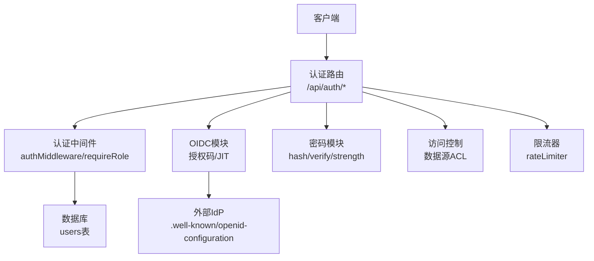
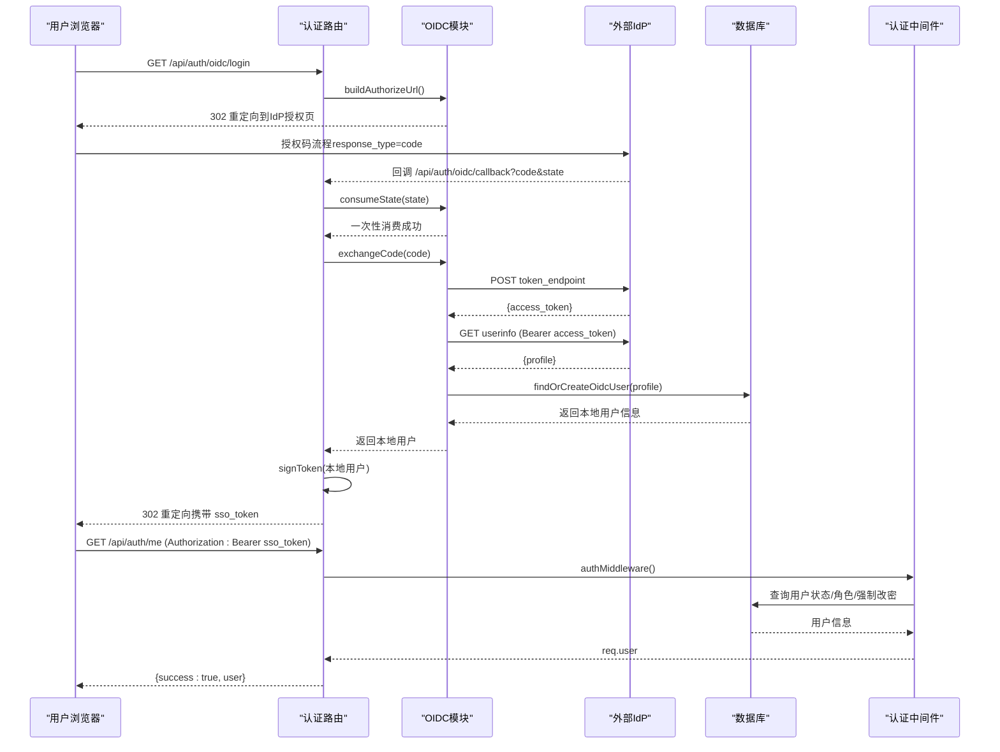
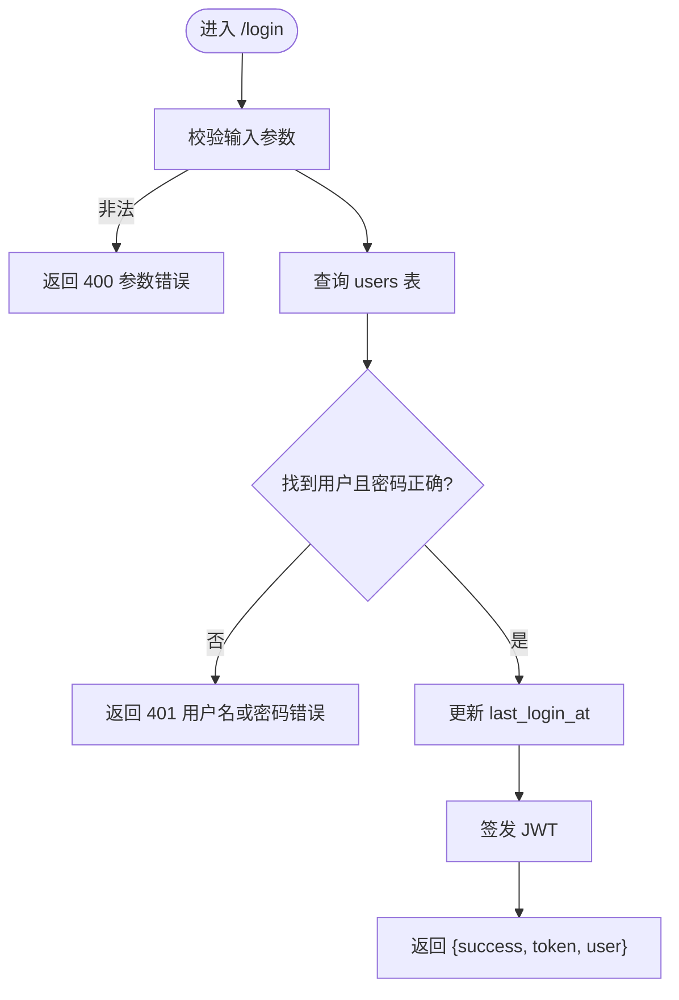
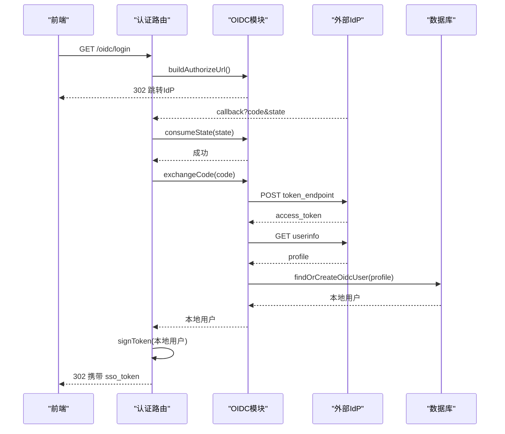
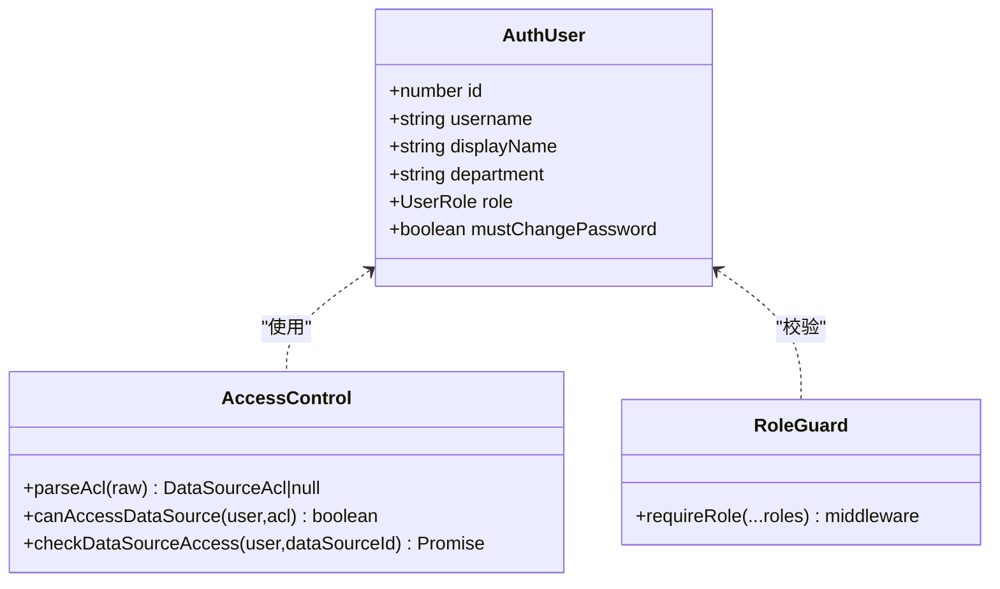
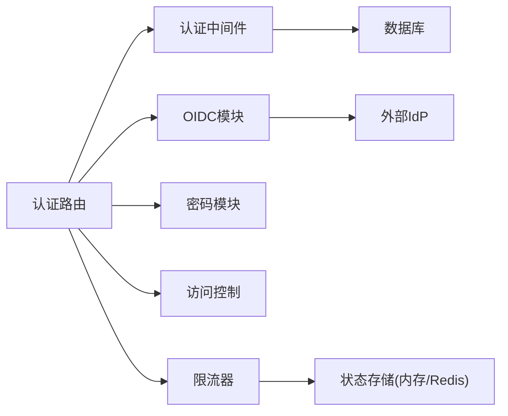

# 认证API

<cite>
**本文引用的文件**
- [server/routes/auth.ts](file://server/routes/auth.ts)
- [server/auth/auth.ts](file://server/auth/auth.ts)
- [server/auth/oidc.ts](file://server/auth/oidc.ts)
- [server/auth/passwords.ts](file://server/auth/passwords.ts)
- [server/auth/accessControl.ts](file://server/auth/accessControl.ts)
- [server/infra/rateLimiter.ts](file://server/infra/rateLimiter.ts)
- [src/hooks/useAuthStore.ts](file://src/hooks/useAuthStore.ts)
</cite>

## 目录
1. [简介](#简介)
2. [项目结构](#项目结构)
3. [核心组件](#核心组件)
4. [架构总览](#架构总览)
5. [详细组件分析](#详细组件分析)
6. [依赖关系分析](#依赖关系分析)
7. [性能与安全考量](#性能与安全考量)
8. [故障排查指南](#故障排查指南)
9. [结论](#结论)
10. [附录：接口清单与示例](#附录接口清单与示例)

## 简介
本文件面向使用本系统的开发者与运维人员，系统化说明认证相关API的使用方法、JWT令牌生命周期、OIDC企业登录集成方式、权限控制机制（RBAC与数据源ACL），并提供常见场景的请求/响应示例与排错建议。系统采用本地用户名密码登录与企业统一身份认证（OIDC授权码流程）双通道；登录后签发短期JWT作为Bearer Token用于后续鉴权。

## 项目结构
认证能力由“路由层 + 认证中间件 + OIDC模块 + 密码模块 + 访问控制模块”组成：
- 路由层：对外暴露 /api/auth/* 接口，处理登录、当前用户、改密、OIDC回调等。
- 认证中间件：校验Bearer Token并回查用户状态，注入req.user，支持角色守卫。
- OIDC模块：实现发现端点、state防CSRF、授权码交换、拉取userinfo、JIT建号/同步。
- 密码模块：密码强度校验、scrypt哈希与验证（兼容新旧格式）。
- 访问控制模块：基于部门/用户的ACL判定数据源访问权限。
- 限流器：按IP滑动窗口限制请求频率，保护登录与OIDC入口。
- 前端状态：useAuthStore封装登录、登出、SSO回跳、角色判断等。

图表来源
- [server/routes/auth.ts:41-153](file://server/routes/auth.ts#L41-L153)
- [server/auth/auth.ts:60-127](file://server/auth/auth.ts#L60-L127)
- [server/auth/oidc.ts:41-244](file://server/auth/oidc.ts#L41-L244)
- [server/auth/passwords.ts:34-99](file://server/auth/passwords.ts#L34-L99)
- [server/auth/accessControl.ts:18-73](file://server/auth/accessControl.ts#L18-L73)
- [server/infra/rateLimiter.ts:14-42](file://server/infra/rateLimiter.ts#L14-L42)

章节来源
- [server/routes/auth.ts:1-156](file://server/routes/auth.ts#L1-L156)
- [server/auth/auth.ts:1-127](file://server/auth/auth.ts#L1-L127)
- [server/auth/oidc.ts:1-244](file://server/auth/oidc.ts#L1-L244)
- [server/auth/passwords.ts:1-100](file://server/auth/passwords.ts#L1-L100)
- [server/auth/accessControl.ts:1-108](file://server/auth/accessControl.ts#L1-L108)
- [server/infra/rateLimiter.ts:1-54](file://server/infra/rateLimiter.ts#L1-L54)
- [src/hooks/useAuthStore.ts:1-84](file://src/hooks/useAuthStore.ts#L1-L84)

## 核心组件
- 认证中间件：解析Authorization头中的Bearer Token，校验签名与有效期，回查用户状态与强制改密标记，注入req.user，并设置LLM用户上下文。
- 角色守卫：requireRole(...) 校验用户角色是否满足要求。
- JWT签发：signToken(user) 生成包含sub/username/role的JWT，过期时间由环境变量控制。
- 密码模块：validatePasswordStrength、hashPassword、verifyPassword，支持新旧scrypt格式与pepper。
- OIDC模块：配置解析、端点发现缓存、state一次性票据、授权码交换、userinfo获取、JIT建号/同步。
- 访问控制：parseAcl/canAccessDataSource/checkDataSourceAccess，按部门/用户白名单控制数据源可见性。
- 限流器：按IP滑动窗口或Redis固定分钟窗口计数，防止暴力破解。

章节来源
- [server/auth/auth.ts:60-127](file://server/auth/auth.ts#L60-L127)
- [server/auth/passwords.ts:34-99](file://server/auth/passwords.ts#L34-L99)
- [server/auth/oidc.ts:41-244](file://server/auth/oidc.ts#L41-L244)
- [server/auth/accessControl.ts:18-73](file://server/auth/accessControl.ts#L18-L73)
- [server/infra/rateLimiter.ts:14-42](file://server/infra/rateLimiter.ts#L14-L42)

## 架构总览
下图展示一次完整的企业OIDC登录流程（授权码模式）及本地JWT签发过程。

图表来源
- [server/routes/auth.ts:116-153](file://server/routes/auth.ts#L116-L153)
- [server/auth/oidc.ts:129-244](file://server/auth/oidc.ts#L129-L244)
- [server/auth/auth.ts:66-113](file://server/auth/auth.ts#L66-L113)

## 详细组件分析

### 本地用户名密码登录
- 接口：POST /api/auth/login
- 功能：校验用户名/密码，更新最后登录时间，签发JWT并返回用户信息。
- 安全：受限流器保护；错误消息不泄露账号是否存在。
- 响应：成功返回token与user；失败返回错误信息。

图表来源
- [server/routes/auth.ts:41-77](file://server/routes/auth.ts#L41-L77)
- [server/auth/passwords.ts:34-99](file://server/auth/passwords.ts#L34-L99)

章节来源
- [server/routes/auth.ts:41-77](file://server/routes/auth.ts#L41-L77)
- [server/auth/passwords.ts:34-99](file://server/auth/passwords.ts#L34-L99)

### 当前用户与信息获取
- 接口：GET /api/auth/me
- 功能：校验Bearer Token后返回当前用户信息。
- 鉴权：通过authMiddleware校验Token并回查用户状态。

章节来源
- [server/routes/auth.ts:79-82](file://server/routes/auth.ts#L79-L82)
- [server/auth/auth.ts:66-113](file://server/auth/auth.ts#L66-L113)

### 修改密码
- 接口：POST /api/auth/change-password
- 功能：校验原密码与新密码强度，更新密码哈希并清除强制改密标记。
- 安全：新密码需满足强度规则，禁止与原密码相同。

章节来源
- [server/routes/auth.ts:84-114](file://server/routes/auth.ts#L84-L114)
- [server/auth/passwords.ts:34-99](file://server/auth/passwords.ts#L34-L99)

### OIDC企业登录（授权码流程）
- 接口：
  - GET /api/auth/oidc/status：查询是否启用OIDC。
  - GET /api/auth/oidc/login：重定向至IdP授权页。
  - GET /api/auth/oidc/callback：接收授权码，换取access_token，拉取userinfo，JIT建号/同步，签发本地JWT并重定向回前端。
- 关键点：
  - state一次性票据防CSRF，支持内存与Redis两种存储。
  - discovery端点缓存1小时，减少外部调用。
  - JIT建号：不存在则按默认角色创建，已存在则同步displayName/department并刷新登录时间。
  - 回调成功后以URL参数形式将本地JWT返回给前端，前端再调用/me完成登录态建立。

图表来源
- [server/routes/auth.ts:116-153](file://server/routes/auth.ts#L116-L153)
- [server/auth/oidc.ts:129-244](file://server/auth/oidc.ts#L129-L244)

章节来源
- [server/routes/auth.ts:116-153](file://server/routes/auth.ts#L116-L153)
- [server/auth/oidc.ts:41-244](file://server/auth/oidc.ts#L41-L244)

### JWT令牌生命周期与刷新机制
- 签发：登录成功或OIDC回调成功后，服务端调用signToken签发JWT，包含sub/username/role，过期时间由环境变量控制。
- 验证：所有受保护接口通过authMiddleware校验Bearer Token，并回查用户状态与强制改密标记。
- 刷新：当前未提供专门的刷新接口；前端应在Token即将过期时引导用户重新登录或通过OIDC再次授权。
- 安全：生产环境必须配置固定强密钥；开发环境使用进程级随机密钥，重启后失效。

章节来源
- [server/auth/auth.ts:46-64](file://server/auth/auth.ts#L46-L64)
- [server/auth/auth.ts:66-113](file://server/auth/auth.ts#L66-L113)

### 权限控制机制（RBAC与ACL）
- RBAC角色：ADMIN、ANALYST、VIEWER。通过requireRole(...中间件)进行接口级权限校验。
- 数据源ACL：按部门与用户白名单控制数据源可见性；管理员可绕过限制。
- 强制改密：首次登录或被重置密码的用户，在修改密码前仅允许访问/api/auth/*。

图表来源
- [server/auth/auth.ts:13-24](file://server/auth/auth.ts#L13-L24)
- [server/auth/accessControl.ts:13-73](file://server/auth/accessControl.ts#L13-L73)
- [server/auth/auth.ts:115-127](file://server/auth/auth.ts#L115-L127)

章节来源
- [server/auth/auth.ts:115-127](file://server/auth/auth.ts#L115-L127)
- [server/auth/accessControl.ts:18-73](file://server/auth/accessControl.ts#L18-L73)

### 前端登录态管理
- useAuthStore提供login、logout、loginWithToken、hasRole等方法，持久化token与user。
- SSO回跳：从URL参数中获取sso_token，调用/me校验并填充用户信息。

章节来源
- [src/hooks/useAuthStore.ts:1-84](file://src/hooks/useAuthStore.ts#L1-L84)

## 依赖关系分析
- 路由依赖：
  - 认证中间件与JWT签发：auth.ts
  - OIDC流程：oidc.ts
  - 密码校验与哈希：passwords.ts
  - 限流器：rateLimiter.ts
  - 数据源ACL：accessControl.ts
- 外部依赖：
  - 数据库：users、data_sources表
  - 外部IdP：OIDC发现文档、授权/令牌/userinfo端点
  - Redis（可选）：多实例共享state与限流计数

图表来源
- [server/routes/auth.ts:1-156](file://server/routes/auth.ts#L1-L156)
- [server/auth/auth.ts:1-127](file://server/auth/auth.ts#L1-L127)
- [server/auth/oidc.ts:1-244](file://server/auth/oidc.ts#L1-L244)
- [server/auth/passwords.ts:1-100](file://server/auth/passwords.ts#L1-L100)
- [server/auth/accessControl.ts:1-108](file://server/auth/accessControl.ts#L1-L108)
- [server/infra/rateLimiter.ts:1-54](file://server/infra/rateLimiter.ts#L1-L54)

章节来源
- [server/routes/auth.ts:1-156](file://server/routes/auth.ts#L1-L156)
- [server/auth/auth.ts:1-127](file://server/auth/auth.ts#L1-L127)
- [server/auth/oidc.ts:1-244](file://server/auth/oidc.ts#L1-L244)
- [server/auth/passwords.ts:1-100](file://server/auth/passwords.ts#L1-L100)
- [server/auth/accessControl.ts:1-108](file://server/auth/accessControl.ts#L1-L108)
- [server/infra/rateLimiter.ts:1-54](file://server/infra/rateLimiter.ts#L1-L54)

## 性能与安全考量
- 性能
  - OIDC端点发现结果缓存1小时，降低外部网络开销。
  - 限流器支持Redis模式，多实例共享计数，避免单点瓶颈。
  - 数据库查询指定列，减少传输与解析成本。
- 安全
  - JWT密钥生产环境必须配置固定强密钥；开发环境为进程级随机，重启失效。
  - 密码采用scrypt高成本哈希，支持新旧格式兼容与pepper。
  - 强制改密策略：首登/被重置密码的用户在未改密前仅允许访问认证相关接口。
  - OIDC state一次性票据防CSRF，支持外置存储保证多实例一致性。
  - 错误消息不泄露账号是否存在，防止枚举攻击。

[本节为通用指导，无需具体文件引用]

## 故障排查指南
- 登录失败（用户名或密码错误）
  - 现象：返回401，提示“用户名或密码错误”。
  - 排查：确认用户名拼写、密码强度、账号状态是否为ACTIVE。
  - 参考：[server/routes/auth.ts:41-77](file://server/routes/auth.ts#L41-L77)
- 账号被禁用
  - 现象：返回403，提示“账号已被禁用”。
  - 排查：联系管理员检查users.status字段。
  - 参考：[server/routes/auth.ts:58-60](file://server/routes/auth.ts#L58-L60)
- 强制改密拦截
  - 现象：返回403，code为PASSWORD_CHANGE_REQUIRED。
  - 排查：调用POST /api/auth/change-password修改密码后再访问业务接口。
  - 参考：[server/auth/auth.ts:104-107](file://server/auth/auth.ts#L104-L107)
- OIDC回调失败
  - 现象：重定向回前端并附带sso_error。
  - 排查：检查state是否有效、OIDC配置是否正确、IdP服务是否可用。
  - 参考：[server/routes/auth.ts:132-153](file://server/routes/auth.ts#L132-L153)
- 限流触发
  - 现象：返回429，提示“请求过于频繁”。
  - 排查：降低重试频率，检查RATE_LIMIT_MAX与环境配置。
  - 参考：[server/infra/rateLimiter.ts:14-42](file://server/infra/rateLimiter.ts#L14-L42)
- 数据源不可见
  - 现象：无法访问某数据源。
  - 排查：检查data_sources.acl_json是否配置了部门/用户白名单，当前用户是否在范围内。
  - 参考：[server/auth/accessControl.ts:18-73](file://server/auth/accessControl.ts#L18-L73)

章节来源
- [server/routes/auth.ts:41-153](file://server/routes/auth.ts#L41-L153)
- [server/auth/auth.ts:104-107](file://server/auth/auth.ts#L104-L107)
- [server/infra/rateLimiter.ts:14-42](file://server/infra/rateLimiter.ts#L14-L42)
- [server/auth/accessControl.ts:18-73](file://server/auth/accessControl.ts#L18-L73)

## 结论
本系统提供了完善的认证体系：本地用户名密码与企业OIDC双通道登录，JWT短期令牌保障会话安全，RBAC与数据源ACL实现细粒度权限控制，限流与强制改密增强安全性。建议在生产环境配置固定JWT密钥、合理设置过期时间与限流阈值，并根据组织需求配置OIDC默认角色与数据源ACL。

[本节为总结性内容，无需具体文件引用]

## 附录：接口清单与示例

- 登录
  - 方法：POST /api/auth/login
  - 请求体：{ username, password }
  - 成功响应：{ success: true, token, user }
  - 失败响应：{ error: "用户名或密码错误" }（401）
  - 参考：[server/routes/auth.ts:41-77](file://server/routes/auth.ts#L41-L77)

- 当前用户
  - 方法：GET /api/auth/me
  - 头部：Authorization: Bearer <token>
  - 成功响应：{ success: true, user }
  - 失败响应：{ error: "未登录或登录已过期" }（401）
  - 参考：[server/routes/auth.ts:79-82](file://server/routes/auth.ts#L79-L82)

- 修改密码
  - 方法：POST /api/auth/change-password
  - 请求体：{ oldPassword, newPassword }
  - 成功响应：{ success: true }
  - 失败响应：{ error: "原密码不正确" }（400）或强度校验错误
  - 参考：[server/routes/auth.ts:84-114](file://server/routes/auth.ts#L84-L114)

- OIDC状态
  - 方法：GET /api/auth/oidc/status
  - 成功响应：{ enabled: true/false }
  - 参考：[server/routes/auth.ts:116-119](file://server/routes/auth.ts#L116-L119)

- OIDC登录
  - 方法：GET /api/auth/oidc/login
  - 行为：302重定向至IdP授权页
  - 参考：[server/routes/auth.ts:121-130](file://server/routes/auth.ts#L121-L130)

- OIDC回调
  - 方法：GET /api/auth/oidc/callback?code=&state=
  - 行为：校验state、交换token、拉取userinfo、JIT建号/同步、签发本地JWT并重定向回前端携带sso_token
  - 参考：[server/routes/auth.ts:132-153](file://server/routes/auth.ts#L132-L153)

- 前端登录态管理
  - 方法：useAuthStore.login / loginWithToken / logout / hasRole
  - 行为：调用上述接口维护token与user，处理SSO回跳
  - 参考：[src/hooks/useAuthStore.ts:1-84](file://src/hooks/useAuthStore.ts#L1-L84)

章节来源
- [server/routes/auth.ts:41-153](file://server/routes/auth.ts#L41-L153)
- [src/hooks/useAuthStore.ts:1-84](file://src/hooks/useAuthStore.ts#L1-L84)