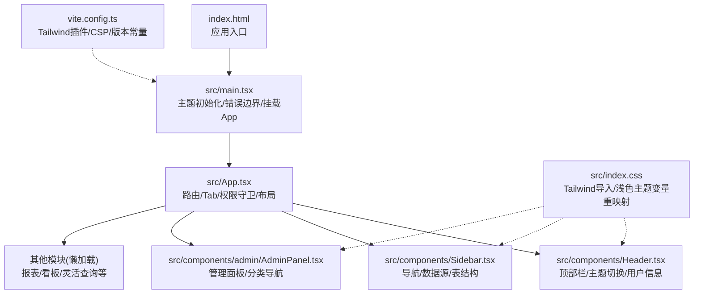
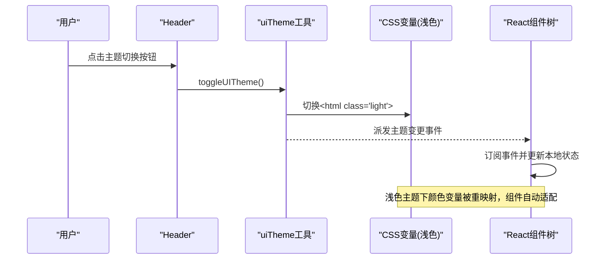
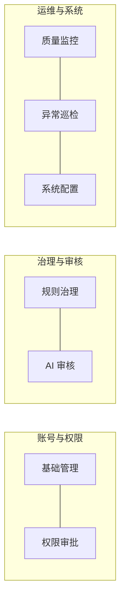
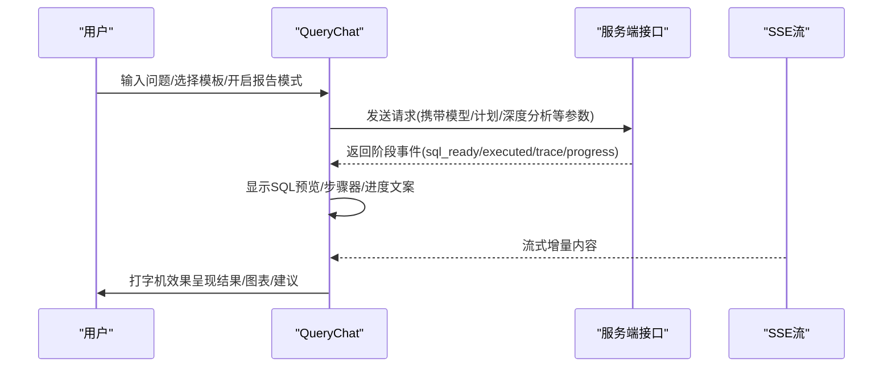
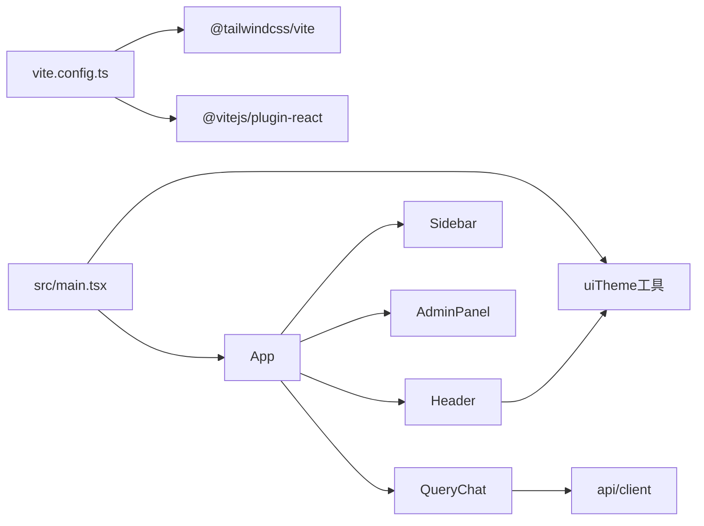

# UI/UX设计

<cite>
**本文引用的文件**
- [src/index.css](file://src/index.css)
- [src/utils/uiTheme.ts](file://src/utils/uiTheme.ts)
- [index.html](file://index.html)
- [src/main.tsx](file://src/main.tsx)
- [vite.config.ts](file://vite.config.ts)
- [package.json](file://package.json)
- [src/App.tsx](file://src/App.tsx)
- [src/components/Header.tsx](file://src/components/Header.tsx)
- [src/components/Sidebar.tsx](file://src/components/Sidebar.tsx)
- [src/components/admin/AdminPanel.tsx](file://src/components/admin/AdminPanel.tsx)
- [src/components/query/QueryChat.tsx](file://src/components/query/QueryChat.tsx)
- [src/components/ErrorBoundary.tsx](file://src/components/ErrorBoundary.tsx)
</cite>

## 更新摘要
**变更内容**
- 增强了左侧导航栏的视觉层次结构，添加了渐变彩色条指示器、加粗分组标签和分隔线
- 改进了选中菜单项的字体权重和对比度，提升导航清晰度
- 优化了管理面板的分类导航，实现了三域分组的视觉区分
- 保持了设计一致性的同时提升了用户体验和信息层级

## 目录
1. [简介](#简介)
2. [项目结构](#项目结构)
3. [核心组件](#核心组件)
4. [架构总览](#架构总览)
5. [详细组件分析](#详细组件分析)
6. [依赖关系分析](#依赖关系分析)
7. [性能考量](#性能考量)
8. [故障排查指南](#故障排查指南)
9. [结论](#结论)
10. [附录：设计规范与测试方法](#附录：设计规范与测试方法)

## 简介
本文件面向"智能问数据分析系统"的UI/UX设计与实现，聚焦基于Tailwind CSS的现代化设计体系、响应式布局、主题定制（含深色/浅色模式）、用户体验优化（加载、错误、反馈）以及可访问性策略。文档同时提供设计规范要点、组件样式指南与UI测试方法，帮助开发者与设计者统一语言与实践。

**最新更新**：左侧导航栏获得了显著的视觉增强，包括渐变彩色条指示器、加粗分组标签、更高的对比度文本、选中菜单项的字体权重增加，以及主要类别之间的分组分隔线，为更好的视觉层次结构提供了支持。

## 项目结构
前端采用React + Vite构建，样式基于Tailwind CSS v4，通过CSS变量重映射实现深浅色主题切换；应用根入口负责主题初始化、API鉴权注入与全局错误边界包裹；页面由Header、Sidebar与主内容区构成，功能模块通过懒加载按需引入。

```mermaid
graph TB
A["index.html<br/>应用入口"] --> B["src/main.tsx<br/>主题初始化/错误边界/挂载App"]
B --> C["src/App.tsx<br/>路由/Tab/权限守卫/布局"]
C --> D["src/components/Header.tsx<br/>顶部栏/主题切换/用户信息"]
C --> E["src/components/Sidebar.tsx<br/>导航/数据源/表结构"]
C --> F["src/components/admin/AdminPanel.tsx<br/>管理面板/分类导航"]
C --> G["其他模块(懒加载)<br/>报表/看板/灵活查询等"]
H["src/index.css<br/>Tailwind导入/浅色主题变量重映射"] -.-> D
H -.-> E
H -.-> F
I["vite.config.ts<br/>Tailwind插件/CSP/版本常量"] -.-> B
```

**图表来源**
- [index.html:1-22](file://index.html#L1-L22)
- [src/main.tsx:1-27](file://src/main.tsx#L1-L27)
- [src/App.tsx:1-104](file://src/App.tsx#L1-L104)
- [src/components/Header.tsx:1-323](file://src/components/Header.tsx#L1-L323)
- [src/components/Sidebar.tsx:1-347](file://src/components/Sidebar.tsx#L1-L347)
- [src/components/admin/AdminPanel.tsx:1-709](file://src/components/admin/AdminPanel.tsx#L1-L709)
- [src/index.css:1-87](file://src/index.css#L1-L87)
- [vite.config.ts:1-42](file://vite.config.ts#L1-L42)

章节来源
- [index.html:1-22](file://index.html#L1-L22)
- [src/main.tsx:1-27](file://src/main.tsx#L1-L27)
- [src/App.tsx:1-104](file://src/App.tsx#L1-L104)
- [src/index.css:1-87](file://src/index.css#L1-L87)
- [vite.config.ts:1-42](file://vite.config.ts#L1-L42)

## 核心组件
- 主题系统：通过html.light类与CSS变量重映射实现浅色主题；主题状态持久化到localStorage，并提供自定义事件供多组件同步。
- 布局骨架：Header固定顶部、Sidebar左侧导航、右侧主内容区承载业务模块；整体使用flex布局与滚动约束。
- 导航与权限：Sidebar根据角色动态显示菜单项；Header展示当前数据源、金额单位、主题切换与用户信息。
- **增强的管理面板导航**：AdminPanel实现了三域分组的左侧导航，包含渐变彩色条指示器、加粗分组标签和视觉分隔线。
- 问答界面：QueryChat支持SSE流式输出、SQL预览、计划模式、深度分析、报告模式等交互。
- 错误边界：ErrorBoundary捕获渲染异常并给出友好提示与刷新操作。

章节来源
- [src/utils/uiTheme.ts:1-37](file://src/utils/uiTheme.ts#L1-L37)
- [src/components/Header.tsx:1-323](file://src/components/Header.tsx#L1-L323)
- [src/components/Sidebar.tsx:1-347](file://src/components/Sidebar.tsx#L1-L347)
- [src/components/admin/AdminPanel.tsx:82-112](file://src/components/admin/AdminPanel.tsx#L82-L112)
- [src/components/query/QueryChat.tsx:1-200](file://src/components/query/QueryChat.tsx#L1-L200)
- [src/components/ErrorBoundary.tsx:1-62](file://src/components/ErrorBoundary.tsx#L1-L62)

## 架构总览
主题与样式在构建期与运行期协同工作：Vite集成Tailwind插件，index.css定义浅色主题变量覆盖；HTML内联脚本与main.tsx在渲染前/后应用主题，避免闪烁；Header提供主题切换入口，触发全局事件以同步各组件状态。

```mermaid
sequenceDiagram
participant U as "用户"
participant H as "Header"
participant T as "uiTheme工具"
participant C as "CSS变量(浅色)"
participant R as "React组件树"
U->>H : 点击主题切换按钮
H->>T : toggleUITheme()
T->>C : 切换<html class="light">
T-->>R : 派发主题变更事件
R->>R : 订阅事件并更新本地状态
Note over C,R : 浅色主题下颜色变量被重映射，组件自动适配
```

**图表来源**
- [src/components/Header.tsx:86-92](file://src/components/Header.tsx#L86-L92)
- [src/utils/uiTheme.ts:22-35](file://src/utils/uiTheme.ts#L22-L35)
- [src/index.css:6-62](file://src/index.css#L6-L62)

章节来源
- [src/components/Header.tsx:86-92](file://src/components/Header.tsx#L86-L92)
- [src/utils/uiTheme.ts:22-35](file://src/utils/uiTheme.ts#L22-L35)
- [src/index.css:6-62](file://src/index.css#L6-L62)

## 详细组件分析

### 主题系统与颜色规范
- 默认深色主题：使用Tailwind slate色系作为表面与文字基色，强调色使用indigo/cyan/violet/emerald/rose/amber等。
- 浅色主题：通过在html.light下重映射--color-*变量，将深色表面翻转为浅色背景，同时提升关键强调色的可读性；对特定气泡头部文字进行强制恢复与字重调整以保证对比度。
- **新增可访问性支持**：添加了fuchsia系列颜色（300/400/200/950）和orange系列颜色（300/400）的专门CSS变量，确保Agent编排相关组件在浅色主题下的可访问性。
- 字体与排版：全局使用无衬线字体、抗锯齿；标题与正文字号层级清晰，行高与字距微调以提升阅读体验。
- 品牌色：以indigo为主品牌色，cyan为辅助强调色，用于Logo渐变、激活态与高亮元素。

**更新**：新增了fuchsia和orange色系的完整可访问性支持，包括不同亮度级别的CSS变量定义，确保在各种使用场景下都能满足WCAG对比度标准。

章节来源
- [src/index.css:1-87](file://src/index.css#L1-L87)
- [src/components/Header.tsx:96-113](file://src/components/Header.tsx#L96-L113)

### 响应式设计与移动端适配
- 布局：Header高度固定、sticky定位；Sidebar在展开/收起两种模式下自适应宽度；主内容区flex-1自适应剩余空间。
- 断点：使用Tailwind内置断点控制显示/隐藏（如md/xl/2xl），在小屏隐藏次要信息，在大屏展示完整面板。
- 触摸优化：按钮与输入控件具备足够点击区域；悬停提示仅在非触摸设备可见；表单控件焦点态明确。
- 滚动与溢出：侧边栏与主内容区独立滚动，避免整页滚动抖动。

章节来源
- [src/App.tsx:84-101](file://src/App.tsx#L84-L101)
- [src/components/Sidebar.tsx:133-191](file://src/components/Sidebar.tsx#L133-L191)
- [src/components/Header.tsx:95-140](file://src/components/Header.tsx#L95-L140)

### 主题定制系统（深色/浅色、品牌配置、动态切换）
- 持久化：主题选择保存到localStorage，页面加载前通过index.html内联脚本提前应用，避免闪烁。
- 运行时切换：Header按钮调用toggleUITheme，切换html类名并派发事件；所有订阅组件同步更新。
- 品牌扩展：可通过修改index.css中的--color-*变量或新增语义化变量来扩展品牌色；强调色在浅色模式下已做可读性增强。

章节来源
- [index.html:10-17](file://index.html#L10-L17)
- [src/utils/uiTheme.ts:14-35](file://src/utils/uiTheme.ts#L14-L35)
- [src/components/Header.tsx:204-211](file://src/components/Header.tsx#L204-L211)
- [src/index.css:6-62](file://src/index.css#L6-L62)

### 用户体验优化（加载状态、错误提示、操作反馈）
- 加载状态：Suspense包裹懒加载模块，显示"加载中…"占位；SSE流式输出时实时显示进度与SQL预览，降低等待焦虑。
- 错误提示：ErrorBoundary捕获渲染异常并展示友好提示与错误详情；请求失败时Toast或卡片形式提示。
- 操作反馈：按钮hover/active态、禁用态、提交中态均有视觉反馈；成功/失败消息使用不同色彩区分。

章节来源
- [src/App.tsx:96-98](file://src/App.tsx#L96-L98)
- [src/components/query/QueryChat.tsx:72-90](file://src/components/query/QueryChat.tsx#L72-L90)
- [src/components/ErrorBoundary.tsx:34-58](file://src/components/ErrorBoundary.tsx#L34-L58)

### 可访问性设计（键盘导航、屏幕阅读器、对比度）
- 键盘导航：所有交互控件均为原生button/select/input，支持Tab顺序与Enter/Space触发；焦点态清晰。
- 屏幕阅读器：按钮提供title与aria语义（如data-testid便于自动化测试）；图标配合文本说明。
- **增强的对比度支持**：浅色主题下对强调色文字进行提深处理，确保在浅色背景上的可读性；新增的fuchsia和orange色系变量确保Agent编排相关组件的可访问性；气泡头部文字在浅色模式下强制近白色。
- WCAG合规：通过精确的颜色对比度调整，确保所有文本和图形元素都符合Web内容可访问性指南标准。

**更新**：显著增强了可访问性支持，特别是针对Agent编排功能的fuchsia色系和通用橙色系的可访问性优化，确保在不同主题模式下都能提供良好的用户体验。

章节来源
- [src/components/Header.tsx:123-134](file://src/components/Header.tsx#L123-L134)
- [src/components/Header.tsx:204-211](file://src/components/Header.tsx#L204-L211)
- [src/index.css:61-87](file://src/index.css#L61-L87)

### 增强的导航系统视觉设计

#### 管理面板分类导航
管理面板实现了三域分组的左侧导航系统，具有显著的视觉增强：

- **渐变彩色条指示器**：每个分组都有独特的渐变色条（from-indigo-500 to-amber-500、from-cyan-500 to-rose-500、from-emerald-500 to-slate-500），提供清晰的视觉标识
- **加粗分组标签**：分组标题使用font-bold和tracking-wider，提升可读性和层次感
- **视觉分隔线**：组间使用border-t border-slate-800/50分隔，创建清晰的视觉层次
- **选中态增强**：选中菜单项使用font-semibold和bg-slate-800/80背景，提供更好的视觉反馈
- **响应式设计**：窄屏下隐藏分组标题，仅显示图标列，保持功能完整性

```mermaid
graph LR
subgraph "账号与权限"
A["基础管理"] --- B["权限审批"]
end
subgraph "治理与审核"
C["规则治理"] --- D["AI 审核"]
end
subgraph "运维与系统"
E["质量监控"] --- F["异常巡检"] --- G["系统配置"]
end
```

**图表来源**
- [src/components/admin/AdminPanel.tsx:82-112](file://src/components/admin/AdminPanel.tsx#L82-L112)
- [src/components/admin/AdminPanel.tsx:332-366](file://src/components/admin/AdminPanel.tsx#L332-L366)

#### 侧边栏导航增强
主侧边栏也获得了视觉改进：

- **选中项字体权重**：选中的菜单项使用font-medium，提供更好的视觉层次
- **边框指示器**：选中项带有border border-indigo-500/30边框，增强选中状态识别
- **背景透明度**：选中项使用bg-indigo-600/15半透明背景，保持视觉一致性
- **悬停效果**：未选中项在悬停时显示hover:bg-slate-800/80效果

**更新**：左侧导航栏获得了显著的视觉增强，包括渐变彩色条指示器、加粗分组标签、更高的对比度文本、选中菜单项的字体权重增加，以及主要类别之间的分组分隔线，为更好的视觉层次结构提供了支持。

章节来源
- [src/components/admin/AdminPanel.tsx:82-112](file://src/components/admin/AdminPanel.tsx#L82-L112)
- [src/components/admin/AdminPanel.tsx:332-366](file://src/components/admin/AdminPanel.tsx#L332-L366)
- [src/components/Sidebar.tsx:217-257](file://src/components/Sidebar.tsx#L217-L257)

### 组件样式指南
- 颜色
  - 背景：深色bg-slate-950/900，浅色通过变量重映射至浅灰/白。
  - 文字：深色text-slate-100/200/300/400；浅色下对应反色。
  - 强调：indigo主色，cyan/amber/emerald/rose/violet/fuchsia/orange作为状态与标签色。
- 间距
  - 使用Tailwind spacing scale（p-2/p-3/m-1/m-2等），保持统一节奏。
- 圆角与阴影
  - 卡片/面板使用rounded-xl/2xl，阴影适度提升层次。
- 字体
  - 无衬线字体，标题加粗，正文常规；小字号用于标签与辅助信息。
- 交互
  - hover/active/focus态明确；禁用态降低透明度；提交中态显示loading文案。

章节来源
- [src/components/Header.tsx:95-211](file://src/components/Header.tsx#L95-L211)
- [src/components/Sidebar.tsx:133-257](file://src/components/Sidebar.tsx#L133-L257)
- [src/components/admin/AdminPanel.tsx:332-366](file://src/components/admin/AdminPanel.tsx#L332-L366)
- [src/index.css:1-87](file://src/index.css#L1-L87)

### 问答聊天界面（QueryChat）交互流程

```mermaid
sequenceDiagram
participant U as "用户"
participant Q as "QueryChat"
participant S as "服务端接口"
participant L as "SSE流"
U->>Q : 输入问题/选择模板/开启报告模式
Q->>S : 发送请求(携带模型/计划/深度分析等参数)
S-->>Q : 返回阶段事件(sql_ready/executed/trace/progress)
Q->>Q : 显示SQL预览/步骤器/进度文案
L-->>Q : 流式增量内容
Q->>U : 打字机效果呈现结果/图表/建议
```

**图表来源**
- [src/components/query/QueryChat.tsx:72-90](file://src/components/query/QueryChat.tsx#L72-L90)
- [src/components/query/QueryChat.tsx:158-171](file://src/components/query/QueryChat.tsx#L158-L171)

章节来源
- [src/components/query/QueryChat.tsx:1-200](file://src/components/query/QueryChat.tsx#L1-L200)

## 依赖关系分析
- 构建与样式
  - Vite集成Tailwind插件，启用CSS变量与工具类编译。
  - CSP头在开发服务器设置，允许内联脚本与样式（便于调试）。
- 运行时依赖
  - React组件树通过Store与API客户端协作；主题工具与CSS变量解耦，仅通过class与事件通信。
- 外部库
  - lucide-react图标库；recharts图表；zustand状态管理；日期/序列化等工具库。

```mermaid
graph LR
V["vite.config.ts"] --> T["@tailwindcss/vite"]
V --> P["@vitejs/plugin-react"]
M["src/main.tsx"] --> U["uiTheme工具"]
M --> A["App"]
A --> H["Header"]
A --> S["Sidebar"]
A --> AP["AdminPanel"]
A --> Q["QueryChat"]
H --> U
Q --> API["api/client"]
```

**图表来源**
- [vite.config.ts:1-42](file://vite.config.ts#L1-L42)
- [src/main.tsx:1-27](file://src/main.tsx#L1-L27)
- [src/App.tsx:1-104](file://src/App.tsx#L1-L104)

章节来源
- [vite.config.ts:1-42](file://vite.config.ts#L1-L42)
- [package.json:26-74](file://package.json#L26-L74)

## 性能考量
- 首屏体积：大组件懒加载（Dashboard/FlexQueryBuilder/ReportCenter），减少初始包体。
- 主题切换：仅切换class与CSS变量，无重绘大图，开销极低。
- 流式输出：SSE增量渲染，避免长轮询阻塞；SQL先行回显提升感知速度。
- 构建优化：Vite生产构建+esbuild打包后端；版本常量注入统一来源。

章节来源
- [src/App.tsx:13-17](file://src/App.tsx#L13-L17)
- [src/components/query/QueryChat.tsx:72-90](file://src/components/query/QueryChat.tsx#L72-L90)
- [vite.config.ts:7-18](file://vite.config.ts#L7-L18)

## 故障排查指南
- 页面白屏/崩溃：检查ErrorBoundary是否捕获并提示；查看控制台错误堆栈；尝试刷新页面。
- 主题不生效：确认index.html是否在渲染前添加light类；检查localStorage键值；确认CSS变量是否被正确覆盖。
- 请求失败：检查CSP设置与网络连通；查看apiFetch错误处理；确认鉴权token有效。
- 流式输出异常：检查SSE连接与事件解析；确认服务端推送事件格式。
- 可访问性问题：验证颜色对比度是否符合WCAG标准；检查键盘导航是否正常；测试屏幕阅读器兼容性。
- **导航视觉问题**：检查AdminPanel的SECTION_GROUPS配置是否正确；确认渐变样式类是否被正确应用；验证响应式断点下的显示效果。

章节来源
- [src/components/ErrorBoundary.tsx:34-58](file://src/components/ErrorBoundary.tsx#L34-L58)
- [index.html:10-17](file://index.html#L10-L17)
- [vite.config.ts:31-34](file://vite.config.ts#L31-L34)
- [src/components/admin/AdminPanel.tsx:82-112](file://src/components/admin/AdminPanel.tsx#L82-L112)

## 结论
本系统以Tailwind CSS为核心，结合CSS变量重映射实现了稳定可靠的深浅色主题切换；通过Header/Sidebar/App组合形成清晰的布局与信息层级；问答界面采用SSE流式输出与丰富的交互选项，显著提升用户体验。**最新增强的导航系统视觉设计**通过渐变彩色条指示器、加粗分组标签和视觉分隔线，大幅提升了管理面板和用户界面的信息层次结构和可访问性。主题、响应式与可访问性贯穿全链路，配合错误边界与加载反馈，构建了健壮且易用的数据分析前端。

## 附录：设计规范与测试方法

### 设计规范要点
- 颜色主题
  - 深色：slate系列表面与文字，indigo主强调，cyan辅助强调。
  - 浅色：通过--color-*变量重映射，保证对比度与可读性。
  - **新增**：fuchsia系列（300/400/200/950）和orange系列（300/400）的完整可访问性支持。
- 字体规范
  - 无衬线字体，标题加粗，正文常规；小字号用于标签与辅助信息。
- 间距标准
  - 使用Tailwind spacing scale，保持统一节奏；卡片/面板内边距一致。
- 组件样式
  - 圆角、阴影、边框、焦点态统一；按钮尺寸与层级清晰。
- 品牌配置
  - indigo主品牌色，cyan辅助；Logo渐变与激活态使用品牌色。
- **导航视觉层次**
  - 分组标题使用font-bold和tracking-wider提升辨识度
  - 渐变彩色条指示器提供视觉标识（from-indigo-500 to-amber-500等）
  - 组间分隔线使用border-t border-slate-800/50创建清晰层次
  - 选中项使用font-semibold和半透明背景增强识别度

章节来源
- [src/index.css:1-87](file://src/index.css#L1-L87)
- [src/components/Header.tsx:96-113](file://src/components/Header.tsx#L96-L113)
- [src/components/admin/AdminPanel.tsx:82-112](file://src/components/admin/AdminPanel.tsx#L82-L112)

### 组件样式指南
- Header
  - 固定高度、sticky定位；包含品牌、数据源切换、金额单位、主题切换、用户信息。
- Sidebar
  - 展开/收起两种模式；按角色过滤菜单；表结构区域折叠展示。
- **AdminPanel**
  - 三域分组左侧导航；渐变彩色条指示器；加粗分组标签；视觉分隔线；响应式设计。
- QueryChat
  - 输入框、技能库、计划/深度分析开关、报告模式；SSE流式输出与SQL预览。
- ErrorBoundary
  - 捕获渲染异常，展示友好提示与刷新按钮。

章节来源
- [src/components/Header.tsx:95-211](file://src/components/Header.tsx#L95-L211)
- [src/components/Sidebar.tsx:133-257](file://src/components/Sidebar.tsx#L133-L257)
- [src/components/admin/AdminPanel.tsx:332-366](file://src/components/admin/AdminPanel.tsx#L332-L366)
- [src/components/query/QueryChat.tsx:1-200](file://src/components/query/QueryChat.tsx#L1-L200)
- [src/components/ErrorBoundary.tsx:34-58](file://src/components/ErrorBoundary.tsx#L34-L58)

### UI测试方法
- 单元与集成测试
  - 使用Vitest运行单元测试；排除E2E用例。
- 端到端测试
  - 使用Playwright执行e2e用例；验证主题切换、导航跳转、表单提交等关键路径。
- 可访问性测试
  - 键盘导航遍历；屏幕阅读器朗读检查；颜色对比度校验；特别关注新增的fuchsia和orange色系的可访问性测试。
- 主题一致性
  - 切换深浅色后截图比对；验证CSS变量覆盖与文字可读性；确保WCAG合规的对比度比率。
- **导航视觉测试**
  - 验证渐变彩色条在不同屏幕尺寸下的显示效果
  - 检查分组标题的加粗效果和追踪间距
  - 测试选中状态的字体权重变化和背景透明度
  - 验证响应式断点下导航的适配表现

章节来源
- [package.json:15-16](file://package.json#L15-L16)
- [vite.config.ts:36-39](file://vite.config.ts#L36-L39)
- [src/components/admin/AdminPanel.tsx:332-366](file://src/components/admin/AdminPanel.tsx#L332-L366)