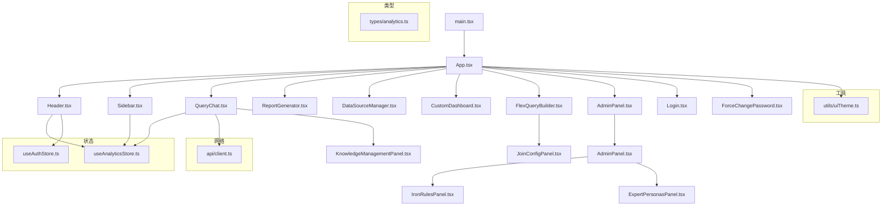
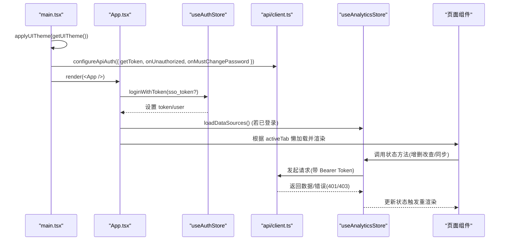
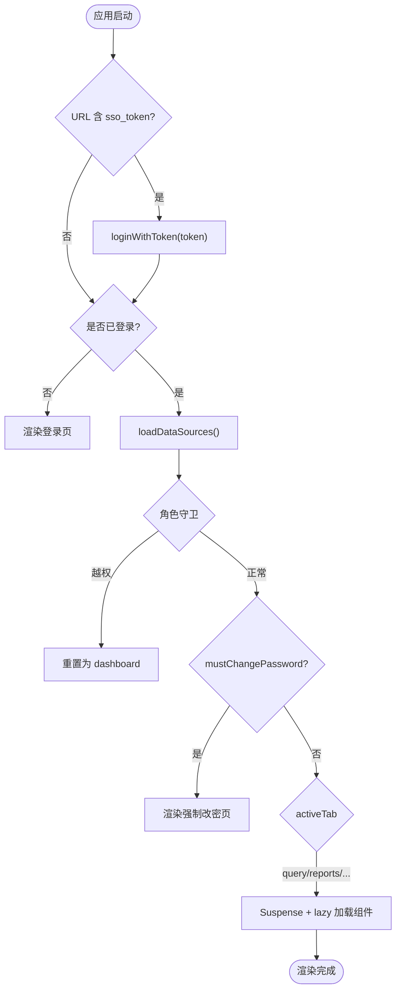
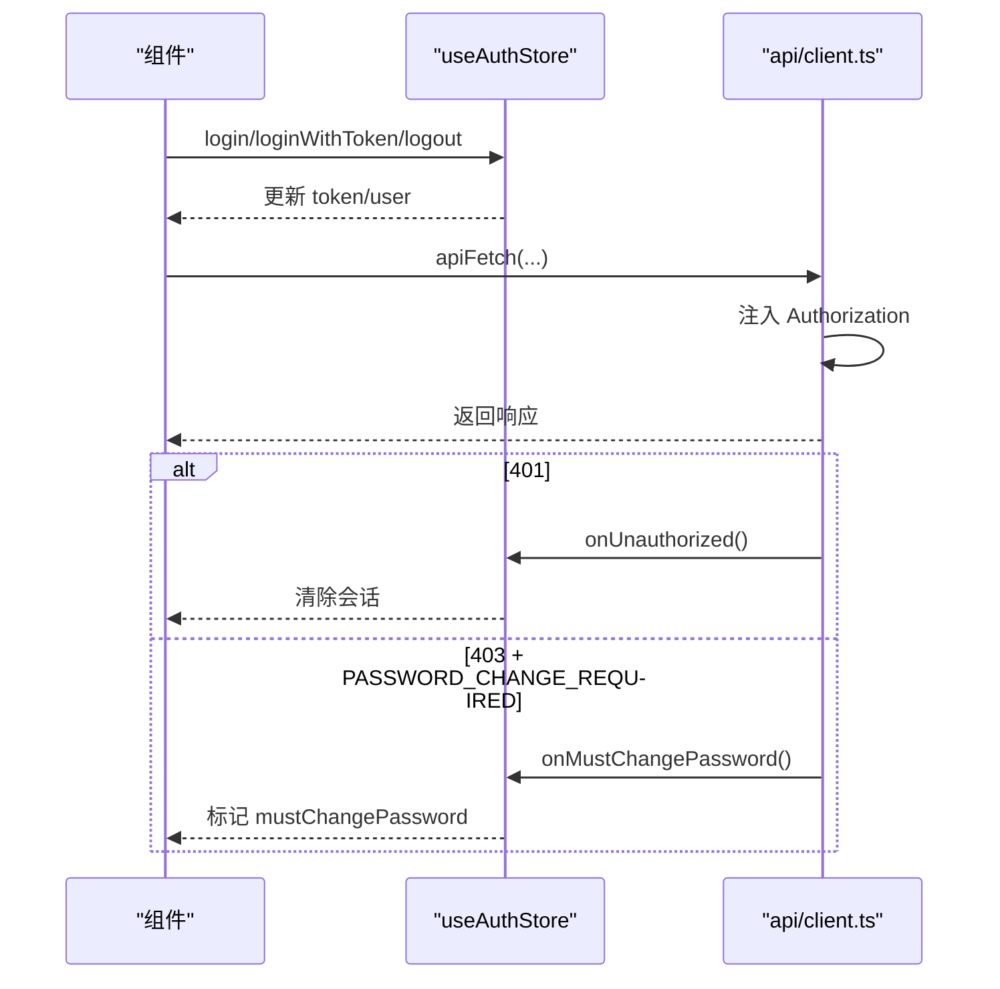
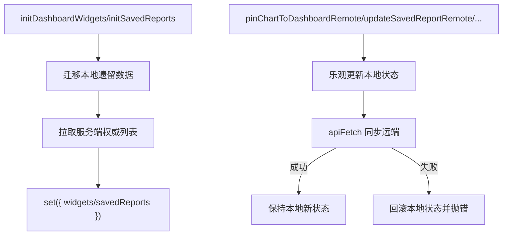
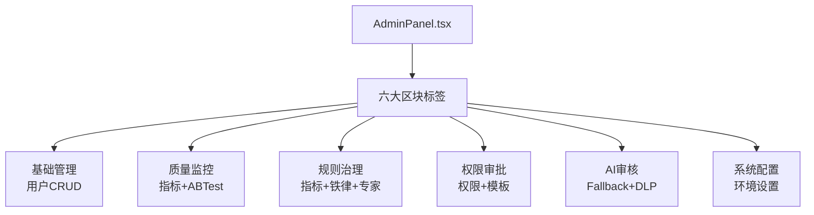
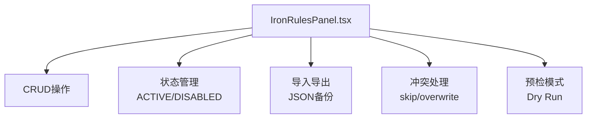
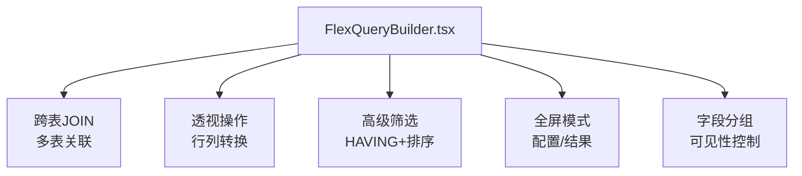
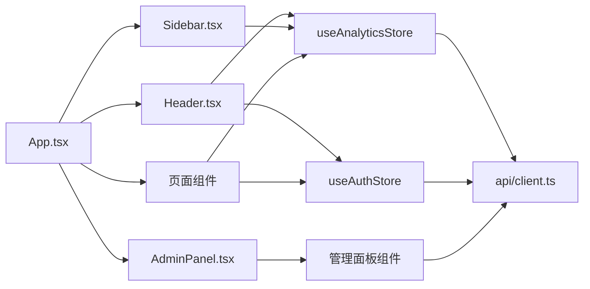

# 前端应用

<cite>
**本文引用的文件**
- [src/App.tsx](file://src/App.tsx)
- [src/main.tsx](file://src/main.tsx)
- [package.json](file://package.json)
- [vite.config.ts](file://vite.config.ts)
- [tsconfig.json](file://tsconfig.json)
- [src/hooks/useAnalyticsStore.ts](file://src/hooks/useAnalyticsStore.ts)
- [src/hooks/useAuthStore.ts](file://src/hooks/useAuthStore.ts)
- [src/components/Header.tsx](file://src/components/Header.tsx)
- [src/components/Sidebar.tsx](file://src/components/Sidebar.tsx)
- [src/api/client.ts](file://src/api/client.ts)
- [src/types/analytics.ts](file://src/types/analytics.ts)
- [src/utils/uiTheme.ts](file://src/utils/uiTheme.ts)
- [src/components/query/QueryChat.tsx](file://src/components/query/QueryChat.tsx)
- [src/components/admin/AdminPanel.tsx](file://src/components/admin/AdminPanel.tsx)
- [src/components/admin/IronRulesPanel.tsx](file://src/components/admin/IronRulesPanel.tsx)
- [src/components/admin/ExpertPersonasPanel.tsx](file://src/components/admin/ExpertPersonasPanel.tsx)
- [src/components/knowledge/KnowledgeManagementPanel.tsx](file://src/components/knowledge/KnowledgeManagementPanel.tsx)
- [src/components/flexquery/FlexQueryBuilder.tsx](file://src/components/flexquery/FlexQueryBuilder.tsx)
</cite>

## 更新摘要
**变更内容**
- 系统管理新增六大区块结构（基础管理、质量监控、规则治理、权限审批、AI审核、系统配置）
- 文件导入功能支持CSV/Excel/JSON真实入库
- 知识管理增强包括铁律规则和指标管理
- 查询聊天界面支持专家角色和全屏深读能力
- 灵活查询构建器获得高级筛选双入口支持跨表JOIN和透视操作

## 目录
1. [简介](#简介)
2. [项目结构](#项目结构)
3. [核心组件](#核心组件)
4. [架构总览](#架构总览)
5. [详细组件分析](#详细组件分析)
6. [依赖关系分析](#依赖关系分析)
7. [性能考量](#性能考量)
8. [故障排查指南](#故障排查指南)
9. [结论](#结论)
10. [附录](#附录)

## 简介
本文件系统性地梳理智能问数据分析系统的前端实现，基于 React 19 + TypeScript + Vite 的现代工程化方案。文档覆盖：
- 组件分层与组织（页面组件、业务组件、通用组件）
- 状态管理策略（Zustand 全局状态、组件本地状态、服务端状态同步）
- 路由与导航设计（Tab 驱动的内聚式导航）
- UI/UX 原则（响应式、主题定制、体验优化）
- 构建配置与性能优化
- 浏览器兼容性说明
- 核心组件使用示例与自定义指南

**最新更新**：系统管理模块已重构为六大区块结构，增强了文件导入、知识管理、专家角色等功能，并改进了灵活查询构建器的跨表JOIN和透视操作能力。

## 项目结构
前端采用"按功能域分目录"的组织方式：
- src/components：按业务域划分子目录（query、reports、dashboard、datasource、admin、auth、charts、common 等），每个子目录内包含页面级或业务级组件；通用能力下沉到 common 或 hooks/utils。
- src/hooks：跨组件复用的状态与逻辑封装（如 useAnalyticsStore、useAuthStore）。
- src/api：统一网络请求封装与错误处理。
- src/types：类型定义集中管理，保证前后端契约一致。
- src/utils：工具函数（主题、导出、SSE、异常检测等）。
- 入口文件：main.tsx 负责应用初始化、主题注入、API 鉴权钩子装配；App.tsx 作为根容器，承载 Header、Sidebar 与主内容区，并实现 Tab 路由与懒加载。

**图表来源**
- [src/main.tsx:1-27](file://src/main.tsx#L1-L27)
- [src/App.tsx:1-104](file://src/App.tsx#L1-L104)
- [src/components/Header.tsx:1-323](file://src/components/Header.tsx#L1-L323)
- [src/components/Sidebar.tsx:1-347](file://src/components/Sidebar.tsx#L1-L347)
- [src/components/query/QueryChat.tsx:1-200](file://src/components/query/QueryChat.tsx#L1-L200)
- [src/hooks/useAnalyticsStore.ts:1-735](file://src/hooks/useAnalyticsStore.ts#L1-L735)
- [src/hooks/useAuthStore.ts:1-84](file://src/hooks/useAuthStore.ts#L1-L84)
- [src/api/client.ts:1-74](file://src/api/client.ts#L1-L74)
- [src/types/analytics.ts:1-372](file://src/types/analytics.ts#L1-L372)
- [src/utils/uiTheme.ts:1-37](file://src/utils/uiTheme.ts#L1-L37)
- [src/components/admin/AdminPanel.tsx:1-606](file://src/components/admin/AdminPanel.tsx#L1-L606)
- [src/components/admin/IronRulesPanel.tsx:1-581](file://src/components/admin/IronRulesPanel.tsx#L1-L581)
- [src/components/admin/ExpertPersonasPanel.tsx:1-420](file://src/components/admin/ExpertPersonasPanel.tsx#L1-L420)
- [src/components/knowledge/KnowledgeManagementPanel.tsx:1-259](file://src/components/knowledge/KnowledgeManagementPanel.tsx#L1-L259)
- [src/components/flexquery/FlexQueryBuilder.tsx:1-200](file://src/components/flexquery/FlexQueryBuilder.tsx#L1-L200)

章节来源
- [src/main.tsx:1-27](file://src/main.tsx#L1-L27)
- [src/App.tsx:1-104](file://src/App.tsx#L1-L104)
- [package.json:1-76](file://package.json#L1-L76)
- [vite.config.ts:1-42](file://vite.config.ts#L1-L42)
- [tsconfig.json:1-27](file://tsconfig.json#L1-L27)

## 核心组件
- App.tsx：根容器，负责登录态校验、强制改密拦截、角色守卫、Tab 切换与懒加载渲染。
- Header.tsx：顶部栏，提供数据源切换、权限申请、全局金额单位、主题切换、帮助入口、用户信息与登出。
- Sidebar.tsx：左侧导航，按角色动态展示菜单项，支持收缩/展开与 Schema 面板。
- QueryChat.tsx：智能问答主界面，集成 SSE 流式输出、SQL 预览、技能库、报告模式、语音输入、对话历史等。
- AdminPanel.tsx：**新增** 统一的系统管理控制台，整合六大管理区块。
- IronRulesPanel.tsx：**新增** 铁律规则库管理，支持CRUD、导入导出、状态控制。
- ExpertPersonasPanel.tsx：**新增** 专家角色管理，支持关键词匹配和提示词配置。
- KnowledgeManagementPanel.tsx：**增强** 知识库导入导出功能，支持真实数据库存储。
- FlexQueryBuilder.tsx：**增强** 灵活查询构建器，支持跨表JOIN和透视操作。
- useAnalyticsStore.ts：全局业务状态（数据源、对话消息、看板 Widget、报表、Tab、报告中心跳转等），封装与服务端的持久化同步。
- useAuthStore.ts：认证状态（token、用户信息、登录/登出、SSO 回跳、强制改密标记）。
- api/client.ts：统一 fetch 封装，自动注入 Authorization，统一处理 401/403（含密码修改要求）与错误码。
- uiTheme.ts：全局主题切换与事件广播，避免闪烁。

章节来源
- [src/App.tsx:1-104](file://src/App.tsx#L1-L104)
- [src/components/Header.tsx:1-323](file://src/components/Header.tsx#L1-L323)
- [src/components/Sidebar.tsx:1-347](file://src/components/Sidebar.tsx#L1-L347)
- [src/components/query/QueryChat.tsx:1-200](file://src/components/query/QueryChat.tsx#L1-L200)
- [src/components/admin/AdminPanel.tsx:1-606](file://src/components/admin/AdminPanel.tsx#L1-L606)
- [src/components/admin/IronRulesPanel.tsx:1-581](file://src/components/admin/IronRulesPanel.tsx#L1-L581)
- [src/components/admin/ExpertPersonasPanel.tsx:1-420](file://src/components/admin/ExpertPersonasPanel.tsx#L1-L420)
- [src/components/knowledge/KnowledgeManagementPanel.tsx:1-259](file://src/components/knowledge/KnowledgeManagementPanel.tsx#L1-L259)
- [src/components/flexquery/FlexQueryBuilder.tsx:1-200](file://src/components/flexquery/FlexQueryBuilder.tsx#L1-L200)
- [src/hooks/useAnalyticsStore.ts:1-735](file://src/hooks/useAnalyticsStore.ts#L1-L735)
- [src/hooks/useAuthStore.ts:1-84](file://src/hooks/useAuthStore.ts#L1-L84)
- [src/api/client.ts:1-74](file://src/api/client.ts#L1-L74)
- [src/utils/uiTheme.ts:1-37](file://src/utils/uiTheme.ts#L1-L37)

## 架构总览
前端以"组合根装配 + 状态驱动视图"的架构为主：
- 组合根 main.tsx 在启动时应用主题、注入 API 鉴权处理器（getToken/onUnauthorized/onMustChangePassword），包裹 ErrorBoundary 后挂载 App。
- App.tsx 通过 Zustand store 获取当前 Tab 与用户信息，执行角色守卫与 SSO 回跳流程，按需懒加载大组件以减少首屏体积。
- 各页面组件通过订阅对应 store 的状态变化进行渲染，并通过 store 方法触发与服务端的同步（如数据源加载、看板 Widget 同步、报表保存/更新/删除）。
- 网络层统一封装，确保所有请求携带 token，并对 401/403 做统一处理。

**图表来源**
- [src/main.tsx:1-27](file://src/main.tsx#L1-L27)
- [src/App.tsx:1-104](file://src/App.tsx#L1-L104)
- [src/hooks/useAuthStore.ts:1-84](file://src/hooks/useAuthStore.ts#L1-L84)
- [src/hooks/useAnalyticsStore.ts:1-735](file://src/hooks/useAnalyticsStore.ts#L1-L735)
- [src/api/client.ts:1-74](file://src/api/client.ts#L1-L74)

## 详细组件分析

### 应用根与路由导航（App.tsx）
- 职责：
  - 处理 OIDC 回跳参数 sso_token，调用登录接口并清理 URL。
  - 登录后从服务端加载数据源列表。
  - 角色守卫：VIEWER 不可访问 query/flexquery；非 ADMIN 不可访问 datasources/admin。
  - 强制改密拦截：mustChangePassword 为真时仅渲染改密页。
  - 基于 activeTab 的条件渲染与 Suspense 懒加载大组件。
- 导航机制：
  - 无传统路由库，采用"Tab + 条件渲染"的内聚式导航，配合 Sidebar/Header 的 setActiveTab 完成页面切换。
  - 报告中心跳转通过 pendingReportId 在会话内传递。

**图表来源**
- [src/App.tsx:1-104](file://src/App.tsx#L1-L104)

章节来源
- [src/App.tsx:1-104](file://src/App.tsx#L1-L104)

### 认证与会话（useAuthStore.ts 与 api/client.ts）
- 认证流程：
  - 用户名密码登录 / SSO 回跳登录，成功后写入 token 与 user。
  - 登出清空本地存储与状态。
  - hasRole 用于权限判断。
  - mustChangePassword 标记由服务端 403 拦截触发，进入强制改密流程。
- 网络鉴权：
  - apiFetch 自动注入 Authorization: Bearer <token>。
  - 401 触发 onUnauthorized（登出）。
  - 403 且 code 为 PASSWORD_CHANGE_REQUIRED 触发 onMustChangePassword。

**图表来源**
- [src/hooks/useAuthStore.ts:1-84](file://src/hooks/useAuthStore.ts#L1-L84)
- [src/api/client.ts:1-74](file://src/api/client.ts#L1-L74)

章节来源
- [src/hooks/useAuthStore.ts:1-84](file://src/hooks/useAuthStore.ts#L1-L84)
- [src/api/client.ts:1-74](file://src/api/client.ts#L1-L74)

### 全局状态与数据同步（useAnalyticsStore.ts）
- 状态范围：
  - 数据源列表与活跃数据源/表选择。
  - 对话消息（按数据源隔离）、查询结果、反馈、图表配置。
  - 看板 Widget（服务端持久化，含迁移与排序）。
  - 报表（服务端持久化，含创建/更新/删除、批注同步、演示报表隐藏）。
  - 应用 Tab 与报告中心待查看报告 ID。
- 持久化策略：
  - 使用 zustand/persist 将必要字段落 localStorage，并在版本升级时进行迁移。
  - 对高频交互（拖拽预览）提供 localOnly 选项，减少远端同步压力。
  - 对关键写操作（Widget/报表）失败时回滚本地状态，保证一致性。
- 典型流程：
  - 初始化：先迁移本地遗留数据，再拉取服务端权威列表。
  - 写操作：乐观更新本地，成功后保持，失败则回滚并抛错。

**图表来源**
- [src/hooks/useAnalyticsStore.ts:1-735](file://src/hooks/useAnalyticsStore.ts#L1-L735)

章节来源
- [src/hooks/useAnalyticsStore.ts:1-735](file://src/hooks/useAnalyticsStore.ts#L1-L735)

### 头部与侧边栏（Header.tsx 与 Sidebar.tsx）
- Header：
  - 数据源切换器：仅显示有权限的数据源。
  - 权限申请：当存在无权访问的数据源时，弹出表单提交申请。
  - 全局金额单位：供问数/报表/灵活查询默认跟随。
  - 主题切换：通过 uiTheme 工具切换并广播事件。
  - 用户信息与登出。
- Sidebar：
  - 按角色过滤导航项（VIEWER 受限）。
  - 支持收缩/展开，Schema 区域可折叠，管理员可见表详情。
  - 点击表名可跳转到数据源管理页（管理员）。

章节来源
- [src/components/Header.tsx:1-323](file://src/components/Header.tsx#L1-L323)
- [src/components/Sidebar.tsx:1-347](file://src/components/Sidebar.tsx#L1-L347)

### 智能问答（QueryChat.tsx）
- 能力概览：
  - 输入限制与建议生成。
  - 模型自选（持久化）。
  - 计划模式（M2）与深度分析（M3）开关（持久化）。
  - 报告模式（v0.5.0）：直接生成完整报告，支持模板选择。
  - SSE 流式进度与 SQL 先行回显。
  - 技能库、语音输入、对话历史、SQL 预览、分析追踪。
  - **新增**：知识库管理面板集成，支持导入导出功能。
- 与后端交互：
  - 通过 apiFetch 调用问数/报告/技能/模板等接口。
  - 使用 readSseStream 接收流式事件，实时更新 UI。
  - 金额单位通过 useEffectiveAmountUnit 模块覆盖。

章节来源
- [src/components/query/QueryChat.tsx:1-200](file://src/components/query/QueryChat.tsx#L1-L200)

### 系统管理控制台（AdminPanel.tsx）
**新增功能**：统一的系统管理控制台，整合六大管理区块：

- **基础管理**：用户账号管理，支持创建、编辑、禁用、重置密码等操作。
- **质量监控**：北极星指标、AB测试、LLM用量监控、漂移告警。
- **规则治理**：指标管理、铁律规则库、专家角色配置。
- **权限审批**：数据源权限申请审批、报告模板管理。
- **AI审核**：Fallback样本审核、DLP下载审批。
- **系统配置**：环境配置、系统设置。

**图表来源**
- [src/components/admin/AdminPanel.tsx:54-59](file://src/components/admin/AdminPanel.tsx#L54-L59)

章节来源
- [src/components/admin/AdminPanel.tsx:1-606](file://src/components/admin/AdminPanel.tsx#L1-L606)

### 铁律规则库（IronRulesPanel.tsx）
**新增功能**：铁律规则库管理，支持强制规则管理：

- **CRUD操作**：创建、编辑、删除铁律规则。
- **状态控制**：启用/停用规则，生效中规则会全量注入到问数和报表。
- **导入导出**：支持JSON格式备份文件的导入导出。
- **冲突处理**：支持跳过、覆盖两种冲突处理策略。
- **预检模式**：Dry Run模式，只统计不实际写入。

**图表来源**
- [src/components/admin/IronRulesPanel.tsx:25-32](file://src/components/admin/IronRulesPanel.tsx#L25-L32)

章节来源
- [src/components/admin/IronRulesPanel.tsx:1-581](file://src/components/admin/IronRulesPanel.tsx#L1-L581)

### 专家角色管理（ExpertPersonasPanel.tsx）
**新增功能**：专家角色配置，支持AI解读的角色化：

- **角色配置**：维护角色标签、触发关键词、角色提示词。
- **关键词匹配**：按优先级升序匹配，首个命中生效。
- **内置角色**：保护内置角色不被删除，防止路由缺口。
- **实时生效**：保存后立即生效，服务端缓存即时失效。

章节来源
- [src/components/admin/ExpertPersonasPanel.tsx:1-420](file://src/components/admin/ExpertPersonasPanel.tsx#L1-L420)

### 知识库管理（KnowledgeManagementPanel.tsx）
**增强功能**：知识库导入导出，支持真实数据库存储：

- **导出功能**：将当前数据源全部知识文档备份为JSON文件。
- **导入功能**：从JSON备份恢复知识文档，自动切块入库。
- **冲突策略**：支持跳过、覆盖、新增三种冲突处理方式。
- **预检模式**：Dry Run模式，确认变更范围后再执行。

章节来源
- [src/components/knowledge/KnowledgeManagementPanel.tsx:1-259](file://src/components/knowledge/KnowledgeManagementPanel.tsx#L1-L259)

### 灵活查询构建器（FlexQueryBuilder.tsx）
**增强功能**：高级筛选双入口，支持跨表JOIN和透视操作：

- **跨表JOIN**：支持多表关联查询，字段引用支持table.column格式。
- **透视操作**：支持行列转换的透视表功能。
- **高级筛选**：双入口筛选，支持HAVING条件和自由排序。
- **全屏模式**：查询配置区和结果支持全屏查看。
- **字段分组**：字段面板支持分组可见性，减少滚动。

**图表来源**
- [src/components/flexquery/FlexQueryBuilder.tsx:157-159](file://src/components/flexquery/FlexQueryBuilder.tsx#L157-L159)

章节来源
- [src/components/flexquery/FlexQueryBuilder.tsx:1-200](file://src/components/flexquery/FlexQueryBuilder.tsx#L1-L200)

## 依赖关系分析
- 组件耦合：
  - App.tsx 依赖 Header、Sidebar 与多个页面组件，通过 Zustand store 解耦具体业务逻辑。
  - Header/Sidebar 依赖 useAnalyticsStore 与 useAuthStore，不直接调用网络层。
  - 页面组件（如 QueryChat）通过 store 方法间接调用 apiFetch，降低与网络层的直接耦合。
  - **新增**：AdminPanel 聚合多个管理面板组件，形成统一的管理入口。
- 外部依赖：
  - React 19、Vite、Tailwind CSS、Recharts、Zustand、Lucide 图标等。
  - 开发服务器启用 CSP 头，便于调试与运行。

**图表来源**
- [src/App.tsx:1-104](file://src/App.tsx#L1-L104)
- [src/components/Header.tsx:1-323](file://src/components/Header.tsx#L1-L323)
- [src/components/Sidebar.tsx:1-347](file://src/components/Sidebar.tsx#L1-L347)
- [src/components/admin/AdminPanel.tsx:1-606](file://src/components/admin/AdminPanel.tsx#L1-L606)
- [src/hooks/useAnalyticsStore.ts:1-735](file://src/hooks/useAnalyticsStore.ts#L1-L735)
- [src/hooks/useAuthStore.ts:1-84](file://src/hooks/useAuthStore.ts#L1-L84)
- [src/api/client.ts:1-74](file://src/api/client.ts#L1-L74)

章节来源
- [src/App.tsx:1-104](file://src/App.tsx#L1-L104)
- [src/components/Header.tsx:1-323](file://src/components/Header.tsx#L1-L323)
- [src/components/Sidebar.tsx:1-347](file://src/components/Sidebar.tsx#L1-L347)
- [src/components/admin/AdminPanel.tsx:1-606](file://src/components/admin/AdminPanel.tsx#L1-L606)
- [src/hooks/useAnalyticsStore.ts:1-735](file://src/hooks/useAnalyticsStore.ts#L1-L735)
- [src/hooks/useAuthStore.ts:1-84](file://src/hooks/useAuthStore.ts#L1-L84)
- [src/api/client.ts:1-74](file://src/api/client.ts#L1-L74)

## 性能考量
- 首屏优化：
  - 大组件懒加载：Dashboard、FlexQueryBuilder、ReportCenter、AdminPanel 等通过 React.lazy + Suspense 延迟加载，减少初始包体。
  - 主题预应用：在 index.html 与 main.tsx 中尽早应用主题，避免闪烁。
- 渲染优化：
  - 使用 Zustand 的 selector 精确订阅状态，减少不必要重渲染。
  - 高频交互（如拖拽 Widget）支持 localOnly 模式，降低远端同步频率。
- 构建与开发：
  - Vite 插件链：React 插件 + Tailwind CSS 插件，开发服务器支持 HMR（可通过环境变量关闭以避免编辑闪烁）。
  - 版本常量注入：构建期读取 package.json 版本并注入为 import.meta.env.VITE_APP_VERSION，统一版本事实源。
- 网络优化：
  - 统一 apiFetch 封装，避免重复鉴权逻辑；错误统一处理，减少分支复杂度。
  - SSE 流式传输提升长耗时任务的用户感知。

章节来源
- [src/App.tsx:1-104](file://src/App.tsx#L1-L104)
- [src/main.tsx:1-27](file://src/main.tsx#L1-L27)
- [vite.config.ts:1-42](file://vite.config.ts#L1-L42)
- [package.json:1-76](file://package.json#L1-L76)

## 故障排查指南
- 登录失效（401）：
  - 现象：请求返回 401，自动登出并跳转登录页。
  - 定位：检查 apiFetch 的 401 分支与 useAuthStore 的 logout 行为。
  - 参考：[src/api/client.ts:48-74](file://src/api/client.ts#L48-L74)、[src/hooks/useAuthStore.ts:25-57](file://src/hooks/useAuthStore.ts#L25-L57)
- 强制改密（403 + PASSWORD_CHANGE_REQUIRED）：
  - 现象：请求返回 403，标记 mustChangePassword，进入强制改密页。
  - 定位：检查 apiFetch 的 403 分支与 App.tsx 的 mustChangePassword 渲染逻辑。
  - 参考：[src/api/client.ts:63-70](file://src/api/client.ts#L63-L70)、[src/App.tsx:54-61](file://src/App.tsx#L54-L61)
- 数据源权限不足：
  - 现象：Header 显示"申请权限"，仅列出有权限的数据源。
  - 定位：检查 useAnalyticsStore.loadDataSources 的 accessDenied 过滤与 Header 的申请弹窗逻辑。
  - 参考：[src/hooks/useAnalyticsStore.ts:281-304](file://src/hooks/useAnalyticsStore.ts#L281-L304)、[src/components/Header.tsx:54-82](file://src/components/Header.tsx#L54-L82)
- 看板 Widget 同步失败：
  - 现象：拖拽/更新后远端失败，本地回滚。
  - 定位：检查 updateDashboardWidgetRemote 的回滚逻辑与 keepLocalOnError 的使用场景。
  - 参考：[src/hooks/useAnalyticsStore.ts:455-483](file://src/hooks/useAnalyticsStore.ts#L455-L483)
- 报表保存/更新失败：
  - 现象：本地保留或回滚，提示重试。
  - 定位：检查 createSavedReportRemote/updateSavedReportRemote 的错误处理与降级逻辑。
  - 参考：[src/hooks/useAnalyticsStore.ts:552-592](file://src/hooks/useAnalyticsStore.ts#L552-L592)
- **新增**：铁律规则导入失败：
  - 现象：导入JSON文件时报错或数据未生效。
  - 定位：检查 IronRulesPanel 的导入逻辑和后端API响应。
  - 参考：[src/components/admin/IronRulesPanel.tsx:210-246](file://src/components/admin/IronRulesPanel.tsx#L210-L246)
- **新增**：知识库导入冲突：
  - 现象：同名知识文档导入时出现冲突。
  - 定位：检查 KnowledgeManagementPanel 的冲突处理策略。
  - 参考：[src/components/knowledge/KnowledgeManagementPanel.tsx:191-213](file://src/components/knowledge/KnowledgeManagementPanel.tsx#L191-L213)

章节来源
- [src/api/client.ts:48-74](file://src/api/client.ts#L48-L74)
- [src/hooks/useAuthStore.ts:25-57](file://src/hooks/useAuthStore.ts#L25-L57)
- [src/App.tsx:54-61](file://src/App.tsx#L54-L61)
- [src/hooks/useAnalyticsStore.ts:281-304](file://src/hooks/useAnalyticsStore.ts#L281-L304)
- [src/components/Header.tsx:54-82](file://src/components/Header.tsx#L54-L82)
- [src/hooks/useAnalyticsStore.ts:455-483](file://src/hooks/useAnalyticsStore.ts#L455-L483)
- [src/hooks/useAnalyticsStore.ts:552-592](file://src/hooks/useAnalyticsStore.ts#L552-L592)
- [src/components/admin/IronRulesPanel.tsx:210-246](file://src/components/admin/IronRulesPanel.tsx#L210-L246)
- [src/components/knowledge/KnowledgeManagementPanel.tsx:191-213](file://src/components/knowledge/KnowledgeManagementPanel.tsx#L191-L213)

## 结论
该前端应用采用清晰的组件分层与 Zustand 全局状态管理，结合 Vite 构建与懒加载策略，实现了高性能、可扩展的智能数据分析平台。通过统一的网络层与错误处理，保障了用户体验与稳定性。

**最新更新亮点**：
- **系统管理重构**：六大区块结构提升了管理效率，统一了运维入口。
- **文件导入增强**：支持CSV/Excel/JSON真实入库，完善了数据管理能力。
- **知识管理升级**：铁律规则和指标管理增强了数据治理体系。
- **专家角色支持**：查询聊天界面支持专家角色和全屏深读能力。
- **灵活查询改进**：跨表JOIN和透视操作提升了数据分析灵活性。

未来可在以下方面持续优化：
- 进一步拆分大组件，细化懒加载粒度。
- 引入更细粒度的缓存策略（如请求去重、结果缓存）。
- 增强可观测性（埋点、错误上报）。
- 完善无障碍与国际化支持。

## 附录

### 构建配置与脚本
- 开发：tsx server.ts 启动全栈服务。
- 构建：vite build 构建前端，esbuild 打包 Node 服务端。
- 测试：vitest 单元测试，Playwright E2E。
- 代码质量：TypeScript 严格检查、ESLint。

章节来源
- [package.json:6-24](file://package.json#L6-L24)
- [vite.config.ts:10-41](file://vite.config.ts#L10-L41)

### 浏览器兼容性
- 目标环境：现代浏览器（ES2022 特性）。
- 构建目标：ES2022，DOM 与 DOM.Iterable 库。
- 开发服务器：启用 CSP 头，允许内联脚本与样式，便于调试。

章节来源
- [tsconfig.json:1-27](file://tsconfig.json#L1-L27)
- [vite.config.ts:25-35](file://vite.config.ts#L25-L35)

### 主题与 UI/UX 原则
- 主题：深色/浅色切换，持久化至 localStorage，页面加载前应用避免闪烁。
- 响应式：Tailwind 类名适配不同屏幕尺寸。
- 体验优化：懒加载、流式输出、权限提示、帮助入口。

章节来源
- [src/utils/uiTheme.ts:1-37](file://src/utils/uiTheme.ts#L1-L37)
- [src/components/Header.tsx:86-92](file://src/components/Header.tsx#L86-L92)
- [src/App.tsx:13-18](file://src/App.tsx#L13-L18)

### 核心组件使用示例与自定义指南
- 数据源切换：
  - 在 Header 中使用 select 绑定 activeDataSourceId，调用 setActiveDataSource。
  - 参考：[src/components/Header.tsx:118-140](file://src/components/Header.tsx#L118-L140)
- 权限申请：
  - 当存在 accessDenied 的数据源时，弹出表单提交原因，调用 apiFetch('/api/access-requests')。
  - 参考：[src/components/Header.tsx:54-82](file://src/components/Header.tsx#L54-L82)
- 看板 Widget 固化：
  - 调用 pinChartToDashboardRemote，失败时回滚本地状态。
  - 参考：[src/hooks/useAnalyticsStore.ts:421-439](file://src/hooks/useAnalyticsStore.ts#L421-L439)
- 报表保存/更新：
  - 调用 createSavedReportRemote/updateSavedReportRemote，支持 404 降级为 POST。
  - 参考：[src/hooks/useAnalyticsStore.ts:552-592](file://src/hooks/useAnalyticsStore.ts#L552-L592)
- 主题切换：
  - 调用 toggleUITheme，监听 UI_THEME_EVENT 同步状态。
  - 参考：[src/utils/uiTheme.ts:22-35](file://src/utils/uiTheme.ts#L22-L35)、[src/components/Header.tsx:86-92](file://src/components/Header.tsx#L86-L92)
- **新增**：铁律规则管理：
  - 在 AdminPanel 的规则治理区块中管理铁律规则，支持CRUD和导入导出。
  - 参考：[src/components/admin/IronRulesPanel.tsx:102-179](file://src/components/admin/IronRulesPanel.tsx#L102-L179)
- **新增**：专家角色配置：
  - 在 AdminPanel 的规则治理区块中配置专家角色，设置关键词和提示词。
  - 参考：[src/components/admin/ExpertPersonasPanel.tsx:123-160](file://src/components/admin/ExpertPersonasPanel.tsx#L123-L160)
- **新增**：知识库导入导出：
  - 在 QueryChat 的知识管理面板中进行知识库的导入导出操作。
  - 参考：[src/components/knowledge/KnowledgeManagementPanel.tsx:29-125](file://src/components/knowledge/KnowledgeManagementPanel.tsx#L29-L125)

章节来源
- [src/components/Header.tsx:118-140](file://src/components/Header.tsx#L118-L140)
- [src/components/Header.tsx:54-82](file://src/components/Header.tsx#L54-L82)
- [src/hooks/useAnalyticsStore.ts:421-439](file://src/hooks/useAnalyticsStore.ts#L421-L439)
- [src/hooks/useAnalyticsStore.ts:552-592](file://src/hooks/useAnalyticsStore.ts#L552-L592)
- [src/utils/uiTheme.ts:22-35](file://src/utils/uiTheme.ts#L22-L35)
- [src/components/admin/IronRulesPanel.tsx:102-179](file://src/components/admin/IronRulesPanel.tsx#L102-L179)
- [src/components/admin/ExpertPersonasPanel.tsx:123-160](file://src/components/admin/ExpertPersonasPanel.tsx#L123-L160)
- [src/components/knowledge/KnowledgeManagementPanel.tsx:29-125](file://src/components/knowledge/KnowledgeManagementPanel.tsx#L29-L125)