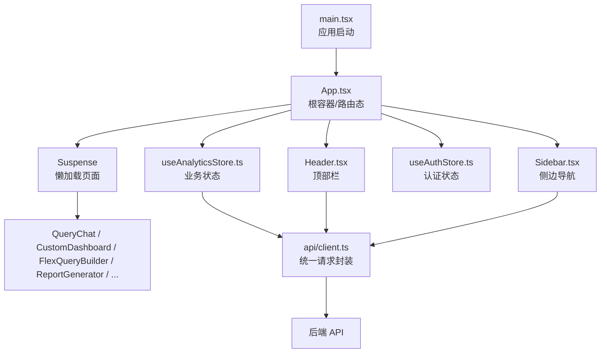
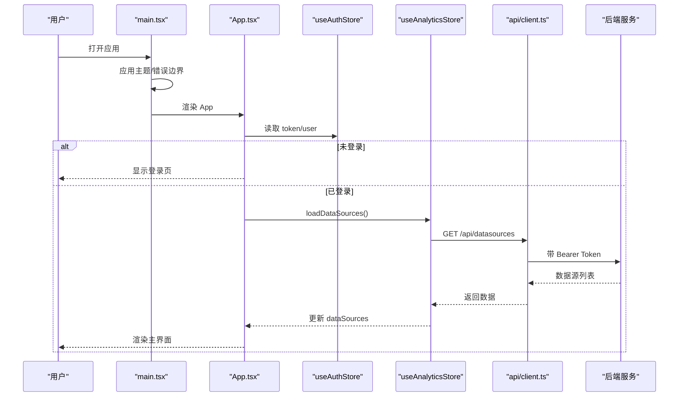
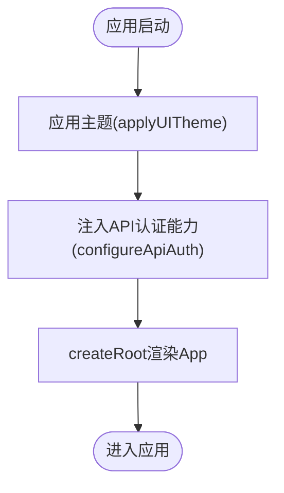
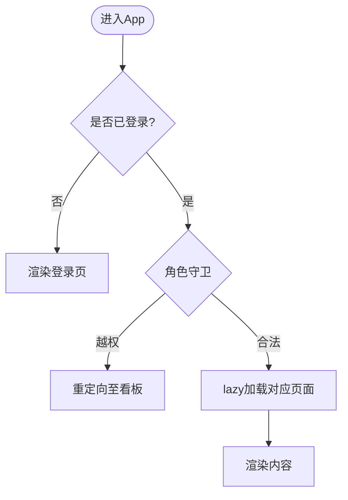
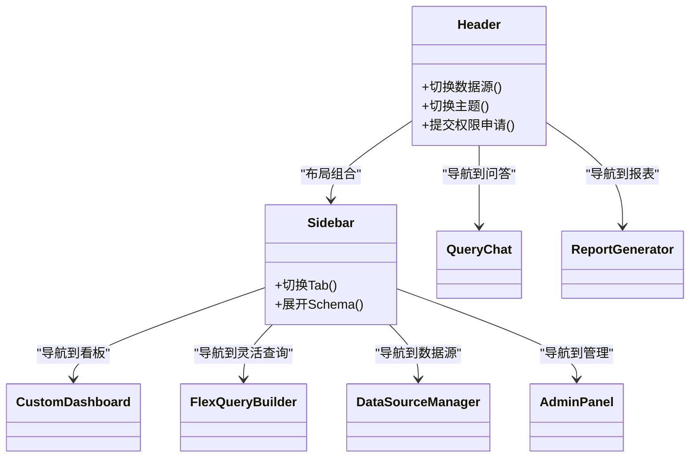
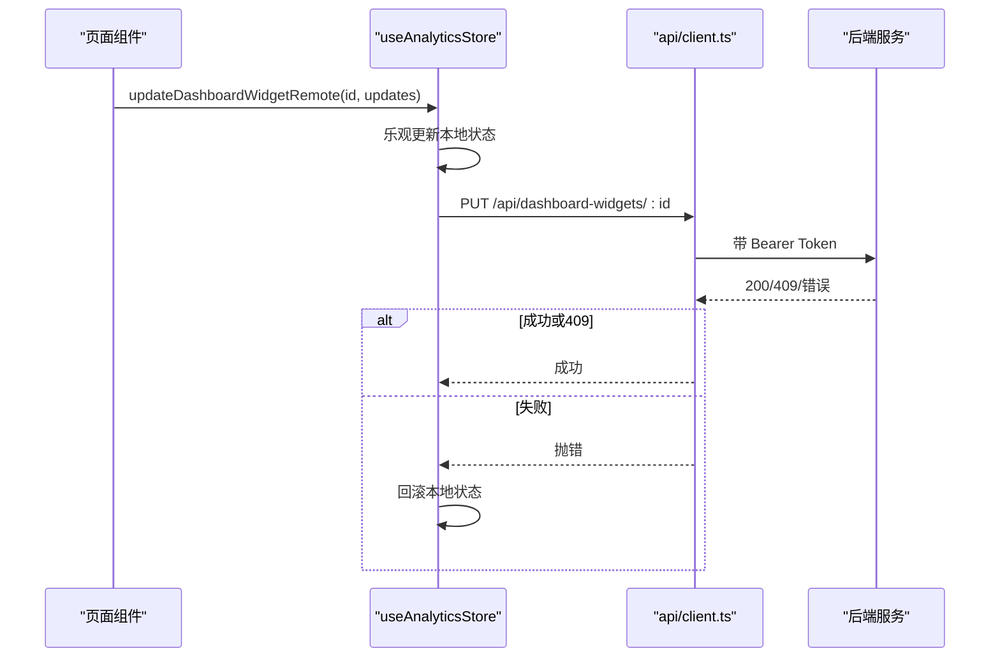
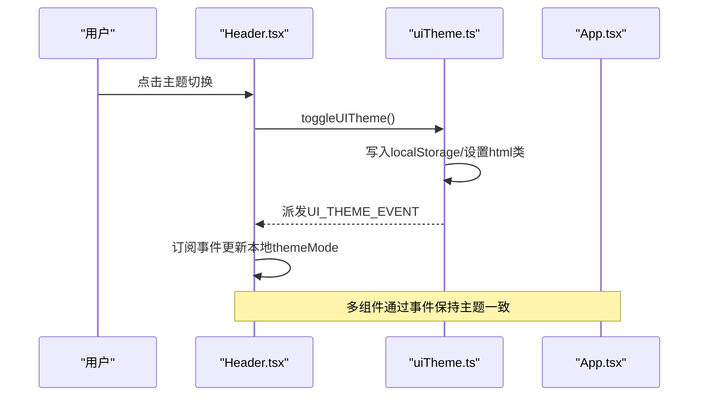
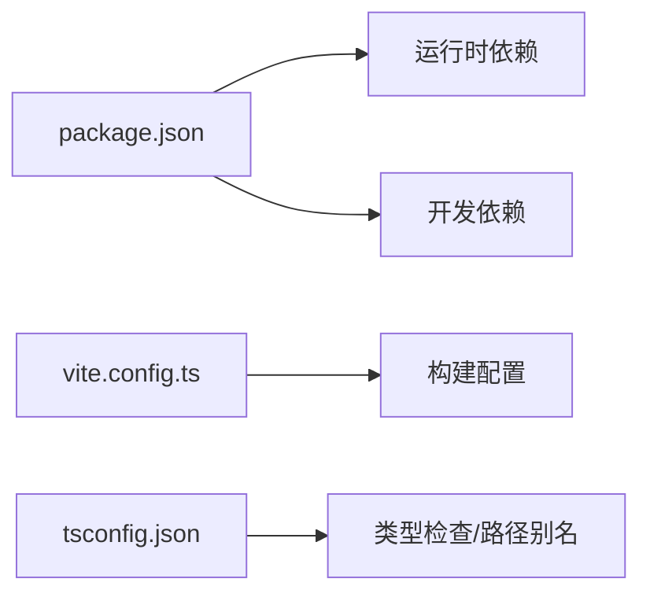

# 应用架构设计

<cite>
**本文引用的文件**
- [src/main.tsx](file://src/main.tsx)
- [src/App.tsx](file://src/App.tsx)
- [vite.config.ts](file://vite.config.ts)
- [package.json](file://package.json)
- [tsconfig.json](file://tsconfig.json)
- [src/hooks/useAuthStore.ts](file://src/hooks/useAuthStore.ts)
- [src/hooks/useAnalyticsStore.ts](file://src/hooks/useAnalyticsStore.ts)
- [src/api/client.ts](file://src/api/client.ts)
- [src/components/Header.tsx](file://src/components/Header.tsx)
- [src/components/Sidebar.tsx](file://src/components/Sidebar.tsx)
- [src/utils/uiTheme.ts](file://src/utils/uiTheme.ts)
</cite>

## 目录
1. [简介](#简介)
2. [项目结构](#项目结构)
3. [核心组件](#核心组件)
4. [架构总览](#架构总览)
5. [详细组件分析](#详细组件分析)
6. [依赖关系分析](#依赖关系分析)
7. [性能与构建优化](#性能与构建优化)
8. [故障排查指南](#故障排查指南)
9. [结论](#结论)
10. [附录](#附录)

## 简介
本文件面向智能问数据分析系统的前端应用，基于 React 19 + TypeScript + Vite 的现代前端架构，系统性说明入口初始化、路由与懒加载策略、组件分层职责、状态管理（Zustand 全局状态 + 本地状态 + 服务端同步）、构建配置优化（代码分割、Tree Shaking、性能监控）以及模块间通信模式与事件驱动机制。文档同时给出架构图、时序图与流程图，帮助读者快速理解并落地实践。

## 项目结构
前端采用“功能域 + 层次化”组织方式：
- 入口层：main.tsx 负责应用启动、主题初始化、API 认证注入与错误边界包裹；App.tsx 作为根容器，承载布局、路由态与懒加载页面。
- 状态层：useAuthStore（认证与会话）、useAnalyticsStore（数据源、对话、看板、报表等全局业务状态）。
- 网络层：api/client.ts 统一封装 fetch，自动注入鉴权头、处理 401/403 错误与强制改密流程。
- 组件层：Header/Sidebar 为通用布局组件；query、reports、datasource、admin 等功能域组件按职责划分。
- 工具层：uiTheme 提供主题切换与事件广播；其他 utils 提供图表、导出、SSE 等能力。
- 构建与类型：vite.config.ts 定义插件、别名、HMR、CSP 等；tsconfig.json 启用严格 TS 与路径别名。

**图示来源**
- [src/main.tsx:1-27](file://src/main.tsx#L1-L27)
- [src/App.tsx:1-104](file://src/App.tsx#L1-L104)
- [src/components/Header.tsx:1-323](file://src/components/Header.tsx#L1-L323)
- [src/components/Sidebar.tsx:1-347](file://src/components/Sidebar.tsx#L1-L347)
- [src/hooks/useAuthStore.ts:1-84](file://src/hooks/useAuthStore.ts#L1-L84)
- [src/hooks/useAnalyticsStore.ts:1-735](file://src/hooks/useAnalyticsStore.ts#L1-L735)
- [src/api/client.ts:1-74](file://src/api/client.ts#L1-L74)

**章节来源**
- [src/main.tsx:1-27](file://src/main.tsx#L1-L27)
- [src/App.tsx:1-104](file://src/App.tsx#L1-L104)
- [vite.config.ts:1-42](file://vite.config.ts#L1-L42)
- [package.json:1-76](file://package.json#L1-L76)
- [tsconfig.json:1-27](file://tsconfig.json#L1-L27)

## 核心组件
- 应用入口 main.tsx
  - 初始化主题、注入 API 认证能力（解耦 auth store），以 ErrorBoundary 包裹 App，使用 StrictMode 渲染。
- 根容器 App.tsx
  - 维护 activeTab 路由态，处理 SSO 回跳登录、登录后加载数据源、角色守卫重定向。
  - 通过 lazy + Suspense 实现页面级懒加载，减少首屏体积。
- 状态管理
  - useAuthStore：登录/登出、SSO 登录、角色判断、强制改密标记，持久化 token/user。
  - useAnalyticsStore：数据源、对话消息、查询结果、看板组件、保存的报表、活跃 Tab、报告中心跳转 ID；提供与服务端一致的增删改查与幂等迁移逻辑。
- 网络层 api/client.ts
  - 统一注入 Authorization 头；401 触发登出；403 且 code 为 PASSWORD_CHANGE_REQUIRED 时触发强制改密；抛出 ApiError 携带 code。

**章节来源**
- [src/main.tsx:10-26](file://src/main.tsx#L10-L26)
- [src/App.tsx:19-104](file://src/App.tsx#L19-L104)
- [src/hooks/useAuthStore.ts:19-84](file://src/hooks/useAuthStore.ts#L19-L84)
- [src/hooks/useAnalyticsStore.ts:181-735](file://src/hooks/useAnalyticsStore.ts#L181-L735)
- [src/api/client.ts:1-74](file://src/api/client.ts#L1-L74)

## 架构总览
整体采用“组合根注入 + 状态集中 + 组件分层 + 懒加载”的模式：
- 组合根（main.tsx）在启动时完成跨模块能力注入（如 API 认证回调），避免循环依赖。
- 路由态由 App 内 activeTab 驱动，配合 lazy 按需加载页面组件。
- 状态集中在 Zustand store，UI 通过 hooks 订阅；服务端状态通过 store 方法发起请求并落库/落盘。
- 组件分层清晰：布局（Header/Sidebar）、页面（QueryChat/ReportGenerator/CustomDashboard/FlexQueryBuilder）、通用（图表、表格、模态框）。

**图示来源**
- [src/main.tsx:10-26](file://src/main.tsx#L10-L26)
- [src/App.tsx:23-42](file://src/App.tsx#L23-L42)
- [src/hooks/useAnalyticsStore.ts:281-304](file://src/hooks/useAnalyticsStore.ts#L281-L304)
- [src/api/client.ts:48-73](file://src/api/client.ts#L48-L73)

## 详细组件分析

### 应用入口与初始化流程
- 主题初始化：main.tsx 调用 applyUITheme(getUITheme())，确保首次渲染前 DOM 类名正确，避免闪烁。
- 会话能力注入：configureApiAuth 将 getToken/onUnauthorized/onMustChangePassword 注入到 api/client，消除循环依赖。
- 错误边界：以 ErrorBoundary 包裹 App，捕获子树渲染异常。
- 渲染：StrictMode + createRoot 挂载 App。

**图示来源**
- [src/main.tsx:10-26](file://src/main.tsx#L10-L26)

**章节来源**
- [src/main.tsx:1-27](file://src/main.tsx#L1-L27)
- [src/utils/uiTheme.ts:14-36](file://src/utils/uiTheme.ts#L14-L36)

### 路由与懒加载策略
- 路由态：App 使用 activeTab 作为路由标识，结合 Sidebar/Header 进行切换。
- 懒加载：对重型页面（CustomDashboard、FlexQueryBuilder、QueryReportCenter）使用 React.lazy + import()，并通过 Suspense 展示加载态。
- 权限守卫：根据 user.role 限制 VIEWER 访问 query/flexquery，非 ADMIN 禁止访问 datasources/admin。
- SSO 回跳：监听 URL sso_token，调用 loginWithToken 完成登录并清理参数。

**图示来源**
- [src/App.tsx:23-82](file://src/App.tsx#L23-L82)

**章节来源**
- [src/App.tsx:13-82](file://src/App.tsx#L13-L82)

### 组件分层架构与职责
- 布局组件
  - Header：品牌、数据源选择、金额单位、主题切换、帮助、用户信息、退出登录、权限申请入口。
  - Sidebar：导航项（按角色过滤）、Schema 查看（管理员可见）、引擎状态指示。
- 页面组件
  - QueryChat：自然语言问答与可视化。
  - CustomDashboard：决策看板（懒加载）。
  - FlexQueryBuilder：灵活查询构建器（懒加载）。
  - ReportGenerator：可视化决策报表生成。
  - DataSourceManager：数据源管理与 Schema 编辑。
  - AdminPanel：系统管理面板。
- 通用组件
  - 图表/表格/KPI 等复用组件位于 components/charts 与 common。
- 依赖关系
  - 页面组件依赖 useAnalyticsStore 获取数据与操作；Header/Sidebar 通过 store 控制导航与上下文。
  - 所有网络请求经 api/client 统一封装，保证鉴权与错误处理一致。

**图示来源**
- [src/components/Header.tsx:38-323](file://src/components/Header.tsx#L38-L323)
- [src/components/Sidebar.tsx:23-347](file://src/components/Sidebar.tsx#L23-L347)
- [src/App.tsx:63-82](file://src/App.tsx#L63-L82)

**章节来源**
- [src/components/Header.tsx:1-323](file://src/components/Header.tsx#L1-L323)
- [src/components/Sidebar.tsx:1-347](file://src/components/Sidebar.tsx#L1-L347)
- [src/App.tsx:63-82](file://src/App.tsx#L63-L82)

### 状态管理架构
- 全局状态（Zustand）
  - useAuthStore：token、user、登录/登出、SSO 登录、角色判断、强制改密标记；持久化 name: 'auth-store'。
  - useAnalyticsStore：dataSources、chatMessages、dashboardWidgets、savedReports、activeTab、pendingReportId 等；提供与服务端一致的 CRUD 与幂等迁移；持久化 name: 'analytics-store'，version 6，partialize 控制持久化字段。
- 组件本地状态
  - 用于 UI 交互（如弹窗开关、折叠态、表单输入），不跨组件共享。
- 服务端状态同步
  - 通过 apiFetch 统一发起请求；store 方法负责乐观更新或回滚、冲突处理（如 409 视为成功）、降级策略（如 PUT 404 转 POST）。
  - 会话内防重入：initSavedReports/initDashboardWidgets 使用 Promise 缓存，避免重复初始化。

**图示来源**
- [src/hooks/useAnalyticsStore.ts:455-483](file://src/hooks/useAnalyticsStore.ts#L455-L483)
- [src/api/client.ts:48-73](file://src/api/client.ts#L48-L73)

**章节来源**
- [src/hooks/useAuthStore.ts:19-84](file://src/hooks/useAuthStore.ts#L19-L84)
- [src/hooks/useAnalyticsStore.ts:181-735](file://src/hooks/useAnalyticsStore.ts#L181-L735)
- [src/api/client.ts:1-74](file://src/api/client.ts#L1-L74)

### 模块间通信与事件驱动
- 主题事件：uiTheme.ts 暴露 UI_THEME_EVENT，Header 订阅该事件以保持主题状态一致；applyUITheme 派发事件。
- 跨 store 解耦：main.tsx 通过 configureApiAuth 注入认证能力，api/client 不再直接依赖 useAuthStore，避免循环依赖。
- 导航与上下文：Header/Sidebar 通过 useAnalyticsStore 的 setActiveTab 与数据源上下文联动，实现跨组件协作。

**图示来源**
- [src/utils/uiTheme.ts:22-36](file://src/utils/uiTheme.ts#L22-L36)
- [src/components/Header.tsx:86-92](file://src/components/Header.tsx#L86-L92)

**章节来源**
- [src/utils/uiTheme.ts:1-37](file://src/utils/uiTheme.ts#L1-L37)
- [src/components/Header.tsx:86-92](file://src/components/Header.tsx#L86-L92)
- [src/main.tsx:13-18](file://src/main.tsx#L13-L18)

## 依赖关系分析
- 运行时依赖
  - React 19、react-dom 19、Zustand 5、Recharts 3、Lucide React 图标库等。
- 开发依赖
  - Vite 6、@vitejs/plugin-react、Tailwind CSS v4、TypeScript 5.8、Vitest、Playwright、ESLint 等。
- 构建产物
  - 前端静态资源由 Vite 构建；服务端打包为 dist/server.cjs（esbuild 打包 Node 入口）。

**图示来源**
- [package.json:26-74](file://package.json#L26-L74)
- [vite.config.ts:1-42](file://vite.config.ts#L1-L42)
- [tsconfig.json:1-27](file://tsconfig.json#L1-L27)

**章节来源**
- [package.json:1-76](file://package.json#L1-L76)
- [vite.config.ts:1-42](file://vite.config.ts#L1-L42)
- [tsconfig.json:1-27](file://tsconfig.json#L1-L27)

## 性能与构建优化
- 代码分割与懒加载
  - 页面级懒加载：CustomDashboard、FlexQueryBuilder、QueryReportCenter 使用 React.lazy + import()，显著降低首屏包体。
  - Suspense 提供加载占位，提升用户体验。
- Tree Shaking
  - 使用 ESNext 模块与 Vite 构建，天然支持 Tree Shaking；仅引入所需图标与组件，减少冗余。
- 版本常量注入
  - vite.config.ts 通过 define 注入 import.meta.env.VITE_APP_VERSION，便于前端展示版本号。
- 开发体验
  - HMR 可配置开关（DISABLE_HMR），在 AI Studio 场景下禁用以避免闪烁；watch 行为随环境变量调整。
- 性能监控建议
  - 可在生产环境接入浏览器性能指标采集（如 Performance Observer、上报自定义指标），结合 Grafana/Prometheus 进行可视化监控。
- 构建脚本
  - build 命令先执行 Vite 构建前端，再使用 esbuild 打包 server.ts 为 Node CommonJS 产物。

**章节来源**
- [src/App.tsx:13-18](file://src/App.tsx#L13-L18)
- [vite.config.ts:7-18](file://vite.config.ts#L7-L18)
- [vite.config.ts:25-35](file://vite.config.ts#L25-L35)
- [package.json:6-24](file://package.json#L6-L24)

## 故障排查指南
- 401 未授权
  - api/client 收到 401 会调用 onUnauthorized 清空会话并抛出 ApiError(code=UNAUTHORIZED)，App 将回到登录页。
- 403 强制改密
  - 当响应 body.code 为 PASSWORD_CHANGE_REQUIRED，api/client 调用 onMustChangePassword，App 渲染 ForceChangePassword。
- 数据源权限不足
  - Header 中列出 deniedSources，并提供权限申请入口；提交后等待管理员审批。
- 看板/报表同步失败
  - store 方法包含乐观更新与回滚逻辑；409 冲突视为成功；PUT 404 降级为 POST 补建；失败时恢复本地状态并提示。
- 主题闪烁
  - main.tsx 在渲染前应用主题；index.html 内联脚本也应用主题，双重保障避免闪烁。

**章节来源**
- [src/api/client.ts:58-70](file://src/api/client.ts#L58-L70)
- [src/App.tsx:23-35](file://src/App.tsx#L23-L35)
- [src/components/Header.tsx:54-82](file://src/components/Header.tsx#L54-L82)
- [src/hooks/useAnalyticsStore.ts:421-483](file://src/hooks/useAnalyticsStore.ts#L421-L483)
- [src/utils/uiTheme.ts:22-30](file://src/utils/uiTheme.ts#L22-L30)

## 结论
本前端架构以 React 19 + TypeScript + Vite 为基础，通过组合根注入、Zustand 全局状态、页面级懒加载与统一网络层，实现了高内聚、低耦合、可扩展的企业级数据分析应用。其关键优势包括：
- 清晰的组件分层与职责边界，便于团队协作与维护。
- 强大的状态管理能力，兼顾本地交互与服务端一致性。
- 完善的错误处理与权限控制，保障用户体验与安全。
- 构建期优化与可观测性基础，支撑大规模应用的性能与稳定性。

## 附录
- 技术选型权衡
  - React 19：最新特性与性能优化，生态成熟。
  - Zustand：轻量、无样板代码、易于集成与测试。
  - Vite：极速开发与构建，良好的插件生态。
  - Tailwind CSS v4：原子化样式，提高开发效率与一致性。
- 扩展建议
  - 增加单元测试与端到端测试覆盖率（Vitest + Playwright）。
  - 接入前端性能监控与错误上报（Sentry/自研埋点）。
  - 探索微前端拆分（如独立报表模块），进一步提升可维护性与加载性能。