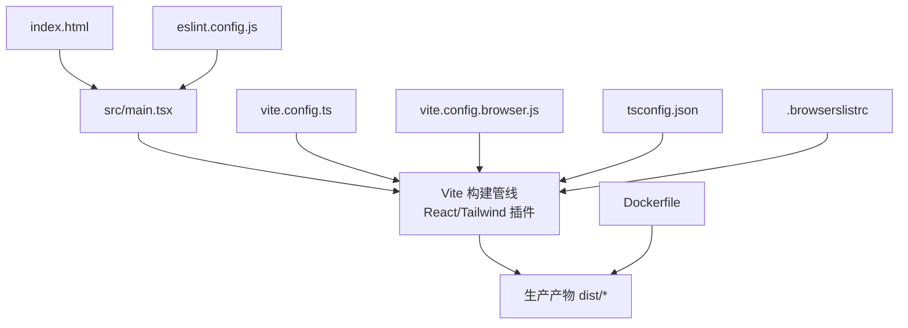
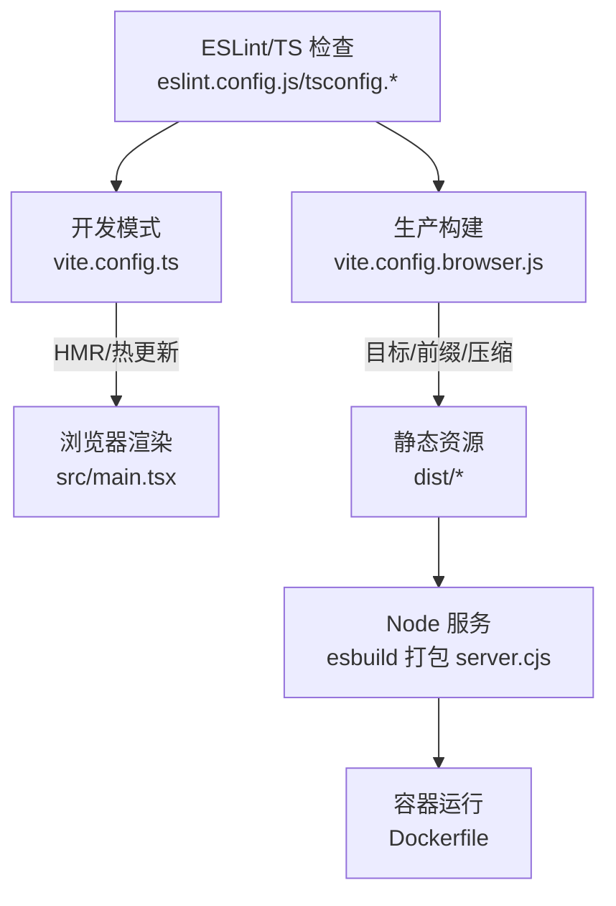
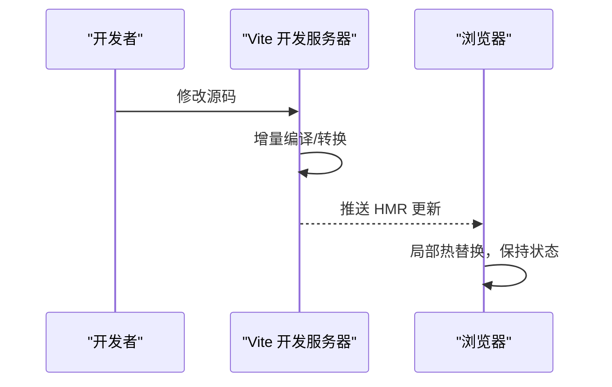
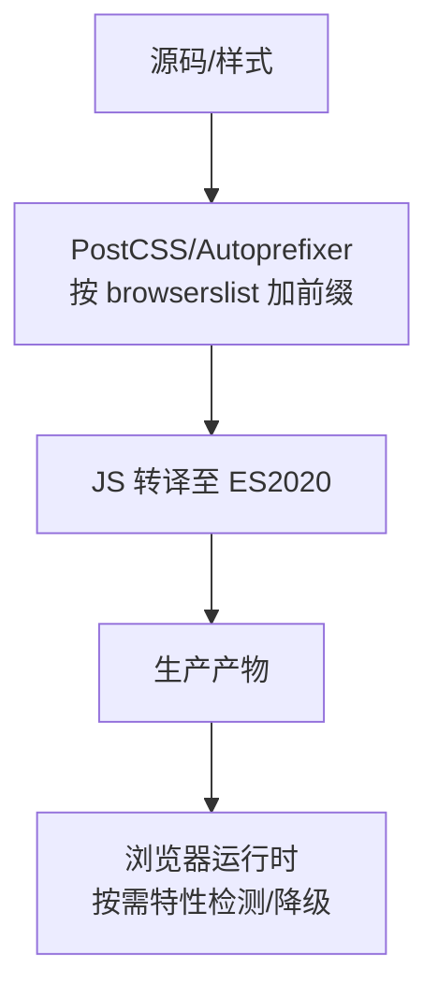
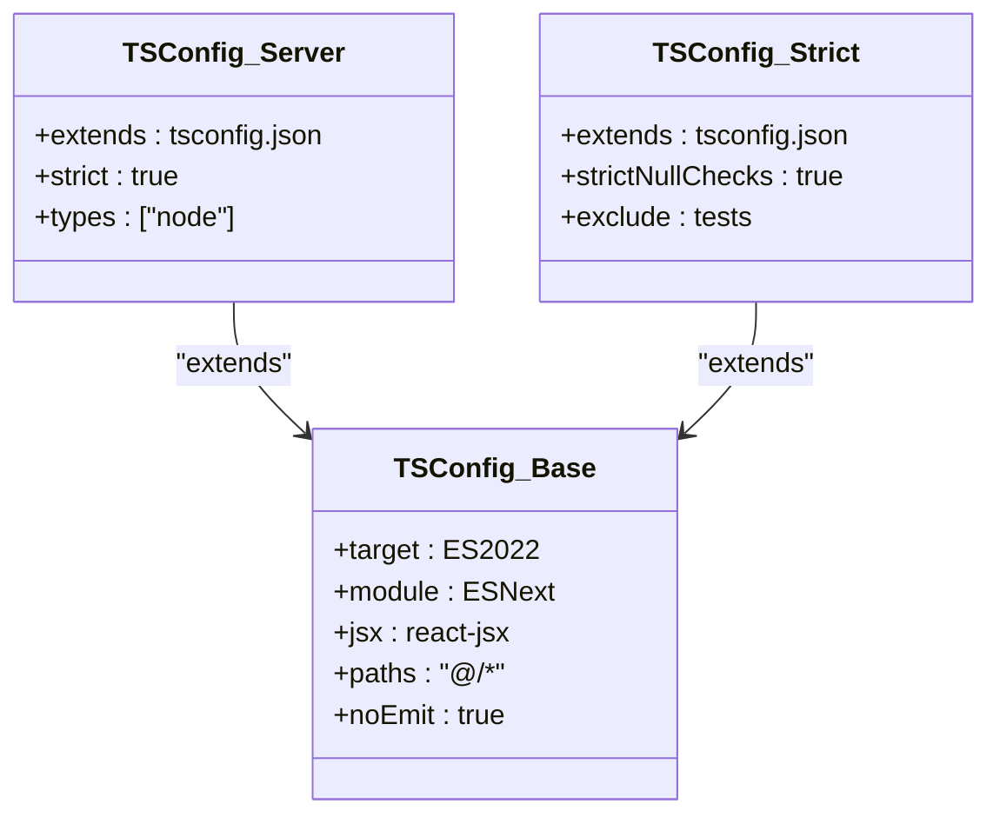
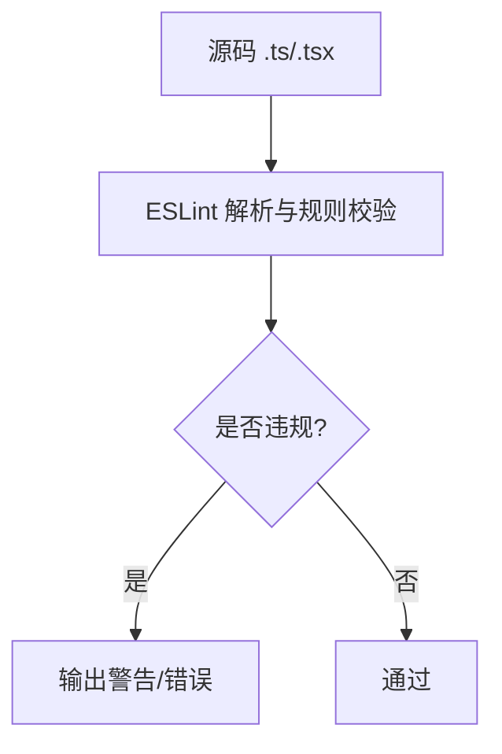
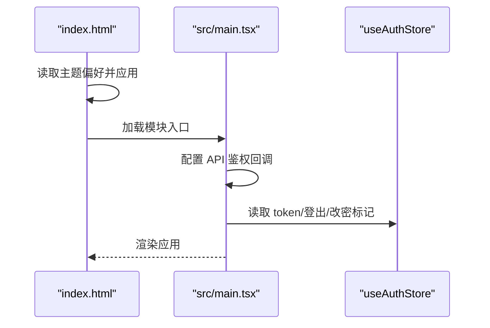
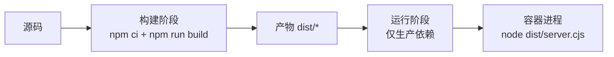
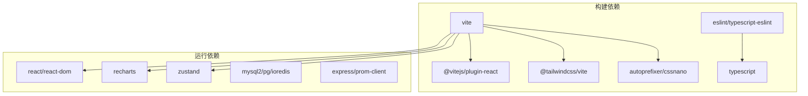

# 构建与优化

<cite>
**本文引用的文件**
- [vite.config.ts](file://vite.config.ts)
- [vite.config.browser.js](file://vite.config.browser.js)
- [tsconfig.json](file://tsconfig.json)
- [tsconfig.server.json](file://tsconfig.server.json)
- [tsconfig.strict.json](file://tsconfig.strict.json)
- [eslint.config.js](file://eslint.config.js)
- [package.json](file://package.json)
- [.browserslistrc](file://.browserslistrc)
- [BROWSER_COMPATIBILITY.md](file://BROWSER_COMPATIBILITY.md)
- [src/main.tsx](file://src/main.tsx)
- [index.html](file://index.html)
- [playwright.config.ts](file://playwright.config.ts)
- [Dockerfile](file://Dockerfile)
</cite>

## 目录
1. [简介](#简介)
2. [项目结构](#项目结构)
3. [核心组件](#核心组件)
4. [架构总览](#架构总览)
5. [详细组件分析](#详细组件分析)
6. [依赖关系分析](#依赖关系分析)
7. [性能考量](#性能考量)
8. [故障排查指南](#故障排查指南)
9. [结论](#结论)
10. [附录](#附录)

## 简介
本文件面向“智能问数据分析系统”的前端构建与优化，系统性说明基于 Vite 的现代化构建配置、生产环境优化策略、代码分割与懒加载、缓存策略、TypeScript 编译与严格模式、ESLint 规范与安全规则、浏览器兼容性（Polyfill/特性检测/降级）、以及构建性能分析与部署优化建议。目标是帮助开发者在本地开发、持续集成与生产部署中保持一致的高质量产出与稳定运行体验。

## 项目结构
本项目采用前后端同仓组织：前端以 Vite + React + TailwindCSS 为主，服务端使用 Node/Express；构建产物由 Vite 生成静态资源，服务端通过 esbuild 打包为单文件供容器运行。关键入口与配置文件如下：
- 应用入口：index.html 引入模块脚本 src/main.tsx
- 前端构建：vite.config.ts（默认开发/测试）与 vite.config.browser.js（浏览器兼容增强）
- TypeScript：tsconfig.json（基础），tsconfig.server.json（服务端严格），tsconfig.strict.json（前端严格）
- 代码质量：eslint.config.js
- 包管理与脚本：package.json
- 浏览器兼容性：.browserslistrc 与 BROWSER_COMPATIBILITY.md
- E2E 测试：playwright.config.ts
- 容器化：Dockerfile（多阶段构建）

图表来源
- [index.html:1-22](file://index.html#L1-L22)
- [src/main.tsx:1-27](file://src/main.tsx#L1-L27)
- [vite.config.ts:1-42](file://vite.config.ts#L1-L42)
- [vite.config.browser.js:1-109](file://vite.config.browser.js#L1-L109)
- [tsconfig.json:1-27](file://tsconfig.json#L1-L27)
- [eslint.config.js:1-38](file://eslint.config.js#L1-L38)
- [.browserslistrc:1-17](file://.browserslistrc#L1-L17)
- [Dockerfile:1-47](file://Dockerfile#L1-L47)

章节来源
- [index.html:1-22](file://index.html#L1-L22)
- [src/main.tsx:1-27](file://src/main.tsx#L1-L27)
- [vite.config.ts:1-42](file://vite.config.ts#L1-L42)
- [vite.config.browser.js:1-109](file://vite.config.browser.js#L1-L109)
- [tsconfig.json:1-27](file://tsconfig.json#L1-L27)
- [eslint.config.js:1-38](file://eslint.config.js#L1-L38)
- [.browserslistrc:1-17](file://.browserslistrc#L1-L17)
- [Dockerfile:1-47](file://Dockerfile#L1-L47)

## 核心组件
- 构建与开发服务器
  - 默认配置：vite.config.ts 提供 React/Tailwind 插件、别名、HMR 开关、CSP 头、Vitest 排除项等
  - 浏览器兼容增强：vite.config.browser.js 提供 CSS/JS 目标、PostCSS 前缀、手动分包、压缩与更严格的 CSP
- TypeScript 编译
  - 基础：tsconfig.json（ES2022 target、ESNext module、bundler 解析、React JSX、路径别名、noEmit）
  - 服务端严格：tsconfig.server.json（继承并启用 strict、限定 types）
  - 前端严格：tsconfig.strict.json（继承并启用 strictNullChecks，排除测试文件）
- 代码规范与安全
  - ESLint：基于 @eslint/js + typescript-eslint，启用 React Hooks 与 React Refresh 插件，设置 no-explicit-any、unused-vars、react-hooks 渐进式 warn 规则
- 浏览器兼容性
  - .browserslistrc 定义目标浏览器范围
  - BROWSER_COMPATIBILITY.md 说明前缀处理、转译目标、CSP 增强与已知限制
- 应用启动与主题初始化
  - index.html 内联脚本避免主题闪烁
  - src/main.tsx 使用 StrictMode、ErrorBoundary、注入 API 鉴权能力

章节来源
- [vite.config.ts:1-42](file://vite.config.ts#L1-L42)
- [vite.config.browser.js:1-109](file://vite.config.browser.js#L1-L109)
- [tsconfig.json:1-27](file://tsconfig.json#L1-L27)
- [tsconfig.server.json:1-9](file://tsconfig.server.json#L1-L9)
- [tsconfig.strict.json:1-9](file://tsconfig.strict.json#L1-L9)
- [eslint.config.js:1-38](file://eslint.config.js#L1-L38)
- [.browserslistrc:1-17](file://.browserslistrc#L1-L17)
- [BROWSER_COMPATIBILITY.md:1-123](file://BROWSER_COMPATIBILITY.md#L1-L123)
- [index.html:1-22](file://index.html#L1-L22)
- [src/main.tsx:1-27](file://src/main.tsx#L1-L27)

## 架构总览
下图展示了从源码到生产产物的构建流程，以及开发与生产的关键差异点。

图表来源
- [vite.config.ts:1-42](file://vite.config.ts#L1-L42)
- [vite.config.browser.js:1-109](file://vite.config.browser.js#L1-L109)
- [src/main.tsx:1-27](file://src/main.tsx#L1-L27)
- [eslint.config.js:1-38](file://eslint.config.js#L1-L38)
- [tsconfig.json:1-27](file://tsconfig.json#L1-L27)
- [Dockerfile:1-47](file://Dockerfile#L1-L47)

## 详细组件分析

### 构建系统与开发服务器（Vite）
- 开发服务器
  - HMR 可通过环境变量关闭，避免在特定场景下频繁刷新导致闪烁
  - 监听行为可随 HMR 开关切换，节省 CPU
  - 开发模式下设置 CSP 头，允许必要的内联脚本与 WebSocket 通信
- 生产构建
  - 目标语言与 CSS 目标：将 JS 转译为 ES2020+，CSS 针对主流现代浏览器
  - 代码分割：通过 manualChunks 将 React、图表库、工具库拆分为独立 vendor 包，提升缓存命中与并行加载
  - CSS 压缩：生产环境启用 cssnano，移除注释并最小化
  - PostCSS：autoprefixer 依据 browserslist 自动添加必要前缀，支持 Grid 等布局
  - 警告阈值：chunkSizeWarningLimit 控制大包告警
- 版本常量注入
  - 通过 define 将 package.json 中的版本号注入到 import.meta.env.VITE_APP_VERSION，保证单一事实源

图表来源
- [vite.config.ts:25-35](file://vite.config.ts#L25-L35)
- [vite.config.browser.js:65-102](file://vite.config.browser.js#L65-L102)

章节来源
- [vite.config.ts:1-42](file://vite.config.ts#L1-L42)
- [vite.config.browser.js:1-109](file://vite.config.browser.js#L1-L109)

### 浏览器兼容性（Polyfill/特性检测/降级）
- 目标浏览器范围：Chrome/Edge ≥91、Firefox ≥89、Safari ≥14；360 极速模式基于 Chromium，已覆盖
- JavaScript：构建目标 ES2020，利用现代语法与 API，减少 polyfill 体积
- CSS：通过 autoprefixer 与 tailwindcss-v4 自动添加前缀，确保 Grid、Flexbox 等特性在各浏览器正确渲染
- CSP 安全头：生产环境启用更严格的 CSP，限制脚本/样式/媒体/连接来源，禁止 object-src，限制 frame-ancestors
- 已知限制与降级：文档列出未使用功能的潜在限制及替代方案，当前代码库未受影响

图表来源
- [.browserslistrc:1-17](file://.browserslistrc#L1-L17)
- [vite.config.browser.js:84-102](file://vite.config.browser.js#L84-L102)
- [BROWSER_COMPATIBILITY.md:1-123](file://BROWSER_COMPATIBILITY.md#L1-L123)

章节来源
- [.browserslistrc:1-17](file://.browserslistrc#L1-L17)
- [vite.config.browser.js:65-102](file://vite.config.browser.js#L65-L102)
- [BROWSER_COMPATIBILITY.md:1-123](file://BROWSER_COMPATIBILITY.md#L1-L123)

### TypeScript 编译配置（严格模式/类型检查/选项优化）
- 基础配置（tsconfig.json）
  - target: ES2022，lib: ES2022/DOM/DOM.Iterable
  - module: ESNext，moduleResolution: bundler，isolatedModules: true，moduleDetection: force
  - jsx: react-jsx，allowImportingTsExtensions: true，noEmit: true（仅类型检查）
  - paths: @/* 映射根目录，便于统一导入
- 服务端严格（tsconfig.server.json）
  - 继承基础配置并启用 strict，限定 types 为 node
- 前端严格（tsconfig.strict.json）
  - 继承基础配置并启用 strictNullChecks，排除测试文件
- 构建脚本
  - lint: tsc --noEmit
  - lint:server: 针对 server 目录单独检查
  - lint:strict: 对 src 启用严格空值检查

图表来源
- [tsconfig.json:1-27](file://tsconfig.json#L1-L27)
- [tsconfig.server.json:1-9](file://tsconfig.server.json#L1-L9)
- [tsconfig.strict.json:1-9](file://tsconfig.strict.json#L1-L9)

章节来源
- [tsconfig.json:1-27](file://tsconfig.json#L1-L27)
- [tsconfig.server.json:1-9](file://tsconfig.server.json#L1-L9)
- [tsconfig.strict.json:1-9](file://tsconfig.strict.json#L1-L9)
- [package.json:6-24](file://package.json#L6-L24)

### ESLint 代码规范（风格/安全/最佳实践）
- 扩展与插件
  - 基于 @eslint/js 与 typescript-eslint 推荐规则
  - 启用 react-hooks 与 react-refresh 插件
- 规则策略
  - no-explicit-any: warn（渐进改进）
  - no-unused-vars: warn（忽略下划线前缀参数）
  - react-hooks 相关规则：set-state-in-effect、purity、refs、immutability 设为 warn，作为渐进提示，不阻塞门禁
  - 自定义 preserve-caught-error: warn
- 作用域
  - 忽略 dist、node_modules、plugins、assets
  - 仅对 .ts/.tsx 生效

图表来源
- [eslint.config.js:1-38](file://eslint.config.js#L1-L38)

章节来源
- [eslint.config.js:1-38](file://eslint.config.js#L1-L38)

### 应用启动与主题初始化
- index.html 在渲染前读取本地存储的主题偏好，避免首次渲染闪烁
- src/main.tsx 使用 React StrictMode 与 ErrorBoundary 包裹应用，并在入口处注入 API 鉴权能力（获取 token、处理未授权与强制改密）

图表来源
- [index.html:10-18](file://index.html#L10-L18)
- [src/main.tsx:10-26](file://src/main.tsx#L10-L26)

章节来源
- [index.html:1-22](file://index.html#L1-L22)
- [src/main.tsx:1-27](file://src/main.tsx#L1-L27)

### 端到端测试与调试
- Playwright E2E 配置
  - 复用已有服务或自动拉起 server.ts
  - 超时、重试、截图与追踪策略
  - 优先使用系统 Chrome 驱动，避免 CDN 下载
- 调试技巧
  - 开发时结合浏览器 DevTools 与 Vite HMR
  - 通过 playwright trace 定位问题

章节来源
- [playwright.config.ts:1-39](file://playwright.config.ts#L1-L39)

### 容器化与部署
- 多阶段构建
  - 构建阶段：安装全部依赖，执行 npm run build（Vite 前端 + esbuild 服务端打包）
  - 运行阶段：仅安装生产依赖，拷贝 dist，非 root 用户运行，暴露端口与健康检查
- 环境变量
  - NODE_ENV=production，HOST=0.0.0.0，PORT=3000
  - 健康检查通过 /api/health 探活

图表来源
- [Dockerfile:18-47](file://Dockerfile#L18-L47)
- [package.json:6-24](file://package.json#L6-L24)

章节来源
- [Dockerfile:1-47](file://Dockerfile#L1-L47)
- [package.json:6-24](file://package.json#L6-L24)

## 依赖关系分析
- 构建期依赖
  - Vite、@vitejs/plugin-react、@tailwindcss/vite、autoprefixer、cssnano
  - TypeScript、typescript-eslint、eslint、globals
  - Vitest、Playwright（测试）
- 运行期依赖
  - React、Recharts、Zustand、date-fns 等
  - Express、ioredis、mysql2、pg、prom-client 等（服务端）
- 构建脚本
  - dev: tsx server.ts
  - build: vite build && esbuild 打包服务端
  - start: node dist/server.cjs
  - lint/lint:server/lint:strict/lint:js/test/test:e2e

图表来源
- [package.json:26-74](file://package.json#L26-L74)

章节来源
- [package.json:6-24](file://package.json#L6-L24)
- [package.json:26-74](file://package.json#L26-L74)

## 性能考量
- Bundle 大小优化
  - 手动分包：将 React、图表库、工具库拆分 vendor 包，提高缓存命中率与并行加载效率
  - CSS 压缩：生产环境启用 cssnano，移除注释并最小化
  - 目标语言：JS 转译为 ES2020+，减少 polyfill 体积
- 懒加载与路由级分割
  - 建议在业务路由中使用动态 import() 实现页面级懒加载，进一步降低首屏体积
- 缓存策略
  - 静态资源文件名含哈希，配合浏览器长缓存；CDN 可开启强缓存与协商缓存
  - 合理设置 Cache-Control，区分 HTML（短缓存/协商）与静态资源（长缓存）
- 构建性能
  - 使用并行构建与增量编译；CI 中缓存 node_modules 与构建缓存
  - 通过 chunkSizeWarningLimit 监控大包风险
- 运行时性能
  - 合理使用 Zustand 管理状态，避免过度重渲染
  - 图表数据分页/节流，减少 DOM 操作频率

[本节为通用指导，不直接分析具体文件]

## 故障排查指南
- 构建失败
  - 检查 TypeScript 类型错误：tsc --noEmit 与 lint:strict
  - 检查 ESLint 规则：lint:js，关注 warn/error 提示
- 运行时异常
  - 使用 ErrorBoundary 捕获渲染错误，查看控制台日志
  - 通过 Playwright trace/screenshot 复现与定位问题
- 浏览器兼容问题
  - 确认 browserslist 与 PostCSS 前缀是否正确生成
  - 检查 CSP 头是否阻止了必要资源加载
- 容器健康检查失败
  - 确认 /api/health 可达，检查环境变量与依赖服务连通性

章节来源
- [eslint.config.js:1-38](file://eslint.config.js#L1-L38)
- [tsconfig.json:1-27](file://tsconfig.json#L1-L27)
- [tsconfig.strict.json:1-9](file://tsconfig.strict.json#L1-L9)
- [playwright.config.ts:1-39](file://playwright.config.ts#L1-L39)
- [vite.config.browser.js:44-63](file://vite.config.browser.js#L44-L63)
- [Dockerfile:43-44](file://Dockerfile#L43-L44)

## 结论
本项目基于 Vite 构建了现代化的前端工程体系，结合 TypeScript 严格模式与 ESLint 规范，保证了代码质量与可维护性；通过浏览器兼容性配置与 CSP 安全头，兼顾了用户体验与安全；在生产构建中实现了代码分割、CSS/JS 优化与容器化部署。建议在业务层继续推进路由级懒加载与性能监控，持续优化首屏与交互体验。

## 附录
- 常用命令
  - 开发：npm run dev
  - 构建：npm run build
  - 启动：npm start
  - 类型检查：npm run lint / lint:server / lint:strict
  - 代码规范：npm run lint:js
  - 单元测试：npm test
  - E2E：npm run test:e2e
- 参考文档
  - 浏览器兼容性说明见 BROWSER_COMPATIBILITY.md

[本节为补充信息，不直接分析具体文件]