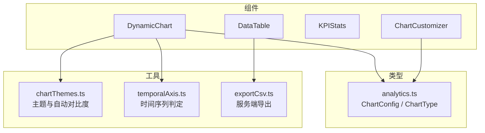
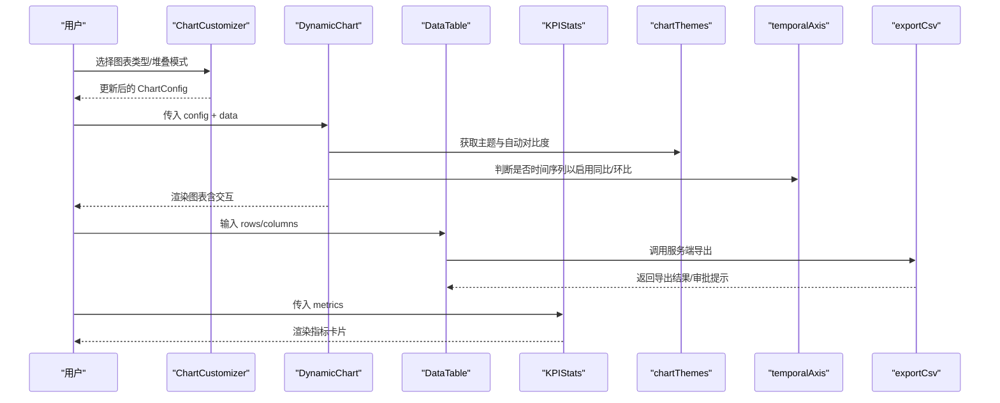
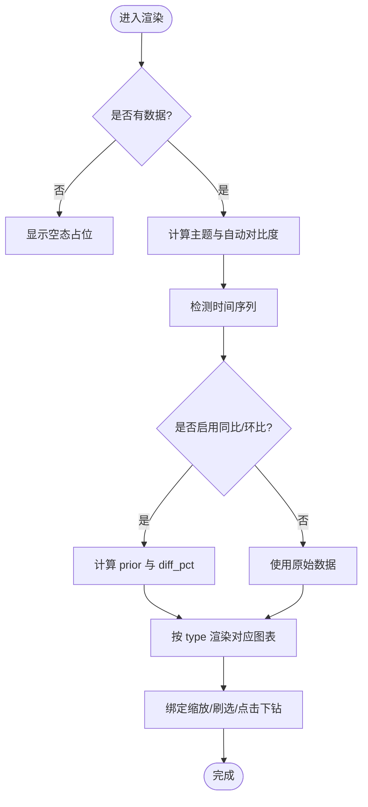
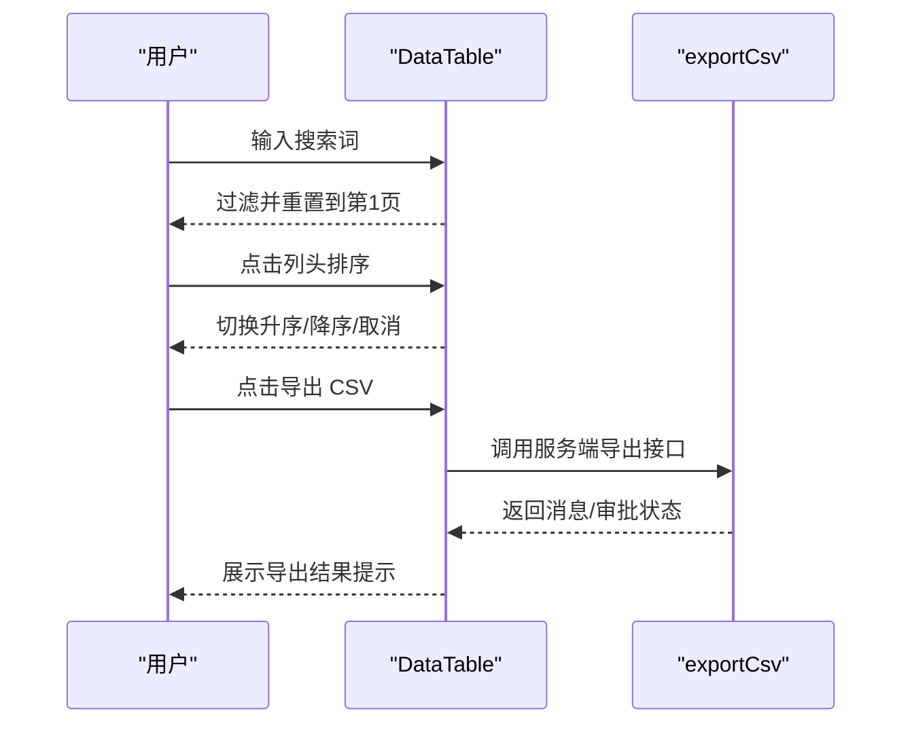
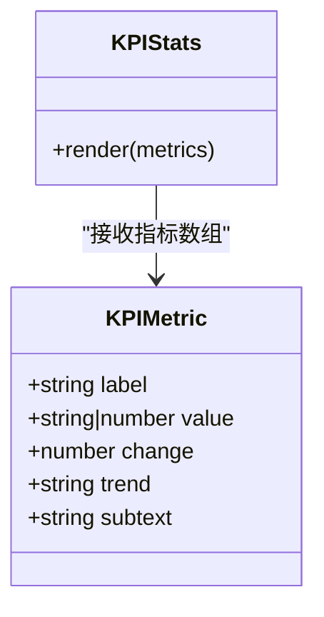
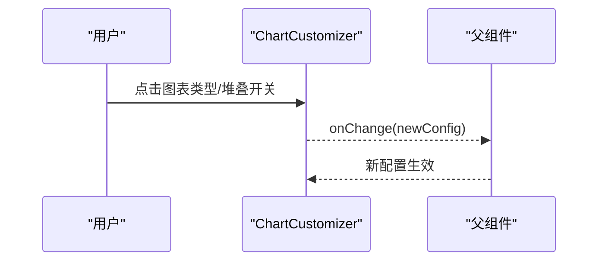
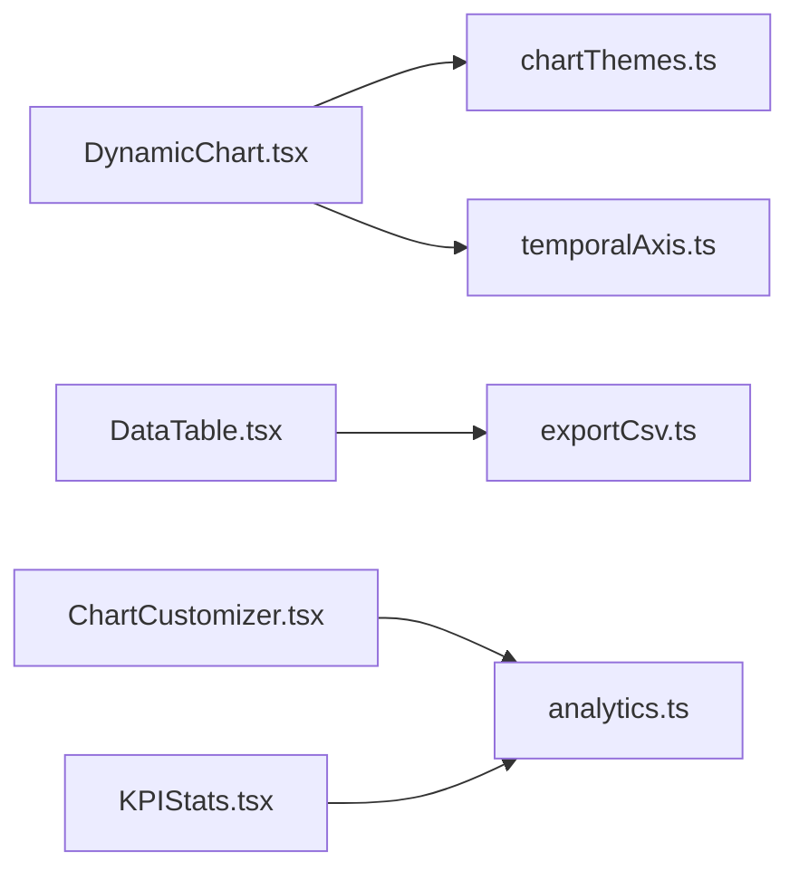

# 图表组件库

<cite>
**本文引用的文件**
- [DynamicChart.tsx](file://src/components/charts/DynamicChart.tsx)
- [DataTable.tsx](file://src/components/charts/DataTable.tsx)
- [KPIStats.tsx](file://src/components/charts/KPIStats.tsx)
- [ChartCustomizer.tsx](file://src/components/charts/ChartCustomizer.tsx)
- [analytics.ts](file://src/types/analytics.ts)
- [chartThemes.ts](file://src/utils/chartThemes.ts)
- [temporalAxis.ts](file://src/utils/temporalAxis.ts)
- [exportCsv.ts](file://src/utils/exportCsv.ts)
- [DataTable.test.tsx](file://src/components/charts/DataTable.test.tsx)
- [KPIStats.test.tsx](file://src/components/charts/KPIStats.test.tsx)
</cite>

## 目录
1. [简介](#简介)
2. [项目结构](#项目结构)
3. [核心组件](#核心组件)
4. [架构总览](#架构总览)
5. [详细组件分析](#详细组件分析)
6. [依赖关系分析](#依赖关系分析)
7. [性能考量](#性能考量)
8. [故障排查指南](#故障排查指南)
9. [结论](#结论)
10. [附录：使用与扩展](#附录：使用与扩展)

## 简介
本组件库提供一套面向数据分析场景的前端可视化能力，包含动态图表渲染、数据表格展示、关键指标卡片以及图表定制器。其设计目标包括：
- 统一的数据驱动渲染：通过配置化描述图表类型、维度与指标，实现多种图表类型的动态切换与渲染。
- 丰富的交互能力：支持缩放、刷选、主题切换、同环比对比、点击下钻等。
- 可访问性与可读性：内置多套配色主题、自动对比度优化、打印友好与色盲无障碍主题。
- 响应式布局：在不同屏幕尺寸下保持良好的显示效果。
- 安全导出：统一走服务端通道进行 CSV 导出，支持水印与审批流提示。

## 项目结构
图表相关代码集中在 src/components/charts 目录下，配合 types 与 utils 中的类型定义与工具函数，形成“组件 + 类型 + 工具”的清晰分层：
- 组件层：DynamicChart、DataTable、KPIStats、ChartCustomizer
- 类型层：ChartConfig、ChartType、QueryResultData 等
- 工具层：主题与配色、时间轴判定、CSV 导出

**图示来源**
- [DynamicChart.tsx:15-60](file://src/components/charts/DynamicChart.tsx#L15-L60)
- [DataTable.tsx:1-20](file://src/components/charts/DataTable.tsx#L1-L20)
- [KPIStats.tsx:1-15](file://src/components/charts/KPIStats.tsx#L1-L15)
- [ChartCustomizer.tsx:1-16](file://src/components/charts/ChartCustomizer.tsx#L1-L16)
- [analytics.ts:141-154](file://src/types/analytics.ts#L141-L154)
- [chartThemes.ts:1-13](file://src/utils/chartThemes.ts#L1-L13)
- [temporalAxis.ts:1-12](file://src/utils/temporalAxis.ts#L1-L12)
- [exportCsv.ts:1-8](file://src/utils/exportCsv.ts#L1-L8)

**章节来源**
- [DynamicChart.tsx:1-120](file://src/components/charts/DynamicChart.tsx#L1-L120)
- [DataTable.tsx:1-40](file://src/components/charts/DataTable.tsx#L1-L40)
- [KPIStats.tsx:1-20](file://src/components/charts/KPIStats.tsx#L1-L20)
- [ChartCustomizer.tsx:1-20](file://src/components/charts/ChartCustomizer.tsx#L1-L20)
- [analytics.ts:141-154](file://src/types/analytics.ts#L141-L154)
- [chartThemes.ts:1-64](file://src/utils/chartThemes.ts#L1-L64)
- [temporalAxis.ts:1-77](file://src/utils/temporalAxis.ts#L1-L77)
- [exportCsv.ts:1-59](file://src/utils/exportCsv.ts#L1-L59)

## 核心组件
- DynamicChart：基于 recharts 的动态图表渲染器，支持柱状、折线、面积、饼/环、雷达、散点、树图、热力图等；具备缩放、刷选、主题切换、同环比对比、差异徽标、点击下钻等能力。
- DataTable：明细数据表格，支持搜索过滤、列排序、分页、数值格式化与服务端 CSV 导出。
- KPIStats：关键指标卡片，支持趋势方向、变化百分比、数值格式化与补充说明。
- ChartCustomizer：图表形态与堆叠模式切换，支持固定至看板（占位回调）。

**章节来源**
- [DynamicChart.tsx:64-104](file://src/components/charts/DynamicChart.tsx#L64-L104)
- [DataTable.tsx:13-36](file://src/components/charts/DataTable.tsx#L13-L36)
- [KPIStats.tsx:4-14](file://src/components/charts/KPIStats.tsx#L4-L14)
- [ChartCustomizer.tsx:12-16](file://src/components/charts/ChartCustomizer.tsx#L12-L16)

## 架构总览
下图展示了组件之间的协作关系与数据流向：上层通过 ChartConfig 描述图表意图，DynamicChart 根据配置渲染具体图表；DataTable 负责明细数据的展示与导出；KPIStats 呈现聚合后的关键指标；ChartCustomizer 提供用户自定义入口，修改 ChartConfig 并触发重渲染。

**图示来源**
- [ChartCustomizer.tsx:31-84](file://src/components/charts/ChartCustomizer.tsx#L31-L84)
- [DynamicChart.tsx:195-215](file://src/components/charts/DynamicChart.tsx#L195-L215)
- [chartThemes.ts:71-113](file://src/utils/chartThemes.ts#L71-L113)
- [temporalAxis.ts:59-77](file://src/utils/temporalAxis.ts#L59-L77)
- [exportCsv.ts:15-59](file://src/utils/exportCsv.ts#L15-L59)

## 详细组件分析

### DynamicChart 动态图表渲染器
- 支持的图表类型：柱状、折线、面积、饼、环形、雷达、散点、树图、热力图。
- 数据绑定：通过 ChartConfig 的 xAxisKey、yAxisKeys、yAxisNames 等字段映射维度与指标。
- 交互能力：
  - 缩放与刷选：Cartesian 图表支持滚轮缩放与 Brush 刷选，提供视角范围指示。
  - 主题切换：内置多套主题，支持打印友好与色盲无障碍主题。
  - 自动对比度：根据数据特征（负值、收入/利润双指标、多序列）智能调整配色。
  - 同/环比对比：仅对时间序列 x 轴启用，计算 prior 基线与差异百分比，并在 Tooltip 与 LabelList 中展示。
  - 点击下钻：在 Cartesian 图表上可回调 onDrill(dimensionKey, dimensionValue)。
- 响应式：基于 ResponsiveContainer 自适应容器宽度；高度可通过 height 控制。
- 导出兼容：根节点带 data-chart-capture-root，便于报表导出时按 DOM 快照对齐 charts 数组。

**图示来源**
- [DynamicChart.tsx:181-215](file://src/components/charts/DynamicChart.tsx#L181-L215)
- [DynamicChart.tsx:219-254](file://src/components/charts/DynamicChart.tsx#L219-L254)
- [DynamicChart.tsx:381-713](file://src/components/charts/DynamicChart.tsx#L381-L713)

**章节来源**
- [DynamicChart.tsx:1-120](file://src/components/charts/DynamicChart.tsx#L1-L120)
- [DynamicChart.tsx:181-215](file://src/components/charts/DynamicChart.tsx#L181-L215)
- [DynamicChart.tsx:219-254](file://src/components/charts/DynamicChart.tsx#L219-L254)
- [DynamicChart.tsx:307-379](file://src/components/charts/DynamicChart.tsx#L307-L379)
- [DynamicChart.tsx:381-713](file://src/components/charts/DynamicChart.tsx#L381-L713)
- [chartThemes.ts:71-113](file://src/utils/chartThemes.ts#L71-L113)
- [temporalAxis.ts:59-77](file://src/utils/temporalAxis.ts#L59-L77)

### DataTable 数据表格
- 功能特性：
  - 自动列检测：未指定 columns 时从首行提取键作为列。
  - 搜索过滤：跨列模糊匹配，命中后重置到第一页。
  - 排序：支持数字与字符串排序，升序/降序/取消排序循环切换。
  - 分页：默认 pageSize=10，支持翻页与当前页范围显示。
  - 数值格式化：整数千分位，非整数两位小数；null 显示为“-”。
  - 中文表头映射：columnNames 提供业务含义标题，悬浮提示原始列名。
  - 导出：统一走服务端 CSV 导出，支持水印与审批提示。
- 响应式：横向滚动容器适配小屏；按钮与输入框在小屏下换行。

**图示来源**
- [DataTable.tsx:45-78](file://src/components/charts/DataTable.tsx#L45-L78)
- [DataTable.tsx:94-107](file://src/components/charts/DataTable.tsx#L94-L107)
- [exportCsv.ts:15-59](file://src/utils/exportCsv.ts#L15-L59)

**章节来源**
- [DataTable.tsx:13-107](file://src/components/charts/DataTable.tsx#L13-L107)
- [DataTable.tsx:117-243](file://src/components/charts/DataTable.tsx#L117-L243)
- [DataTable.test.tsx:33-103](file://src/components/charts/DataTable.test.tsx#L33-L103)

### KPIStats 关键指标卡片
- 功能特性：
  - 指标项：label、value（数字或字符串）、change（百分比）、trend（up/down/neutral）、subtext（补充说明）。
  - 数值格式化：整数千分位，非整数两位小数；字符串原样展示。
  - 趋势徽标：正增长绿色向上箭头，负增长红色向下箭头，中性灰色横线。
  - 响应式：网格布局在小屏单列、中屏两列、大屏三列。
- 使用建议：适用于汇总型指标展示，如总额、比率、完成率等。

**图示来源**
- [KPIStats.tsx:4-14](file://src/components/charts/KPIStats.tsx#L4-L14)
- [KPIStats.tsx:16-77](file://src/components/charts/KPIStats.tsx#L16-L77)

**章节来源**
- [KPIStats.tsx:1-77](file://src/components/charts/KPIStats.tsx#L1-L77)
- [KPIStats.test.tsx:11-69](file://src/components/charts/KPIStats.test.tsx#L11-L69)

### ChartCustomizer 图表定制器
- 功能特性：
  - 图表形态切换：柱状、折线、面积、饼、环形。
  - 堆叠模式：针对柱状/面积图开启或关闭堆叠。
  - 固定至看板：预留回调 onPinToDashboard，用于将当前图表固化到看板。
- 集成方式：通过 onChange 更新父级 ChartConfig，从而驱动 DynamicChart 重渲染。

**图示来源**
- [ChartCustomizer.tsx:23-84](file://src/components/charts/ChartCustomizer.tsx#L23-L84)

**章节来源**
- [ChartCustomizer.tsx:1-87](file://src/components/charts/ChartCustomizer.tsx#L1-L87)

## 依赖关系分析
- 类型依赖：所有组件均依赖 analytics.ts 中的 ChartConfig、ChartType 等类型，保证配置一致性。
- 工具依赖：
  - DynamicChart 依赖 chartThemes.ts 的主题与自动对比度算法，依赖 temporalAxis.ts 的时间序列判定。
  - DataTable 依赖 exportCsv.ts 的服务端导出通道。
- 外部库：
  - recharts：图表渲染核心。
  - lucide-react：图标资源。

**图示来源**
- [DynamicChart.tsx:15-60](file://src/components/charts/DynamicChart.tsx#L15-L60)
- [chartThemes.ts:1-64](file://src/utils/chartThemes.ts#L1-L64)
- [temporalAxis.ts:1-77](file://src/utils/temporalAxis.ts#L1-L77)
- [DataTable.tsx:1-20](file://src/components/charts/DataTable.tsx#L1-L20)
- [exportCsv.ts:1-59](file://src/utils/exportCsv.ts#L1-L59)
- [ChartCustomizer.tsx:1-16](file://src/components/charts/ChartCustomizer.tsx#L1-L16)
- [KPIStats.tsx:1-14](file://src/components/charts/KPIStats.tsx#L1-L14)
- [analytics.ts:141-154](file://src/types/analytics.ts#L141-L154)

**章节来源**
- [DynamicChart.tsx:15-60](file://src/components/charts/DynamicChart.tsx#L15-L60)
- [DataTable.tsx:1-20](file://src/components/charts/DataTable.tsx#L1-L20)
- [KPIStats.tsx:1-14](file://src/components/charts/KPIStats.tsx#L1-L14)
- [ChartCustomizer.tsx:1-16](file://src/components/charts/ChartCustomizer.tsx#L1-L16)
- [chartThemes.ts:1-64](file://src/utils/chartThemes.ts#L1-L64)
- [temporalAxis.ts:1-77](file://src/utils/temporalAxis.ts#L1-L77)
- [exportCsv.ts:1-59](file://src/utils/exportCsv.ts#L1-L59)
- [analytics.ts:141-154](file://src/types/analytics.ts#L141-L154)

## 性能考量
- 大数据量图表：
  - 使用 Brush 与滚轮缩放限制可视区域，减少渲染压力。
  - 关闭饼图动画以避免重渲染期间标签丢失与闪烁。
- 主题与对比度：
  - 自动对比度仅在必要时调整配色，避免频繁重算。
- 表格性能：
  - 前端分页与过滤，避免一次性渲染大量行。
  - 数值格式化与字符串比较开销较低，适合中等规模数据。
- 导出性能：
  - 统一走服务端导出，避免前端生成大文件导致的卡顿。

[本节为通用指导，不直接分析具体文件]

## 故障排查指南
- 图表无数据：
  - 检查传入 data 是否为空；若为空则显示空态占位。
  - 确认 ChartConfig 的 xAxisKey 与 yAxisKeys 与实际数据键一致。
- 同/环比不可用：
  - 仅当 x 轴被识别为时间序列且满足最小数据点要求时才可用；否则自动回落为原值展示。
- 导出失败或需审批：
  - 查看服务端返回的状态码与消息；超阈值可能进入下载审批流程。
- 主题显示异常：
  - 确认 globalThemeId 是否在 CHART_THEMES 中存在；自动对比度会覆盖部分颜色但保留主题基础。

**章节来源**
- [DynamicChart.tsx:181-191](file://src/components/charts/DynamicChart.tsx#L181-L191)
- [DynamicChart.tsx:127-135](file://src/components/charts/DynamicChart.tsx#L127-L135)
- [exportCsv.ts:27-59](file://src/utils/exportCsv.ts#L27-L59)
- [chartThemes.ts:71-113](file://src/utils/chartThemes.ts#L71-L113)

## 结论
本图表组件库以配置驱动为核心，提供了统一的动态图表渲染、数据表格展示、关键指标卡片与图表定制能力。通过主题与自动对比度优化、时间序列判定、服务端导出通道等机制，兼顾了用户体验、可访问性与数据安全。建议在复杂场景中结合 Brush 与分页策略，确保在大体量数据下的流畅体验。

[本节为总结性内容，不直接分析具体文件]

## 附录：使用与扩展
- 图表选择指南：
  - 趋势与时间序列：优先折线/面积图，启用同/环比对比。
  - 分类对比：柱状图或饼/环形图（类别较少时）。
  - 多维关系：雷达图或散点图。
  - 层级占比：树图。
  - 矩阵热度：热力图。
- 响应式设计：
  - 使用 ResponsiveContainer 包裹图表，设置合适高度。
  - 表格使用横向滚动容器，按钮与输入在小屏下换行。
- 自定义扩展：
  - 新增主题：在 chartThemes.ts 中添加主题配置，并通过 globalThemeId 切换。
  - 新增图表类型：在 DynamicChart 的 switch(type) 分支中扩展渲染逻辑。
  - 扩展表格功能：在 DataTable 中增加筛选器、列宽拖拽等。
  - 扩展 KPI：在 KPIMetric 中增加字段，并在 KPIStats 中渲染。

[本节为概念性指导，不直接分析具体文件]