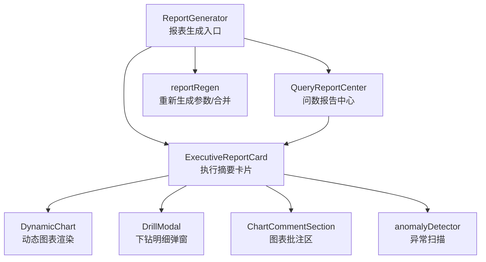
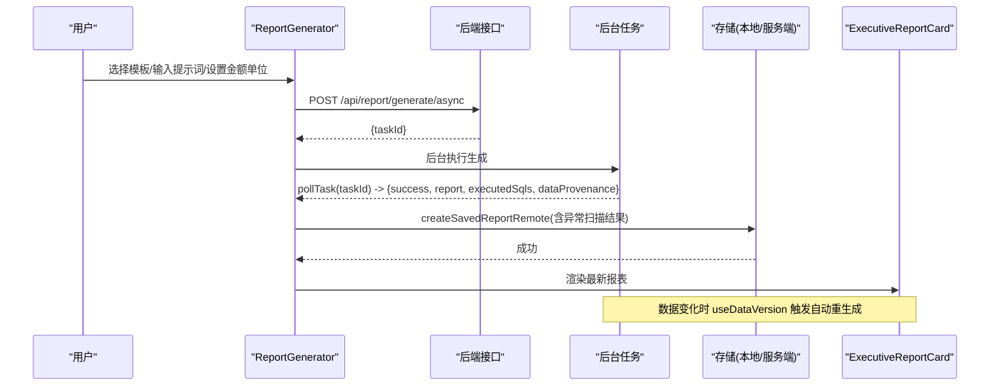
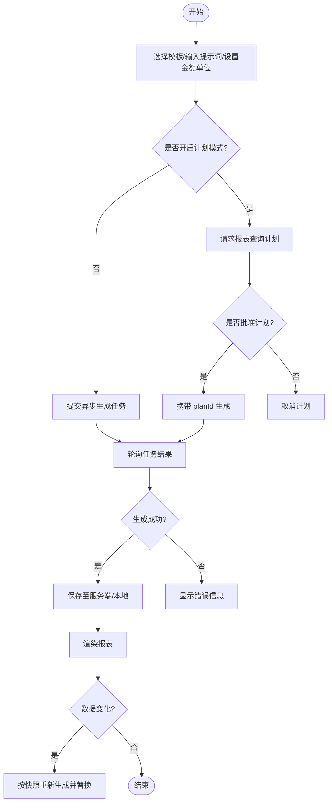
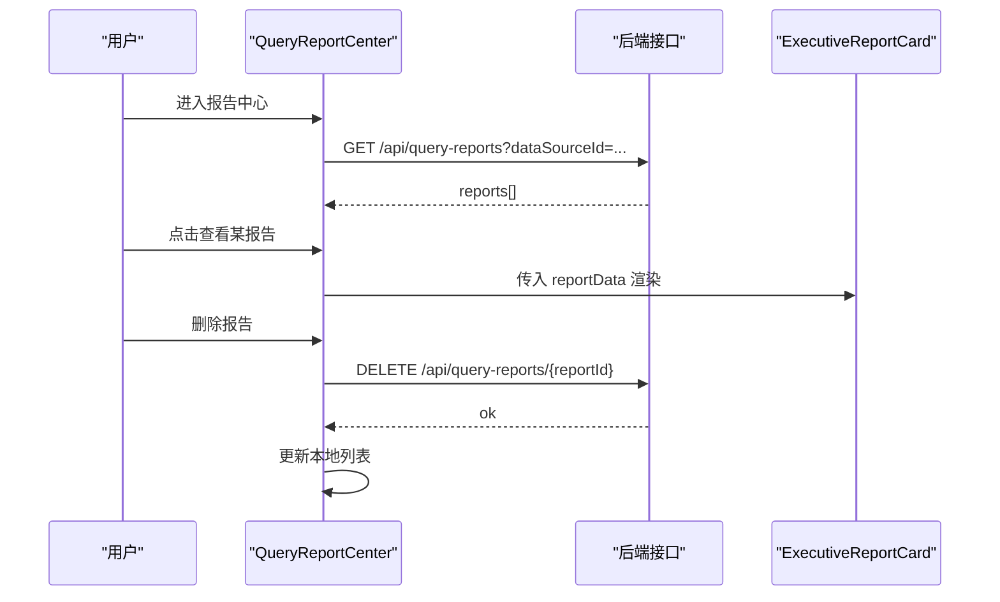
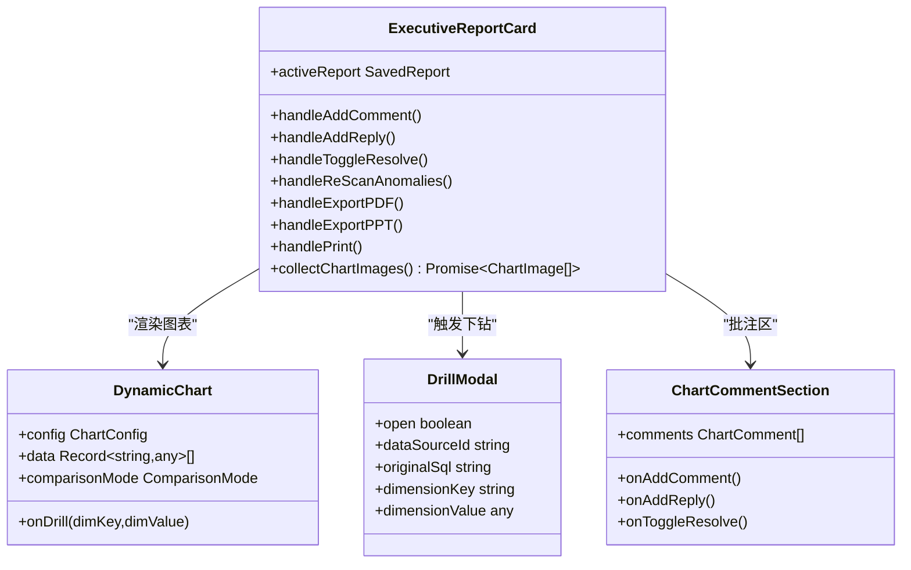
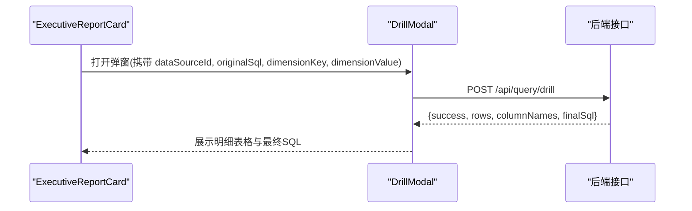
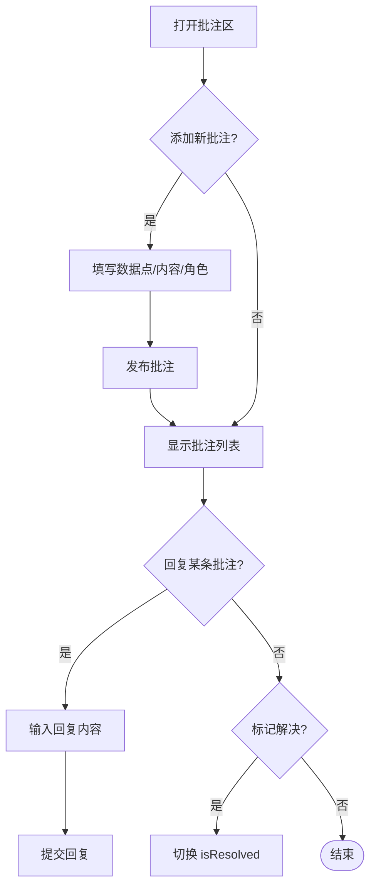
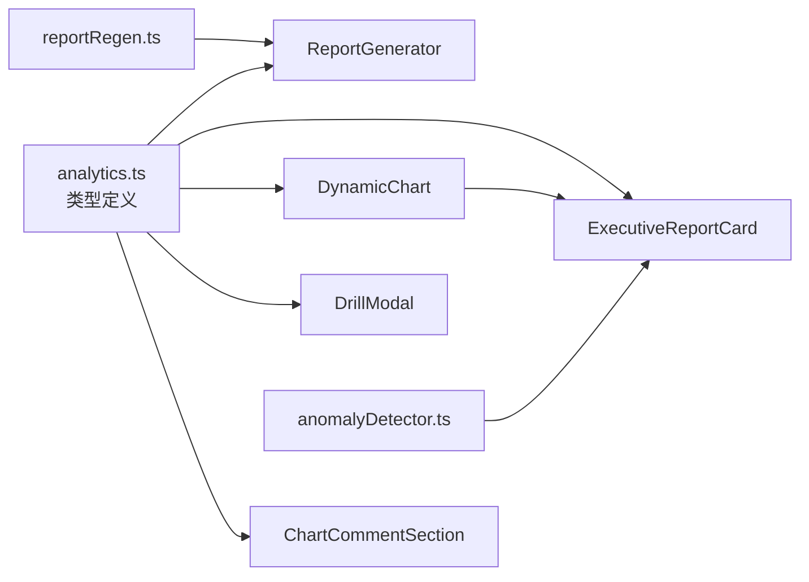

# 报表生成组件

<cite>
**本文引用的文件**
- [ReportGenerator.tsx](file://src/components/reports/ReportGenerator.tsx)
- [QueryReportCenter.tsx](file://src/components/reports/QueryReportCenter.tsx)
- [ExecutiveReportCard.tsx](file://src/components/reports/ExecutiveReportCard.tsx)
- [DrillModal.tsx](file://src/components/reports/DrillModal.tsx)
- [ChartCommentSection.tsx](file://src/components/reports/ChartCommentSection.tsx)
- [DynamicChart.tsx](file://src/components/charts/DynamicChart.tsx)
- [analytics.ts](file://src/types/analytics.ts)
- [reportRegen.ts](file://src/utils/reportRegen.ts)
- [anomalyDetector.ts](file://src/utils/anomalyDetector.ts)
</cite>

## 目录
1. [简介](#简介)
2. [项目结构](#项目结构)
3. [核心组件](#核心组件)
4. [架构总览](#架构总览)
5. [详细组件分析](#详细组件分析)
6. [依赖关系分析](#依赖关系分析)
7. [性能与可用性](#性能与可用性)
8. [故障排查指南](#故障排查指南)
9. [结论](#结论)
10. [附录：模板开发与最佳实践](#附录模板开发与最佳实践)

## 简介
本组件套件围绕“智能报表”的端到端能力构建，覆盖从报表创建、数据绑定、图表渲染、异常检测、下钻分析到批注协作与导出分享的全流程。核心目标包括：
- ReportGenerator：动态报表创建、模板选择、自定义提示词、金额单位、计划模式、自动重生成与服务端持久化。
- QueryReportCenter：问数报告中心，集中展示由“报告模式”生成的报告，支持查看、删除与跳转详情。
- ExecutiveReportCard：执行摘要卡片，统一渲染高管摘要、KPI网格、洞察、图表组，并集成异常扫描、主题切换、同/环比对比、PDF/PPT导出与打印。
- DrillModal：图表维度点击后触发下钻，拉取明细数据并以表格形式呈现。
- ChartCommentSection：图表级批注与回复，支持角色模拟、未解决计数、标记解决等协作功能。

## 项目结构
报表相关代码主要位于 src/components/reports，配合图表渲染（DynamicChart）、类型定义（analytics.ts）与工具函数（reportRegen.ts、anomalyDetector.ts）共同构成完整链路。

**图示来源**
- [ReportGenerator.tsx:198-306](file://src/components/reports/ReportGenerator.tsx#L198-L306)
- [ExecutiveReportCard.tsx:53-149](file://src/components/reports/ExecutiveReportCard.tsx#L53-L149)
- [DynamicChart.tsx:64-95](file://src/components/charts/DynamicChart.tsx#L64-L95)
- [DrillModal.tsx:18-72](file://src/components/reports/DrillModal.tsx#L18-L72)
- [ChartCommentSection.tsx:27-47](file://src/components/reports/ChartCommentSection.tsx#L27-L47)
- [reportRegen.ts:18-69](file://src/utils/reportRegen.ts#L18-L69)
- [anomalyDetector.ts:11-145](file://src/utils/anomalyDetector.ts#L11-L145)

**章节来源**
- [ReportGenerator.tsx:37-706](file://src/components/reports/ReportGenerator.tsx#L37-L706)
- [QueryReportCenter.tsx:25-227](file://src/components/reports/QueryReportCenter.tsx#L25-L227)
- [ExecutiveReportCard.tsx:60-994](file://src/components/reports/ExecutiveReportCard.tsx#L60-L994)
- [DynamicChart.tsx:1-200](file://src/components/charts/DynamicChart.tsx#L1-L200)
- [analytics.ts:141-372](file://src/types/analytics.ts#L141-L372)
- [reportRegen.ts:1-69](file://src/utils/reportRegen.ts#L1-L69)
- [anomalyDetector.ts:1-146](file://src/utils/anomalyDetector.ts#L1-L146)

## 核心组件
- ReportGenerator：提供模板选择、自定义侧重点、金额单位、计划模式、异步生成、自动重生成、历史报表维护（修改条件重新生成/删除）。
- QueryReportCenter：加载问数报告列表，支持查看详情（复用 ExecutiveReportCard）与删除。
- ExecutiveReportCard：渲染报告全文，集成异常扫描、主题/对比度/同环比控制、PDF/PPT导出、打印、图表下钻与批注。
- DrillModal：基于原始聚合 SQL 与维度键值发起下钻查询，返回明细表与最终 SQL。
- ChartCommentSection：图表级批注、回复、解决状态管理，支持按数据点标注与角色切换。

**章节来源**
- [ReportGenerator.tsx:170-306](file://src/components/reports/ReportGenerator.tsx#L170-L306)
- [QueryReportCenter.tsx:37-124](file://src/components/reports/QueryReportCenter.tsx#L37-L124)
- [ExecutiveReportCard.tsx:88-149](file://src/components/reports/ExecutiveReportCard.tsx#L88-L149)
- [DrillModal.tsx:34-72](file://src/components/reports/DrillModal.tsx#L34-L72)
- [ChartCommentSection.tsx:49-85](file://src/components/reports/ChartCommentSection.tsx#L49-L85)

## 架构总览
报表生成采用“前端交互 + 后端异步任务 + 本地持久化/服务端持久化”的组合：
- 前端通过 apiFetch 调用 /api/report/generate/async 提交任务，轮询 pollTask 获取结果。
- 生成成功后，使用 applyRegenResult 就地替换原报表（保留 id 与批注），并通过 updateSavedReportRemote 同步服务端。
- 数据源变化时，useDataVersion 触发自动重生成，保持报表与数据一致。
- 图表渲染由 DynamicChart 统一处理，支持主题、对比度、同/环比、缩放与下钻回调。
- 异常扫描在渲染前或手动触发，对 KPI 与图表数据进行 Z-Score 与阈值检测。

**图示来源**
- [ReportGenerator.tsx:198-272](file://src/components/reports/ReportGenerator.tsx#L198-L272)
- [ExecutiveReportCard.tsx:88-149](file://src/components/reports/ExecutiveReportCard.tsx#L88-L149)
- [reportRegen.ts:44-69](file://src/utils/reportRegen.ts#L44-L69)
- [anomalyDetector.ts:11-145](file://src/utils/anomalyDetector.ts#L11-L145)

## 详细组件分析

### ReportGenerator：动态报表创建与管理
- 模板选择：内置多套模板（综合经营分析、资产质量与风险监控、投资收益与财务分析、高管季度战略决策报告），用于向 LLM 传递主题上下文。
- 自定义提示词：可附加关注侧重点，结合数据源 Schema 建议作为提示词占位。
- 金额单位：模块内独立选择，优先于全局设置；提交时实时读取避免闭包过期。
- 计划模式：对数据库型数据源开启“先制定计划再批准生成”，计划有效期限制，批准后携带 planId 生成。
- 异步生成：提交即返回 taskId，轮询 pollTask 获取结果；失败透出服务端防御层拒绝原因。
- 自动重生成：监听数据版本变化，按原生成条件快照重新生成并就地替换，支持消息提示。
- 历史报表维护：打开“修改条件重新生成”编辑器，预填快照；支持删除演示报表（仅本地隐藏）或服务端删除。

**图示来源**
- [ReportGenerator.tsx:198-306](file://src/components/reports/ReportGenerator.tsx#L198-L306)
- [reportRegen.ts:18-69](file://src/utils/reportRegen.ts#L18-L69)

**章节来源**
- [ReportGenerator.tsx:55-168](file://src/components/reports/ReportGenerator.tsx#L55-L168)
- [ReportGenerator.tsx:198-381](file://src/components/reports/ReportGenerator.tsx#L198-L381)

### QueryReportCenter：问数报告管理中心
- 列表加载：根据当前数据源拉取报告列表，支持刷新。
- 详情视图：复用 ExecutiveReportCard 展示完整报告，支持返回、删除。
- 跳转消费：从问数对话跳转时，自动定位并选中对应报告，防止重复消费。

**图示来源**
- [QueryReportCenter.tsx:37-91](file://src/components/reports/QueryReportCenter.tsx#L37-L91)
- [QueryReportCenter.tsx:96-124](file://src/components/reports/QueryReportCenter.tsx#L96-L124)

**章节来源**
- [QueryReportCenter.tsx:25-227](file://src/components/reports/QueryReportCenter.tsx#L25-L227)

### ExecutiveReportCard：执行摘要卡片
- 初始异常扫描：渲染前执行 scanReportForAnomalies，为 KPI 与图表数据标注异常。
- 批注协同：新增批注、回复、标记解决，双写模式（先写 store 持久化，再同步本地副本即时回显）。
- 主题与对比度：全局主题切换、自动对比度优化、同/环比对比模式与差异徽标开关。
- 导出与打印：
  - PDF：收集图表 DOM 快照（优先 foreignObject，回退 SVG 序列化），提交后端异步任务，完成后下载。
  - PPT：收集图表图片 base64，提交后端组装 PPTX 并下载。
  - 打印：切换打印友好主题后唤起系统打印。
- 下钻门禁：仅 Cartesian 图表且具备 executedSqls 时开放下钻入口。

**图示来源**
- [ExecutiveReportCard.tsx:88-149](file://src/components/reports/ExecutiveReportCard.tsx#L88-L149)
- [ExecutiveReportCard.tsx:255-366](file://src/components/reports/ExecutiveReportCard.tsx#L255-L366)
- [DynamicChart.tsx:64-95](file://src/components/charts/DynamicChart.tsx#L64-L95)
- [DrillModal.tsx:18-72](file://src/components/reports/DrillModal.tsx#L18-L72)
- [ChartCommentSection.tsx:27-85](file://src/components/reports/ChartCommentSection.tsx#L27-L85)

**章节来源**
- [ExecutiveReportCard.tsx:60-994](file://src/components/reports/ExecutiveReportCard.tsx#L60-L994)

### DrillModal：下钻分析
- 前置校验：缺少 dataSourceId/originalSql/dimensionKey/dimensionValue 时直接提示无法下钻。
- 下钻请求：POST /api/query/drill，传入原始聚合 SQL 与维度键值，返回 rows/columnNames/finalSql。
- 展示明细：以表格形式展示明细行，列名可带中文映射，空值显示“-”。

**图示来源**
- [DrillModal.tsx:34-72](file://src/components/reports/DrillModal.tsx#L34-L72)
- [ExecutiveReportCard.tsx:755-797](file://src/components/reports/ExecutiveReportCard.tsx#L755-L797)

**章节来源**
- [DrillModal.tsx:1-166](file://src/components/reports/DrillModal.tsx#L1-L166)

### ChartCommentSection：图表注释与批注
- 批注创建：支持选择数据点（整体趋势或具体数据点），填写内容并发布。
- 回复讨论：针对评论进行回复，支持 Enter 快捷提交。
- 解决状态：可标记评论为已解决，未解决数量高亮。
- 角色模拟：切换不同角色身份，便于团队协作视角体验。

**图示来源**
- [ChartCommentSection.tsx:49-85](file://src/components/reports/ChartCommentSection.tsx#L49-L85)
- [ChartCommentSection.tsx:140-189](file://src/components/reports/ChartCommentSection.tsx#L140-L189)
- [ChartCommentSection.tsx:198-303](file://src/components/reports/ChartCommentSection.tsx#L198-L303)

**章节来源**
- [ChartCommentSection.tsx:1-311](file://src/components/reports/ChartCommentSection.tsx#L1-L311)

## 依赖关系分析
- 类型依赖：所有组件共享 analytics.ts 中的 SavedReport、ChartConfig、AnomalyItem、ChartComment 等类型，确保前后端契约一致。
- 工具依赖：
  - reportRegen.ts：解析生成条件、准入判定、结果合并，供 ReportGenerator 与自动重生成共用。
  - anomalyDetector.ts：对 KPI 与图表数据进行异常检测，输出 anomalies 与图表级 anomalies。
- 图表依赖：DynamicChart 提供统一的图表渲染与交互，被 ExecutiveReportCard 复用。

**图示来源**
- [analytics.ts:141-372](file://src/types/analytics.ts#L141-L372)
- [reportRegen.ts:1-69](file://src/utils/reportRegen.ts#L1-L69)
- [anomalyDetector.ts:1-146](file://src/utils/anomalyDetector.ts#L1-L146)
- [DynamicChart.tsx:1-200](file://src/components/charts/DynamicChart.tsx#L1-L200)

**章节来源**
- [analytics.ts:141-372](file://src/types/analytics.ts#L141-L372)
- [reportRegen.ts:1-69](file://src/utils/reportRegen.ts#L1-L69)
- [anomalyDetector.ts:1-146](file://src/utils/anomalyDetector.ts#L1-L146)

## 性能与可用性
- 异步任务：报表生成与 PDF 导出均走异步任务 + 轮询，避免阻塞 UI。
- 自动重生成：数据版本变化时按需触发，避免频繁重算；与手动生成互斥，防止并发覆盖。
- 图表渲染：DynamicChart 支持缩放、刷选、主题切换与对比度优化，减少不必要的动画开销（饼图动画常驻关闭）。
- 导出优化：DOM 快照优先 foreignObject，失败回退 SVG 序列化；批量收集图表图片，降低多次网络往返。
- 异常扫描：Z-Score 自适应阈值，小样本提高阈值，避免误报；扫描耗时微秒级，UI 增加延迟感知提升体验。

[本节为通用性能讨论，不直接分析具体文件]

## 故障排查指南
- 报表生成失败：检查后端返回 error 字段，常见原因为注入防护、频率超限、任务过多；确认数据源状态与权限。
- 自动重生成失败：确认数据源连接正常、服务端可访问；查看轮询结果与错误提示。
- 下钻不可用：若提示缺少原始查询 SQL，说明为演示/旧版报表，需重新生成以包含 executedSqls。
- 导出失败：PDF/PPT 导出失败时查看浏览器控制台错误；foreignObject 光栅化失败会回退 SVG 序列化。
- 批注未生效：确认双写模式（store 持久化 + 本地副本同步）；检查 addReportComment/addReportCommentReply/toggleReportCommentResolve 调用。

**章节来源**
- [ReportGenerator.tsx:217-232](file://src/components/reports/ReportGenerator.tsx#L217-L232)
- [ReportGenerator.tsx:111-156](file://src/components/reports/ReportGenerator.tsx#L111-L156)
- [DrillModal.tsx:43-48](file://src/components/reports/DrillModal.tsx#L43-L48)
- [ExecutiveReportCard.tsx:328-366](file://src/components/reports/ExecutiveReportCard.tsx#L328-L366)
- [ExecutiveReportCard.tsx:97-128](file://src/components/reports/ExecutiveReportCard.tsx#L97-L128)

## 结论
该报表组件体系以“模板驱动 + 数据绑定 + 智能增强”为核心，实现了从生成、渲染、分析到协作与导出的闭环。通过计划模式与自动重生成保障可控性与时效性；异常检测与下钻分析提升洞察深度；批注协作强化团队协同；PDF/PPT 导出满足汇报与归档需求。建议在业务扩展中遵循类型契约与工具函数约定，保持组件职责清晰与可维护性。

[本节为总结性内容，不直接分析具体文件]

## 附录：模板开发与最佳实践
- 模板开发要点
  - 模板主题应明确业务场景（如综合经营分析、资产质量监控、财务效能、高管战略），以便 LLM 规划查询与生成洞察。
  - 模板应指定关键指标与图表类型，确保数据绑定与可视化一致性。
  - 金额单位需在模板中明确，避免二次缩写冲突。
- 自定义图表集成方法
  - 使用 DynamicChart 的 ChartConfig 描述图表类型、轴键、堆叠、颜色等；确保 xAxisKey/yAxisKeys 与实际数据对齐。
  - 如需下钻，确保图表类型为 Cartesian（bar/line/area）且存在 executedSqls。
  - 导出时图表根节点需带 data-chart-capture-root，保证 PDF/PPT 截图对齐。
- 最佳实践
  - 使用 reportRegen.ts 的 resolveReportGenParams 与 applyRegenResult 处理条件快照与就地替换，避免状态漂移。
  - 使用 anomalyDetector.ts 在渲染前或手动触发异常扫描，提升报告可读性与预警能力。
  - 批注与回复通过 ExecutiveReportCard 的双写模式保持持久化与即时回显，避免网络往返导致的闪烁。
  - 计划模式下，先制定计划再批准生成，确保复杂报表的可控性与审计性。
  - 自动重生成仅在 live 数据源生效，避免对演示/旧版报表产生副作用。

[本节为概念性指导，不直接分析具体文件]