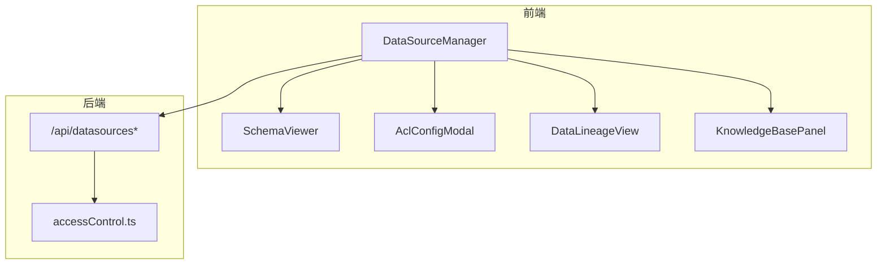
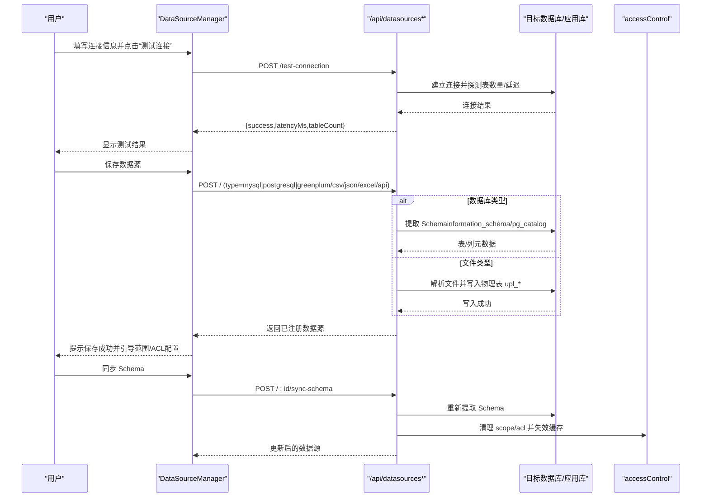
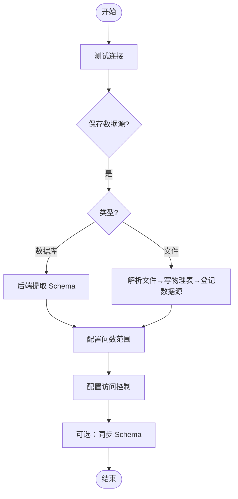
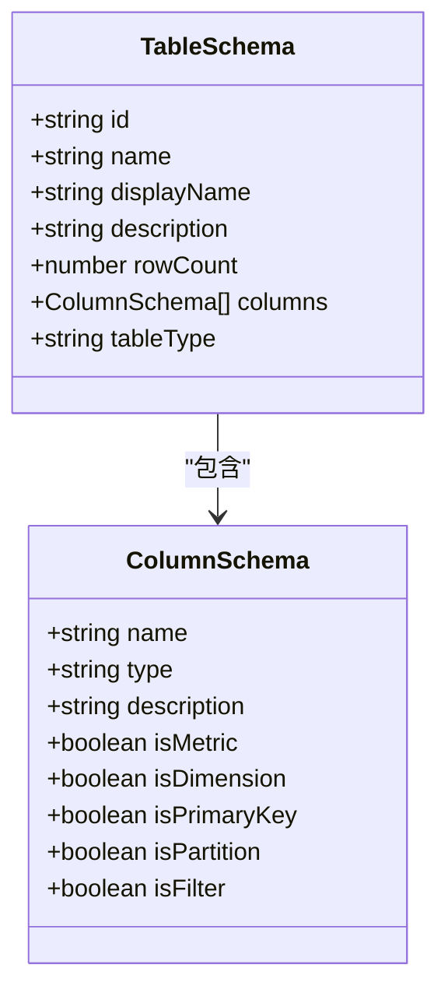
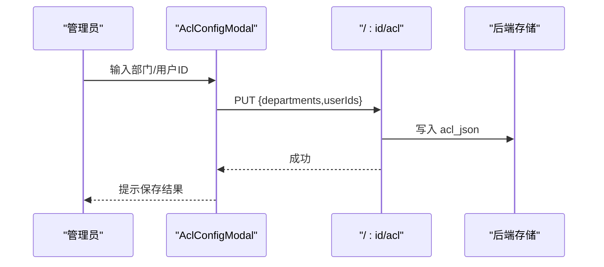
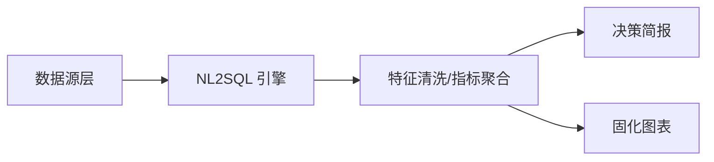
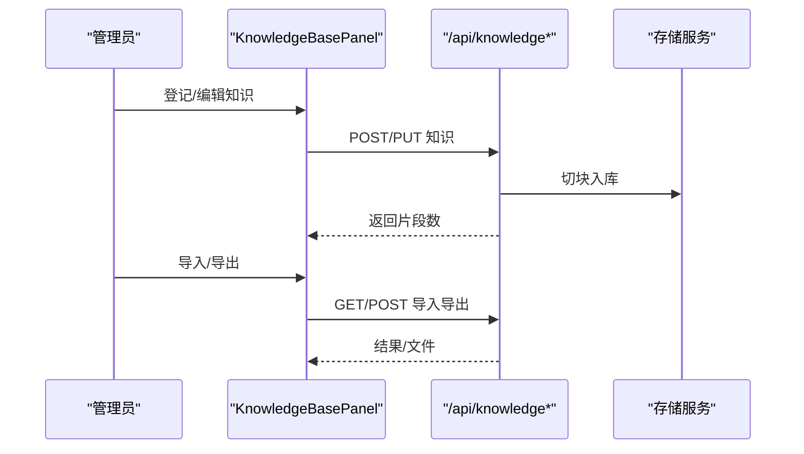
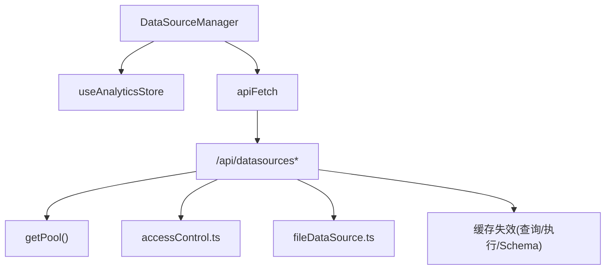

# 数据源管理组件

<cite>
**本文引用的文件列表**
- [DataSourceManager.tsx](file://src/components/datasource/DataSourceManager.tsx)
- [SchemaViewer.tsx](file://src/components/datasource/SchemaViewer.tsx)
- [AclConfigModal.tsx](file://src/components/datasource/AclConfigModal.tsx)
- [DataLineageView.tsx](file://src/components/datasource/DataLineageView.tsx)
- [KnowledgeBasePanel.tsx](file://src/components/datasource/KnowledgeBasePanel.tsx)
- [analytics.ts](file://src/types/analytics.ts)
- [datasources.ts](file://server/routes/datasources.ts)
- [accessControl.ts](file://server/auth/accessControl.ts)
</cite>

## 目录
1. [简介](#简介)
2. [项目结构](#项目结构)
3. [核心组件](#核心组件)
4. [架构总览](#架构总览)
5. [详细组件分析](#详细组件分析)
6. [依赖关系分析](#依赖关系分析)
7. [性能与监控](#性能与监控)
8. [故障排查指南](#故障排查指南)
9. [结论](#结论)
10. [附录：配置最佳实践与权限设计模式](#附录配置最佳实践与权限设计模式)

## 简介
本组件集围绕“数据源接入—元数据展示—访问控制—血缘分析—知识库集成”构建完整的数据资产管理闭环。前端通过 DataSourceManager 统一编排数据源连接、Schema 同步、范围与 ACL 配置；SchemaViewer 提供表结构与字段语义的可视化；AclConfigModal 实现部门与个人维度的访问控制；DataLineageView 展示从数据源到报表/图表的全链路血缘；KnowledgeBasePanel 支持业务知识登记、导入导出，增强问数准确性。后端路由 datasources.ts 负责真实数据库连接、Schema 提取、文件导入落库、ACL/Scope 持久化与缓存失效等。

## 项目结构
- 前端组件位于 src/components/datasource，按功能拆分：
  - DataSourceManager：数据源管理主入口（连接测试、保存、同步 Schema、范围/ACL、文件导入）
  - SchemaViewer：表结构、字段类型、指标/维度标签、行数统计
  - AclConfigModal：访问控制弹窗（部门/用户授权）
  - DataLineageView：数据血缘拓扑（数据源→处理算子→报表/图表）
  - KnowledgeBasePanel：知识文档登记、详情查看、编辑、导入导出
- 类型定义集中在 src/types/analytics.ts，描述数据源、表/列 Schema、范围、报表、图表等
- 后端路由 server/routes/datasources.ts 提供数据源 CRUD、Schema 同步、文件导入、数据版本探测等接口
- 访问控制逻辑在 server/auth/accessControl.ts，实现 ACL 解析、校验与授权合并

**图示来源**
- [DataSourceManager.tsx:57-753](file://src/components/datasource/DataSourceManager.tsx#L57-L753)
- [datasources.ts:364-800](file://server/routes/datasources.ts#L364-L800)
- [accessControl.ts:18-108](file://server/auth/accessControl.ts#L18-L108)

**章节来源**
- [DataSourceManager.tsx:57-753](file://src/components/datasource/DataSourceManager.tsx#L57-L753)
- [datasources.ts:364-800](file://server/routes/datasources.ts#L364-L800)
- [accessControl.ts:18-108](file://server/auth/accessControl.ts#L18-L108)

## 核心组件
- DataSourceManager：集中管理数据源生命周期（新增、测试连接、保存、同步 Schema、问数范围、ACL、文件导入），并驱动其他子组件渲染。
- SchemaViewer：以表格形式展示表类型、行数、列名、数据类型、业务属性（指标/维度）、描述。
- AclConfigModal：维护部门与用户 ID 白名单，空值表示不限制；提交后由后端清洗并持久化。
- DataLineageView：三列布局（数据源层、处理算子层、终端消费层），悬停高亮上游链路，底部面板展示选中节点的血缘摘要。
- KnowledgeBasePanel：按数据源维度登记知识，支持查看切块、编辑、删除、导入导出（含冲突策略与 Dry Run）。

**章节来源**
- [DataSourceManager.tsx:57-753](file://src/components/datasource/DataSourceManager.tsx#L57-L753)
- [SchemaViewer.tsx:17-139](file://src/components/datasource/SchemaViewer.tsx#L17-L139)
- [AclConfigModal.tsx:7-99](file://src/components/datasource/AclConfigModal.tsx#L7-L99)
- [DataLineageView.tsx:25-594](file://src/components/datasource/DataLineageView.tsx#L25-L594)
- [KnowledgeBasePanel.tsx:35-590](file://src/components/datasource/KnowledgeBasePanel.tsx#L35-L590)

## 架构总览
前端通过 apiFetch 调用后端 /api/datasources 系列接口完成数据源配置与元数据同步；后端根据类型选择 MySQL/PG/Greenplum 的真实连接与 Schema 提取，或为文件类型创建物理表并注册数据源。访问控制与范围控制贯穿列表、Schema 获取与执行链路。

**图示来源**
- [DataSourceManager.tsx:116-250](file://src/components/datasource/DataSourceManager.tsx#L116-L250)
- [DataSourceManager.tsx:378-420](file://src/components/datasource/DataSourceManager.tsx#L378-L420)
- [datasources.ts:442-656](file://server/routes/datasources.ts#L442-L656)
- [accessControl.ts:18-108](file://server/auth/accessControl.ts#L18-L108)

## 详细组件分析

### DataSourceManager：数据源管理中枢
- 连接测试：构造 type/config（host/port/database/username/password/schema），调用 /api/datasources/test-connection，展示延迟与表数量。
- 保存数据源：对数据库类型直接让后端提取 Schema；非数据库类型生成占位表；成功后自动推导指标/维度并引导打开范围编辑器。
- 问数范围（Scope）：勾选允许问数的表与列，提交后服务端清洗并持久化；全量时 scope=null。
- 访问控制（ACL）：维护部门与用户 ID 清单，空值=全员可见；提交后由后端 sanitizeAcl 归一化。
- Schema 同步：POST /:id/sync-schema，首次失败可补输密码重试；保留管理员手工标注的指标/维度与业务口径，同时清理无效 Scope 并失效缓存。
- 文件导入：支持 CSV/JSON/XLSX，前端 Base64 上传，后端解析、敏感列剔除、类型推断、创建物理表 upl_* 并登记数据源，返回 stats（行/列/被剔除列/截断）。

**图示来源**
- [DataSourceManager.tsx:116-250](file://src/components/datasource/DataSourceManager.tsx#L116-L250)
- [DataSourceManager.tsx:252-376](file://src/components/datasource/DataSourceManager.tsx#L252-L376)
- [DataSourceManager.tsx:378-492](file://src/components/datasource/DataSourceManager.tsx#L378-L492)
- [datasources.ts:442-656](file://server/routes/datasources.ts#L442-L656)

**章节来源**
- [DataSourceManager.tsx:57-753](file://src/components/datasource/DataSourceManager.tsx#L57-L753)
- [datasources.ts:442-656](file://server/routes/datasources.ts#L442-L656)

### SchemaViewer：Schema 元数据展示
- 表头：显示表类型（普通表/视图/物化视图/外部表/序列/分区表）、名称、描述、行数。
- 列明细：列名、数据类型、业务属性（数值指标/分组维度/通用属性）、描述；主键列带标识。
- 交互：基于 TableSchema 渲染，便于管理员快速核对自动推导的指标/维度是否正确。

**图示来源**
- [analytics.ts:19-43](file://src/types/analytics.ts#L19-L43)
- [SchemaViewer.tsx:17-139](file://src/components/datasource/SchemaViewer.tsx#L17-L139)

**章节来源**
- [SchemaViewer.tsx:17-139](file://src/components/datasource/SchemaViewer.tsx#L17-L139)
- [analytics.ts:19-43](file://src/types/analytics.ts#L19-L43)

### AclConfigModal：访问控制配置
- 输入：部门（逗号分隔）、用户 ID（逗号分隔数字）；两组均留空=不限制（全员可见）。
- 行为：保存时前端将文本拆分为数组并提交 PUT /:id/acl；后端 sanitizeAcl 清洗并持久化；非管理员不可见受限数据源（列表仅下发最小信息并标记 accessDenied）。
- 适用场景：部门级隔离、特定用户授权、审批通过后并入个人授权。

**图示来源**
- [AclConfigModal.tsx:7-99](file://src/components/datasource/AclConfigModal.tsx#L7-L99)
- [accessControl.ts:18-108](file://server/auth/accessControl.ts#L18-L108)
- [datasources.ts:364-400](file://server/routes/datasources.ts#L364-L400)

**章节来源**
- [AclConfigModal.tsx:7-99](file://src/components/datasource/AclConfigModal.tsx#L7-L99)
- [accessControl.ts:18-108](file://server/auth/accessControl.ts#L18-L108)
- [datasources.ts:364-400](file://server/routes/datasources.ts#L364-L400)

### DataLineageView：数据血缘分析
- 三列布局：
  - 左侧：数据源层（列出所有数据源及其注册表）
  - 中间：处理算子层（NL2SQL 引擎、特征清洗/聚合）
  - 右侧：终端消费层（决策简报 SavedReport、固化图表 DashboardWidget）
- 交互：鼠标悬停任意节点，顶部横幅即时展示该节点的完整上游链路；底部面板展示选中节点的详细血缘摘要。
- 依赖判定：根据 SavedReport.dataSourceId 与 DashboardWidget.dataSourceId 推演上游数据源；默认图表回退至首个数据源。

**图示来源**
- [DataLineageView.tsx:25-594](file://src/components/datasource/DataLineageView.tsx#L25-L594)
- [analytics.ts:278-345](file://src/types/analytics.ts#L278-L345)

**章节来源**
- [DataLineageView.tsx:25-594](file://src/components/datasource/DataLineageView.tsx#L25-L594)
- [analytics.ts:278-345](file://src/types/analytics.ts#L278-L345)

### KnowledgeBasePanel：知识库集成
- 能力：按数据源登记知识（标题+内容），后端切块并生成检索向量；支持查看详情（片段列表）、编辑（重新切块）、删除。
- 导入导出：导出当前数据源全部知识为 JSON；导入支持 skip/overwrite/append 冲突策略与 Dry Run 预检。
- 作用：弥补 Schema 元数据表达不足，问数时检索注入提升 SQL 生成的业务准确性。

**图示来源**
- [KnowledgeBasePanel.tsx:35-590](file://src/components/datasource/KnowledgeBasePanel.tsx#L35-L590)

**章节来源**
- [KnowledgeBasePanel.tsx:35-590](file://src/components/datasource/KnowledgeBasePanel.tsx#L35-L590)

## 依赖关系分析
- 前端依赖：
  - useAnalyticsStore：数据源、报表、图表状态
  - apiFetch：统一 HTTP 客户端
  - 各子组件：SchemaViewer、DataLineageView、AclConfigModal、KnowledgeBasePanel
- 后端依赖：
  - 数据库连接池 getPool()
  - 访问控制 accessControl.ts（ACL 解析/校验/授权合并）
  - 文件数据源 fileDataSource.ts（解析/类型推断/物理表）
  - 缓存失效：schemaContext、sqlExecutor、queryCache

**图示来源**
- [DataSourceManager.tsx:23-32](file://src/components/datasource/DataSourceManager.tsx#L23-L32)
- [datasources.ts:6-28](file://server/routes/datasources.ts#L6-L28)
- [datasources.ts:642-656](file://server/routes/datasources.ts#L642-L656)

**章节来源**
- [DataSourceManager.tsx:23-32](file://src/components/datasource/DataSourceManager.tsx#L23-L32)
- [datasources.ts:6-28](file://server/routes/datasources.ts#L6-L28)
- [datasources.ts:642-656](file://server/routes/datasources.ts#L642-L656)

## 性能与监控
- Schema 同步与更新触发缓存失效：
  - 同步 Schema 后调用 invalidateSchemaCache、invalidateExecutorPool、invalidateQueryCache，确保后续查询使用最新元数据与范围。
- 数据版本探测：
  - /:id/data-version 提供轻量数据变化检测（information_schema/pg_stat），供看板/报表轮询重放。
- 文件导入上限与截断：
  - 前端 MAX_IMPORT_FILE_BYTES 与服务端 MAX_FILE_BYTES 对齐；超过 2 万行/100 列的部分会被截断，并在响应中告知。
- 建议监控点（结合部署中的 Prometheus/Grafana）：
  - 数据库连接成功率、延迟、Schema 提取耗时
  - 文件导入吞吐、错误率
  - 查询缓存命中率与失效频率
  - 问数链路端到端耗时（NL2SQL、特征清洗、执行）

**章节来源**
- [datasources.ts:403-417](file://server/routes/datasources.ts#L403-L417)
- [datasources.ts:642-656](file://server/routes/datasources.ts#L642-L656)
- [DataSourceManager.tsx:422-492](file://src/components/datasource/DataSourceManager.tsx#L422-L492)

## 故障排查指南
- 连接测试失败：
  - 检查 host/port/database/username/password/schema 是否正确；若首次同步失败，按提示补输密码重试。
- Schema 同步失败：
  - 确认数据库类型是否支持自动同步（mysql/postgresql/greenplum）；查看后端日志定位连接或 SQL 异常。
- 文件导入失败：
  - 确认文件格式（csv/json/xlsx）与大小限制；检查敏感列是否全部被剔除导致无可用列；查看后端返回的错误消息。
- 访问控制生效异常：
  - 确认 ACL 是否为空（空=不限制）；非管理员仅能看到最小信息与 accessDenied；审批通过后需确认 userIds 已并入。
- 缓存未刷新：
  - 修改 Schema/配置/范围后，后端会主动失效相关缓存；如仍异常，检查是否调用了正确的更新接口。

**章节来源**
- [DataSourceManager.tsx:116-179](file://src/components/datasource/DataSourceManager.tsx#L116-L179)
- [DataSourceManager.tsx:378-420](file://src/components/datasource/DataSourceManager.tsx#L378-L420)
- [datasources.ts:484-586](file://server/routes/datasources.ts#L484-L586)
- [accessControl.ts:18-108](file://server/auth/accessControl.ts#L18-L108)

## 结论
本组件体系以 DataSourceManager 为核心，串联数据源接入、Schema 管理、访问控制、血缘分析与知识库集成，形成从数据接入到消费可视化的完整链路。后端提供健壮的连接与元数据提取能力，配合缓存失效与数据版本探测保障一致性与性能。通过 ACL 与 Scope 的正交设计，既满足组织级权限隔离，又精细化控制问数范围。

## 附录：配置最佳实践与权限设计模式

- 数据源配置最佳实践
  - 优先使用只读账号与最小权限原则；PostgreSQL/Greenplum 指定 schema 避免跨 schema 扫描。
  - 首次保存后务必进行 Schema 同步，确保元数据与真实库一致；必要时补输密码。
  - 文件导入前进行数据清洗，减少敏感列与超大字段；注意 2 万行/100 列上限。
  - 定期同步 Schema，保持表结构变更及时反映到系统。

- 权限设计模式
  - ACL（部门/用户）与 Scope（表/列/行级）正交：ACL 决定“能否看到/使用该数据源”，Scope 决定“可用哪些表列”。
  - 默认不限制（ACL 为空），逐步收紧；审批通过后并入个人授权，保证低频管理操作幂等。
  - 非管理员列表仅下发最小信息并标记 accessDenied，提供申请权限入口。

- 性能优化建议
  - 合理设置连接超时与语句超时，避免长事务阻塞。
  - 利用数据版本探测与缓存失效机制，减少不必要重计算。
  - 对大库分库分表或限定 schema，降低 Schema 提取成本。
  - 文件导入采用分批与截断策略，避免单次过大请求。

**章节来源**
- [datasources.ts:223-347](file://server/routes/datasources.ts#L223-L347)
- [datasources.ts:484-656](file://server/routes/datasources.ts#L484-L656)
- [accessControl.ts:18-108](file://server/auth/accessControl.ts#L18-L108)
- [DataSourceManager.tsx:116-492](file://src/components/datasource/DataSourceManager.tsx#L116-L492)