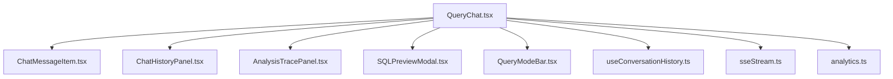
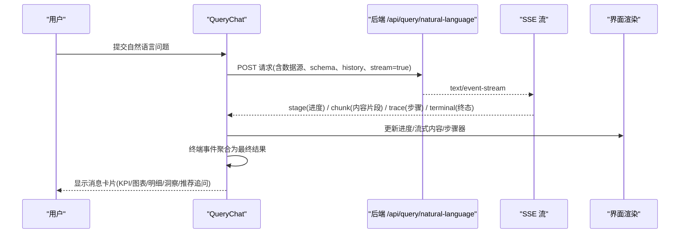
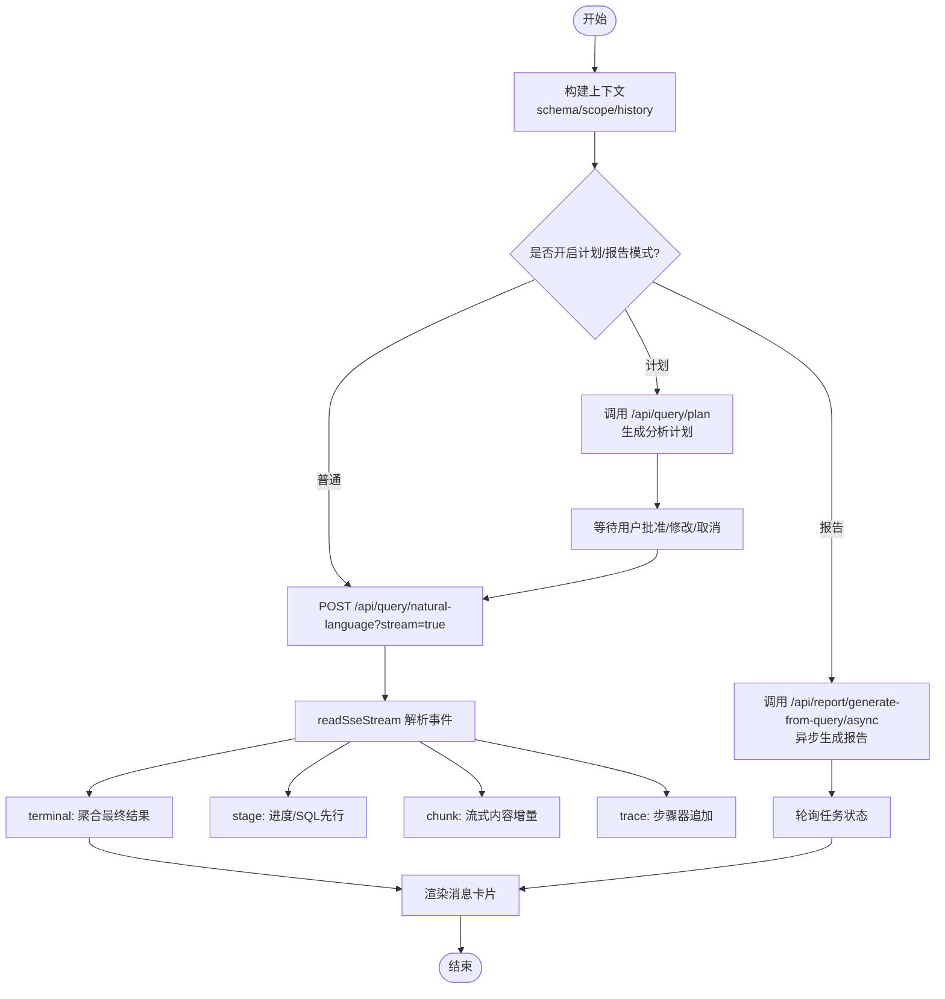
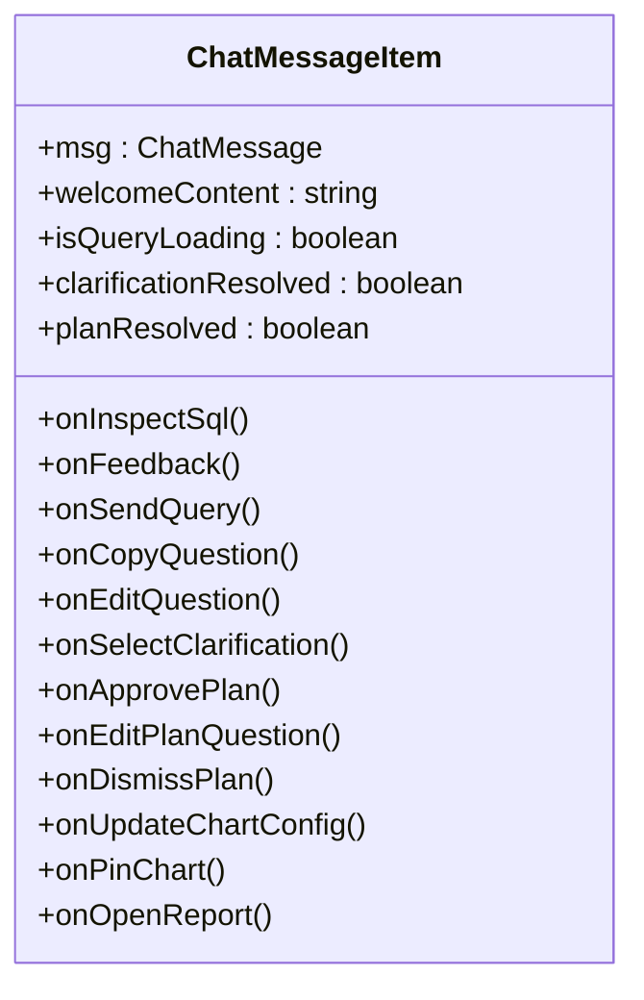
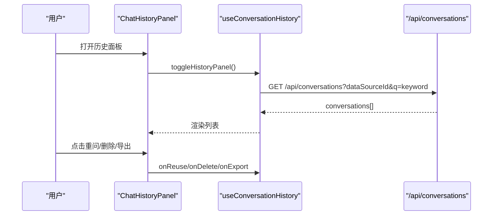
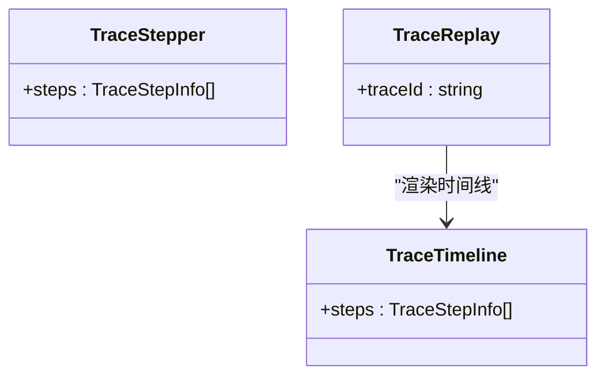
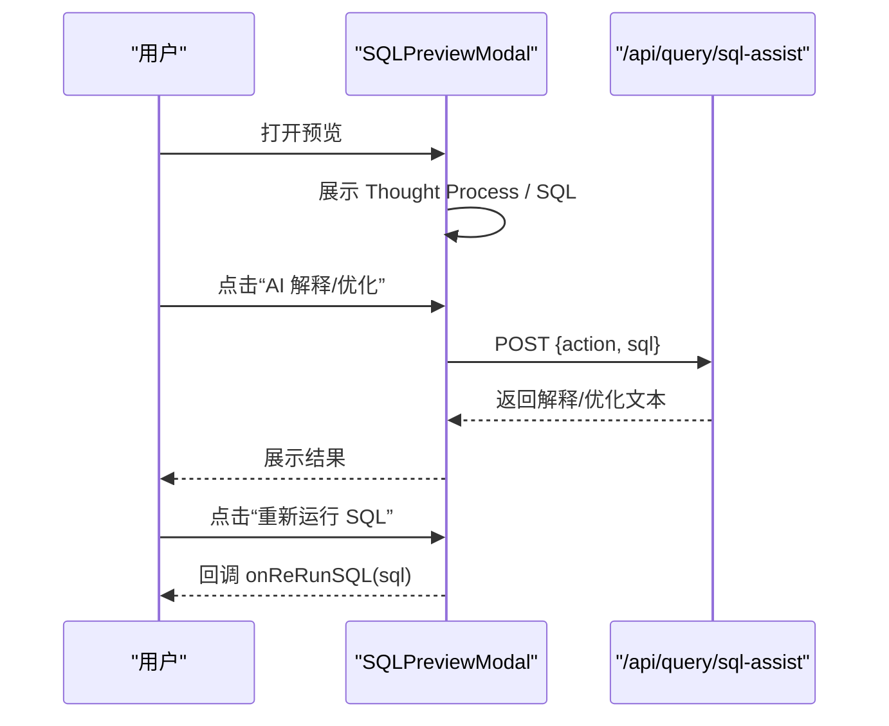
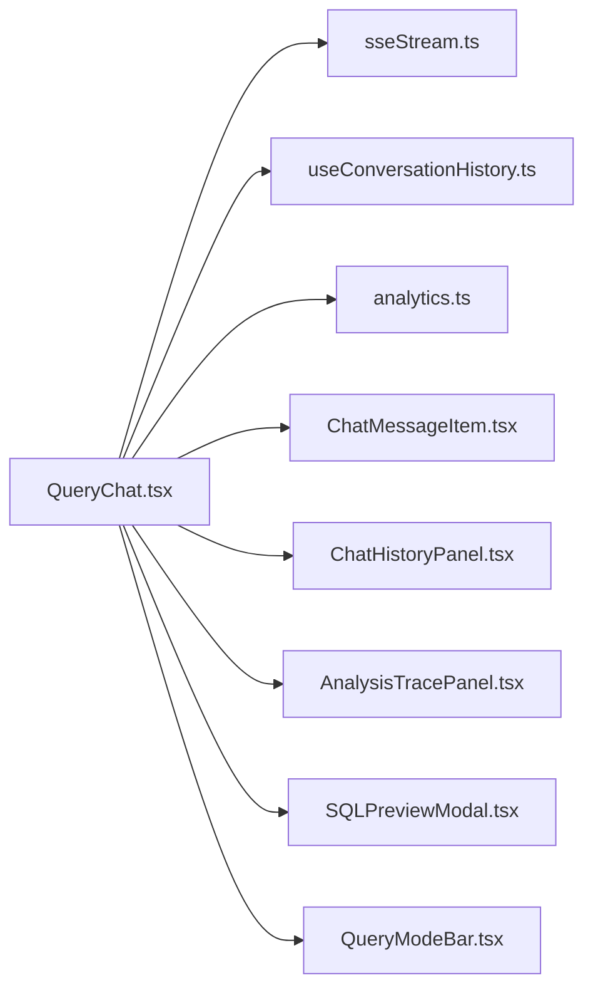

# 查询聊天组件

<cite>
**本文引用的文件**
- [QueryChat.tsx](file://src/components/query/QueryChat.tsx)
- [ChatMessageItem.tsx](file://src/components/query/ChatMessageItem.tsx)
- [ChatHistoryPanel.tsx](file://src/components/query/ChatHistoryPanel.tsx)
- [AnalysisTracePanel.tsx](file://src/components/query/AnalysisTracePanel.tsx)
- [SQLPreviewModal.tsx](file://src/components/query/SQLPreviewModal.tsx)
- [QueryModeBar.tsx](file://src/components/query/QueryModeBar.tsx)
- [useConversationHistory.ts](file://src/hooks/useConversationHistory.ts)
- [sseStream.ts](file://src/utils/sseStream.ts)
- [analytics.ts](file://src/types/analytics.ts)
</cite>

## 目录
1. [简介](#简介)
2. [项目结构](#项目结构)
3. [核心组件](#核心组件)
4. [架构总览](#架构总览)
5. [详细组件分析](#详细组件分析)
6. [依赖关系分析](#依赖关系分析)
7. [性能与流式处理](#性能与流式处理)
8. [故障排查指南](#故障排查指南)
9. [结论](#结论)
10. [附录：API 参考与集成示例](#附录api-参考与集成示例)

## 简介
本组件集提供“自然语言问数”的完整前端能力：用户输入问题后，系统通过服务端链路生成 SQL、执行并返回结果；同时支持流式进度提示、Token 级内容增量渲染、推导过程回放、SQL 预览与编辑、历史记录管理与导出等。整体围绕 QueryChat 主容器，配合 ChatMessageItem、ChatHistoryPanel、AnalysisTracePanel、SQLPreviewModal 等子组件完成端到端交互。

## 项目结构
- 入口与编排：QueryChat.tsx（消息状态、SSE 流、计划模式、报告模式、历史面板集成）
- 消息渲染：ChatMessageItem.tsx（文本、代码块、表格、图表、KPI、洞察、推荐追问、全屏结果区）
- 历史管理：ChatHistoryPanel.tsx + useConversationHistory.ts（搜索、重问、删除、Markdown 导出）
- 追踪回放：AnalysisTracePanel.tsx（步骤器、时间线、按 traceId 回放）
- SQL 预览：SQLPreviewModal.tsx（展示 Thought Process、可编辑 SQL、AI 解释/优化建议、重新运行）
- 模式栏：QueryModeBar.tsx（计划/深度/报告模式、金额单位、模型选择）
- 工具与类型：sseStream.ts（SSE 解析）、analytics.ts（统一类型定义）

**图示来源**
- [QueryChat.tsx:1-1367](file://src/components/query/QueryChat.tsx#L1-L1367)
- [ChatMessageItem.tsx:1-531](file://src/components/query/ChatMessageItem.tsx#L1-L531)
- [ChatHistoryPanel.tsx:1-116](file://src/components/query/ChatHistoryPanel.tsx#L1-L116)
- [AnalysisTracePanel.tsx:1-196](file://src/components/query/AnalysisTracePanel.tsx#L1-L196)
- [SQLPreviewModal.tsx:1-202](file://src/components/query/SQLPreviewModal.tsx#L1-L202)
- [QueryModeBar.tsx:1-151](file://src/components/query/QueryModeBar.tsx#L1-L151)
- [useConversationHistory.ts:1-124](file://src/hooks/useConversationHistory.ts#L1-L124)
- [sseStream.ts:1-116](file://src/utils/sseStream.ts#L1-L116)
- [analytics.ts:1-372](file://src/types/analytics.ts#L1-L372)

**章节来源**
- [QueryChat.tsx:1-1367](file://src/components/query/QueryChat.tsx#L1-L1367)
- [analytics.ts:1-372](file://src/types/analytics.ts#L1-L372)

## 核心组件
- QueryChat：负责用户输入、上下文构建、SSE 流消费、计划/报告模式分支、历史面板联动、流式内容与阶段进度更新、错误与超时处理。
- ChatMessageItem：单条消息卡片渲染，支持多种结果类型（KPI、洞察、图表、明细表），以及语义缓存、DLP 脱敏、拒答、计划卡片、报告卡片等。
- ChatHistoryPanel：历史对话列表、关键词检索、重问回填、删除、Markdown 导出。
- AnalysisTracePanel：查询推导过程可视化（步骤器与时间线），支持按 traceId 回放。
- SQLPreviewModal：SQL 预览与编辑，AI 助手解释/优化，一键复制与重新运行。
- QueryModeBar：模式开关（计划/深度/报告）、模板选择、金额单位、模型选择。

**章节来源**
- [QueryChat.tsx:49-770](file://src/components/query/QueryChat.tsx#L49-L770)
- [ChatMessageItem.tsx:32-531](file://src/components/query/ChatMessageItem.tsx#L32-L531)
- [ChatHistoryPanel.tsx:21-116](file://src/components/query/ChatHistoryPanel.tsx#L21-L116)
- [AnalysisTracePanel.tsx:11-196](file://src/components/query/AnalysisTracePanel.tsx#L11-L196)
- [SQLPreviewModal.tsx:17-202](file://src/components/query/SQLPreviewModal.tsx#L17-L202)
- [QueryModeBar.tsx:9-151](file://src/components/query/QueryModeBar.tsx#L9-L151)

## 架构总览
下图展示了从用户提问到结果展示的端到端流程，包括 SSE 流式阶段事件、Token 级内容推送、推导步骤追加、终端事件处理与错误恢复。

**图示来源**
- [QueryChat.tsx:650-770](file://src/components/query/QueryChat.tsx#L650-L770)
- [sseStream.ts:38-116](file://src/utils/sseStream.ts#L38-L116)

## 详细组件分析

### QueryChat：自然语言输入与流式处理
- 输入与上下文
  - 限制单条输入长度，结合当前数据源的 schema 与 scope 构建上下文。
  - 多轮上下文仅取最近若干轮 user/assistant 有效消息，避免跨源污染。
- 模式分支
  - 计划模式：先生成分析计划，用户批准后携带 planId 再执行。
  - 报告模式：直接异步生成报告，轮询任务状态，完成后以报告卡片形式呈现。
- SSE 流式消费
  - 使用 readSseStream 解析 stage/chunk/trace/terminal/error 事件。
  - 阶段事件用于进度文案与 SQL 先行回显；chunk 事件实现 Token 级打字机效果；trace 事件实时追加步骤器；terminal 事件聚合最终结果。
  - 断线续传：记录事件序号与 traceId，网络中断时自动重试 GET /stream-replay，已完成阶段即时回放不重复执行。
- 结果处理
  - 拒答、歧义澄清、真实/演示数据来源标识、语义缓存命中、DLP 脱敏标签、敏感字段剔除数量等均在消息中体现。
- 错误与超时
  - 前端超时保护（AbortController），区分业务终态错误与网络中断，必要时降级提示。

**图示来源**
- [QueryChat.tsx:402-770](file://src/components/query/QueryChat.tsx#L402-L770)
- [sseStream.ts:38-116](file://src/utils/sseStream.ts#L38-L116)

**章节来源**
- [QueryChat.tsx:49-770](file://src/components/query/QueryChat.tsx#L49-L770)

### ChatMessageItem：消息渲染逻辑
- 支持内容类型
  - 文本：欢迎语动态替换、普通问答文本。
  - 代码块：生成的 SQL 查看入口。
  - 表格：明细数据集分页展示。
  - 图表：动态图表，支持自定义配置与全屏放大。
  - KPI/洞察：关键指标与 AI 归因分析。
- 交互与状态
  - 反馈点赞/点踩，已提交置灰。
  - 数据来源徽标（live/simulated）。
  - 语义缓存命中提示与“重新查询”。
  - DLP 脱敏提示与敏感字段剔除提示。
  - 歧义澄清选项确认。
  - M2 计划卡片：步骤、涉及表、批准/修改/取消。
  - 报告卡片：摘要与跳转报告中心。
  - 全屏结果区：图表加高、明细分页放大，Esc 退出。
  - 推荐后续追问方向。

**图示来源**
- [ChatMessageItem.tsx:32-531](file://src/components/query/ChatMessageItem.tsx#L32-L531)

**章节来源**
- [ChatMessageItem.tsx:32-531](file://src/components/query/ChatMessageItem.tsx#L32-L531)

### ChatHistoryPanel：历史记录管理
- 功能
  - 关键词搜索（回车触发）。
  - 重问回填输入框。
  - 单条删除。
  - Markdown 导出（问题+回答+SQL），文件名取自数据源名称。
- 数据隔离
  - 按当前数据源加载历史，切换数据源自动刷新。
- 状态展示
  - 成功/降级状态、演示标记、创建时间、问题与回答摘要。

**图示来源**
- [ChatHistoryPanel.tsx:21-116](file://src/components/query/ChatHistoryPanel.tsx#L21-L116)
- [useConversationHistory.ts:41-124](file://src/hooks/useConversationHistory.ts#L41-L124)

**章节来源**
- [ChatHistoryPanel.tsx:21-116](file://src/components/query/ChatHistoryPanel.tsx#L21-L116)
- [useConversationHistory.ts:41-124](file://src/hooks/useConversationHistory.ts#L41-L124)

### AnalysisTracePanel：查询分析追踪
- 组件
  - TraceStepper：横向步骤器，实时追加 SSE trace 事件，展示步骤标题、耗时、输出摘要。
  - TraceTimeline：垂直时间线，每个环节可展开查看输入/输出摘要与 SQL。
  - TraceReplay：按 traceId 拉取完整推导链，懒加载，失败提示。
- 用途
  - 执行计划展示、性能指标监控（durationMs/rowCount）、错误诊断（fail 状态）。

**图示来源**
- [AnalysisTracePanel.tsx:11-196](file://src/components/query/AnalysisTracePanel.tsx#L11-L196)

**章节来源**
- [AnalysisTracePanel.tsx:11-196](file://src/components/query/AnalysisTracePanel.tsx#L11-L196)

### SQLPreviewModal：SQL 预览与编辑
- 功能
  - 展示 Thought Process（AI 自然语言解析与意图推导链）。
  - 可编辑 SQL 文本，支持复制、AI 解释、AI 优化建议。
  - 一键重新运行 SQL（回调父组件）。
- 交互
  - 模态窗口，ESC 或按钮关闭。
  - 底部显示执行时间与语法校验状态。

**图示来源**
- [SQLPreviewModal.tsx:17-202](file://src/components/query/SQLPreviewModal.tsx#L17-L202)

**章节来源**
- [SQLPreviewModal.tsx:17-202](file://src/components/query/SQLPreviewModal.tsx#L17-L202)

### QueryModeBar：模式与参数控制
- 功能
  - 计划模式：先制定分析计划，确认后执行。
  - 深度分析：强制启用中间表清洗链。
  - 报告模式：直接生成完整报告，支持模板选择。
  - 金额单位：模块覆盖全局设置。
  - 模型自选：按部署目录选择引擎与模型，持久化。
- 条件显示
  - 仅在数据库型数据源可用（与服务端 canPlan 判定一致）。
  - AI 开关关闭时整行隐藏。

**章节来源**
- [QueryModeBar.tsx:9-151](file://src/components/query/QueryModeBar.tsx#L9-L151)

## 依赖关系分析
- QueryChat 依赖
  - sseStream：SSE 事件解析与分发。
  - useConversationHistory：历史面板数据与操作。
  - types/analytics：统一数据结构（ChatMessage、QueryResultData、ChartConfig 等）。
  - 子组件：ChatMessageItem、ChatHistoryPanel、AnalysisTracePanel、SQLPreviewModal、QueryModeBar。
- 外部接口
  - /api/query/natural-language：自然语言问数（支持 stream）。
  - /api/query/plan：生成分析计划。
  - /api/report/generate-from-query/async：异步报告生成。
  - /api/conversations：历史对话查询/删除。
  - /api/query/trace/{traceId}：推导过程回放。
  - /api/query/sql-assist：SQL 解释/优化。

**图示来源**
- [QueryChat.tsx:1-1367](file://src/components/query/QueryChat.tsx#L1-L1367)
- [sseStream.ts:1-116](file://src/utils/sseStream.ts#L1-L116)
- [useConversationHistory.ts:1-124](file://src/hooks/useConversationHistory.ts#L1-L124)
- [analytics.ts:1-372](file://src/types/analytics.ts#L1-L372)

**章节来源**
- [QueryChat.tsx:1-1367](file://src/components/query/QueryChat.tsx#L1-L1367)

## 性能与流式处理
- 流式体验
  - 阶段事件实时更新进度与 SQL 先行回显，减少长等待焦虑。
  - Token 级内容增量渲染，提升感知速度。
  - 断线续传基于事件序号与 traceId，已完成阶段即时回放，避免重复执行。
- 资源占用
  - 超时保护（300s）防止长时间阻塞。
  - 全屏结果区按需渲染，减少初始负载。
- 建议
  - 合理设置模型与深度分析开关，平衡质量与延迟。
  - 对大结果集使用分页与筛选，避免 DOM 压力。

[本节为通用指导，无需特定文件引用]

## 故障排查指南
- 常见问题
  - 查询超时：检查模型推理耗时与网络状况，必要时切换更快模型。
  - 断线续传失败：确认服务端会话未过期且具备 traceId；若仍失败，重新发起查询。
  - 历史加载失败：检查数据源权限与网络连接。
  - SQL 解释/优化失败：确认后端服务可用与权限。
- 定位方法
  - 查看 TraceTimeline 中 fail 步骤与 durationMs，定位瓶颈。
  - 在 SQLPreviewModal 中复制 SQL 至数据库客户端验证。
  - 使用 ChatHistoryPanel 导出 Markdown 复盘问题与结果。

**章节来源**
- [AnalysisTracePanel.tsx:149-196](file://src/components/query/AnalysisTracePanel.tsx#L149-L196)
- [SQLPreviewModal.tsx:44-61](file://src/components/query/SQLPreviewModal.tsx#L44-L61)
- [useConversationHistory.ts:48-66](file://src/hooks/useConversationHistory.ts#L48-L66)

## 结论
该查询聊天组件通过模块化设计与流式技术，实现了自然语言问数的端到端体验：从输入、计划、执行到结果可视化与回溯，兼顾性能与可观测性。各组件职责清晰、耦合度低，便于扩展与维护。

[本节为总结，无需特定文件引用]

## 附录：API 参考与集成示例

### 组件 API 参考
- QueryChat
  - 主要职责：消息状态管理、SSE 流消费、模式分支、历史面板集成。
  - 关键状态：chatMessages、currentQuery、isQueryLoading、streamProgress、streamingContent、liveTraceSteps、planMode、deepMode、reportMode、selectedModel。
  - 关键回调：handleSendQuery、handleFeedback、togglePlanMode、toggleDeepMode、toggleReportMode、handleSelectModel。
- ChatMessageItem
  - Props：msg、welcomeContent、isQueryLoading、clarificationResolved、planResolved。
  - 回调：onInspectSql、onFeedback、onSendQuery、onCopyQuestion、onEditQuestion、onSelectClarification、onApprovePlan、onEditPlanQuestion、onDismissPlan、onUpdateChartConfig、onPinChart、onOpenReport。
- ChatHistoryPanel
  - Props：items、loading、keyword、onKeywordChange、onSearch、onClose、onReuse、onDelete。
  - 由 useConversationHistory 提供数据与操作。
- AnalysisTracePanel
  - TraceStepper：steps（TraceStepInfo[]）。
  - TraceTimeline：steps（TraceStepInfo[]）。
  - TraceReplay：traceId（string）。
- SQLPreviewModal
  - Props：isOpen、onClose、queryResult、onReRunSQL。
- QueryModeBar
  - Props：aiSwitchOff、canPlanMode、planMode、onTogglePlanMode、deepMode、onToggleDeepMode、reportMode、onToggleReportMode、reportTemplates、selectedTemplateId、onSelectTemplate、isQueryLoading、modelCatalog、selectedModel、onSelectModel。

**章节来源**
- [QueryChat.tsx:49-770](file://src/components/query/QueryChat.tsx#L49-L770)
- [ChatMessageItem.tsx:32-531](file://src/components/query/ChatMessageItem.tsx#L32-L531)
- [ChatHistoryPanel.tsx:21-116](file://src/components/query/ChatHistoryPanel.tsx#L21-L116)
- [AnalysisTracePanel.tsx:11-196](file://src/components/query/AnalysisTracePanel.tsx#L11-L196)
- [SQLPreviewModal.tsx:17-202](file://src/components/query/SQLPreviewModal.tsx#L17-L202)
- [QueryModeBar.tsx:9-151](file://src/components/query/QueryModeBar.tsx#L9-L151)

### 使用示例与集成指南
- 基本集成
  - 在页面中引入 QueryChat，确保数据源已连接且权限正确。
  - 根据需要启用计划/深度/报告模式，并在 QueryModeBar 中配置。
- 流式体验
  - 保持网络稳定，利用断线续传提升鲁棒性。
  - 关注阶段进度与 SQL 先行回显，改善用户体验。
- 历史与导出
  - 使用 ChatHistoryPanel 进行历史检索与导出，便于复盘与分享。
- 追踪与调试
  - 通过 AnalysisTracePanel 查看推导过程，定位性能瓶颈与错误。
  - 使用 SQLPreviewModal 编辑与重新运行 SQL，快速验证假设。

[本节为通用指导，无需特定文件引用]