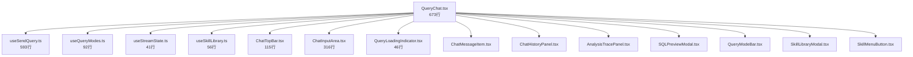
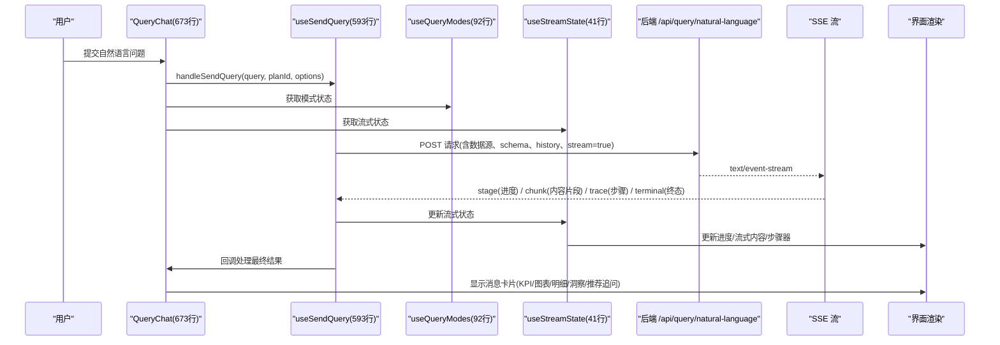
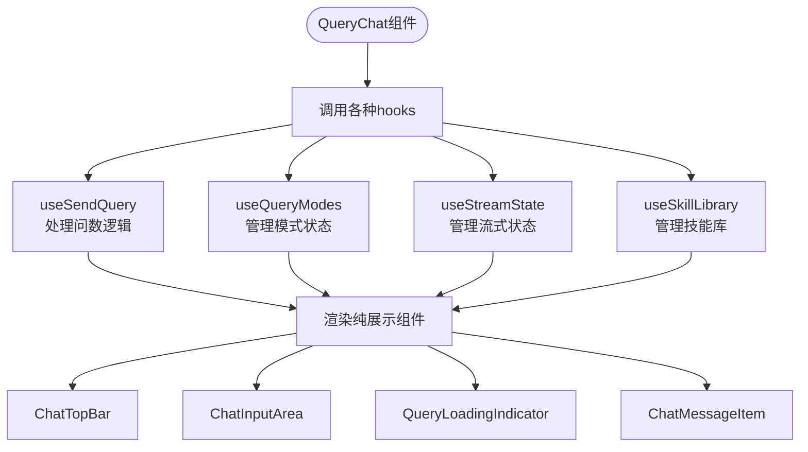
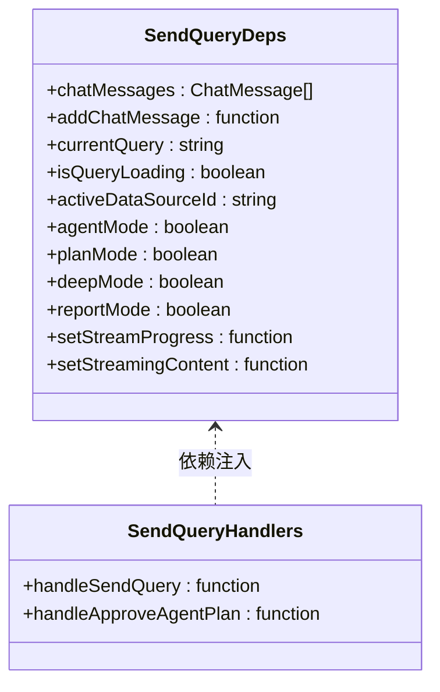
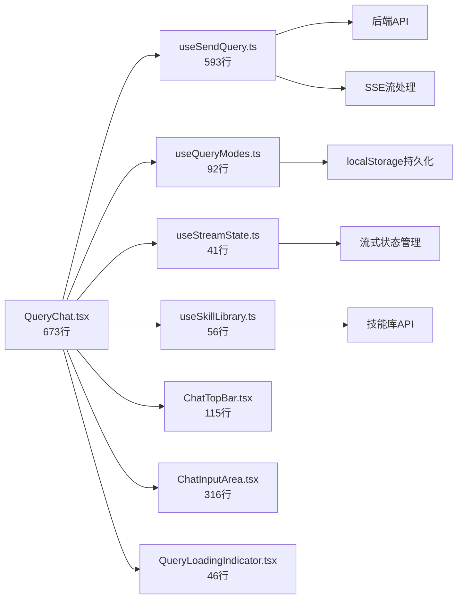

# 查询聊天组件

<cite>
**本文引用的文件**
- [QueryChat.tsx](file://src/components/query/QueryChat.tsx)
- [useSendQuery.ts](file://src/components/query/hooks/useSendQuery.ts)
- [useQueryModes.ts](file://src/components/query/hooks/useQueryModes.ts)
- [useStreamState.ts](file://src/components/query/hooks/useStreamState.ts)
- [useSkillLibrary.ts](file://src/components/query/hooks/useSkillLibrary.ts)
- [ChatTopBar.tsx](file://src/components/query/ChatTopBar.tsx)
- [ChatInputArea.tsx](file://src/components/query/ChatInputArea.tsx)
- [QueryLoadingIndicator.tsx](file://src/components/query/QueryLoadingIndicator.tsx)
- [ChatMessageItem.tsx](file://src/components/query/ChatMessageItem.tsx)
- [ChatHistoryPanel.tsx](file://src/components/query/ChatHistoryPanel.tsx)
- [AnalysisTracePanel.tsx](file://src/components/query/AnalysisTracePanel.tsx)
- [SQLPreviewModal.tsx](file://src/components/query/SQLPreviewModal.tsx)
- [QueryModeBar.tsx](file://src/components/query/QueryModeBar.tsx)
- [SkillLibraryModal.tsx](file://src/components/query/SkillLibraryModal.tsx)
- [SkillMenuButton.tsx](file://src/components/query/SkillMenuButton.tsx)
- [useConversationHistory.ts](file://src/hooks/useConversationHistory.ts)
- [sseStream.ts](file://src/utils/sseStream.ts)
- [analytics.ts](file://src/types/analytics.ts)
</cite>

## 更新摘要
**所做更改**
- QueryChat组件从1445行重构为673行，通过提取hooks和纯展示组件提升可维护性
- 新增useSendQuery hook封装问数提交与编排执行逻辑（593行）
- 新增useQueryModes hook管理模式开关及其持久化（92行）
- 新增useStreamState hook集中管理流式状态（41行）
- 新增useSkillLibrary hook处理技能库状态与加载（56行）
- 提取ChatTopBar纯展示组件（115行）用于顶部状态栏
- 提取ChatInputArea受控子组件（316行）处理输入区域
- 提取QueryLoadingIndicator纯展示组件（46行）处理加载指示器
- 移除了知识管理功能，使查询界面更加专注

## 目录
1. [简介](#简介)
2. [项目结构](#项目结构)
3. [核心组件](#核心组件)
4. [架构总览](#架构总览)
5. [详细组件分析](#详细组件分析)
6. [依赖关系分析](#依赖关系分析)
7. [性能与流式处理](#性能与流式处理)
8. [故障排查指南](#故障排查指南)
9. [结论](#结论)
10. [附录：API 参考与集成示例](#附录api-参考与集成示例)

## 简介
本组件集提供"自然语言问数"的完整前端能力：用户输入问题后，系统通过服务端链路生成 SQL、执行并返回结果；同时支持流式进度提示、Token 级内容增量渲染、推导过程回放、SQL 预览与编辑、历史记录管理与导出等。**v0.9.55版本中完成了重大架构重构，将QueryChat组件从1445行拆分为更小的、职责单一的组件和hooks，大幅提升了代码的可维护性和可读性**。整体围绕重构后的QueryChat主容器，配合各个子组件完成端到端交互。

## 项目结构
- **入口与编排**：QueryChat.tsx（673行，精简后的主容器，协调各hooks和组件）
- **业务逻辑hooks**：
  - useSendQuery.ts（593行，封装问数提交与编排执行）
  - useQueryModes.ts（92行，管理模式开关及持久化）
  - useStreamState.ts（41行，集中管理流式状态）
  - useSkillLibrary.ts（56行，处理技能库状态与加载）
- **纯展示组件**：
  - ChatTopBar.tsx（115行，顶部状态栏）
  - ChatInputArea.tsx（316行，输入区域）
  - QueryLoadingIndicator.tsx（46行，加载指示器）
- **消息渲染**：ChatMessageItem.tsx（文本、代码块、表格、图表、KPI、洞察等）
- **历史管理**：ChatHistoryPanel.tsx + useConversationHistory.ts（搜索、重问、删除、Markdown导出）
- **追踪回放**：AnalysisTracePanel.tsx（步骤器、时间线、按traceId回放）
- **SQL预览**：SQLPreviewModal.tsx（展示Thought Process、可编辑SQL、AI解释/优化建议）
- **模式控制**：QueryModeBar.tsx（计划/深度/报告模式、金额单位、模型选择）
- **技能管理**：SkillLibraryModal.tsx + SkillMenuButton.tsx（独立的技能库管理功能）

```mermaid
graph TB
A["QueryChat.tsx<br/>673行"] --> B["useSendQuery.ts<br/>593行"]
A --> C["useQueryModes.ts<br/>92行"]
A --> D["useStreamState.ts<br/>41行"]
A --> E["useSkillLibrary.ts<br/>56行"]
A --> F["ChatTopBar.tsx<br/>115行"]
A --> G["ChatInputArea.tsx<br/>316行"]
A --> H["QueryLoadingIndicator.tsx<br/>46行"]
A --> I["ChatMessageItem.tsx"]
A --> J["ChatHistoryPanel.tsx"]
A --> K["AnalysisTracePanel.tsx"]
A --> L["SQLPreviewModal.tsx"]
A --> M["QueryModeBar.tsx"]
A --> N["SkillLibraryModal.tsx"]
A --> O["SkillMenuButton.tsx"]
```

**图示来源**
- [QueryChat.tsx:1-675](file://src/components/query/QueryChat.tsx#L1-L675)
- [useSendQuery.ts:1-593](file://src/components/query/hooks/useSendQuery.ts#L1-L593)
- [useQueryModes.ts:1-92](file://src/components/query/hooks/useQueryModes.ts#L1-L92)
- [useStreamState.ts:1-41](file://src/components/query/hooks/useStreamState.ts#L1-L41)
- [useSkillLibrary.ts:1-56](file://src/components/query/hooks/useSkillLibrary.ts#L1-L56)

**章节来源**
- [QueryChat.tsx:1-675](file://src/components/query/QueryChat.tsx#L1-L675)
- [analytics.ts:1-458](file://src/types/analytics.ts#L1-L458)

## 核心组件
- **QueryChat**：精简后的主容器（673行），负责协调各hooks和组件，管理全局状态和业务逻辑
- **useSendQuery**：封装问数提交与编排执行的复杂逻辑，包括Agent编排、计划模式、报告模式、标准NL2SQL流式处理
- **useQueryModes**：管理四个模式开关（计划/Agent/深度/报告）及其localStorage持久化，实现模式互斥
- **useStreamState**：集中管理SSE流式相关状态，包括进度文案、SQL预览、流式内容缓冲、推导步骤链
- **useSkillLibrary**：处理技能库的状态管理、数据加载和菜单交互
- **ChatTopBar**：纯展示组件，显示当前数据源上下文、问数范围徽标、操作按钮
- **ChatInputArea**：受控子组件，包含快速问题推荐、自动补全、语音输入、模式选项行、技能入口
- **QueryLoadingIndicator**：纯展示组件，显示加载spinner、流式进度、SQL先行预览、实时推导步骤器
- **ChatMessageItem**：单条消息卡片渲染，支持多种结果类型和交互
- **ChatHistoryPanel**：历史对话列表、关键词检索、重问回填、删除、Markdown导出
- **AnalysisTracePanel**：查询推导过程可视化（步骤器与时间线），支持按traceId回放
- **SQLPreviewModal**：SQL预览与编辑，AI助手解释/优化，一键复制与重新运行
- **QueryModeBar**：模式开关（计划/深度/报告）、模板选择、金额单位、模型选择
- **SkillLibraryModal**：独立的技能库管理弹窗，支持个人技能维护、系统技能浏览、分享审核等功能
- **SkillMenuButton**：技能选择菜单按钮，提供快速技能填充和管理入口

**章节来源**
- [QueryChat.tsx:33-675](file://src/components/query/QueryChat.tsx#L33-L675)
- [useSendQuery.ts:107-593](file://src/components/query/hooks/useSendQuery.ts#L107-L593)
- [useQueryModes.ts:34-92](file://src/components/query/hooks/useQueryModes.ts#L34-L92)
- [useStreamState.ts:9-41](file://src/components/query/hooks/useStreamState.ts#L9-L41)
- [useSkillLibrary.ts:16-56](file://src/components/query/hooks/useSkillLibrary.ts#L16-L56)

## 架构总览
下图展示了重构后的架构设计，通过hooks和纯展示组件的拆分，实现了更好的关注点分离和代码复用。

```mermaid
sequenceDiagram
participant U as "用户"
participant QC as "QueryChat(673行)"
participant USQ as "useSendQuery(593行)"
participant UQM as "useQueryModes(92行)"
participant USS as "useStreamState(41行)"
participant API as "后端 /api/query/natural-language"
participant SSE as "SSE 流"
participant UI as "界面渲染"
U->>QC : 提交自然语言问题
QC->>USQ : handleSendQuery(query, planId, options)
QC->>UQM : 获取模式状态
QC->>USS : 获取流式状态
USQ->>API : POST 请求(含数据源、schema、history、stream=true)
API-->>SSE : text/event-stream
SSE-->>USQ : stage(进度) / chunk(内容片段) / trace(步骤) / terminal(终态)
USQ->>USS : 更新流式状态
USS->>UI : 更新进度/流式内容/步骤器
USQ->>QC : 回调处理最终结果
QC->>UI : 显示消息卡片(KPI/图表/明细/洞察/推荐追问)
```

**图示来源**
- [QueryChat.tsx:317-344](file://src/components/query/QueryChat.tsx#L317-L344)
- [useSendQuery.ts:139-549](file://src/components/query/hooks/useSendQuery.ts#L139-L549)
- [useStreamState.ts:9-41](file://src/components/query/hooks/useStreamState.ts#L9-L41)

## 详细组件分析

### QueryChat：重构后的主容器
**更新** 经过重构，QueryChat组件从1445行精简至673行，通过提取hooks和纯展示组件，实现了更好的关注点分离。

- **状态管理**：使用多个hooks管理不同领域的状态
  - useAnalyticsStore：消息状态、数据源、图表配置等
  - useAuthStore：用户信息
  - useModelCatalog：模型目录
  - useConversationHistory：对话历史管理
  - useSpeechInput：语音输入
  - useEffectiveAmountUnit：金额单位
- **业务逻辑委托**：
  - useSendQuery：处理问数提交、Agent编排、计划模式、报告模式、流式处理
  - useQueryModes：管理四个模式开关及其持久化
  - useStreamState：集中管理流式相关状态
  - useSkillLibrary：处理技能库状态和交互
- **纯展示组件**：
  - ChatTopBar：顶部状态栏
  - ChatInputArea：输入区域
  - QueryLoadingIndicator：加载指示器
- **事件处理**：
  - 反馈处理、问题编辑、澄清确认
  - 计划批准、Agent计划执行
  - 图表固定、报告跳转
  - 技能选择和库管理

```mermaid
flowchart TD
Start(["QueryChat组件"]) --> Hooks["调用各种hooks"]
Hooks --> SendQuery["useSendQuery<br/>处理问数逻辑"]
Hooks --> Modes["useQueryModes<br/>管理模式状态"]
Hooks --> Stream["useStreamState<br/>管理流式状态"]
Hooks --> Skills["useSkillLibrary<br/>管理技能库"]
SendQuery --> Components["渲染纯展示组件"]
Modes --> Components
Stream --> Components
Skills --> Components
Components --> TopBar["ChatTopBar"]
Components --> Input["ChatInputArea"]
Components --> Loading["QueryLoadingIndicator"]
Components --> Messages["ChatMessageItem"]
```

**图示来源**
- [QueryChat.tsx:33-675](file://src/components/query/QueryChat.tsx#L33-L675)

**章节来源**
- [QueryChat.tsx:33-675](file://src/components/query/QueryChat.tsx#L33-L675)

### useSendQuery：问数提交与编排执行
**新增** 这是重构中最重要的hook之一，封装了复杂的问数提交逻辑。

- **功能特性**：
  - Agent编排：先规划多能力步骤，用户批准后逐步执行
  - 计划模式：先生成分析计划，用户确认后执行
  - 报告模式：异步生成完整报告，轮询任务状态
  - 标准NL2SQL：流式处理，支持断线续传
- **流式处理**：
  - SSE事件解析：stage/chunk/trace/terminal事件处理
  - Token级流式输出：实时接收LLM生成内容的逐字推送
  - 断线续传：记录事件序号和traceId，网络中断时自动重试
  - 超时保护：300秒超时，区分业务终态错误与网络中断
- **响应消费**：
  - 拒答处理：问题与数据源无关时的友好提示
  - 歧义澄清：展示候选理解供用户选择
  - 结果聚合：统一处理JSON和SSE终端事件

```mermaid
classDiagram
class SendQueryDeps {
+chatMessages : ChatMessage[]
+addChatMessage : function
+currentQuery : string
+isQueryLoading : boolean
+activeDataSourceId : string
+agentMode : boolean
+planMode : boolean
+deepMode : boolean
+reportMode : boolean
+setStreamProgress : function
+setStreamingContent : function
}
class SendQueryHandlers {
+handleSendQuery : function
+handleApproveAgentPlan : function
}
SendQueryDeps <.. SendQueryHandlers : 依赖注入
```

**图示来源**
- [useSendQuery.ts:62-100](file://src/components/query/hooks/useSendQuery.ts#L62-L100)

**章节来源**
- [useSendQuery.ts:107-593](file://src/components/query/hooks/useSendQuery.ts#L107-L593)

### useQueryModes：模式开关管理
**新增** 统一管理四个模式开关及其持久化。

- **模式特性**：
  - 计划模式：「先制定计划」开关，localStorage持久化
  - Agent编排：「提问→规划→批准→执行」开关，与计划模式互斥
  - 深度分析：强制启用中间表清洗链，localStorage持久化
  - 报告模式：直接生成完整报告，支持模板选择
- **互斥逻辑**：计划模式与Agent编排互斥，开启一个自动关闭另一个
- **持久化存储**：使用localStorage保存模式状态，刷新页面后保持

**章节来源**
- [useQueryModes.ts:34-92](file://src/components/query/hooks/useQueryModes.ts#L34-L92)

### useStreamState：流式状态管理
**新增** 集中管理SSE流式相关的所有状态。

- **状态管理**：
  - streamProgress：服务端阶段事件推送的实时状态文案
  - streamPreviewSql：sql_ready/executed阶段携带的SQL，长等待期提前展示
  - streamingContent：LLM生成内容的增量缓冲区（打字机效果）
  - isReceivingStream：当前查询是否正在接收流式内容
  - liveTraceSteps：SSE trace事件实时追加的步骤链
- **状态重置**：终端事件到达后统一复位流式临时状态

**章节来源**
- [useStreamState.ts:9-41](file://src/components/query/hooks/useStreamState.ts#L9-L41)

### useSkillLibrary：技能库管理
**新增** 处理技能库的状态管理和交互逻辑。

- **功能特性**：
  - 技能数据加载：从/api/skills接口获取技能列表
  - 技能菜单管理：点击面板外部自动关闭的技能选择菜单
  - 技能库弹窗：打开/关闭技能库管理对话框
- **交互逻辑**：
  - 技能选择：选中后将提问模板填入输入框并聚焦
  - 菜单外点关闭：监听document mousedown事件实现
  - 数据同步：技能库操作后自动刷新技能列表

**章节来源**
- [useSkillLibrary.ts:16-56](file://src/components/query/hooks/useSkillLibrary.ts#L16-L56)

### ChatTopBar：顶部状态栏
**新增** 纯展示组件，显示当前数据源上下文和操作按钮。

- **显示内容**：
  - 当前数据源名称和连接状态
  - 问数范围徽标（scope白名单+敏感列过滤后）
  - 管理员可见的实际参与问数的表名清单
- **操作按钮**：
  - 导出对话：将当前数据源的对话导出为Markdown文件
  - 历史对话：查看服务端落库的对话历史
  - 重置对话：清空当前数据源的对话记录

**章节来源**
- [ChatTopBar.tsx:32-115](file://src/components/query/ChatTopBar.tsx#L32-L115)

### ChatInputArea：输入区域
**新增** 受控子组件，包含完整的输入功能和交互。

- **输入功能**：
  - 快速问题推荐：基于Schema的动态推荐
  - 自动补全下拉：实时查询推荐与Schema提示
  - 语音输入：实时录音识别，支持停止录音
  - 字数限制：与服务端对齐的500字上限
- **模式选项行**：集成QueryModeBar，支持计划/深度/报告模式切换
- **技能入口**：集成SkillMenuButton，提供快速技能填充
- **键盘导航**：↑↓切换建议，Enter选择，Tab补全，Esc关闭

**章节来源**
- [ChatInputArea.tsx:64-316](file://src/components/query/ChatInputArea.tsx#L64-L316)

### QueryLoadingIndicator：加载指示器
**新增** 纯展示组件，显示加载状态和实时进度。

- **显示内容**：
  - 加载spinner动画
  - 流式进度文案：实时更新的服务端阶段状态
  - SQL先行预览：阶段一完成即展示生成的SQL
  - 实时推导步骤器：展示已完成的推导环节

**章节来源**
- [QueryLoadingIndicator.tsx:18-46](file://src/components/query/QueryLoadingIndicator.tsx#L18-L46)

### ChatMessageItem：消息渲染逻辑
**更新** 继续支持多种内容类型的渲染和交互。

- **支持内容类型**：
  - 文本：欢迎语动态替换、普通问答文本
  - 代码块：生成的SQL查看入口
  - 表格：明细数据集分页展示
  - 图表：动态图表，支持自定义配置与全屏放大
  - KPI/洞察：关键指标与AI归因分析
- **交互功能**：
  - 反馈点赞/点踩，已提交置灰
  - 数据来源徽标（live/simulated）
  - 语义缓存命中提示与"重新查询"
  - DLP脱敏提示与敏感字段剔除提示
  - 歧义澄清选项确认
  - M2计划卡片：步骤、涉及表、批准/修改/取消
  - P1-7 Agent编排计划卡片：增强的参数可视化
  - 报告卡片：摘要与跳转报告中心
  - 全屏结果区：图表加高、明细分页放大
  - 推荐后续追问方向

**章节来源**
- [ChatMessageItem.tsx:32-769](file://src/components/query/ChatMessageItem.tsx#L32-L769)

### ChatHistoryPanel：历史记录管理
**更新** 继续提供完整的历史记录管理功能。

- **功能特性**：
  - 关键词搜索：回车触发搜索
  - 重问回填：点击后回填输入框
  - 单条删除：删除指定历史记录
  - Markdown导出：问题+回答+SQL，文件名取自数据源名称
- **数据隔离**：按当前数据源加载历史，切换数据源自动刷新
- **状态展示**：成功/降级状态、演示标记、创建时间、问题与回答摘要

**章节来源**
- [ChatHistoryPanel.tsx:21-116](file://src/components/query/ChatHistoryPanel.tsx#L21-L116)

### AnalysisTracePanel：查询分析追踪
**更新** 继续提供查询推导过程的可视化功能。

- **组件特性**：
  - TraceStepper：横向步骤器，实时追加SSE trace事件
  - TraceTimeline：垂直时间线，每个环节可展开查看输入/输出摘要与SQL
  - TraceReplay：按traceId拉取完整推导链，懒加载，失败提示
- **用途**：执行计划展示、性能指标监控（durationMs/rowCount）、错误诊断（fail状态）

**章节来源**
- [AnalysisTracePanel.tsx:11-196](file://src/components/query/AnalysisTracePanel.tsx#L11-L196)

### SQLPreviewModal：SQL预览与编辑
**更新** 继续提供SQL预览和编辑功能。

- **功能特性**：
  - 展示Thought Process（AI自然语言解析与意图推导链）
  - 可编辑SQL文本，支持复制、AI解释、AI优化建议
  - 一键重新运行SQL（回调父组件）
- **交互方式**：模态窗口，ESC或按钮关闭，底部显示执行时间与语法校验状态

**章节来源**
- [SQLPreviewModal.tsx:17-202](file://src/components/query/SQLPreviewModal.tsx#L17-L202)

### QueryModeBar：模式与参数控制
**更新** 继续提供模式开关和参数控制功能。

- **功能特性**：
  - 计划模式：先制定分析计划，确认后执行
  - 深度分析：强制启用中间表清洗链
  - 报告模式：直接生成完整报告，支持模板选择
  - 金额单位：模块覆盖全局设置
  - 模型自选：按部署目录选择引擎与模型，持久化
- **条件显示**：仅在数据库型数据源可用，AI开关关闭时整行隐藏

**章节来源**
- [QueryModeBar.tsx:9-151](file://src/components/query/QueryModeBar.tsx#L9-L151)

### SkillLibraryModal：技能库管理
**更新** 继续提供独立的技能库管理功能。

- **功能特性**：
  - 个人技能库：所有用户可维护自己的技能（新增/编辑/删除），并可发起分享至系统库
  - 系统技能库：全员只读浏览；管理员可新增/编辑/删除
  - 待审核分享（管理员）：批准（复制进系统库）或拒绝（退回私有）
- **交互方式**：模态窗口设计，支持Tab切换不同视图，表单验证与占位符识别

**章节来源**
- [SkillLibraryModal.tsx:37-475](file://src/components/query/SkillLibraryModal.tsx#L37-L475)

### SkillMenuButton：技能选择菜单
**更新** 继续提供技能选择菜单功能。

- **功能特性**：
  - 向上弹出技能选择面板，参照Qoder IDE「+」交互
  - 选中后将提问模板填入输入框并聚焦
  - 提供技能库管理入口
- **条件显示**：仅在AI开关开启且有可用技能时显示

**章节来源**
- [SkillMenuButton.tsx:25-91](file://src/components/query/SkillMenuButton.tsx#L25-L91)

## 依赖关系分析
**更新** 重构后的依赖关系更加清晰，通过hooks实现了更好的解耦。

- **QueryChat依赖**：
  - hooks：useSendQuery、useQueryModes、useStreamState、useSkillLibrary
  - 工具：useConversationHistory、useModelCatalog、useSpeechInput
  - 子组件：ChatTopBar、ChatInputArea、QueryLoadingIndicator等纯展示组件
- **useSendQuery依赖**：
  - 工具：apiFetch、readSseStream、pollTask
  - 类型：ChatMessage、QueryResultData、AgentPlanData等
  - 组件：AnalysisTracePanel的TraceStepInfo类型
- **纯展示组件依赖**：
  - 仅依赖props和第三方图标库，无业务逻辑
  - 通过回调函数与父组件通信

```mermaid
graph LR
QC["QueryChat.tsx<br/>673行"] --> USQ["useSendQuery.ts<br/>593行"]
QC --> UQM["useQueryModes.ts<br/>92行"]
QC --> USS["useStreamState.ts<br/>41行"]
QC --> USK["useSkillLibrary.ts<br/>56行"]
QC --> CTB["ChatTopBar.tsx<br/>115行"]
QC --> CIA["ChatInputArea.tsx<br/>316行"]
QC --> QLI["QueryLoadingIndicator.tsx<br/>46行"]
USQ --> API["后端API"]
USQ --> SSE["SSE流处理"]
UQM --> LS["localStorage持久化"]
USS --> STATE["流式状态管理"]
USK --> SKILLS["技能库API"]
```

**图示来源**
- [QueryChat.tsx:1-675](file://src/components/query/QueryChat.tsx#L1-L675)
- [useSendQuery.ts:1-593](file://src/components/query/hooks/useSendQuery.ts#L1-L593)
- [useQueryModes.ts:1-92](file://src/components/query/hooks/useQueryModes.ts#L1-L92)
- [useStreamState.ts:1-41](file://src/components/query/hooks/useStreamState.ts#L1-L41)
- [useSkillLibrary.ts:1-56](file://src/components/query/hooks/useSkillLibrary.ts#L1-L56)

**章节来源**
- [QueryChat.tsx:1-675](file://src/components/query/QueryChat.tsx#L1-L675)

## 性能与流式处理
**更新** 重构后的流式处理更加高效，通过hooks实现了更好的状态管理。

- **流式体验优化**：
  - 阶段事件实时更新进度与SQL先行回显，减少长等待焦虑
  - Token级内容增量渲染，提升感知速度
  - 断线续传基于事件序号与traceId，已完成阶段即时回放，避免重复执行
- **资源占用优化**：
  - 超时保护（300s）防止长时间阻塞
  - 全屏结果区按需渲染，减少初始负载
  - 通过hooks拆分，每个hook只管理相关的状态，减少不必要的重渲染
- **性能建议**：
  - 合理设置模型与深度分析开关，平衡质量与延迟
  - 对大结果集使用分页与筛选，避免DOM压力
  - 利用流式处理提供更好的用户体验

[本节为通用指导，无需特定文件引用]

## 故障排查指南
**更新** 重构后提供了更好的错误处理和调试能力。

- **常见问题**：
  - 查询超时：检查模型推理耗时与网络状况，必要时切换更快模型
  - 断线续传失败：确认服务端会话未过期且具备traceId；若仍失败，重新发起查询
  - 历史加载失败：检查数据源权限与网络连接
  - SQL解释/优化失败：确认后端服务可用与权限
  - 技能库访问失败：检查用户权限与网络连接
- **定位方法**：
  - 查看TraceTimeline中fail步骤与durationMs，定位瓶颈
  - 在SQLPreviewModal中复制SQL至数据库客户端验证
  - 使用ChatHistoryPanel导出Markdown复盘问题与结果
  - 检查SkillLibraryModal中的错误提示与状态反馈
- **调试技巧**：
  - 利用useSendQuery中的详细错误日志
  - 通过useStreamState监控流式状态变化
  - 使用浏览器开发者工具检查网络请求和SSE流

**章节来源**
- [AnalysisTracePanel.tsx:149-196](file://src/components/query/AnalysisTracePanel.tsx#L149-L196)
- [SQLPreviewModal.tsx:44-61](file://src/components/query/SQLPreviewModal.tsx#L44-L61)
- [useConversationHistory.ts:48-66](file://src/hooks/useConversationHistory.ts#L48-L66)
- [SkillLibraryModal.tsx:55-70](file://src/components/query/SkillLibraryModal.tsx#L55-L70)

## 结论
**更新** 本次重构是QueryChat组件的重大升级，通过合理的架构设计和代码拆分，显著提升了可维护性和扩展性。

该查询聊天组件通过模块化设计与流式技术，实现了自然语言问数的端到端体验：从输入、计划、执行到结果可视化与回溯，兼顾性能与可观测性。**v0.9.55版本的重构将原本1445行的巨型组件拆分为673行的主容器和多个职责单一的hooks及纯展示组件，大幅提升了代码的可维护性**。新的架构设计具有以下优势：

- **关注点分离**：业务逻辑集中在useSendQuery hook中，UI逻辑分布在纯展示组件中
- **状态管理优化**：通过useStreamState集中管理流式状态，避免状态分散
- **模式管理独立**：useQueryModes统一管理四个模式开关及其持久化
- **技能库解耦**：useSkillLibrary独立处理技能库相关逻辑
- **组件职责清晰**：ChatTopBar、ChatInputArea、QueryLoadingIndicator等纯展示组件只负责UI渲染

最新的架构设计不仅提高了代码质量，还为未来的功能扩展奠定了良好的基础。

[本节为总结，无需特定文件引用]

## 附录：API 参考与集成示例

### 组件 API 参考
**更新** 重构后的API更加清晰和模块化。

- **QueryChat**
  - 主要职责：协调各hooks和组件，管理全局状态
  - 关键状态：通过hooks管理，包括chatMessages、currentQuery、isQueryLoading等
  - 关键回调：handleSendQuery、handleFeedback、模式切换等
- **useSendQuery**
  - 依赖接口：SendQueryDeps（包含所有必要的状态和回调）
  - 返回接口：SendQueryHandlers（handleSendQuery、handleApproveAgentPlan）
- **useQueryModes**
  - 返回状态：planMode、agentMode、deepMode、reportMode
  - 返回方法：togglePlanMode、toggleAgentMode、toggleDeepMode、toggleReportMode
- **useStreamState**
  - 返回状态：streamProgress、streamPreviewSql、streamingContent、isReceivingStream、liveTraceSteps
  - 返回方法：resetStreamState
- **useSkillLibrary**
  - 返回状态：skills、skillLibraryOpen、skillMenuOpen、skillMenuRef
  - 返回方法：loadSkills
- **ChatTopBar**
  - Props：aiSwitchOff、activeDSName、queryContext、isAdmin、historyOpen、onExportConversation、onToggleHistoryPanel、onClearChat
- **ChatInputArea**
  - Props：包含输入、建议、语音、模式、技能等完整属性集
- **QueryLoadingIndicator**
  - Props：streamProgress、streamPreviewSql、liveTraceSteps
- **其他组件**：ChatMessageItem、ChatHistoryPanel、AnalysisTracePanel、SQLPreviewModal、QueryModeBar、SkillLibraryModal、SkillMenuButton的Props保持不变

**章节来源**
- [QueryChat.tsx:33-675](file://src/components/query/QueryChat.tsx#L33-L675)
- [useSendQuery.ts:62-100](file://src/components/query/hooks/useSendQuery.ts#L62-L100)
- [useQueryModes.ts:34-92](file://src/components/query/hooks/useQueryModes.ts#L34-L92)
- [useStreamState.ts:9-41](file://src/components/query/hooks/useStreamState.ts#L9-L41)
- [useSkillLibrary.ts:16-56](file://src/components/query/hooks/useSkillLibrary.ts#L16-L56)
- [ChatTopBar.tsx:16-25](file://src/components/query/ChatTopBar.tsx#L16-L25)
- [ChatInputArea.tsx:13-57](file://src/components/query/ChatInputArea.tsx#L13-L57)
- [QueryLoadingIndicator.tsx:5-12](file://src/components/query/QueryLoadingIndicator.tsx#L5-L12)

### 使用示例与集成指南
**更新** 重构后的集成更加简单和灵活。

- **基本集成**：
  - 在页面中引入QueryChat组件，确保数据源已连接且权限正确
  - 组件会自动初始化所需的hooks和子组件
- **模式配置**：
  - 通过useQueryModes管理四个模式开关
  - 模式状态自动持久化到localStorage
- **流式体验**：
  - 保持网络稳定，利用断线续传提升鲁棒性
  - 通过useStreamState监控流式状态变化
- **历史与导出**：
  - 使用ChatHistoryPanel进行历史检索与导出
  - 通过useConversationHistory管理对话历史
- **追踪与调试**：
  - 通过AnalysisTracePanel查看推导过程，定位性能瓶颈与错误
  - 使用SQLPreviewModal编辑与重新运行SQL，快速验证假设
- **技能管理**：
  - 通过SkillMenuButton快速选择预设技能模板
  - 使用SkillLibraryModal进行技能库的维护与管理
- **自定义扩展**：
  - 可以通过重写useSendQuery中的某些逻辑来定制问数行为
  - 纯展示组件可以轻松替换或扩展

### 重构收益说明
**新增** 本次重构带来的主要改进：

- **代码可维护性**：从1445行巨型组件拆分为多个小文件，每个文件职责单一
- **测试友好性**：hooks可以独立测试，纯展示组件易于单元测试
- **性能优化**：通过状态拆分减少不必要的重渲染
- **扩展性增强**：新功能可以添加到相应的hook或组件中，不影响现有代码
- **团队协作**：团队成员可以并行开发不同的功能模块

**章节来源**
- [QueryChat.tsx:1-675](file://src/components/query/QueryChat.tsx#L1-L675)

### 知识管理功能移除说明
**更新** v0.9.55版本中查询聊天界面已完全移除知识管理功能。

- **移除内容**：
  - Library图标导入和相关状态管理
  - showKnowledgePanel状态变量
  - 知识管理相关的模态对话框实现
- **迁移说明**：知识管理功能已迁移至独立的数据源管理面板
- **影响范围**：此变更使查询聊天界面更加专注于自然语言问数场景，提供了更简洁的用户体验

**章节来源**
- [QueryChat.tsx:1-675](file://src/components/query/QueryChat.tsx#L1-L675)

[本节为通用指导，无需特定文件引用]