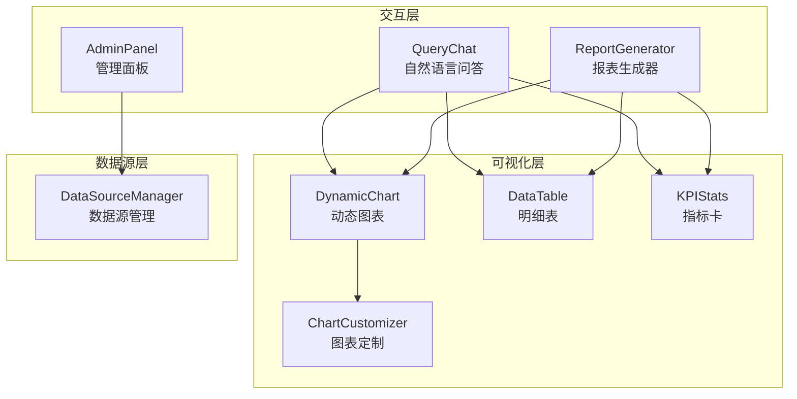
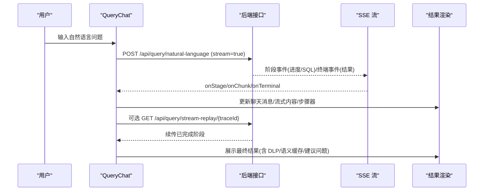
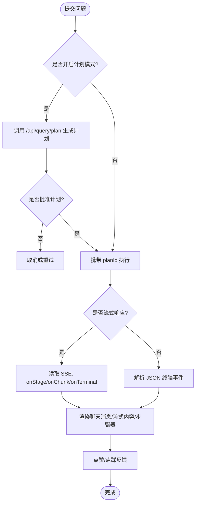
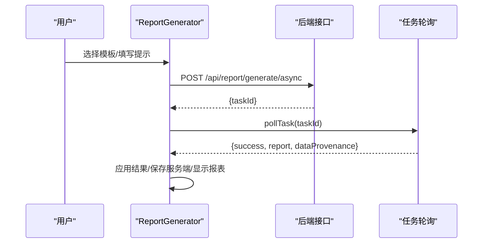
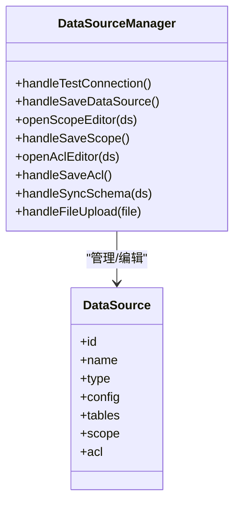
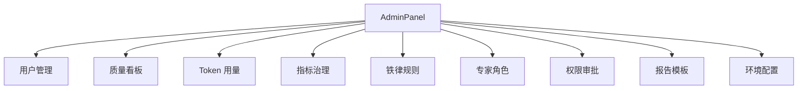
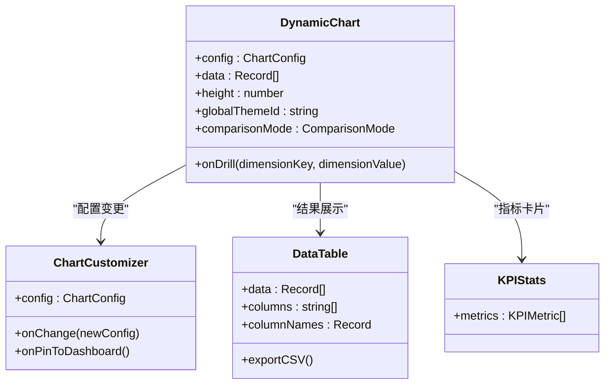
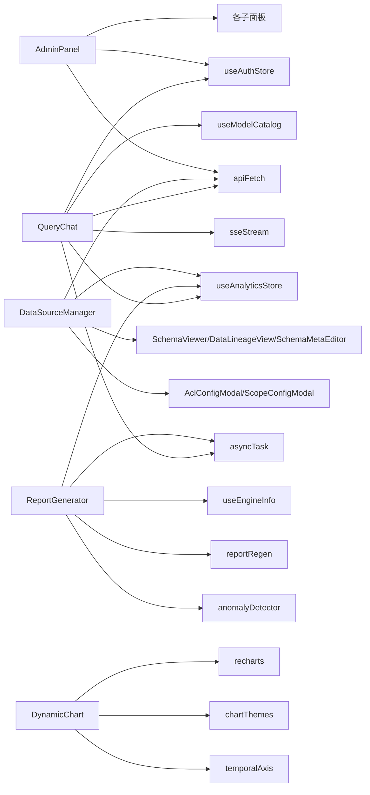

# 核心组件库

<cite>
**本文引用的文件**
- [QueryChat.tsx](file://src/components/query/QueryChat.tsx)
- [ReportGenerator.tsx](file://src/components/reports/ReportGenerator.tsx)
- [DataSourceManager.tsx](file://src/components/datasource/DataSourceManager.tsx)
- [AdminPanel.tsx](file://src/components/admin/AdminPanel.tsx)
- [DynamicChart.tsx](file://src/components/charts/DynamicChart.tsx)
- [DataTable.tsx](file://src/components/charts/DataTable.tsx)
- [KPIStats.tsx](file://src/components/charts/KPIStats.tsx)
- [ChartCustomizer.tsx](file://src/components/charts/ChartCustomizer.tsx)
</cite>

## 目录
1. [简介](#简介)
2. [项目结构](#项目结构)
3. [核心组件](#核心组件)
4. [架构总览](#架构总览)
5. [详细组件分析](#详细组件分析)
6. [依赖关系分析](#依赖关系分析)
7. [性能考量](#性能考量)
8. [故障排查指南](#故障排查指南)
9. [结论](#结论)
10. [附录：API 参考与最佳实践](#附录api-参考与最佳实践)

## 简介
本组件库围绕“智能问数据分析系统”的前端核心能力构建，覆盖自然语言查询、报表生成、数据源管理、系统管理与图表可视化五大模块。通过统一的 API 客户端与状态管理，实现从用户输入到 SQL 生成、执行、结果可视化的完整链路；同时提供可配置的报表模板、权限控制与监控指标，满足企业级数据分析场景。

## 项目结构
前端采用按功能域划分的组件组织方式：
- query：自然语言问答交互（QueryChat）
- reports：报表生成与管理（ReportGenerator）
- datasource：数据源接入与元数据管理（DataSourceManager）
- admin：系统管理面板（AdminPanel）
- charts：图表与表格组件（DynamicChart、DataTable、KPIStats、ChartCustomizer）

**图示来源**
- [QueryChat.tsx:1-120](file://src/components/query/QueryChat.tsx#L1-L120)
- [ReportGenerator.tsx:1-120](file://src/components/reports/ReportGenerator.tsx#L1-L120)
- [DataSourceManager.tsx:1-120](file://src/components/datasource/DataSourceManager.tsx#L1-L120)
- [AdminPanel.tsx:1-120](file://src/components/admin/AdminPanel.tsx#L1-L120)
- [DynamicChart.tsx:1-120](file://src/components/charts/DynamicChart.tsx#L1-L120)
- [DataTable.tsx:1-60](file://src/components/charts/DataTable.tsx#L1-L60)
- [KPIStats.tsx:1-40](file://src/components/charts/KPIStats.tsx#L1-L40)
- [ChartCustomizer.tsx:1-40](file://src/components/charts/ChartCustomizer.tsx#L1-L40)

**章节来源**
- [QueryChat.tsx:1-120](file://src/components/query/QueryChat.tsx#L1-L120)
- [ReportGenerator.tsx:1-120](file://src/components/reports/ReportGenerator.tsx#L1-L120)
- [DataSourceManager.tsx:1-120](file://src/components/datasource/DataSourceManager.tsx#L1-L120)
- [AdminPanel.tsx:1-120](file://src/components/admin/AdminPanel.tsx#L1-L120)

## 核心组件
- QueryChat：自然语言输入处理、SQL 预览、流式输出、计划模式、报告模式、SSE 断线续传、语义缓存提示、DLP 脱敏标记等。
- ReportGenerator：模板选择、自定义提示、异步生成、计划模式、自动重生成、历史报表维护与删除。
- DataSourceManager：数据库连接配置、Schema 同步、问数范围配置、访问控制（ACL）、本地文件导入。
- AdminPanel：用户管理、质量看板、Token 用量、指标治理、铁律规则、专家角色、权限审批、报告模板与环境配置。
- 图表组件库：基于 Recharts 的动态图表渲染、同比/环比对比、主题切换、缩放与下钻、堆叠模式、热力图与树图等。

**章节来源**
- [QueryChat.tsx:120-800](file://src/components/query/QueryChat.tsx#L120-L800)
- [ReportGenerator.tsx:120-706](file://src/components/reports/ReportGenerator.tsx#L120-L706)
- [DataSourceManager.tsx:120-997](file://src/components/datasource/DataSourceManager.tsx#L120-L997)
- [AdminPanel.tsx:120-621](file://src/components/admin/AdminPanel.tsx#L120-L621)
- [DynamicChart.tsx:120-954](file://src/components/charts/DynamicChart.tsx#L120-L954)

## 架构总览
整体流程以 QueryChat 为入口，结合 SSE 流式响应与任务轮询机制，串联 LLM 推理、SQL 生成与执行、结果可视化；ReportGenerator 提供异步报表生成与计划审批；DataSourceManager 负责数据源接入与权限控制；AdminPanel 提供系统级管理能力；图表组件统一渲染并支持交互。

**图示来源**
- [QueryChat.tsx:540-770](file://src/components/query/QueryChat.tsx#L540-L770)

**章节来源**
- [QueryChat.tsx:540-770](file://src/components/query/QueryChat.tsx#L540-L770)

## 详细组件分析

### 查询聊天组件（QueryChat）
- 自然语言输入处理：限制长度、语音输入回填、推荐问题与自动补全、多轮上下文摘要注入。
- SQL 生成与展示：SSE 阶段事件携带 SQL 预览，支持断线续传与 trace 追踪。
- 结果可视化：流式内容增量渲染、语义缓存命中提示、DLP 脱敏标签、建议问题、反馈闭环。
- 计划与报告模式：M2 先制定计划再执行；v0.5.0 报告模式直接生成完整报告（异步任务+轮询）。
- 模型自选与金额单位：持久化模型选择，金额单位随提问生效。

**图示来源**
- [QueryChat.tsx:400-770](file://src/components/query/QueryChat.tsx#L400-L770)

**章节来源**
- [QueryChat.tsx:400-770](file://src/components/query/QueryChat.tsx#L400-L770)

### 报表生成组件（ReportGenerator）
- 动态报表创建：模板选择、自定义关注点、金额单位选择。
- 图表配置：生成的报表包含 KPI、洞察与图表数组，支持同/环比对比与主题切换。
- 导出功能：PDF/PPT 导出（由后端服务支撑），前端通过任务轮询获取结果。
- 计划模式：M4 先生成查询计划供批准，再执行生成报表。
- 历史报表维护：修改条件重新生成、删除、自动重生成（数据版本变化时）。

**图示来源**
- [ReportGenerator.tsx:198-272](file://src/components/reports/ReportGenerator.tsx#L198-L272)

**章节来源**
- [ReportGenerator.tsx:198-272](file://src/components/reports/ReportGenerator.tsx#L198-L272)

### 数据源管理组件（DataSourceManager）
- 数据库连接配置：支持 PostgreSQL、MySQL、Greenplum 及 REST API 源；测试连接与保存。
- Schema 元数据展示：自动提取表结构与列信息，支持同步最新 Schema。
- 权限控制：问数范围（Scope）配置、访问控制（ACL）部门与用户授权。
- 文件导入：CSV/Excel/JSON 上传，服务端真实落库并识别表结构。

**图示来源**
- [DataSourceManager.tsx:116-420](file://src/components/datasource/DataSourceManager.tsx#L116-L420)

**章节来源**
- [DataSourceManager.tsx:116-420](file://src/components/datasource/DataSourceManager.tsx#L116-L420)

### 管理面板组件（AdminPanel）
- 用户管理：创建、启用/禁用、重置密码、修改部门、删除。
- 系统配置：环境配置、报告模板管理、铁律规则、专家角色。
- 监控指标：质量看板、操作指标、Token 用量查询、权限审批、DLP 下载审批。

**图示来源**
- [AdminPanel.tsx:223-325](file://src/components/admin/AdminPanel.tsx#L223-L325)

**章节来源**
- [AdminPanel.tsx:223-325](file://src/components/admin/AdminPanel.tsx#L223-L325)

### 图表组件库设计
- Recharts 集成：统一渲染柱状、折线、面积、饼环、雷达、散点、树图、热力图。
- 自定义图表类型：支持堆叠、下钻点击、差异百分比徽标、同比/环比对比。
- 响应式布局：ResponsiveContainer 自适应容器尺寸，Brush 缩放与滚轮缩放。
- 主题与对比度：主题切换与自动优化配色，确保可读性。

**图示来源**
- [DynamicChart.tsx:64-120](file://src/components/charts/DynamicChart.tsx#L64-L120)
- [ChartCustomizer.tsx:12-40](file://src/components/charts/ChartCustomizer.tsx#L12-L40)
- [DataTable.tsx:13-40](file://src/components/charts/DataTable.tsx#L13-L40)
- [KPIStats.tsx:4-20](file://src/components/charts/KPIStats.tsx#L4-L20)

**章节来源**
- [DynamicChart.tsx:64-120](file://src/components/charts/DynamicChart.tsx#L64-L120)
- [ChartCustomizer.tsx:12-40](file://src/components/charts/ChartCustomizer.tsx#L12-L40)
- [DataTable.tsx:13-40](file://src/components/charts/DataTable.tsx#L13-L40)
- [KPIStats.tsx:4-20](file://src/components/charts/KPIStats.tsx#L4-L20)

## 依赖关系分析
- QueryChat 依赖 useAnalyticsStore、useAuthStore、useModelCatalog、apiFetch、sseStream、asyncTask 等工具与状态。
- ReportGenerator 依赖 useAnalyticsStore、useEngineInfo、reportRegen、anomalyDetector、asyncTask。
- DataSourceManager 依赖 useAnalyticsStore、apiFetch、SchemaViewer、DataLineageView、SchemaMetaEditor、AclConfigModal、ScopeConfigModal。
- AdminPanel 依赖 apiFetch、useAuthStore 与各子面板（LlmUsagePanel、OpsMetricsPanel、DriftAlertPanel、ReportTemplateManager、MetricsPanel、IronRulesPanel、ExpertPersonasPanel、AccessRequestsPanel、DlpDownloadPanel、EnvironmentConfigPanel）。
- 图表组件依赖 recharts、chartThemes、temporalAxis、exportCsv。

**图示来源**
- [QueryChat.tsx:1-40](file://src/components/query/QueryChat.tsx#L1-L40)
- [ReportGenerator.tsx:1-35](file://src/components/reports/ReportGenerator.tsx#L1-L35)
- [DataSourceManager.tsx:1-35](file://src/components/datasource/DataSourceManager.tsx#L1-L35)
- [AdminPanel.tsx:1-35](file://src/components/admin/AdminPanel.tsx#L1-L35)
- [DynamicChart.tsx:1-60](file://src/components/charts/DynamicChart.tsx#L1-L60)

**章节来源**
- [QueryChat.tsx:1-40](file://src/components/query/QueryChat.tsx#L1-L40)
- [ReportGenerator.tsx:1-35](file://src/components/reports/ReportGenerator.tsx#L1-L35)
- [DataSourceManager.tsx:1-35](file://src/components/datasource/DataSourceManager.tsx#L1-L35)
- [AdminPanel.tsx:1-35](file://src/components/admin/AdminPanel.tsx#L1-L35)
- [DynamicChart.tsx:1-60](file://src/components/charts/DynamicChart.tsx#L1-L60)

## 性能考量
- 流式响应与断线续传：SSE 阶段事件实时更新进度，网络中断后凭 traceId 续传，避免重复执行 SQL。
- 异步任务轮询：报表生成与报告模式采用后台 worker 执行，前端轮询任务状态，不阻塞用户交互。
- 图表渲染优化：关闭饼图动画避免重渲染丢失标签；仅时间序列维度支持同/环比计算，无基线不编造数据。
- 数据范围控制：问数范围（Scope）与敏感列过滤减少上下文大小，提升 LLM 推理效率。
- 金额单位统一：SQL 侧已换算单位，前端不做二次缩写，避免冲突与性能损耗。

[本节为通用性能指导，无需特定文件引用]

## 故障排查指南
- 查询超时：前端设置 300 秒超时，若频繁出现可在系统管理中切换更快的模型。
- 断线续传失败：检查 traceId 与事件序号，确认服务端会话未过期且具备续传锚点。
- 报表生成失败：查看任务返回的 error 字段，确认模板与数据源可用；演示数据不可入库跳转。
- 数据源连接失败：测试连接通道，检查主机、端口、数据库名、用户名、密码与 schema；首次同步可能需补输密码。
- 权限不足：VIEWER 角色无报表生成权限；数据源被停用（disconnected）时入口禁用。
- 导出受限：P2-12 DLP 超阈值下载需审批；CSV 导出走服务端通道，自动嵌入溯源水印。

**章节来源**
- [QueryChat.tsx:750-770](file://src/components/query/QueryChat.tsx#L750-L770)
- [ReportGenerator.tsx:218-272](file://src/components/reports/ReportGenerator.tsx#L218-L272)
- [DataSourceManager.tsx:116-160](file://src/components/datasource/DataSourceManager.tsx#L116-L160)
- [DataTable.tsx:93-107](file://src/components/charts/DataTable.tsx#L93-L107)

## 结论
本组件库以 QueryChat 为核心入口，结合 ReportGenerator、DataSourceManager、AdminPanel 与图表组件，构建了完整的智能问数据分析前端能力。通过流式响应、异步任务、权限控制与可视化交互，满足企业级数据分析需求。建议在部署时合理配置数据源范围与权限，结合监控指标持续优化体验与性能。

[本节为总结性内容，无需特定文件引用]

## 附录：API 参考与最佳实践

### API 参考
- 自然语言查询
  - POST /api/query/natural-language：提交自然语言问题，支持 stream=true 获取 SSE 流式响应。
  - GET /api/query/stream-replay/{traceId}?after={seq}：断线续传，回放已完成阶段。
  - POST /api/query/feedback：提交点赞/点踩反馈。
- 报表生成
  - POST /api/report/generate/async：异步生成报表，返回 taskId，前端轮询任务。
  - POST /api/report/plan：生成报表查询计划，批准后携带 reportPlanId 生成。
  - POST /api/report/generate-from-query/async：从提问直接生成报告（异步）。
- 数据源管理
  - POST /api/datasources/test-connection：测试数据库连接。
  - POST /api/datasources：新增数据源（含 config、tables）。
  - PUT /api/datasources/{id}/scope：设置问数范围。
  - PUT /api/datasources/{id}/acl：设置访问控制（部门/用户）。
  - POST /api/datasources/{id}/sync-schema：同步 Schema。
  - POST /api/datasources/import-file：导入本地文件（CSV/Excel/JSON）。
- 管理面板
  - GET /api/admin/users：获取用户列表。
  - POST /api/admin/users：创建用户。
  - PUT /api/admin/users/{id}：更新用户状态/部门。
  - POST /api/admin/users/{id}/reset-password：重置密码。
  - DELETE /api/admin/users/{id}：删除用户。

**章节来源**
- [QueryChat.tsx:259-279](file://src/components/query/QueryChat.tsx#L259-L279)
- [QueryChat.tsx:650-770](file://src/components/query/QueryChat.tsx#L650-L770)
- [ReportGenerator.tsx:198-272](file://src/components/reports/ReportGenerator.tsx#L198-L272)
- [DataSourceManager.tsx:116-420](file://src/components/datasource/DataSourceManager.tsx#L116-L420)
- [AdminPanel.tsx:85-203](file://src/components/admin/AdminPanel.tsx#L85-L203)

### 使用示例
- 自然语言查询：在 QueryChat 输入框输入问题，可选择模型与金额单位，支持语音输入与推荐问题；提交后查看流式进度与最终结果。
- 报表生成：选择模板与自定义提示，点击生成；如需计划模式，先生成计划并批准后执行。
- 数据源管理：添加数据库连接，测试连通性后保存；配置问数范围与访问控制；导入本地文件进行问数。
- 管理面板：管理员可创建用户、调整角色与部门、查看 Token 用量与指标、配置环境与模板。

**章节来源**
- [QueryChat.tsx:396-462](file://src/components/query/QueryChat.tsx#L396-L462)
- [ReportGenerator.tsx:170-215](file://src/components/reports/ReportGenerator.tsx#L170-L215)
- [DataSourceManager.tsx:181-250](file://src/components/datasource/DataSourceManager.tsx#L181-L250)
- [AdminPanel.tsx:107-138](file://src/components/admin/AdminPanel.tsx#L107-L138)

### 最佳实践
- 合理设置问数范围与敏感列过滤，减少上下文大小，提升推理效率。
- 使用计划模式对复杂查询进行人工审核，确保 SQL 正确性与安全性。
- 利用流式响应与断线续传提升用户体验，避免网络波动导致的中断。
- 定期同步 Schema 与更新权限配置，保证数据源元数据与业务一致。
- 通过监控指标与反馈闭环持续优化回答质量与系统性能。

[本节为通用实践指导，无需特定文件引用]