# 管理面板组件

<cite>
**本文引用的文件**
- [AdminPanel.tsx](file://src/components/admin/AdminPanel.tsx)
- [ABTestDashboard.tsx](file://src/components/admin/ABTestDashboard.tsx)
- [MetricsPanel.tsx](file://src/components/admin/MetricsPanel.tsx)
- [LlmUsagePanel.tsx](file://src/components/admin/LlmUsagePanel.tsx)
- [EnvironmentConfigPanel.tsx](file://src/components/admin/EnvironmentConfigPanel.tsx)
- [IronRulesPanel.tsx](file://src/components/admin/IronRulesPanel.tsx)
- [ExpertPersonasPanel.tsx](file://src/components/admin/ExpertPersonasPanel.tsx)
- [FallbackApprovalPanel.tsx](file://src/components/admin/FallbackApprovalPanel.tsx)
- [OpsMetricsPanel.tsx](file://src/components/admin/OpsMetricsPanel.tsx)
- [ReportTemplateManager.tsx](file://src/components/admin/ReportTemplateManager.tsx)
- [abTest.ts](file://server/routes/abTest.ts)
- [abTest.ts](file://server/utils/abTest.ts)
- [admin.ts](file://server/routes/admin.ts)
- [metrics.ts](file://server/routes/metrics.ts)
- [ironRules.ts](file://server/routes/ironRules.ts)
- [expertPersonas.ts](file://server/routes/expertPersonas.ts)
- [fallbackApproval.ts](file://server/routes/fallbackApproval.ts)
- [query.ts](file://server/routes/query.ts)
</cite>

## 更新摘要
**变更内容**
- **统一UI设计**：为OpsMetricsPanel、LlmUsagePanel、ReportTemplateManager、ABTestDashboard实现标准化头部栏，提升界面一致性
- **FallbackApprovalPanel增强**：修复表格列对齐问题，改进批量操作确认对话框，优化空状态消息显示
- **视觉风格统一**：所有管理面板现在采用统一的设计模式，包含描述性标题和副标题
- **用户体验优化**：改进交互反馈和状态指示，提升管理员操作效率

## 目录
1. [简介](#简介)
2. [项目结构](#项目结构)
3. [核心组件](#核心组件)
4. [架构总览](#架构总览)
5. [详细组件分析](#详细组件分析)
6. [依赖关系分析](#依赖关系分析)
7. [性能与可用性](#性能与可用性)
8. [管理员操作指南](#管理员操作指南)
9. [监控告警配置](#监控告警配置)
10. [故障排查指南](#故障排查指南)
11. [结论](#结论)

## 简介
本文件面向系统管理员，系统化说明"管理面板"各子组件的职责、交互流程与运维要点。覆盖：
- AdminPanel：管理中心统一入口与导航
- MetricsPanel：指标治理（提议/审批/版本化）
- LlmUsagePanel：大模型调用统计（Token、耗时、成功率等）
- EnvironmentConfigPanel：运行时环境配置（参数调整与服务发现）
- IronRulesPanel：硬性规则（查询限制、安全策略、业务规则）
- ExpertPersonasPanel：专家角色（权限与提示词路由）
- FallbackApprovalPanel：困难样本审核（批量操作、实时搜索、Few-Shot注入）
- OpsMetricsPanel：运营指标监控（北极星指标、质量趋势分析）
- ReportTemplateManager：报告模板管理（预设模板与自定义模板）
- **ABTestDashboard：A/B Test 实验分析（策略对比、成功率分析、延迟监控）**

## 项目结构
管理面板位于前端 src/components/admin，由 AdminPanel 作为聚合容器，按标签页切换不同功能模块；后端对应 Express 路由提供数据与变更能力。

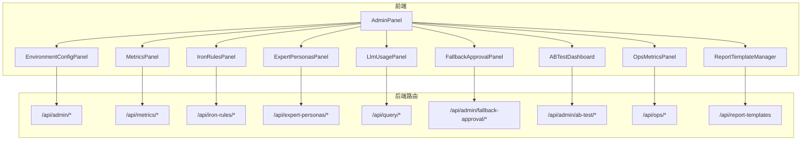

**图表来源**
- [AdminPanel.tsx:22-34](file://src/components/admin/AdminPanel.tsx#L22-L34)
- [abTest.ts:17-75](file://server/routes/abTest.ts#L17-L75)
- [metrics.ts:35-47](file://server/routes/metrics.ts#L35-L47)
- [ironRules.ts:21-33](file://server/routes/ironRules.ts#L21-L33)
- [expertPersonas.ts:16-26](file://server/routes/expertPersonas.ts#L16-L26)
- [admin.ts:212-233](file://server/routes/admin.ts#L212-L233)
- [query.ts:47-153](file://server/routes/query.ts#L47-L153)
- [fallbackApproval.ts:24-63](file://server/routes/fallbackApproval.ts#L24-L63)

章节来源
- [AdminPanel.tsx:57-617](file://src/components/admin/AdminPanel.tsx#L57-L617)

## 核心组件
- AdminPanel：统一入口，提供用户管理、质量看板、Token用量、指标治理、铁律规则、专家角色、权限审批、报告模板、环境配置、**Fallback审核**、**A/B Test实验分析**等标签页。
- MetricsPanel：语义指标库的提议、审批、停用、删除、版本回溯与导入导出。
- LlmUsagePanel：按时间范围查看用户与大模型引擎/模型的调用次数、Token消耗、平均耗时与成功率。
- EnvironmentConfigPanel：仅管理员可编辑的环境变量与系统参数，支持批量保存与审计记录。
- IronRulesPanel：数据源级强制规则，创建即生效，支持导入导出与状态切换。
- ExpertPersonasPanel：问数阶段二解读的角色路由配置，含关键词匹配、优先级与提示词。
- FallbackApprovalPanel：困难样本审核面板，支持批量操作、实时搜索过滤、优先级排序与Few-Shot注入。
- OpsMetricsPanel：运营指标监控面板，展示北极星指标、质量趋势分析和系统健康状态。
- ReportTemplateManager：报告模板管理面板，支持预设模板和自定义模板的CRUD操作。
- **ABTestDashboard：A/B Test 实验分析仪表板，提供实验策略对比分析、成功率对比、延迟分析和历史记录查看。**

章节来源
- [AdminPanel.tsx:57-617](file://src/components/admin/AdminPanel.tsx#L57-L617)
- [ABTestDashboard.tsx:118-444](file://src/components/admin/ABTestDashboard.tsx#L118-L444)
- [OpsMetricsPanel.tsx:111-427](file://src/components/admin/OpsMetricsPanel.tsx#L111-L427)
- [ReportTemplateManager.tsx:32-393](file://src/components/admin/ReportTemplateManager.tsx#L32-L393)
- [MetricsPanel.tsx:20-25](file://src/components/admin/MetricsPanel.tsx#L20-L25)
- [LlmUsagePanel.tsx:44-47](file://src/components/admin/LlmUsagePanel.tsx#L44-L47)
- [EnvironmentConfigPanel.tsx:30-40](file://src/components/admin/EnvironmentConfigPanel.tsx#L30-L40)
- [IronRulesPanel.tsx:17-21](file://src/components/admin/IronRulesPanel.tsx#L17-L21)
- [ExpertPersonasPanel.tsx:15-21](file://src/components/admin/ExpertPersonasPanel.tsx#L15-L21)
- [FallbackApprovalPanel.tsx:146-156](file://src/components/admin/FallbackApprovalPanel.tsx#L146-L156)

## 架构总览
管理面板通过统一的 AdminPanel 组织多个子面板，每个子面板负责特定领域的数据展示与管理。后端以 Express 路由暴露 RESTful API，配合鉴权中间件与业务服务完成数据读写与校验。

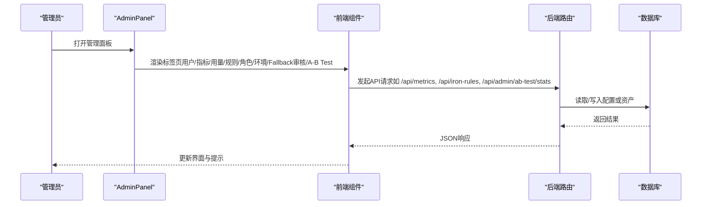

**图表来源**
- [AdminPanel.tsx:224-325](file://src/components/admin/AdminPanel.tsx#L224-L325)
- [abTest.ts:17-75](file://server/routes/abTest.ts#L17-L75)
- [metrics.ts:39-47](file://server/routes/metrics.ts#L39-L47)
- [ironRules.ts:25-33](file://server/routes/ironRules.ts#L25-L33)
- [admin.ts:212-233](file://server/routes/admin.ts#L212-L233)
- [fallbackApproval.ts:24-63](file://server/routes/fallbackApproval.ts#L24-L63)

## 详细组件分析

### AdminPanel（管理中心）
- 职责：聚合多类管理功能，提供标签页导航与全局通知。
- 关键能力：
  - 用户管理：创建、启用/禁用、重置密码、修改部门、删除（自我保护：不能删/改自己）。
  - 质量监控：集成漂移提醒、运维指标、**A/B Test实验分析**。
  - Token用量：跳转至 LlmUsagePanel。
  - 指标治理：跳转至 MetricsPanel。
  - 铁律规则：跳转至 IronRulesPanel。
  - 专家角色：跳转至 ExpertPersonasPanel。
  - 权限审批：访问申请与DLP下载审批。
  - 报告模板：跳转至 ReportTemplateManager。
  - 环境配置：跳转至 EnvironmentConfigPanel。
  - **Fallback审核：跳转至 FallbackApprovalPanel，处理困难样本审核。**
  - **A/B Test实验分析：在质量监控标签页中集成 ABTestDashboard 组件。**
- 交互要点：
  - 使用 apiFetch 调用 /api/admin/users 系列接口。
  - 统一 notice 提示，自动消失。
  - 根据当前用户角色控制可见与可操作项。

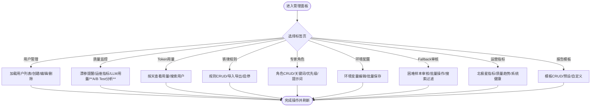

**图表来源**
- [AdminPanel.tsx:224-325](file://src/components/admin/AdminPanel.tsx#L224-L325)
- [AdminPanel.tsx:718-727](file://src/components/admin/AdminPanel.tsx#L718-L727)

章节来源
- [AdminPanel.tsx:57-617](file://src/components/admin/AdminPanel.tsx#L57-L617)
- [admin.ts:27-208](file://server/routes/admin.ts#L27-L208)

### ABTestDashboard（A/B Test 实验分析）
- 职责：为管理员提供 A/B Test 实验数据的可视化仪表板，对比不同 fallback 策略的效果。
- **样式更新**：实现了标准化头部栏设计，包含描述性标题和副标题，与其他管理面板保持一致的视觉风格。
- 关键能力：
  - **实验组对比**：Group A (Rule-Based) vs Group B (Human Approval + Few-Shot)。
  - **成功率对比**：显示两组策略的成功率差异及提升百分比。
  - **延迟分析**：对比两组策略的平均响应时间，识别性能影响。
  - **历史记录查看**：展示最近的实验记录，包含查询、失败SQL、分组、策略等信息。
  - **时间范围筛选**：支持最近24小时、7天、30天、90天的数据查看。
  - **实时刷新**：支持手动刷新获取最新统计数据。
- 数据流：
  - 统计数据：GET /api/admin/ab-test/stats?days=...
  - 历史记录：GET /api/admin/ab-test/records?limit=...
  - 快速概览：GET /api/admin/ab-test/overview

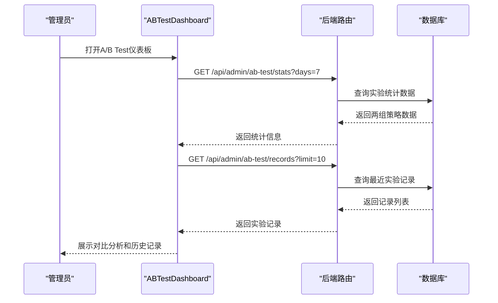

**图表来源**
- [ABTestDashboard.tsx:124-159](file://src/components/admin/ABTestDashboard.tsx#L124-L159)
- [abTest.ts:17-75](file://server/routes/abTest.ts#L17-L75)
- [abTest.ts:102-168](file://server/utils/abTest.ts#L102-L168)

章节来源
- [ABTestDashboard.tsx:118-444](file://src/components/admin/ABTestDashboard.tsx#L118-L444)
- [abTest.ts:1-130](file://server/routes/abTest.ts#L1-130)
- [abTest.ts:1-168](file://server/utils/abTest.ts#L1-L168)

### OpsMetricsPanel（运营指标监控）
- 职责：展示系统运营的核心指标，包括北极星指标、质量趋势分析和系统健康状态。
- **样式更新**：实现了标准化头部栏设计，包含"北极星运营指标"标题和描述性副标题，与其他管理面板保持视觉一致性。
- 关键能力：
  - **北极星指标**：点赞率、点踩率、澄清率、拒答率、自纠错触发率、缓存命中率。
  - **质量趋势**：支持按天和按周两种视图，展示成功率、缓存命中率等关键指标的趋势变化。
  - **系统健康**：问数总量、成功应答率、降级/错误率、平均端到端耗时。
  - **数据源下钻**：支持按数据源筛选查看特定数据源的指标。
  - **实时刷新**：支持手动刷新获取最新指标数据。
- 数据流：
  - 指标数据：GET /api/ops/metrics?days=...&dataSourceId=...

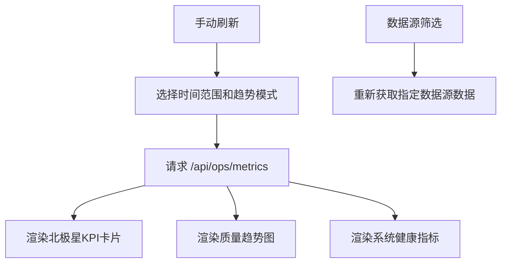

**图表来源**
- [OpsMetricsPanel.tsx:123-138](file://src/components/admin/OpsMetricsPanel.tsx#L123-L138)
- [OpsMetricsPanel.tsx:148-167](file://src/components/admin/OpsMetricsPanel.tsx#L148-L167)

章节来源
- [OpsMetricsPanel.tsx:111-427](file://src/components/admin/OpsMetricsPanel.tsx#L111-L427)

### ReportTemplateManager（报告模板管理）
- 职责：管理固定格式的报告模板，支持预设模板和自定义模板的CRUD操作。
- **样式更新**：实现了标准化头部栏设计，包含"报告模板管理"标题和描述性副标题，提升界面一致性。
- 关键能力：
  - **模板CRUD**：新增、编辑、删除报告模板。
  - **预设保护**：系统预设模板不可编辑或删除，确保系统稳定性。
  - **模板结构**：支持多章节模板，每章节包含标题、提示词和图表类型。
  - **图表类型**：支持柱状图、折线图、饼图、表格、数字等多种图表类型。
  - **模板复用**：模板可用于报告生成和计划任务。
- 数据流：
  - 模板列表：GET /api/report-templates
  - 创建模板：POST /api/report-templates
  - 更新模板：PUT /api/report-templates/:id
  - 删除模板：DELETE /api/report-templates/:id

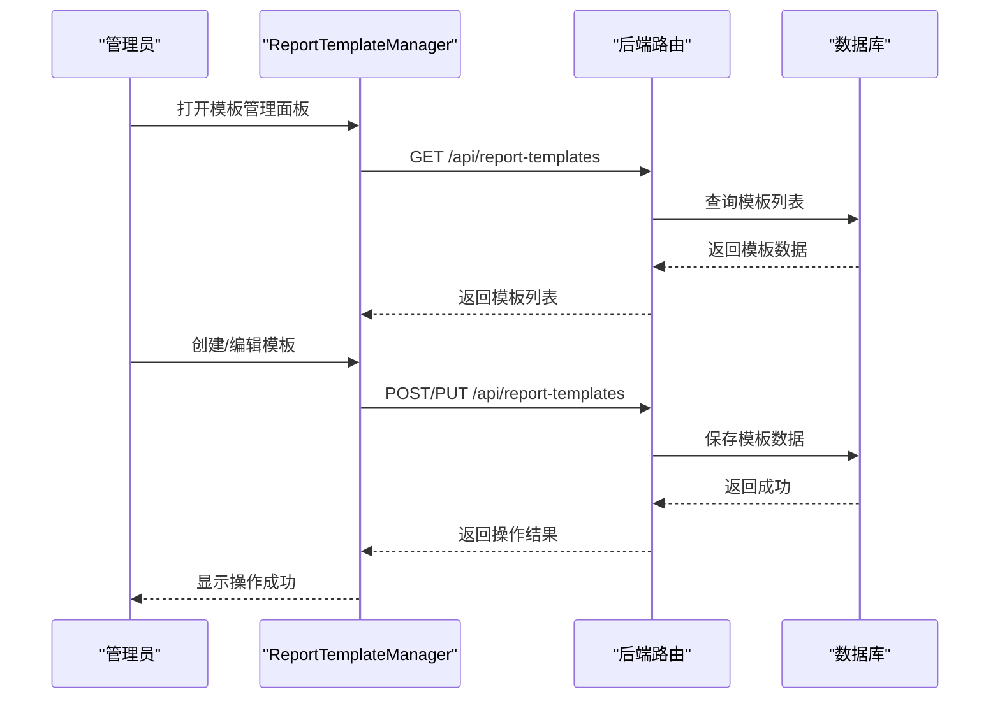

**图表来源**
- [ReportTemplateManager.tsx:52-67](file://src/components/admin/ReportTemplateManager.tsx#L52-L67)
- [ReportTemplateManager.tsx:111-144](file://src/components/admin/ReportTemplateManager.tsx#L111-L144)

章节来源
- [ReportTemplateManager.tsx:32-393](file://src/components/admin/ReportTemplateManager.tsx#L32-L393)

### MetricsPanel（指标治理）
- 职责：维护语义指标定义，支持提议-审批-版本化全生命周期。
- 关键能力：
  - 新建指标：ADMIN直接生效，ANALYST提交待审批。
  - 审批流：通过/驳回/重新提议。
  - 版本历史：查看快照，支持回溯到指定版本。
  - 导入导出：JSON备份，支持跳过/覆盖策略与Dry Run预检。
  - 状态管理：启用/停用。
- 数据流：
  - 列表：GET /api/metrics?dataSourceId=...
  - 创建：POST /api/metrics
  - 审批：POST /api/metrics/:id/approve|reject|repropose
  - 版本：GET /api/metrics/:id/versions
  - 回溯：POST /api/metrics/:id/restore
  - 导入导出：GET /api/metrics/export, POST /api/metrics/import

```mermaid
sequenceDiagram
participant A as "分析师"
participant M as "MetricsPanel"
participant S as "后端路由"
participant D as "数据库"
A->>M : 填写指标表单并提交
M->>S : POST /api/metrics
S->>D : 插入指标(状态PENDING/ACTION)
D-->>S : 返回ID与状态
S-->>M : 成功(状态)
Note over A,M : ADMIN可直接生效; ANALYST需等待审批
```

**图表来源**
- [MetricsPanel.tsx:131-160](file://src/components/admin/MetricsPanel.tsx#L131-L160)
- [metrics.ts:49-63](file://server/routes/metrics.ts#L49-L63)

章节来源
- [MetricsPanel.tsx:67-666](file://src/components/admin/MetricsPanel.tsx#L67-L666)
- [metrics.ts:35-302](file://server/routes/metrics.ts#L35-L302)

### LlmUsagePanel（大模型使用统计）
- 职责：按时间范围查看LLM调用统计，包括用户维度与引擎/模型维度。
- **样式更新**：实现了标准化头部栏设计，包含"LLM Token 用量"标题和描述性副标题，提升界面一致性。
- 关键能力：
  - 时间范围：近7/14/30/90天。
  - 用户搜索：按用户名过滤。
  - KPI卡片：Token总消耗、调用次数、输入/输出Token、活跃用户数。
  - 表格：用户维度与引擎/模型维度汇总，包含成功率与平均耗时。
- 数据流：
  - GET /api/system/llm-usage?days=...

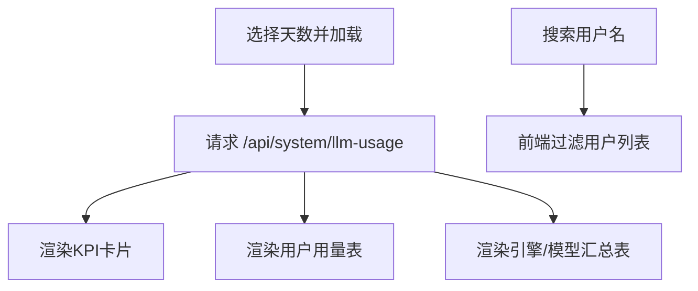

**图表来源**
- [LlmUsagePanel.tsx:56-76](file://src/components/admin/LlmUsagePanel.tsx#L56-L76)
- [LlmUsagePanel.tsx:103-186](file://src/components/admin/LlmUsagePanel.tsx#L103-L186)
- [LlmUsagePanel.tsx:201-351](file://src/components/admin/LlmUsagePanel.tsx#L201-L351)

章节来源
- [LlmUsagePanel.tsx:44-355](file://src/components/admin/LlmUsagePanel.tsx#L44-L355)

### EnvironmentConfigPanel（环境配置管理）
- 职责：管理员在线编辑系统运行参数，即时生效且记录审计日志。
- 关键能力：
  - 分类显示：数据库、AI引擎、认证授权、系统参数。
  - 敏感字段：读取时脱敏，编辑时明文输入。
  - 批量保存：PUT /api/admin/env-config，白名单校验。
  - 审计：每次更新写入审计日志。
- 数据流：
  - GET /api/admin/env-config
  - PUT /api/admin/env-config

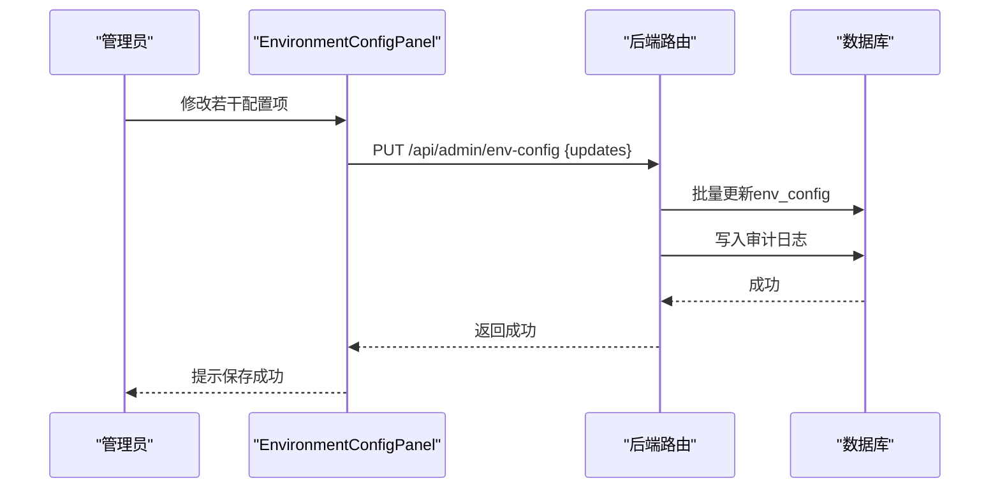

**图表来源**
- [EnvironmentConfigPanel.tsx:64-85](file://src/components/admin/EnvironmentConfigPanel.tsx#L64-L85)
- [admin.ts:235-292](file://server/routes/admin.ts#L235-L292)

章节来源
- [EnvironmentConfigPanel.tsx:30-209](file://src/components/admin/EnvironmentConfigPanel.tsx#L30-L209)
- [admin.ts:212-292](file://server/routes/admin.ts#L212-L292)

### IronRulesPanel（硬性规则管理）
- 职责：维护数据源级强制规则，全部ACTIVE规则在问数/报表阶段一注入，最高优先级。
- 关键能力：
  - 新建/编辑/启停/删除。
  - 导入导出：JSON备份，支持跳过/覆盖与Dry Run。
  - 实时生效：创建即对问数生效。
- 数据流：
  - GET /api/iron-rules?dataSourceId=...
  - POST /api/iron-rules
  - PUT /api/iron-rules/:id
  - DELETE /api/iron-rules/:id
  - GET /api/iron-rules/export
  - POST /api/iron-rules/import

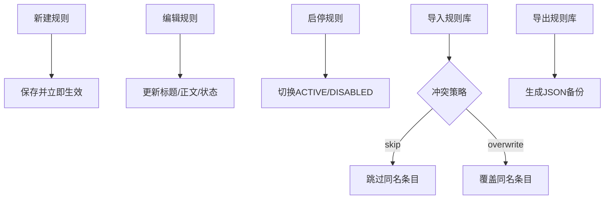

**图表来源**
- [IronRulesPanel.tsx:102-179](file://src/components/admin/IronRulesPanel.tsx#L102-L179)
- [ironRules.ts:35-149](file://server/routes/ironRules.ts#L35-L149)

章节来源
- [IronRulesPanel.tsx:39-581](file://src/components/admin/IronRulesPanel.tsx#L39-L581)
- [ironRules.ts:1-149](file://server/routes/ironRules.ts#L1-L149)

### ExpertPersonasPanel（专家角色管理）
- 职责：配置问数阶段二解读的专家角色，决定AI分析视角与提示词。
- 关键能力：
  - 角色CRUD：标签、触发关键词、rolePrompt、优先级、状态。
  - 默认角色：兜底，不可禁用/删除，仅可编辑标签与提示词。
  - 内置角色：可编辑但不可删除。
  - 即时生效：服务端缓存失效后新请求生效。
- 数据流：
  - GET /api/expert-personas
  - POST /api/expert-personas
  - PUT /api/expert-personas/:id
  - DELETE /api/expert-personas/:id

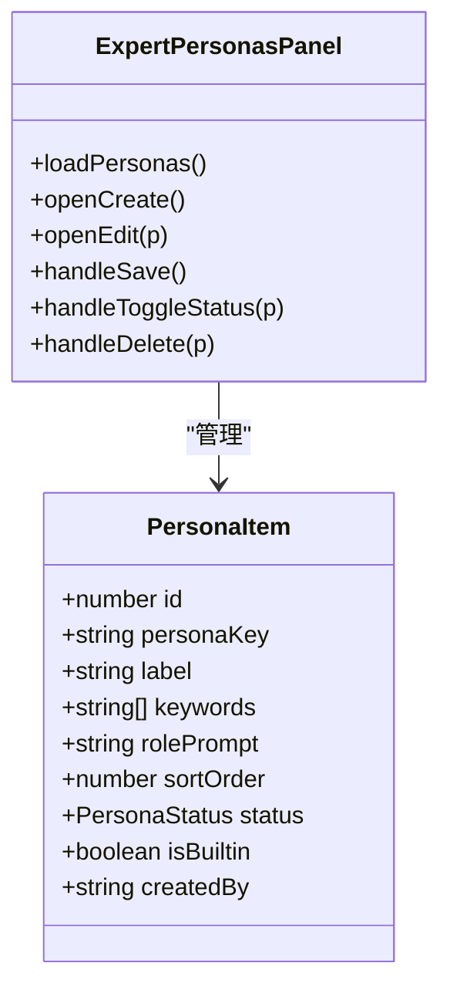

**图表来源**
- [ExpertPersonasPanel.tsx:25-45](file://src/components/admin/ExpertPersonasPanel.tsx#L25-L45)
- [ExpertPersonasPanel.tsx:81-190](file://src/components/admin/ExpertPersonasPanel.tsx#L81-L190)
- [expertPersonas.ts:19-67](file://server/routes/expertPersonas.ts#L19-L67)

章节来源
- [ExpertPersonasPanel.tsx:62-420](file://src/components/admin/ExpertPersonasPanel.tsx#L62-L420)
- [expertPersonas.ts:1-70](file://server/routes/expertPersonas.ts#L1-L70)

### FallbackApprovalPanel（困难样本审核）
- 职责：审核和管理NL2SQL系统中的困难样本，支持批量操作、实时搜索过滤与Few-Shot注入。
- **样式更新**：修复了表格列对齐问题，改进了批量操作确认对话框，优化了空状态消息显示，提升了整体用户体验。
- 关键能力：
  - **样本列表**：按优先级分数排序，显示原始查询、错误SQL、错误消息、优先级分、使用策略、状态。
  - **实时搜索**：支持按查询内容或SQL关键字搜索过滤。
  - **状态筛选**：支持按待审核、审核中、已采纳、已拒绝状态筛选。
  - **批量操作**：支持多选批量采纳或拒绝样本，增强了确认对话框的用户体验。
  - **单个审核**：打开审核对话框，编辑期望SQL，执行采纳或拒绝操作。
  - **Few-Shot注入**：采纳的样本自动注入到Few-Shot学习库，提升后续问数准确率。
  - **优先级排序**：基于主动学习算法计算优先级分数，高优先级样本优先处理。
- 数据流：
  - 列表：GET /api/admin/fallback-approval
  - 批量操作：POST /api/admin/fallback-approval/batch
  - 单个审核：PUT /api/admin/fallback-approval/:id/review

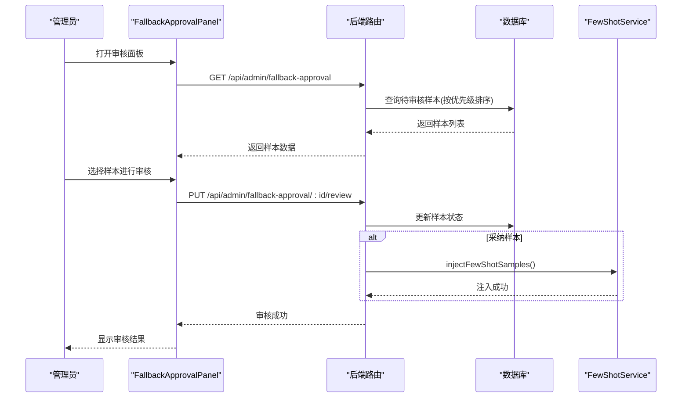

**图表来源**
- [FallbackApprovalPanel.tsx:158-172](file://src/components/admin/FallbackApprovalPanel.tsx#L158-L172)
- [FallbackApprovalPanel.tsx:211-230](file://src/components/admin/FallbackApprovalPanel.tsx#L211-L230)
- [FallbackApprovalPanel.tsx:233-267](file://src/components/admin/FallbackApprovalPanel.tsx#L233-L267)
- [fallbackApproval.ts:24-63](file://server/routes/fallbackApproval.ts#L24-L63)
- [fallbackApproval.ts:66-121](file://server/routes/fallbackApproval.ts#L66-L121)
- [fallbackApproval.ts:124-172](file://server/routes/fallbackApproval.ts#L124-L172)

章节来源
- [FallbackApprovalPanel.tsx:146-455](file://src/components/admin/FallbackApprovalPanel.tsx#L146-L455)
- [fallbackApproval.ts:1-175](file://server/routes/fallbackApproval.ts#L1-L175)

## 依赖关系分析
- 前端依赖：
  - AdminPanel 聚合所有子面板，并通过 apiFetch 调用后端。
  - 各子面板依赖 useAuthStore/useAnalyticsStore 获取当前用户与数据源信息。
  - **ABTestDashboard 依赖后端 /api/admin/ab-test/* 路由获取实验数据。**
  - **FallbackApprovalPanel 依赖 activeLearning 工具进行优先级计算。**
  - **OpsMetricsPanel 依赖后端 /api/ops/* 路由获取运营指标。**
  - **ReportTemplateManager 依赖后端 /api/report-templates 路由管理模板。**
- 后端依赖：
  - 路由层统一鉴权：authMiddleware + requireRole('ADMIN'|'ANALYST')。
  - 业务逻辑封装在 query/infra/llm 等模块中。
  - 安全执行层：executeSafeSql 保证SQL只读与白名单。
  - 审计与限流：auditLog、userQueryLimit、rateLimiter。
  - **A/B Test框架：abTest utils 提供实验分组、记录创建和统计分析功能。**
  - **Few-Shot注入：injectFewShotSamples 将采纳的样本注入学习库。**

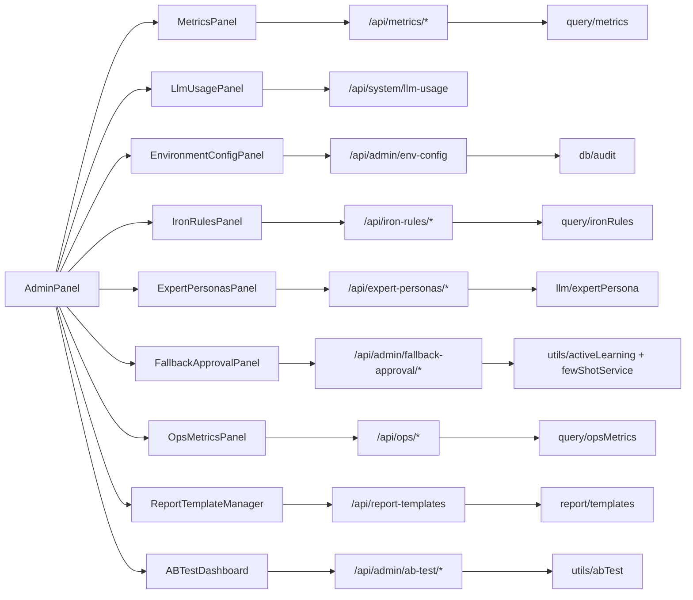

**图表来源**
- [abTest.ts:17-75](file://server/routes/abTest.ts#L17-L75)
- [abTest.ts:102-168](file://server/utils/abTest.ts#L102-L168)
- [metrics.ts:35-302](file://server/routes/metrics.ts#L35-L302)
- [ironRules.ts:1-149](file://server/routes/ironRules.ts#L1-L149)
- [expertPersonas.ts:1-70](file://server/routes/expertPersonas.ts#L1-L70)
- [admin.ts:212-292](file://server/routes/admin.ts#L212-L292)
- [fallbackApproval.ts:24-175](file://server/routes/fallbackApproval.ts#L24-L175)

章节来源
- [abTest.ts:1-130](file://server/routes/abTest.ts#L1-130)
- [abTest.ts:1-168](file://server/utils/abTest.ts#L1-L168)
- [metrics.ts:35-302](file://server/routes/metrics.ts#L35-L302)
- [ironRules.ts:1-149](file://server/routes/ironRules.ts#L1-L149)
- [expertPersonas.ts:1-70](file://server/routes/expertPersonas.ts#L1-L70)
- [admin.ts:212-292](file://server/routes/admin.ts#L212-L292)
- [fallbackApproval.ts:24-175](file://server/routes/fallbackApproval.ts#L24-L175)

## 性能与可用性
- 前端优化：
  - 列表加载延迟执行避免阻塞首次渲染。
  - 本地搜索与过滤减少网络开销。
  - 导入导出采用Blob与FormData，支持大文件预览与Dry Run。
  - **ABTestDashboard 支持时间范围筛选和实时刷新，优化大数据量下的用户体验。**
  - **Fallback面板支持实时搜索过滤，提升大数据量下的用户体验。**
  - **OpsMetricsPanel 支持数据源下钻和趋势粒度切换，提升数据分析灵活性。**
  - **ReportTemplateManager 支持模板结构验证和批量操作，提升模板管理效率。**
- 后端保护：
  - 并发限流与串行化：智能问数主链路限制每用户并发为1，防止昂贵LLM调用拥塞。
  - 频率限制：用户查询速率限制，超限返回429。
  - 安全执行：所有SQL走SELECT-only安全执行层，结合白名单与行级过滤。
  - 审计与限流：关键操作记录审计日志，异常路径快速失败。
  - **A/B Test框架支持流量分配和实验隔离，确保实验准确性。**
  - **批量操作分批处理，防止SQL过长导致的性能问题。**

章节来源
- [query.ts:97-116](file://server/routes/query.ts#L97-L116)
- [metrics.ts:67-134](file://server/routes/metrics.ts#L67-L134)
- [abTest.ts:13-22](file://server/utils/abTest.ts#L13-L22)
- [fallbackApproval.ts:74-114](file://server/routes/fallbackApproval.ts#L74-L114)

## 管理员操作指南
- 用户管理
  - 创建账号：填写用户名、显示名、初始密码、部门、角色。
  - 启用/禁用：注意不能禁用或删除当前登录的管理员。
  - 重置密码：设置新密码后目标用户下次登录需改密。
  - 修改部门：用于数据源授权匹配。
- 指标治理
  - 分析师：提交指标提议，等待管理员审批。
  - 管理员：审批通过/驳回，编辑、停用、删除，查看版本历史并回溯。
  - 导入导出：使用JSON备份进行跨环境迁移，支持Dry Run预检。
- 大模型用量
  - 选择时间范围查看Token消耗与调用成功率。
  - 按用户搜索定位高消耗账号。
  - 按引擎/模型对比成本与性能。
- 硬性规则
  - 新建规则：标题唯一，正文自然语言描述，创建即生效。
  - 启停规则：影响后续问数与报表生成的约束。
  - 导入导出：跨环境同步规则集。
- 专家角色
  - 新建角色：设置标签、关键词、优先级、提示词。
  - 默认角色：兜底，不可禁用/删除。
  - 内置角色：可编辑但不可删除。
- 环境配置
  - 仅管理员可见，修改后即时生效。
  - 敏感字段读取时脱敏，保存时白名单校验并记录审计。
- 困难样本审核
  - 查看样本：进入"Fallback审核"标签页，查看待审核样本列表。
  - 搜索过滤：使用搜索框按查询内容或SQL关键字过滤样本。
  - 状态筛选：按待审核、已采纳、已拒绝状态筛选样本。
  - 单个审核：点击"审核"按钮，编辑期望SQL，执行采纳或拒绝。
  - 批量操作：勾选多个样本，执行批量采纳或拒绝，增强确认对话框提升操作安全性。
  - Few-Shot注入：采纳的样本自动注入学习库，提升后续问数准确率。
- 运营指标监控
  - 查看北极星指标：进入"质量监控"标签页，查看点赞率、点踩率、澄清率等核心指标。
  - 趋势分析：支持按天和按周两种视图，观察指标变化趋势。
  - 数据源下钻：可选择特定数据源查看详细指标。
  - 系统健康：关注问数总量、成功应答率、降级率和平均耗时。
- 报告模板管理
  - 模板浏览：查看所有预设和自定义模板。
  - 模板编辑：编辑自定义模板的章节、提示词和图表类型。
  - 模板创建：创建新的报告模板，支持多章节结构。
  - 模板删除：删除不需要的自定义模板。
- **A/B Test 实验分析**
  - **查看仪表板：进入"质量监控"标签页，找到 A/B Test 实验分析组件。**
  - **时间范围选择：支持最近24小时、7天、30天、90天的数据查看。**
  - **策略对比：观察 Group A (Rule-Based) 与 Group B (Human Approval) 的成功率和延迟对比。**
  - **历史记录查看：浏览最近的实验记录，了解具体查询的处理情况。**
  - **数据刷新：点击刷新按钮获取最新的实验统计数据。**

章节来源
- [AdminPanel.tsx:107-203](file://src/components/admin/AdminPanel.tsx#L107-L203)
- [ABTestDashboard.tsx:197-212](file://src/components/admin/ABTestDashboard.tsx#L197-L212)
- [ABTestDashboard.tsx:370-440](file://src/components/admin/ABTestDashboard.tsx#L370-L440)
- [OpsMetricsPanel.tsx:197-212](file://src/components/admin/OpsMetricsPanel.tsx#L197-L212)
- [ReportTemplateManager.tsx:197-212](file://src/components/admin/ReportTemplateManager.tsx#L197-L212)
- [MetricsPanel.tsx:131-241](file://src/components/admin/MetricsPanel.tsx#L131-L241)
- [LlmUsagePanel.tsx:56-186](file://src/components/admin/LlmUsagePanel.tsx#L56-L186)
- [IronRulesPanel.tsx:102-179](file://src/components/admin/IronRulesPanel.tsx#L102-L179)
- [ExpertPersonasPanel.tsx:123-190](file://src/components/admin/ExpertPersonasPanel.tsx#L123-L190)
- [EnvironmentConfigPanel.tsx:64-85](file://src/components/admin/EnvironmentConfigPanel.tsx#L64-L85)
- [FallbackApprovalPanel.tsx:158-267](file://src/components/admin/FallbackApprovalPanel.tsx#L158-L267)

## 监控告警配置
- 指标治理
  - 建议将"待审批指标数量"纳入看板，及时推动审批闭环。
  - 关注指标版本回溯频率，评估口径稳定性。
- 大模型用量
  - 监控Token消耗趋势与成功率，识别异常峰值。
  - 按引擎/模型对比成本，优化模型选择与路由。
- 硬性规则
  - 监控生效规则数量，确保关键红线始终生效。
  - 定期审查规则正文，避免过时或冲突。
- 专家角色
  - 监控命中角色分布，验证关键词覆盖度。
  - 默认角色兜底比例过高时需补充关键词。
- 环境配置
  - 审计日志跟踪配置变更，建立变更基线。
  - 敏感字段变更后验证服务连通性。
- 困难样本审核
  - 监控待审核样本数量，及时处理积压样本。
  - 关注样本优先级分数分布，优化审核策略。
  - 跟踪Few-Shot注入成功率，确保学习库质量。
  - 监控采纳/拒绝比例，评估样本质量。
- 运营指标监控
  - 监控北极星指标变化趋势，及时发现系统问题。
  - 关注点踩率和拒答率，优化问数质量。
  - 监控缓存命中率和自纠错触发率，评估系统性能。
  - 关注平均端到端耗时，识别性能瓶颈。
- 报告模板管理
  - 监控模板使用情况，了解哪些模板最常用。
  - 定期检查预设模板的适用性，必要时更新。
  - 关注自定义模板的质量，确保模板有效性。
- **A/B Test 实验分析**
  - **监控实验数据增长情况，确保实验正常运行。**
  - **关注两组策略的成功率差异，评估策略效果。**
  - **监控延迟变化，识别性能影响。**
  - **定期检查实验记录，验证实验分配的公平性。**
  - **根据实验结果调整策略权重或终止无效实验。**

[本节为通用指导，不直接分析具体文件]

## 故障排查指南
- 无法加载用户列表
  - 检查 /api/admin/users 是否返回成功，确认鉴权与数据库连接。
- 指标创建失败
  - 检查输入校验（名称、表达式、归属表），确认数据源权限。
- 指标查询被拒绝
  - 检查数据源访问控制（ACL）、用户查询限额、数据源是否停用。
- 铁律导入失败
  - 确认文件格式为 iron-rules 类型，目标数据源存在，冲突策略正确。
- 专家角色保存失败
  - 校验必填字段（标签、提示词），默认角色不可禁用，内置角色不可删除。
- 环境配置保存失败
  - 检查键是否在白名单内，确认至少一个管理员可用。
- 困难样本审核失败
  - 检查 /api/admin/fallback-approval 接口是否正常返回。
  - 确认管理员权限，非管理员无法访问审核面板。
  - 检查数据库 adversarial_samples 表是否存在及数据完整性。
  - 验证 Few-Shot 注入服务是否正常运行。
  - 检查批量操作的样本ID是否有效且未被处理过。
- 运营指标加载失败
  - 检查 /api/ops/metrics 接口是否正常返回。
  - 确认数据源连接正常，指标采集服务运行正常。
  - 检查时间范围参数是否有效。
- 报告模板操作失败
  - 检查 /api/report-templates 接口是否正常。
  - 确认模板数据结构完整，必填字段已填写。
  - 验证预设模板的保护机制是否正常工作。
- **A/B Test 实验分析故障**
  - **检查 /api/admin/ab-test/stats 和 /api/admin/ab-test/records 接口是否正常返回。**
  - **确认管理员权限，非管理员无法访问 A/B Test 仪表板。**
  - **检查数据库 fallback_ab_tests 表是否存在及数据完整性。**
  - **验证 A/B Test 框架配置是否正确（AB_TEST_ENABLED 环境变量）。**
  - **检查实验分组逻辑是否正常工作，确认流量分配符合预期。**
  - **查看后端日志中的 [ABTest] 相关错误信息。**

章节来源
- [admin.ts:27-208](file://server/routes/admin.ts#L27-L208)
- [metrics.ts:49-134](file://server/routes/metrics.ts#L49-L134)
- [ironRules.ts:35-149](file://server/routes/ironRules.ts#L35-L149)
- [expertPersonas.ts:28-67](file://server/routes/expertPersonas.ts#L28-L67)
- [admin.ts:235-292](file://server/routes/admin.ts#L235-L292)
- [fallbackApproval.ts:24-175](file://server/routes/fallbackApproval.ts#L24-L175)
- [abTest.ts:17-75](file://server/routes/abTest.ts#L17-L75)
- [abTest.ts:102-168](file://server/utils/abTest.ts#L102-L168)

## 结论
管理面板以AdminPanel为核心，整合了用户、指标、用量、规则、角色、环境配置、**困难样本审核**、**运营指标监控**、**报告模板管理**、**A/B Test实验分析**等关键管理能力。通过前后端协作与严格的安全与审计机制，保障系统在可控范围内高效运行。**本次更新重点实现了UI一致性改进，为OpsMetricsPanel、LlmUsagePanel、ReportTemplateManager、ABTestDashboard等组件添加了标准化的头部栏设计，同时增强了FallbackApprovalPanel的可用性和用户体验。**

**样式更新总结**：本次更新实现了管理面板的视觉标准化，主要改进包括：
- **统一头部栏设计**：为OpsMetricsPanel、LlmUsagePanel、ReportTemplateManager、ABTestDashboard实现标准化头部栏，包含描述性标题和副标题
- **FallbackApprovalPanel增强**：修复表格列对齐问题，改进批量操作确认对话框，优化空状态消息显示
- **视觉风格统一**：所有管理面板现在遵循统一的设计模式，提升界面一致性和用户体验
- **交互体验优化**：改进状态指示和操作反馈，提升管理员工作效率

这些更新不仅提升了界面的美观性和一致性，还改善了用户体验和可访问性。建议结合监控与审计，持续优化指标口径、规则策略、角色路由、样本审核流程与实验策略，提升问数质量与资源利用率。新增的Fallback审核面板进一步增强了系统的自我学习能力，通过人工审核困难样本并注入Few-Shot学习库，持续提升NL2SQL的准确率。同时，A/B Test实验分析仪表板提供了科学的策略评估能力，帮助管理员量化不同fallback策略的效果，为决策提供数据支撑。运营指标监控面板则为系统健康提供了全面的可视化视图，便于及时发现和解决问题。报告模板管理功能则提升了报告生成的标准化程度和效率。