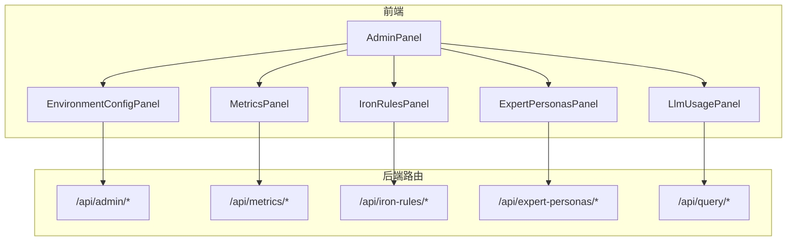
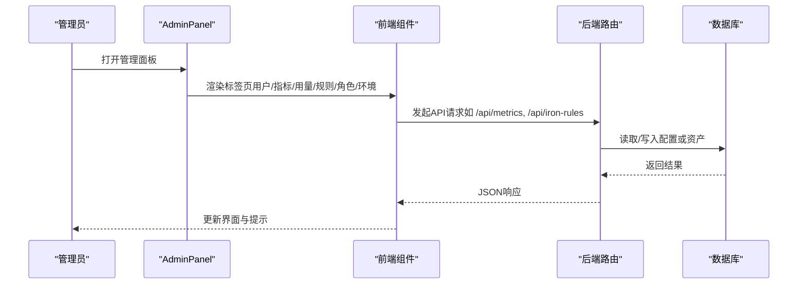
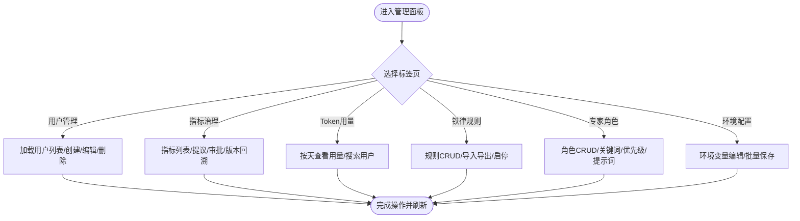
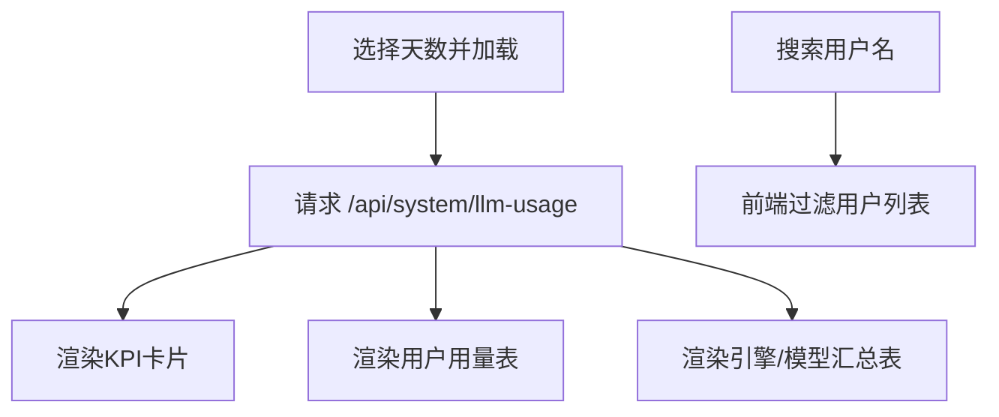
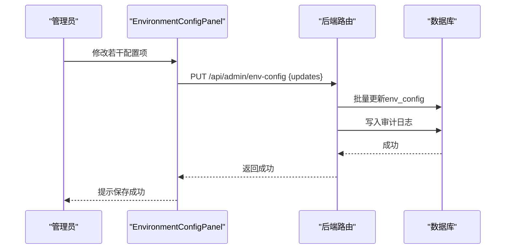
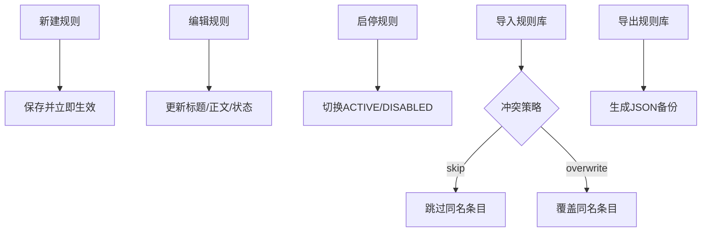
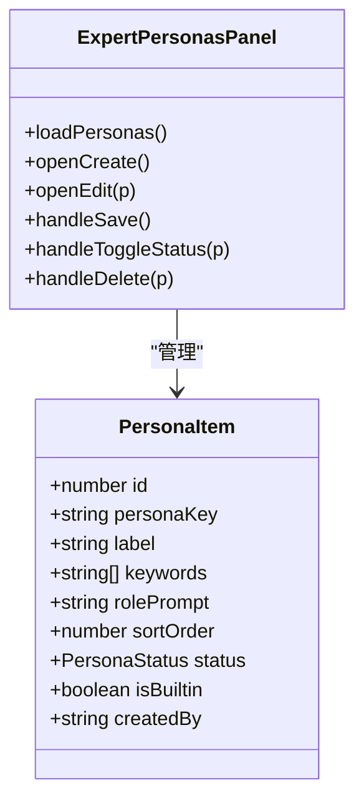
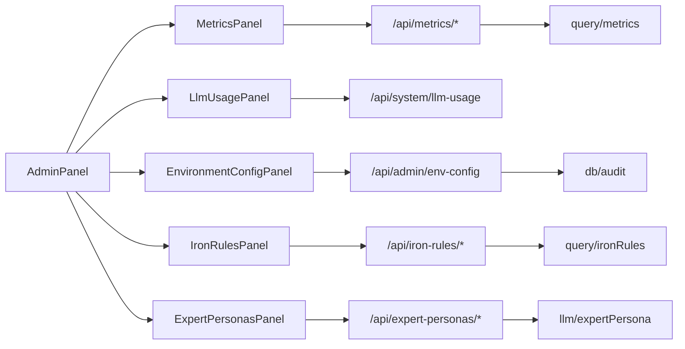

# 管理面板组件

<cite>
**本文引用的文件**
- [AdminPanel.tsx](file://src/components/admin/AdminPanel.tsx)
- [MetricsPanel.tsx](file://src/components/admin/MetricsPanel.tsx)
- [LlmUsagePanel.tsx](file://src/components/admin/LlmUsagePanel.tsx)
- [EnvironmentConfigPanel.tsx](file://src/components/admin/EnvironmentConfigPanel.tsx)
- [IronRulesPanel.tsx](file://src/components/admin/IronRulesPanel.tsx)
- [ExpertPersonasPanel.tsx](file://src/components/admin/ExpertPersonasPanel.tsx)
- [admin.ts](file://server/routes/admin.ts)
- [metrics.ts](file://server/routes/metrics.ts)
- [ironRules.ts](file://server/routes/ironRules.ts)
- [expertPersonas.ts](file://server/routes/expertPersonas.ts)
- [query.ts](file://server/routes/query.ts)
</cite>

## 目录
1. [简介](#简介)
2. [项目结构](#项目结构)
3. [核心组件](#核心组件)
4. [架构总览](#架构总览)
5. [详细组件分析](#详细组件分析)
6. [依赖关系分析](#依赖关系分析)
7. [性能与可用性](#性能与可用性)
8. [管理员操作指南](#管理员操作指南)
9. [监控告警配置](#监控告警配置)
10. [故障排查指南](#故障排查指南)
11. [结论](#结论)

## 简介
本文件面向系统管理员，系统化说明“管理面板”各子组件的职责、交互流程与运维要点。覆盖：
- AdminPanel：管理中心统一入口与导航
- MetricsPanel：指标治理（提议/审批/版本化）
- LlmUsagePanel：大模型调用统计（Token、耗时、成功率等）
- EnvironmentConfigPanel：运行时环境配置（参数调整与服务发现）
- IronRulesPanel：硬性规则（查询限制、安全策略、业务规则）
- ExpertPersonasPanel：专家角色（权限与提示词路由）

## 项目结构
管理面板位于前端 src/components/admin，由 AdminPanel 作为聚合容器，按标签页切换不同功能模块；后端对应 Express 路由提供数据与变更能力。



图表来源
- [AdminPanel.tsx:22-31](file://src/components/admin/AdminPanel.tsx#L22-L31)
- [metrics.ts:35-47](file://server/routes/metrics.ts#L35-L47)
- [ironRules.ts:21-33](file://server/routes/ironRules.ts#L21-L33)
- [expertPersonas.ts:16-26](file://server/routes/expertPersonas.ts#L16-L26)
- [admin.ts:212-233](file://server/routes/admin.ts#L212-L233)
- [query.ts:47-153](file://server/routes/query.ts#L47-L153)

章节来源
- [AdminPanel.tsx:57-617](file://src/components/admin/AdminPanel.tsx#L57-L617)

## 核心组件
- AdminPanel：统一入口，提供用户管理、质量看板、Token用量、指标治理、铁律规则、专家角色、权限审批、报告模板、环境配置等标签页。
- MetricsPanel：语义指标库的提议、审批、停用、删除、版本回溯与导入导出。
- LlmUsagePanel：按时间范围查看用户与大模型引擎/模型的调用次数、Token消耗、平均耗时与成功率。
- EnvironmentConfigPanel：仅管理员可编辑的环境变量与系统参数，支持批量保存与审计记录。
- IronRulesPanel：数据源级强制规则，创建即生效，支持导入导出与状态切换。
- ExpertPersonasPanel：问数阶段二解读的角色路由配置，含关键词匹配、优先级与提示词。

章节来源
- [AdminPanel.tsx:57-617](file://src/components/admin/AdminPanel.tsx#L57-L617)
- [MetricsPanel.tsx:20-25](file://src/components/admin/MetricsPanel.tsx#L20-L25)
- [LlmUsagePanel.tsx:44-47](file://src/components/admin/LlmUsagePanel.tsx#L44-L47)
- [EnvironmentConfigPanel.tsx:30-40](file://src/components/admin/EnvironmentConfigPanel.tsx#L30-L40)
- [IronRulesPanel.tsx:17-21](file://src/components/admin/IronRulesPanel.tsx#L17-L21)
- [ExpertPersonasPanel.tsx:15-21](file://src/components/admin/ExpertPersonasPanel.tsx#L15-L21)

## 架构总览
管理面板通过统一的 AdminPanel 组织多个子面板，每个子面板负责特定领域的数据展示与管理。后端以 Express 路由暴露 RESTful API，配合鉴权中间件与业务服务完成数据读写与校验。



图表来源
- [AdminPanel.tsx:224-325](file://src/components/admin/AdminPanel.tsx#L224-L325)
- [metrics.ts:39-47](file://server/routes/metrics.ts#L39-L47)
- [ironRules.ts:25-33](file://server/routes/ironRules.ts#L25-L33)
- [admin.ts:212-233](file://server/routes/admin.ts#L212-L233)

## 详细组件分析

### AdminPanel（管理中心）
- 职责：聚合多类管理功能，提供标签页导航与全局通知。
- 关键能力：
  - 用户管理：创建、启用/禁用、重置密码、修改部门、删除（自我保护：不能删/改自己）。
  - 质量看板：集成漂移提醒与运维指标。
  - Token用量：跳转至 LlmUsagePanel。
  - 指标治理：跳转至 MetricsPanel。
  - 铁律规则：跳转至 IronRulesPanel。
  - 专家角色：跳转至 ExpertPersonasPanel。
  - 权限审批：访问申请与DLP下载审批。
  - 报告模板：模板管理。
  - 环境配置：跳转至 EnvironmentConfigPanel。
- 交互要点：
  - 使用 apiFetch 调用 /api/admin/users 系列接口。
  - 统一 notice 提示，自动消失。
  - 根据当前用户角色控制可见与可操作项。



图表来源
- [AdminPanel.tsx:224-325](file://src/components/admin/AdminPanel.tsx#L224-L325)
- [AdminPanel.tsx:356-617](file://src/components/admin/AdminPanel.tsx#L356-L617)

章节来源
- [AdminPanel.tsx:57-617](file://src/components/admin/AdminPanel.tsx#L57-L617)
- [admin.ts:27-208](file://server/routes/admin.ts#L27-L208)

### MetricsPanel（指标治理）
- 职责：维护语义指标定义，支持提议-审批-版本化全生命周期。
- 关键能力：
  - 新建指标：ADMIN直接生效，ANALYST提交待审批。
  - 审批流：通过/驳回/重新提议。
  - 版本历史：查看快照，支持回溯到指定版本。
  - 导入导出：JSON备份，支持跳过/覆盖策略与Dry Run预检。
  - 状态管理：启用/停用。
- 数据流：
  - 列表：GET /api/metrics?dataSourceId=...
  - 创建：POST /api/metrics
  - 审批：POST /api/metrics/:id/approve|reject|repropose
  - 版本：GET /api/metrics/:id/versions
  - 回溯：POST /api/metrics/:id/restore
  - 导入导出：GET /api/metrics/export, POST /api/metrics/import

```mermaid
sequenceDiagram
participant A as "分析师"
participant M as "MetricsPanel"
participant S as "后端路由"
participant D as "数据库"
A->>M : 填写指标表单并提交
M->>S : POST /api/metrics
S->>D : 插入指标(状态PENDING/ACTION)
D-->>S : 返回ID与状态
S-->>M : 成功(状态)
Note over A,M : ADMIN可直接生效; ANALYST需等待审批
```

图表来源
- [MetricsPanel.tsx:131-160](file://src/components/admin/MetricsPanel.tsx#L131-L160)
- [metrics.ts:49-63](file://server/routes/metrics.ts#L49-L63)

章节来源
- [MetricsPanel.tsx:67-666](file://src/components/admin/MetricsPanel.tsx#L67-L666)
- [metrics.ts:35-302](file://server/routes/metrics.ts#L35-L302)

### LlmUsagePanel（大模型使用统计）
- 职责：按时间范围查看LLM调用统计，包括用户维度与引擎/模型维度。
- 关键能力：
  - 时间范围：近7/14/30/90天。
  - 用户搜索：按用户名过滤。
  - KPI卡片：Token总消耗、调用次数、输入/输出Token、活跃用户数。
  - 表格：用户维度与引擎/模型维度汇总，包含成功率与平均耗时。
- 数据流：
  - GET /api/system/llm-usage?days=...



图表来源
- [LlmUsagePanel.tsx:56-76](file://src/components/admin/LlmUsagePanel.tsx#L56-L76)
- [LlmUsagePanel.tsx:103-186](file://src/components/admin/LlmUsagePanel.tsx#L103-L186)
- [LlmUsagePanel.tsx:201-351](file://src/components/admin/LlmUsagePanel.tsx#L201-L351)

章节来源
- [LlmUsagePanel.tsx:44-355](file://src/components/admin/LlmUsagePanel.tsx#L44-L355)

### EnvironmentConfigPanel（环境配置管理）
- 职责：管理员在线编辑系统运行参数，即时生效且记录审计日志。
- 关键能力：
  - 分类显示：数据库、AI引擎、认证授权、系统参数。
  - 敏感字段：读取时脱敏，编辑时明文输入。
  - 批量保存：PUT /api/admin/env-config，白名单校验。
  - 审计：每次更新写入审计日志。
- 数据流：
  - GET /api/admin/env-config
  - PUT /api/admin/env-config



图表来源
- [EnvironmentConfigPanel.tsx:64-85](file://src/components/admin/EnvironmentConfigPanel.tsx#L64-L85)
- [admin.ts:235-292](file://server/routes/admin.ts#L235-L292)

章节来源
- [EnvironmentConfigPanel.tsx:30-209](file://src/components/admin/EnvironmentConfigPanel.tsx#L30-L209)
- [admin.ts:212-292](file://server/routes/admin.ts#L212-L292)

### IronRulesPanel（硬性规则管理）
- 职责：维护数据源级强制规则，全部ACTIVE规则在问数/报表阶段一注入，最高优先级。
- 关键能力：
  - 新建/编辑/启停/删除。
  - 导入导出：JSON备份，支持跳过/覆盖与Dry Run。
  - 实时生效：创建即对问数生效。
- 数据流：
  - GET /api/iron-rules?dataSourceId=...
  - POST /api/iron-rules
  - PUT /api/iron-rules/:id
  - DELETE /api/iron-rules/:id
  - GET /api/iron-rules/export
  - POST /api/iron-rules/import



图表来源
- [IronRulesPanel.tsx:102-179](file://src/components/admin/IronRulesPanel.tsx#L102-L179)
- [ironRules.ts:35-149](file://server/routes/ironRules.ts#L35-L149)

章节来源
- [IronRulesPanel.tsx:39-581](file://src/components/admin/IronRulesPanel.tsx#L39-L581)
- [ironRules.ts:1-149](file://server/routes/ironRules.ts#L1-L149)

### ExpertPersonasPanel（专家角色管理）
- 职责：配置问数阶段二解读的专家角色，决定AI分析视角与提示词。
- 关键能力：
  - 角色CRUD：标签、触发关键词、rolePrompt、优先级、状态。
  - 默认角色：兜底，不可禁用/删除，仅可编辑标签与提示词。
  - 内置角色：可编辑但不可删除。
  - 即时生效：服务端缓存失效后新请求生效。
- 数据流：
  - GET /api/expert-personas
  - POST /api/expert-personas
  - PUT /api/expert-personas/:id
  - DELETE /api/expert-personas/:id



图表来源
- [ExpertPersonasPanel.tsx:25-45](file://src/components/admin/ExpertPersonasPanel.tsx#L25-L45)
- [ExpertPersonasPanel.tsx:81-190](file://src/components/admin/ExpertPersonasPanel.tsx#L81-L190)
- [expertPersonas.ts:19-67](file://server/routes/expertPersonas.ts#L19-L67)

章节来源
- [ExpertPersonasPanel.tsx:62-420](file://src/components/admin/ExpertPersonasPanel.tsx#L62-L420)
- [expertPersonas.ts:1-70](file://server/routes/expertPersonas.ts#L1-L70)

## 依赖关系分析
- 前端依赖：
  - AdminPanel 聚合所有子面板，并通过 apiFetch 调用后端。
  - 各子面板依赖 useAuthStore/useAnalyticsStore 获取当前用户与数据源信息。
- 后端依赖：
  - 路由层统一鉴权：authMiddleware + requireRole('ADMIN'|'ANALYST')。
  - 业务逻辑封装在 query/infra/llm 等模块中。
  - 安全执行层：executeSafeSql 保证SQL只读与白名单。
  - 审计与限流：auditLog、userQueryLimit、rateLimiter。



图表来源
- [metrics.ts:35-302](file://server/routes/metrics.ts#L35-L302)
- [ironRules.ts:1-149](file://server/routes/ironRules.ts#L1-L149)
- [expertPersonas.ts:1-70](file://server/routes/expertPersonas.ts#L1-L70)
- [admin.ts:212-292](file://server/routes/admin.ts#L212-L292)

章节来源
- [metrics.ts:35-302](file://server/routes/metrics.ts#L35-L302)
- [ironRules.ts:1-149](file://server/routes/ironRules.ts#L1-L149)
- [expertPersonas.ts:1-70](file://server/routes/expertPersonas.ts#L1-L70)
- [admin.ts:212-292](file://server/routes/admin.ts#L212-L292)

## 性能与可用性
- 前端优化：
  - 列表加载延迟执行避免阻塞首次渲染。
  - 本地搜索与过滤减少网络开销。
  - 导入导出采用Blob与FormData，支持大文件预览与Dry Run。
- 后端保护：
  - 并发限流与串行化：智能问数主链路限制每用户并发为1，防止昂贵LLM调用拥塞。
  - 频率限制：用户查询速率限制，超限返回429。
  - 安全执行：所有SQL走SELECT-only安全执行层，结合白名单与行级过滤。
  - 审计与限流：关键操作记录审计日志，异常路径快速失败。

章节来源
- [query.ts:97-116](file://server/routes/query.ts#L97-L116)
- [metrics.ts:67-134](file://server/routes/metrics.ts#L67-L134)

## 管理员操作指南
- 用户管理
  - 创建账号：填写用户名、显示名、初始密码、部门、角色。
  - 启用/禁用：注意不能禁用或删除当前登录的管理员。
  - 重置密码：设置新密码后目标用户下次登录需改密。
  - 修改部门：用于数据源授权匹配。
- 指标治理
  - 分析师：提交指标提议，等待管理员审批。
  - 管理员：审批通过/驳回，编辑、停用、删除，查看版本历史并回溯。
  - 导入导出：使用JSON备份进行跨环境迁移，支持Dry Run预检。
- 大模型用量
  - 选择时间范围查看Token消耗与调用成功率。
  - 按用户搜索定位高消耗账号。
  - 按引擎/模型对比成本与性能。
- 硬性规则
  - 新建规则：标题唯一，正文自然语言描述，创建即生效。
  - 启停规则：影响后续问数与报表生成的约束。
  - 导入导出：跨环境同步规则集。
- 专家角色
  - 新建角色：设置标签、关键词、优先级、提示词。
  - 默认角色：兜底，不可禁用/删除。
  - 内置角色：可编辑但不可删除。
- 环境配置
  - 仅管理员可见，修改后即时生效。
  - 敏感字段读取时脱敏，保存时白名单校验并记录审计。

章节来源
- [AdminPanel.tsx:107-203](file://src/components/admin/AdminPanel.tsx#L107-L203)
- [MetricsPanel.tsx:131-241](file://src/components/admin/MetricsPanel.tsx#L131-L241)
- [LlmUsagePanel.tsx:56-186](file://src/components/admin/LlmUsagePanel.tsx#L56-L186)
- [IronRulesPanel.tsx:102-179](file://src/components/admin/IronRulesPanel.tsx#L102-L179)
- [ExpertPersonasPanel.tsx:123-190](file://src/components/admin/ExpertPersonasPanel.tsx#L123-L190)
- [EnvironmentConfigPanel.tsx:64-85](file://src/components/admin/EnvironmentConfigPanel.tsx#L64-L85)

## 监控告警配置
- 指标治理
  - 建议将“待审批指标数量”纳入看板，及时推动审批闭环。
  - 关注指标版本回溯频率，评估口径稳定性。
- 大模型用量
  - 监控Token消耗趋势与成功率，识别异常峰值。
  - 按引擎/模型对比成本，优化模型选择与路由。
- 硬性规则
  - 监控生效规则数量，确保关键红线始终生效。
  - 定期审查规则正文，避免过时或冲突。
- 专家角色
  - 监控命中角色分布，验证关键词覆盖度。
  - 默认角色兜底比例过高时需补充关键词。
- 环境配置
  - 审计日志跟踪配置变更，建立变更基线。
  - 敏感字段变更后验证服务连通性。

[本节为通用指导，不直接分析具体文件]

## 故障排查指南
- 无法加载用户列表
  - 检查 /api/admin/users 是否返回成功，确认鉴权与数据库连接。
- 指标创建失败
  - 检查输入校验（名称、表达式、归属表），确认数据源权限。
- 指标查询被拒绝
  - 检查数据源访问控制（ACL）、用户查询限额、数据源是否停用。
- 铁律导入失败
  - 确认文件格式为 iron-rules 类型，目标数据源存在，冲突策略正确。
- 专家角色保存失败
  - 校验必填字段（标签、提示词），默认角色不可禁用，内置角色不可删除。
- 环境配置保存失败
  - 检查键是否在白名单内，确认至少一个管理员可用。

章节来源
- [admin.ts:27-208](file://server/routes/admin.ts#L27-L208)
- [metrics.ts:49-134](file://server/routes/metrics.ts#L49-L134)
- [ironRules.ts:35-149](file://server/routes/ironRules.ts#L35-L149)
- [expertPersonas.ts:28-67](file://server/routes/expertPersonas.ts#L28-L67)
- [admin.ts:235-292](file://server/routes/admin.ts#L235-L292)

## 结论
管理面板以AdminPanel为核心，整合了用户、指标、用量、规则、角色与环境配置等关键管理能力。通过前后端协作与严格的安全与审计机制，保障系统在可控范围内高效运行。建议结合监控与审计，持续优化指标口径、规则策略与角色路由，提升问数质量与资源利用率。