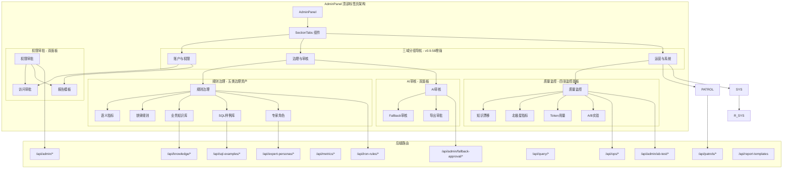
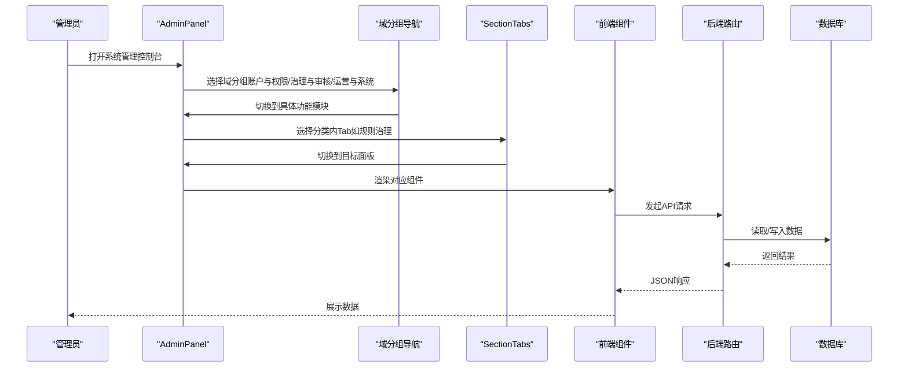
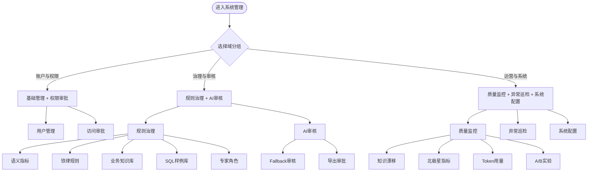
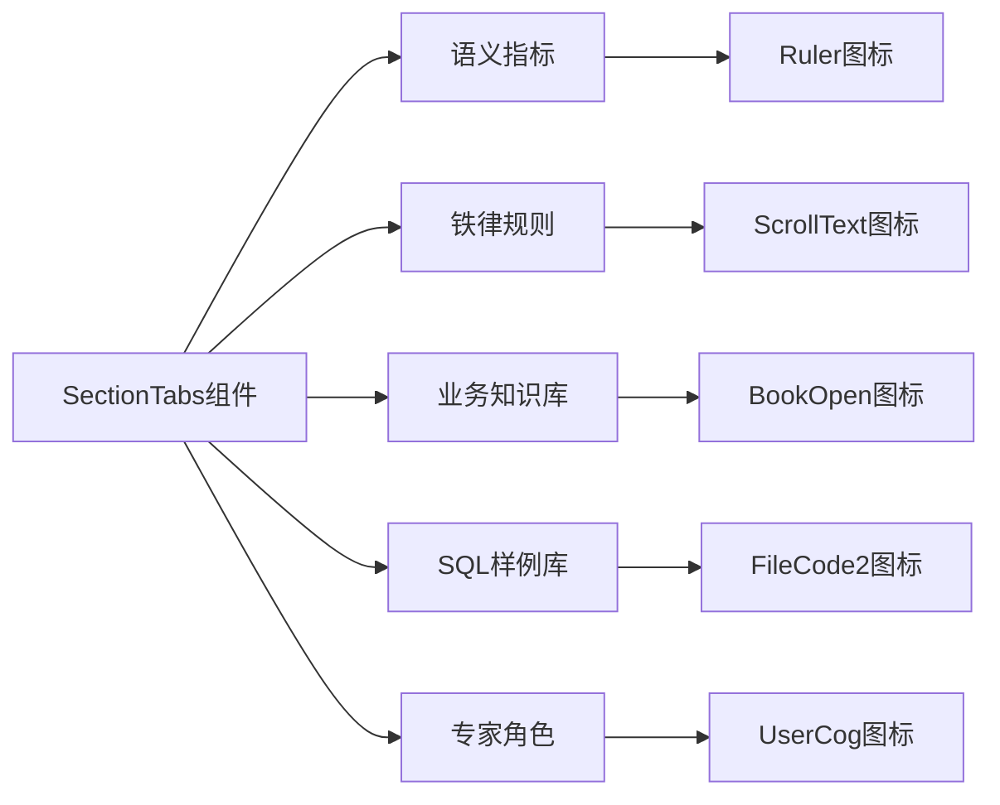
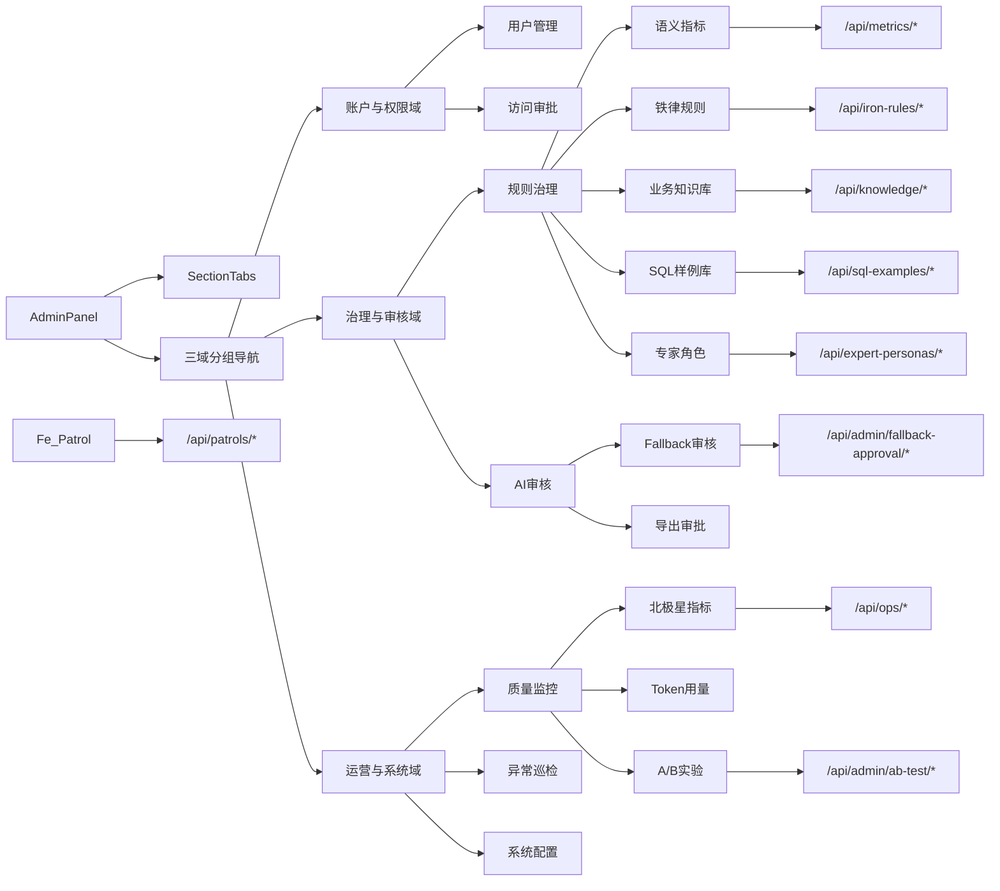

# 管理面板组件

<cite>
**本文引用的文件**
- [AdminPanel.tsx](file://src/components/admin/AdminPanel.tsx)
- [SectionTabs.tsx](file://src/components/admin/SectionTabs.tsx)
- [KnowledgeBasePanel.tsx](file://src/components/datasource/KnowledgeBasePanel.tsx)
- [SqlExamplesPanel.tsx](file://src/components/datasource/SqlExamplesPanel.tsx)
- [MetricsPanel.tsx](file://src/components/admin/MetricsPanel.tsx)
- [LlmUsagePanel.tsx](file://src/components/admin/LlmUsagePanel.tsx)
- [EnvironmentConfigPanel.tsx](file://src/components/admin/EnvironmentConfigPanel.tsx)
- [IronRulesPanel.tsx](file://src/components/admin/IronRulesPanel.tsx)
- [ExpertPersonasPanel.tsx](file://src/components/admin/ExpertPersonasPanel.tsx)
- [FallbackApprovalPanel.tsx](file://src/components/admin/FallbackApprovalPanel.tsx)
- [OpsMetricsPanel.tsx](file://src/components/admin/OpsMetricsPanel.tsx)
- [ReportTemplateManager.tsx](file://src/components/admin/ReportTemplateManager.tsx)
- [PatrolPanel.tsx](file://src/components/admin/PatrolPanel.tsx)
- [ABTestDashboard.tsx](file://src/components/admin/ABTestDashboard.tsx)
- [knowledge.ts](file://server/routes/knowledge.ts)
- [sqlExamples.ts](file://server/routes/sqlExamples.ts)
- [patrols.ts](file://server/routes/patrols.ts)
- [anomalyPatrol.ts](file://server/anomalyPatrol.ts)
- [abTest.ts](file://server/routes/abTest.ts)
- [metrics.ts](file://server/routes/metrics.ts)
- [ironRules.ts](file://server/routes/ironRules.ts)
- [expertPersonas.ts](file://server/routes/expertPersonas.ts)
- [fallbackApproval.ts](file://server/routes/fallbackApproval.ts)
- [query.ts](file://server/routes/query.ts)
</cite>

## 更新摘要
**变更内容**
- **架构重构**：AdminPanel从垂直堆叠的三面板布局转换为顶部标签页界面，提供统一的治理资产管理入口
- **新增SectionTabs组件**：v0.9.57引入的一致标签导航组件，支持多面板分类和主题色配置
- **五类治理资产整合**：规则治理分类现包含语义指标、铁律规则、业务知识库、SQL样例库、专家角色五大治理资产
- **统一标签导航**：质量监控、权限审批、AI审核等分类均采用一致的标签页设计模式
- **知识库与SQL样例库迁移**：从数据源页面迁移至规则治理分类，实现统一管理入口
- **v0.9.58左侧导航增强**：将简单的分区标题转换为三个域分组卡片容器（账户与权限、治理与审计、运营与系统），每个分组具有增强的视觉层次结构、语义图标和颜色编码样式

## 目录
1. [简介](#简介)
2. [项目结构](#项目结构)
3. [核心组件](#核心组件)
4. [架构总览](#架构总览)
5. [详细组件分析](#详细组件分析)
6. [依赖关系分析](#依赖关系分析)
7. [性能与可用性](#性能与可用性)
8. [管理员操作指南](#管理员操作指南)
9. [监控告警配置](#监控告警配置)
10. [故障排查指南](#故障排查指南)
11. [结论](#结论)

## 简介
本文件面向系统管理员，系统化说明"管理面板"各子组件的职责、交互流程与运维要点。覆盖：
- AdminPanel：管理中心统一入口与导航，采用顶部标签页界面和五类治理资产架构，v0.9.58增强了左侧导航菜单的视觉层次
- SectionTabs：统一的标签导航组件，支持主题色配置和多面板分类
- KnowledgeBasePanel：业务知识库管理（术语口径、外部知识源、文档切块）
- SqlExamplesPanel：SQL样例库管理（训练语料、few-shot示例、批量导入导出）
- MetricsPanel：语义指标治理（提议-审批-版本化）
- LlmUsagePanel：大模型调用统计（Token、耗时、成功率等）
- EnvironmentConfigPanel：运行时环境配置（参数调整与服务发现）
- IronRulesPanel：硬性规则（查询限制、安全策略、业务规则）
- ExpertPersonasPanel：专家角色（权限与提示词路由）
- FallbackApprovalPanel：困难样本审核（批量操作、实时搜索、Few-Shot注入）
- OpsMetricsPanel：运营指标监控（北极星指标、质量趋势分析）
- ReportTemplateManager：报告模板管理（预设模板与自定义模板）
- ABTestDashboard：A/B Test实验分析（策略对比、成功率分析、延迟监控）
- PatrolPanel：异常巡检计划管理（数据源级自动扫描与预警）

## 项目结构
管理面板位于前端 src/components/admin，由 AdminPanel 作为聚合容器，采用顶部标签页界面组织功能模块；后端对应 Express 路由提供数据与变更能力。

```mermaid
graph TB
subgraph "AdminPanel 顶部标签页架构"
AP["AdminPanel"]
ST["SectionTabs 组件"]
subgraph "三域分组导航 - v0.9.58增强"
DG1["账户与权限"]
DG2["治理与审核"]
DG3["运营与系统"]
end
subgraph "规则治理 - 五类治理资产"
RG["规则治理"]
M["语义指标"]
IR["铁律规则"]
KB["业务知识库"]
SE["SQL样例库"]
EP["专家角色"]
end
subgraph "质量监控 - 四张监控面板"
QM["质量监控"]
DA["知识漂移"]
OM["北极星指标"]
LU["Token用量"]
AB["A/B实验"]
end
subgraph "权限审批 - 双面板"
PA["权限审批"]
AR["访问审批"]
RT["报告模板"]
end
subgraph "AI审核 - 双面板"
AA["AI审核"]
FA["Fallback审核"]
DP["导出审批"]
end
end
subgraph "后端路由"
R_KB["/api/knowledge/*"]
R_SE["/api/sql-examples/*"]
R_PATROL["/api/patrols/*"]
R_ADMIN["/api/admin/*"]
R_METRICS["/api/metrics/*"]
R_IRON["/api/iron-rules/*"]
R_PERSONA["/api/expert-personas/*"]
R_QUERY["/api/query/*"]
R_FALLBACK["/api/admin/fallback-approval/*"]
R_ABTEST["/api/admin/ab-test/*"]
R_OPS["/api/ops/*"]
R_REPORTS["/api/report-templates"]
end
AP --> ST
ST --> DG1
ST --> DG2
ST --> DG3
DG1 --> AR
DG1 --> RT
DG2 --> RG
DG2 --> AA
DG3 --> QM
DG3 --> PATROL
DG3 --> SYS
RG --> M
RG --> IR
RG --> KB
RG --> SE
RG --> EP
QM --> DA
QM --> OM
QM --> LU
QM --> AB
PA --> AR
PA --> RT
AA --> FA
AA --> DP
KB --> R_KB
SE --> R_SE
RG --> R_IRON
EP --> R_PERSONA
QM --> R_OPS
PA --> R_ADMIN
AA --> R_FALLBACK
QM --> R_ABTEST
PATROL --> R_PATROL
SYS --> R_SYS
```

**图表来源**
- [AdminPanel.tsx:84-122](file://src/components/admin/AdminPanel.tsx#L84-L122)
- [AdminPanel.tsx:342-381](file://src/components/admin/AdminPanel.tsx#L342-L381)
- [SectionTabs.tsx:25-58](file://src/components/admin/SectionTabs.tsx#L25-L58)

章节来源
- [AdminPanel.tsx:84-122](file://src/components/admin/AdminPanel.tsx#L84-L122)
- [AdminPanel.tsx:342-381](file://src/components/admin/AdminPanel.tsx#L342-L381)
- [SectionTabs.tsx:25-58](file://src/components/admin/SectionTabs.tsx#L25-L58)

## 核心组件
- **AdminPanel**：统一入口，采用顶部标签页界面和五类治理资产架构，提供标签页导航与全局通知。**v0.9.58增强了左侧导航菜单，从简单分区标题升级为三个域分组卡片容器**。
- **SectionTabs**：通用标签导航组件，支持主题色配置、图标显示和响应式布局。
- **KnowledgeBasePanel**：业务知识库管理，支持文档CRUD、切块管理、导入导出和外部知识源集成。
- **SqlExamplesPanel**：SQL样例库管理，支持few-shot训练语料维护、批量导入导出和问题反推。
- **MetricsPanel**：语义指标治理，支持提议-审批-版本化的完整生命周期管理。
- **LlmUsagePanel**：大模型调用统计，按时间范围查看用户与大模型引擎/模型的调用次数、Token消耗、平均耗时与成功率。
- **EnvironmentConfigPanel**：仅管理员可编辑的环境变量与系统参数，支持批量保存与审计记录。
- **IronRulesPanel**：数据源级强制规则，创建即生效，支持导入导出与状态切换。
- **ExpertPersonasPanel**：问数阶段二解读的角色路由配置，含关键词匹配、优先级与提示词。
- **FallbackApprovalPanel**：困难样本审核面板，支持批量操作、实时搜索过滤、优先级排序与Few-Shot注入。
- **OpsMetricsPanel**：运营指标监控面板，展示北极星指标、质量趋势分析和系统健康状态。
- **ReportTemplateManager**：报告模板管理面板，支持预设模板和自定义模板的CRUD操作。
- **ABTestDashboard**：A/B Test实验分析仪表板，提供实验策略对比分析、成功率对比、延迟分析和历史记录查看。
- **PatrolPanel**：异常巡检计划管理，支持数据源级自动扫描、周期调度、异常预警与运行历史查看。

章节来源
- [AdminPanel.tsx:84-122](file://src/components/admin/AdminPanel.tsx#L84-L122)
- [AdminPanel.tsx:342-381](file://src/components/admin/AdminPanel.tsx#L342-L381)
- [SectionTabs.tsx:25-58](file://src/components/admin/SectionTabs.tsx#L25-L58)
- [KnowledgeBasePanel.tsx:35-62](file://src/components/datasource/KnowledgeBasePanel.tsx#L35-L62)
- [SqlExamplesPanel.tsx:34-67](file://src/components/datasource/SqlExamplesPanel.tsx#L34-L67)

## 架构总览
管理面板通过统一的 AdminPanel 组织多个子面板，采用顶部标签页界面提升用户体验。**v0.9.58引入了三域分组卡片容器的左侧导航架构，提供更好的视觉层次和功能域分离**。每个分类内的子面板通过 SectionTabs 组件进行统一导航。后端以 Express 路由暴露 RESTful API，配合鉴权中间件与业务服务完成数据读写与校验。

```mermaid
sequenceDiagram
participant U as "管理员"
participant AP as "AdminPanel"
participant DG as "域分组导航"
participant ST as "SectionTabs"
participant FE as "前端组件"
participant BE as "后端路由"
participant DB as "数据库"
U->>AP : 打开系统管理控制台
AP->>DG : 选择域分组账户与权限/治理与审核/运营与系统
DG->>AP : 切换到具体功能模块
AP->>ST : 选择分类内Tab如规则治理
ST->>AP : 切换到目标面板
AP->>FE : 渲染对应组件
FE->>BE : 发起API请求
BE->>DB : 读取/写入数据
DB-->>BE : 返回结果
BE-->>FE : JSON响应
FE-->>U : 展示数据
```

**图表来源**
- [AdminPanel.tsx:84-122](file://src/components/admin/AdminPanel.tsx#L84-L122)
- [AdminPanel.tsx:342-381](file://src/components/admin/AdminPanel.tsx#L342-L381)
- [SectionTabs.tsx:25-58](file://src/components/admin/SectionTabs.tsx#L25-L58)

## 详细组件分析

### AdminPanel（管理中心 - 三域分组卡片导航架构）
- 职责：聚合多类管理功能，采用顶部标签页界面和五类治理资产架构提供统一导航。**v0.9.58实现了左侧导航菜单的重大升级**。
- **架构更新**：从垂直堆叠的三面板转换为顶部标签页界面，引入SectionTabs组件实现一致的用户体验。**v0.9.58进一步将左侧导航从简单分区标题升级为三个域分组卡片容器**。
- **v0.9.58增强特性**：
  - **三域分组卡片容器**：账户与权限、治理与审计、运营与系统三大功能域
  - **增强的视觉层次结构**：每个域分组具有独立的卡片容器、语义图标和颜色编码
  - **渐变延伸线效果**：域标题右侧的渐变线条增强视觉区分度
  - **响应式设计**：窄屏模式下隐藏文字，仅显示图标列
  - **统一的颜色体系**：indigo（账户）、cyan/rose（治理）、emerald/slate（运营）
- 关键能力：
  - **账户与权限域**：基础管理、权限审批
  - **治理与审核域**：规则治理（五类治理资产）、AI审核
  - **运营与系统域**：质量监控（四张监控面板）、异常巡检、系统配置
  - **统一标签导航**：各域内使用SectionTabs组件提供一致的Tab体验
  - **系统配置**：环境变量编辑与系统参数调整
  - **异常巡检**：数据源级自动扫描与预警管理
- 交互要点：
  - 使用 apiFetch 调用各类管理接口。
  - 统一 notice 提示，自动消失。
  - 根据当前用户角色控制可见与可操作项。
  - 左栏分类导航支持窄屏适配，移动端显示图标列。

```mermaid
flowchart TD
Start(["进入系统管理"]) --> Domain{"选择域分组"}
Domain --> |账户与权限| Account["基础管理 + 权限审批"]
Domain --> |治理与审核| Governance["规则治理 + AI审核"]
Domain --> |运营与系统| Operations["质量监控 + 异常巡检 + 系统配置"]
Account --> Users["用户管理"]
Account --> Access["访问审批"]
Governance --> RuleGov["规则治理"]
Governance --> AIAudit["AI审核"]
RuleGov --> Metrics["语义指标"]
RuleGov --> IronRules["铁律规则"]
RuleGov --> Knowledge["业务知识库"]
RuleGov --> Examples["SQL样例库"]
RuleGov --> Personas["专家角色"]
AIAudit --> Fallback["Fallback审核"]
AIAudit --> DLP["导出审批"]
Operations --> QualityMon["质量监控"]
Operations --> Patrol["异常巡检"]
Operations --> SysConfig["系统配置"]
QualityMon --> Drift["知识漂移"]
QualityMon --> Ops["北极星指标"]
QualityMon --> Usage["Token用量"]
QualityMon --> ABTest["A/B实验"]
```

**图表来源**
- [AdminPanel.tsx:84-122](file://src/components/admin/AdminPanel.tsx#L84-L122)
- [AdminPanel.tsx:342-381](file://src/components/admin/AdminPanel.tsx#L342-L381)

章节来源
- [AdminPanel.tsx:84-122](file://src/components/admin/AdminPanel.tsx#L84-L122)
- [AdminPanel.tsx:342-381](file://src/components/admin/AdminPanel.tsx#L342-L381)
- [AdminPanel.tsx:652-703](file://src/components/admin/AdminPanel.tsx#L652-L703)

### SectionTabs（统一标签导航组件）
- 职责：为各个管理分类提供一致的顶部标签页导航，支持主题色配置和响应式布局。
- **新增功能**：v0.9.57引入的通用组件，替代原有的分散标签实现。
- 关键能力：
  - **主题色配置**：支持cyan、amber、rose、emerald四种主题色。
  - **图标显示**：未选中态显示彩色图标，选中态高亮显示。
  - **响应式布局**：支持flex-wrap布局，适应不同屏幕尺寸。
  - **类型安全**：使用TypeScript泛型确保标签类型安全。
  - **事件处理**：统一的onChange回调处理标签切换。
- 使用方式：
  - 传入tabs数组定义标签项。
  - active状态管理当前选中标签。
  - onChange回调处理标签切换逻辑。

```mermaid
graph LR
ST["SectionTabs组件"] --> T1["语义指标"]
ST --> T2["铁律规则"]
ST --> T3["业务知识库"]
ST --> T4["SQL样例库"]
ST --> T5["专家角色"]
T1 --> Icon1["Ruler图标"]
T2 --> Icon2["ScrollText图标"]
T3 --> Icon3["BookOpen图标"]
T4 --> Icon4["FileCode2图标"]
T5 --> Icon5["UserCog图标"]
```

**图表来源**
- [SectionTabs.tsx:25-58](file://src/components/admin/SectionTabs.tsx#L25-L58)
- [AdminPanel.tsx:127-133](file://src/components/admin/AdminPanel.tsx#L127-L133)

章节来源
- [SectionTabs.tsx:25-58](file://src/components/admin/SectionTabs.tsx#L25-L58)
- [AdminPanel.tsx:127-133](file://src/components/admin/AdminPanel.tsx#L127-L133)

### 其他组件（保持原有功能）
- **KnowledgeBasePanel**：业务知识库管理，支持文档CRUD、切块管理、导入导出和外部知识源集成。
- **SqlExamplesPanel**：SQL样例库管理，支持few-shot训练语料维护、批量导入导出和问题反推。
- **MetricsPanel**：语义指标治理，支持提议-审批-版本化的完整生命周期管理。
- **LlmUsagePanel**：按时间范围查看用户与大模型引擎/模型的调用次数、Token消耗、平均耗时与成功率。
- **EnvironmentConfigPanel**：仅管理员可编辑的环境变量与系统参数，支持批量保存与审计记录。
- **IronRulesPanel**：数据源级强制规则，创建即生效，支持导入导出与状态切换。
- **ExpertPersonasPanel**：问数阶段二解读的角色路由配置，含关键词匹配、优先级与提示词。
- **FallbackApprovalPanel**：困难样本审核面板，支持批量操作、实时搜索过滤、优先级排序与Few-Shot注入。
- **OpsMetricsPanel**：运营指标监控面板，展示北极星指标、质量趋势分析和系统健康状态。
- **ReportTemplateManager**：报告模板管理面板，支持预设模板和自定义模板的CRUD操作。
- **ABTestDashboard**：A/B Test实验分析仪表板，提供实验策略对比分析、成功率对比、延迟分析和历史记录查看。
- **PatrolPanel**：异常巡检计划管理，支持数据源级自动扫描、周期调度、异常预警与运行历史查看。

## 依赖关系分析
- 前端依赖：
  - AdminPanel 聚合所有子面板，并通过 apiFetch 调用后端。
  - SectionTabs 为各分类提供统一的标签导航。
  - KnowledgeBasePanel 和 SqlExamplesPanel 从数据源页面迁移至规则治理分类。
  - 各子面板依赖 useAuthStore/useAnalyticsStore 获取当前用户与数据源信息。
  - **知识库和SQL样例库依赖后端 /api/knowledge/* 和 /api/sql-examples/* 路由。**
  - **PatrolPanel 依赖后端 /api/patrols/* 路由获取巡检计划和执行结果。**
  - **ABTestDashboard 依赖后端 /api/admin/ab-test/* 路由获取实验数据。**
  - **FallbackApprovalPanel 依赖 activeLearning 工具进行优先级计算。**
  - **OpsMetricsPanel 依赖后端 /api/ops/* 路由获取运营指标。**
  - **ReportTemplateManager 依赖后端 /api/report-templates 路由管理模板。**
  - **v0.9.58三域分组导航依赖SECTION_GROUPS配置定义域结构和样式。**
- 后端依赖：
  - 路由层统一鉴权：authMiddleware + requireRole('ADMIN'|'ANALYST')。
  - 业务逻辑封装在 query/infra/llm 等模块中。
  - 安全执行层：executeSafeSql 保证SQL只读与白名单。
  - 审计与限流：auditLog、userQueryLimit、rateLimiter。
  - **知识库框架：knowledgeBase 提供文档切块、embedding和检索功能。**
  - **SQL样例库框架：queryFeedback 提供few-shot语料管理和问题反推功能。**
  - **异常巡检框架：anomalyPatrol 提供巡检计划管理、调度器和异常检测功能。**
  - **A/B Test框架：abTest utils 提供实验分组、记录创建和统计分析功能。**
  - **批量操作分批处理，防止SQL过长导致的性能问题。**

```mermaid
graph LR
FE_Admin["AdminPanel"] --> FE_SectionTabs["SectionTabs"]
FE_Admin --> FE_DomainGroups["三域分组导航"]
FE_DomainGroups --> FE_Account["账户与权限域"]
FE_DomainGroups --> FE_Governance["治理与审核域"]
FE_DomainGroups --> FE_Operations["运营与系统域"]
FE_Account --> FE_Users["用户管理"]
FE_Account --> FE_Access["访问审批"]
FE_Governance --> FE_RuleGov["规则治理"]
FE_Governance --> FE_AIAudit["AI审核"]
FE_Operations --> FE_QualityMon["质量监控"]
FE_Operations --> FE_Patrol["异常巡检"]
FE_Operations --> Fe_SysConfig["系统配置"]
FE_RuleGov --> FE_Metrics["语义指标"]
FE_RuleGov --> Fe_Iron["铁律规则"]
FE_RuleGov --> FE_Knowledge["业务知识库"]
FE_RuleGov --> FE_Examples["SQL样例库"]
FE_RuleGov --> Fe_Persona["专家角色"]
FE_AIAudit --> Fe_Fallback["Fallback审核"]
FE_AIAudit --> Fe_DLP["导出审批"]
FE_QualityMon --> Fe_Ops["北极星指标"]
FE_QualityMon --> Fe_LLM["Token用量"]
FE_QualityMon --> Fe_ABTest["A/B实验"]
FE_Knowledge --> BE_Knowledge["/api/knowledge/*"]
FE_Examples --> BE_Examples["/api/sql-examples/*"]
FE_Metrics --> BE_Metrics["/api/metrics/*"]
Fe_Iron --> BE_Iron["/api/iron-rules/*"]
Fe_Persona --> BE_Persona["/api/expert-personas/*"]
Fe_Fallback --> BE_Fallback["/api/admin/fallback-approval/*"]
Fe_Ops --> BE_Ops["/api/ops/*"]
Fe_ABTest --> BE_ABTest["/api/admin/ab-test/*"]
Fe_Patrol --> BE_Patrol["/api/patrols/*"]
```

**图表来源**
- [AdminPanel.tsx:84-122](file://src/components/admin/AdminPanel.tsx#L84-L122)
- [AdminPanel.tsx:342-381](file://src/components/admin/AdminPanel.tsx#L342-L381)
- [knowledge.ts:25-31](file://server/routes/knowledge.ts#L25-L31)
- [sqlExamples.ts:6-20](file://server/routes/sqlExamples.ts#L6-L20)
- [patrols.ts:1-210](file://server/routes/patrols.ts#L1-L210)

章节来源
- [AdminPanel.tsx:84-122](file://src/components/admin/AdminPanel.tsx#L84-L122)
- [AdminPanel.tsx:342-381](file://src/components/admin/AdminPanel.tsx#L342-L381)
- [knowledge.ts:25-31](file://server/routes/knowledge.ts#L25-L31)
- [sqlExamples.ts:6-20](file://server/routes/sqlExamples.ts#L6-L20)
- [patrols.ts:1-210](file://server/routes/patrols.ts#L1-L210)

## 性能与可用性
- 前端优化：
  - 列表加载延迟执行避免阻塞首次渲染。
  - 本地搜索与过滤减少网络开销。
  - 导入导出采用Blob与FormData，支持大文件预览与Dry Run。
  - **SectionTabs组件提供统一的标签导航体验，支持主题色配置。**
  - **知识库和SQL样例库支持异步操作和进度反馈。**
  - **PatrolPanel 支持巡检计划的异步执行和历史记录分页加载。**
  - **ABTestDashboard 支持时间范围筛选和实时刷新，优化大数据量下的用户体验。**
  - **Fallback面板支持实时搜索过滤，提升大数据量下的用户体验。**
  - **OpsMetricsPanel 支持数据源下钻和趋势粒度切换，提升数据分析灵活性。**
  - **ReportTemplateManager 支持模板结构验证和批量操作，提升模板管理效率。**
  - **v0.9.58三域分组导航优化了渲染性能，使用CSS渐变和阴影效果提升视觉体验。**
- 后端保护：
  - 并发限流与串行化：智能问数主链路限制每用户并发为1，防止昂贵LLM调用拥塞。
  - 频率限制：用户查询速率限制，超限返回429。
  - 安全执行：所有SQL走SELECT-only安全执行层，结合白名单与行级过滤。
  - 审计与限流：关键操作记录审计日志，异常路径快速失败。
  - **知识库切块处理：智能分块算法，支持重叠处理和原文还原。**
  - **SQL样例库批量操作：分批处理防止SQL过长导致的性能问题。**
  - **异常巡检调度：原子领取机制防止多实例重复执行，内存集合防并发重入。**
  - **A/B Test框架支持流量分配和实验隔离，确保实验准确性。**

## 管理员操作指南
- **账户与权限域操作指南**
  - **基础管理**：创建新用户、修改用户信息、重置密码、删除用户、启用/禁用账号。
  - **权限审批**：处理数据源访问申请，审批通过后授予权限。
- **治理与审核域操作指南**
  - **规则治理**：
    - **语义指标**：分析师提交提议，管理员审批，支持版本回溯和导入导出。
    - **铁律规则**：新建规则、启停规则、导入导出规则集。
    - **业务知识库**：创建知识文档、编辑内容、管理切块、导入导出备份。
    - **SQL样例库**：手工登记样例、批量导入、问题反推、导入导出备份。
    - **专家角色**：新建角色、设置关键词和提示词、管理默认角色。
  - **AI审核**：
    - **Fallback审核**：困难样本审核，支持批量操作、实时搜索过滤与Few-Shot注入。
    - **导出审批**：超阈值下载申请审批，控制数据导出风险。
- **运营与系统域操作指南**
  - **质量监控**：
    - **知识漂移**：监控知识库变化，及时处理漂移提醒。
    - **北极星指标**：查看运营指标、趋势分析、数据源下钻。
    - **Token用量**：选择时间范围查看Token消耗与调用成功率。
    - **A/B实验**：查看仪表板、时间范围选择、策略对比、历史记录查看。
  - **异常巡检**：
    - **创建巡检计划**：选择数据源、设置名称和巡检周期（15分钟到30天）。
    - **管理巡检计划**：启用/暂停、立即执行、查看运行历史、删除计划。
    - **处理异常预警**：查看异常详情、评估严重程度、制定处理方案。
    - **监控巡检效果**：关注异常检出率、误报率、系统稳定性等指标。
  - **系统配置**：仅管理员可见，修改后即时生效，敏感字段脱敏显示。

章节来源
- [AdminPanel.tsx:84-122](file://src/components/admin/AdminPanel.tsx#L84-L122)
- [AdminPanel.tsx:342-381](file://src/components/admin/AdminPanel.tsx#L342-L381)
- [AdminPanel.tsx:652-703](file://src/components/admin/AdminPanel.tsx#L652-L703)

## 监控告警配置
- **账户与权限域监控**
  - **用户管理**：监控活跃用户数量、最近登录状态、权限分布情况。
  - **权限审批**：监控待审批申请数量，及时处理积压申请。
- **治理与审核域监控**
  - **规则治理**：
    - **语义指标**：建议将"待审批指标数量"纳入看板，及时推动审批闭环。
    - **铁律规则**：监控生效规则数量，确保关键红线始终生效。
    - **业务知识库**：监控知识库文档数量和切块质量，定期评估知识有效性。
    - **SQL样例库**：监控样例质量和覆盖率，定期清理低质量样例。
    - **专家角色**：监控命中角色分布，验证关键词覆盖度。
  - **AI审核**：
    - **Fallback审核**：监控待审核样本数量，及时处理积压样本。
    - **导出审批**：监控导出数据量，防范数据泄露风险。
- **运营与系统域监控**
  - **质量监控**：
    - **知识漂移**：监控知识库变化频率，及时发现潜在的数据不一致问题。
    - **北极星指标**：监控核心业务指标变化趋势，及时发现系统问题。
    - **Token用量**：监控Token消耗趋势与成功率，识别异常峰值。
    - **A/B实验**：监控实验数据增长情况，确保实验正常运行。
  - **异常巡检**：
    - **巡检计划监控**：关注活跃计划数量、执行成功率、异常检出率。
    - **调度器健康**：监控调度器是否正常运行，检查是否有积压任务。
    - **异常预警处理**：及时处理高优先级异常，跟踪异常解决进度。
    - **资源使用监控**：监控巡检执行对数据库和系统的资源占用。
  - **系统配置**：监控系统配置变更历史，确保配置一致性。

## 故障排查指南
- **账户与权限域相关**
  - **无法加载用户列表**：检查 /api/admin/users 接口是否正常返回，确认数据库连接和用户表结构。
  - **用户创建失败**：检查输入校验（用户名格式、密码强度），确认用户权限和唯一性约束。
  - **权限审批失败**：检查 /api/access-requests 接口是否正常返回，确认数据源权限配置。
- **治理与审核域相关**
  - **无法加载知识库文档**：检查 /api/knowledge 接口是否正常返回，确认数据库连接和表结构。
  - **知识库创建失败**：检查输入校验（标题、内容），确认数据源权限和用户角色。
  - **SQL样例库加载失败**：检查 /api/sql-examples 接口是否正常返回，确认数据源ID参数。
  - **批量导入失败**：检查文件格式是否正确，确认mergeStrategy参数和dryRun设置。
  - **指标创建失败**：检查输入校验（名称、表达式、归属表），确认数据源权限。
  - **铁律导入失败**：确认文件格式为 iron-rules 类型，目标数据源存在，冲突策略正确。
  - **专家角色保存失败**：校验必填字段（标签、提示词），默认角色不可禁用，内置角色不可删除。
  - **困难样本审核失败**：检查 /api/admin/fallback-approval 接口是否正常返回。
  - **导出审批失败**：检查导出权限和数据源配置。
- **运营与系统域相关**
  - **无法加载监控数据**：检查 /api/ops/* 接口是否正常返回，确认用户权限。
  - **A/B实验数据异常**：检查 /api/admin/ab-test/stats 和 /api/admin/ab-test/records 接口是否正常返回。
  - **Token用量统计错误**：检查 /api/system/llm-usage 接口是否正常返回。
  - **无法加载巡检计划**：检查 /api/patrols 接口是否正常返回，确认数据库连接和表结构。
  - **巡检计划创建失败**：检查数据源是否存在，确认用户权限（ADMIN/ANALYST）。
  - **巡检执行失败**：检查异常检测引擎是否正常工作，查看运行历史中的错误信息。
  - **调度器不工作**：检查数据库 anomaly_patrols 表的 next_run_at 字段是否正确设置。
  - **环境配置保存失败**：检查键是否在白名单内，确认至少一个管理员可用。
- **v0.9.58导航相关**
  - **左侧导航显示异常**：检查SECTION_GROUPS配置是否正确，确认CSS样式类名是否有效。
  - **域分组切换失效**：检查section状态管理逻辑，确认onClick事件绑定是否正确。
  - **响应式布局问题**：检查Tailwind CSS类名是否正确应用，确认媒体查询断点设置。

章节来源
- [AdminPanel.tsx:84-122](file://src/components/admin/AdminPanel.tsx#L84-L122)
- [AdminPanel.tsx:342-381](file://src/components/admin/AdminPanel.tsx#L342-L381)
- [knowledge.ts:69-200](file://server/routes/knowledge.ts#L69-L200)
- [sqlExamples.ts:25-190](file://server/routes/sqlExamples.ts#L25-L190)
- [patrols.ts:46-210](file://server/routes/patrols.ts#L46-L210)

## 结论
管理面板以AdminPanel为核心，采用顶部标签页界面和五类治理资产架构整合了账户与权限、治理与审核、运营与系统等关键管理能力。**v0.9.58的更新重点实现了左侧导航菜单的重大升级，从简单的分区标题转换为三个域分组卡片容器，提供了更好的视觉层次结构和功能域分离**。

**v0.9.58架构改进总结**：AdminPanel左侧导航现已升级为三域分组卡片容器，包含以下主要域：
- **账户与权限域**：基础管理和权限审批，使用indigo色系标识
- **治理与审核域**：规则治理（五类治理资产）和AI审核，使用cyan/rose色系标识  
- **运营与系统域**：质量监控（四张监控面板）、异常巡检和系统配置，使用emerald/slate色系标识

**三域分组卡片容器核心价值**：
- **增强的视觉层次结构**：每个域分组具有独立的卡片容器、语义图标和颜色编码
- **渐变延伸线效果**：域标题右侧的渐变线条增强视觉区分度和专业感
- **响应式设计**：窄屏模式下自动适配，仅显示图标列，保持界面简洁
- **统一的颜色体系**：通过indigo、cyan/rose、emerald/slate色系清晰区分不同功能域
- **改进的用户体验**：提供更直观的功能域导航，降低管理员学习成本

**整体架构演进价值**：
- **从简单分区到域分组**：v0.9.58将扁平化的分区标题升级为有层次的域分组结构
- **从功能罗列到逻辑组织**：按照账户管理、治理审核、运营系统的逻辑重新组织功能
- **从单一导航到复合导航**：结合左侧域分组导航和顶部标签页导航，形成双层导航体系
- **从静态界面到动态交互**：通过CSS动画和过渡效果提升界面交互体验

这些更新不仅提升了界面的美观性和一致性，还显著改善了管理员的操作效率和系统管理的可维护性。新的三域分组导航架构使管理员能够更快速地在不同功能域之间切换，而SectionTabs组件则为各域内的子功能提供了统一的标签导航体验。整体架构的持续优化使得系统更加易于扩展和维护，同时为用户提供了更加直观和高效的管理体验。