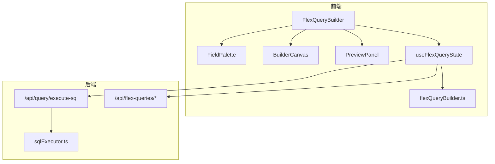
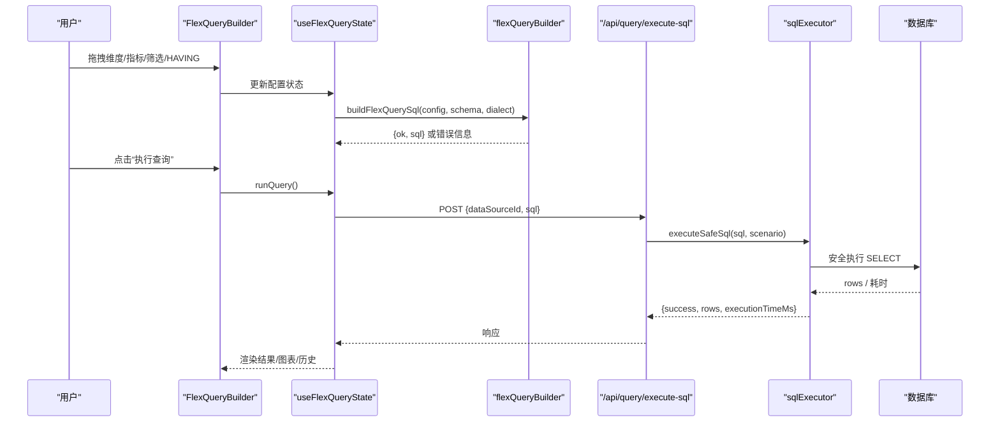
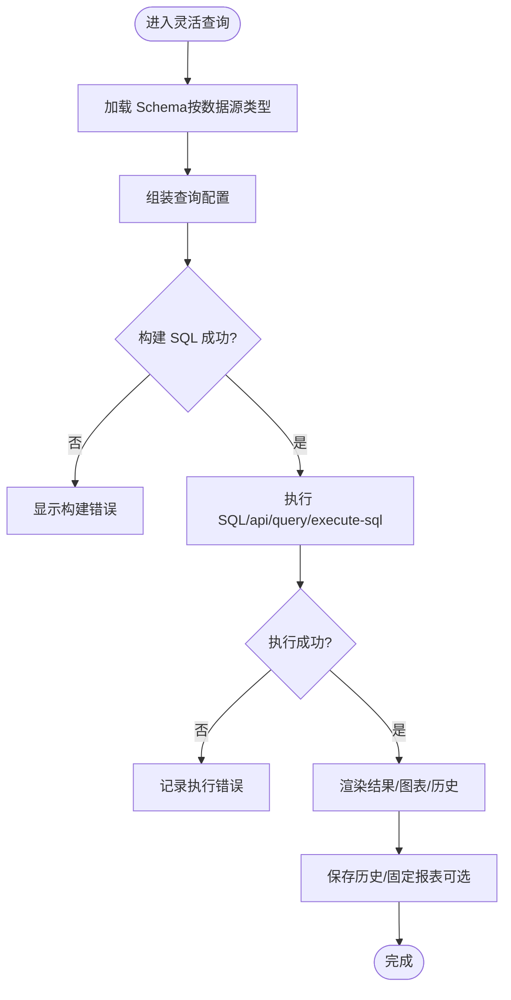
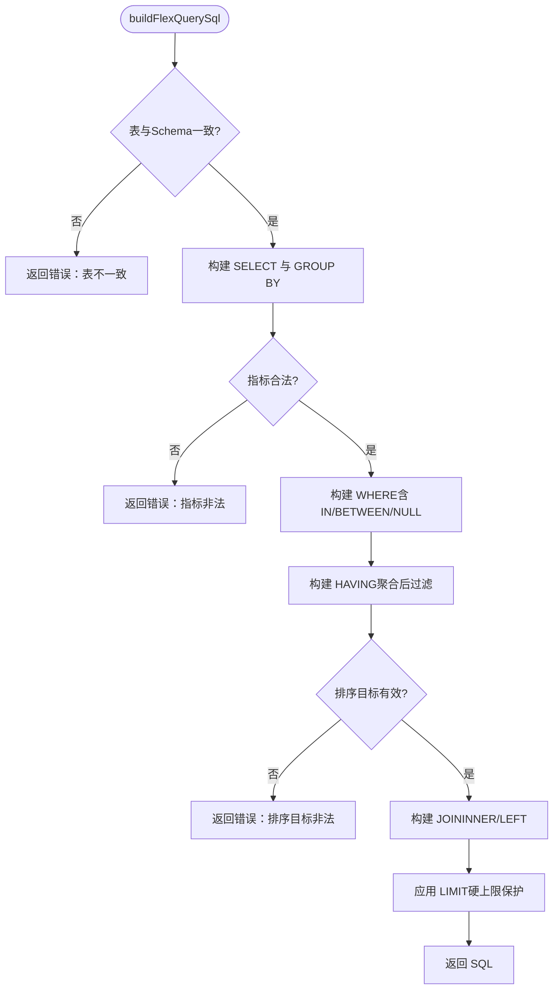
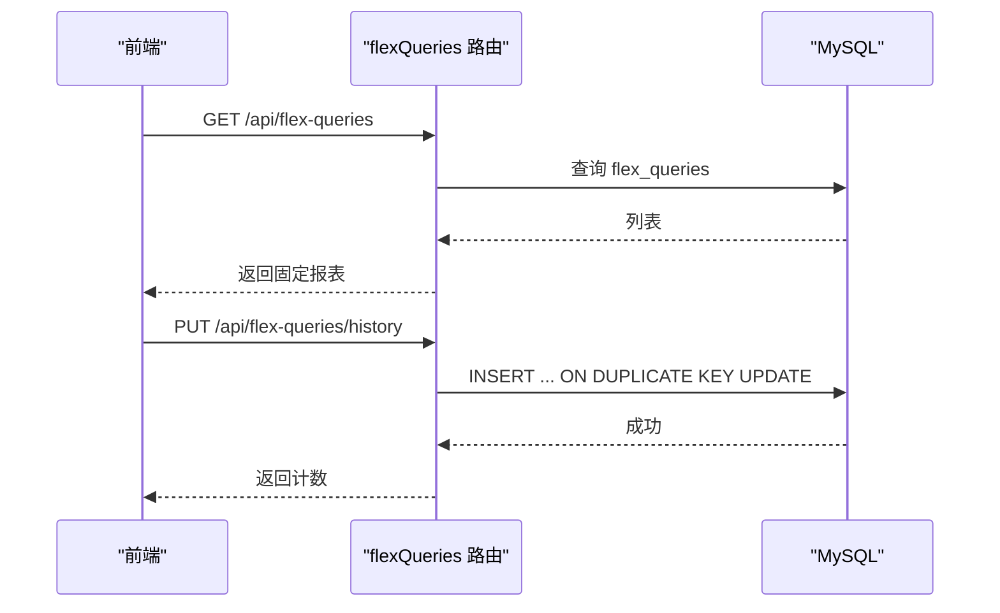
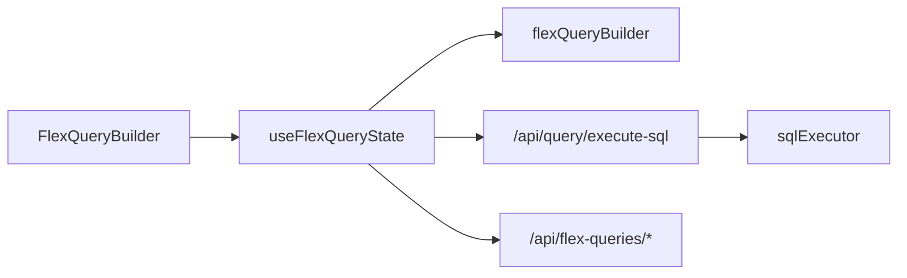

# 灵活查询构建器

<cite>
**本文引用的文件**
- [README.md](file://README.md)
- [FlexQueryBuilder.tsx](file://src/components/flexquery/FlexQueryBuilder.tsx)
- [useFlexQueryState.ts](file://src/components/flexquery/hooks/useFlexQueryState.ts)
- [BuilderCanvas.tsx](file://src/components/flexquery/BuilderCanvas.tsx)
- [FieldPalette.tsx](file://src/components/flexquery/FieldPalette.tsx)
- [flexQueryBuilder.ts](file://src/utils/flexQueryBuilder.ts)
- [flexQueries.ts](file://server/routes/flexQueries.ts)
- [query.ts](file://server/routes/query.ts)
- [sqlExecutor.ts](file://server/query/sqlExecutor.ts)
</cite>

## 目录
1. [简介](#简介)
2. [项目结构](#项目结构)
3. [核心组件](#核心组件)
4. [架构总览](#架构总览)
5. [详细组件分析](#详细组件分析)
6. [依赖关系分析](#依赖关系分析)
7. [性能考量](#性能考量)
8. [故障排查指南](#故障排查指南)
9. [结论](#结论)

## 简介
本系统提供“灵活查询”能力：用户通过拖拽维度、指标、筛选与 HAVING，可视化地构建 SQL，并在真实数据库上执行，得到结果后可导出 CSV、固化到看板或保存为团队共享的固定报表。该能力覆盖前端交互、SQL 构建、服务端持久化与安全执行全链路，兼顾易用性与安全性。

## 项目结构
灵活查询由前后端协同实现：
- 前端：React 组件拆分（上帝组件 + 三个子面板）+ 状态 Hook，负责 Schema 加载、配置构建、SQL 预览与执行、结果展示与持久化。
- 后端：Express 路由提供固定报表与历史持久化；通用 SQL 执行走安全执行层，确保只读、白名单、敏感过滤、行级权限与超时限制。

图表来源
- [FlexQueryBuilder.tsx:10-242](file://src/components/flexquery/FlexQueryBuilder.tsx#L10-L242)
- [useFlexQueryState.ts:68-91](file://src/components/flexquery/hooks/useFlexQueryState.ts#L68-L91)
- [useFlexQueryState.ts:367-405](file://src/components/flexquery/hooks/useFlexQueryState.ts#L367-L405)
- [flexQueryBuilder.ts:163-311](file://src/utils/flexQueryBuilder.ts#L163-L311)
- [query.ts:1-18](file://server/routes/query.ts#L1-L18)
- [sqlExecutor.ts:1-10](file://server/query/sqlExecutor.ts#L1-L10)

章节来源
- [README.md:40-48](file://README.md#L40-L48)
- [FlexQueryBuilder.tsx:10-242](file://src/components/flexquery/FlexQueryBuilder.tsx#L10-L242)

## 核心组件
- FlexQueryBuilder：顶层容器，装配数据源切换、能力兜底与三栏布局（字段区/配置区/结果区）。
- FieldPalette：表选择、字段列表、搜索与关联表配置（JOIN），支持点击或拖拽添加维度/指标/筛选/HAVING。
- BuilderCanvas：拖放目标区、WHERE/HAVING 条件编辑、排序与行数设置、SQL 预览与执行按钮。
- PreviewPanel：结果表格/图表、占比快速计算、透视图、CSV 导出、固化看板、保存固定报表与历史管理。
- useFlexQueryState：集中状态与行为（Schema 加载、SQL 构建、执行、结果处理、持久化、迁移兼容）。
- flexQueryBuilder：纯函数 SQL 构建器，校验并生成 SELECT-only 的聚合 SQL，含金额单位换算、多表 JOIN、HAVING、排序等。
- 后端路由：flex-queries 提供固定报表与历史持久化；execute-sql 调用安全执行层执行 SQL。

章节来源
- [FlexQueryBuilder.tsx:10-242](file://src/components/flexquery/FlexQueryBuilder.tsx#L10-L242)
- [FieldPalette.tsx:57-249](file://src/components/flexquery/FieldPalette.tsx#L57-L249)
- [BuilderCanvas.tsx:50-476](file://src/components/flexquery/BuilderCanvas.tsx#L50-L476)
- [PreviewPanel.tsx:44-200](file://src/components/flexquery/PreviewPanel.tsx#L44-L200)
- [useFlexQueryState.ts:46-637](file://src/components/flexquery/hooks/useFlexQueryState.ts#L46-L637)
- [flexQueryBuilder.ts:1-312](file://src/utils/flexQueryBuilder.ts#L1-L312)
- [flexQueries.ts:1-203](file://server/routes/flexQueries.ts#L1-L203)
- [query.ts:1-18](file://server/routes/query.ts#L1-L18)
- [sqlExecutor.ts:1-10](file://server/query/sqlExecutor.ts#L1-L10)

## 架构总览
灵活查询的执行路径分为“前端构建 → 后端执行 → 安全校验 → 返回结果”，同时支持“固定报表/历史”的持久化。

图表来源
- [useFlexQueryState.ts:367-405](file://src/components/flexquery/hooks/useFlexQueryState.ts#L367-L405)
- [flexQueryBuilder.ts:163-311](file://src/utils/flexQueryBuilder.ts#L163-L311)
- [query.ts:1-18](file://server/routes/query.ts#L1-L18)
- [sqlExecutor.ts:1-10](file://server/query/sqlExecutor.ts#L1-L10)

## 详细组件分析

### 前端状态与流程（useFlexQueryState）
- Schema 加载：根据当前数据源类型决定方言（mysql/pg），拉取可用表与列信息。
- 配置构建：将维度、指标、筛选、HAVING、排序、LIMIT、JOIN 组合为配置对象，交由纯函数生成 SQL。
- 执行与结果：调用统一执行接口，记录执行时间与错误，维护最近查询历史（去重与上限）。
- 持久化：固定报表与服务端历史在初始化时进行本地到服务端的迁移，并拉取权威数据。
- 快速计算：占比追加列、透视表（两维一指标）、CSV 导出走统一通道。

图表来源
- [useFlexQueryState.ts:68-91](file://src/components/flexquery/hooks/useFlexQueryState.ts#L68-L91)
- [useFlexQueryState.ts:178-192](file://src/components/flexquery/hooks/useFlexQueryState.ts#L178-L192)
- [useFlexQueryState.ts:367-405](file://src/components/flexquery/hooks/useFlexQueryState.ts#L367-L405)
- [useFlexQueryState.ts:216-330](file://src/components/flexquery/hooks/useFlexQueryState.ts#L216-L330)

章节来源
- [useFlexQueryState.ts:46-637](file://src/components/flexquery/hooks/useFlexQueryState.ts#L46-L637)

### SQL 构建器（flexQueryBuilder）
- 输入：查询配置（主表、JOIN、维度、指标、筛选、HAVING、排序、LIMIT）、表 Schema、方言、金额单位。
- 校验：标识符白名单、字段存在性、操作符合法性、值转义（IN/BETWEEN/IS NULL/IS NOT NULL）。
- 生成：SELECT/GROUP BY/WHERE/HAVING/ORDER BY/LIMIT，支持 COUNT_DISTINCT、金额单位换算、跨表引用 table.column。
- 输出：{ ok: true, sql } 或 { ok: false, error }。

图表来源
- [flexQueryBuilder.ts:163-311](file://src/utils/flexQueryBuilder.ts#L163-L311)

章节来源
- [flexQueryBuilder.ts:1-312](file://src/utils/flexQueryBuilder.ts#L1-L312)

### 固定报表与历史（flexQueries 路由）
- 固定报表：GET 全员可见（可过滤数据源），POST 保存（ADMIN/ANALYST），DELETE 本人或 ADMIN。
- 查询历史：GET/PUT 仅本人可见，整组替换，服务端兜底裁剪与校验。
- 幂等与审计：保存冲突返回 409；所有写操作写入审计日志。

图表来源
- [flexQueries.ts:94-152](file://server/routes/flexQueries.ts#L94-L152)
- [flexQueries.ts:154-200](file://server/routes/flexQueries.ts#L154-L200)

章节来源
- [flexQueries.ts:1-203](file://server/routes/flexQueries.ts#L1-L203)

### 安全执行层（sqlExecutor）
- 只读保障：仅允许 SELECT 开头语句，危险关键字拦截。
- 白名单与过滤：基于 Schema 上下文注入表白名单、敏感列过滤、行级权限谓词。
- 资源保护：连接池分级配额、场景化超时、MAX_EXECUTION_TIME 提示（MySQL）、结果行数硬上限。
- 观测与审计：执行监控、慢查询审计、EXPLAIN 防护。

章节来源
- [sqlExecutor.ts:1-200](file://server/query/sqlExecutor.ts#L1-L200)
- [query.ts:1-18](file://server/routes/query.ts#L1-L18)

## 依赖关系分析
- 前端组件依赖状态 Hook，Hook 依赖 SQL 构建器与 API 客户端。
- 后端路由解耦：flex-queries 专注持久化；execute-sql 复用通用安全执行层。
- 数据流：前端配置 → 纯函数 SQL → 后端安全执行 → 结果回传 → 前端渲染与持久化。

图表来源
- [FlexQueryBuilder.tsx:10-242](file://src/components/flexquery/FlexQueryBuilder.tsx#L10-L242)
- [useFlexQueryState.ts:367-405](file://src/components/flexquery/hooks/useFlexQueryState.ts#L367-L405)
- [flexQueryBuilder.ts:163-311](file://src/utils/flexQueryBuilder.ts#L163-L311)
- [flexQueries.ts:94-200](file://server/routes/flexQueries.ts#L94-L200)
- [sqlExecutor.ts:1-10](file://server/query/sqlExecutor.ts#L1-L10)

章节来源
- [useFlexQueryState.ts:46-637](file://src/components/flexquery/hooks/useFlexQueryState.ts#L46-L637)
- [flexQueryBuilder.ts:1-312](file://src/utils/flexQueryBuilder.ts#L1-L312)
- [flexQueries.ts:1-203](file://server/routes/flexQueries.ts#L1-L203)
- [sqlExecutor.ts:1-200](file://server/query/sqlExecutor.ts#L1-L200)

## 性能考量
- 前端：SQL 构建为纯函数，避免重复计算；结果缓存与透视/占比在客户端高效计算。
- 后端：连接池容量公式化与场景化配额，降低高并发下的争用；执行超时与 MAX_EXECUTION_TIME 防止长尾查询阻塞。
- 安全与稳定：结果行数硬上限、EXPLAIN 防护、只读与白名单减少误用风险。

[本节为通用指导，不直接分析具体文件]

## 故障排查指南
- 无法执行：检查是否选择了数据表与至少一个维度/指标；确认数据源类型支持灵活查询。
- SQL 构建失败：查看构建错误信息（如字段不存在、操作符不支持、排序目标非法）。
- 执行失败：关注执行错误与网络异常；核对数据源连通性与权限。
- 固定报表/历史未生效：检查保存/删除请求状态码（409 表示已存在），确认服务端可达。
- 慢查询/超时：适当缩小范围（增加筛选/降低 LIMIT），或调整后端场景超时与连接池参数。

章节来源
- [useFlexQueryState.ts:367-405](file://src/components/flexquery/hooks/useFlexQueryState.ts#L367-L405)
- [flexQueryBuilder.ts:163-311](file://src/utils/flexQueryBuilder.ts#L163-L311)
- [flexQueries.ts:154-200](file://server/routes/flexQueries.ts#L154-L200)
- [sqlExecutor.ts:1-200](file://server/query/sqlExecutor.ts#L1-L200)

## 结论
灵活查询构建器以“可视化配置 + 纯函数 SQL 构建 + 安全执行”为核心，既降低了复杂查询门槛，又通过多层安全与性能保障确保生产可用性。配合固定报表与历史持久化，形成从探索到沉淀的完整闭环，适合团队协作与日常数据分析。